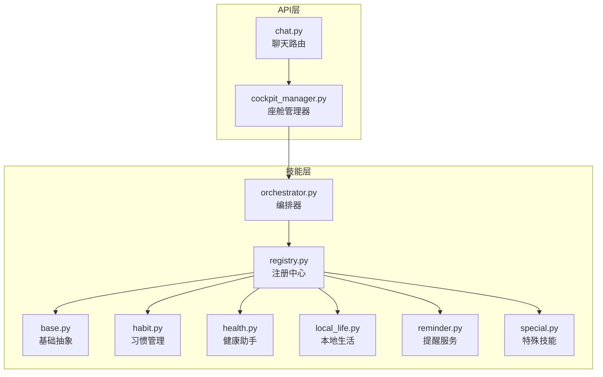
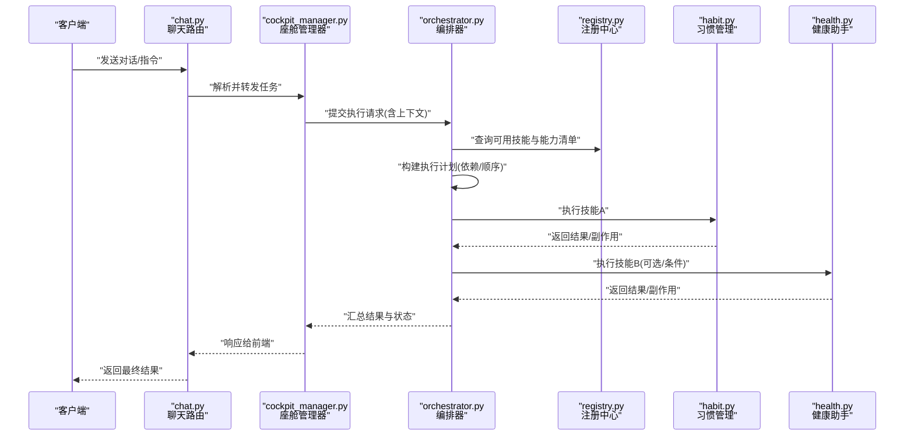
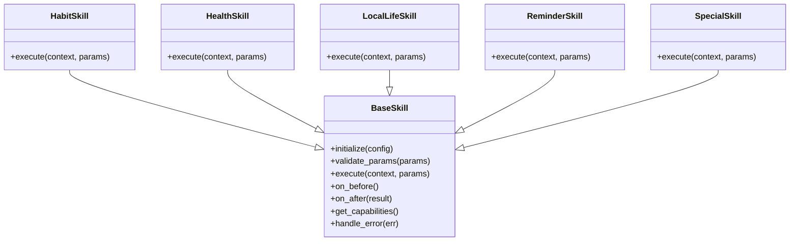
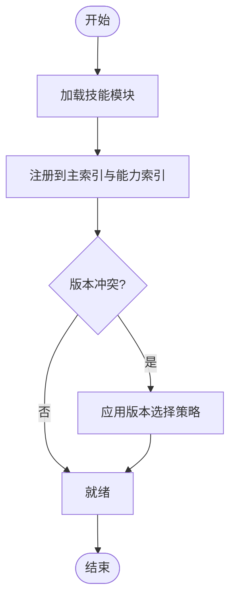
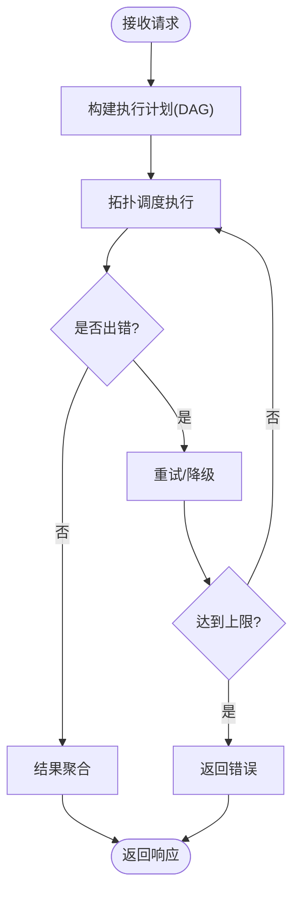
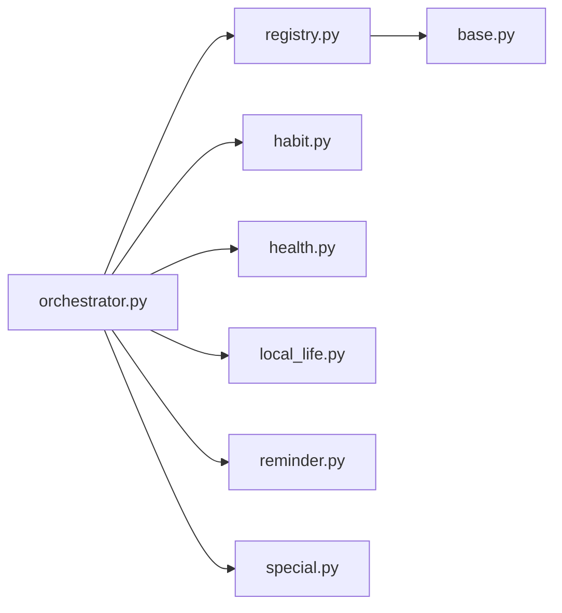
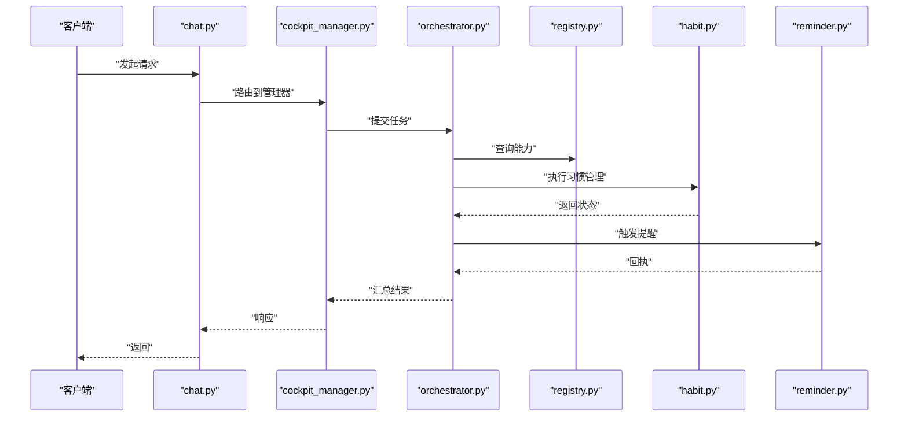

# 技能系统

<cite>
**本文引用的文件**   
- [backend_design/nexus/skills/base.py](file://backend_design/nexus/skills/base.py)
- [backend_design/nexus/skills/registry.py](file://backend_design/nexus/skills/registry.py)
- [backend_design/nexus/skills/orchestrator.py](file://backend_design/nexus/skills/orchestrator.py)
- [backend_design/nexus/skills/habit.py](file://backend_design/nexus/skills/habit.py)
- [backend_design/nexus/skills/health.py](file://backend_design/nexus/skills/health.py)
- [backend_design/nexus/skills/local_life.py](file://backend_design/nexus/skills/local_life.py)
- [backend_design/nexus/skills/reminder.py](file://backend_design/nexus/skills/reminder.py)
- [backend_design/nexus/skills/special.py](file://backend_design/nexus/skills/special.py)
- [backend_design/nexus/skills/__init__.py](file://backend_design/nexus/skills/__init__.py)
- [backend_design/nexus/core/cockpit_manager.py](file://backend_design/nexus/core/cockpit_manager.py)
- [backend_design/nexus/api/routes/chat.py](file://backend_design/nexus/api/routes/chat.py)
- [backend_design/nexus/models/state.py](file://backend_design/nexus/models/state.py)
- [backend_design/nexus/observability/metrics.py](file://backend_design/nexus/observability/metrics.py)
</cite>

## 目录
1. [简介](#简介)
2. [项目结构](#项目结构)
3. [核心组件](#核心组件)
4. [架构总览](#架构总览)
5. [详细组件分析](#详细组件分析)
6. [依赖关系分析](#依赖关系分析)
7. [性能考虑](#性能考虑)
8. [故障排查指南](#故障排查指南)
9. [结论](#结论)
10. [附录](#附录)

## 简介
本技术文档聚焦于 NexusCockpit 的技能系统，系统性阐述以下主题：
- 技能注册机制与生命周期
- 编排器（Orchestrator）的工作原理与执行顺序控制
- 基础技能框架与扩展点
- 内置技能（习惯管理、健康助手、本地生活、提醒服务、特殊技能）的功能特性与使用方法
- 自定义技能插件开发示例与最佳实践
- 技能间依赖关系与执行顺序控制策略
- 技能测试方法与性能监控方案

目标读者包括后端开发者、集成工程师与运维人员。

## 项目结构
技能系统位于 backend_design/nexus/skills 目录下，围绕“基础抽象 + 注册中心 + 编排器 + 具体技能”的层次组织。上层通过 API 路由与 CockpitManager 调用编排器，编排器根据意图与上下文调度具体技能执行。

图表来源
- [backend_design/nexus/api/routes/chat.py](file://backend_design/nexus/api/routes/chat.py)
- [backend_design/nexus/core/cockpit_manager.py](file://backend_design/nexus/core/cockpit_manager.py)
- [backend_design/nexus/skills/orchestrator.py](file://backend_design/nexus/skills/orchestrator.py)
- [backend_design/nexus/skills/registry.py](file://backend_design/nexus/skills/registry.py)
- [backend_design/nexus/skills/base.py](file://backend_design/nexus/skills/base.py)
- [backend_design/nexus/skills/habit.py](file://backend_design/nexus/skills/habit.py)
- [backend_design/nexus/skills/health.py](file://backend_design/nexus/skills/health.py)
- [backend_design/nexus/skills/local_life.py](file://backend_design/nexus/skills/local_life.py)
- [backend_design/nexus/skills/reminder.py](file://backend_design/nexus/skills/reminder.py)
- [backend_design/nexus/skills/special.py](file://backend_design/nexus/skills/special.py)

章节来源
- [backend_design/nexus/skills/__init__.py](file://backend_design/nexus/skills/__init__.py)
- [backend_design/nexus/core/cockpit_manager.py](file://backend_design/nexus/core/cockpit_manager.py)
- [backend_design/nexus/api/routes/chat.py](file://backend_design/nexus/api/routes/chat.py)

## 核心组件
本节从代码层面解析技能系统的核心构件及其职责边界。

- 基础抽象（BaseSkill）
  - 定义技能的统一接口契约，包含初始化、能力声明、参数校验、执行入口、结果封装等。
  - 提供可复用的钩子方法，便于子类实现领域逻辑。
  - 支持错误码与异常映射，保证上层一致的错误处理体验。

- 注册中心（SkillRegistry）
  - 维护技能名称到实现的映射，负责技能发现、加载与版本兼容检查。
  - 提供按标签或类别筛选的能力清单，供编排器决策使用。
  - 支持动态注册与热更新（在进程内），并记录注册事件用于审计。

- 编排器（SkillOrchestrator）
  - 接收来自上层的任务请求，结合上下文与意图进行技能选择与排序。
  - 基于依赖图与优先级规则构建执行计划，支持串行、并行与条件分支。
  - 负责资源隔离、超时控制、重试与熔断降级，以及指标上报。

- 内置技能
  - 习惯管理：用户行为偏好与周期任务的建模与触发。
  - 健康助手：健康数据接入、分析与建议生成。
  - 本地生活：周边服务检索、推荐与预约。
  - 提醒服务：定时/延时提醒、事件驱动通知。
  - 特殊技能：跨域复合能力或一次性任务编排。

章节来源
- [backend_design/nexus/skills/base.py](file://backend_design/nexus/skills/base.py)
- [backend_design/nexus/skills/registry.py](file://backend_design/nexus/skills/registry.py)
- [backend_design/nexus/skills/orchestrator.py](file://backend_design/nexus/skills/orchestrator.py)
- [backend_design/nexus/skills/habit.py](file://backend_design/nexus/skills/habit.py)
- [backend_design/nexus/skills/health.py](file://backend_design/nexus/skills/health.py)
- [backend_design/nexus/skills/local_life.py](file://backend_design/nexus/skills/local_life.py)
- [backend_design/nexus/skills/reminder.py](file://backend_design/nexus/skills/reminder.py)
- [backend_design/nexus/skills/special.py](file://backend_design/nexus/skills/special.py)

## 架构总览
下图展示从 API 到编排器再到具体技能的端到端调用链路与关键交互点。

图表来源
- [backend_design/nexus/api/routes/chat.py](file://backend_design/nexus/api/routes/chat.py)
- [backend_design/nexus/core/cockpit_manager.py](file://backend_design/nexus/core/cockpit_manager.py)
- [backend_design/nexus/skills/orchestrator.py](file://backend_design/nexus/skills/orchestrator.py)
- [backend_design/nexus/skills/registry.py](file://backend_design/nexus/skills/registry.py)
- [backend_design/nexus/skills/habit.py](file://backend_design/nexus/skills/habit.py)
- [backend_design/nexus/skills/health.py](file://backend_design/nexus/skills/health.py)

## 详细组件分析

### 基础技能框架（BaseSkill）
- 设计要点
  - 统一的初始化流程：配置注入、依赖准备、资源校验。
  - 能力描述元数据：名称、版本、标签、输入输出 Schema、权限要求。
  - 执行入口：参数校验、前置钩子、业务执行、后置钩子、结果标准化。
  - 错误模型：将领域异常转换为标准错误码与消息，便于上层聚合与重试。
- 扩展点
  - 重写执行入口以嵌入领域逻辑。
  - 利用钩子在前后置阶段完成日志、埋点、缓存读写等横切关注点。
- 复杂度与性能
  - 典型执行路径为 O(1) 的钩子调用与 O(n) 的参数校验；可通过懒加载与缓存优化 IO 密集型操作。

图表来源
- [backend_design/nexus/skills/base.py](file://backend_design/nexus/skills/base.py)
- [backend_design/nexus/skills/habit.py](file://backend_design/nexus/skills/habit.py)
- [backend_design/nexus/skills/health.py](file://backend_design/nexus/skills/health.py)
- [backend_design/nexus/skills/local_life.py](file://backend_design/nexus/skills/local_life.py)
- [backend_design/nexus/skills/reminder.py](file://backend_design/nexus/skills/reminder.py)
- [backend_design/nexus/skills/special.py](file://backend_design/nexus/skills/special.py)

章节来源
- [backend_design/nexus/skills/base.py](file://backend_design/nexus/skills/base.py)

### 注册中心（SkillRegistry）
- 功能职责
  - 技能发现：扫描已加载模块并自动注册。
  - 能力索引：按标签/类别建立索引，加速编排期决策。
  - 版本兼容：对同名不同版本进行冲突检测与选择策略。
  - 运行时变更：支持热插拔与回滚。
- 数据结构
  - 主索引：技能名 -> 实例引用
  - 能力索引：标签 -> 技能集合
  - 元数据：版本、作者、许可证、依赖声明
- 并发与一致性
  - 读多写少场景下采用读写锁保护索引结构。
  - 注册事件发布至内部总线，供编排器与监控消费。

图表来源
- [backend_design/nexus/skills/registry.py](file://backend_design/nexus/skills/registry.py)

章节来源
- [backend_design/nexus/skills/registry.py](file://backend_design/nexus/skills/registry.py)

### 编排器（SkillOrchestrator）
- 工作流
  - 输入：用户意图、上下文、约束（超时、重试、资源配额）。
  - 规划：基于依赖图与优先级构建 DAG，确定串行/并行/条件分支。
  - 执行：按拓扑序调度，失败节点触发重试或降级路径。
  - 聚合：合并各技能输出，形成统一响应。
- 执行顺序控制
  - 显式依赖声明：技能 A 依赖 B 的输出时，B 先执行。
  - 优先级权重：同层节点按权重排序。
  - 条件分支：根据中间结果决定是否跳过某条路径。
- 容错与观测
  - 超时、熔断、限流、重试退避。
  - 指标采集：耗时、成功率、错误分类、吞吐。

图表来源
- [backend_design/nexus/skills/orchestrator.py](file://backend_design/nexus/skills/orchestrator.py)

章节来源
- [backend_design/nexus/skills/orchestrator.py](file://backend_design/nexus/skills/orchestrator.py)

### 内置技能详解

#### 习惯管理（Habit）
- 功能特性
  - 习惯建模：周期性、触发条件、阈值与反馈。
  - 行为追踪：采集用户行为信号，计算达成率与趋势。
  - 干预策略：推送提醒、调整难度、奖励机制。
- 使用方法
  - 创建/更新习惯：传入名称、周期、目标值与触发条件。
  - 查询进度：按时间窗口统计与可视化。
  - 自动化联动：与其他技能组合（如提醒服务）形成闭环。
- 依赖与顺序
  - 通常依赖提醒服务进行触达；若涉及健康数据则依赖健康助手。

章节来源
- [backend_design/nexus/skills/habit.py](file://backend_design/nexus/skills/habit.py)

#### 健康助手（Health）
- 功能特性
  - 数据接入：对接可穿戴设备或手动录入的健康指标。
  - 分析引擎：趋势分析、异常检测、个性化建议。
  - 隐私与安全：数据脱敏、访问控制与审计。
- 使用方法
  - 上传指标：时间序列数据与元数据。
  - 获取报告：日/周/月维度总结与建议。
  - 订阅告警：阈值触发后联动提醒服务。
- 依赖与顺序
  - 可与习惯管理协作，依据健康指标调整习惯目标。

章节来源
- [backend_design/nexus/skills/health.py](file://backend_design/nexus/skills/health.py)

#### 本地生活（LocalLife）
- 功能特性
  - 服务检索：基于位置与偏好的商家/活动推荐。
  - 预订与支付：对接第三方平台完成下单。
  - 评价与收藏：用户反馈沉淀与个性化提升。
- 使用方法
  - 搜索：关键词、距离、评分、价格区间。
  - 预订：选择时段、人数、附加需求。
  - 订单管理：查看历史、退款与售后。
- 依赖与顺序
  - 常与提醒服务配合，在出行前推送导航与入场信息。

章节来源
- [backend_design/nexus/skills/local_life.py](file://backend_design/nexus/skills/local_life.py)

#### 提醒服务（Reminder）
- 功能特性
  - 定时/延时：绝对时间与相对延迟。
  - 事件驱动：外部事件触发（如健康指标异常）。
  - 渠道分发：站内消息、短信、邮件、语音播报。
- 使用方法
  - 创建提醒：标题、内容、触发时间/条件、渠道。
  - 管理提醒：列表、编辑、取消、批量操作。
  - 回调处理：成功/失败回调与重试策略。
- 依赖与顺序
  - 被其他技能作为下游触达通道；自身不依赖上游业务数据。

章节来源
- [backend_design/nexus/skills/reminder.py](file://backend_design/nexus/skills/reminder.py)

#### 特殊技能（Special）
- 功能特性
  - 复杂编排：跨多个子技能的组合任务。
  - 一次性任务：临时性、非通用能力封装。
  - 实验特性：灰度发布与快速迭代。
- 使用方法
  - 定义任务模板：步骤、条件、回滚策略。
  - 运行与监控：查看执行轨迹与中间产物。
  - 版本管理：灰度切换与回滚。
- 依赖与顺序
  - 可能依赖任意内置技能，需明确声明依赖与顺序。

章节来源
- [backend_design/nexus/skills/special.py](file://backend_design/nexus/skills/special.py)

### 自定义技能插件开发示例
- 步骤概览
  - 继承基础抽象类，实现必要方法。
  - 声明能力元数据（名称、版本、标签、Schema）。
  - 在注册中心中注册新技能。
  - 编写单元测试与集成测试。
  - 启用并验证端到端流程。
- 关键点
  - 参数校验：确保输入安全与类型正确。
  - 错误处理：抛出标准错误码，便于编排器统一处理。
  - 幂等性：对可重试操作保证幂等。
  - 可观测性：埋点关键指标与链路追踪。
- 参考路径
  - 基础抽象与扩展点：[backend_design/nexus/skills/base.py](file://backend_design/nexus/skills/base.py)
  - 注册方式与索引结构：[backend_design/nexus/skills/registry.py](file://backend_design/nexus/skills/registry.py)
  - 编排期如何消费能力清单：[backend_design/nexus/skills/orchestrator.py](file://backend_design/nexus/skills/orchestrator.py)

章节来源
- [backend_design/nexus/skills/base.py](file://backend_design/nexus/skills/base.py)
- [backend_design/nexus/skills/registry.py](file://backend_design/nexus/skills/registry.py)
- [backend_design/nexus/skills/orchestrator.py](file://backend_design/nexus/skills/orchestrator.py)

## 依赖关系分析
- 组件耦合
  - 编排器强依赖注册中心提供的能力清单与元数据。
  - 具体技能仅依赖基础抽象与必要的第三方服务（如数据库、消息队列）。
- 直接/间接依赖
  - 编排器 -> 注册中心 -> 基础抽象
  - 编排器 -> 具体技能（通过注册中心查找）
- 潜在循环依赖
  - 应避免技能之间互相强依赖；如需协作，通过编排器的 DAG 解耦。
- 外部依赖
  - 存储（持久化）、消息总线（异步任务）、外部 API（第三方服务）。

图表来源
- [backend_design/nexus/skills/orchestrator.py](file://backend_design/nexus/skills/orchestrator.py)
- [backend_design/nexus/skills/registry.py](file://backend_design/nexus/skills/registry.py)
- [backend_design/nexus/skills/base.py](file://backend_design/nexus/skills/base.py)
- [backend_design/nexus/skills/habit.py](file://backend_design/nexus/skills/habit.py)
- [backend_design/nexus/skills/health.py](file://backend_design/nexus/skills/health.py)
- [backend_design/nexus/skills/local_life.py](file://backend_design/nexus/skills/local_life.py)
- [backend_design/nexus/skills/reminder.py](file://backend_design/nexus/skills/reminder.py)
- [backend_design/nexus/skills/special.py](file://backend_design/nexus/skills/special.py)

章节来源
- [backend_design/nexus/skills/orchestrator.py](file://backend_design/nexus/skills/orchestrator.py)
- [backend_design/nexus/skills/registry.py](file://backend_design/nexus/skills/registry.py)

## 性能考虑
- 执行路径优化
  - 减少不必要的同步 IO，优先使用缓存与批处理。
  - 对长耗时任务采用异步与分片处理。
- 并发与资源
  - 合理设置线程池/协程池大小，避免资源争用。
  - 对热点技能实施连接池与对象复用。
- 容错与降级
  - 超时与熔断防止雪崩；重试采用指数退避与抖动。
  - 降级策略：返回缓存或默认值，保障用户体验。
- 观测与调优
  - 采集关键指标：P95/P99 延迟、错误率、吞吐、队列积压。
  - 链路追踪定位瓶颈；定期压测与容量规划。

章节来源
- [backend_design/nexus/observability/metrics.py](file://backend_design/nexus/observability/metrics.py)

## 故障排查指南
- 常见问题
  - 技能未注册：检查注册中心初始化与模块加载路径。
  - 依赖缺失：确认上游技能输出字段与下游输入 Schema 匹配。
  - 超时/熔断：查看编排器配置与下游服务健康状态。
  - 重复执行：检查幂等键与去重策略。
- 诊断步骤
  - 查看编排器执行轨迹与中间结果。
  - 核对注册中心能力清单与版本信息。
  - 检查指标面板与日志关键字段。
- 恢复措施
  - 重启编排器或热重载注册中心。
  - 回滚有问题的技能版本。
  - 清理阻塞任务与死信队列。

章节来源
- [backend_design/nexus/models/state.py](file://backend_design/nexus/models/state.py)
- [backend_design/nexus/observability/metrics.py](file://backend_design/nexus/observability/metrics.py)

## 结论
NexusCockpit 的技能系统通过清晰的分层与解耦设计，实现了高可扩展与高可用的技能编排能力。基础抽象与注册中心提供了稳定的扩展点，编排器负责复杂的执行计划与容错策略。内置技能覆盖了用户日常高频场景，同时支持自定义插件快速落地。借助完善的观测与测试体系，可在生产环境中稳定演进。

## 附录

### 端到端调用时序（API 到技能）

图表来源
- [backend_design/nexus/api/routes/chat.py](file://backend_design/nexus/api/routes/chat.py)
- [backend_design/nexus/core/cockpit_manager.py](file://backend_design/nexus/core/cockpit_manager.py)
- [backend_design/nexus/skills/orchestrator.py](file://backend_design/nexus/skills/orchestrator.py)
- [backend_design/nexus/skills/registry.py](file://backend_design/nexus/skills/registry.py)
- [backend_design/nexus/skills/habit.py](file://backend_design/nexus/skills/habit.py)
- [backend_design/nexus/skills/reminder.py](file://backend_design/nexus/skills/reminder.py)

### 技能测试方法
- 单元测试
  - 针对每个技能的 execute 与 validate_params 编写用例，覆盖正常与异常分支。
  - 模拟外部依赖（数据库、消息队列、第三方 API）以隔离测试环境。
- 集成测试
  - 启动编排器与注册中心，验证端到端流程与依赖顺序。
  - 使用真实或沙箱环境的外部服务进行联调。
- 回归与混沌
  - 引入网络延迟、超时、错误注入，验证容错与降级策略。
  - 定期回归关键路径，确保升级不影响既有能力。

### 性能监控方案
- 指标采集
  - 编排器：任务数、平均耗时、错误率、重试次数。
  - 技能级：QPS、P95/P99 延迟、缓存命中率、外部调用耗时。
- 日志与追踪
  - 结构化日志记录关键事件与上下文。
  - 全链路追踪标识任务 ID，串联上下游调用。
- 告警与看板
  - 设定阈值告警（错误率、延迟、吞吐）。
  - Grafana 看板展示核心指标与趋势。

章节来源
- [backend_design/nexus/observability/metrics.py](file://backend_design/nexus/observability/metrics.py)