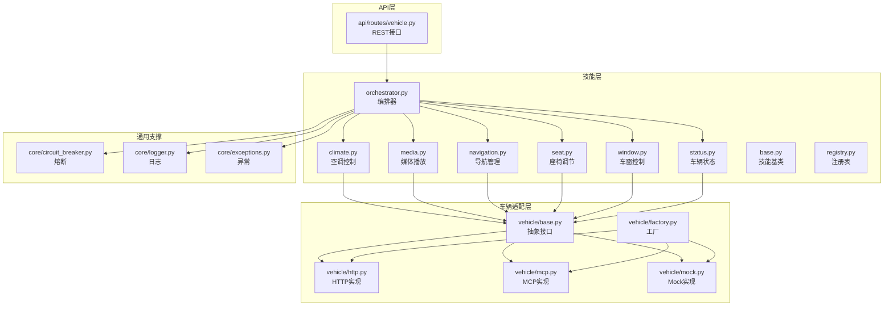
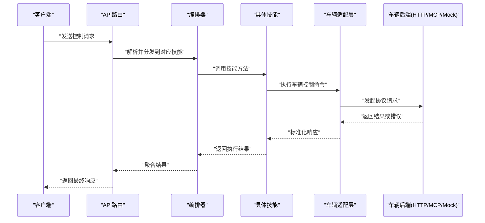
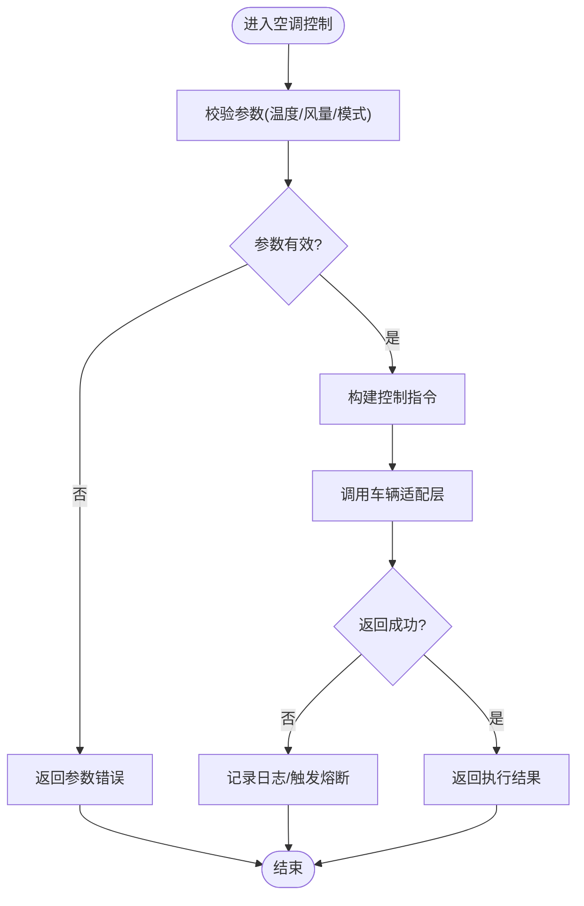
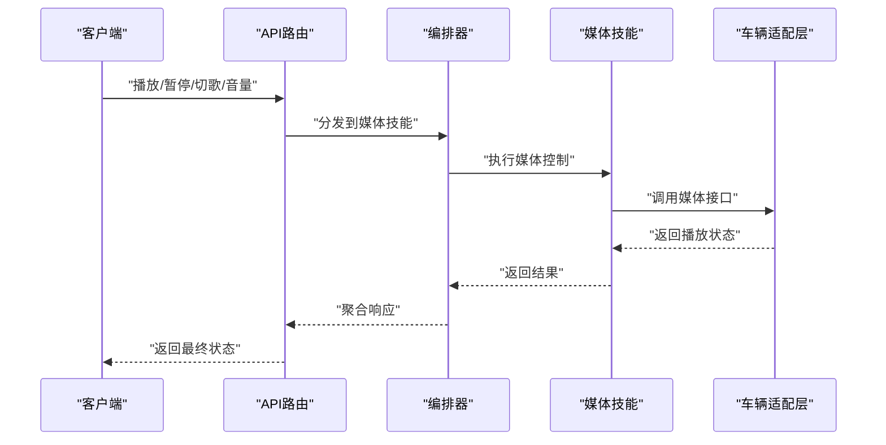
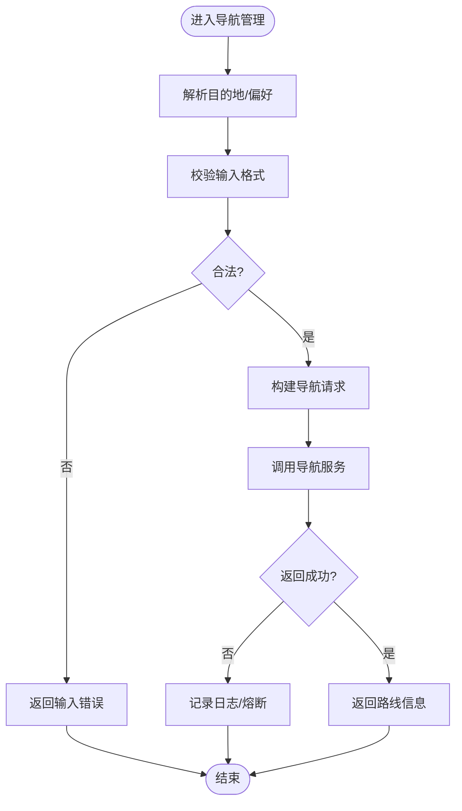
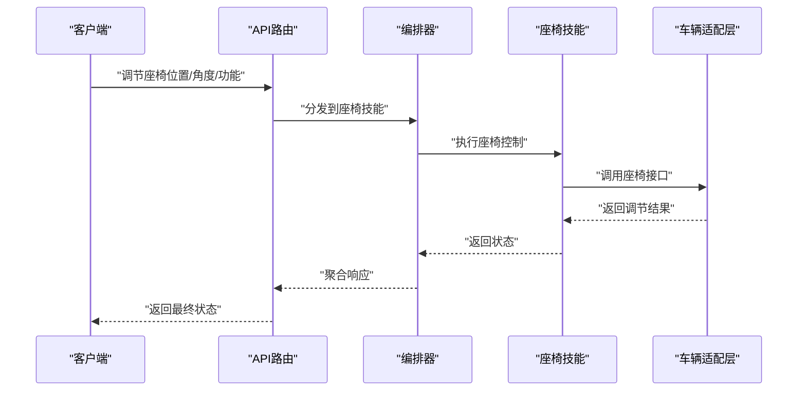
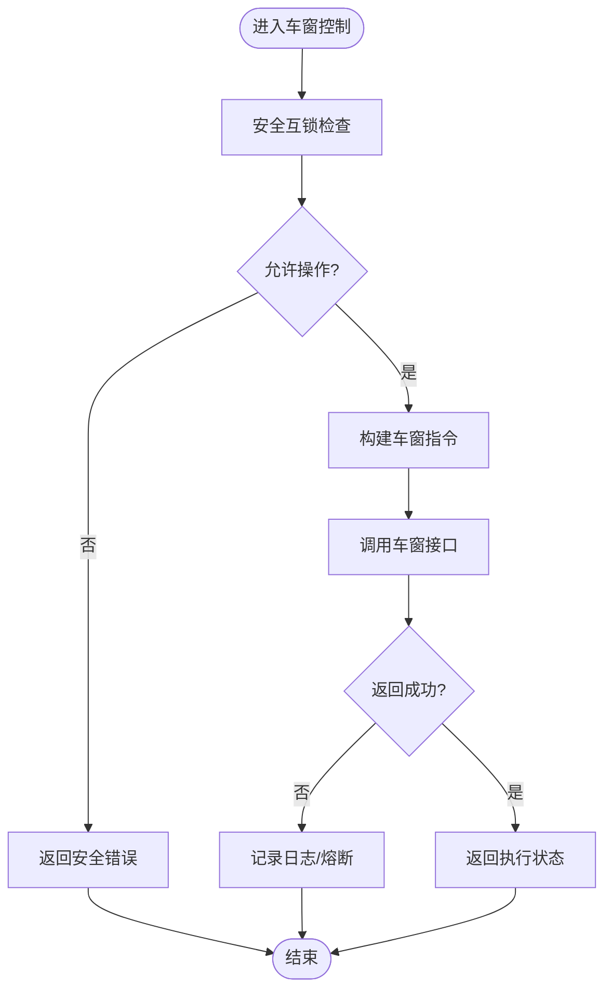
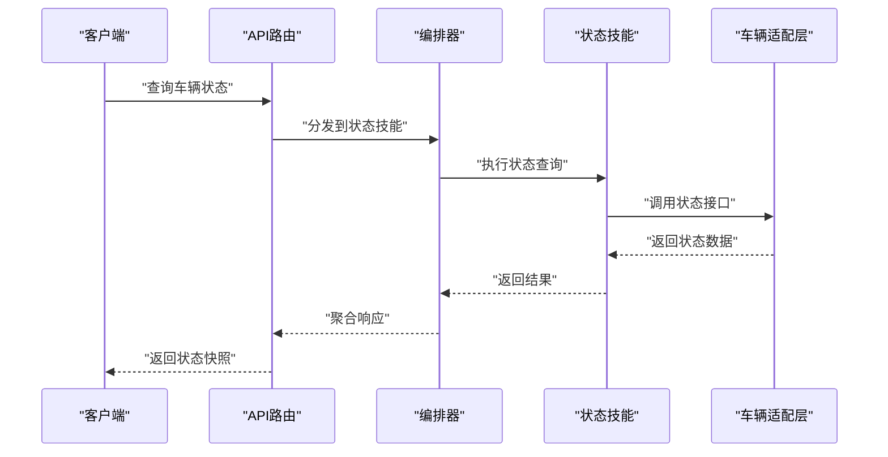
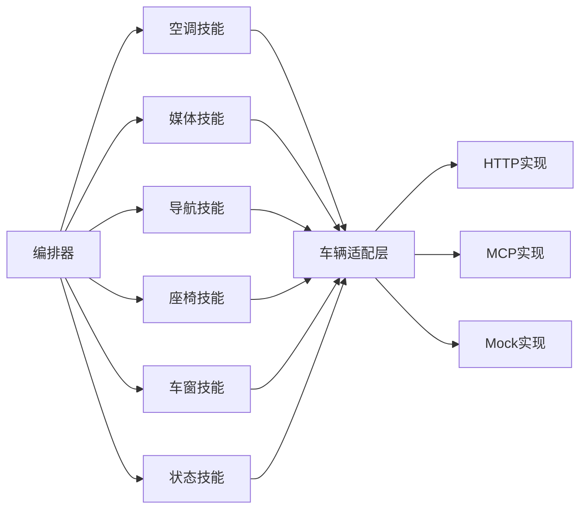

# 车辆控制技能

<cite>
**本文引用的文件**   
- [backend_design/nexus/skills/vehicle/climate.py](file://backend_design/nexus/skills/vehicle/climate.py)
- [backend_design/nexus/skills/vehicle/media.py](file://backend_design/nexus/skills/vehicle/media.py)
- [backend_design/nexus/skills/vehicle/navigation.py](file://backend_design/nexus/skills/vehicle/navigation.py)
- [backend_design/nexus/skills/vehicle/seat.py](file://backend_design/nexus/skills/vehicle/seat.py)
- [backend_design/nexus/skills/vehicle/window.py](file://backend_design/nexus/skills/vehicle/window.py)
- [backend_design/nexus/skills/vehicle/status.py](file://backend_design/nexus/skills/vehicle/status.py)
- [backend_design/nexus/skills/base.py](file://backend_design/nexus/skills/base.py)
- [backend_design/nexus/skills/orchestrator.py](file://backend_design/nexus/skills/orchestrator.py)
- [backend_design/nexus/skills/registry.py](file://backend_design/nexus/skills/registry.py)
- [backend_design/nexus/vehicle/base.py](file://backend_design/nexus/vehicle/base.py)
- [backend_design/nexus/vehicle/factory.py](file://backend_design/nexus/vehicle/factory.py)
- [backend_design/nexus/vehicle/http.py](file://backend_design/nexus/vehicle/http.py)
- [backend_design/nexus/vehicle/mcp.py](file://backend_design/nexus/vehicle/mcp.py)
- [backend_design/nexus/vehicle/mock.py](file://backend_design/nexus/vehicle/mock.py)
- [backend_design/nexus/api/routes/vehicle.py](file://backend_design/nexus/api/routes/vehicle.py)
- [backend_design/nexus/core/circuit_breaker.py](file://backend_design/nexus/core/circuit_breaker.py)
- [backend_design/nexus/core/logger.py](file://backend_design/nexus/core/logger.py)
- [backend_design/nexus/core/exceptions.py](file://backend_design/nexus/core/exceptions.py)
</cite>

## 目录
1. [简介](#简介)
2. [项目结构](#项目结构)
3. [核心组件](#核心组件)
4. [架构总览](#架构总览)
5. [详细组件分析](#详细组件分析)
6. [依赖分析](#依赖分析)
7. [性能考虑](#性能考虑)
8. [故障排查指南](#故障排查指南)
9. [结论](#结论)
10. [附录](#附录)

## 简介
本技术文档聚焦于 NexusCockpit 的车辆控制技能，覆盖空调控制、媒体播放、导航管理、座椅调节、车窗控制和车辆状态查询等核心能力。文档从系统架构、组件关系、数据流与处理逻辑、API 接口与参数、执行流程、错误处理、性能优化与故障排查等方面展开，帮助开发者快速理解并正确使用这些技能进行车辆控制操作。

## 项目结构
车辆控制相关代码主要分布在以下模块：
- 技能层：skills/vehicle 下按功能划分（空调、媒体、导航、座椅、车窗、状态）
- 技能基座：skills/base.py 提供统一技能抽象与注册机制
- 编排器：skills/orchestrator.py 负责多技能编排与调度
- 注册表：skills/registry.py 维护技能发现与加载
- 车辆适配层：vehicle/* 提供 HTTP/MCP/Mock 等多种后端实现
- API 路由：api/routes/vehicle.py 暴露外部调用入口
- 通用支撑：core/* 包含熔断、日志、异常等基础能力

图表来源
- [backend_design/nexus/skills/vehicle/climate.py](file://backend_design/nexus/skills/vehicle/climate.py)
- [backend_design/nexus/skills/vehicle/media.py](file://backend_design/nexus/skills/vehicle/media.py)
- [backend_design/nexus/skills/vehicle/navigation.py](file://backend_design/nexus/skills/vehicle/navigation.py)
- [backend_design/nexus/skills/vehicle/seat.py](file://backend_design/nexus/skills/vehicle/seat.py)
- [backend_design/nexus/skills/vehicle/window.py](file://backend_design/nexus/skills/vehicle/window.py)
- [backend_design/nexus/skills/vehicle/status.py](file://backend_design/nexus/skills/vehicle/status.py)
- [backend_design/nexus/skills/base.py](file://backend_design/nexus/skills/base.py)
- [backend_design/nexus/skills/orchestrator.py](file://backend_design/nexus/skills/orchestrator.py)
- [backend_design/nexus/skills/registry.py](file://backend_design/nexus/skills/registry.py)
- [backend_design/nexus/vehicle/base.py](file://backend_design/nexus/vehicle/base.py)
- [backend_design/nexus/vehicle/factory.py](file://backend_design/nexus/vehicle/factory.py)
- [backend_design/nexus/vehicle/http.py](file://backend_design/nexus/vehicle/http.py)
- [backend_design/nexus/vehicle/mcp.py](file://backend_design/nexus/vehicle/mcp.py)
- [backend_design/nexus/vehicle/mock.py](file://backend_design/nexus/vehicle/mock.py)
- [backend_design/nexus/api/routes/vehicle.py](file://backend_design/nexus/api/routes/vehicle.py)
- [backend_design/nexus/core/circuit_breaker.py](file://backend_design/nexus/core/circuit_breaker.py)
- [backend_design/nexus/core/logger.py](file://backend_design/nexus/core/logger.py)
- [backend_design/nexus/core/exceptions.py](file://backend_design/nexus/core/exceptions.py)

章节来源
- [backend_design/nexus/skills/vehicle/climate.py](file://backend_design/nexus/skills/vehicle/climate.py)
- [backend_design/nexus/skills/vehicle/media.py](file://backend_design/nexus/skills/vehicle/media.py)
- [backend_design/nexus/skills/vehicle/navigation.py](file://backend_design/nexus/skills/vehicle/navigation.py)
- [backend_design/nexus/skills/vehicle/seat.py](file://backend_design/nexus/skills/vehicle/seat.py)
- [backend_design/nexus/skills/vehicle/window.py](file://backend_design/nexus/skills/vehicle/window.py)
- [backend_design/nexus/skills/vehicle/status.py](file://backend_design/nexus/skills/vehicle/status.py)
- [backend_design/nexus/skills/base.py](file://backend_design/nexus/skills/base.py)
- [backend_design/nexus/skills/orchestrator.py](file://backend_design/nexus/skills/orchestrator.py)
- [backend_design/nexus/skills/registry.py](file://backend_design/nexus/skills/registry.py)
- [backend_design/nexus/vehicle/base.py](file://backend_design/nexus/vehicle/base.py)
- [backend_design/nexus/vehicle/factory.py](file://backend_design/nexus/vehicle/factory.py)
- [backend_design/nexus/vehicle/http.py](file://backend_design/nexus/vehicle/http.py)
- [backend_design/nexus/vehicle/mcp.py](file://backend_design/nexus/vehicle/mcp.py)
- [backend_design/nexus/vehicle/mock.py](file://backend_design/nexus/vehicle/mock.py)
- [backend_design/nexus/api/routes/vehicle.py](file://backend_design/nexus/api/routes/vehicle.py)
- [backend_design/nexus/core/circuit_breaker.py](file://backend_design/nexus/core/circuit_breaker.py)
- [backend_design/nexus/core/logger.py](file://backend_design/nexus/core/logger.py)
- [backend_design/nexus/core/exceptions.py](file://backend_design/nexus/core/exceptions.py)

## 核心组件
- 技能基类与注册机制
  - 所有车辆技能继承自统一的技能基类，定义标准生命周期与参数校验框架
  - 通过注册表集中管理技能发现与实例化，支持动态扩展
- 编排器
  - 负责解析用户意图、选择并调用相应技能，支持并发与顺序编排
  - 集成熔断、日志与异常处理，保障稳定性
- 车辆适配层
  - 抽象出统一的车辆控制接口，屏蔽底层差异
  - 提供 HTTP、MCP、Mock 三种实现，便于开发与联调
- API 路由
  - 对外暴露 REST 接口，将请求转发至编排器与具体技能

章节来源
- [backend_design/nexus/skills/base.py](file://backend_design/nexus/skills/base.py)
- [backend_design/nexus/skills/orchestrator.py](file://backend_design/nexus/skills/orchestrator.py)
- [backend_design/nexus/skills/registry.py](file://backend_design/nexus/skills/registry.py)
- [backend_design/nexus/vehicle/base.py](file://backend_design/nexus/vehicle/base.py)
- [backend_design/nexus/vehicle/factory.py](file://backend_design/nexus/vehicle/factory.py)
- [backend_design/nexus/vehicle/http.py](file://backend_design/nexus/vehicle/http.py)
- [backend_design/nexus/vehicle/mcp.py](file://backend_design/nexus/vehicle/mcp.py)
- [backend_design/nexus/vehicle/mock.py](file://backend_design/nexus/vehicle/mock.py)
- [backend_design/nexus/api/routes/vehicle.py](file://backend_design/nexus/api/routes/vehicle.py)

## 架构总览
整体采用“API 路由 -> 编排器 -> 技能 -> 车辆适配层”的分层架构。编排器作为中枢，协调各技能执行；车辆适配层屏蔽不同后端协议差异；通用支撑模块提供熔断、日志与异常处理能力。

图表来源
- [backend_design/nexus/api/routes/vehicle.py](file://backend_design/nexus/api/routes/vehicle.py)
- [backend_design/nexus/skills/orchestrator.py](file://backend_design/nexus/skills/orchestrator.py)
- [backend_design/nexus/vehicle/base.py](file://backend_design/nexus/vehicle/base.py)
- [backend_design/nexus/vehicle/http.py](file://backend_design/nexus/vehicle/http.py)
- [backend_design/nexus/vehicle/mcp.py](file://backend_design/nexus/vehicle/mcp.py)
- [backend_design/nexus/vehicle/mock.py](file://backend_design/nexus/vehicle/mock.py)

## 详细组件分析

### 空调控制技能（Climate）
- 职责
  - 设置温度、风量、模式、风向、除雾、内/外循环等
- 典型参数
  - 温度范围、风量档位、模式枚举、风向位置、开关标志
- 执行流程
  - 参数校验 -> 构建控制指令 -> 调用车辆适配层 -> 返回状态
- 错误处理
  - 参数越界、设备不可用、超时重试、熔断降级

图表来源
- [backend_design/nexus/skills/vehicle/climate.py](file://backend_design/nexus/skills/vehicle/climate.py)
- [backend_design/nexus/vehicle/base.py](file://backend_design/nexus/vehicle/base.py)
- [backend_design/nexus/core/logger.py](file://backend_design/nexus/core/logger.py)
- [backend_design/nexus/core/circuit_breaker.py](file://backend_design/nexus/core/circuit_breaker.py)

章节来源
- [backend_design/nexus/skills/vehicle/climate.py](file://backend_design/nexus/skills/vehicle/climate.py)
- [backend_design/nexus/vehicle/base.py](file://backend_design/nexus/vehicle/base.py)
- [backend_design/nexus/core/logger.py](file://backend_design/nexus/core/logger.py)
- [backend_design/nexus/core/circuit_breaker.py](file://backend_design/nexus/core/circuit_breaker.py)

### 媒体播放技能（Media）
- 职责
  - 播放/暂停、切歌、音量控制、音源切换、列表管理
- 典型参数
  - 动作类型、曲目ID、音量值、音源标识
- 执行流程
  - 动作解析 -> 参数校验 -> 调用媒体控制接口 -> 返回播放状态
- 错误处理
  - 无效音源、设备忙、网络超时、重试策略

图表来源
- [backend_design/nexus/skills/vehicle/media.py](file://backend_design/nexus/skills/vehicle/media.py)
- [backend_design/nexus/api/routes/vehicle.py](file://backend_design/nexus/api/routes/vehicle.py)
- [backend_design/nexus/skills/orchestrator.py](file://backend_design/nexus/skills/orchestrator.py)
- [backend_design/nexus/vehicle/base.py](file://backend_design/nexus/vehicle/base.py)

章节来源
- [backend_design/nexus/skills/vehicle/media.py](file://backend_design/nexus/skills/vehicle/media.py)
- [backend_design/nexus/api/routes/vehicle.py](file://backend_design/nexus/api/routes/vehicle.py)
- [backend_design/nexus/skills/orchestrator.py](file://backend_design/nexus/skills/orchestrator.py)
- [backend_design/nexus/vehicle/base.py](file://backend_design/nexus/vehicle/base.py)

### 导航管理技能（Navigation）
- 职责
  - 设置目的地、路径规划、取消导航、获取当前位置
- 典型参数
  - 目的地坐标/地址、偏好设置、取消标志
- 执行流程
  - 输入校验 -> 构建导航请求 -> 调用导航服务 -> 返回路线信息
- 错误处理
  - 定位失败、服务不可用、超时重试、熔断保护

图表来源
- [backend_design/nexus/skills/vehicle/navigation.py](file://backend_design/nexus/skills/vehicle/navigation.py)
- [backend_design/nexus/vehicle/base.py](file://backend_design/nexus/vehicle/base.py)
- [backend_design/nexus/core/logger.py](file://backend_design/nexus/core/logger.py)
- [backend_design/nexus/core/circuit_breaker.py](file://backend_design/nexus/core/circuit_breaker.py)

章节来源
- [backend_design/nexus/skills/vehicle/navigation.py](file://backend_design/nexus/skills/vehicle/navigation.py)
- [backend_design/nexus/vehicle/base.py](file://backend_design/nexus/vehicle/base.py)
- [backend_design/nexus/core/logger.py](file://backend_design/nexus/core/logger.py)
- [backend_design/nexus/core/circuit_breaker.py](file://backend_design/nexus/core/circuit_breaker.py)

### 座椅调节技能（Seat）
- 职责
  - 前后移动、靠背角度、腰部支撑、加热/通风控制
- 典型参数
  - 座位位置、角度值、功能开关
- 执行流程
  - 参数校验 -> 构建座椅指令 -> 调用车辆适配层 -> 返回调节状态
- 错误处理
  - 越界参数、设备锁定、超时重试

图表来源
- [backend_design/nexus/skills/vehicle/seat.py](file://backend_design/nexus/skills/vehicle/seat.py)
- [backend_design/nexus/api/routes/vehicle.py](file://backend_design/nexus/api/routes/vehicle.py)
- [backend_design/nexus/skills/orchestrator.py](file://backend_design/nexus/skills/orchestrator.py)
- [backend_design/nexus/vehicle/base.py](file://backend_design/nexus/vehicle/base.py)

章节来源
- [backend_design/nexus/skills/vehicle/seat.py](file://backend_design/nexus/skills/vehicle/seat.py)
- [backend_design/nexus/api/routes/vehicle.py](file://backend_design/nexus/api/routes/vehicle.py)
- [backend_design/nexus/skills/orchestrator.py](file://backend_design/nexus/skills/orchestrator.py)
- [backend_design/nexus/vehicle/base.py](file://backend_design/nexus/vehicle/base.py)

### 车窗控制技能（Window）
- 职责
  - 升降车窗、天窗开合、防夹保护状态查询
- 典型参数
  - 目标位置百分比、速度档位、开关标志
- 执行流程
  - 安全校验 -> 构建车窗指令 -> 调用车辆适配层 -> 返回执行状态
- 错误处理
  - 安全互锁、设备忙、超时重试

图表来源
- [backend_design/nexus/skills/vehicle/window.py](file://backend_design/nexus/skills/vehicle/window.py)
- [backend_design/nexus/vehicle/base.py](file://backend_design/nexus/vehicle/base.py)
- [backend_design/nexus/core/logger.py](file://backend_design/nexus/core/logger.py)
- [backend_design/nexus/core/circuit_breaker.py](file://backend_design/nexus/core/circuit_breaker.py)

章节来源
- [backend_design/nexus/skills/vehicle/window.py](file://backend_design/nexus/skills/vehicle/window.py)
- [backend_design/nexus/vehicle/base.py](file://backend_design/nexus/vehicle/base.py)
- [backend_design/nexus/core/logger.py](file://backend_design/nexus/core/logger.py)
- [backend_design/nexus/core/circuit_breaker.py](file://backend_design/nexus/core/circuit_breaker.py)

### 车辆状态查询技能（Status）
- 职责
  - 查询电量、油量、胎压、里程、车门状态、灯光状态等
- 典型参数
  - 查询项列表、过滤条件
- 执行流程
  - 参数解析 -> 构建状态请求 -> 调用车辆适配层 -> 返回状态快照
- 错误处理
  - 数据不可用、服务降级、缓存命中

图表来源
- [backend_design/nexus/skills/vehicle/status.py](file://backend_design/nexus/skills/vehicle/status.py)
- [backend_design/nexus/api/routes/vehicle.py](file://backend_design/nexus/api/routes/vehicle.py)
- [backend_design/nexus/skills/orchestrator.py](file://backend_design/nexus/skills/orchestrator.py)
- [backend_design/nexus/vehicle/base.py](file://backend_design/nexus/vehicle/base.py)

章节来源
- [backend_design/nexus/skills/vehicle/status.py](file://backend_design/nexus/skills/vehicle/status.py)
- [backend_design/nexus/api/routes/vehicle.py](file://backend_design/nexus/api/routes/vehicle.py)
- [backend_design/nexus/skills/orchestrator.py](file://backend_design/nexus/skills/orchestrator.py)
- [backend_design/nexus/vehicle/base.py](file://backend_design/nexus/vehicle/base.py)

## 依赖分析
- 组件耦合
  - 编排器依赖所有具体技能，形成高内聚低耦合的插件式架构
  - 技能仅依赖车辆适配层抽象，不感知具体协议实现
- 外部依赖
  - HTTP/MCP 协议栈、日志与监控、熔断器
- 潜在风险
  - 单点故障：编排器需具备容错与降级能力
  - 协议差异：适配层需做好兼容与版本管理

图表来源
- [backend_design/nexus/skills/orchestrator.py](file://backend_design/nexus/skills/orchestrator.py)
- [backend_design/nexus/skills/vehicle/climate.py](file://backend_design/nexus/skills/vehicle/climate.py)
- [backend_design/nexus/skills/vehicle/media.py](file://backend_design/nexus/skills/vehicle/media.py)
- [backend_design/nexus/skills/vehicle/navigation.py](file://backend_design/nexus/skills/vehicle/navigation.py)
- [backend_design/nexus/skills/vehicle/seat.py](file://backend_design/nexus/skills/vehicle/seat.py)
- [backend_design/nexus/skills/vehicle/window.py](file://backend_design/nexus/skills/vehicle/window.py)
- [backend_design/nexus/skills/vehicle/status.py](file://backend_design/nexus/skills/vehicle/status.py)
- [backend_design/nexus/vehicle/base.py](file://backend_design/nexus/vehicle/base.py)
- [backend_design/nexus/vehicle/http.py](file://backend_design/nexus/vehicle/http.py)
- [backend_design/nexus/vehicle/mcp.py](file://backend_design/nexus/vehicle/mcp.py)
- [backend_design/nexus/vehicle/mock.py](file://backend_design/nexus/vehicle/mock.py)

章节来源
- [backend_design/nexus/skills/orchestrator.py](file://backend_design/nexus/skills/orchestrator.py)
- [backend_design/nexus/vehicle/base.py](file://backend_design/nexus/vehicle/base.py)
- [backend_design/nexus/vehicle/http.py](file://backend_design/nexus/vehicle/http.py)
- [backend_design/nexus/vehicle/mcp.py](file://backend_design/nexus/vehicle/mcp.py)
- [backend_design/nexus/vehicle/mock.py](file://backend_design/nexus/vehicle/mock.py)

## 性能考虑
- 连接复用：HTTP 适配层使用连接池减少握手开销
- 并发控制：编排器对可并行技能进行并发执行，提升吞吐
- 缓存策略：状态查询优先读取本地缓存，降低后端压力
- 熔断降级：高频失败时快速失败，避免雪崩
- 限流保护：对敏感控制接口实施速率限制

[本节为通用性能建议，无需特定文件引用]

## 故障排查指南
- 常见问题
  - 参数校验失败：检查输入范围与枚举值
  - 设备不可用：确认车辆在线与权限
  - 网络超时：检查网络连通性与后端健康状态
  - 熔断触发：观察熔断器状态与恢复阈值
- 日志定位
  - 关键节点输出结构化日志，包含请求ID、参数摘要、耗时
  - 结合链路追踪定位慢调用与异常分支
- 异常处理
  - 统一异常类型与错误码，便于前端展示与告警
  - 重试策略与退避算法配置合理，避免加重负载

章节来源
- [backend_design/nexus/core/logger.py](file://backend_design/nexus/core/logger.py)
- [backend_design/nexus/core/exceptions.py](file://backend_design/nexus/core/exceptions.py)
- [backend_design/nexus/core/circuit_breaker.py](file://backend_design/nexus/core/circuit_breaker.py)

## 结论
NexusCockpit 的车辆控制技能采用清晰的分层与插件化设计，具备良好的可扩展性与稳定性。通过统一的技能基类、编排器与车辆适配层，实现了空调、媒体、导航、座椅、车窗与状态查询等核心能力的统一管理。配合熔断、日志与异常处理机制，能够在复杂环境下保持可靠运行。建议在生产环境完善监控指标与告警策略，持续优化性能与用户体验。

[本节为总结性内容，无需特定文件引用]

## 附录
- 示例调用流程
  - 空调控制：设置温度为24℃、风量3档、模式自动
  - 媒体播放：切换到蓝牙音源，播放下一首，音量设为50%
  - 导航管理：设置目的地为“公司”，开始导航
  - 座椅调节：主驾座椅前移10%，靠背角度调平，开启加热
  - 车窗控制：主驾车窗降至50%，关闭天窗
  - 状态查询：获取当前电量、胎压与车门状态

[本节为概念性说明，无需特定文件引用]