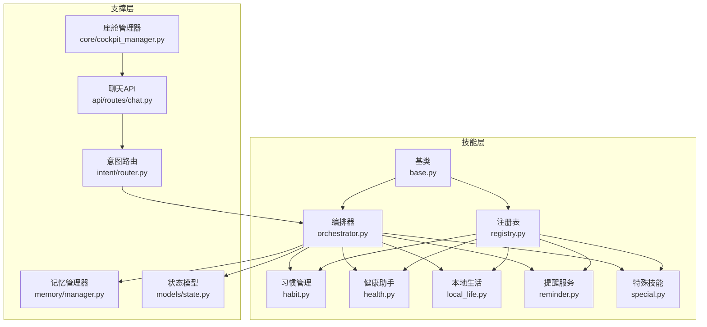
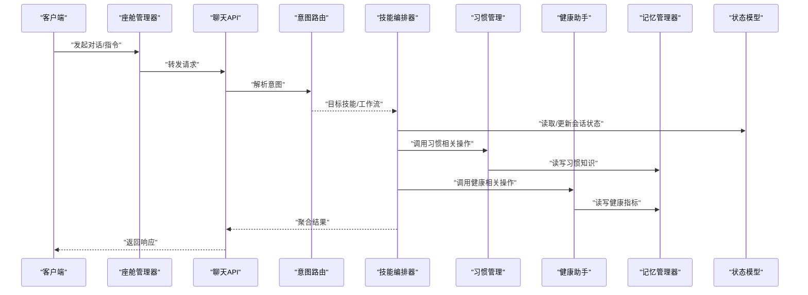
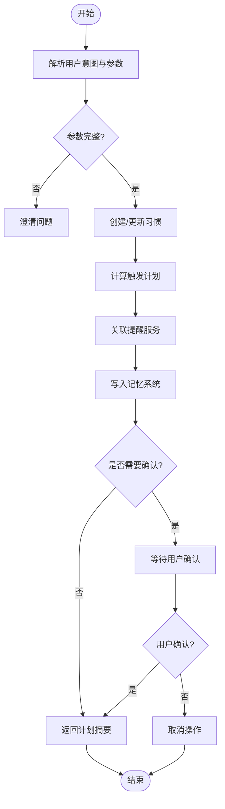
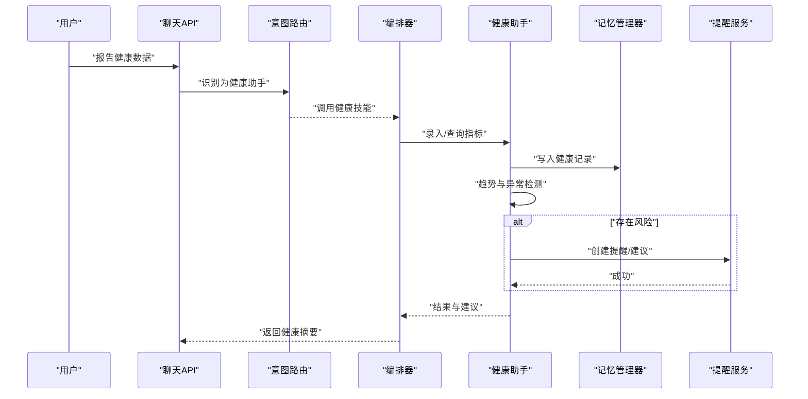
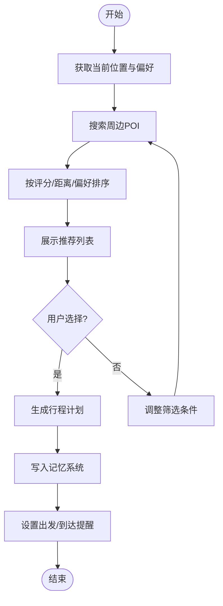
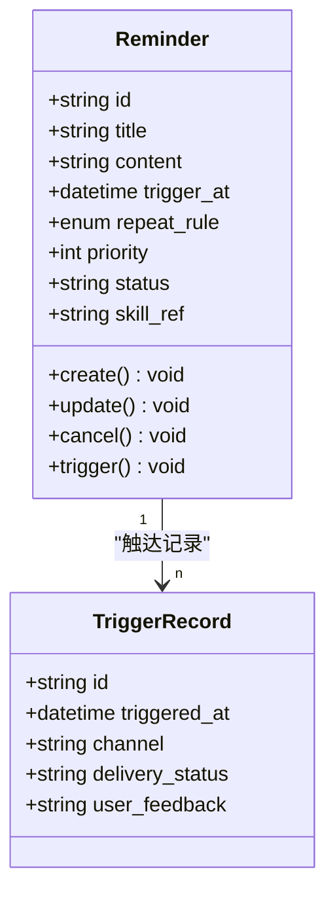
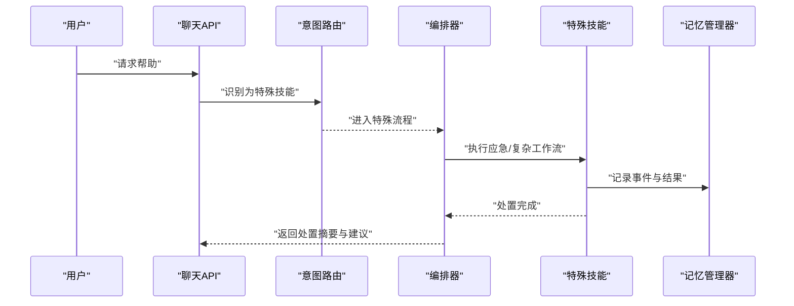
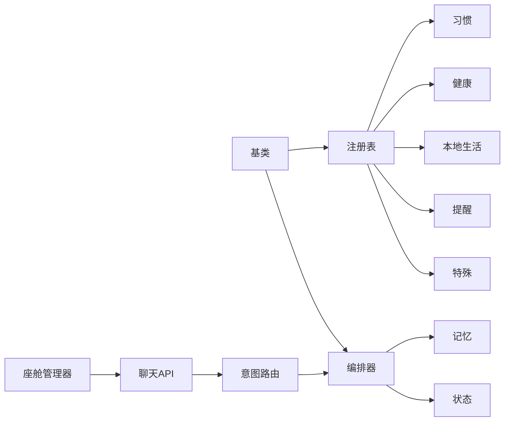

# 通用技能

<cite>
**本文引用的文件**   
- [backend_design/nexus/skills/base.py](file://backend_design/nexus/skills/base.py)
- [backend_design/nexus/skills/orchestrator.py](file://backend_design/nexus/skills/orchestrator.py)
- [backend_design/nexus/skills/registry.py](file://backend_design/nexus/skills/registry.py)
- [backend_design/nexus/skills/habit.py](file://backend_design/nexus/skills/habit.py)
- [backend_design/nexus/skills/health.py](file://backend_design/nexus/skills/health.py)
- [backend_design/nexus/skills/local_life.py](file://backend_design/nexus/skills/local_life.py)
- [backend_design/nexus/skills/reminder.py](file://backend_design/nexus/skills/reminder.py)
- [backend_design/nexus/skills/special.py](file://backend_design/nexus/skills/special.py)
- [backend_design/nexus/memory/manager.py](file://backend_design/nexus/memory/manager.py)
- [backend_design/nexus/models/state.py](file://backend_design/nexus/models/state.py)
- [backend_design/nexus/api/routes/chat.py](file://backend_design/nexus/api/routes/chat.py)
- [backend_design/nexus/intent/router.py](file://backend_design/nexus/intent/router.py)
- [backend_design/nexus/core/cockpit_manager.py](file://backend_design/nexus/core/cockpit_manager.py)
</cite>

## 目录
1. [简介](#简介)
2. [项目结构](#项目结构)
3. [核心组件](#核心组件)
4. [架构总览](#架构总览)
5. [详细组件分析](#详细组件分析)
6. [依赖分析](#依赖分析)
7. [性能考虑](#性能考虑)
8. [故障排查指南](#故障排查指南)
9. [结论](#结论)
10. [附录](#附录)

## 简介
本技术文档聚焦于 NexusCockpit 的“通用技能”体系，覆盖以下能力域：习惯管理、健康助手、本地生活服务、提醒服务与特殊技能。文档从系统架构、数据模型、业务逻辑、用户交互流程、与记忆系统和 Agent 系统的集成方式等维度进行系统化阐述，并提供扩展开发指南与最佳实践建议，帮助开发者快速理解并高效扩展技能生态。

## 项目结构
通用技能位于后端模块 backend_design/nexus/skills 下，采用“基类 + 注册表 + 编排器 + 具体技能实现”的分层组织方式：
- 基类定义统一接口与生命周期钩子
- 注册表负责技能的发现与加载
- 编排器协调多技能协作与上下文传递
- 各具体技能实现各自领域的数据模型与业务逻辑
- 通过 API 路由与意图路由接入上层对话与调度

图表来源
- [backend_design/nexus/skills/base.py](file://backend_design/nexus/skills/base.py)
- [backend_design/nexus/skills/registry.py](file://backend_design/nexus/skills/registry.py)
- [backend_design/nexus/skills/orchestrator.py](file://backend_design/nexus/skills/orchestrator.py)
- [backend_design/nexus/skills/habit.py](file://backend_design/nexus/skills/habit.py)
- [backend_design/nexus/skills/health.py](file://backend_design/nexus/skills/health.py)
- [backend_design/nexus/skills/local_life.py](file://backend_design/nexus/skills/local_life.py)
- [backend_design/nexus/skills/reminder.py](file://backend_design/nexus/skills/reminder.py)
- [backend_design/nexus/skills/special.py](file://backend_design/nexus/skills/special.py)
- [backend_design/nexus/memory/manager.py](file://backend_design/nexus/memory/manager.py)
- [backend_design/nexus/models/state.py](file://backend_design/nexus/models/state.py)
- [backend_design/nexus/intent/router.py](file://backend_design/nexus/intent/router.py)
- [backend_design/nexus/api/routes/chat.py](file://backend_design/nexus/api/routes/chat.py)
- [backend_design/nexus/core/cockpit_manager.py](file://backend_design/nexus/core/cockpit_manager.py)

章节来源
- [backend_design/nexus/skills/base.py](file://backend_design/nexus/skills/base.py)
- [backend_design/nexus/skills/registry.py](file://backend_design/nexus/skills/registry.py)
- [backend_design/nexus/skills/orchestrator.py](file://backend_design/nexus/skills/orchestrator.py)
- [backend_design/nexus/skills/habit.py](file://backend_design/nexus/skills/habit.py)
- [backend_design/nexus/skills/health.py](file://backend_design/nexus/skills/health.py)
- [backend_design/nexus/skills/local_life.py](file://backend_design/nexus/skills/local_life.py)
- [backend_design/nexus/skills/reminder.py](file://backend_design/nexus/skills/reminder.py)
- [backend_design/nexus/skills/special.py](file://backend_design/nexus/skills/special.py)
- [backend_design/nexus/memory/manager.py](file://backend_design/nexus/memory/manager.py)
- [backend_design/nexus/models/state.py](file://backend_design/nexus/models/state.py)
- [backend_design/nexus/intent/router.py](file://backend_design/nexus/intent/router.py)
- [backend_design/nexus/api/routes/chat.py](file://backend_design/nexus/api/routes/chat.py)
- [backend_design/nexus/core/cockpit_manager.py](file://backend_design/nexus/core/cockpit_manager.py)

## 核心组件
- 技能基类：定义统一的技能元信息、输入校验、执行入口、结果封装与错误处理约定，确保所有技能具备一致的生命周期与可观测性。
- 注册表：集中管理技能的声明、版本、权限与依赖，提供按名称或标签检索、批量启用/禁用、热插拔能力。
- 编排器：在多技能场景下负责参数抽取、上下文拼装、调用顺序控制、并发策略、失败回退与结果聚合。
- 记忆系统：为技能提供持久化与检索能力，支持会话级与跨会话的知识沉淀，便于个性化与连续性体验。
- 状态模型：在会话内维护关键状态（如待确认项、中间结果、上下文片段），供编排器与下游技能共享。
- 意图路由：将自然语言请求映射到目标技能或工作流，支持启发式规则与大模型路由两种模式。
- API 与座舱管理器：对外暴露 REST/WebSocket 接口，承载前端交互；座舱管理器协调多子系统与技能编排。

章节来源
- [backend_design/nexus/skills/base.py](file://backend_design/nexus/skills/base.py)
- [backend_design/nexus/skills/registry.py](file://backend_design/nexus/skills/registry.py)
- [backend_design/nexus/skills/orchestrator.py](file://backend_design/nexus/skills/orchestrator.py)
- [backend_design/nexus/memory/manager.py](file://backend_design/nexus/memory/manager.py)
- [backend_design/nexus/models/state.py](file://backend_design/nexus/models/state.py)
- [backend_design/nexus/intent/router.py](file://backend_design/nexus/intent/router.py)
- [backend_design/nexus/api/routes/chat.py](file://backend_design/nexus/api/routes/chat.py)
- [backend_design/nexus/core/cockpit_manager.py](file://backend_design/nexus/core/cockpit_manager.py)

## 架构总览
通用技能通过“意图识别 → 技能编排 → 记忆读写 → 外部工具/服务 → 结果聚合”的链路完成端到端处理。编排器作为中枢，协调多个技能协同工作，并通过注册表动态发现可用能力。

图表来源
- [backend_design/nexus/core/cockpit_manager.py](file://backend_design/nexus/core/cockpit_manager.py)
- [backend_design/nexus/api/routes/chat.py](file://backend_design/nexus/api/routes/chat.py)
- [backend_design/nexus/intent/router.py](file://backend_design/nexus/intent/router.py)
- [backend_design/nexus/skills/orchestrator.py](file://backend_design/nexus/skills/orchestrator.py)
- [backend_design/nexus/skills/habit.py](file://backend_design/nexus/skills/habit.py)
- [backend_design/nexus/skills/health.py](file://backend_design/nexus/skills/health.py)
- [backend_design/nexus/memory/manager.py](file://backend_design/nexus/memory/manager.py)
- [backend_design/nexus/models/state.py](file://backend_design/nexus/models/state.py)

## 详细组件分析

### 习惯管理（Habit）
- 功能特性
  - 创建/更新/删除习惯条目
  - 周期性任务生成与触发
  - 习惯进度统计与趋势分析
  - 与提醒服务联动，自动创建提醒
- 数据模型
  - 习惯实体：包含名称、类型、频率、时间窗口、目标值、状态、关联提醒ID等字段
  - 进度记录：时间戳、实际值、是否达标、备注
- 业务逻辑
  - 基于频率与时间窗计算下次触发点
  - 当未达标时自动生成提醒或建议
  - 与记忆系统沉淀长期行为偏好
- 用户交互流程
  - 用户表达“帮我养成早起习惯”，意图路由识别为习惯管理
  - 编排器调用习惯技能创建条目，并写入记忆
  - 若需要确认，通过状态模型暂存待确认项，等待用户二次确认
  - 完成后返回计划与提醒设置摘要

图表来源
- [backend_design/nexus/skills/habit.py](file://backend_design/nexus/skills/habit.py)
- [backend_design/nexus/skills/orchestrator.py](file://backend_design/nexus/skills/orchestrator.py)
- [backend_design/nexus/memory/manager.py](file://backend_design/nexus/memory/manager.py)
- [backend_design/nexus/models/state.py](file://backend_design/nexus/models/state.py)
- [backend_design/nexus/intent/router.py](file://backend_design/nexus/intent/router.py)

章节来源
- [backend_design/nexus/skills/habit.py](file://backend_design/nexus/skills/habit.py)
- [backend_design/nexus/skills/orchestrator.py](file://backend_design/nexus/skills/orchestrator.py)
- [backend_design/nexus/memory/manager.py](file://backend_design/nexus/memory/manager.py)
- [backend_design/nexus/models/state.py](file://backend_design/nexus/models/state.py)
- [backend_design/nexus/intent/router.py](file://backend_design/nexus/intent/router.py)

### 健康助手（Health）
- 功能特性
  - 健康指标录入与查询（心率、血压、睡眠等）
  - 异常检测与风险提示
  - 健康建议生成与习惯联动
- 数据模型
  - 指标记录：时间戳、指标类型、数值、单位、来源设备、备注
  - 风险事件：指标阈值、触发时间、严重等级、处置建议
- 业务逻辑
  - 对连续指标进行趋势分析与异常检测
  - 结合历史习惯与记忆中的健康偏好给出个性化建议
  - 与提醒服务联动，推送用药或复诊提醒
- 用户交互流程
  - 用户说“我昨晚睡了6小时”，健康助手记录睡眠时长
  - 编排器调用健康技能，写入记忆并评估风险
  - 若存在风险，返回提示与建议，必要时询问是否创建提醒

图表来源
- [backend_design/nexus/skills/health.py](file://backend_design/nexus/skills/health.py)
- [backend_design/nexus/skills/orchestrator.py](file://backend_design/nexus/skills/orchestrator.py)
- [backend_design/nexus/memory/manager.py](file://backend_design/nexus/memory/manager.py)
- [backend_design/nexus/skills/reminder.py](file://backend_design/nexus/skills/reminder.py)
- [backend_design/nexus/api/routes/chat.py](file://backend_design/nexus/api/routes/chat.py)
- [backend_design/nexus/intent/router.py](file://backend_design/nexus/intent/router.py)

章节来源
- [backend_design/nexus/skills/health.py](file://backend_design/nexus/skills/health.py)
- [backend_design/nexus/skills/orchestrator.py](file://backend_design/nexus/skills/orchestrator.py)
- [backend_design/nexus/memory/manager.py](file://backend_design/nexus/memory/manager.py)
- [backend_design/nexus/skills/reminder.py](file://backend_design/nexus/skills/reminder.py)
- [backend_design/nexus/api/routes/chat.py](file://backend_design/nexus/api/routes/chat.py)
- [backend_design/nexus/intent/router.py](file://backend_design/nexus/intent/router.py)

### 本地生活服务（Local Life）
- 功能特性
  - 周边搜索（餐饮、医疗、运动场馆等）
  - 路线规划与导航建议
  - 预约与订单辅助（与外部服务对接）
- 数据模型
  - POI实体：名称、类别、坐标、评分、营业时间、联系方式
  - 行程计划：时间线、地点序列、交通方式、备注
- 业务逻辑
  - 根据用户位置与偏好进行推荐排序
  - 结合天气与实时路况优化建议
  - 与提醒服务联动，出发前提醒与到达通知
- 用户交互流程
  - 用户说“附近有什么好吃的”，本地生活技能检索POI并返回推荐列表
  - 用户选择后，编排器生成行程计划并写入记忆
  - 如需导航，调用导航能力并设置出发提醒

图表来源
- [backend_design/nexus/skills/local_life.py](file://backend_design/nexus/skills/local_life.py)
- [backend_design/nexus/skills/orchestrator.py](file://backend_design/nexus/skills/orchestrator.py)
- [backend_design/nexus/memory/manager.py](file://backend_design/nexus/memory/manager.py)
- [backend_design/nexus/skills/reminder.py](file://backend_design/nexus/skills/reminder.py)

章节来源
- [backend_design/nexus/skills/local_life.py](file://backend_design/nexus/skills/local_life.py)
- [backend_design/nexus/skills/orchestrator.py](file://backend_design/nexus/skills/orchestrator.py)
- [backend_design/nexus/memory/manager.py](file://backend_design/nexus/memory/manager.py)
- [backend_design/nexus/skills/reminder.py](file://backend_design/nexus/skills/reminder.py)

### 提醒服务（Reminder）
- 功能特性
  - 一次性与周期性提醒
  - 提醒优先级与去重策略
  - 多渠道触达（消息、语音、应用内通知）
- 数据模型
  - 提醒实体：标题、内容、触发时间、重复规则、优先级、状态、关联技能
  - 触达记录：时间、渠道、送达状态、用户反馈
- 业务逻辑
  - 基于时间轮或延迟队列进行调度
  - 合并相似提醒，避免打扰
  - 与习惯与健康技能联动，自动创建提醒
- 用户交互流程
  - 用户说“每天下午三点提醒喝水”，提醒服务创建周期性提醒
  - 到达触发时间，发送通知并记录触达状态
  - 用户可回复“稍后提醒”，编排器更新提醒时间与状态

图表来源
- [backend_design/nexus/skills/reminder.py](file://backend_design/nexus/skills/reminder.py)

章节来源
- [backend_design/nexus/skills/reminder.py](file://backend_design/nexus/skills/reminder.py)

### 特殊技能（Special）
- 功能特性
  - 兜底与应急场景处理（紧急联系人、一键求助）
  - 复杂工作流编排（多步骤任务分解与确认）
  - 自定义插件入口（第三方能力接入）
- 数据模型
  - 工作流节点：类型、参数、前置条件、后置动作
  - 应急配置：联系人、优先级、触发条件
- 业务逻辑
  - 根据上下文判断是否进入特殊流程
  - 分步确认与回滚机制保障安全
  - 与记忆系统记录应急事件与处置结果
- 用户交互流程
  - 用户说“我需要帮助”，特殊技能识别为高优先级场景
  - 编排器调用应急流程，确认联系人并发送求助
  - 完成后记录事件并生成后续建议

图表来源
- [backend_design/nexus/skills/special.py](file://backend_design/nexus/skills/special.py)
- [backend_design/nexus/skills/orchestrator.py](file://backend_design/nexus/skills/orchestrator.py)
- [backend_design/nexus/memory/manager.py](file://backend_design/nexus/memory/manager.py)
- [backend_design/nexus/api/routes/chat.py](file://backend_design/nexus/api/routes/chat.py)
- [backend_design/nexus/intent/router.py](file://backend_design/nexus/intent/router.py)

章节来源
- [backend_design/nexus/skills/special.py](file://backend_design/nexus/skills/special.py)
- [backend_design/nexus/skills/orchestrator.py](file://backend_design/nexus/skills/orchestrator.py)
- [backend_design/nexus/memory/manager.py](file://backend_design/nexus/memory/manager.py)
- [backend_design/nexus/api/routes/chat.py](file://backend_design/nexus/api/routes/chat.py)
- [backend_design/nexus/intent/router.py](file://backend_design/nexus/intent/router.py)

## 依赖分析
- 组件耦合与内聚
  - 基类与注册表低耦合，便于新增技能
  - 编排器与具体技能通过统一接口交互，保持高内聚
  - 记忆系统与状态模型被多技能复用，提升一致性
- 直接/间接依赖
  - 技能依赖编排器进行上下文与并发控制
  - 编排器依赖意图路由进行目标定位
  - API 与座舱管理器作为入口，不直接感知技能细节
- 外部依赖与集成点
  - 记忆系统提供持久化与检索
  - 提醒服务作为外部能力被多技能调用
  - 状态模型贯穿会话生命周期

图表来源
- [backend_design/nexus/skills/base.py](file://backend_design/nexus/skills/base.py)
- [backend_design/nexus/skills/registry.py](file://backend_design/nexus/skills/registry.py)
- [backend_design/nexus/skills/orchestrator.py](file://backend_design/nexus/skills/orchestrator.py)
- [backend_design/nexus/skills/habit.py](file://backend_design/nexus/skills/habit.py)
- [backend_design/nexus/skills/health.py](file://backend_design/nexus/skills/health.py)
- [backend_design/nexus/skills/local_life.py](file://backend_design/nexus/skills/local_life.py)
- [backend_design/nexus/skills/reminder.py](file://backend_design/nexus/skills/reminder.py)
- [backend_design/nexus/skills/special.py](file://backend_design/nexus/skills/special.py)
- [backend_design/nexus/memory/manager.py](file://backend_design/nexus/memory/manager.py)
- [backend_design/nexus/models/state.py](file://backend_design/nexus/models/state.py)
- [backend_design/nexus/intent/router.py](file://backend_design/nexus/intent/router.py)
- [backend_design/nexus/api/routes/chat.py](file://backend_design/nexus/api/routes/chat.py)
- [backend_design/nexus/core/cockpit_manager.py](file://backend_design/nexus/core/cockpit_manager.py)

章节来源
- [backend_design/nexus/skills/base.py](file://backend_design/nexus/skills/base.py)
- [backend_design/nexus/skills/registry.py](file://backend_design/nexus/skills/registry.py)
- [backend_design/nexus/skills/orchestrator.py](file://backend_design/nexus/skills/orchestrator.py)
- [backend_design/nexus/memory/manager.py](file://backend_design/nexus/memory/manager.py)
- [backend_design/nexus/models/state.py](file://backend_design/nexus/models/state.py)
- [backend_design/nexus/intent/router.py](file://backend_design/nexus/intent/router.py)
- [backend_design/nexus/api/routes/chat.py](file://backend_design/nexus/api/routes/chat.py)
- [backend_design/nexus/core/cockpit_manager.py](file://backend_design/nexus/core/cockpit_manager.py)

## 性能考虑
- 并发与批处理
  - 编排器对独立技能调用采用并发策略，减少端到端延迟
  - 批量写入记忆系统，降低IO开销
- 缓存与索引
  - 常用POI与习惯模板可缓存，提高检索速度
  - 健康指标建立时间索引，加速趋势查询
- 限流与熔断
  - 外部服务调用增加限流与熔断保护，避免雪崩
- 资源隔离
  - 不同技能使用独立的上下文与内存空间，防止相互干扰

[本节为通用指导，无需特定文件引用]

## 故障排查指南
- 常见问题定位
  - 意图识别失败：检查意图路由配置与示例语料
  - 技能未注册：确认注册表加载与命名冲突
  - 记忆写入失败：检查存储连接与权限
  - 提醒未触发：核对调度队列与时间同步
- 日志与可观测性
  - 在编排器与各技能入口添加结构化日志
  - 记录关键状态变更与外部调用耗时
- 恢复策略
  - 对幂等操作进行重试与补偿
  - 对非幂等操作引入事务与回滚

章节来源
- [backend_design/nexus/skills/orchestrator.py](file://backend_design/nexus/skills/orchestrator.py)
- [backend_design/nexus/skills/registry.py](file://backend_design/nexus/skills/registry.py)
- [backend_design/nexus/memory/manager.py](file://backend_design/nexus/memory/manager.py)
- [backend_design/nexus/skills/reminder.py](file://backend_design/nexus/skills/reminder.py)

## 结论
通用技能体系以基类与注册表为核心，通过编排器实现多技能协同，结合记忆系统与状态模型提供个性化与连续性体验。习惯管理、健康助手、本地生活、提醒与特殊技能覆盖了用户日常高频场景，并与Agent系统形成良好集成。遵循本文档的扩展指南与最佳实践，可快速构建高质量的新技能。

[本节为总结，无需特定文件引用]

## 附录

### 技能扩展开发指南
- 新建技能
  - 继承基类，实现必要方法与钩子
  - 在注册表中声明元信息与依赖
  - 编写单元测试与集成测试
- 与记忆系统集成
  - 使用记忆管理器进行持久化与检索
  - 设计合理的键空间与过期策略
- 与Agent系统集成
  - 通过编排器与意图路由接入
  - 在状态模型中维护必要的中间态
- 最佳实践
  - 输入校验与错误码规范
  - 幂等设计与重试策略
  - 可观测性与日志规范
  - 安全与隐私保护

章节来源
- [backend_design/nexus/skills/base.py](file://backend_design/nexus/skills/base.py)
- [backend_design/nexus/skills/registry.py](file://backend_design/nexus/skills/registry.py)
- [backend_design/nexus/skills/orchestrator.py](file://backend_design/nexus/skills/orchestrator.py)
- [backend_design/nexus/memory/manager.py](file://backend_design/nexus/memory/manager.py)
- [backend_design/nexus/models/state.py](file://backend_design/nexus/models/state.py)
- [backend_design/nexus/intent/router.py](file://backend_design/nexus/intent/router.py)