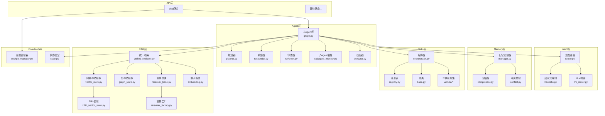
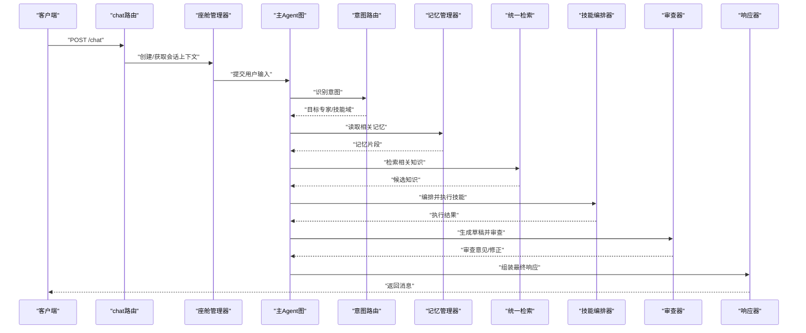
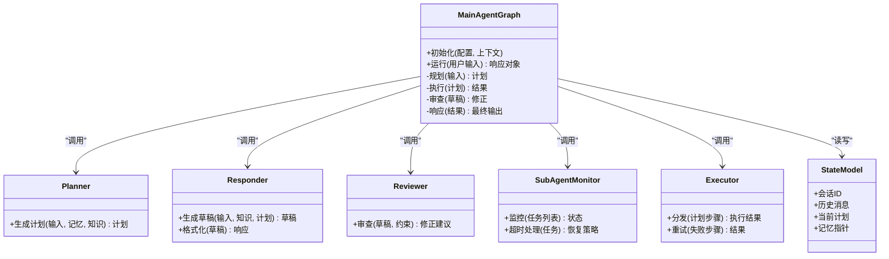
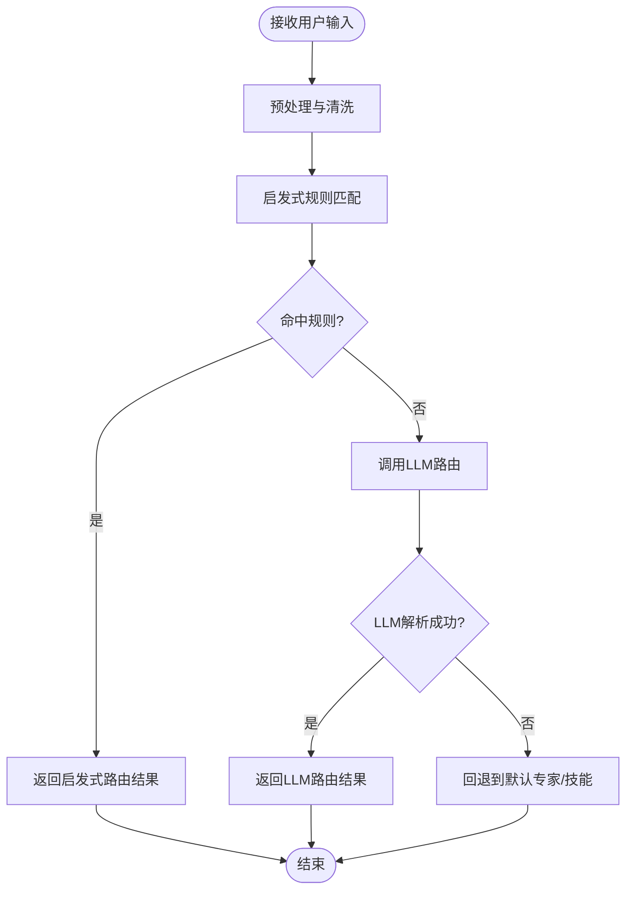
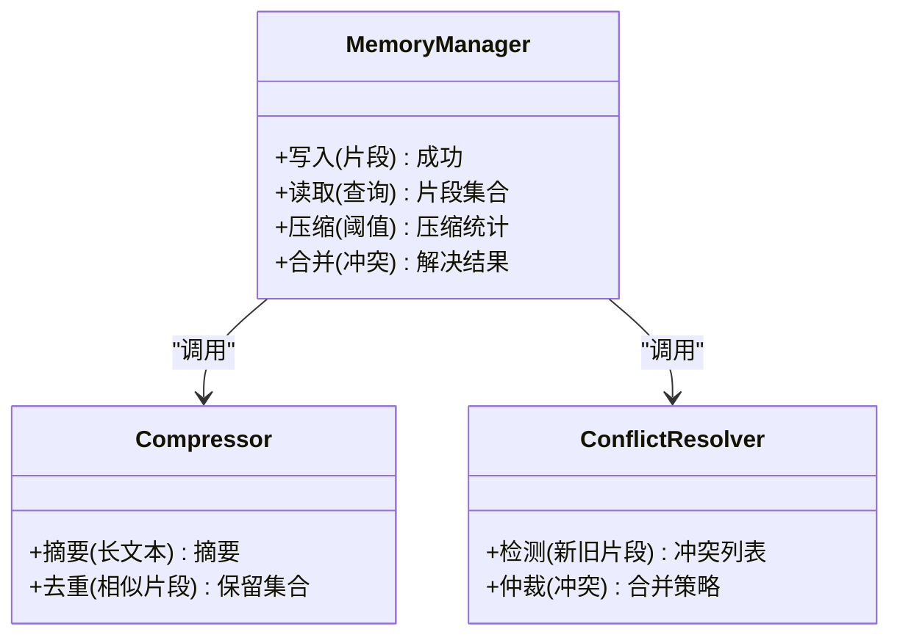
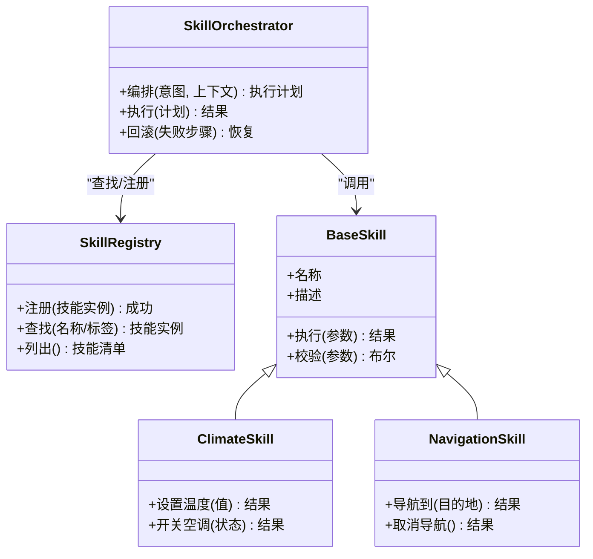
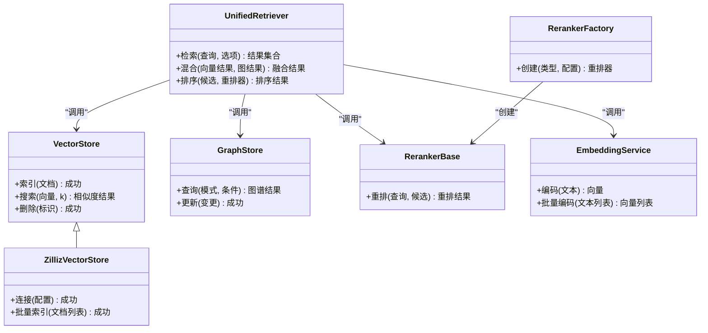
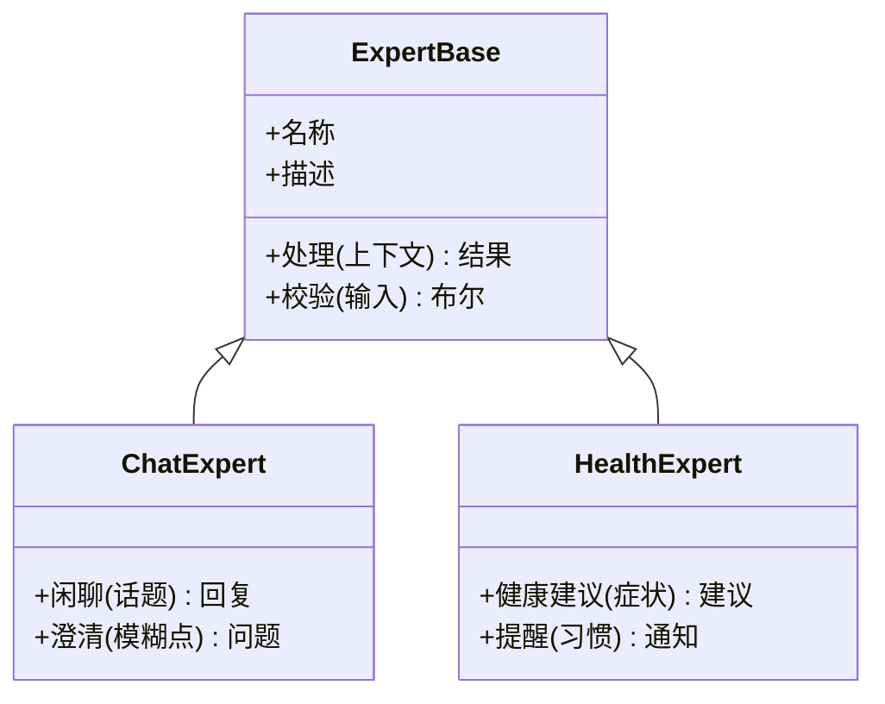
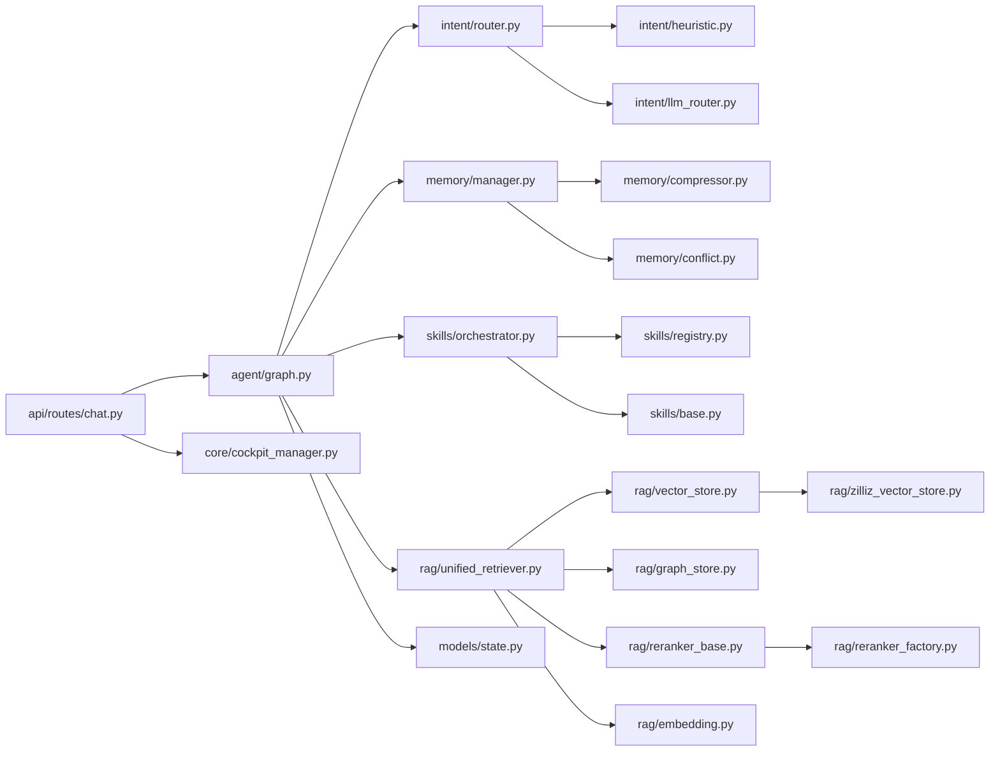

# 核心模块详解

<cite>
**本文引用的文件**   
- [backend_design/nexus/main.py](file://backend_design/nexus/main.py)
- [backend_design/nexus/config.py](file://backend_design/nexus/config.py)
- [backend_design/nexus/agent/graph.py](file://backend_design/nexus/agent/graph.py)
- [backend_design/nexus/agent/planner.py](file://backend_design/nexus/agent/planner.py)
- [backend_design/nexus/agent/responder.py](file://backend_design/nexus/agent/responder.py)
- [backend_design/nexus/agent/reviewer.py](file://backend_design/nexus/agent/reviewer.py)
- [backend_design/nexus/agent/subagent_monitor.py](file://backend_design/nexus/agent/subagent_monitor.py)
- [backend_design/nexus/agent/executor.py](file://backend_design/nexus/agent/executor.py)
- [backend_design/nexus/agent/experts/chat_expert.py](file://backend_design/nexus/agent/experts/chat_expert.py)
- [backend_design/nexus/agent/experts/base.py](file://backend_design/nexus/agent/experts/base.py)
- [backend_design/nexus/intent/router.py](file://backend_design/nexus/intent/router.py)
- [backend_design/nexus/intent/heuristic.py](file://backend_design/nexus/intent/heuristic.py)
- [backend_design/nexus/intent/llm_router.py](file://backend_design/nexus/intent/llm_router.py)
- [backend_design/nexus/memory/manager.py](file://backend_design/nexus/memory/manager.py)
- [backend_design/nexus/memory/compressor.py](file://backend_design/nexus/memory/compressor.py)
- [backend_design/nexus/memory/conflict.py](file://backend_design/nexus/memory/conflict.py)
- [backend_design/nexus/skills/orchestrator.py](file://backend_design/nexus/skills/orchestrator.py)
- [backend_design/nexus/skills/registry.py](file://backend_design/nexus/skills/registry.py)
- [backend_design/nexus/skills/base.py](file://backend_design/nexus/skills/base.py)
- [backend_design/nexus/skills/vehicle/climate.py](file://backend_design/nexus/skills/vehicle/climate.py)
- [backend_design/nexus/skills/vehicle/navigation.py](file://backend_design/nexus/skills/vehicle/navigation.py)
- [backend_design/nexus/rag/unified_retriever.py](file://backend_design/nexus/rag/unified_retriever.py)
- [backend_design/nexus/rag/vector_store.py](file://backend_design/nexus/rag/vector_store.py)
- [backend_design/nexus/rag/zilliz_vector_store.py](file://backend_design/nexus/rag/zilliz_vector_store.py)
- [backend_design/nexus/rag/graph_store.py](file://backend_design/nexus/rag/graph_store.py)
- [backend_design/nexus/rag/reranker_base.py](file://backend_design/nexus/rag/reranker_base.py)
- [backend_design/nexus/rag/reranker_factory.py](file://backend_design/nexus/rag/reranker_factory.py)
- [backend_design/nexus/rag/embedding.py](file://backend_design/nexus/rag/embedding.py)
- [backend_design/nexus/api/routes/chat.py](file://backend_design/nexus/api/routes/chat.py)
- [backend_design/nexus/core/cockpit_manager.py](file://backend_design/nexus/core/cockpit_manager.py)
- [backend_design/nexus/models/state.py](file://backend_design/nexus/models/state.py)
</cite>

## 目录
1. [简介](#简介)
2. [项目结构](#项目结构)
3. [核心组件](#核心组件)
4. [架构总览](#架构总览)
5. [详细组件分析](#详细组件分析)
6. [依赖关系分析](#依赖关系分析)
7. [性能考量](#性能考量)
8. [故障排查指南](#故障排查指南)
9. [结论](#结论)
10. [附录](#附录)

## 简介
本文件面向NexusCockpit后端核心模块，聚焦Agent系统、意图识别、记忆管理、技能系统与RAG系统的实现细节、调用关系、接口定义与使用模式。文档以“从入口到执行”的视角串联各子系统，提供架构图、时序图与流程图，并给出配置项、参数与返回值的说明，帮助初学者快速上手，同时为有经验的开发者提供足够的技术深度。

## 项目结构
后端核心位于 backend_design/nexus 下，采用分层+领域划分：
- API层：HTTP/WebSocket路由与中间件
- Agent层：主Agent编排、规划、响应、审查与子Agent监控
- Intent层：启发式与LLM路由的意图识别
- Memory层：记忆抽取、压缩与冲突处理
- Skills层：能力注册、编排与具体技能（如车辆控制）
- RAG层：统一检索、向量/图存储、重排与嵌入
- Core层：通用基础设施（认证、上下文、指标等）
- Models层：状态与数据模型

图表来源
- [backend_design/nexus/main.py:1-200](file://backend_design/nexus/main.py#L1-L200)
- [backend_design/nexus/agent/graph.py:1-200](file://backend_design/nexus/agent/graph.py#L1-L200)
- [backend_design/nexus/intent/router.py:1-200](file://backend_design/nexus/intent/router.py#L1-L200)
- [backend_design/nexus/memory/manager.py:1-200](file://backend_design/nexus/memory/manager.py#L1-L200)
- [backend_design/nexus/skills/orchestrator.py:1-200](file://backend_design/nexus/skills/orchestrator.py#L1-L200)
- [backend_design/nexus/rag/unified_retriever.py:1-200](file://backend_design/nexus/rag/unified_retriever.py#L1-L200)
- [backend_design/nexus/core/cockpit_manager.py:1-200](file://backend_design/nexus/core/cockpit_manager.py#L1-L200)
- [backend_design/nexus/models/state.py:1-200](file://backend_design/nexus/models/state.py#L1-L200)

章节来源
- [backend_design/nexus/main.py:1-200](file://backend_design/nexus/main.py#L1-L200)

## 核心组件
本节概述关键子系统职责与交互要点，后续章节将深入每个组件的实现细节与接口约定。

- Agent系统：以图驱动的主Agent为核心，协调规划、响应、审查、执行与子Agent监控，贯穿会话生命周期。
- 意图识别：结合启发式规则与LLM路由，将用户输入映射到目标专家或技能域。
- 记忆管理：负责对话记忆的抽取、压缩与冲突消解，保障长期记忆的一致性与可检索性。
- 技能系统：通过注册表与编排器组织多领域技能（如车辆控制），支持动态发现与组合调用。
- RAG系统：统一检索接口，聚合向量与图存储，并提供重排与嵌入能力，增强回答的事实性与准确性。

章节来源
- [backend_design/nexus/agent/graph.py:1-200](file://backend_design/nexus/agent/graph.py#L1-L200)
- [backend_design/nexus/intent/router.py:1-200](file://backend_design/nexus/intent/router.py#L1-L200)
- [backend_design/nexus/memory/manager.py:1-200](file://backend_design/nexus/memory/manager.py#L1-L200)
- [backend_design/nexus/skills/orchestrator.py:1-200](file://backend_design/nexus/skills/orchestrator.py#L1-L200)
- [backend_design/nexus/rag/unified_retriever.py:1-200](file://backend_design/nexus/rag/unified_retriever.py#L1-L200)

## 架构总览
下图展示一次典型聊天请求在系统中的流转路径：从API进入，经主Agent图调度，完成意图识别、记忆读写、RAG检索、技能执行与结果审查，最终返回响应。

图表来源
- [backend_design/nexus/api/routes/chat.py:1-200](file://backend_design/nexus/api/routes/chat.py#L1-L200)
- [backend_design/nexus/core/cockpit_manager.py:1-200](file://backend_design/nexus/core/cockpit_manager.py#L1-L200)
- [backend_design/nexus/agent/graph.py:1-200](file://backend_design/nexus/agent/graph.py#L1-L200)
- [backend_design/nexus/intent/router.py:1-200](file://backend_design/nexus/intent/router.py#L1-L200)
- [backend_design/nexus/memory/manager.py:1-200](file://backend_design/nexus/memory/manager.py#L1-L200)
- [backend_design/nexus/rag/unified_retriever.py:1-200](file://backend_design/nexus/rag/unified_retriever.py#L1-L200)
- [backend_design/nexus/skills/orchestrator.py:1-200](file://backend_design/nexus/skills/orchestrator.py#L1-L200)
- [backend_design/nexus/agent/reviewer.py:1-200](file://backend_design/nexus/agent/reviewer.py#L1-L200)
- [backend_design/nexus/agent/responder.py:1-200](file://backend_design/nexus/agent/responder.py#L1-L200)

## 详细组件分析

### Agent系统
Agent系统以图驱动的方式组织工作流，包含规划、响应、审查、执行与子Agent监控等节点，并通过状态模型维护会话上下文。

图表来源
- [backend_design/nexus/agent/graph.py:1-200](file://backend_design/nexus/agent/graph.py#L1-L200)
- [backend_design/nexus/agent/planner.py:1-200](file://backend_design/nexus/agent/planner.py#L1-L200)
- [backend_design/nexus/agent/responder.py:1-200](file://backend_design/nexus/agent/responder.py#L1-L200)
- [backend_design/nexus/agent/reviewer.py:1-200](file://backend_design/nexus/agent/reviewer.py#L1-L200)
- [backend_design/nexus/agent/subagent_monitor.py:1-200](file://backend_design/nexus/agent/subagent_monitor.py#L1-L200)
- [backend_design/nexus/agent/executor.py:1-200](file://backend_design/nexus/agent/executor.py#L1-L200)
- [backend_design/nexus/models/state.py:1-200](file://backend_design/nexus/models/state.py#L1-L200)

章节来源
- [backend_design/nexus/agent/graph.py:1-200](file://backend_design/nexus/agent/graph.py#L1-L200)
- [backend_design/nexus/agent/planner.py:1-200](file://backend_design/nexus/agent/planner.py#L1-L200)
- [backend_design/nexus/agent/responder.py:1-200](file://backend_design/nexus/agent/responder.py#L1-L200)
- [backend_design/nexus/agent/reviewer.py:1-200](file://backend_design/nexus/agent/reviewer.py#L1-L200)
- [backend_design/nexus/agent/subagent_monitor.py:1-200](file://backend_design/nexus/agent/subagent_monitor.py#L1-L200)
- [backend_design/nexus/agent/executor.py:1-200](file://backend_design/nexus/agent/executor.py#L1-L200)
- [backend_design/nexus/models/state.py:1-200](file://backend_design/nexus/models/state.py#L1-L200)

### 意图识别
意图识别由启发式规则与LLM路由共同组成，前者用于快速匹配常见场景，后者用于复杂语义理解与跨域路由。

图表来源
- [backend_design/nexus/intent/router.py:1-200](file://backend_design/nexus/intent/router.py#L1-L200)
- [backend_design/nexus/intent/heuristic.py:1-200](file://backend_design/nexus/intent/heuristic.py#L1-200)
- [backend_design/nexus/intent/llm_router.py:1-200](file://backend_design/nexus/intent/llm_router.py#L1-200)

章节来源
- [backend_design/nexus/intent/router.py:1-200](file://backend_design/nexus/intent/router.py#L1-200)
- [backend_design/nexus/intent/heuristic.py:1-200](file://backend_design/nexus/intent/heuristic.py#L1-200)
- [backend_design/nexus/intent/llm_router.py:1-200](file://backend_design/nexus/intent/llm_router.py#L1-200)

### 记忆管理
记忆管理负责对话记忆的抽取、压缩与冲突消解，确保长期记忆的可检索性与一致性。

图表来源
- [backend_design/nexus/memory/manager.py:1-200](file://backend_design/nexus/memory/manager.py#L1-200)
- [backend_design/nexus/memory/compressor.py:1-200](file://backend_design/nexus/memory/compressor.py#L1-200)
- [backend_design/nexus/memory/conflict.py:1-200](file://backend_design/nexus/memory/conflict.py#L1-200)

章节来源
- [backend_design/nexus/memory/manager.py:1-200](file://backend_design/nexus/memory/manager.py#L1-200)
- [backend_design/nexus/memory/compressor.py:1-200](file://backend_design/nexus/memory/compressor.py#L1-200)
- [backend_design/nexus/memory/conflict.py:1-200](file://backend_design/nexus/memory/conflict.py#L1-200)

### 技能系统
技能系统通过注册表集中管理可用技能，编排器负责按意图与上下文选择并执行技能，支持车辆控制等多领域扩展。

图表来源
- [backend_design/nexus/skills/registry.py:1-200](file://backend_design/nexus/skills/registry.py#L1-200)
- [backend_design/nexus/skills/orchestrator.py:1-200](file://backend_design/nexus/skills/orchestrator.py#L1-200)
- [backend_design/nexus/skills/base.py:1-200](file://backend_design/nexus/skills/base.py#L1-200)
- [backend_design/nexus/skills/vehicle/climate.py:1-200](file://backend_design/nexus/skills/vehicle/climate.py#L1-200)
- [backend_design/nexus/skills/vehicle/navigation.py:1-200](file://backend_design/nexus/skills/vehicle/navigation.py#L1-200)

章节来源
- [backend_design/nexus/skills/registry.py:1-200](file://backend_design/nexus/skills/registry.py#L1-200)
- [backend_design/nexus/skills/orchestrator.py:1-200](file://backend_design/nexus/skills/orchestrator.py#L1-200)
- [backend_design/nexus/skills/base.py:1-200](file://backend_design/nexus/skills/base.py#L1-200)
- [backend_design/nexus/skills/vehicle/climate.py:1-200](file://backend_design/nexus/skills/vehicle/climate.py#L1-200)
- [backend_design/nexus/skills/vehicle/navigation.py:1-200](file://backend_design/nexus/skills/vehicle/navigation.py#L1-200)

### RAG系统
RAG系统提供统一检索接口，聚合向量与图存储，并集成重排与嵌入能力，以提升答案的事实性与相关性。

图表来源
- [backend_design/nexus/rag/unified_retriever.py:1-200](file://backend_design/nexus/rag/unified_retriever.py#L1-200)
- [backend_design/nexus/rag/vector_store.py:1-200](file://backend_design/nexus/rag/vector_store.py#L1-200)
- [backend_design/nexus/rag/zilliz_vector_store.py:1-200](file://backend_design/nexus/rag/zilliz_vector_store.py#L1-200)
- [backend_design/nexus/rag/graph_store.py:1-200](file://backend_design/nexus/rag/graph_store.py#L1-200)
- [backend_design/nexus/rag/reranker_base.py:1-200](file://backend_design/nexus/rag/reranker_base.py#L1-200)
- [backend_design/nexus/rag/reranker_factory.py:1-200](file://backend_design/nexus/rag/reranker_factory.py#L1-200)
- [backend_design/nexus/rag/embedding.py:1-200](file://backend_design/nexus/rag/embedding.py#L1-200)

章节来源
- [backend_design/nexus/rag/unified_retriever.py:1-200](file://backend_design/nexus/rag/unified_retriever.py#L1-200)
- [backend_design/nexus/rag/vector_store.py:1-200](file://backend_design/nexus/rag/vector_store.py#L1-200)
- [backend_design/nexus/rag/zilliz_vector_store.py:1-200](file://backend_design/nexus/rag/zilliz_vector_store.py#L1-200)
- [backend_design/nexus/rag/graph_store.py:1-200](file://backend_design/nexus/rag/graph_store.py#L1-200)
- [backend_design/nexus/rag/reranker_base.py:1-200](file://backend_design/nexus/rag/reranker_base.py#L1-200)
- [backend_design/nexus/rag/reranker_factory.py:1-200](file://backend_design/nexus/rag/reranker_factory.py#L1-200)
- [backend_design/nexus/rag/embedding.py:1-200](file://backend_design/nexus/rag/embedding.py#L1-200)

### 专家系统（示例）
专家系统作为Agent的子能力单元，提供特定领域的处理能力，例如聊天专家与健康专家。

图表来源
- [backend_design/nexus/agent/experts/base.py:1-200](file://backend_design/nexus/agent/experts/base.py#L1-200)
- [backend_design/nexus/agent/experts/chat_expert.py:1-200](file://backend_design/nexus/agent/experts/chat_expert.py#L1-200)

章节来源
- [backend_design/nexus/agent/experts/base.py:1-200](file://backend_design/nexus/agent/experts/base.py#L1-200)
- [backend_design/nexus/agent/experts/chat_expert.py:1-200](file://backend_design/nexus/agent/experts/chat_expert.py#L1-200)

## 依赖关系分析
下图展示了核心模块之间的直接依赖关系，有助于识别耦合点与潜在循环依赖风险。

图表来源
- [backend_design/nexus/api/routes/chat.py:1-200](file://backend_design/nexus/api/routes/chat.py#L1-200)
- [backend_design/nexus/agent/graph.py:1-200](file://backend_design/nexus/agent/graph.py#L1-L200)
- [backend_design/nexus/intent/router.py:1-200](file://backend_design/nexus/intent/router.py#L1-200)
- [backend_design/nexus/memory/manager.py:1-200](file://backend_design/nexus/memory/manager.py#L1-200)
- [backend_design/nexus/skills/orchestrator.py:1-200](file://backend_design/nexus/skills/orchestrator.py#L1-200)
- [backend_design/nexus/rag/unified_retriever.py:1-200](file://backend_design/nexus/rag/unified_retriever.py#L1-200)
- [backend_design/nexus/core/cockpit_manager.py:1-200](file://backend_design/nexus/core/cockpit_manager.py#L1-200)
- [backend_design/nexus/models/state.py:1-200](file://backend_design/nexus/models/state.py#L1-200)

章节来源
- [backend_design/nexus/api/routes/chat.py:1-200](file://backend_design/nexus/api/routes/chat.py#L1-200)
- [backend_design/nexus/agent/graph.py:1-200](file://backend_design/nexus/agent/graph.py#L1-200)
- [backend_design/nexus/intent/router.py:1-200](file://backend_design/nexus/intent/router.py#L1-200)
- [backend_design/nexus/memory/manager.py:1-200](file://backend_design/nexus/memory/manager.py#L1-200)
- [backend_design/nexus/skills/orchestrator.py:1-200](file://backend_design/nexus/skills/orchestrator.py#L1-200)
- [backend_design/nexus/rag/unified_retriever.py:1-200](file://backend_design/nexus/rag/unified_retriever.py#L1-200)
- [backend_design/nexus/core/cockpit_manager.py:1-200](file://backend_design/nexus/core/cockpit_manager.py#L1-200)
- [backend_design/nexus/models/state.py:1-200](file://backend_design/nexus/models/state.py#L1-200)

## 性能考量
- 意图识别：优先使用启发式规则进行快速匹配，降低LLM调用成本；仅在规则未命中时触发LLM路由。
- 记忆管理：对长文本进行摘要与去重，避免记忆膨胀；冲突检测与仲裁应增量执行，减少全量比对开销。
- 技能执行：对耗时操作引入超时与重试机制，配合子Agent监控进行异常恢复。
- RAG检索：向量与图检索并行化，重排在内存中进行，必要时缓存高频查询结果。
- 资源隔离：不同租户/会话的资源隔离与配额限制，防止单点过载影响整体稳定性。

[本节为通用指导，不直接分析具体文件]

## 故障排查指南
- 意图识别失败：检查启发式规则覆盖度与LLM路由配置；确认输入预处理是否有效。
- 记忆写入异常：验证压缩阈值与冲突仲裁策略；检查持久化存储连通性与权限。
- 技能执行错误：核对技能注册表中的名称与参数；查看执行器的重试与回滚日志。
- RAG检索延迟：评估向量库与图数据库的连接池与索引效率；调整重排器与k值。
- 主Agent卡死：审查子Agent监控的超时与恢复策略；检查状态模型的同步与锁竞争。

章节来源
- [backend_design/nexus/agent/subagent_monitor.py:1-200](file://backend_design/nexus/agent/subagent_monitor.py#L1-200)
- [backend_design/nexus/agent/executor.py:1-200](file://backend_design/nexus/agent/executor.py#L1-200)
- [backend_design/nexus/memory/manager.py:1-200](file://backend_design/nexus/memory/manager.py#L1-200)
- [backend_design/nexus/rag/unified_retriever.py:1-200](file://backend_design/nexus/rag/unified_retriever.py#L1-200)

## 结论
NexusCockpit的核心模块围绕“Agent图驱动”的组织方式，将意图识别、记忆管理、技能系统与RAG有机整合，形成可扩展、可观测、高可用的智能座舱后端。通过清晰的接口契约与模块化设计，既便于新手快速上手，也为资深开发者提供了深入优化的空间。

[本节为总结性内容，不直接分析具体文件]

## 附录
- 配置参考：服务启动与基础配置入口
  - [backend_design/nexus/config.py:1-200](file://backend_design/nexus/config.py#L1-200)
- 应用入口：服务初始化与路由挂载
  - [backend_design/nexus/main.py:1-200](file://backend_design/nexus/main.py#L1-200)

章节来源
- [backend_design/nexus/config.py:1-200](file://backend_design/nexus/config.py#L1-200)
- [backend_design/nexus/main.py:1-200](file://backend_design/nexus/main.py#L1-200)