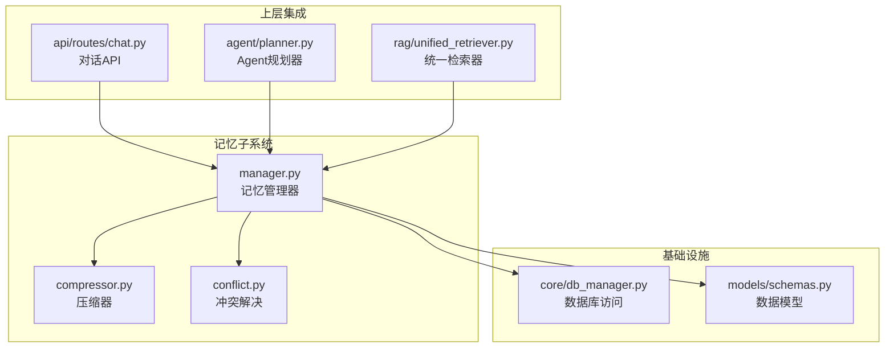
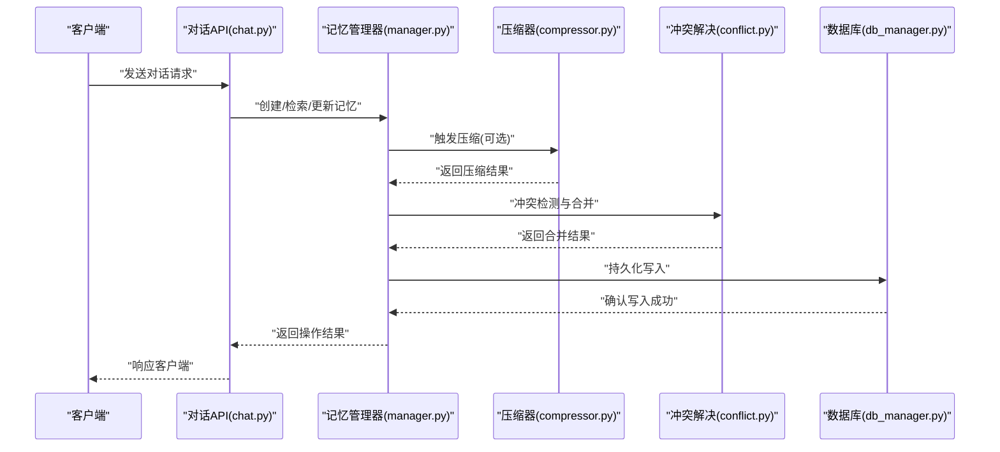
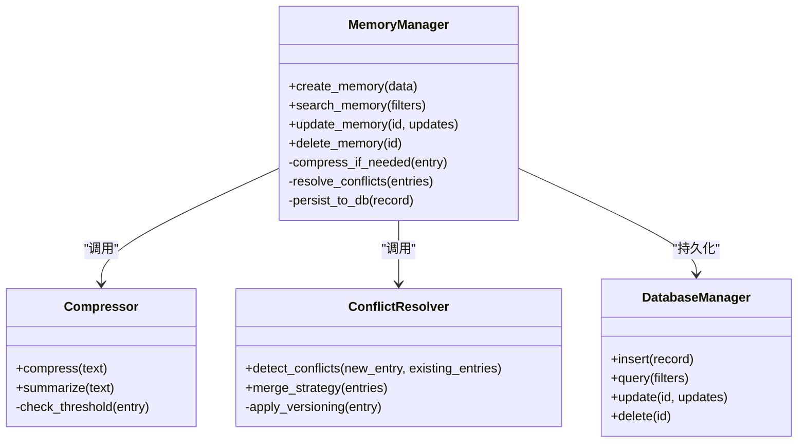
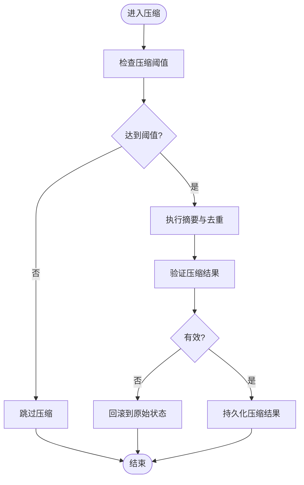
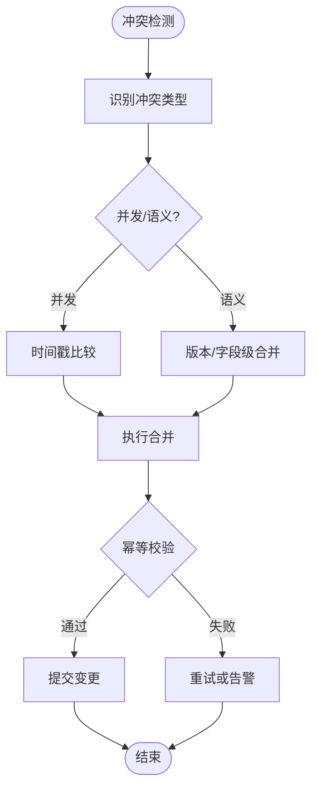
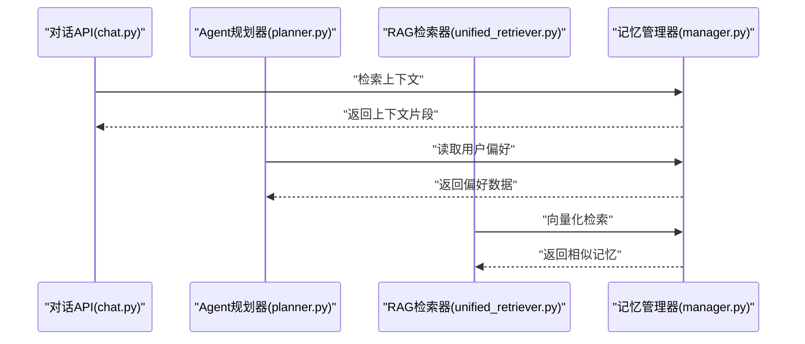
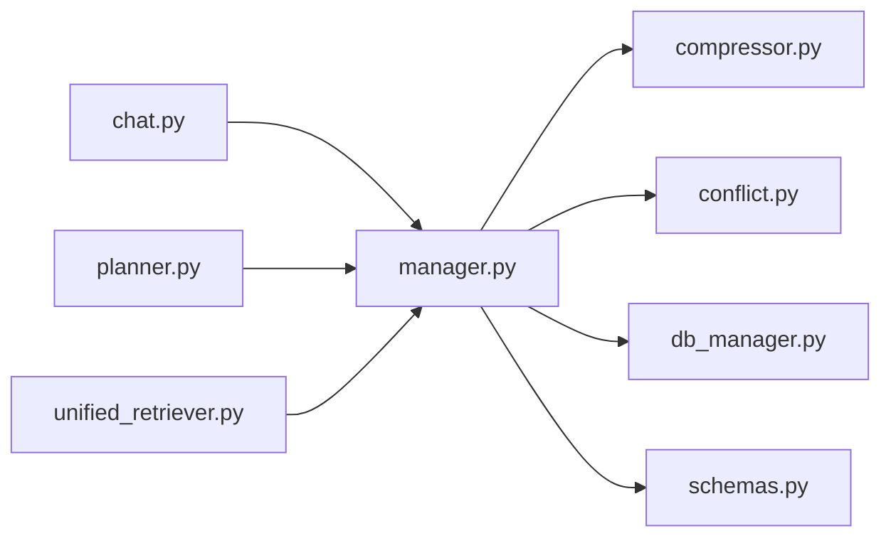

# 记忆管理系统

<cite>
**本文引用的文件**   
- [memory/__init__.py](file://backend_design/nexus/memory/__init__.py)
- [memory/manager.py](file://backend_design/nexus/memory/manager.py)
- [memory/compressor.py](file://backend_design/nexus/memory/compressor.py)
- [memory/conflict.py](file://backend_design/nexus/memory/conflict.py)
- [core/db_manager.py](file://backend_design/nexus/core/db_manager.py)
- [models/schemas.py](file://backend_design/nexus/models/schemas.py)
- [api/routes/chat.py](file://backend_design/nexus/api/routes/chat.py)
- [agent/planner.py](file://backend_design/nexus/agent/planner.py)
- [rag/unified_retriever.py](file://backend_design/nexus/rag/unified_retriever.py)
</cite>

## 目录
1. [简介](#简介)
2. [项目结构](#项目结构)
3. [核心组件](#核心组件)
4. [架构总览](#架构总览)
5. [详细组件分析](#详细组件分析)
6. [依赖关系分析](#依赖关系分析)
7. [性能考虑](#性能考虑)
8. [故障排查指南](#故障排查指南)
9. [结论](#结论)
10. [附录](#附录)

## 简介
本技术文档聚焦于 NexusCockpit 的记忆管理系统，围绕长期记忆存储结构、记忆压缩算法与冲突解决机制进行深入解析，并完整记录记忆的创建、检索、更新与删除操作。文档同时提供用户偏好、对话历史与上下文信息的具体处理示例，解释记忆系统与 Agent 系统的集成方式与数据一致性保证策略，最后给出内存优化与故障恢复建议。

## 项目结构
记忆管理子系统位于 backend_design/nexus/memory 目录下，包含以下关键模块：
- manager.py：记忆生命周期管理与对外接口（CRUD、查询、聚合）
- compressor.py：记忆压缩与摘要生成
- conflict.py：冲突检测与合并策略
- __init__.py：包入口与统一导出

此外，记忆系统与其他子系统的集成点包括：
- core/db_manager.py：持久化访问层（数据库连接、事务、迁移等）
- models/schemas.py：记忆相关的数据模型定义
- api/routes/chat.py：对话 API 对记忆层的调用
- agent/planner.py：Agent 规划器对记忆的读取与写入
- rag/unified_retriever.py：RAG 检索器对记忆向量化与检索的协同

图表来源
- [memory/manager.py](file://backend_design/nexus/memory/manager.py)
- [memory/compressor.py](file://backend_design/nexus/memory/compressor.py)
- [memory/conflict.py](file://backend_design/nexus/memory/conflict.py)
- [core/db_manager.py](file://backend_design/nexus/core/db_manager.py)
- [models/schemas.py](file://backend_design/nexus/models/schemas.py)
- [api/routes/chat.py](file://backend_design/nexus/api/routes/chat.py)
- [agent/planner.py](file://backend_design/nexus/agent/planner.py)
- [rag/unified_retriever.py](file://backend_design/nexus/rag/unified_retriever.py)

章节来源
- [memory/__init__.py](file://backend_design/nexus/memory/__init__.py)
- [memory/manager.py](file://backend_design/nexus/memory/manager.py)
- [memory/compressor.py](file://backend_design/nexus/memory/compressor.py)
- [memory/conflict.py](file://backend_design/nexus/memory/conflict.py)
- [core/db_manager.py](file://backend_design/nexus/core/db_manager.py)
- [models/schemas.py](file://backend_design/nexus/models/schemas.py)
- [api/routes/chat.py](file://backend_design/nexus/api/routes/chat.py)
- [agent/planner.py](file://backend_design/nexus/agent/planner.py)
- [rag/unified_retriever.py](file://backend_design/nexus/rag/unified_retriever.py)

## 核心组件
- 记忆管理器（manager.py）
  - 职责：封装记忆的创建、检索、更新、删除；协调压缩与冲突解决；提供面向上层（API、Agent、RAG）的统一接口。
  - 关键点：会话级上下文缓存、批量操作、事务边界控制、索引与过滤条件构建。
- 压缩器（compressor.py）
  - 职责：将冗长或重复的记忆片段进行压缩与摘要，降低存储与检索成本。
  - 关键点：压缩阈值、去重策略、摘要质量评估、可回滚的中间态。
- 冲突解决（conflict.py）
  - 职责：检测并发写入或语义冲突，执行合并策略（如时间戳优先、版本号递增、字段级合并）。
  - 关键点：冲突类型分类、合并规则配置、幂等性保障。

章节来源
- [memory/manager.py](file://backend_design/nexus/memory/manager.py)
- [memory/compressor.py](file://backend_design/nexus/memory/compressor.py)
- [memory/conflict.py](file://backend_design/nexus/memory/conflict.py)

## 架构总览
记忆系统采用分层设计：
- 接入层：对话 API、Agent 规划器、RAG 检索器通过统一接口访问记忆。
- 业务层：记忆管理器负责生命周期管理、压缩与冲突解决。
- 数据层：数据库访问层提供持久化能力，数据模型定义约束与索引。

图表来源
- [api/routes/chat.py](file://backend_design/nexus/api/routes/chat.py)
- [memory/manager.py](file://backend_design/nexus/memory/manager.py)
- [memory/compressor.py](file://backend_design/nexus/memory/compressor.py)
- [memory/conflict.py](file://backend_design/nexus/memory/conflict.py)
- [core/db_manager.py](file://backend_design/nexus/core/db_manager.py)

## 详细组件分析

### 记忆管理器（manager.py）
- 功能要点
  - 创建：接收输入（用户偏好、对话片段、上下文），构造记忆对象，必要时触发压缩与冲突检测后持久化。
  - 检索：支持按会话ID、时间范围、标签、关键词等多维度过滤；返回结构化结果。
  - 更新：基于主键或唯一键定位记忆条目，应用增量更新或全量替换策略。
  - 删除：软删除标记或物理删除，支持批量清理过期记忆。
- 数据结构
  - 使用 models/schemas.py 中定义的模型，确保字段完整性与约束。
- 错误处理
  - 捕获数据库异常、压缩失败、冲突合并失败等场景，返回明确错误码与提示。
- 性能优化
  - 批量写入、分页检索、索引命中优化、热点会话缓存。

图表来源
- [memory/manager.py](file://backend_design/nexus/memory/manager.py)
- [memory/compressor.py](file://backend_design/nexus/memory/compressor.py)
- [memory/conflict.py](file://backend_design/nexus/memory/conflict.py)
- [core/db_manager.py](file://backend_design/nexus/core/db_manager.py)

章节来源
- [memory/manager.py](file://backend_design/nexus/memory/manager.py)
- [models/schemas.py](file://backend_design/nexus/models/schemas.py)

### 压缩器（compressor.py）
- 压缩流程
  - 检查是否达到压缩阈值（长度、重复度、时间跨度）。
  - 执行文本摘要与去重，生成压缩后的记忆片段。
  - 保留原始片段的可追溯链接，便于回溯与审计。
- 复杂度与优化
  - 时间复杂度与输入长度线性相关；可通过分块压缩与并行处理提升吞吐。
  - 空间复杂度受压缩比影响，合理设置阈值以平衡质量与资源。
- 回滚与一致性
  - 压缩前保存快照，失败时回滚至原状态，确保数据一致性。

图表来源
- [memory/compressor.py](file://backend_design/nexus/memory/compressor.py)

章节来源
- [memory/compressor.py](file://backend_design/nexus/memory/compressor.py)

### 冲突解决（conflict.py）
- 冲突类型
  - 并发写入：同一会话的多线程写入导致覆盖风险。
  - 语义冲突：不同来源对同一事实的描述不一致。
- 合并策略
  - 时间戳优先：较新的记录覆盖旧记录。
  - 版本递增：为每次更新分配版本号，选择最高版本。
  - 字段级合并：对多字段记录进行逐字段合并，保留最新非空值。
- 幂等性与一致性
  - 所有合并操作需具备幂等性，避免重复执行产生副作用。
  - 与数据库事务配合，确保原子性。

图表来源
- [memory/conflict.py](file://backend_design/nexus/memory/conflict.py)

章节来源
- [memory/conflict.py](file://backend_design/nexus/memory/conflict.py)

### 与上层系统的集成
- 对话 API（chat.py）
  - 在对话过程中调用记忆管理器创建用户偏好、更新对话历史、检索上下文信息。
  - 对记忆操作的结果进行标准化响应，便于前端展示与后续处理。
- Agent 规划器（planner.py）
  - 根据当前任务与历史记忆，动态调整计划路径。
  - 读取记忆中的用户意图与偏好，提升个性化服务能力。
- RAG 检索器（unified_retriever.py）
  - 将记忆片段向量化，结合向量检索与关键词匹配，提高召回准确率。
  - 与记忆压缩器协作，仅对高质量片段进行向量化，降低计算开销。

图表来源
- [api/routes/chat.py](file://backend_design/nexus/api/routes/chat.py)
- [agent/planner.py](file://backend_design/nexus/agent/planner.py)
- [rag/unified_retriever.py](file://backend_design/nexus/rag/unified_retriever.py)
- [memory/manager.py](file://backend_design/nexus/memory/manager.py)

章节来源
- [api/routes/chat.py](file://backend_design/nexus/api/routes/chat.py)
- [agent/planner.py](file://backend_design/nexus/agent/planner.py)
- [rag/unified_retriever.py](file://backend_design/nexus/rag/unified_retriever.py)

## 依赖关系分析
- 内部依赖
  - manager.py 依赖 compressor.py 与 conflict.py，形成“管理-压缩-冲突”的三角协作。
  - 所有模块均依赖 db_manager.py 进行持久化，依赖 schemas.py 进行数据建模。
- 外部依赖
  - 无直接第三方库耦合，便于替换底层存储与检索实现。
- 潜在循环依赖
  - 当前设计无循环导入，模块边界清晰。

图表来源
- [memory/manager.py](file://backend_design/nexus/memory/manager.py)
- [memory/compressor.py](file://backend_design/nexus/memory/compressor.py)
- [memory/conflict.py](file://backend_design/nexus/memory/conflict.py)
- [core/db_manager.py](file://backend_design/nexus/core/db_manager.py)
- [models/schemas.py](file://backend_design/nexus/models/schemas.py)
- [api/routes/chat.py](file://backend_design/nexus/api/routes/chat.py)
- [agent/planner.py](file://backend_design/nexus/agent/planner.py)
- [rag/unified_retriever.py](file://backend_design/nexus/rag/unified_retriever.py)

章节来源
- [memory/manager.py](file://backend_design/nexus/memory/manager.py)
- [memory/compressor.py](file://backend_design/nexus/memory/compressor.py)
- [memory/conflict.py](file://backend_design/nexus/memory/conflict.py)
- [core/db_manager.py](file://backend_design/nexus/core/db_manager.py)
- [models/schemas.py](file://backend_design/nexus/models/schemas.py)
- [api/routes/chat.py](file://backend_design/nexus/api/routes/chat.py)
- [agent/planner.py](file://backend_design/nexus/agent/planner.py)
- [rag/unified_retriever.py](file://backend_design/nexus/rag/unified_retriever.py)

## 性能考虑
- 压缩策略
  - 动态阈值：根据会话活跃度与记忆密度自动调整压缩频率。
  - 分块并行：对大段文本进行分块压缩，利用多线程提升吞吐。
- 检索优化
  - 索引设计：针对常用过滤字段建立复合索引，减少全表扫描。
  - 缓存热点：对高频会话的记忆片段进行内存缓存，降低数据库压力。
- 事务与锁
  - 短事务：尽量缩小事务范围，减少锁持有时间。
  - 乐观锁：使用版本号防止覆盖写，提升并发性能。

[本节为通用性能指导，不直接分析具体文件]

## 故障排查指南
- 常见问题
  - 压缩失败：检查输入文本格式与阈值配置，查看压缩器日志。
  - 冲突合并异常：确认时间戳或版本号是否正确递增，检查幂等逻辑。
  - 数据库写入失败：核对连接池状态、事务回滚与错误码。
- 诊断步骤
  - 启用详细日志，定位失败阶段（压缩、冲突、持久化）。
  - 使用测试脚本模拟高并发写入，复现冲突场景。
  - 检查数据模型约束，确保字段完整性与索引有效性。

章节来源
- [memory/compressor.py](file://backend_design/nexus/memory/compressor.py)
- [memory/conflict.py](file://backend_design/nexus/memory/conflict.py)
- [core/db_manager.py](file://backend_design/nexus/core/db_manager.py)

## 结论
NexusCockpit 的记忆管理系统通过清晰的模块划分与协作机制，实现了高效、可靠的长期记忆存储与管理。压缩器与冲突解决器的引入显著提升了存储效率与数据一致性。与对话 API、Agent 规划器及 RAG 检索器的深度集成，使得记忆系统能够灵活支撑个性化服务与智能决策。未来可在压缩算法质量评估、冲突合并策略扩展以及检索精度优化方面持续改进。

[本节为总结性内容，不直接分析具体文件]

## 附录
- 示例：用户偏好处理
  - 通过对话 API 创建用户偏好记忆，压缩器在达到阈值后生成摘要，冲突解决器确保多源偏好的一致性。
- 示例：对话历史管理
  - 会话级记忆按时间顺序追加，定期压缩以保持上下文窗口大小可控。
- 示例：上下文信息检索
  - RAG 检索器结合向量与关键词检索，从记忆库中召回最相关的片段，供 Agent 规划器参考。

[本节为概念性示例，不直接分析具体文件]