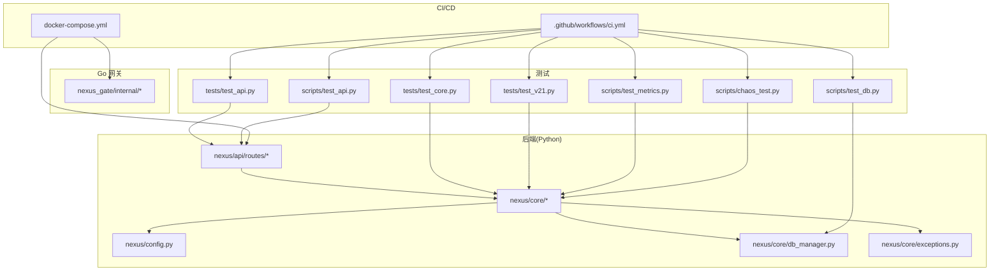
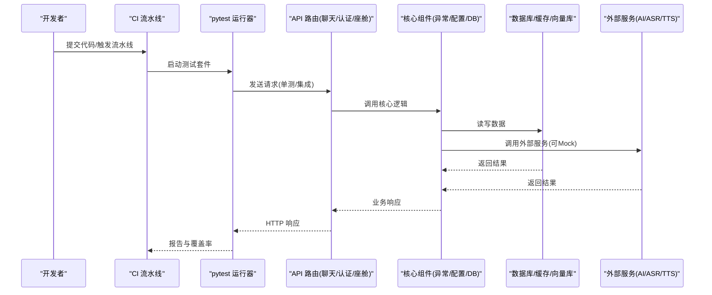
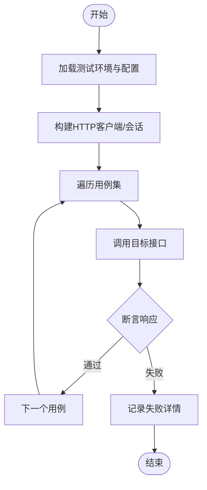
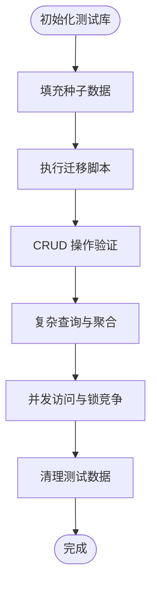
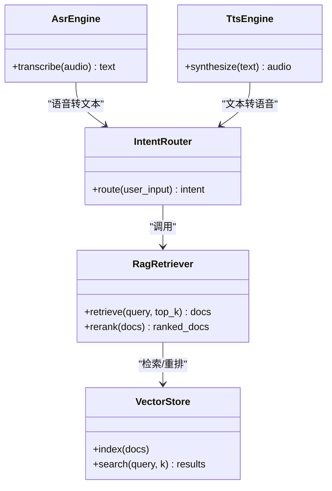
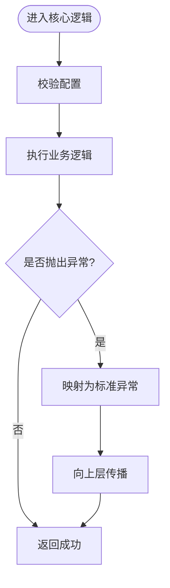
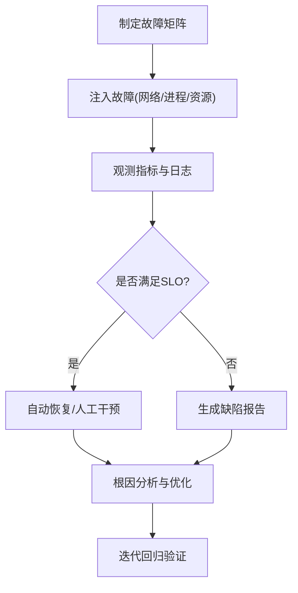
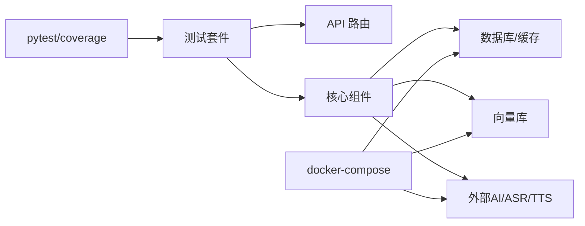
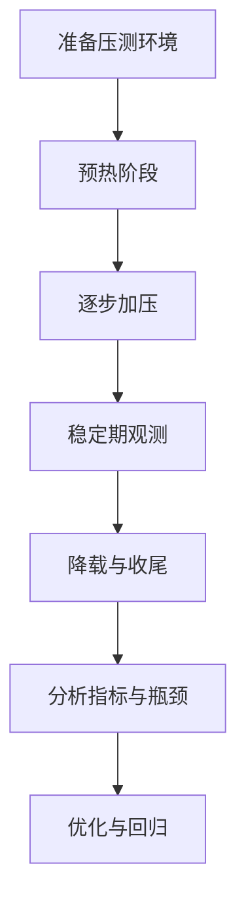

# 测试策略

<cite>
**本文引用的文件**   
- [backend_design/tests/test_api.py](file://backend_design/tests/test_api.py)
- [backend_design/tests/test_core.py](file://backend_design/tests/test_core.py)
- [backend_design/tests/test_v21.py](file://backend_design/tests/test_v21.py)
- [backend_design/scripts/test_api.py](file://backend_design/scripts/test_api.py)
- [backend_design/scripts/test_db.py](file://backend_design/scripts/test_db.py)
- [backend_design/scripts/test_metrics.py](file://backend_design/scripts/test_metrics.py)
- [backend_design/scripts/chaos_test.py](file://backend_design/scripts/chaos_test.py)
- [backend_design/nexus/api/routes/chat.py](file://backend_design/nexus/api/routes/chat.py)
- [backend_design/nexus/api/routes/auth.py](file://backend_design/nexus/api/routes/auth.py)
- [backend_design/nexus/api/routes/cockpit.py](file://backend_design/nexus/api/routes/cockpit.py)
- [backend_design/nexus/core/db_manager.py](file://backend_design/nexus/core/db_manager.py)
- [backend_design/nexus/core/exceptions.py](file://backend_design/nexus/core/exceptions.py)
- [backend_design/nexus/config.py](file://backend_design/nexus/config.py)
- [backend_design/pyproject.toml](file://backend_design/pyproject.toml)
- [backend_design/requirements.txt](file://backend_design/requirements.txt)
- [.github/workflows/ci.yml](file://.github/workflows/ci.yml)
- [docker-compose.yml](file://docker-compose.yml)
</cite>

## 目录
1. [引言](#引言)
2. [项目结构](#项目结构)
3. [核心组件](#核心组件)
4. [架构总览](#架构总览)
5. [详细组件分析](#详细组件分析)
6. [依赖分析](#依赖分析)
7. [性能考虑](#性能考虑)
8. [故障排查指南](#故障排查指南)
9. [结论](#结论)
10. [附录](#附录)

## 引言
本测试策略面向 NexusCockpit 系统，覆盖单元测试、集成测试、性能测试与混沌工程四大维度。目标包括：
- 明确测试框架选择与用例编写规范
- 建立端到端自动化测试流程（含 CI）
- 针对 API 接口、数据库、AI 模型等关键场景制定专项测试方法
- 定义覆盖率指标、持续集成配置与测试数据管理策略
- 提供性能基准与压力测试执行方案

## 项目结构
NexusCockpit 后端采用 Python 服务 + Go 网关的混合架构。测试相关代码主要分布在以下位置：
- 后端 Python 测试套件：backend_design/tests
- 后端脚本化测试与工具：backend_design/scripts
- 前端 Next.js 应用：frontend_design/src（本策略聚焦后端与集成层）
- CI 流水线：.github/workflows/ci.yml
- 容器编排：docker-compose.yml

图表来源
- [backend_design/tests/test_api.py](file://backend_design/tests/test_api.py)
- [backend_design/tests/test_core.py](file://backend_design/tests/test_core.py)
- [backend_design/tests/test_v21.py](file://backend_design/tests/test_v21.py)
- [backend_design/scripts/test_api.py](file://backend_design/scripts/test_api.py)
- [backend_design/scripts/test_db.py](file://backend_design/scripts/test_db.py)
- [backend_design/scripts/test_metrics.py](file://backend_design/scripts/test_metrics.py)
- [backend_design/scripts/chaos_test.py](file://backend_design/scripts/chaos_test.py)
- [backend_design/nexus/api/routes/chat.py](file://backend_design/nexus/api/routes/chat.py)
- [backend_design/nexus/api/routes/auth.py](file://backend_design/nexus/api/routes/auth.py)
- [backend_design/nexus/api/routes/cockpit.py](file://backend_design/nexus/api/routes/cockpit.py)
- [backend_design/nexus/core/db_manager.py](file://backend_design/nexus/core/db_manager.py)
- [backend_design/nexus/core/exceptions.py](file://backend_design/nexus/core/exceptions.py)
- [backend_design/nexus/config.py](file://backend_design/nexus/config.py)
- [.github/workflows/ci.yml](file://.github/workflows/ci.yml)
- [docker-compose.yml](file://docker-compose.yml)

章节来源
- [backend_design/tests/test_api.py](file://backend_design/tests/test_api.py)
- [backend_design/tests/test_core.py](file://backend_design/tests/test_core.py)
- [backend_design/tests/test_v21.py](file://backend_design/tests/test_v21.py)
- [backend_design/scripts/test_api.py](file://backend_design/scripts/test_api.py)
- [backend_design/scripts/test_db.py](file://backend_design/scripts/test_db.py)
- [backend_design/scripts/test_metrics.py](file://backend_design/scripts/test_metrics.py)
- [backend_design/scripts/chaos_test.py](file://backend_design/scripts/chaos_test.py)
- [backend_design/nexus/api/routes/chat.py](file://backend_design/nexus/api/routes/chat.py)
- [backend_design/nexus/api/routes/auth.py](file://backend_design/nexus/api/routes/auth.py)
- [backend_design/nexus/api/routes/cockpit.py](file://backend_design/nexus/api/routes/cockpit.py)
- [backend_design/nexus/core/db_manager.py](file://backend_design/nexus/core/db_manager.py)
- [backend_design/nexus/core/exceptions.py](file://backend_design/nexus/core/exceptions.py)
- [backend_design/nexus/config.py](file://backend_design/nexus/config.py)
- [.github/workflows/ci.yml](file://.github/workflows/ci.yml)
- [docker-compose.yml](file://docker-compose.yml)

## 核心组件
- 测试框架与运行器
  - Python 侧使用 pytest 作为统一测试框架，配合 coverage 进行覆盖率统计。
  - 通过 pyproject.toml 集中配置 pytest 参数与插件。
- 测试分层
  - 单元测试：针对核心模块与业务逻辑（如异常处理、配置加载、数据库连接管理等）。
  - 集成测试：对 API 路由、认证、会话、RAG/向量检索、ASR/TTS 引擎等进行端到端验证。
  - 性能测试：基于脚本与压测工具对关键路径进行吞吐与时延评估。
  - 混沌工程：通过专用脚本注入故障，验证系统的容错与恢复能力。
- 关键被测对象
  - API 路由：聊天、认证、座舱控制等。
  - 核心组件：数据库管理器、异常体系、配置中心。
  - AI 子模块：意图路由、RAG 检索、重排序、向量存储、ASR/TTS 引擎。

章节来源
- [backend_design/pyproject.toml](file://backend_design/pyproject.toml)
- [backend_design/requirements.txt](file://backend_design/requirements.txt)
- [backend_design/tests/test_core.py](file://backend_design/tests/test_core.py)
- [backend_design/nexus/core/exceptions.py](file://backend_design/nexus/core/exceptions.py)
- [backend_design/nexus/config.py](file://backend_design/nexus/config.py)
- [backend_design/nexus/core/db_manager.py](file://backend_design/nexus/core/db_manager.py)

## 架构总览
下图展示测试在系统中的位置与交互关系：测试驱动 API 路由，路由调用核心组件；数据库与外部服务通过容器或模拟环境接入；CI 触发全量或增量测试。

图表来源
- [backend_design/tests/test_api.py](file://backend_design/tests/test_api.py)
- [backend_design/nexus/api/routes/chat.py](file://backend_design/nexus/api/routes/chat.py)
- [backend_design/nexus/api/routes/auth.py](file://backend_design/nexus/api/routes/auth.py)
- [backend_design/nexus/api/routes/cockpit.py](file://backend_design/nexus/api/routes/cockpit.py)
- [backend_design/nexus/core/db_manager.py](file://backend_design/nexus/core/db_manager.py)
- [backend_design/nexus/core/exceptions.py](file://backend_design/nexus/core/exceptions.py)
- [backend_design/nexus/config.py](file://backend_design/nexus/config.py)
- [.github/workflows/ci.yml](file://.github/workflows/ci.yml)

## 详细组件分析

### API 接口测试
- 目标
  - 验证 REST/WebSocket 接口的正确性、健壮性与一致性。
  - 覆盖成功路径、边界条件与错误分支。
- 范围
  - 聊天接口、认证接口、座舱控制接口等。
- 方法与要点
  - 使用 pytest 发起 HTTP 请求，断言状态码、响应体结构与关键字段。
  - 对鉴权流程进行正向与逆向用例设计（无效令牌、过期、权限不足等）。
  - 对输入校验进行充分覆盖（空值、超长、非法类型等）。
  - 对异步/流式响应进行稳定性验证。
- 参考实现
  - 现有 API 测试套件位于 tests 与 scripts 目录，可作为用例模板与基线。

图表来源
- [backend_design/tests/test_api.py](file://backend_design/tests/test_api.py)
- [backend_design/scripts/test_api.py](file://backend_design/scripts/test_api.py)
- [backend_design/nexus/api/routes/chat.py](file://backend_design/nexus/api/routes/chat.py)
- [backend_design/nexus/api/routes/auth.py](file://backend_design/nexus/api/routes/auth.py)
- [backend_design/nexus/api/routes/cockpit.py](file://backend_design/nexus/api/routes/cockpit.py)

章节来源
- [backend_design/tests/test_api.py](file://backend_design/tests/test_api.py)
- [backend_design/scripts/test_api.py](file://backend_design/scripts/test_api.py)
- [backend_design/nexus/api/routes/chat.py](file://backend_design/nexus/api/routes/chat.py)
- [backend_design/nexus/api/routes/auth.py](file://backend_design/nexus/api/routes/auth.py)
- [backend_design/nexus/api/routes/cockpit.py](file://backend_design/nexus/api/routes/cockpit.py)

### 数据库测试
- 目标
  - 验证数据模型、迁移脚本、查询与事务行为。
  - 确保在不同数据库版本与并发场景下的稳定性。
- 方法与要点
  - 使用独立测试库或内存数据库，避免污染生产数据。
  - 对迁移脚本进行幂等性验证与回滚演练。
  - 对复杂查询与索引效果进行回归检查。
- 参考实现
  - 数据库测试脚本位于 scripts/test_db.py，涵盖初始化、写入、读取与清理流程。

图表来源
- [backend_design/scripts/test_db.py](file://backend_design/scripts/test_db.py)
- [backend_design/nexus/core/db_manager.py](file://backend_design/nexus/core/db_manager.py)

章节来源
- [backend_design/scripts/test_db.py](file://backend_design/scripts/test_db.py)
- [backend_design/nexus/core/db_manager.py](file://backend_design/nexus/core/db_manager.py)

### AI 模型与 RAG 测试
- 目标
  - 验证意图路由、RAG 检索、重排序、向量存储、ASR/TTS 等模块的正确性与稳定性。
- 方法与要点
  - 对外部 LLM/Embedding/Reranker 服务使用 Mock 或沙箱实例，隔离网络与资源波动。
  - 对检索质量进行离线评测（召回率、准确率、时延），并纳入回归基线。
  - 对 ASR/TTS 进行音频编解码、采样率与时长边界测试。
- 参考实现
  - 观测与指标脚本可用于采集模型链路耗时与成功率。

图表来源
- [backend_design/nexus/intent/router.py](file://backend_design/nexus/intent/router.py)
- [backend_design/nexus/rag/retriever.py](file://backend_design/nexus/rag/retriever.py)
- [backend_design/nexus/rag/vector_store.py](file://backend_design/nexus/rag/vector_store.py)
- [backend_design/nexus/asr/engine.py](file://backend_design/nexus/asr/engine.py)
- [backend_design/nexus/tts/engine.py](file://backend_design/nexus/tts/engine.py)

章节来源
- [backend_design/nexus/intent/router.py](file://backend_design/nexus/intent/router.py)
- [backend_design/nexus/rag/retriever.py](file://backend_design/nexus/rag/retriever.py)
- [backend_design/nexus/rag/vector_store.py](file://backend_design/nexus/rag/vector_store.py)
- [backend_design/nexus/asr/engine.py](file://backend_design/nexus/asr/engine.py)
- [backend_design/nexus/tts/engine.py](file://backend_design/nexus/tts/engine.py)

### 核心组件与异常处理
- 目标
  - 验证配置加载、异常分类与传播、数据库连接管理。
- 方法与要点
  - 对异常类型进行白名单校验，确保上层能准确捕获与处理。
  - 对配置项缺失、类型不匹配、越界值进行防御性测试。
  - 对数据库连接池、超时与重试策略进行压力与恢复测试。
- 参考实现
  - 核心异常与配置模块为测试重点，结合单元测试覆盖典型路径。

图表来源
- [backend_design/nexus/core/exceptions.py](file://backend_design/nexus/core/exceptions.py)
- [backend_design/nexus/config.py](file://backend_design/nexus/config.py)
- [backend_design/nexus/core/db_manager.py](file://backend_design/nexus/core/db_manager.py)

章节来源
- [backend_design/nexus/core/exceptions.py](file://backend_design/nexus/core/exceptions.py)
- [backend_design/nexus/config.py](file://backend_design/nexus/config.py)
- [backend_design/nexus/core/db_manager.py](file://backend_design/nexus/core/db_manager.py)

### 混沌工程
- 目标
  - 验证系统在部分组件不可用、延迟升高、资源耗尽等异常条件下的可用性与自愈能力。
- 方法与要点
  - 通过脚本注入故障（如关闭数据库、限流、丢包、OOM 模拟）。
  - 观察熔断、降级、重试与告警机制是否生效。
  - 记录恢复时间与错误面，形成改进闭环。
- 参考实现
  - 混沌测试脚本位于 scripts/chaos_test.py，可按需扩展故障矩阵。

图表来源
- [backend_design/scripts/chaos_test.py](file://backend_design/scripts/chaos_test.py)

章节来源
- [backend_design/scripts/chaos_test.py](file://backend_design/scripts/chaos_test.py)

## 依赖分析
- 测试依赖
  - pytest、coverage、requests/httpx、数据库驱动、向量库客户端、ASR/TTS SDK 等。
  - 依赖声明位于 requirements.txt，测试配置集中于 pyproject.toml。
- 运行时依赖
  - 数据库、缓存、消息队列、向量库、外部 AI 服务等由 docker-compose 编排。
- 耦合与内聚
  - API 路由与核心组件解耦良好，便于单测与集成测试并行推进。
  - 外部服务应通过 Mock 或本地沙箱降低耦合度。

图表来源
- [backend_design/pyproject.toml](file://backend_design/pyproject.toml)
- [backend_design/requirements.txt](file://backend_design/requirements.txt)
- [docker-compose.yml](file://docker-compose.yml)

章节来源
- [backend_design/pyproject.toml](file://backend_design/pyproject.toml)
- [backend_design/requirements.txt](file://backend_design/requirements.txt)
- [docker-compose.yml](file://docker-compose.yml)

## 性能考虑
- 基准测试
  - 对关键接口（聊天、认证、座舱控制）建立基准用例，记录 P50/P95/P99 时延与吞吐。
  - 对 RAG 检索链路进行离线评测，固定数据集与评估指标。
- 压力测试
  - 使用压测工具对 API 进行并发压测，逐步提升 QPS，观察错误率与资源占用。
  - 对数据库与向量库进行连接池与索引优化验证。
- 监控与观测
  - 通过 metrics 脚本采集关键指标，结合 Prometheus/Grafana 可视化。
- 参考实现
  - 指标采集脚本位于 scripts/test_metrics.py，可与压测流程联动。

图表来源
- [backend_design/scripts/test_metrics.py](file://backend_design/scripts/test_metrics.py)

章节来源
- [backend_design/scripts/test_metrics.py](file://backend_design/scripts/test_metrics.py)

## 故障排查指南
- 常见问题定位
  - 接口报错：优先查看异常分类与日志上下文，确认是否为配置错误或上游依赖异常。
  - 数据库问题：检查连接池、事务与迁移状态，必要时回滚到已知稳定版本。
  - AI 服务不稳定：切换至 Mock 或本地沙箱，隔离外部不确定性。
- 建议步骤
  - 复现最小用例，缩小问题范围。
  - 开启详细日志与追踪，收集时序与指标。
  - 使用混沌脚本回放故障，验证修复有效性。

章节来源
- [backend_design/nexus/core/exceptions.py](file://backend_design/nexus/core/exceptions.py)
- [backend_design/nexus/core/db_manager.py](file://backend_design/nexus/core/db_manager.py)
- [backend_design/scripts/chaos_test.py](file://backend_design/scripts/chaos_test.py)

## 结论
本测试策略以 pytest 为核心，结合脚本化工具与容器化环境，构建了从单元到混沌的全栈测试体系。通过明确的用例规范、覆盖率要求与 CI 集成，保障 NexusCockpit 在功能、性能与稳定性方面的持续交付质量。后续将围绕 AI 链路质量度量与混沌常态化运行进一步演进。

## 附录

### 测试框架与用例规范
- 框架
  - 使用 pytest 组织用例，按功能域划分目录与命名空间。
  - 使用 fixtures 管理共享资源（客户端、数据库连接、Mock 对象）。
- 命名与结构
  - 文件名以 test_*.py 命名，类与方法语义清晰。
  - 每个用例聚焦单一职责，包含前置、动作、断言与后置清理。
- 断言与期望
  - 明确断言响应码、字段存在性与取值范围。
  - 对错误分支进行显式断言，避免“黑盒通过”。
- 覆盖率
  - 行覆盖率目标：≥80%
  - 分支覆盖率目标：≥70%
  - 关键路径（认证、支付、RAG 检索）覆盖率目标：≥90%

章节来源
- [backend_design/pyproject.toml](file://backend_design/pyproject.toml)
- [backend_design/tests/test_api.py](file://backend_design/tests/test_api.py)
- [backend_design/tests/test_core.py](file://backend_design/tests/test_core.py)
- [backend_design/tests/test_v21.py](file://backend_design/tests/test_v21.py)

### 持续集成配置
- 触发条件
  - 推送与合并请求均触发测试。
- 任务清单
  - 安装依赖、启动依赖服务、运行单测与集成测试、生成覆盖率报告。
- 产物与归档
  - 保存测试报告与覆盖率 HTML，供评审与回溯。
- 参考实现
  - CI 流水线定义于 .github/workflows/ci.yml。

章节来源
- [.github/workflows/ci.yml](file://.github/workflows/ci.yml)

### 测试数据管理
- 原则
  - 隔离：每个用例使用独立数据或事务回滚。
  - 可重复：种子数据固定，支持快速重建。
  - 安全：敏感信息脱敏，禁止硬编码密钥。
- 策略
  - 使用脚本初始化测试库与向量库。
  - 对 AI 评测数据建立版本化管理。
- 参考实现
  - 数据库初始化与测试脚本位于 scripts/test_db.py。

章节来源
- [backend_design/scripts/test_db.py](file://backend_design/scripts/test_db.py)

### 性能基准与压力测试执行
- 基准
  - 固定数据集与负载模型，定期回归对比。
- 压力
  - 分阶段加压，观察错误率、时延与资源曲线。
- 指标
  - 吞吐、时延分布、错误率、CPU/内存/IO 使用率。
- 参考实现
  - 指标采集脚本位于 scripts/test_metrics.py。

章节来源
- [backend_design/scripts/test_metrics.py](file://backend_design/scripts/test_metrics.py)