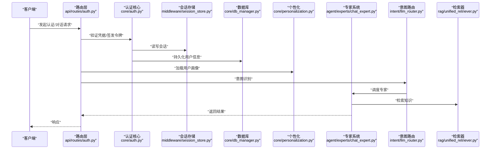
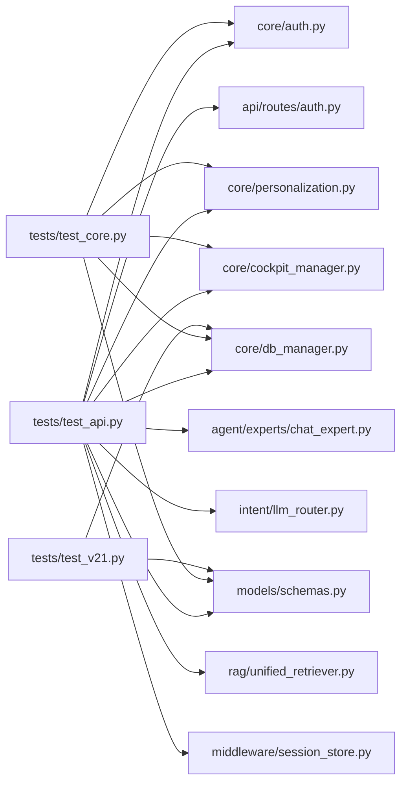

# 单元测试

<cite>
**本文引用的文件**   
- [backend_design/tests/test_api.py](file://backend_design/tests/test_api.py)
- [backend_design/tests/test_core.py](file://backend_design/tests/test_core.py)
- [backend_design/tests/test_v21.py](file://backend_design/tests/test_v21.py)
- [backend_design/pyproject.toml](file://backend_design/pyproject.toml)
- [backend_design/requirements.txt](file://backend_design/requirements.txt)
- [backend_design/nexus/core/auth.py](file://backend_design/nexus/core/auth.py)
- [backend_design/nexus/api/routes/auth.py](file://backend_design/nexus/api/routes/auth.py)
- [backend_design/nexus/core/db_manager.py](file://backend_design/nexus/core/db_manager.py)
- [backend_design/nexus/core/personalization.py](file://backend_design/nexus/core/personalization.py)
- [backend_design/nexus/core/cockpit_manager.py](file://backend_design/nexus/core/cockpit_manager.py)
- [backend_design/nexus/agent/experts/chat_expert.py](file://backend_design/nexus/agent/experts/chat_expert.py)
- [backend_design/nexus/agent/experts/base.py](file://backend_design/nexus/agent/experts/base.py)
- [backend_design/nexus/intent/llm_router.py](file://backend_design/nexus/intent/llm_router.py)
- [backend_design/nexus/rag/unified_retriever.py](file://backend_design/nexus/rag/unified_retriever.py)
- [backend_design/nexus/middleware/session_store.py](file://backend_design/nexus/middleware/session_store.py)
- [backend_design/nexus/models/schemas.py](file://backend_design/nexus/models/schemas.py)
- [backend_design/scripts/test_api.py](file://backend_design/scripts/test_api.py)
</cite>

## 目录
1. [简介](#简介)
2. [项目结构](#项目结构)
3. [核心组件](#核心组件)
4. [架构总览](#架构总览)
5. [详细组件分析](#详细组件分析)
6. [依赖分析](#依赖分析)
7. [性能考虑](#性能考虑)
8. [故障排查指南](#故障排查指南)
9. [结论](#结论)
10. [附录](#附录)

## 简介
本文件面向后端Python模块的单元测试，聚焦以下目标：
- 解释测试框架选择与配置（pytest）及最佳实践
- 给出认证模块、专家系统等关键组件的测试用例设计范式
- 说明如何Mock外部依赖（数据库、AI服务、缓存等）
- 明确测试覆盖率要求与统计方法
- 提供断言模式与示例路径
- 覆盖异步代码与并发测试策略

## 项目结构
本项目采用分层组织方式，测试位于 backend_design/tests 下，按功能域划分；核心业务逻辑位于 backend_design/nexus 子包中。测试与源码分离，便于独立运行与持续集成。

```mermaid
graph TB
subgraph "测试"
TAPI["tests/test_api.py"]
TCORE["tests/test_core.py"]
TV21["tests/test_v21.py"]
end
subgraph "核心模块"
AUTH_CORE["nexus/core/auth.py"]
DBM["nexus/core/db_manager.py"]
PERSONAL["nexus/core/personalization.py"]
COCKPIT["nexus/core/cockpit_manager.py"]
ROUTE_AUTH["nexus/api/routes/auth.py"]
EXPERT_CHAT["nexus/agent/experts/chat_expert.py"]
EXPERT_BASE["nexus/agent/experts/base.py"]
LLM_ROUTER["nexus/intent/llm_router.py"]
RETRIEVER["nexus/rag/unified_retriever.py"]
SESSION_STORE["nexus/middleware/session_store.py"]
MODELS["nexus/models/schemas.py"]
end
TAPI --> ROUTE_AUTH
TAPI --> AUTH_CORE
TAPI --> DBM
TAPI --> PERSONAL
TAPI --> COCKPIT
TAPI --> EXPERT_CHAT
TAPI --> LLM_ROUTER
TAPI --> RETRIEVER
TAPI --> SESSION_STORE
TAPI --> MODELS
TCORE --> AUTH_CORE
TCORE --> DBM
TCORE --> PERSONAL
TCORE --> COCKPIT
TCORE --> MODELS
TV21 --> DBM
TV21 --> MODELS
```

图表来源
- [backend_design/tests/test_api.py](file://backend_design/tests/test_api.py)
- [backend_design/tests/test_core.py](file://backend_design/tests/test_core.py)
- [backend_design/tests/test_v21.py](file://backend_design/tests/test_v21.py)
- [backend_design/nexus/core/auth.py](file://backend_design/nexus/core/auth.py)
- [backend_design/nexus/api/routes/auth.py](file://backend_design/nexus/api/routes/auth.py)
- [backend_design/nexus/core/db_manager.py](file://backend_design/nexus/core/db_manager.py)
- [backend_design/nexus/core/personalization.py](file://backend_design/nexus/core/personalization.py)
- [backend_design/nexus/core/cockpit_manager.py](file://backend_design/nexus/core/cockpit_manager.py)
- [backend_design/nexus/agent/experts/chat_expert.py](file://backend_design/nexus/agent/experts/chat_expert.py)
- [backend_design/nexus/agent/experts/base.py](file://backend_design/nexus/agent/experts/base.py)
- [backend_design/nexus/intent/llm_router.py](file://backend_design/nexus/intent/llm_router.py)
- [backend_design/nexus/rag/unified_retriever.py](file://backend_design/nexus/rag/unified_retriever.py)
- [backend_design/nexus/middleware/session_store.py](file://backend_design/nexus/middleware/session_store.py)
- [backend_design/nexus/models/schemas.py](file://backend_design/nexus/models/schemas.py)

章节来源
- [backend_design/tests/test_api.py](file://backend_design/tests/test_api.py)
- [backend_design/tests/test_core.py](file://backend_design/tests/test_core.py)
- [backend_design/tests/test_v21.py](file://backend_design/tests/test_v21.py)

## 核心组件
本节概述与测试密切相关的核心模块职责，为后续测试设计提供上下文。

- 认证模块 auth.py：负责用户鉴权、令牌签发与校验、会话上下文注入等。
- 数据库管理 db_manager.py：封装连接池、事务、查询执行与错误处理。
- 个性化 personalization.py：加载与更新用户画像、偏好设置。
- 座舱管理器 cockpit_manager.py：编排多专家协作、意图路由与结果聚合。
- 专家系统 agent/experts/*：定义专家基类与具体专家实现（如聊天专家）。
- 意图路由 intent/llm_router.py：基于LLM或启发式规则进行意图识别与分发。
- 检索 unified_retriever.py：统一RAG检索入口，屏蔽底层向量库差异。
- 中间件 session_store.py：会话存储抽象，支持多种后端。
- 数据模型 models/schemas.py：Pydantic模型定义，用于请求/响应校验。

章节来源
- [backend_design/nexus/core/auth.py](file://backend_design/nexus/core/auth.py)
- [backend_design/nexus/core/db_manager.py](file://backend_design/nexus/core/db_manager.py)
- [backend_design/nexus/core/personalization.py](file://backend_design/nexus/core/personalization.py)
- [backend_design/nexus/core/cockpit_manager.py](file://backend_design/nexus/core/cockpit_manager.py)
- [backend_design/nexus/agent/experts/base.py](file://backend_design/nexus/agent/experts/base.py)
- [backend_design/nexus/agent/experts/chat_expert.py](file://backend_design/nexus/agent/experts/chat_expert.py)
- [backend_design/nexus/intent/llm_router.py](file://backend_design/nexus/intent/llm_router.py)
- [backend_design/nexus/rag/unified_retriever.py](file://backend_design/nexus/rag/unified_retriever.py)
- [backend_design/nexus/middleware/session_store.py](file://backend_design/nexus/middleware/session_store.py)
- [backend_design/nexus/models/schemas.py](file://backend_design/nexus/models/schemas.py)

## 架构总览
下图展示从HTTP请求到专家系统与外部依赖的调用链，以及测试应关注的断言点。

图表来源
- [backend_design/nexus/api/routes/auth.py](file://backend_design/nexus/api/routes/auth.py)
- [backend_design/nexus/core/auth.py](file://backend_design/nexus/core/auth.py)
- [backend_design/nexus/middleware/session_store.py](file://backend_design/nexus/middleware/session_store.py)
- [backend_design/nexus/core/db_manager.py](file://backend_design/nexus/core/db_manager.py)
- [backend_design/nexus/core/personalization.py](file://backend_design/nexus/core/personalization.py)
- [backend_design/nexus/agent/experts/chat_expert.py](file://backend_design/nexus/agent/experts/chat_expert.py)
- [backend_design/nexus/intent/llm_router.py](file://backend_design/nexus/intent/llm_router.py)
- [backend_design/nexus/rag/unified_retriever.py](file://backend_design/nexus/rag/unified_retriever.py)

## 详细组件分析

### 认证模块测试
- 关注点
  - 合法凭据登录成功、非法凭据失败、令牌过期与刷新
  - 会话创建/失效、权限校验、租户上下文隔离
- 建议用例
  - 登录成功：构造有效凭据，断言返回令牌与必要字段
  - 登录失败：无效用户名/密码，断言错误码与消息
  - 令牌校验：携带过期令牌访问受保护接口，断言拒绝
  - 会话边界：不同租户/用户会话隔离，断言状态不串扰
- Mock策略
  - 使用 pytest-mock 对数据库、Redis/内存会话、第三方鉴权服务进行替换
  - 针对异常路径模拟网络超时、IO错误、序列化失败
- 断言模式
  - 状态码、响应体结构、字段类型与取值范围
  - 副作用：是否写入会话、是否触发审计日志

章节来源
- [backend_design/nexus/core/auth.py](file://backend_design/nexus/core/auth.py)
- [backend_design/nexus/api/routes/auth.py](file://backend_design/nexus/api/routes/auth.py)
- [backend_design/nexus/middleware/session_store.py](file://backend_design/nexus/middleware/session_store.py)
- [backend_design/nexus/core/db_manager.py](file://backend_design/nexus/core/db_manager.py)

### 专家系统测试（以聊天专家为例）
- 关注点
  - 输入校验、上下文组装、工具调用、输出格式化
  - 降级策略：当外部LLM不可用时回退到规则引擎
- 建议用例
  - 正常流程：构造用户消息与历史，断言专家返回结构与内容片段
  - 工具调用：Mock工具函数，断言参数正确、返回值被整合
  - 异常恢复：模拟LLM超时/限流，断言回退路径与兜底回复
- 依赖Mock
  - LLM客户端、检索器、记忆管理器、车辆控制接口
- 断言模式
  - 结构化输出（JSON Schema）、关键词命中、长度阈值、延迟上限

章节来源
- [backend_design/nexus/agent/experts/chat_expert.py](file://backend_design/nexus/agent/experts/chat_expert.py)
- [backend_design/nexus/agent/experts/base.py](file://backend_design/nexus/agent/experts/base.py)
- [backend_design/nexus/rag/unified_retriever.py](file://backend_design/nexus/rag/unified_retriever.py)

### 意图路由与检索链路测试
- 关注点
  - 路由决策准确性、召回质量、重排序效果
- 建议用例
  - 多意图混合：断言主意图优先级与次意图提示
  - 检索空结果：断言友好提示与引导问题
  - 高延迟场景：断言超时与重试策略
- 断言模式
  - 路由标签集合、候选列表长度、相似度阈值

章节来源
- [backend_design/nexus/intent/llm_router.py](file://backend_design/nexus/intent/llm_router.py)
- [backend_design/nexus/rag/unified_retriever.py](file://backend_design/nexus/rag/unified_retriever.py)

### 数据模型与请求校验测试
- 关注点
  - Pydantic模型约束、必填字段、枚举值、数值范围
- 建议用例
  - 合法载荷通过校验
  - 缺失必填字段、类型不符、越界值导致校验失败
- 断言模式
  - 抛出校验异常的类型与字段定位

章节来源
- [backend_design/nexus/models/schemas.py](file://backend_design/nexus/models/schemas.py)

### 端到端API测试
- 关注点
  - 路由注册、中间件顺序、全局异常处理、幂等性
- 建议用例
  - 典型CRUD与认证流程串联
  - 并发访问同一资源，断言一致性
- 断言模式
  - HTTP语义、响应时间、错误码分布

章节来源
- [backend_design/tests/test_api.py](file://backend_design/tests/test_api.py)

### 核心逻辑回归测试
- 关注点
  - 非UI路径的核心算法与状态机
- 建议用例
  - 个性化推荐分支、座舱状态迁移、配置热更新
- 断言模式
  - 状态前后一致、边界条件收敛

章节来源
- [backend_design/tests/test_core.py](file://backend_design/tests/test_core.py)

### 版本迁移与兼容性测试
- 关注点
  - 数据结构演进、向后兼容、迁移脚本幂等
- 建议用例
  - 旧格式数据导入、新字段默认值填充、重复迁移安全
- 断言模式
  - 迁移后数据完整性、索引有效性

章节来源
- [backend_design/tests/test_v21.py](file://backend_design/tests/test_v21.py)

## 依赖分析
下图展示测试与核心模块之间的依赖关系，帮助定位测试影响面与重构风险。

图表来源
- [backend_design/tests/test_api.py](file://backend_design/tests/test_api.py)
- [backend_design/tests/test_core.py](file://backend_design/tests/test_core.py)
- [backend_design/tests/test_v21.py](file://backend_design/tests/test_v21.py)
- [backend_design/nexus/api/routes/auth.py](file://backend_design/nexus/api/routes/auth.py)
- [backend_design/nexus/core/auth.py](file://backend_design/nexus/core/auth.py)
- [backend_design/nexus/core/db_manager.py](file://backend_design/nexus/core/db_manager.py)
- [backend_design/nexus/core/personalization.py](file://backend_design/nexus/core/personalization.py)
- [backend_design/nexus/core/cockpit_manager.py](file://backend_design/nexus/core/cockpit_manager.py)
- [backend_design/nexus/agent/experts/chat_expert.py](file://backend_design/nexus/agent/experts/chat_expert.py)
- [backend_design/nexus/intent/llm_router.py](file://backend_design/nexus/intent/llm_router.py)
- [backend_design/nexus/rag/unified_retriever.py](file://backend_design/nexus/rag/unified_retriever.py)
- [backend_design/nexus/middleware/session_store.py](file://backend_design/nexus/middleware/session_store.py)
- [backend_design/nexus/models/schemas.py](file://backend_design/nexus/models/schemas.py)

章节来源
- [backend_design/tests/test_api.py](file://backend_design/tests/test_api.py)
- [backend_design/tests/test_core.py](file://backend_design/tests/test_core.py)
- [backend_design/tests/test_v21.py](file://backend_design/tests/test_v21.py)

## 性能考虑
- 测试隔离与复用
  - 使用夹具共享昂贵对象（如连接池、模型实例），在会话级或模块级作用域内复用
  - 避免跨测试共享可变状态，必要时在测试前重置
- I/O与网络
  - 所有外部I/O必须Mock，确保测试快速稳定
  - 对超时/重试路径编写专门用例，避免真实网络抖动
- 并发测试
  - 使用线程/进程并发访问临界资源，断言竞态条件与锁粒度
  - 对队列/任务系统，验证吞吐与背压行为
- 覆盖率与基准
  - 将覆盖率门槛纳入CI，防止退化
  - 对热点路径建立简单基准，监控回归

[本节为通用指导，无需列出具体文件]

## 故障排查指南
- 常见失败原因
  - 未正确Mock外部依赖导致不稳定
  - 测试间状态污染（会话、缓存、临时文件）
  - 时区/随机种子/浮点精度导致的偶发失败
- 定位技巧
  - 缩小范围：仅运行单个文件或单个测试函数
  - 打印最小复现：剥离无关逻辑，保留失败路径
  - 检查日志与指标：结合可观测性输出定位根因
- 修复建议
  - 引入确定性夹具与工厂方法
  - 使用原子操作与隔离环境（内存数据库、内存缓存）
  - 增加重试与退避的测试替身，覆盖异常分支

章节来源
- [backend_design/scripts/test_api.py](file://backend_design/scripts/test_api.py)

## 结论
通过清晰的测试分层、严格的Mock策略与合理的覆盖率门槛，可以显著提升认证、专家系统与检索链路的稳定性与可维护性。建议在CI中固化测试与覆盖率门禁，并持续完善异步与并发用例，保障系统在复杂场景下的健壮性。

[本节为总结性内容，无需列出具体文件]

## 附录

### 测试框架与配置
- 框架选择：pytest
- 插件建议：pytest-cov（覆盖率）、pytest-mock（Mock）、pytest-asyncio（异步）、pytest-xdist（并行）
- 配置文件位置：pyproject.toml 中的测试相关配置段
- 依赖清单：requirements.txt 中包含测试依赖项

章节来源
- [backend_design/pyproject.toml](file://backend_design/pyproject.toml)
- [backend_design/requirements.txt](file://backend_design/requirements.txt)

### 覆盖率要求与统计方法
- 目标阈值：行覆盖率≥80%，分支覆盖率≥70%（可按模块调整）
- 统计命令：使用 pytest-cov 生成HTML与XML报告，上传至CI平台
- 排除策略：对启动脚本、纯配置与生成代码合理排除

章节来源
- [backend_design/pyproject.toml](file://backend_design/pyproject.toml)

### 断言模式与示例路径
- 状态码与响应体：参考API测试文件
- 模型校验：参考数据模型与API路由
- 异常路径：参考核心逻辑与中间件测试

章节来源
- [backend_design/tests/test_api.py](file://backend_design/tests/test_api.py)
- [backend_design/nexus/models/schemas.py](file://backend_design/nexus/models/schemas.py)
- [backend_design/nexus/api/routes/auth.py](file://backend_design/nexus/api/routes/auth.py)

### 异步与并发测试策略
- 异步测试：使用 pytest-asyncio 标记协程测试，提供事件循环夹具
- 并发测试：使用多线程/多进程并发访问共享资源，断言一致性与死锁防护
- 任务队列：使用内存队列替身，验证入队/出队顺序与重试

章节来源
- [backend_design/nexus/middleware/session_store.py](file://backend_design/nexus/middleware/session_store.py)
- [backend_design/nexus/core/db_manager.py](file://backend_design/nexus/core/db_manager.py)