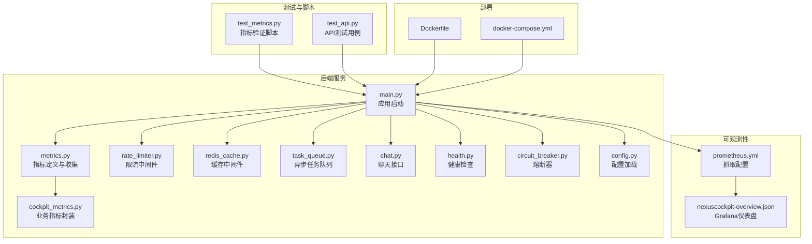
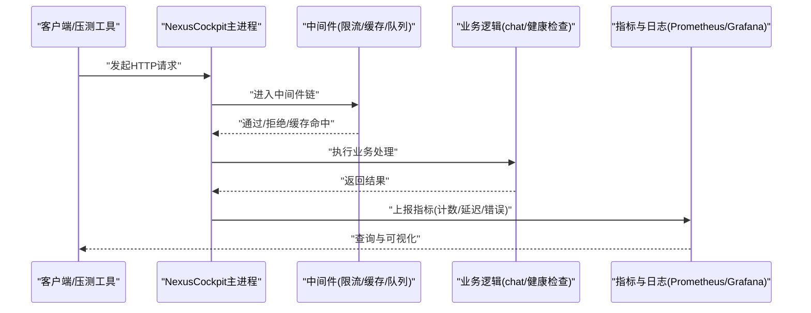
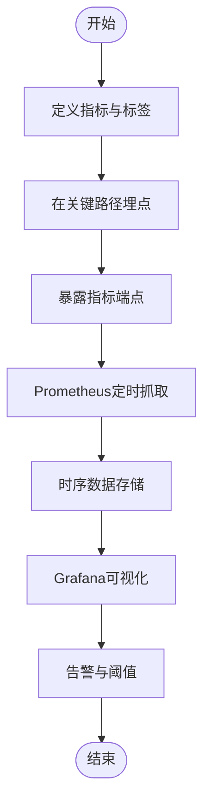
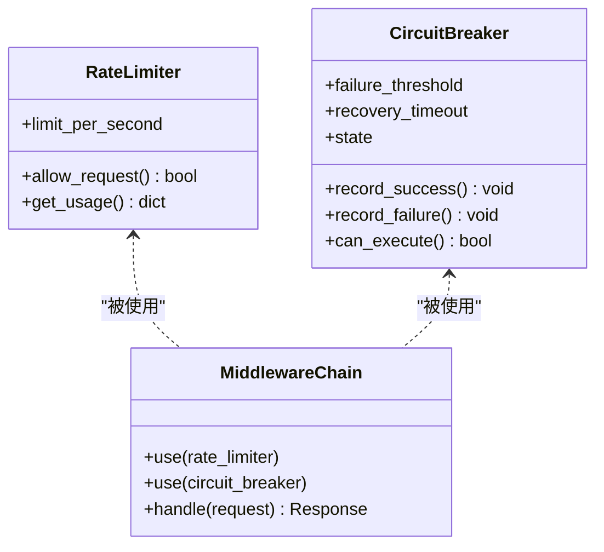
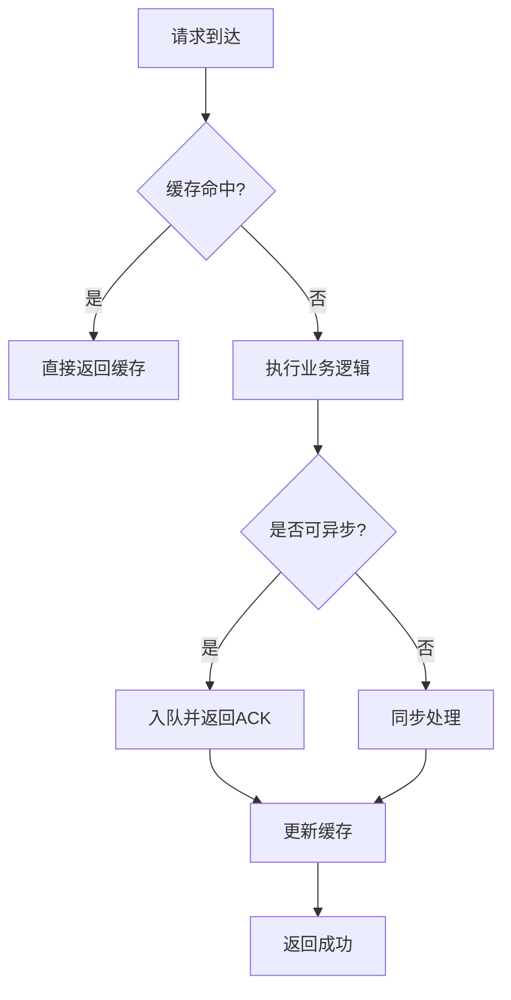
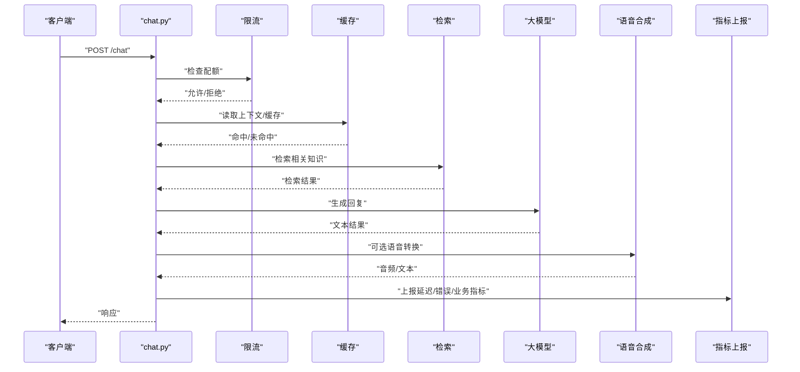
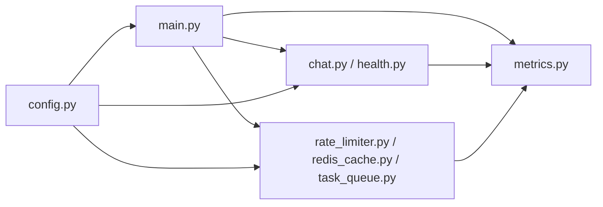

# 性能测试

<cite>
**本文引用的文件**   
- [backend_design/nexus/observability/metrics.py](file://backend_design/nexus/observability/metrics.py)
- [backend_design/nexus/observability/cockpit_metrics.py](file://backend_design/nexus/observability/cockpit_metrics.py)
- [backend_design/nexus/middleware/rate_limiter.py](file://backend_design/nexus/middleware/rate_limiter.py)
- [backend_design/nexus/middleware/redis_cache.py](file://backend_design/nexus/middleware/redis_cache.py)
- [backend_design/nexus/middleware/task_queue.py](file://backend_design/nexus/middleware/task_queue.py)
- [backend_design/nexus/api/routes/chat.py](file://backend_design/nexus/api/routes/chat.py)
- [backend_design/nexus/api/routes/health.py](file://backend_design/nexus/api/routes/health.py)
- [backend_design/nexus/core/circuit_breaker.py](file://backend_design/nexus/core/circuit_breaker.py)
- [backend_design/nexus/config.py](file://backend_design/nexus/config.py)
- [backend_design/nexus/main.py](file://backend_design/nexus/main.py)
- [config/prometheus/prometheus.yml](file://config/prometheus/prometheus.yml)
- [config/grafana/provisioning/dashboards/nexuscockpit-overview.json](file://config/grafana/provisioning/dashboards/nexuscockpit-overview.json)
- [backend_design/scripts/test_metrics.py](file://backend_design/scripts/test_metrics.py)
- [backend_design/tests/test_api.py](file://backend_design/tests/test_api.py)
- [backend_design/pyproject.toml](file://backend_design/pyproject.toml)
- [backend_design/Dockerfile](file://backend_design/Dockerfile)
- [docker-compose.yml](file://docker-compose.yml)
</cite>

## 目录
1. [简介](#简介)
2. [项目结构](#项目结构)
3. [核心组件](#核心组件)
4. [架构总览](#架构总览)
5. [详细组件分析](#详细组件分析)
6. [依赖分析](#依赖分析)
7. [性能考虑](#性能考虑)
8. [故障排查指南](#故障排查指南)
9. [结论](#结论)
10. [附录](#附录)

## 简介
本文件面向NexusCockpit项目的性能测试与优化，覆盖基准测试、压力测试、指标采集与分析、瓶颈定位与优化建议、工具使用与结果分析方法，以及内存泄漏检测与CPU性能分析。文档基于仓库中可观测性、中间件、API路由、配置与部署等源码进行系统化梳理，并提供可直接落地的执行策略与可视化方案。

## 项目结构
本项目在后端服务中内置了Prometheus指标暴露能力，并通过Grafana提供预置仪表盘；同时包含压测脚本与基础API测试用例，便于快速建立性能基线与回归验证。

图表来源
- [backend_design/nexus/main.py](file://backend_design/nexus/main.py)
- [backend_design/nexus/observability/metrics.py](file://backend_design/nexus/observability/metrics.py)
- [backend_design/nexus/observability/cockpit_metrics.py](file://backend_design/nexus/observability/cockpit_metrics.py)
- [backend_design/nexus/middleware/rate_limiter.py](file://backend_design/nexus/middleware/rate_limiter.py)
- [backend_design/nexus/middleware/redis_cache.py](file://backend_design/nexus/middleware/redis_cache.py)
- [backend_design/nexus/middleware/task_queue.py](file://backend_design/nexus/middleware/task_queue.py)
- [backend_design/nexus/api/routes/chat.py](file://backend_design/nexus/api/routes/chat.py)
- [backend_design/nexus/api/routes/health.py](file://backend_design/nexus/api/routes/health.py)
- [backend_design/nexus/core/circuit_breaker.py](file://backend_design/nexus/core/circuit_breaker.py)
- [backend_design/nexus/config.py](file://backend_design/nexus/config.py)
- [config/prometheus/prometheus.yml](file://config/prometheus/prometheus.yml)
- [config/grafana/provisioning/dashboards/nexuscockpit-overview.json](file://config/grafana/provisioning/dashboards/nexuscockpit-overview.json)
- [backend_design/scripts/test_metrics.py](file://backend_design/scripts/test_metrics.py)
- [backend_design/tests/test_api.py](file://backend_design/tests/test_api.py)
- [backend_design/Dockerfile](file://backend_design/Dockerfile)
- [docker-compose.yml](file://docker-compose.yml)

章节来源
- [backend_design/nexus/main.py](file://backend_design/nexus/main.py)
- [backend_design/nexus/observability/metrics.py](file://backend_design/nexus/observability/metrics.py)
- [backend_design/nexus/observability/cockpit_metrics.py](file://backend_design/nexus/observability/cockpit_metrics.py)
- [backend_design/nexus/middleware/rate_limiter.py](file://backend_design/nexus/middleware/rate_limiter.py)
- [backend_design/nexus/middleware/redis_cache.py](file://backend_design/nexus/middleware/redis_cache.py)
- [backend_design/nexus/middleware/task_queue.py](file://backend_design/nexus/middleware/task_queue.py)
- [backend_design/nexus/api/routes/chat.py](file://backend_design/nexus/api/routes/chat.py)
- [backend_design/nexus/api/routes/health.py](file://backend_design/nexus/api/routes/health.py)
- [backend_design/nexus/core/circuit_breaker.py](file://backend_design/nexus/core/circuit_breaker.py)
- [backend_design/nexus/config.py](file://backend_design/nexus/config.py)
- [config/prometheus/prometheus.yml](file://config/prometheus/prometheus.yml)
- [config/grafana/provisioning/dashboards/nexuscockpit-overview.json](file://config/grafana/provisioning/dashboards/nexuscockpit-overview.json)
- [backend_design/scripts/test_metrics.py](file://backend_design/scripts/test_metrics.py)
- [backend_design/tests/test_api.py](file://backend_design/tests/test_api.py)
- [backend_design/Dockerfile](file://backend_design/Dockerfile)
- [docker-compose.yml](file://docker-compose.yml)

## 核心组件
- 指标体系与采集
  - metrics.py：定义并注册Prometheus指标（如请求计数、延迟直方图、错误计数等），在关键路径埋点，暴露标准HTTP端点供Prometheus抓取。
  - cockpit_metrics.py：封装业务相关指标（如对话轮次、技能调用次数、RAG检索耗时等），统一命名空间与标签维度。
- 中间件与保护机制
  - rate_limiter.py：基于令牌桶或滑动窗口实现接口级限流，防止突发流量打满系统。
  - redis_cache.py：热点数据缓存，降低下游依赖压力，提升吞吐。
  - task_queue.py：将耗时操作异步化，削峰填谷，提高整体响应稳定性。
  - circuit_breaker.py：对不稳定外部依赖实施熔断降级，避免雪崩。
- API与健康检查
  - chat.py：核心对话接口，承载LLM/RAG/ASR/TTS等链路，是压测重点。
  - health.py：健康检查端点，用于探针与快速可用性判断。
- 配置与启动
  - config.py：集中管理运行时配置（端口、限流阈值、缓存TTL、队列大小等）。
  - main.py：应用入口，挂载中间件、路由、指标暴露与生命周期钩子。
- 可观测性与可视化
  - prometheus.yml：定义抓取目标与间隔。
  - nexuscockpit-overview.json：Grafana预置仪表盘，聚合关键指标视图。
- 测试与脚本
  - test_metrics.py：校验指标是否按预期上报。
  - test_api.py：基础API功能与边界用例，可作为回归基线。

章节来源
- [backend_design/nexus/observability/metrics.py](file://backend_design/nexus/observability/metrics.py)
- [backend_design/nexus/observability/cockpit_metrics.py](file://backend_design/nexus/observability/cockpit_metrics.py)
- [backend_design/nexus/middleware/rate_limiter.py](file://backend_design/nexus/middleware/rate_limiter.py)
- [backend_design/nexus/middleware/redis_cache.py](file://backend_design/nexus/middleware/redis_cache.py)
- [backend_design/nexus/middleware/task_queue.py](file://backend_design/nexus/middleware/task_queue.py)
- [backend_design/nexus/api/routes/chat.py](file://backend_design/nexus/api/routes/chat.py)
- [backend_design/nexus/api/routes/health.py](file://backend_design/nexus/api/routes/health.py)
- [backend_design/nexus/core/circuit_breaker.py](file://backend_design/nexus/core/circuit_breaker.py)
- [backend_design/nexus/config.py](file://backend_design/nexus/config.py)
- [backend_design/nexus/main.py](file://backend_design/nexus/main.py)
- [config/prometheus/prometheus.yml](file://config/prometheus/prometheus.yml)
- [config/grafana/provisioning/dashboards/nexuscockpit-overview.json](file://config/grafana/provisioning/dashboards/nexuscockpit-overview.json)
- [backend_design/scripts/test_metrics.py](file://backend_design/scripts/test_metrics.py)
- [backend_design/tests/test_api.py](file://backend_design/tests/test_api.py)

## 架构总览
下图展示从客户端到后端服务、再到可观测性栈的完整链路，突出压测与监控的关键节点。

图表来源
- [backend_design/nexus/main.py](file://backend_design/nexus/main.py)
- [backend_design/nexus/middleware/rate_limiter.py](file://backend_design/nexus/middleware/rate_limiter.py)
- [backend_design/nexus/middleware/redis_cache.py](file://backend_design/nexus/middleware/redis_cache.py)
- [backend_design/nexus/middleware/task_queue.py](file://backend_design/nexus/middleware/task_queue.py)
- [backend_design/nexus/api/routes/chat.py](file://backend_design/nexus/api/routes/chat.py)
- [backend_design/nexus/api/routes/health.py](file://backend_design/nexus/api/routes/health.py)
- [backend_design/nexus/observability/metrics.py](file://backend_design/nexus/observability/metrics.py)
- [config/prometheus/prometheus.yml](file://config/prometheus/prometheus.yml)

## 详细组件分析

### 指标与可观测性
- 指标设计原则
  - 明确维度：接口、方法、状态码、租户、用户、模块等。
  - 分层度量：基础设施（CPU/内存/IO）、服务（QPS/延迟/错误率）、业务（技能调用/检索命中率）。
  - 采样与降采样：高并发下采用分位数直方图与指数衰减窗口，控制存储成本。
- 关键指标
  - 请求计数：按接口与方法统计。
  - 延迟分布：P50/P90/P95/P99。
  - 错误率：按状态码与异常类型分类。
  - 资源利用率：CPU、内存、GC停顿、线程池占用。
  - 业务指标：对话轮次、RAG检索耗时、模型调用成功率。
- 采集与可视化
  - Prometheus抓取后端指标端点。
  - Grafana仪表盘聚合展示，支持告警规则与趋势对比。

图表来源
- [backend_design/nexus/observability/metrics.py](file://backend_design/nexus/observability/metrics.py)
- [backend_design/nexus/observability/cockpit_metrics.py](file://backend_design/nexus/observability/cockpit_metrics.py)
- [config/prometheus/prometheus.yml](file://config/prometheus/prometheus.yml)
- [config/grafana/provisioning/dashboards/nexuscockpit-overview.json](file://config/grafana/provisioning/dashboards/nexuscockpit-overview.json)

章节来源
- [backend_design/nexus/observability/metrics.py](file://backend_design/nexus/observability/metrics.py)
- [backend_design/nexus/observability/cockpit_metrics.py](file://backend_design/nexus/observability/cockpit_metrics.py)
- [config/prometheus/prometheus.yml](file://config/prometheus/prometheus.yml)
- [config/grafana/provisioning/dashboards/nexuscockpit-overview.json](file://config/grafana/provisioning/dashboards/nexuscockpit-overview.json)

### 限流与熔断
- 限流策略
  - 接口级限流：针对高频接口设置QPS上限，保护下游。
  - 用户/租户级限流：结合上下文标签，避免单租户独占资源。
- 熔断与降级
  - 失败率/延迟阈值触发熔断，快速失败并回退到默认策略或缓存。
  - 半开探测：周期性放行少量请求以探测恢复。

图表来源
- [backend_design/nexus/middleware/rate_limiter.py](file://backend_design/nexus/middleware/rate_limiter.py)
- [backend_design/nexus/core/circuit_breaker.py](file://backend_design/nexus/core/circuit_breaker.py)
- [backend_design/nexus/main.py](file://backend_design/nexus/main.py)

章节来源
- [backend_design/nexus/middleware/rate_limiter.py](file://backend_design/nexus/middleware/rate_limiter.py)
- [backend_design/nexus/core/circuit_breaker.py](file://backend_design/nexus/core/circuit_breaker.py)
- [backend_design/nexus/main.py](file://backend_design/nexus/main.py)

### 缓存与异步任务
- Redis缓存
  - 热点键缓存：会话上下文、用户偏好、检索结果片段。
  - TTL与失效策略：LRU、随机过期、主动失效。
- 任务队列
  - 长耗时操作（语音合成、批量数据处理）入队，消费者并行处理。
  - 背压与重试：队列长度限制、幂等重试、死信队列。

图表来源
- [backend_design/nexus/middleware/redis_cache.py](file://backend_design/nexus/middleware/redis_cache.py)
- [backend_design/nexus/middleware/task_queue.py](file://backend_design/nexus/middleware/task_queue.py)
- [backend_design/nexus/api/routes/chat.py](file://backend_design/nexus/api/routes/chat.py)

章节来源
- [backend_design/nexus/middleware/redis_cache.py](file://backend_design/nexus/middleware/redis_cache.py)
- [backend_design/nexus/middleware/task_queue.py](file://backend_design/nexus/middleware/task_queue.py)
- [backend_design/nexus/api/routes/chat.py](file://backend_design/nexus/api/routes/chat.py)

### API与健康检查
- 聊天接口
  - 典型链路：鉴权→限流→缓存→意图识别→RAG检索→LLM生成→TTS→指标上报。
  - 压测要点：并发度、请求体大小、流式输出、超时与重试。
- 健康检查
  - 轻量探针：仅检查进程存活与关键依赖可达性。
  - 分级健康：就绪/存活探针分离，便于编排平台调度。

图表来源
- [backend_design/nexus/api/routes/chat.py](file://backend_design/nexus/api/routes/chat.py)
- [backend_design/nexus/middleware/rate_limiter.py](file://backend_design/nexus/middleware/rate_limiter.py)
- [backend_design/nexus/middleware/redis_cache.py](file://backend_design/nexus/middleware/redis_cache.py)
- [backend_design/nexus/observability/metrics.py](file://backend_design/nexus/observability/metrics.py)

章节来源
- [backend_design/nexus/api/routes/chat.py](file://backend_design/nexus/api/routes/chat.py)
- [backend_design/nexus/api/routes/health.py](file://backend_design/nexus/api/routes/health.py)

## 依赖分析
- 内部依赖
  - main.py作为入口，组合中间件、路由与指标暴露。
  - 各中间件与业务模块通过配置中心参数化，解耦性强。
- 外部依赖
  - Prometheus/Grafana：指标采集与可视化。
  - Redis：缓存与会话存储。
  - 向量数据库/图数据库：RAG检索与知识图谱（由其他模块负责）。
- 潜在循环依赖
  - 中间件不应反向依赖具体业务路由，保持单向调用。
  - 指标模块应无副作用，避免引入额外I/O阻塞。

图表来源
- [backend_design/nexus/main.py](file://backend_design/nexus/main.py)
- [backend_design/nexus/observability/metrics.py](file://backend_design/nexus/observability/metrics.py)
- [backend_design/nexus/api/routes/chat.py](file://backend_design/nexus/api/routes/chat.py)
- [backend_design/nexus/api/routes/health.py](file://backend_design/nexus/api/routes/health.py)
- [backend_design/nexus/middleware/rate_limiter.py](file://backend_design/nexus/middleware/rate_limiter.py)
- [backend_design/nexus/middleware/redis_cache.py](file://backend_design/nexus/middleware/redis_cache.py)
- [backend_design/nexus/middleware/task_queue.py](file://backend_design/nexus/middleware/task_queue.py)
- [backend_design/nexus/config.py](file://backend_design/nexus/config.py)

章节来源
- [backend_design/nexus/main.py](file://backend_design/nexus/main.py)
- [backend_design/nexus/config.py](file://backend_design/nexus/config.py)

## 性能考虑
- 基准测试
  - 场景选择：登录鉴权、聊天问答、车辆控制、健康检查。
  - 指标基线：P95/P99延迟、QPS、错误率、资源利用率。
  - 环境一致性：固定硬件规格、网络拓扑、依赖版本。
- 压力测试
  - 并发模型：逐步加压（阶梯式）、峰值冲击、长时间稳态。
  - 混合负载：读写比例、冷热数据分布、流式与非流式混合。
  - 容错注入：依赖慢化、部分失败、网络抖动。
- 指标采集与分析
  - 响应时间：端到端与分段延迟（鉴权/检索/生成/合成）。
  - 吞吐量：QPS与有效吞吐（排除重放与无效请求）。
  - 资源利用率：CPU、内存、GC停顿、线程池、连接池。
  - 业务指标：技能调用成功率、检索命中率、缓存命中率。
- 瓶颈定位
  - 热点接口：按延迟与错误率排序。
  - 外部依赖：下游服务RT与错误率。
  - 锁竞争：队列消费、缓存写入、DB事务。
  - 资源争用：CPU软中断、磁盘IO、网络带宽。
- 优化建议
  - 限流与熔断：保护脆弱依赖，快速失败。
  - 缓存预热与分层：热点数据就近缓存，减少跨域调用。
  - 异步化与批处理：合并小请求，降低开销。
  - 连接池与超时：合理设置最大连接数与超时阈值。
  - 索引与查询优化：RAG检索与数据库查询优化。
  - 水平扩展：无状态服务多副本，配合负载均衡。

[本节为通用指导，不直接分析具体文件]

## 故障排查指南
- 常见问题
  - 指标缺失：确认指标端点可达、Prometheus抓取配置正确。
  - 限流过严：调整阈值与白名单，观察错误率变化。
  - 缓存穿透：增加空值缓存与布隆过滤器。
  - 队列积压：扩容消费者、优化处理逻辑、设置死信队列。
- 诊断步骤
  - 查看Grafana仪表盘，定位异常时段与接口。
  - 拉取对应时间段日志，关联TraceID。
  - 分析CPU/内存/IO曲线，识别热点与抖动。
  - 复现问题并缩小范围，逐步隔离依赖。
- 工具与技巧
  - Prometheus查询语言：计算分位数、环比、同比。
  - Grafana告警：设置阈值与通知渠道。
  - 压测回放：保存请求样本，确保可重复。

章节来源
- [backend_design/scripts/test_metrics.py](file://backend_design/scripts/test_metrics.py)
- [backend_design/tests/test_api.py](file://backend_design/tests/test_api.py)
- [config/prometheus/prometheus.yml](file://config/prometheus/prometheus.yml)
- [config/grafana/provisioning/dashboards/nexuscockpit-overview.json](file://config/grafana/provisioning/dashboards/nexuscockpit-overview.json)

## 结论
通过在关键路径埋点、完善限流与熔断、引入缓存与异步任务，并结合Prometheus与Grafana构建完整的可观测性体系，可以高效建立性能基线、发现瓶颈并持续优化。建议在CI中集成自动化压测与指标回归，保障每次变更的性能质量。

[本节为总结性内容，不直接分析具体文件]

## 附录

### 基准测试实施方法
- 场景设计
  - 登录鉴权：短请求、高并发。
  - 聊天问答：中等长度请求、含RAG与LLM调用。
  - 车辆控制：低延迟要求、强一致。
  - 健康检查：最小开销、快速失败。
- 执行流程
  - 准备环境与数据，预热缓存。
  - 逐步加压至目标QPS，记录指标。
  - 维持稳态一段时间，采集稳定期数据。
  - 峰值冲击后回落，观察恢复时间与抖动。
- 结果判定
  - 满足SLA：P95/P99延迟、错误率、资源利用率。
  - 回归比较：与历史基线对比，超阈告警。

[本节为通用指导，不直接分析具体文件]

### 压力测试脚本编写与执行策略
- 脚本要点
  - 并发模型：协程/线程池，控制连接复用。
  - 请求构造：真实数据分布，包含边界条件。
  - 断言与指标：响应码、延迟、业务字段。
  - 报告输出：CSV/JSON，便于后续分析。
- 执行策略
  - 阶梯式加压：每阶段持续一定时间，观察拐点。
  - 混合负载：不同接口按比例混合。
  - 故障注入：依赖慢化、丢包、重启。
- 工具建议
  - Python脚本：结合requests/aiohttp与自定义指标上报。
  - 命令行工具：wrk、locust、k6（按需选用）。

[本节为通用指导，不直接分析具体文件]

### 性能指标采集与分析方法
- 采集
  - 服务端埋点：请求计数、延迟直方图、错误计数。
  - 系统指标：CPU、内存、IO、网络。
  - 业务指标：技能调用、检索命中率、缓存命中率。
- 分析
  - 分位数分析：P50/P90/P95/P99。
  - 相关性分析：延迟与资源利用率、错误率与依赖RT。
  - 趋势与回归：与历史基线对比，识别退化。

章节来源
- [backend_design/nexus/observability/metrics.py](file://backend_design/nexus/observability/metrics.py)
- [backend_design/nexus/observability/cockpit_metrics.py](file://backend_design/nexus/observability/cockpit_metrics.py)
- [config/prometheus/prometheus.yml](file://config/prometheus/prometheus.yml)
- [config/grafana/provisioning/dashboards/nexuscockpit-overview.json](file://config/grafana/provisioning/dashboards/nexuscockpit-overview.json)

### 性能瓶颈定位与优化建议
- 定位
  - 接口级：按延迟与错误率排序。
  - 依赖级：下游服务RT与错误率。
  - 资源级：CPU软中断、磁盘IO、网络带宽。
- 优化
  - 限流与熔断：保护脆弱依赖。
  - 缓存与异步：减少同步阻塞。
  - 连接池与超时：合理配置。
  - 索引与查询：优化检索与数据库访问。
  - 水平扩展：多副本与负载均衡。

[本节为通用指导，不直接分析具体文件]

### 性能测试工具使用与结果分析
- 工具
  - Prometheus：指标采集与查询。
  - Grafana：可视化与告警。
  - 压测脚本：Python脚本或第三方工具。
- 结果分析
  - 指标看板：综合查看延迟、QPS、错误率。
  - 回归对比：与基线差异显著时深入分析。
  - 根因定位：结合日志与TraceID。

章节来源
- [config/prometheus/prometheus.yml](file://config/prometheus/prometheus.yml)
- [config/grafana/provisioning/dashboards/nexuscockpit-overview.json](file://config/grafana/provisioning/dashboards/nexuscockpit-overview.json)
- [backend_design/scripts/test_metrics.py](file://backend_design/scripts/test_metrics.py)

### 内存泄漏检测与CPU性能分析
- 内存泄漏检测
  - 工具：tracemalloc、objgraph、memory_profiler。
  - 方法：定期快照对比、对象引用追踪、释放热点。
- CPU性能分析
  - 工具：cProfile、py-spy、perf。
  - 方法：热点函数定位、锁竞争分析、I/O等待占比。
- 实践建议
  - 压测期间开启采样，避免影响生产。
  - 结合指标与火焰图，快速定位瓶颈。

[本节为通用指导，不直接分析具体文件]

### 部署与环境配置
- Docker镜像
  - 安装依赖、暴露指标端点、健康检查。
- Compose编排
  - 服务依赖：后端、Prometheus、Grafana、Redis。
  - 环境变量：限流阈值、缓存TTL、队列大小。
- 配置项
  - 端口、限流、缓存、队列、熔断阈值。

章节来源
- [backend_design/Dockerfile](file://backend_design/Dockerfile)
- [docker-compose.yml](file://docker-compose.yml)
- [backend_design/pyproject.toml](file://backend_design/pyproject.toml)
- [backend_design/nexus/config.py](file://backend_design/nexus/config.py)