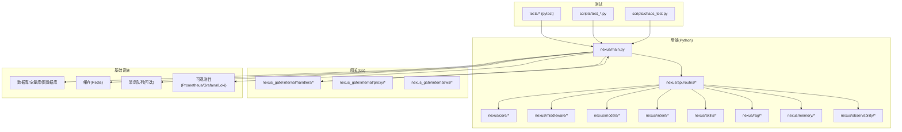
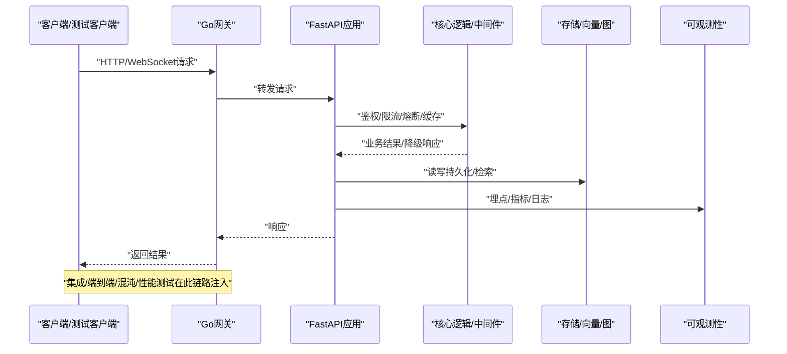
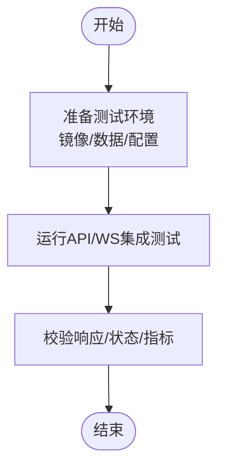
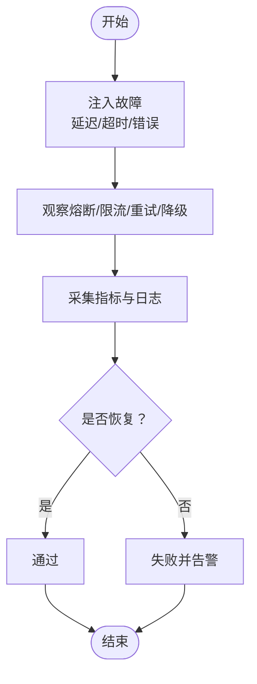
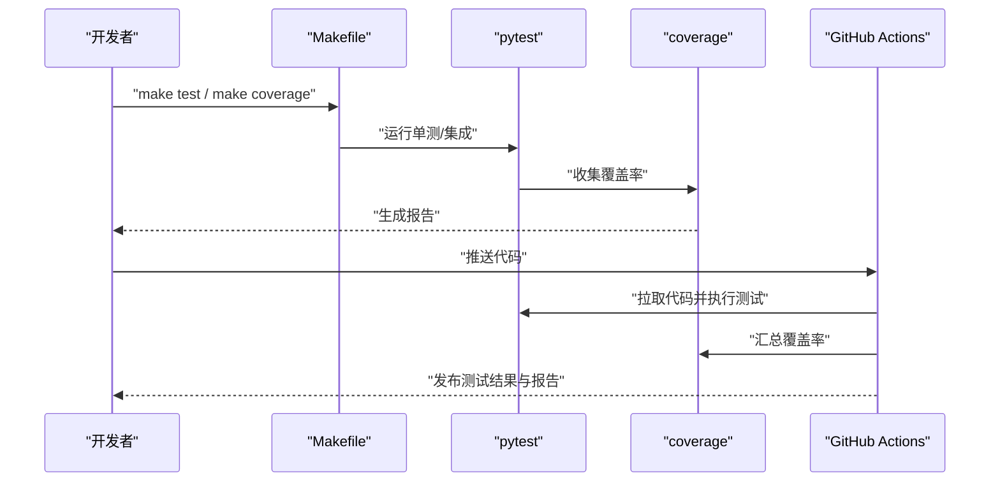
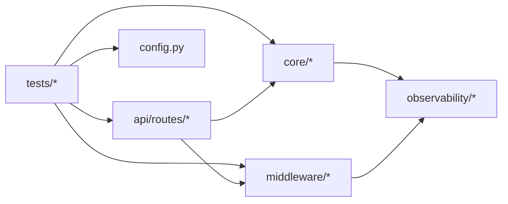

# 测试策略

<cite>
**本文引用的文件**   
- [backend_design/tests/test_api.py](file://backend_design/tests/test_api.py)
- [backend_design/tests/test_core.py](file://backend_design/tests/test_core.py)
- [backend_design/tests/test_v21.py](file://backend_design/tests/test_v21.py)
- [backend_design/scripts/test_api.py](file://backend_design/scripts/test_api.py)
- [backend_design/scripts/chaos_test.py](file://backend_design/scripts/chaos_test.py)
- [backend_design/scripts/test_db.py](file://backend_design/scripts/test_db.py)
- [backend_design/scripts/test_metrics.py](file://backend_design/scripts/test_metrics.py)
- [backend_design/nexus/core/circuit_breaker.py](file://backend_design/nexus/core/circuit_breaker.py)
- [backend_design/nexus/middleware/rate_limiter.py](file://backend_design/nexus/middleware/rate_limiter.py)
- [backend_design/nexus/api/routes/chat.py](file://backend_design/nexus/api/routes/chat.py)
- [backend_design/nexus/api/routes/auth.py](file://backend_design/nexus/api/routes/auth.py)
- [backend_design/nexus/api/websocket.py](file://backend_design/nexus/api/websocket.py)
- [backend_design/nexus/config.py](file://backend_design/nexus/config.py)
- [backend_design/pyproject.toml](file://backend_design/pyproject.toml)
- [backend_design/requirements.txt](file://backend_design/requirements.txt)
- [docker-compose.yml](file://docker-compose.yml)
- [.github/workflows/ci.yml](file://.github/workflows/ci.yml)
- [Makefile](file://Makefile)
- [docs/testing/TESTING.md](file://docs/testing/TESTING.md)
</cite>

## 目录
1. [引言](#引言)
2. [项目结构](#项目结构)
3. [核心组件](#核心组件)
4. [架构总览](#架构总览)
5. [详细组件分析](#详细组件分析)
6. [依赖分析](#依赖分析)
7. [性能考虑](#性能考虑)
8. [故障排查指南](#故障排查指南)
9. [结论](#结论)
10. [附录](#附录)

## 引言
本文件面向NexusCockpit项目的测试策略，覆盖单元测试、集成测试（API与端到端）、混沌工程与容错测试、性能基准与压力测试、Mock与外部依赖模拟、测试环境搭建与自动化执行流程，以及测试报告分析与质量门禁。目标是提供一套可落地、可度量、可持续演进的测试体系，确保系统在复杂AI与多服务集成场景下的稳定性与可观测性。

## 项目结构
后端采用Python FastAPI应用，配套Go网关；测试脚本与用例分布在backend_design下，CI流水线位于.github/workflows，容器编排通过docker-compose管理。关键测试相关位置：
- Python单元测试与集成测试：backend_design/tests
- 集成与专项脚本：backend_design/scripts
- 熔断器与限流等中间件：backend_design/nexus/core, backend_design/nexus/middleware
- API路由与WebSocket：backend_design/nexus/api
- 配置与依赖：backend_design/nexus/config.py, backend_design/pyproject.toml, backend_design/requirements.txt
- CI与Make任务：.github/workflows/ci.yml, Makefile
- 文档指引：docs/testing/TESTING.md

图表来源
- [backend_design/nexus/api/routes/chat.py](file://backend_design/nexus/api/routes/chat.py)
- [backend_design/nexus/api/routes/auth.py](file://backend_design/nexus/api/routes/auth.py)
- [backend_design/nexus/api/websocket.py](file://backend_design/nexus/api/websocket.py)
- [backend_design/nexus/core/circuit_breaker.py](file://backend_design/nexus/core/circuit_breaker.py)
- [backend_design/nexus/middleware/rate_limiter.py](file://backend_design/nexus/middleware/rate_limiter.py)
- [backend_design/nexus/config.py](file://backend_design/nexus/config.py)
- [backend_design/pyproject.toml](file://backend_design/pyproject.toml)
- [backend_design/requirements.txt](file://backend_design/requirements.txt)
- [docker-compose.yml](file://docker-compose.yml)
- [.github/workflows/ci.yml](file://.github/workflows/ci.yml)
- [Makefile](file://Makefile)

章节来源
- [backend_design/tests/test_api.py](file://backend_design/tests/test_api.py)
- [backend_design/tests/test_core.py](file://backend_design/tests/test_core.py)
- [backend_design/tests/test_v21.py](file://backend_design/tests/test_v21.py)
- [backend_design/scripts/test_api.py](file://backend_design/scripts/test_api.py)
- [backend_design/scripts/chaos_test.py](file://backend_design/scripts/chaos_test.py)
- [backend_design/scripts/test_db.py](file://backend_design/scripts/test_db.py)
- [backend_design/scripts/test_metrics.py](file://backend_design/scripts/test_metrics.py)
- [backend_design/nexus/core/circuit_breaker.py](file://backend_design/nexus/core/circuit_breaker.py)
- [backend_design/nexus/middleware/rate_limiter.py](file://backend_design/nexus/middleware/rate_limiter.py)
- [backend_design/nexus/api/routes/chat.py](file://backend_design/nexus/api/routes/chat.py)
- [backend_design/nexus/api/routes/auth.py](file://backend_design/nexus/api/routes/auth.py)
- [backend_design/nexus/api/websocket.py](file://backend_design/nexus/api/websocket.py)
- [backend_design/nexus/config.py](file://backend_design/nexus/config.py)
- [backend_design/pyproject.toml](file://backend_design/pyproject.toml)
- [backend_design/requirements.txt](file://backend_design/requirements.txt)
- [docker-compose.yml](file://docker-compose.yml)
- [.github/workflows/ci.yml](file://.github/workflows/ci.yml)
- [Makefile](file://Makefile)
- [docs/testing/TESTING.md](file://docs/testing/TESTING.md)

## 核心组件
- 测试框架与工具链
  - Python侧使用pytest组织单测与集成测试，结合coverage进行覆盖率统计；Go侧使用标准testing包。
  - 依赖声明在pyproject.toml与requirements.txt中，便于隔离环境与可复现构建。
- 测试分层
  - 单元测试：针对核心逻辑、中间件、模型校验、意图路由、RAG检索器等模块。
  - 集成测试：对HTTP API、WebSocket、认证鉴权、会话存储、缓存、数据库与向量/图存储进行联调验证。
  - 端到端测试：基于真实或仿真环境的完整用户旅程，包括语音识别、对话、技能调用、车辆控制等。
  - 混沌与容错：注入网络抖动、下游超时、熔断降级、限流触发等异常路径。
  - 性能测试：基准与压测，关注P95/P99延迟、吞吐、资源占用与错误率。
- 可观测性与指标
  - 通过metrics与日志采集，为测试与生产一致性提供数据支撑。

章节来源
- [backend_design/pyproject.toml](file://backend_design/pyproject.toml)
- [backend_design/requirements.txt](file://backend_design/requirements.txt)
- [backend_design/nexus/observability/metrics.py](file://backend_design/nexus/observability/metrics.py)
- [backend_design/nexus/observability/cockpit_metrics.py](file://backend_design/nexus/observability/cockpit_metrics.py)
- [backend_design/nexus/core/logger.py](file://backend_design/nexus/core/logger.py)

## 架构总览
下图展示从客户端到后端各层及测试切入点的整体交互关系，并标注了混沌与性能测试的注入点。

图表来源
- [backend_design/nexus/api/routes/chat.py](file://backend_design/nexus/api/routes/chat.py)
- [backend_design/nexus/api/routes/auth.py](file://backend_design/nexus/api/routes/auth.py)
- [backend_design/nexus/api/websocket.py](file://backend_design/nexus/api/websocket.py)
- [backend_design/nexus/core/circuit_breaker.py](file://backend_design/nexus/core/circuit_breaker.py)
- [backend_design/nexus/middleware/rate_limiter.py](file://backend_design/nexus/middleware/rate_limiter.py)
- [backend_design/nexus/config.py](file://backend_design/nexus/config.py)

## 详细组件分析

### 单元测试规范与覆盖率要求
- 编写规范
  - 每个被测单元对应独立测试文件，命名遵循test_<module>.py；按功能域划分目录。
  - 使用参数化测试覆盖边界条件与异常分支；断言明确且最小化副作用。
  - 对外部依赖一律Mock或替换为轻量实现，保证测试快速稳定。
- 覆盖率目标
  - 行覆盖率≥80%，分支覆盖率≥70%；新增代码覆盖率不低于当前基线。
  - 使用coverage生成HTML与XML报告，并在CI中聚合。
- 参考实现与入口
  - 单测组织与示例：[backend_design/tests/test_core.py](file://backend_design/tests/test_core.py)、[backend_design/tests/test_v21.py](file://backend_design/tests/test_v21.py)
  - 覆盖率与运行命令见：[backend_design/pyproject.toml](file://backend_design/pyproject.toml)

章节来源
- [backend_design/tests/test_core.py](file://backend_design/tests/test_core.py)
- [backend_design/tests/test_v21.py](file://backend_design/tests/test_v21.py)
- [backend_design/pyproject.toml](file://backend_design/pyproject.toml)

### 集成测试：API与端到端
- API集成测试
  - 使用TestClient或HTTP客户端启动本地服务，构造典型与异常请求，验证状态码、响应体结构与业务语义。
  - 覆盖认证鉴权、会话、缓存命中/失效、限流与熔断降级路径。
  - 参考：[backend_design/tests/test_api.py](file://backend_design/tests/test_api.py)、[backend_design/scripts/test_api.py](file://backend_design/scripts/test_api.py)
- WebSocket集成测试
  - 建立WS连接，发送/接收事件，验证心跳、重连、错误恢复与状态机流转。
  - 参考：[backend_design/nexus/api/websocket.py](file://backend_design/nexus/api/websocket.py)
- 端到端测试
  - 基于docker-compose拉起完整环境，驱动真实或仿真外部依赖，完成“语音输入→ASR→对话→技能→TTS”的全链路验证。
  - 参考：[docker-compose.yml](file://docker-compose.yml)、[docs/testing/TESTING.md](file://docs/testing/TESTING.md)

图表来源
- [backend_design/tests/test_api.py](file://backend_design/tests/test_api.py)
- [backend_design/scripts/test_api.py](file://backend_design/scripts/test_api.py)
- [backend_design/nexus/api/websocket.py](file://backend_design/nexus/api/websocket.py)
- [docker-compose.yml](file://docker-compose.yml)
- [docs/testing/TESTING.md](file://docs/testing/TESTING.md)

章节来源
- [backend_design/tests/test_api.py](file://backend_design/tests/test_api.py)
- [backend_design/scripts/test_api.py](file://backend_design/scripts/test_api.py)
- [backend_design/nexus/api/websocket.py](file://backend_design/nexus/api/websocket.py)
- [docker-compose.yml](file://docker-compose.yml)
- [docs/testing/TESTING.md](file://docs/testing/TESTING.md)

### 混沌工程与容错测试
- 故障注入策略
  - 网络：丢包、延迟、断开；下游服务：超时、5xx、限流；存储：慢查询、不可用。
  - 应用层：熔断器触发、降级开关、重试风暴抑制、幂等性校验。
- 关键能力与切入点
  - 熔断器：用于保护下游不稳定依赖，避免雪崩。
  - 限流器：防止突发流量打垮系统，保障核心链路可用。
  - 参考实现：
    - 熔断器：[backend_design/nexus/core/circuit_breaker.py](file://backend_design/nexus/core/circuit_breaker.py)
    - 限流器：[backend_design/nexus/middleware/rate_limiter.py](file://backend_design/nexus/middleware/rate_limiter.py)
- 自动化混沌脚本
  - 通过脚本周期性注入故障并观察系统自愈与降级行为。
  - 参考：[backend_design/scripts/chaos_test.py](file://backend_design/scripts/chaos_test.py)

图表来源
- [backend_design/scripts/chaos_test.py](file://backend_design/scripts/chaos_test.py)
- [backend_design/nexus/core/circuit_breaker.py](file://backend_design/nexus/core/circuit_breaker.py)
- [backend_design/nexus/middleware/rate_limiter.py](file://backend_design/nexus/middleware/rate_limiter.py)

章节来源
- [backend_design/scripts/chaos_test.py](file://backend_design/scripts/chaos_test.py)
- [backend_design/nexus/core/circuit_breaker.py](file://backend_design/nexus/core/circuit_breaker.py)
- [backend_design/nexus/middleware/rate_limiter.py](file://backend_design/nexus/middleware/rate_limiter.py)

### 性能测试：基准与压力
- 基准测试
  - 针对热点函数与算法（如检索、排序、序列化）建立基准，监控回归。
- 压力测试
  - 使用并发客户端模拟真实负载，关注QPS、P95/P99延迟、错误率、CPU/内存/IO瓶颈。
  - 结合可观测性指标定位热点与退化。
- 参考脚本与指标
  - 指标采集与导出：[backend_design/nexus/observability/metrics.py](file://backend_design/nexus/observability/metrics.py)、[backend_design/nexus/observability/cockpit_metrics.py](file://backend_design/nexus/observability/cockpit_metrics.py)
  - 性能相关脚本：[backend_design/scripts/test_metrics.py](file://backend_design/scripts/test_metrics.py)

章节来源
- [backend_design/scripts/test_metrics.py](file://backend_design/scripts/test_metrics.py)
- [backend_design/nexus/observability/metrics.py](file://backend_design/nexus/observability/metrics.py)
- [backend_design/nexus/observability/cockpit_metrics.py](file://backend_design/nexus/observability/cockpit_metrics.py)

### Mock数据与外部依赖模拟
- 原则
  - 所有外部依赖（LLM、ASR/TTS、车辆接口、向量/图数据库、Redis、消息队列）必须可替换为Mock或轻量实现。
  - 使用工厂/注册表模式集中管理依赖注入，便于切换实现。
- 实践建议
  - 使用上下文管理器或fixture在测试生命周期内替换依赖。
  - 预置确定性数据与期望输出，避免随机性导致的不稳定。
  - 对异步与长耗时操作设置超时与取消机制。
- 参考位置
  - 配置与依赖注入入口：[backend_design/nexus/config.py](file://backend_design/nexus/config.py)
  - 技能/专家/路由等可扩展模块：[backend_design/nexus/skills/*](file://backend_design/nexus/skills/orchestrator.py)、[backend_design/nexus/agent/experts/*](file://backend_design/nexus/agent/experts/base.py)、[backend_design/nexus/intent/router.py](file://backend_design/nexus/intent/router.py)

章节来源
- [backend_design/nexus/config.py](file://backend_design/nexus/config.py)
- [backend_design/nexus/skills/orchestrator.py](file://backend_design/nexus/skills/orchestrator.py)
- [backend_design/nexus/agent/experts/base.py](file://backend_design/nexus/agent/experts/base.py)
- [backend_design/nexus/intent/router.py](file://backend_design/nexus/intent/router.py)

### 测试环境搭建与自动化执行
- 环境搭建
  - 使用docker-compose一键拉起后端、网关、数据库、缓存、可观测性栈。
  - 初始化必要数据与索引（向量/图）。
- 本地执行
  - 通过Makefile统一入口，支持单测、集成、覆盖率、格式化与lint。
- CI流水线
  - 在GitHub Actions中执行构建、测试、覆盖率上报与制品归档。
- 参考
  - 编排与脚本：[docker-compose.yml](file://docker-compose.yml)、[Makefile](file://Makefile)
  - CI定义：[.github/workflows/ci.yml](file://.github/workflows/ci.yml)
  - 测试说明文档：[docs/testing/TESTING.md](file://docs/testing/TESTING.md)

图表来源
- [Makefile](file://Makefile)
- [.github/workflows/ci.yml](file://.github/workflows/ci.yml)
- [backend_design/pyproject.toml](file://backend_design/pyproject.toml)

章节来源
- [docker-compose.yml](file://docker-compose.yml)
- [Makefile](file://Makefile)
- [.github/workflows/ci.yml](file://.github/workflows/ci.yml)
- [docs/testing/TESTING.md](file://docs/testing/TESTING.md)
- [backend_design/pyproject.toml](file://backend_design/pyproject.toml)

### 测试报告分析与质量门禁
- 报告与分析
  - 生成HTML/XML覆盖率报告，结合CI聚合历史趋势；对热点未覆盖区域制定改进计划。
  - 将关键指标（错误率、延迟分位、吞吐）纳入看板，辅助回归判定。
- 质量门禁
  - 阻断条件：单测失败、覆盖率低于阈值、严重安全漏洞、性能回归超过阈值。
  - 门禁规则在CI中配置，失败则阻止合并与发布。
- 参考
  - CI与任务入口：[.github/workflows/ci.yml](file://.github/workflows/ci.yml)、[Makefile](file://Makefile)
  - 测试说明：[docs/testing/TESTING.md](file://docs/testing/TESTING.md)

章节来源
- [.github/workflows/ci.yml](file://.github/workflows/ci.yml)
- [Makefile](file://Makefile)
- [docs/testing/TESTING.md](file://docs/testing/TESTING.md)

## 依赖分析
- 直接依赖
  - 测试对API路由、中间件、核心逻辑与配置的耦合度较高，需通过依赖注入与Mock降低耦合。
- 间接依赖
  - 通过可观测性模块与配置中心获取运行时信息，测试应能读取并断言这些指标。
- 潜在循环依赖
  - 路由与中间件之间应避免双向引用，必要时引入抽象接口或事件总线解耦。
- 外部依赖
  - 数据库、向量/图存储、缓存、消息队列、LLM/ASR/TTS等均应具备测试替身。

图表来源
- [backend_design/tests/test_api.py](file://backend_design/tests/test_api.py)
- [backend_design/nexus/api/routes/chat.py](file://backend_design/nexus/api/routes/chat.py)
- [backend_design/nexus/middleware/rate_limiter.py](file://backend_design/nexus/middleware/rate_limiter.py)
- [backend_design/nexus/core/circuit_breaker.py](file://backend_design/nexus/core/circuit_breaker.py)
- [backend_design/nexus/config.py](file://backend_design/nexus/config.py)
- [backend_design/nexus/observability/metrics.py](file://backend_design/nexus/observability/metrics.py)

章节来源
- [backend_design/tests/test_api.py](file://backend_design/tests/test_api.py)
- [backend_design/nexus/api/routes/chat.py](file://backend_design/nexus/api/routes/chat.py)
- [backend_design/nexus/middleware/rate_limiter.py](file://backend_design/nexus/middleware/rate_limiter.py)
- [backend_design/nexus/core/circuit_breaker.py](file://backend_design/nexus/core/circuit_breaker.py)
- [backend_design/nexus/config.py](file://backend_design/nexus/config.py)
- [backend_design/nexus/observability/metrics.py](file://backend_design/nexus/observability/metrics.py)

## 性能考虑
- 测试设计
  - 基准测试聚焦热点路径，压力测试覆盖峰值与长尾场景。
  - 引入渐进式加压与稳态检测，避免瞬时尖峰干扰评估。
- 指标与阈值
  - 以P95/P99延迟、错误率、资源利用率为核心指标，设定回归阈值。
- 优化建议
  - 缓存热点数据、减少跨进程/跨服务往返、批处理与分页、合理超时与重试退避。
  - 利用熔断与限流保护脆弱依赖，提升整体可用性。

## 故障排查指南
- 常见问题
  - 端口冲突与服务未就绪：检查docker-compose与启动顺序。
  - 依赖不可用：确认Mock/替身生效，环境变量与配置正确。
  - 指标缺失：核对可观测性采集与上报链路。
- 诊断手段
  - 查看测试日志与指标快照，定位失败阶段与根因。
  - 使用混沌脚本复现问题，逐步缩小范围。
- 参考
  - 数据库与指标脚本：[backend_design/scripts/test_db.py](file://backend_design/scripts/test_db.py)、[backend_design/scripts/test_metrics.py](file://backend_design/scripts/test_metrics.py)
  - 熔断与限流：[backend_design/nexus/core/circuit_breaker.py](file://backend_design/nexus/core/circuit_breaker.py)、[backend_design/nexus/middleware/rate_limiter.py](file://backend_design/nexus/middleware/rate_limiter.py)

章节来源
- [backend_design/scripts/test_db.py](file://backend_design/scripts/test_db.py)
- [backend_design/scripts/test_metrics.py](file://backend_design/scripts/test_metrics.py)
- [backend_design/nexus/core/circuit_breaker.py](file://backend_design/nexus/core/circuit_breaker.py)
- [backend_design/nexus/middleware/rate_limiter.py](file://backend_design/nexus/middleware/rate_limiter.py)

## 结论
本测试策略围绕“分层清晰、依赖可控、可观测性强、自动化完善”的目标展开，覆盖从单元到端到端、从功能到性能与混沌的全链路质量保障。通过严格的覆盖率门禁与持续集成的反馈闭环，持续提升系统的稳定性与交付效率。

## 附录
- 常用命令
  - 运行单测与集成：参见Makefile任务
  - 生成覆盖率报告：参见pyproject.toml配置
  - 启动测试环境：参见docker-compose
- 参考文档
  - 测试说明：[docs/testing/TESTING.md](file://docs/testing/TESTING.md)