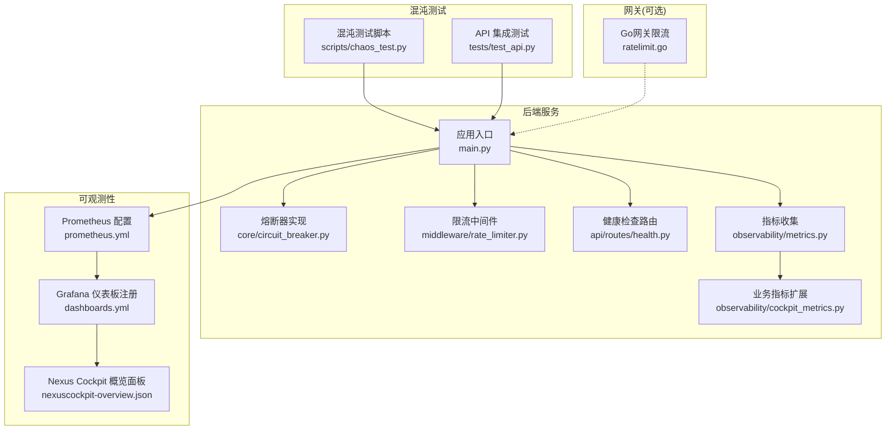
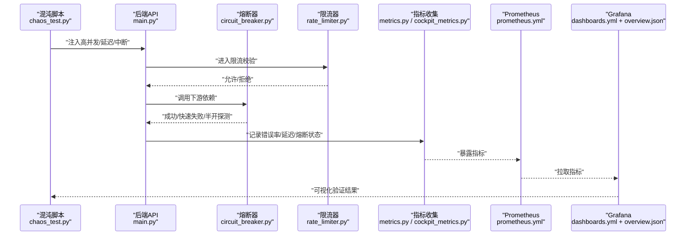
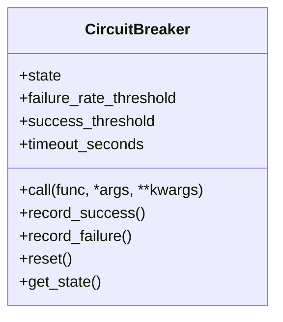
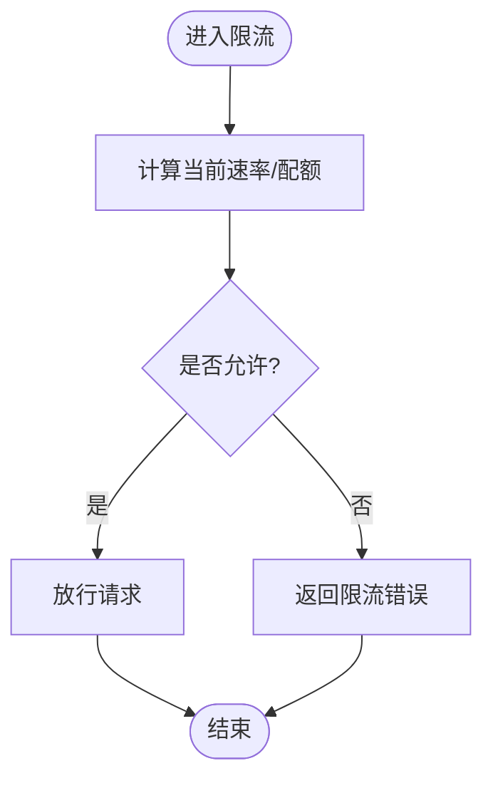
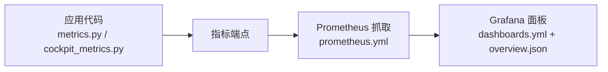
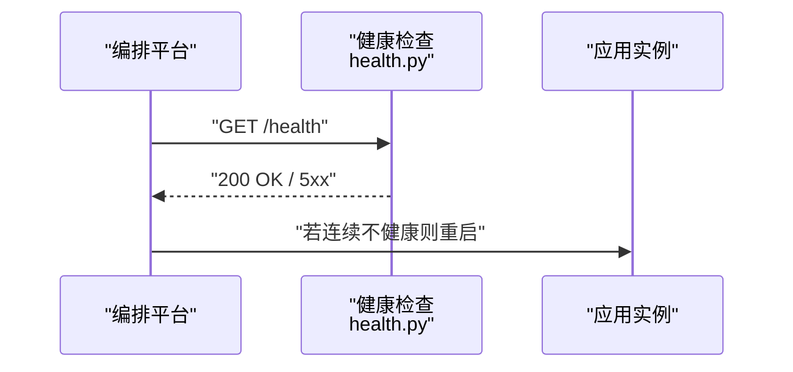
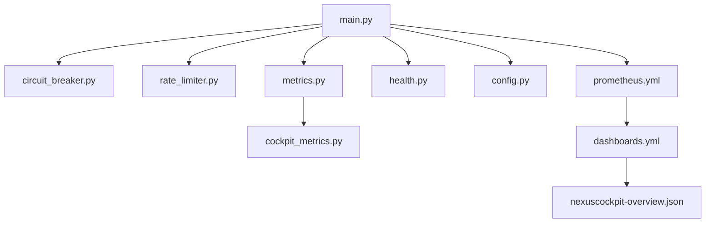

# 混沌工程

<cite>
**本文引用的文件**   
- [backend_design/nexus/core/circuit_breaker.py](file://backend_design/nexus/core/circuit_breaker.py)
- [backend_design/nexus/middleware/rate_limiter.py](file://backend_design/nexus/middleware/rate_limiter.py)
- [backend_design/nexus/observability/metrics.py](file://backend_design/nexus/observability/metrics.py)
- [backend_design/nexus/observability/cockpit_metrics.py](file://backend_design/nexus/observability/cockpit_metrics.py)
- [backend_design/scripts/chaos_test.py](file://backend_design/scripts/chaos_test.py)
- [backend_design/tests/test_api.py](file://backend_design/tests/test_api.py)
- [config/prometheus/prometheus.yml](file://config/prometheus/prometheus.yml)
- [config/grafana/provisioning/dashboards/dashboards.yml](file://config/grafana/provisioning/dashboards/dashboards.yml)
- [config/grafana/provisioning/dashboards/nexuscockpit-overview.json](file://config/grafana/provisioning/dashboards/nexuscockpit-overview.json)
- [backend_design/nexus/api/routes/health.py](file://backend_design/nexus/api/routes/health.py)
- [backend_design/nexus/config.py](file://backend_design/nexus/config.py)
- [backend_design/nexus/main.py](file://backend_design/nexus/main.py)
- [docker-compose.yml](file://docker-compose.yml)
</cite>

## 目录
1. [简介](#简介)
2. [项目结构](#项目结构)
3. [核心组件](#核心组件)
4. [架构总览](#架构总览)
5. [详细组件分析](#详细组件分析)
6. [依赖关系分析](#依赖关系分析)
7. [性能考量](#性能考量)
8. [故障注入策略与方法](#故障注入策略与方法)
9. [容错测试实施流程](#容错测试实施流程)
10. [系统恢复能力测试](#系统恢复能力测试)
11. [混沌实验设计与执行策略](#混沌实验设计与执行策略)
12. [监控与告警配置](#监控与告警配置)
13. [脚本示例与使用指南](#脚本示例与使用指南)
14. [最佳实践与安全考虑](#最佳实践与安全考虑)
15. [故障排查指南](#故障排查指南)
16. [结论](#结论)

## 简介
本文件面向NexusCockpit系统的混沌工程落地，围绕“故障注入、容错验证、恢复能力评估、实验设计原则与执行策略”展开。文档结合代码中的熔断器、限流器、可观测性指标以及现有混沌测试脚本，给出端到端的实施方案与排障建议，帮助团队在可控范围内持续验证系统的健壮性与弹性。

## 项目结构
本项目在后端Python服务中实现了关键容错与可观测性能力，并在Go网关层提供限流等防护；同时通过Prometheus/Grafana进行指标采集与可视化，并提供基础混沌测试脚本用于网络延迟与服务中断等场景的模拟。

图表来源
- [backend_design/nexus/main.py](file://backend_design/nexus/main.py)
- [backend_design/nexus/core/circuit_breaker.py](file://backend_design/nexus/core/circuit_breaker.py)
- [backend_design/nexus/middleware/rate_limiter.py](file://backend_design/nexus/middleware/rate_limiter.py)
- [backend_design/nexus/api/routes/health.py](file://backend_design/nexus/api/routes/health.py)
- [backend_design/nexus/observability/metrics.py](file://backend_design/nexus/observability/metrics.py)
- [backend_design/nexus/observability/cockpit_metrics.py](file://backend_design/nexus/observability/cockpit_metrics.py)
- [config/prometheus/prometheus.yml](file://config/prometheus/prometheus.yml)
- [config/grafana/provisioning/dashboards/dashboards.yml](file://config/grafana/provisioning/dashboards/dashboards.yml)
- [config/grafana/provisioning/dashboards/nexuscockpit-overview.json](file://config/grafana/provisioning/dashboards/nexuscockpit-overview.json)
- [backend_design/scripts/chaos_test.py](file://backend_design/scripts/chaos_test.py)
- [backend_design/tests/test_api.py](file://backend_design/tests/test_api.py)

章节来源
- [backend_design/nexus/main.py](file://backend_design/nexus/main.py)
- [backend_design/nexus/config.py](file://backend_design/nexus/config.py)
- [docker-compose.yml](file://docker-compose.yml)

## 核心组件
- 熔断器：用于保护下游依赖（如外部LLM、向量库、车辆接口等），在失败率或错误阈值触发时快速失败并降级，避免雪崩。
- 限流器：对请求速率进行控制，防止突发流量压垮系统，支持按租户、用户或全局维度限制。
- 可观测性：统一暴露指标，包括错误率、延迟分位、熔断状态、限流计数等，便于混沌实验效果量化。
- 健康检查：提供健康探针，配合编排平台实现自动重启与滚动升级。
- 混沌测试脚本：提供网络延迟、服务中断等注入手段，驱动端到端验证。

章节来源
- [backend_design/nexus/core/circuit_breaker.py](file://backend_design/nexus/core/circuit_breaker.py)
- [backend_design/nexus/middleware/rate_limiter.py](file://backend_design/nexus/middleware/rate_limiter.py)
- [backend_design/nexus/observability/metrics.py](file://backend_design/nexus/observability/metrics.py)
- [backend_design/nexus/observability/cockpit_metrics.py](file://backend_design/nexus/observability/cockpit_metrics.py)
- [backend_design/nexus/api/routes/health.py](file://backend_design/nexus/api/routes/health.py)
- [backend_design/nexus/config.py](file://backend_design/nexus/config.py)

## 架构总览
下图展示混沌工程在系统中的位置与数据流：混沌脚本向目标服务发起异常负载，服务侧通过熔断器与限流器进行自我保护，指标被Prometheus抓取并由Grafana呈现，从而闭环验证容错与恢复能力。

图表来源
- [backend_design/scripts/chaos_test.py](file://backend_design/scripts/chaos_test.py)
- [backend_design/nexus/main.py](file://backend_design/nexus/main.py)
- [backend_design/nexus/core/circuit_breaker.py](file://backend_design/nexus/core/circuit_breaker.py)
- [backend_design/nexus/middleware/rate_limiter.py](file://backend_design/nexus/middleware/rate_limiter.py)
- [backend_design/nexus/observability/metrics.py](file://backend_design/nexus/observability/metrics.py)
- [backend_design/nexus/observability/cockpit_metrics.py](file://backend_design/nexus/observability/cockpit_metrics.py)
- [config/prometheus/prometheus.yml](file://config/prometheus/prometheus.yml)
- [config/grafana/provisioning/dashboards/dashboards.yml](file://config/grafana/provisioning/dashboards/dashboards.yml)
- [config/grafana/provisioning/dashboards/nexuscockpit-overview.json](file://config/grafana/provisioning/dashboards/nexuscockpit-overview.json)

## 详细组件分析

### 熔断器组件
- 职责：封装对下游调用的容错逻辑，维护状态机（关闭→打开→半开），统计错误率/耗时，达到阈值后快速失败，降低重试风暴风险。
- 关键行为：
  - 关闭态：正常放行，累计错误与成功样本。
  - 打开态：直接返回降级响应，等待冷却时间。
  - 半开态：放行少量探测请求，根据结果决定回到关闭或继续打开。
- 指标输出：错误率、成功率、状态切换次数、平均耗时等。

图表来源
- [backend_design/nexus/core/circuit_breaker.py](file://backend_design/nexus/core/circuit_breaker.py)

章节来源
- [backend_design/nexus/core/circuit_breaker.py](file://backend_design/nexus/core/circuit_breaker.py)

### 限流器组件
- 职责：对入站请求进行速率控制，防止过载。可按租户、用户或全局维度隔离。
- 关键行为：
  - 令牌桶/滑动窗口算法（具体以实现为准）。
  - 超限请求快速返回限流错误码，附带重试建议。
  - 暴露限流计数与拒绝率指标。
- 与熔断器协同：先限流再熔断，形成双层防护。

图表来源
- [backend_design/nexus/middleware/rate_limiter.py](file://backend_design/nexus/middleware/rate_limiter.py)

章节来源
- [backend_design/nexus/middleware/rate_limiter.py](file://backend_design/nexus/middleware/rate_limiter.py)

### 可观测性组件
- 指标定义：错误率、延迟分位、QPS、熔断状态、限流拒绝数等。
- 暴露方式：HTTP端点或SDK埋点，供Prometheus抓取。
- 仪表盘：Grafana提供概览面板，聚焦混沌实验关键指标。

图表来源
- [backend_design/nexus/observability/metrics.py](file://backend_design/nexus/observability/metrics.py)
- [backend_design/nexus/observability/cockpit_metrics.py](file://backend_design/nexus/observability/cockpit_metrics.py)
- [config/prometheus/prometheus.yml](file://config/prometheus/prometheus.yml)
- [config/grafana/provisioning/dashboards/dashboards.yml](file://config/grafana/provisioning/dashboards/dashboards.yml)
- [config/grafana/provisioning/dashboards/nexuscockpit-overview.json](file://config/grafana/provisioning/dashboards/nexuscockpit-overview.json)

章节来源
- [backend_design/nexus/observability/metrics.py](file://backend_design/nexus/observability/metrics.py)
- [backend_design/nexus/observability/cockpit_metrics.py](file://backend_design/nexus/observability/cockpit_metrics.py)
- [config/prometheus/prometheus.yml](file://config/prometheus/prometheus.yml)
- [config/grafana/provisioning/dashboards/dashboards.yml](file://config/grafana/provisioning/dashboards/dashboards.yml)
- [config/grafana/provisioning/dashboards/nexuscockpit-overview.json](file://config/grafana/provisioning/dashboards/nexuscockpit-overview.json)

### 健康检查与自愈
- 健康探针：提供健康检查路由，用于编排平台判定实例存活与健康。
- 自动重启：结合容器编排（如Docker Compose/Kubernetes）的重启策略，实现故障后的自动恢复。

图表来源
- [backend_design/nexus/api/routes/health.py](file://backend_design/nexus/api/routes/health.py)
- [docker-compose.yml](file://docker-compose.yml)

章节来源
- [backend_design/nexus/api/routes/health.py](file://backend_design/nexus/api/routes/health.py)
- [docker-compose.yml](file://docker-compose.yml)

## 依赖关系分析
- 模块内聚：熔断器与限流器各自职责清晰，分别关注“下游保护”和“上游限速”。
- 耦合点：应用入口将两者组合到请求处理链路；指标模块为两者提供度量支撑。
- 外部依赖：Prometheus/Grafana作为独立的可观测性组件，通过配置文件接入。

图表来源
- [backend_design/nexus/main.py](file://backend_design/nexus/main.py)
- [backend_design/nexus/core/circuit_breaker.py](file://backend_design/nexus/core/circuit_breaker.py)
- [backend_design/nexus/middleware/rate_limiter.py](file://backend_design/nexus/middleware/rate_limiter.py)
- [backend_design/nexus/observability/metrics.py](file://backend_design/nexus/observability/metrics.py)
- [backend_design/nexus/observability/cockpit_metrics.py](file://backend_design/nexus/observability/cockpit_metrics.py)
- [backend_design/nexus/api/routes/health.py](file://backend_design/nexus/api/routes/health.py)
- [backend_design/nexus/config.py](file://backend_design/nexus/config.py)
- [config/prometheus/prometheus.yml](file://config/prometheus/prometheus.yml)
- [config/grafana/provisioning/dashboards/dashboards.yml](file://config/grafana/provisioning/dashboards/dashboards.yml)
- [config/grafana/provisioning/dashboards/nexuscockpit-overview.json](file://config/grafana/provisioning/dashboards/nexuscockpit-overview.json)

章节来源
- [backend_design/nexus/main.py](file://backend_design/nexus/main.py)
- [backend_design/nexus/config.py](file://backend_design/nexus/config.py)

## 性能考量
- 熔断参数调优：失败率阈值、最小样本数、冷却时间需基于历史基线设定，避免误触发。
- 限流粒度：优先按租户/用户维度限流，避免单租户影响整体可用性。
- 指标开销：采样与聚合策略应平衡精度与CPU/内存占用，避免指标收集成为瓶颈。
- 资源耗尽场景：在混沌实验中谨慎注入CPU/内存压力，确保不影响生产环境稳定性。

[本节为通用指导，无需源码引用]

## 故障注入策略与方法
- 网络延迟：通过混沌脚本对目标接口施加随机延迟，观察熔断器与限流器的联动效果。
- 服务中断：临时停止下游依赖或模拟超时，验证快速失败与降级路径。
- 资源耗尽：在受控环境中注入CPU/内存压力，验证系统是否具备优雅降级与恢复能力。
- 数据一致性：在写入路径注入抖动，验证事务边界与幂等性。

章节来源
- [backend_design/scripts/chaos_test.py](file://backend_design/scripts/chaos_test.py)
- [backend_design/tests/test_api.py](file://backend_design/tests/test_api.py)

## 容错测试实施流程
- 准备阶段：确认指标已上报、健康检查可用、混沌脚本可运行。
- 基线测量：在无故障情况下记录关键指标（错误率、延迟、QPS、熔断状态）。
- 注入阶段：逐步提升故障强度（延迟、丢包、中断），观察系统行为变化。
- 验证阶段：对照预期（熔断触发、限流生效、降级响应），记录差异。
- 恢复阶段：移除故障，验证指标回落到基线范围。
- 复盘阶段：总结阈值与策略调整建议，更新实验用例。

章节来源
- [backend_design/scripts/chaos_test.py](file://backend_design/scripts/chaos_test.py)
- [backend_design/tests/test_api.py](file://backend_design/tests/test_api.py)

## 系统恢复能力测试
- 自动重启：通过编排平台的健康探针判断实例健康，连续失败后触发重启。
- 数据一致性：在恢复后校验关键数据（会话、偏好、记忆）的一致性，必要时引入补偿任务。
- 渐进式恢复：采用灰度/金丝雀发布，逐步放量，避免二次震荡。

章节来源
- [backend_design/nexus/api/routes/health.py](file://backend_design/nexus/api/routes/health.py)
- [docker-compose.yml](file://docker-compose.yml)

## 混沌实验设计与执行策略
- 设计原则：
  - 假设驱动：明确每个实验要验证的假设（例如“下游超时超过X秒会触发熔断”）。
  - 小步快跑：从低强度开始，逐步增强，避免一次性破坏系统。
  - 可观测先行：确保指标与日志完备后再开展实验。
  - 安全边界：限定影响面（租户/用户/区域），设置快速中止开关。
- 执行策略：
  - 定期演练：纳入CI/CD流水线，自动化执行与报告。
  - 多环境覆盖：先在预发环境验证，再在生产灰度区执行。
  - 回归对比：每次变更后复跑基准实验，确保退化不被引入。

[本节为通用指导，无需源码引用]

## 监控与告警配置
- Prometheus抓取：在配置文件中声明目标与抓取间隔，确保关键指标稳定上报。
- Grafana仪表板：注册自定义面板，聚焦错误率、延迟、熔断状态、限流拒绝数等。
- 告警规则：基于阈值与趋势（如错误率突增、熔断频繁切换）配置告警，通知运维与研发。

章节来源
- [config/prometheus/prometheus.yml](file://config/prometheus/prometheus.yml)
- [config/grafana/provisioning/dashboards/dashboards.yml](file://config/grafana/provisioning/dashboards/dashboards.yml)
- [config/grafana/provisioning/dashboards/nexuscockpit-overview.json](file://config/grafana/provisioning/dashboards/nexuscockpit-overview.json)

## 脚本示例与使用指南
- 混沌测试脚本：提供网络延迟、服务中断等注入方法，驱动端到端验证。
- 使用步骤：
  - 启动后端服务与可观测性组件。
  - 运行混沌脚本，指定目标接口与注入参数。
  - 观察Grafana面板与日志，记录关键指标变化。
  - 停止注入，验证恢复情况。
- 集成测试：在API测试套件中加入混沌场景断言，确保回归稳定。

章节来源
- [backend_design/scripts/chaos_test.py](file://backend_design/scripts/chaos_test.py)
- [backend_design/tests/test_api.py](file://backend_design/tests/test_api.py)

## 最佳实践与安全考虑
- 最佳实践：
  - 分层防护：限流在前、熔断在后，结合重试退避与降级策略。
  - 指标驱动：以错误率、延迟分位、饱和度为核心指标制定阈值。
  - 灰度与隔离：按租户/用户隔离故障影响面，避免扩散。
  - 自动化：将混沌实验纳入流水线，持续验证弹性。
- 安全考虑：
  - 权限控制：仅授权人员可执行高风险注入。
  - 白名单与黑名单：限制注入目标与时间段。
  - 审计与留痕：记录所有注入操作与结果，便于追溯。
  - 回滚预案：一键中止注入并恢复基线状态。

[本节为通用指导，无需源码引用]

## 故障排查指南
- 常见问题：
  - 指标未上报：检查Prometheus配置与目标可达性。
  - 熔断误触发：核对失败率阈值与最小样本数，检查下游真实错误。
  - 限流过严：调整配额与窗口大小，区分租户/用户维度。
  - 健康检查不稳定：检查依赖项就绪状态与探针超时配置。
- 定位方法：
  - 查看Grafana面板，定位异常时段与相关指标。
  - 结合日志与追踪，定位具体调用链路与错误堆栈。
  - 逐步缩小注入范围，复现问题并验证修复。

章节来源
- [config/prometheus/prometheus.yml](file://config/prometheus/prometheus.yml)
- [config/grafana/provisioning/dashboards/dashboards.yml](file://config/grafana/provisioning/dashboards/dashboards.yml)
- [config/grafana/provisioning/dashboards/nexuscockpit-overview.json](file://config/grafana/provisioning/dashboards/nexuscockpit-overview.json)
- [backend_design/nexus/core/circuit_breaker.py](file://backend_design/nexus/core/circuit_breaker.py)
- [backend_design/nexus/middleware/rate_limiter.py](file://backend_design/nexus/middleware/rate_limiter.py)
- [backend_design/nexus/api/routes/health.py](file://backend_design/nexus/api/routes/health.py)

## 结论
通过将熔断器、限流器与可观测性体系有机结合，并辅以规范的混沌实验设计与执行策略，NexusCockpit能够在复杂依赖与高负载环境下保持稳健。建议持续完善指标与告警、扩大混沌场景覆盖面，并将混沌工程常态化纳入交付流程，持续提升系统弹性与用户体验。