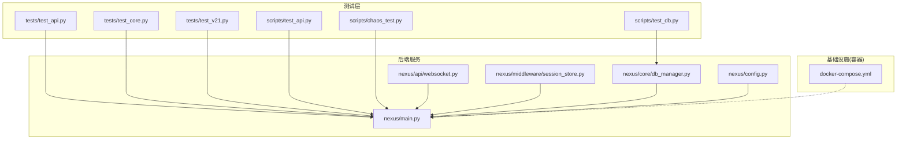
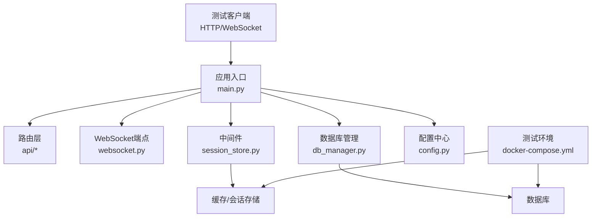
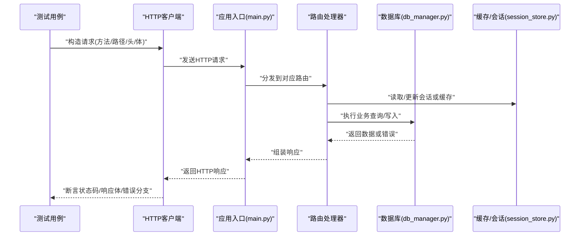
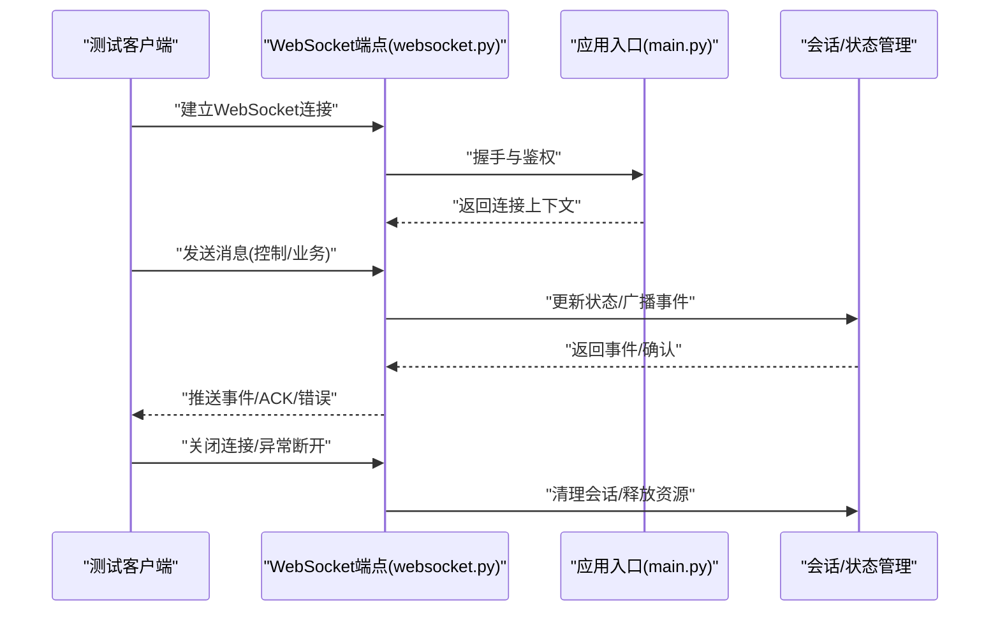
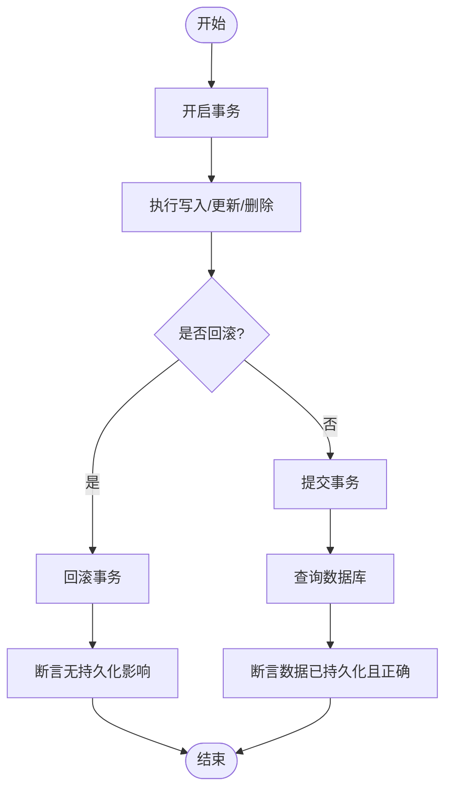
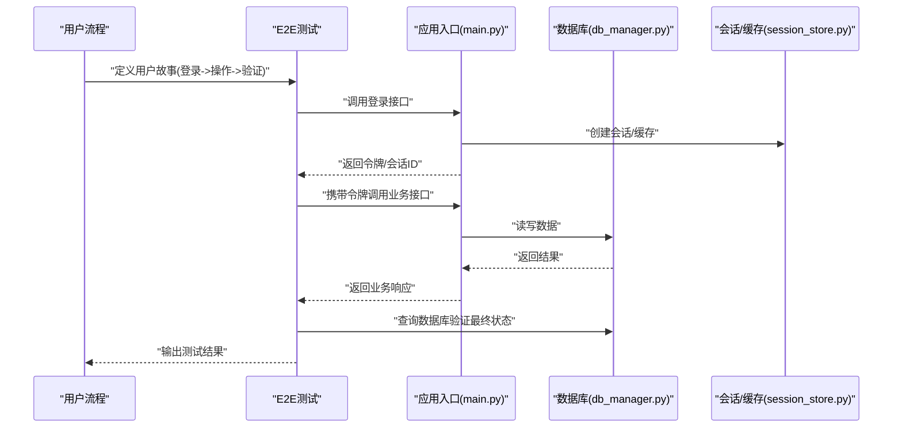
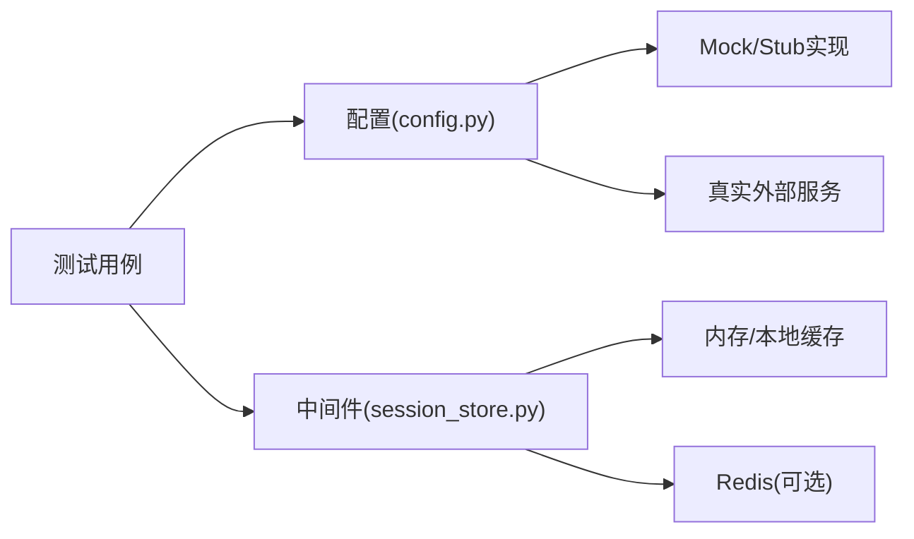
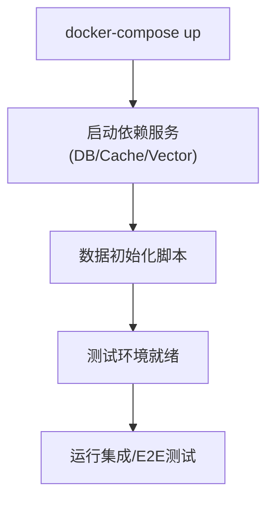
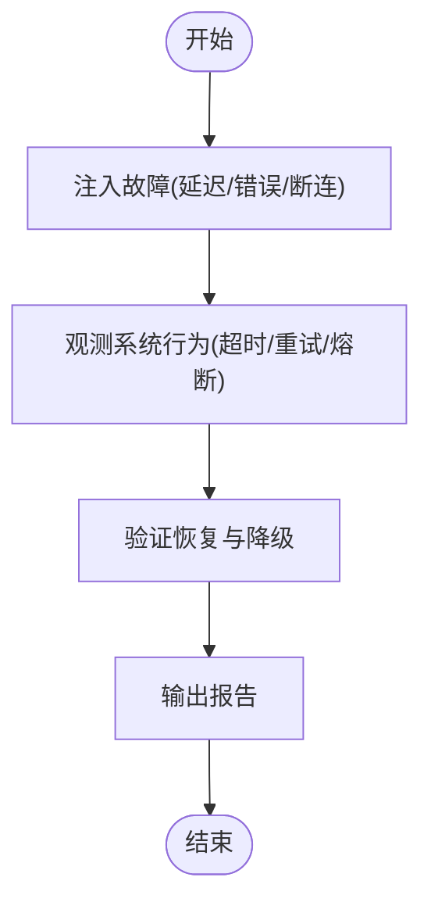
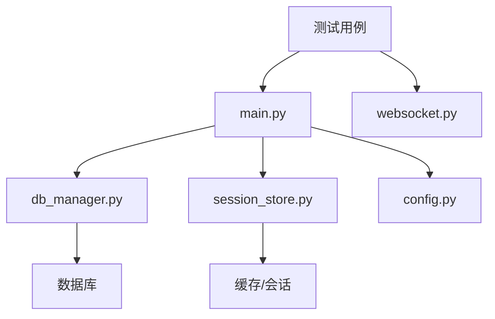

# 集成测试

<cite>
**本文引用的文件**   
- [backend_design/tests/test_api.py](file://backend_design/tests/test_api.py)
- [backend_design/tests/test_core.py](file://backend_design/tests/test_core.py)
- [backend_design/tests/test_v21.py](file://backend_design/tests/test_v21.py)
- [backend_design/scripts/test_api.py](file://backend_design/scripts/test_api.py)
- [backend_design/scripts/test_db.py](file://backend_design/scripts/test_db.py)
- [backend_design/scripts/chaos_test.py](file://backend_design/scripts/chaos_test.py)
- [backend_design/nexus/api/websocket.py](file://backend_design/nexus/api/websocket.py)
- [backend_design/nexus/main.py](file://backend_design/nexus/main.py)
- [backend_design/nexus/core/db_manager.py](file://backend_design/nexus/core/db_manager.py)
- [backend_design/nexus/middleware/session_store.py](file://backend_design/nexus/middleware/session_store.py)
- [backend_design/nexus/config.py](file://backend_design/nexus/config.py)
- [docker-compose.yml](file://docker-compose.yml)
</cite>

## 目录
1. [简介](#简介)
2. [项目结构](#项目结构)
3. [核心组件](#核心组件)
4. [架构总览](#架构总览)
5. [详细组件分析](#详细组件分析)
6. [依赖分析](#依赖分析)
7. [性能考虑](#性能考虑)
8. [故障排查指南](#故障排查指南)
9. [结论](#结论)
10. [附录](#附录)

## 简介
本文件面向后端服务的集成测试与端到端（E2E）测试，覆盖RESTful API与WebSocket接口的测试策略、测试环境搭建、数据准备、外部服务模拟与隔离、请求构造与响应验证、错误处理、数据库状态验证与事务测试等。文档基于仓库中现有的测试脚本与核心模块进行系统化梳理，帮助读者快速建立可复用的集成测试体系。

## 项目结构
与集成测试直接相关的代码主要分布在以下位置：
- backend_design/tests：Python测试用例（API、核心逻辑、迁移相关）
- backend_design/scripts：运行期辅助脚本（API/DB/混沌测试等）
- backend_design/nexus：后端主应用（路由、中间件、数据库管理、配置等）
- docker-compose.yml：本地/CI环境编排（数据库、缓存、向量库等）

图表来源
- [backend_design/tests/test_api.py](file://backend_design/tests/test_api.py)
- [backend_design/tests/test_core.py](file://backend_design/tests/test_core.py)
- [backend_design/tests/test_v21.py](file://backend_design/tests/test_v21.py)
- [backend_design/scripts/test_api.py](file://backend_design/scripts/test_api.py)
- [backend_design/scripts/test_db.py](file://backend_design/scripts/test_db.py)
- [backend_design/scripts/chaos_test.py](file://backend_design/scripts/chaos_test.py)
- [backend_design/nexus/main.py](file://backend_design/nexus/main.py)
- [backend_design/nexus/api/websocket.py](file://backend_design/nexus/api/websocket.py)
- [backend_design/nexus/core/db_manager.py](file://backend_design/nexus/core/db_manager.py)
- [backend_design/nexus/middleware/session_store.py](file://backend_design/nexus/middleware/session_store.py)
- [backend_design/nexus/config.py](file://backend_design/nexus/config.py)
- [docker-compose.yml](file://docker-compose.yml)

章节来源
- [backend_design/tests/test_api.py](file://backend_design/tests/test_api.py)
- [backend_design/tests/test_core.py](file://backend_design/tests/test_core.py)
- [backend_design/tests/test_v21.py](file://backend_design/tests/test_v21.py)
- [backend_design/scripts/test_api.py](file://backend_design/scripts/test_api.py)
- [backend_design/scripts/test_db.py](file://backend_design/scripts/test_db.py)
- [backend_design/scripts/chaos_test.py](file://backend_design/scripts/chaos_test.py)
- [backend_design/nexus/main.py](file://backend_design/nexus/main.py)
- [backend_design/nexus/api/websocket.py](file://backend_design/nexus/api/websocket.py)
- [backend_design/nexus/core/db_manager.py](file://backend_design/nexus/core/db_manager.py)
- [backend_design/nexus/middleware/session_store.py](file://backend_design/nexus/middleware/session_store.py)
- [backend_design/nexus/config.py](file://backend_design/nexus/config.py)
- [docker-compose.yml](file://docker-compose.yml)

## 核心组件
- REST API测试套件
  - 使用HTTP客户端发起请求，校验状态码、响应体结构与业务字段，覆盖成功路径与异常分支。
  - 参考实现路径：[backend_design/tests/test_api.py](file://backend_design/tests/test_api.py)、[backend_design/scripts/test_api.py](file://backend_design/scripts/test_api.py)。
- WebSocket测试
  - 通过WebSocket客户端连接服务端端点，发送消息并断言事件流与状态机转换。
  - 参考实现路径：[backend_design/nexus/api/websocket.py](file://backend_design/nexus/api/websocket.py)。
- 数据库与事务测试
  - 在事务边界内执行写操作并回滚，或提交后查询持久化结果，确保数据一致性。
  - 参考实现路径：[backend_design/scripts/test_db.py](file://backend_design/scripts/test_db.py)、[backend_design/nexus/core/db_manager.py](file://backend_design/nexus/core/db_manager.py)。
- 会话与中间件测试
  - 验证会话存储、限流、缓存等中间件行为对API的影响。
  - 参考实现路径：[backend_design/nexus/middleware/session_store.py](file://backend_design/nexus/middleware/session_store.py)。
- 配置与环境
  - 通过配置文件注入测试环境参数（如数据库URL、Redis地址、开关项）。
  - 参考实现路径：[backend_design/nexus/config.py](file://backend_design/nexus/config.py)。
- 启动与编排
  - 使用docker-compose拉起依赖服务，为集成测试提供稳定环境。
  - 参考实现路径：[docker-compose.yml](file://docker-compose.yml)。

章节来源
- [backend_design/tests/test_api.py](file://backend_design/tests/test_api.py)
- [backend_design/scripts/test_api.py](file://backend_design/scripts/test_api.py)
- [backend_design/nexus/api/websocket.py](file://backend_design/nexus/api/websocket.py)
- [backend_design/scripts/test_db.py](file://backend_design/scripts/test_db.py)
- [backend_design/nexus/core/db_manager.py](file://backend_design/nexus/core/db_manager.py)
- [backend_design/nexus/middleware/session_store.py](file://backend_design/nexus/middleware/session_store.py)
- [backend_design/nexus/config.py](file://backend_design/nexus/config.py)
- [docker-compose.yml](file://docker-compose.yml)

## 架构总览
下图展示集成测试与后端服务及外部依赖的交互关系。测试通过HTTP/WebSocket访问应用入口，经由路由与中间件到达业务逻辑，最终读写数据库与缓存等外部资源。

图表来源
- [backend_design/nexus/main.py](file://backend_design/nexus/main.py)
- [backend_design/nexus/api/websocket.py](file://backend_design/nexus/api/websocket.py)
- [backend_design/nexus/middleware/session_store.py](file://backend_design/nexus/middleware/session_store.py)
- [backend_design/nexus/core/db_manager.py](file://backend_design/nexus/core/db_manager.py)
- [backend_design/nexus/config.py](file://backend_design/nexus/config.py)
- [docker-compose.yml](file://docker-compose.yml)

## 详细组件分析

### REST API集成测试
- 目标
  - 验证关键接口在正常与异常场景下的行为一致性与稳定性。
  - 覆盖认证鉴权、参数校验、业务规则、错误码与响应结构。
- 方法
  - 构造请求：按接口契约组装URL、方法、头部、查询参数与请求体。
  - 发送请求：调用HTTP客户端发起请求，记录耗时与日志。
  - 验证响应：断言状态码、响应体字段、分页/排序/过滤结果。
  - 错误处理：触发非法输入、权限不足、资源不存在等场景，验证错误码与提示。
- 参考实现路径
  - [backend_design/tests/test_api.py](file://backend_design/tests/test_api.py)
  - [backend_design/scripts/test_api.py](file://backend_design/scripts/test_api.py)

图表来源
- [backend_design/nexus/main.py](file://backend_design/nexus/main.py)
- [backend_design/nexus/core/db_manager.py](file://backend_design/nexus/core/db_manager.py)
- [backend_design/nexus/middleware/session_store.py](file://backend_design/nexus/middleware/session_store.py)
- [backend_design/tests/test_api.py](file://backend_design/tests/test_api.py)
- [backend_design/scripts/test_api.py](file://backend_design/scripts/test_api.py)

章节来源
- [backend_design/tests/test_api.py](file://backend_design/tests/test_api.py)
- [backend_design/scripts/test_api.py](file://backend_design/scripts/test_api.py)
- [backend_design/nexus/main.py](file://backend_design/nexus/main.py)
- [backend_design/nexus/core/db_manager.py](file://backend_design/nexus/core/db_manager.py)
- [backend_design/nexus/middleware/session_store.py](file://backend_design/nexus/middleware/session_store.py)

### WebSocket集成测试
- 目标
  - 验证长连接建立、消息收发、心跳保活、断线重连与状态机流转。
- 方法
  - 连接端点：根据路由注册信息构建ws/wss URL并建立连接。
  - 发送消息：按协议格式推送控制/业务消息，监听服务端事件。
  - 断言行为：检查事件顺序、超时处理、错误上报与资源清理。
- 参考实现路径
  - [backend_design/nexus/api/websocket.py](file://backend_design/nexus/api/websocket.py)

图表来源
- [backend_design/nexus/api/websocket.py](file://backend_design/nexus/api/websocket.py)
- [backend_design/nexus/main.py](file://backend_design/nexus/main.py)

章节来源
- [backend_design/nexus/api/websocket.py](file://backend_design/nexus/api/websocket.py)
- [backend_design/nexus/main.py](file://backend_design/nexus/main.py)

### 数据库状态验证与事务测试
- 目标
  - 验证数据写入、查询、更新与删除的正确性；保证事务边界内的原子性与一致性。
- 方法
  - 事务内写+回滚：在测试中开启事务，执行变更并回滚，断言无持久化影响。
  - 事务提交+验证：提交事务后查询数据库，断言数据已落盘且符合预期。
  - 并发与冲突：模拟并发写入，验证锁机制与冲突解决策略。
- 参考实现路径
  - [backend_design/scripts/test_db.py](file://backend_design/scripts/test_db.py)
  - [backend_design/nexus/core/db_manager.py](file://backend_design/nexus/core/db_manager.py)

图表来源
- [backend_design/scripts/test_db.py](file://backend_design/scripts/test_db.py)
- [backend_design/nexus/core/db_manager.py](file://backend_design/nexus/core/db_manager.py)

章节来源
- [backend_design/scripts/test_db.py](file://backend_design/scripts/test_db.py)
- [backend_design/nexus/core/db_manager.py](file://backend_design/nexus/core/db_manager.py)

### 端到端（E2E）测试实施方案
- 目标
  - 模拟用户完整操作流程，从登录、业务操作到结果验证的全链路自动化。
- 方法
  - 流程编排：串联多个API调用与WebSocket事件，形成用户故事级用例。
  - 数据准备：使用初始化脚本或工厂方法创建必要数据，避免手工维护。
  - 断言策略：不仅断言HTTP状态码，还断言数据库最终状态与下游事件。
- 参考实现路径
  - [backend_design/tests/test_core.py](file://backend_design/tests/test_core.py)
  - [backend_design/tests/test_v21.py](file://backend_design/tests/test_v21.py)

图表来源
- [backend_design/nexus/main.py](file://backend_design/nexus/main.py)
- [backend_design/nexus/core/db_manager.py](file://backend_design/nexus/core/db_manager.py)
- [backend_design/nexus/middleware/session_store.py](file://backend_design/nexus/middleware/session_store.py)
- [backend_design/tests/test_core.py](file://backend_design/tests/test_core.py)
- [backend_design/tests/test_v21.py](file://backend_design/tests/test_v21.py)

章节来源
- [backend_design/tests/test_core.py](file://backend_design/tests/test_core.py)
- [backend_design/tests/test_v21.py](file://backend_design/tests/test_v21.py)
- [backend_design/nexus/main.py](file://backend_design/nexus/main.py)
- [backend_design/nexus/core/db_manager.py](file://backend_design/nexus/core/db_manager.py)
- [backend_design/nexus/middleware/session_store.py](file://backend_design/nexus/middleware/session_store.py)

### 外部服务依赖的模拟与隔离策略
- 目标
  - 将第三方服务（LLM、ASR/TTS、向量库、消息队列等）替换为可控的Mock或轻量替代，提升测试稳定性与速度。
- 方法
  - 配置注入：通过配置文件切换真实/模拟实现（如启用Mock引擎、设置内存缓存）。
  - 中间件隔离：对限流、缓存、会话等中间件进行白盒或黑盒验证，必要时用内存替代。
  - 网络隔离：对外部HTTP/gRPC调用进行拦截与固定响应，避免网络抖动影响。
- 参考实现路径
  - [backend_design/nexus/config.py](file://backend_design/nexus/config.py)
  - [backend_design/nexus/middleware/session_store.py](file://backend_design/nexus/middleware/session_store.py)

图表来源
- [backend_design/nexus/config.py](file://backend_design/nexus/config.py)
- [backend_design/nexus/middleware/session_store.py](file://backend_design/nexus/middleware/session_store.py)

章节来源
- [backend_design/nexus/config.py](file://backend_design/nexus/config.py)
- [backend_design/nexus/middleware/session_store.py](file://backend_design/nexus/middleware/session_store.py)

### 测试环境搭建与数据准备
- 目标
  - 提供一键式环境拉起与数据初始化能力，确保测试可重复执行。
- 方法
  - 容器编排：使用docker-compose定义数据库、缓存、向量库等服务。
  - 数据初始化：通过脚本或SQL导入基础数据，或在测试前动态生成。
- 参考实现路径
  - [docker-compose.yml](file://docker-compose.yml)
  - [backend_design/scripts/test_db.py](file://backend_design/scripts/test_db.py)

图表来源
- [docker-compose.yml](file://docker-compose.yml)
- [backend_design/scripts/test_db.py](file://backend_design/scripts/test_db.py)

章节来源
- [docker-compose.yml](file://docker-compose.yml)
- [backend_design/scripts/test_db.py](file://backend_design/scripts/test_db.py)

### 混沌与健壮性测试
- 目标
  - 在受控条件下注入故障（延迟、丢包、服务不可用），验证系统降级与恢复能力。
- 方法
  - 注入异常：随机延迟、中断连接、返回错误码。
  - 观测指标：关注超时、重试、熔断与告警。
- 参考实现路径
  - [backend_design/scripts/chaos_test.py](file://backend_design/scripts/chaos_test.py)

图表来源
- [backend_design/scripts/chaos_test.py](file://backend_design/scripts/chaos_test.py)

章节来源
- [backend_design/scripts/chaos_test.py](file://backend_design/scripts/chaos_test.py)

## 依赖分析
- 组件耦合
  - 测试层依赖应用入口与路由，间接依赖中间件与数据库管理。
  - WebSocket测试依赖端点注册与会话状态管理。
- 外部依赖
  - 数据库、缓存、向量库由docker-compose统一编排，测试通过配置注入连接信息。
- 潜在风险
  - 外部服务不稳定导致测试失败，需加强Mock与隔离。
  - 共享状态未清理导致用例间干扰，需在测试前后进行数据清理。

图表来源
- [backend_design/nexus/main.py](file://backend_design/nexus/main.py)
- [backend_design/nexus/api/websocket.py](file://backend_design/nexus/api/websocket.py)
- [backend_design/nexus/core/db_manager.py](file://backend_design/nexus/core/db_manager.py)
- [backend_design/nexus/middleware/session_store.py](file://backend_design/nexus/middleware/session_store.py)
- [backend_design/nexus/config.py](file://backend_design/nexus/config.py)

章节来源
- [backend_design/nexus/main.py](file://backend_design/nexus/main.py)
- [backend_design/nexus/api/websocket.py](file://backend_design/nexus/api/websocket.py)
- [backend_design/nexus/core/db_manager.py](file://backend_design/nexus/core/db_manager.py)
- [backend_design/nexus/middleware/session_store.py](file://backend_design/nexus/middleware/session_store.py)
- [backend_design/nexus/config.py](file://backend_design/nexus/config.py)

## 性能考虑
- 减少外部依赖开销：优先使用内存缓存与Mock，降低I/O等待。
- 并行执行：将独立用例分组并行，缩短整体时长。
- 数据复用：在事务边界内批量准备数据，避免重复初始化。
- 监控与采样：对关键路径添加计时与采样，识别热点与瓶颈。

## 故障排查指南
- 常见问题
  - 连接失败：检查docker-compose服务状态与端口映射。
  - 鉴权失败：确认令牌生成与传递方式是否符合接口契约。
  - 数据不一致：核对事务边界与提交时机，检查并发冲突。
  - WebSocket异常：验证心跳与重连逻辑，检查事件顺序。
- 定位手段
  - 查看测试日志与应用日志，结合配置开关提高输出粒度。
  - 使用最小复现用例逐步缩小范围。
  - 针对数据库问题，导出快照并在本地回放。

章节来源
- [backend_design/nexus/config.py](file://backend_design/nexus/config.py)
- [backend_design/nexus/core/db_manager.py](file://backend_design/nexus/core/db_manager.py)
- [backend_design/nexus/api/websocket.py](file://backend_design/nexus/api/websocket.py)

## 结论
通过分层化的集成测试与端到端测试方案，结合容器化环境与Mock隔离策略，可有效保障REST与WebSocket接口的质量与稳定性。建议在CI流水线中常态化执行，配合混沌测试持续验证系统的健壮性与可恢复性。

## 附录
- 建议的测试分类
  - 单元/组件测试：聚焦函数与类级别行为。
  - 集成测试：覆盖API、中间件与数据库交互。
  - 端到端测试：覆盖用户故事与跨服务流程。
  - 混沌测试：注入故障验证降级与恢复。
- 最佳实践
  - 明确契约：接口文档与测试用例同步演进。
  - 数据自治：每个用例自包含数据准备与清理。
  - 可观测性：关键路径埋点与指标采集。