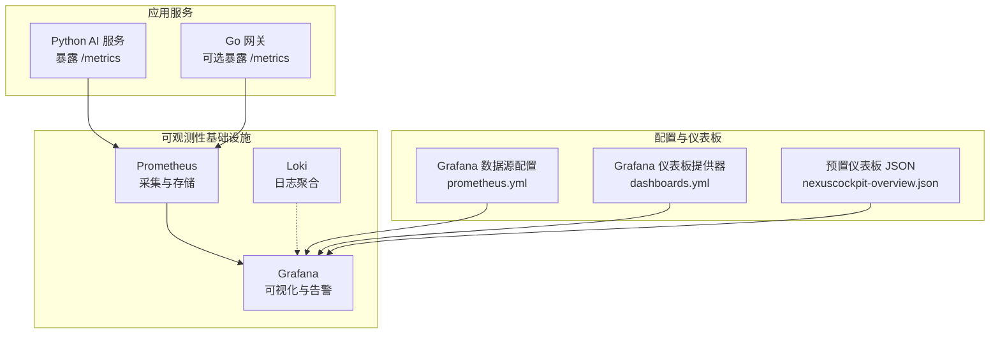
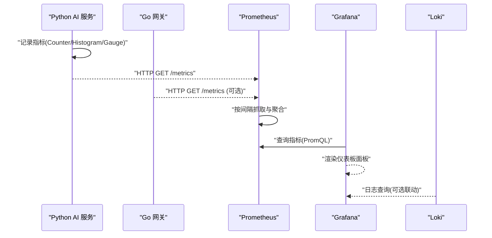
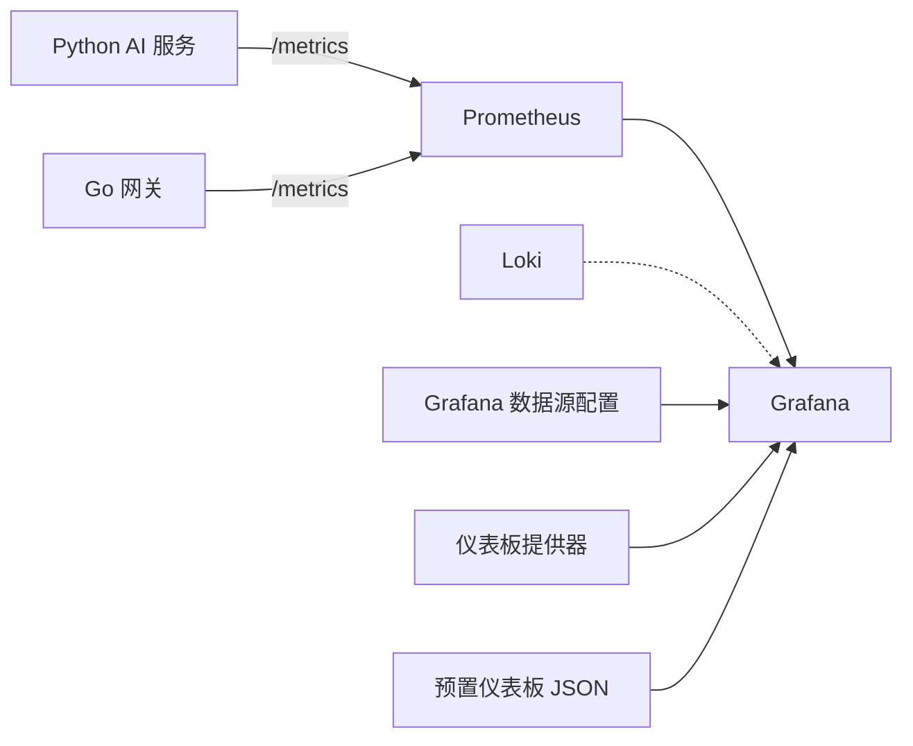

# Grafana可视化看板

<cite>
**本文引用的文件**   
- [config/grafana/provisioning/dashboards/nexuscockpit-overview.json](file://config/grafana/provisioning/dashboards/nexuscockpit-overview.json)
- [config/grafana/provisioning/datasources/prometheus.yml](file://config/grafana/provisioning/datasources/prometheus.yml)
- [config/grafana/provisioning/dashboards/dashboards.yml](file://config/grafana/provisioning/dashboards/dashboards.yml)
- [config/prometheus/prometheus.yml](file://config/prometheus/prometheus.yml)
- [backend_design/nexus/observability/metrics.py](file://backend_design/nexus/observability/metrics.py)
- [backend_design/nexus/observability/cockpit_metrics.py](file://backend_design/nexus/observability/cockpit_metrics.py)
- [config/loki/loki-config.yml](file://config/loki/loki-config.yml)
- [README.md](file://README.md)
- [docs/交付版文档包/02-系统运维与故障排查手册.md](file://docs/交付版文档包/02-系统运维与故障排查手册.md)
</cite>

## 目录
1. [简介](#简介)
2. [项目结构](#项目结构)
3. [核心组件](#核心组件)
4. [架构总览](#架构总览)
5. [详细组件分析](#详细组件分析)
6. [依赖关系分析](#依赖关系分析)
7. [性能考量](#性能考量)
8. [故障排查指南](#故障排查指南)
9. [结论](#结论)
10. [附录](#附录)

## 简介
本技术文档面向运维与研发人员，系统化说明 NexusCockpit 的 Grafana 可视化看板能力。内容涵盖：
- 预配置的“NexusCockpit Overview”仪表板结构与关键指标（API 请求总量、P95 延迟、缓存命中率、活跃连接数、Agent 调用速率、RAG/LLM 延迟、技能执行统计与成功率等）
- Prometheus 数据源配置与认证方式
- 变量与过滤机制的使用建议
- 自定义仪表板的创建流程（从数据源绑定到图表配置）
- 常用图表类型（折线图、柱状图、热力图、仪表盘）的配置要点
- 告警规则与通知机制的建议实践
- 仪表板模板导出与共享方法
- 基于日志与指标的可视化故障排查指引

## 项目结构
Grafana 相关配置集中在 config/grafana/provisioning 目录下，Prometheus 采集配置在 config/prometheus，指标定义位于后端 observability 模块。

**图示来源**
- [config/prometheus/prometheus.yml:1-35](file://config/prometheus/prometheus.yml#L1-L35)
- [config/grafana/provisioning/datasources/prometheus.yml:1-14](file://config/grafana/provisioning/datasources/prometheus.yml#L1-L14)
- [config/grafana/provisioning/dashboards/dashboards.yml:1-14](file://config/grafana/provisioning/dashboards/dashboards.yml#L1-L14)
- [config/grafana/provisioning/dashboards/nexuscockpit-overview.json:1-1125](file://config/grafana/provisioning/dashboards/nexuscockpit-overview.json#L1-L1125)
- [backend_design/nexus/observability/metrics.py:1-108](file://backend_design/nexus/observability/metrics.py#L1-L108)

**章节来源**
- [config/prometheus/prometheus.yml:1-35](file://config/prometheus/prometheus.yml#L1-L35)
- [config/grafana/provisioning/datasources/prometheus.yml:1-14](file://config/grafana/provisioning/datasources/prometheus.yml#L1-L14)
- [config/grafana/provisioning/dashboards/dashboards.yml:1-14](file://config/grafana/provisioning/dashboards/dashboards.yml#L1-L14)
- [config/grafana/provisioning/dashboards/nexuscockpit-overview.json:1-1125](file://config/grafana/provisioning/dashboards/nexuscockpit-overview.json#L1-L1125)
- [backend_design/nexus/observability/metrics.py:1-108](file://backend_design/nexus/observability/metrics.py#L1-L108)

## 核心组件
- 指标定义与采集（Python）
  - 使用 prometheus_client 暴露 /metrics 端点，包含请求计数、延迟直方图、Agent 调用与延迟、技能执行、缓存命中/未命中、RAG/LLM 延迟、活跃连接等指标。
- Prometheus 采集
  - 通过 scrape_configs 拉取 Python 后端与 Go 网关的 /metrics，同时采集 Milvus 与 Prometheus 自身指标。
- Grafana 数据源与仪表板
  - 通过 provisioning 自动注册 Prometheus 数据源并导入预置仪表板 JSON。
- Loki 日志聚合
  - 提供日志查询与分析能力，便于与指标联动排查问题。

**章节来源**
- [backend_design/nexus/observability/metrics.py:1-108](file://backend_design/nexus/observability/metrics.py#L1-L108)
- [config/prometheus/prometheus.yml:1-35](file://config/prometheus/prometheus.yml#L1-L35)
- [config/grafana/provisioning/datasources/prometheus.yml:1-14](file://config/grafana/provisioning/datasources/prometheus.yml#L1-L14)
- [config/grafana/provisioning/dashboards/dashboards.yml:1-14](file://config/grafana/provisioning/dashboards/dashboards.yml#L1-L14)
- [config/loki/loki-config.yml:1-56](file://config/loki/loki-config.yml#L1-L56)

## 架构总览
下图展示了从应用指标暴露到 Grafana 可视化的完整链路，以及日志与指标的协同。

**图示来源**
- [backend_design/nexus/observability/metrics.py:1-108](file://backend_design/nexus/observability/metrics.py#L1-L108)
- [config/prometheus/prometheus.yml:1-35](file://config/prometheus/prometheus.yml#L1-L35)
- [config/grafana/provisioning/datasources/prometheus.yml:1-14](file://config/grafana/provisioning/datasources/prometheus.yml#L1-L14)
- [config/grafana/provisioning/dashboards/nexuscockpit-overview.json:1-1125](file://config/grafana/provisioning/dashboards/nexuscockpit-overview.json#L1-L1125)

## 详细组件分析

### 预置仪表板：NexusCockpit Overview
该仪表板聚焦于系统健康与业务运行状态，包含以下关键面板：
- API 请求总数（5min）：统计所有 API 端点的请求总量，用于快速感知流量变化。
- API P95 延迟：反映长尾延迟，评估用户体验与系统瓶颈。
- 缓存命中率（1h）：衡量语义缓存效果，车控指令不走缓存以保证副作用隔离。
- 当前活跃连接数：监控 WebSocket 长连接规模。
- API 请求速率（按方法）：区分 GET/POST/OPTIONS 等方法，观察不同接口负载。
- API 延迟分布（P50/P95/P99）：分位数曲线定位延迟异常。
- Agent 调用速率（1h）：按 agent_name 分组，观察 Supervisor 与各专家节点活跃度。
- 缓存命中/未命中趋势（1h）：对比命中与未命中的速率，评估缓存有效性。
- Agent 执行延迟（P95, 1h）：Supervisor 节点入口延迟，关注意图路由与调度开销。
- RAG 检索 & LLM 调用延迟（P95, 1h）：分别展示向量检索与模型调用的耗时。
- 技能执行统计（近 1 小时）：按 skill_name 统计执行次数，覆盖车控与通用技能。
- 车控/技能执行成功率（1h）：以 status=ok 占比计算成功率，识别不稳定技能。
- LLM 调用延迟（P95, 1h）：端到端模型调用时延，含网络往返与推理时间。

这些面板均通过 PromQL 查询 Prometheus 指标，阈值与单位已在面板中预设，便于快速判断健康度。

**章节来源**
- [config/grafana/provisioning/dashboards/nexuscockpit-overview.json:1-1125](file://config/grafana/provisioning/dashboards/nexuscockpit-overview.json#L1-L1125)

### 指标定义与采集（Python）
- 请求指标：nexus_requests_total（endpoint/method/status）、nexus_request_latency_seconds（endpoint）
- Agent 指标：nexus_agent_invocations_total（agent_name/status）、nexus_agent_latency_seconds（agent_name）
- 技能指标：nexus_skill_executions_total（skill_name/status）
- 缓存指标：nexus_cache_hits_total、nexus_cache_misses_total
- RAG 指标：nexus_rag_retrievals_total（source）、nexus_rag_latency_seconds
- LLM 指标：nexus_llm_calls_total（model/status）、nexus_llm_latency_seconds
- 系统指标：nexus_active_connections

上述指标由 prometheus_client 定义并在启动时初始化，供 Prometheus 抓取。

**章节来源**
- [backend_design/nexus/observability/metrics.py:1-108](file://backend_design/nexus/observability/metrics.py#L1-L108)

### 座舱级指标采集（Redis/MySQL）
CockpitMetrics 负责将各座舱的运行指标写入 Redis（实时）和 MySQL（聚合），并提供平均延迟、错误率、缓存命中率、车控成功率等计算逻辑，供数据中台或 SubAgent 巡检使用。

**章节来源**
- [backend_design/nexus/observability/cockpit_metrics.py:1-180](file://backend_design/nexus/observability/cockpit_metrics.py#L1-L180)

### Prometheus 采集配置
- 抓取目标：
  - nexus-ai（Python 后端，端口 8000，路径 /metrics）
  - nexus-gate（Go 网关，端口 8080，路径 /metrics）
  - milvus（端口 9091）
  - prometheus（本地 9090，用于自监控）
- 抓取间隔：全局 15s，评估间隔 15s

**章节来源**
- [config/prometheus/prometheus.yml:1-35](file://config/prometheus/prometheus.yml#L1-L35)

### Grafana 数据源与仪表板提供器
- 数据源：
  - name: Prometheus
  - type: prometheus
  - access: proxy
  - url: http://prometheus:9090
  - uid: prometheus
  - isDefault: true
  - jsonData.httpMethod: POST
  - jsonData.timeInterval: 15s
- 仪表板提供器：
  - 名称：NexusCockpit Dashboards
  - 类型：file
  - 路径：/etc/grafana/provisioning/dashboards
  - 更新间隔：30s

**章节来源**
- [config/grafana/provisioning/datasources/prometheus.yml:1-14](file://config/grafana/provisioning/datasources/prometheus.yml#L1-L14)
- [config/grafana/provisioning/dashboards/dashboards.yml:1-14](file://config/grafana/provisioning/dashboards/dashboards.yml#L1-L14)

### Loki 日志聚合
- HTTP/GRPC 端口：3100/9096
- 存储：文件系统（chunks/rules）
- 保留策略：默认 168h（7天）
- 查询范围：启用内嵌结果缓存以提升查询性能

**章节来源**
- [config/loki/loki-config.yml:1-56](file://config/loki/loki-config.yml#L1-L56)

## 依赖关系分析
- 指标生产者：Python AI 服务（主）、Go 网关（可选）
- 指标消费者：Prometheus（抓取与聚合）、Grafana（查询与可视化）
- 日志系统：Loki（独立采集与查询）
- 配置依赖：Grafana 通过 provisioning 自动发现数据源与仪表板；Prometheus 通过配置文件声明抓取目标

**图示来源**
- [config/prometheus/prometheus.yml:1-35](file://config/prometheus/prometheus.yml#L1-L35)
- [config/grafana/provisioning/datasources/prometheus.yml:1-14](file://config/grafana/provisioning/datasources/prometheus.yml#L1-L14)
- [config/grafana/provisioning/dashboards/dashboards.yml:1-14](file://config/grafana/provisioning/dashboards/dashboards.yml#L1-L14)
- [config/grafana/provisioning/dashboards/nexuscockpit-overview.json:1-1125](file://config/grafana/provisioning/dashboards/nexuscockpit-overview.json#L1-L1125)

## 性能考量
- 抓取间隔与窗口：Prometheus 抓取间隔为 15s，仪表板多采用 1m/5m/1h 窗口，需平衡实时性与查询成本。
- 直方图桶设置：延迟直方图的桶粒度影响分位数计算精度，应结合业务 SLA 调整。
- 缓存命中率：高命中率可降低 LLM 调用压力，但需确保车控指令不命中以保证副作用隔离。
- 资源限制：Docker 环境下注意 CPU/内存/磁盘配额，避免中间件因资源不足导致抖动。

[本节为通用指导，无需特定文件引用]

## 故障排查指南
- 访问地址与服务验证
  - Prometheus：http://localhost:9200
  - Grafana：http://localhost:3001（admin/admin）
  - Langfuse：http://localhost:3101
  - API 文档：http://localhost:8000/docs
- 常见问题定位步骤
  - 检查 Prometheus 抓取状态与目标可达性
  - 确认 Grafana 数据源连通性与权限
  - 查看 Python 后端与 Go 网关日志，定位错误堆栈
  - 使用 Loki 进行日志聚合与关键词检索
  - 针对指标异常（如延迟飙升、命中率下降）进行 PromQL 下钻分析

**章节来源**
- [docs/交付版文档包/02-系统运维与故障排查手册.md:1-506](file://docs/交付版文档包/02-系统运维与故障排查手册.md#L1-L506)
- [README.md:310-320](file://README.md#L310-L320)

## 结论
NexusCockpit 的 Grafana 可视化体系以 Prometheus 为核心，结合预置仪表板与 provisioned 数据源，实现了开箱即用的系统健康与业务指标监控。通过清晰的指标定义、合理的采集配置与丰富的可视化面板，运维团队可以快速掌握系统运行状态并进行高效排障。后续可扩展更多自定义仪表板与告警规则，以满足更精细化的运营需求。

[本节为总结性内容，无需特定文件引用]

## 附录

### 数据源配置与认证
- 数据源类型：prometheus
- 访问模式：proxy
- URL：http://prometheus:9090
- UID：prometheus（仪表板面板已绑定该 UID）
- 认证：当前配置未启用鉴权；如需启用，可在 Prometheus 侧配置基本认证或令牌，并在 Grafana 数据源中填写相应凭据。

**章节来源**
- [config/grafana/provisioning/datasources/prometheus.yml:1-14](file://config/grafana/provisioning/datasources/prometheus.yml#L1-L14)

### 仪表板变量与数据过滤
- 当前预置仪表板未定义 templating 变量，可通过 Grafana 界面添加变量（如 method、agent_name、skill_name）以实现动态过滤。
- 建议在 PromQL 中使用 by() 分组并结合变量实现多维度筛选。

**章节来源**
- [config/grafana/provisioning/dashboards/nexuscockpit-overview.json:1111-1113](file://config/grafana/provisioning/dashboards/nexuscockpit-overview.json#L1111-L1113)

### 自定义仪表板创建步骤
- 新建仪表板后，选择数据源为“Prometheus”（UID: prometheus）。
- 新增面板并编写 PromQL 查询，例如：
  - 请求总量：sum(increase(nexus_requests_total[5m]))
  - 延迟分位数：histogram_quantile(0.95, sum(rate(nexus_request_latency_seconds_bucket[5m])) by (le)) * 1000
  - 缓存命中率：sum(increase(nexus_cache_hits_total[1h])) / clamp_min(sum(increase(nexus_cache_hits_total[1h])) + sum(increase(nexus_cache_misses_total[1h])), 1) * 100
- 设置阈值、单位与显示样式，保存并加入文件夹“NexusCockpit”。

**章节来源**
- [config/grafana/provisioning/dashboards/nexuscockpit-overview.json:1-1125](file://config/grafana/provisioning/dashboards/nexuscockpit-overview.json#L1-L1125)

### 常用图表类型配置示例
- 折线图（Timeseries）
  - 适用：延迟分布、请求速率、Agent 调用速率
  - 关键点：设置单位（ms/s/reqps/ops）、开启平滑插值、配置图例与工具提示
- 柱状图（Bar）
  - 适用：技能执行统计
  - 关键点：按 skill_name 分组、设置堆叠或并列、显示均值/最大值
- 热力图（Heatmap）
  - 适用：延迟区间分布、错误码频次
  - 关键点：合理划分区间、颜色映射与阈值
- 仪表盘（Stat/Gauge）
  - 适用：缓存命中率、活跃连接数、P95 延迟
  - 关键点：阈值分段（绿/黄/红）、单位与小数位

[本节为通用指导，无需特定文件引用]

### 告警规则配置与通知机制
- 在 Prometheus 中定义告警规则（Alertmanager），常见规则包括：
  - 高延迟：P95 > 阈值（如 3s）持续 N 分钟
  - 低命中率：缓存命中率 < 10% 持续一段时间
  - 连接异常：活跃连接数突增或骤降
  - 错误率上升：技能成功率 < 80%
- 通知渠道：邮件、企业微信、钉钉、Slack 等，需在 Alertmanager 中配置接收器。

[本节为通用指导，无需特定文件引用]

### 仪表板模板导出与共享
- 导出：在 Grafana 仪表板页面选择“分享”→“JSON”，下载模板文件。
- 共享：将 JSON 放入 provisioning/dashboards 目录，或通过 Grafana 的导入功能上传。
- 版本管理：建议使用 Git 管理仪表板 JSON，配合 CI/CD 自动化部署。

**章节来源**
- [config/grafana/provisioning/dashboards/dashboards.yml:1-14](file://config/grafana/provisioning/dashboards/dashboards.yml#L1-L14)

### 指标与面板对照速查
- 请求总量 → nexus_requests_total
- 延迟分位数 → nexus_request_latency_seconds_bucket
- 缓存命中/未命中 → nexus_cache_hits_total / nexus_cache_misses_total
- 活跃连接 → nexus_active_connections
- Agent 调用与延迟 → nexus_agent_invocations_total / nexus_agent_latency_seconds
- 技能执行与成功率 → nexus_skill_executions_total
- RAG/LLM 延迟 → nexus_rag_latency_seconds / nexus_llm_latency_seconds

**章节来源**
- [backend_design/nexus/observability/metrics.py:1-108](file://backend_design/nexus/observability/metrics.py#L1-L108)
- [config/grafana/provisioning/dashboards/nexuscockpit-overview.json:1-1125](file://config/grafana/provisioning/dashboards/nexuscockpit-overview.json#L1-L1125)