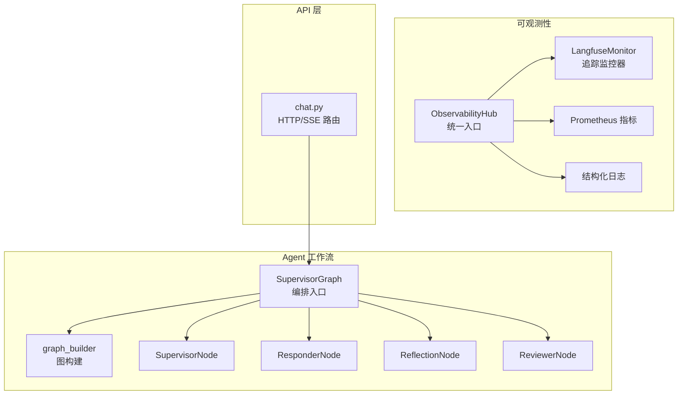
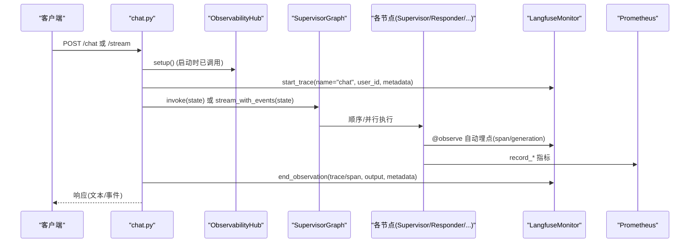
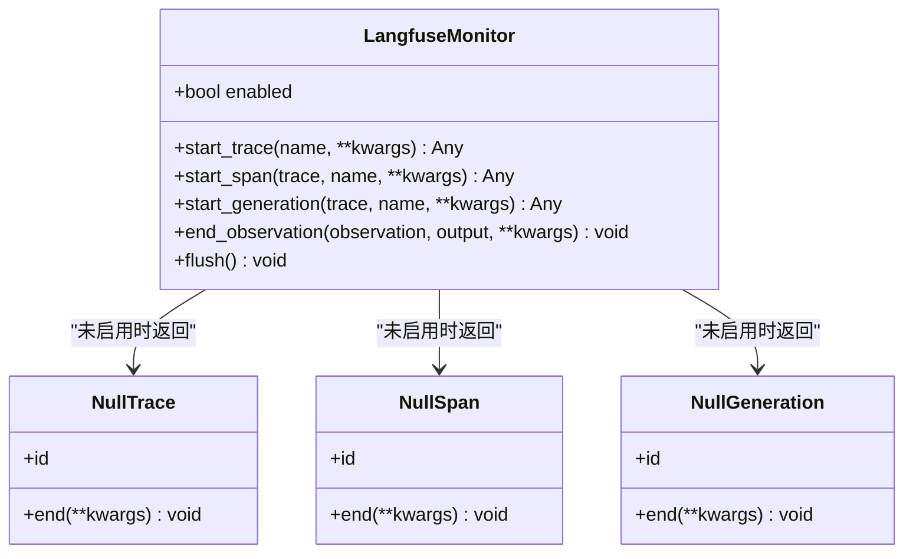
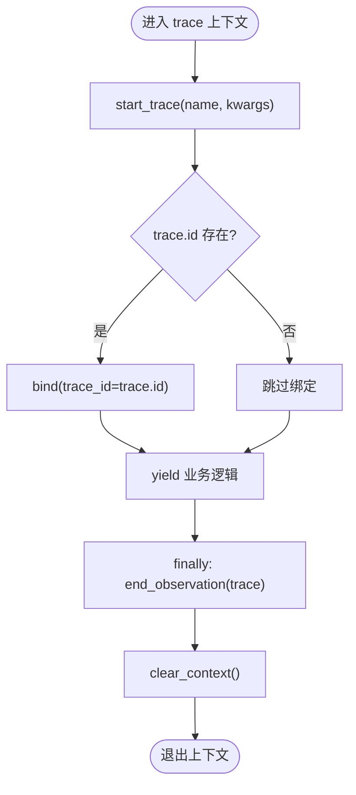
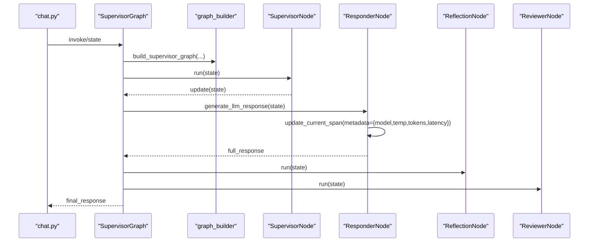
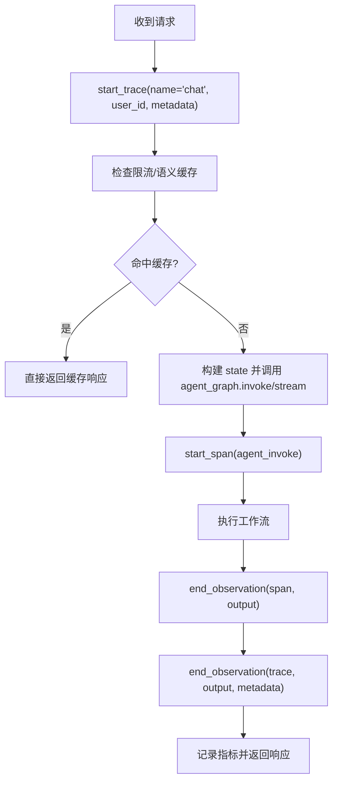
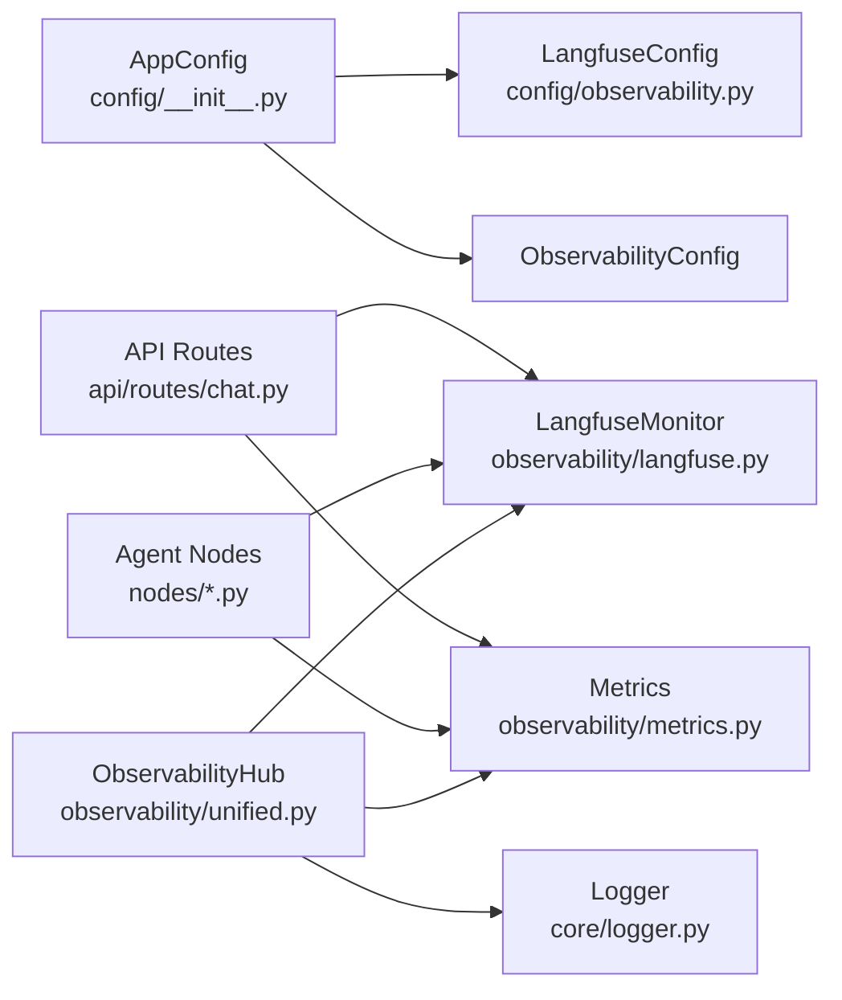

# Langfuse追踪系统

<cite>
**本文引用的文件**   
- [langfuse.py](file://backend_design/nexus/observability/langfuse.py)
- [unified.py](file://backend_design/nexus/observability/unified.py)
- [metrics.py](file://backend_design/nexus/observability/metrics.py)
- [logger.py](file://backend_design/nexus/core/logger.py)
- [observability.py](file://backend_design/nexus/config/observability.py)
- [__init__.py](file://backend_design/nexus/config/__init__.py)
- [supervisor_graph.py](file://backend_design/nexus/agent/supervisor_graph.py)
- [graph_builder.py](file://backend_design/nexus/agent/graph_builder.py)
- [supervisor_node.py](file://backend_design/nexus/agent/nodes/supervisor_node.py)
- [responder_node.py](file://backend_design/nexus/agent/nodes/responder_node.py)
- [chat.py](file://backend_design/nexus/api/routes/chat.py)
</cite>

## 目录
1. [简介](#简介)
2. [项目结构](#项目结构)
3. [核心组件](#核心组件)
4. [架构总览](#架构总览)
5. [详细组件分析](#详细组件分析)
6. [依赖关系分析](#依赖关系分析)
7. [性能考量](#性能考量)
8. [故障排查指南](#故障排查指南)
9. [结论](#结论)
10. [附录](#附录)

## 简介
本技术文档围绕 NexusCockpit 的 Langfuse 追踪系统，系统性阐述 LLM 调用链追踪的实现原理与集成方式。内容涵盖：
- 请求上下文传递、调用时序记录与响应结果收集
- Langfuse SDK 集成（客户端初始化、配置参数与环境变量）
- 追踪数据结构（trace、span、generation/event）及其关系
- Multi-Agent 全链路追踪（Supervisor 调度、专家执行、技能调用）
- 自定义追踪点添加方法与最佳实践
- 追踪数据查询与分析方法（性能瓶颈识别、错误诊断）
- 生产环境部署配置与性能优化建议

## 项目结构
NexusCockpit 的可观测性由统一门面 ObservabilityHub 聚合日志、指标与追踪；Langfuse 追踪通过可插拔装饰器与监控器实现，未安装或未配置时自动降级为空操作。Agent 工作流基于 LangGraph 编排，关键节点均使用 @observe 装饰器进行自动追踪。

**图示来源** 
- [unified.py:78-136](file://backend_design/nexus/observability/unified.py#L78-L136)
- [langfuse.py:144-221](file://backend_design/nexus/observability/langfuse.py#L144-L221)
- [metrics.py:1-108](file://backend_design/nexus/observability/metrics.py#L1-L108)
- [supervisor_graph.py:93-179](file://backend_design/nexus/agent/supervisor_graph.py#L93-L179)
- [graph_builder.py:40-120](file://backend_design/nexus/agent/graph_builder.py#L40-L120)
- [chat.py:340-464](file://backend_design/nexus/api/routes/chat.py#L340-L464)

**章节来源**
- [unified.py:78-136](file://backend_design/nexus/observability/unified.py#L78-L136)
- [__init__.py:84-132](file://backend_design/nexus/config/__init__.py#L84-L132)

## 核心组件
- ObservabilityHub：统一门面，负责日志、指标、追踪的统一初始化与关闭，提供 trace/span/observe 等便捷接口，并绑定 request_id/user_id 等上下文。
- LangfuseMonitor：封装 Langfuse SDK，支持 start_trace/start_span/start_generation/end_observation/flush，未启用时返回 Null* 对象保证无感降级。
- observe 装饰器：对函数进行自动追踪，支持 as_type="span"/"generation"/"agent"，未启用时透传。
- update_current_span：更新当前 span 的 metadata（如模型名、温度、Token 用量、延迟）。
- Prometheus 指标：统一的计数器、直方图、信息指标，覆盖请求、Agent、技能、缓存、RAG、LLM 等维度。
- 结构化日志：基于 structlog，JSON 输出，敏感字段脱敏，支持上下文绑定。

**章节来源**
- [unified.py:78-136](file://backend_design/nexus/observability/unified.py#L78-L136)
- [langfuse.py:44-112](file://backend_design/nexus/observability/langfuse.py#L44-L112)
- [langfuse.py:144-221](file://backend_design/nexus/observability/langfuse.py#L144-L221)
- [metrics.py:1-108](file://backend_design/nexus/observability/metrics.py#L1-L108)
- [logger.py:83-202](file://backend_design/nexus/core/logger.py#L83-L202)

## 架构总览
下图展示从 HTTP 请求到 Agent 工作流、再到 Langfuse 追踪与指标上报的整体流程。

**图示来源** 
- [chat.py:340-464](file://backend_design/nexus/api/routes/chat.py#L340-L464)
- [supervisor_graph.py:183-207](file://backend_design/nexus/agent/supervisor_graph.py#L183-L207)
- [responder_node.py:315-394](file://backend_design/nexus/agent/nodes/responder_node.py#L315-L394)
- [unified.py:175-196](file://backend_design/nexus/observability/unified.py#L175-L196)

## 详细组件分析

### Langfuse 追踪与降级机制
- 装饰器 observe：当 SDK 可用且配置启用时，使用真实 observe；否则返回透传包装器，不影响函数执行。
- update_current_span：在 LLM 调用前后更新当前 span 的 metadata（模型、温度、Token 用量、延迟）。
- LangfuseMonitor：构造时根据配置初始化 Langfuse 客户端；start_trace/start_span/start_generation 失败时返回 Null* 对象；end_observation 安全结束观察；flush 刷新缓冲区。

**图示来源** 
- [langfuse.py:144-221](file://backend_design/nexus/observability/langfuse.py#L144-L221)

**章节来源**
- [langfuse.py:44-112](file://backend_design/nexus/observability/langfuse.py#L44-L112)
- [langfuse.py:144-221](file://backend_design/nexus/observability/langfuse.py#L144-L221)

### 统一可观测性门面 ObservabilityHub
- setup：一次性初始化日志、指标、追踪（Langfuse 检测在 Monitor 中完成）。
- trace：上下文管理器，自动创建 trace，绑定 trace_id 到日志上下文，finally 中结束观察并清理上下文。
- span/update_span：开始/更新 span 元数据。
- record_*：便捷记录各类指标（请求、Agent、技能、缓存、RAG、LLM）。

**图示来源** 
- [unified.py:175-196](file://backend_design/nexus/observability/unified.py#L175-L196)

**章节来源**
- [unified.py:78-136](file://backend_design/nexus/observability/unified.py#L78-L136)
- [unified.py:175-196](file://backend_design/nexus/observability/unified.py#L175-L196)

### Multi-Agent 工作流与追踪集成
- SupervisorGraph：编排入口，提供 invoke/stream/stream_with_events 三种模式，@observe 标注 agent 级追踪。
- graph_builder：注册节点与边，编译为 LangGraph 图。
- 各节点（Supervisor/Responder/Reflection/Reviewer）：通过 @observe 自动埋点，并在 LLM 调用处更新当前 span 的 metadata。

**图示来源** 
- [supervisor_graph.py:183-207](file://backend_design/nexus/agent/supervisor_graph.py#L183-L207)
- [graph_builder.py:40-120](file://backend_design/nexus/agent/graph_builder.py#L40-L120)
- [responder_node.py:315-394](file://backend_design/nexus/agent/nodes/responder_node.py#L315-L394)

**章节来源**
- [supervisor_graph.py:93-179](file://backend_design/nexus/agent/supervisor_graph.py#L93-L179)
- [graph_builder.py:40-120](file://backend_design/nexus/agent/graph_builder.py#L40-L120)
- [supervisor_node.py:63-331](file://backend_design/nexus/agent/nodes/supervisor_node.py#L63-L331)
- [responder_node.py:57-174](file://backend_design/nexus/agent/nodes/responder_node.py#L57-L174)

### API 层追踪与指标
- chat.py：在请求入口处创建 Langfuse trace，包裹 Agent 调用 span，结束时输出 response 片段与延迟、缓存命中等元数据；同时记录 Prometheus 指标。
- SSE 流式：按阶段发送 thinking/intent/experts/action/chunk/done 事件，便于前端可视化与追踪。

**图示来源** 
- [chat.py:340-464](file://backend_design/nexus/api/routes/chat.py#L340-L464)

**章节来源**
- [chat.py:340-464](file://backend_design/nexus/api/routes/chat.py#L340-L464)

## 依赖关系分析
- 配置中心 AppConfig 聚合 LangfuseConfig/ObservabilityConfig，环境变量通过 pydantic-settings 注入。
- ObservabilityHub 依赖 logger、metrics、langfuse，统一调度。
- Agent 节点依赖 observability.langfuse.observe/update_current_span，以及 metrics 指标。
- API 层依赖 langfuse.start_trace/span/end_observation 与 metrics 指标。

**图示来源** 
- [__init__.py:84-132](file://backend_design/nexus/config/__init__.py#L84-L132)
- [observability.py:15-33](file://backend_design/nexus/config/observability.py#L15-L33)
- [unified.py:78-136](file://backend_design/nexus/observability/unified.py#L78-L136)
- [langfuse.py:144-221](file://backend_design/nexus/observability/langfuse.py#L144-L221)
- [metrics.py:1-108](file://backend_design/nexus/observability/metrics.py#L1-L108)
- [logger.py:83-202](file://backend_design/nexus/core/logger.py#L83-L202)
- [supervisor_node.py:63-331](file://backend_design/nexus/agent/nodes/supervisor_node.py#L63-L331)
- [responder_node.py:315-394](file://backend_design/nexus/agent/nodes/responder_node.py#L315-L394)
- [chat.py:340-464](file://backend_design/nexus/api/routes/chat.py#L340-L464)

**章节来源**
- [__init__.py:84-132](file://backend_design/nexus/config/__init__.py#L84-L132)
- [observability.py:15-33](file://backend_design/nexus/config/observability.py#L15-L33)

## 性能考量
- 快速路径：SupervisorNode 对纯车控指令走启发式快速路径，跳过记忆召回与 RAG，显著降低延迟。
- 压缩历史：阈值压缩减少上下文长度，降低 LLM 调用成本与延迟。
- 并发执行：记忆召回、用户画像加载、意图路由并行执行，缩短等待时间。
- 指标采集：Prometheus 直方图分桶合理，避免过度采样；Langfuse flush 在 shutdown 时统一刷新。
- 降级策略：Langfuse 未启用或未安装时，所有追踪调用退化为空操作，不影响主流程。

[本节为通用性能讨论，不直接分析具体文件]

## 故障排查指南
- 追踪未生效：确认环境变量 LANGFUSE_PUBLIC_KEY/LANGFUSE_SECRET_KEY 已设置，且 is_enabled 为真；检查 import 是否成功。
- Span 无元数据：确认在 LLM 调用前后调用了 update_current_span，并传入 model/temperature/tokens/latency 等字段。
- Trace 未结束：确保 finally 块中调用 end_observation，避免内存泄漏。
- 指标缺失：检查 init_metrics 是否被调用，record_* 是否在关键路径上执行。
- 日志格式不一致：确认 setup_logging 已调用，structlog JSON 渲染器生效，敏感字段已脱敏。

**章节来源**
- [langfuse.py:104-112](file://backend_design/nexus/observability/langfuse.py#L104-L112)
- [unified.py:127-136](file://backend_design/nexus/observability/unified.py#L127-L136)
- [metrics.py:99-108](file://backend_design/nexus/observability/metrics.py#L99-L108)
- [logger.py:83-202](file://backend_design/nexus/core/logger.py#L83-L202)

## 结论
NexusCockpit 的 Langfuse 追踪系统以统一门面为核心，结合可插拔装饰器与监控器，实现了从 API 到 Agent 工作流的端到端可观测性。通过合理的降级策略、上下文绑定与指标采集，既保证了生产环境的稳定性，也为性能分析与错误诊断提供了有力支撑。

[本节为总结性内容，不直接分析具体文件]

## 附录

### Langfuse 集成与配置
- 环境变量
  - LANGFUSE_PUBLIC_KEY：公共密钥
  - LANGFUSE_SECRET_KEY：私有密钥
  - LANGFUSE_HOST：服务地址（默认 http://127.0.0.1:3101）
  - LANGFUSE_DB_PASSWORD、LANGFUSE_NEXTAUTH_SECRET、LANGFUSE_SALT：本地自托管相关
- 客户端初始化
  - LangfuseMonitor.__init__ 中根据配置初始化 Langfuse 客户端
  - 未启用时返回 Null* 对象，保证无感降级
- 使用方式
  - 装饰器：@observe(name="...", as_type="span|generation|agent")
  - 手动：start_trace/start_span/start_generation/end_observation/flush
  - 更新元数据：update_current_span(metadata={...})

**章节来源**
- [observability.py:15-33](file://backend_design/nexus/config/observability.py#L15-L33)
- [langfuse.py:144-221](file://backend_design/nexus/observability/langfuse.py#L144-L221)
- [langfuse.py:44-112](file://backend_design/nexus/observability/langfuse.py#L44-L112)

### 追踪数据结构与关系
- trace：一次请求的全局追踪，包含 user_id、session_id、input 摘要等元数据
- span：子任务单元，用于标记关键步骤（如 agent_invoke、llm-tool-synthesis、llm-chat-generation）
- generation：LLM 生成记录，记录模型、温度、Token 用量、延迟等
- event：SSE 事件（thinking/intent/experts/action/chunk/done），用于前端可视化与调试

**章节来源**
- [chat.py:340-464](file://backend_design/nexus/api/routes/chat.py#L340-L464)
- [responder_node.py:180-309](file://backend_design/nexus/agent/nodes/responder_node.py#L180-L309)
- [responder_node.py:315-394](file://backend_design/nexus/agent/nodes/responder_node.py#L315-L394)

### 自定义追踪点添加方法
- 在关键函数上使用 @observe(name="...", as_type="span|generation|agent")
- 在 LLM 调用前后调用 update_current_span 更新元数据
- 在统一入口使用 ObservabilityHub.trace 上下文管理器包裹业务逻辑
- 在关键路径记录 Prometheus 指标（record_agent_call/record_llm_call/record_skill_exec 等）

**章节来源**
- [langfuse.py:44-112](file://backend_design/nexus/observability/langfuse.py#L44-L112)
- [unified.py:175-196](file://backend_design/nexus/observability/unified.py#L175-L196)
- [metrics.py:1-108](file://backend_design/nexus/observability/metrics.py#L1-L108)

### 追踪数据查询与分析方法
- 使用 Langfuse 控制台查看 trace/span/generation 详情，定位耗时与错误
- 结合 Prometheus/Grafana 分析指标趋势，识别性能瓶颈
- 通过结构化日志（JSON）在 Loki/ELK 中检索上下文与异常堆栈
- 关注 metadata 中的 latency_ms、token_input/output、status 等字段

**章节来源**
- [metrics.py:1-108](file://backend_design/nexus/observability/metrics.py#L1-L108)
- [logger.py:83-202](file://backend_design/nexus/core/logger.py#L83-L202)

### 生产环境部署与优化建议
- 环境变量管理：集中管理 LANGFUSE_* 与 PROMETHEUS_URL/GRAFANA_URL
- 资源隔离：将 Langfuse 服务与主应用分离，避免相互影响
- 缓冲刷新：在应用关闭时调用 flush，确保数据完整上报
- 指标分桶：根据实际延迟分布调整直方图分桶，提升精度
- 日志脱敏：确保敏感字段被掩码，避免泄露

**章节来源**
- [observability.py:15-33](file://backend_design/nexus/config/observability.py#L15-L33)
- [unified.py:127-136](file://backend_design/nexus/observability/unified.py#L127-L136)
- [metrics.py:99-108](file://backend_design/nexus/observability/metrics.py#L99-L108)
- [logger.py:83-202](file://backend_design/nexus/core/logger.py#L83-L202)