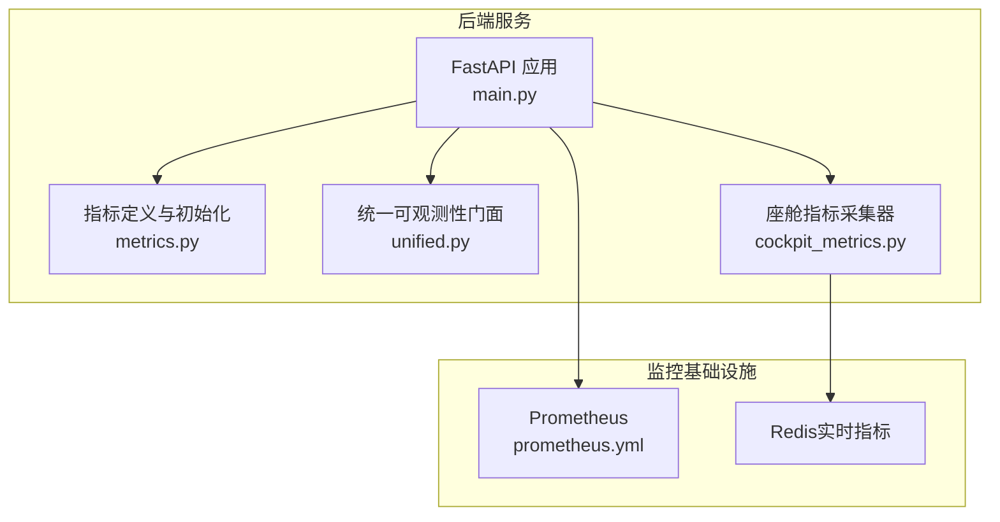
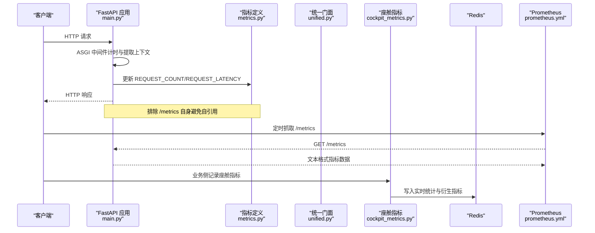
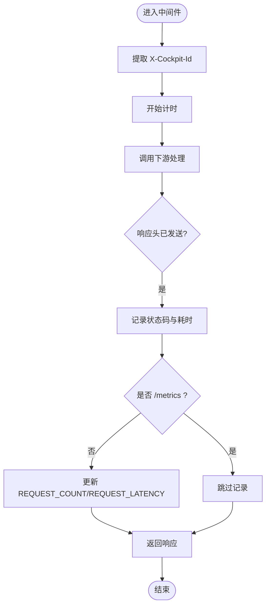
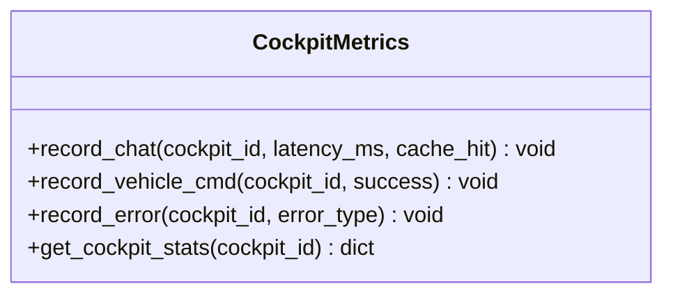
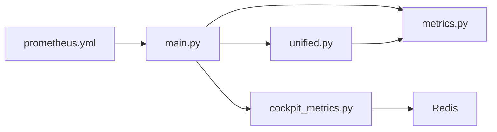

# Prometheus指标采集

<cite>
**本文引用的文件**
- [prometheus.yml](file://config/prometheus/prometheus.yml)
- [metrics.py](file://backend_design/nexus/observability/metrics.py)
- [unified.py](file://backend_design/nexus/observability/unified.py)
- [cockpit_metrics.py](file://backend_design/nexus/observability/cockpit_metrics.py)
- [main.py](file://backend_design/nexus/main.py)
</cite>

## 目录
1. [简介](#简介)
2. [项目结构](#项目结构)
3. [核心组件](#核心组件)
4. [架构总览](#架构总览)
5. [详细组件分析](#详细组件分析)
6. [依赖关系分析](#依赖关系分析)
7. [性能考量](#性能考量)
8. [故障排查指南](#故障排查指南)
9. [结论](#结论)
10. [附录](#附录)

## 简介
本技术文档围绕 NexusCockpit 的 Prometheus 指标采集体系，系统阐述自定义指标的定义方法（Counter、Gauge、Histogram、Info）与使用场景，覆盖请求指标、Agent 指标、技能执行指标、缓存指标、RAG 检索指标与 LLM 调用指标的采集实现。同时说明指标标签的设计原则与维度选择策略，给出 Prometheus 抓取配置详解（抓取间隔、存储与保留策略），并提供新增指标类型的集成步骤、PromQL 查询方法与性能监控最佳实践及容量规划建议。

## 项目结构
NexusCockpit 的可观测性相关代码集中在 backend_design/nexus/observability 目录下，并通过 FastAPI 应用入口挂载 /metrics 端点，由外部 Prometheus 定期抓取。关键文件职责如下：
- metrics.py：定义所有 Prometheus 指标（Counter/Gauge/Histogram/Info）与初始化逻辑
- unified.py：统一可观测性门面，提供记录各类指标的便捷方法
- cockpit_metrics.py：座舱级指标采集器（写入 Redis，供巡检与聚合）
- main.py：FastAPI 应用入口，挂载 /metrics 并注入中间件记录请求指标
- prometheus.yml：Prometheus 抓取配置（服务发现、抓取间隔、路径等）

图表来源
- [main.py:486-488](file://backend_design/nexus/main.py#L486-L488)
- [metrics.py:12-108](file://backend_design/nexus/observability/metrics.py#L12-L108)
- [unified.py:62-75](file://backend_design/nexus/observability/unified.py#L62-L75)
- [cockpit_metrics.py:24-180](file://backend_design/nexus/observability/cockpit_metrics.py#L24-L180)
- [prometheus.yml:1-35](file://config/prometheus/prometheus.yml#L1-L35)

章节来源
- [main.py:436-488](file://backend_design/nexus/main.py#L436-L488)
- [metrics.py:1-108](file://backend_design/nexus/observability/metrics.py#L1-108)
- [unified.py:1-269](file://backend_design/nexus/observability/unified.py#L1-L269)
- [cockpit_metrics.py:1-180](file://backend_design/nexus/observability/cockpit_metrics.py#L1-L180)
- [prometheus.yml:1-35](file://config/prometheus/prometheus.yml#L1-L35)

## 核心组件
- 指标定义层（metrics.py）
  - 应用信息：Info 类型暴露版本与服务描述
  - 请求指标：Counter 统计请求总数；Histogram 统计请求延迟分布
  - Agent 指标：Counter 统计调用次数；Histogram 统计节点延迟
  - 技能指标：Counter 统计技能执行次数
  - 缓存指标：Counter 分别统计命中与未命中
  - RAG 指标：Counter 统计检索来源；Histogram 统计检索延迟
  - LLM 指标：Counter 统计模型调用次数；Histogram 统计调用延迟
  - 系统指标：Gauge 跟踪活跃连接数
- 统一门面（unified.py）
  - 提供 record_request、record_agent_call、record_skill_exec、record_llm_call、record_rag_retrieval、record_cache_hit/miss 等方法，屏蔽底层指标细节
- 座舱指标采集器（cockpit_metrics.py）
  - 将对话、车控指令、错误等指标写入 Redis，计算命中率、错误率、平均延迟等衍生指标
- 应用入口（main.py）
  - 启动时初始化指标，挂载 /metrics 端点，通过 ASGI 中间件记录每个 HTTP 请求的计数与延迟

章节来源
- [metrics.py:14-97](file://backend_design/nexus/observability/metrics.py#L14-L97)
- [unified.py:213-247](file://backend_design/nexus/observability/unified.py#L213-L247)
- [cockpit_metrics.py:38-161](file://backend_design/nexus/observability/cockpit_metrics.py#L38-L161)
- [main.py:86-88](file://backend_design/nexus/main.py#L86-L88)
- [main.py:486-488](file://backend_design/nexus/main.py#L486-L488)
- [main.py:604-652](file://backend_design/nexus/main.py#L604-L652)

## 架构总览
下图展示从请求进入 FastAPI 到 Prometheus 抓取指标的完整链路，以及座舱指标写入 Redis 的路径。

图表来源
- [main.py:604-652](file://backend_design/nexus/main.py#L604-L652)
- [metrics.py:21-32](file://backend_design/nexus/observability/metrics.py#L21-L32)
- [prometheus.yml:5-20](file://config/prometheus/prometheus.yml#L5-L20)
- [cockpit_metrics.py:38-101](file://backend_design/nexus/observability/cockpit_metrics.py#L38-L101)

## 详细组件分析

### 指标定义与类型使用
- Counter（计数器）
  - 适用场景：单调递增的累计值，如请求总数、Agent 调用次数、技能执行次数、缓存命中/未命中、RAG 检索次数、LLM 调用次数
  - 标签设计：endpoint/method/status、agent_name/status、skill_name/status、source（vector/graph/fusion）、model/status
  - 复杂度：每次 inc() 为 O(1)，标签基数需控制以避免高基维导致内存膨胀
- Histogram（直方图）
  - 适用场景：延迟分布统计，如请求延迟、Agent 节点延迟、RAG 检索延迟、LLM 调用延迟
  - 桶配置：按业务 SLA 设置分桶，例如 0.1s~30s 范围，兼顾精度与开销
  - 复杂度：observe() 为 O(log N)（基于桶数量），桶过多会增加序列化与存储成本
- Gauge（仪表盘）
  - 适用场景：可升可降的瞬时值，如活跃 WebSocket 连接数
  - 复杂度：inc()/dec() 为 O(1)
- Info（应用信息）
  - 适用场景：暴露版本、服务名、描述等静态元数据
  - 复杂度：一次性写入，几乎无运行时开销

章节来源
- [metrics.py:14-97](file://backend_design/nexus/observability/metrics.py#L14-L97)

### 请求指标采集（HTTP）
- 在 ASGI 中间件中记录每个请求的 endpoint、method、status 与耗时
- 自动排除 /metrics 端点，避免自引用导致的循环计数
- 通过 REQUEST_COUNT.inc() 与 REQUEST_LATENCY.observe() 完成采集

图表来源
- [main.py:604-652](file://backend_design/nexus/main.py#L604-L652)

章节来源
- [main.py:604-652](file://backend_design/nexus/main.py#L604-L652)

### Agent 指标采集
- 通过统一门面的 record_agent_call(agent_name, status, latency_sec) 记录调用次数与延迟
- 标签维度：agent_name（节点名称）、status（成功/失败）
- 延迟直方图用于评估各节点性能瓶颈

章节来源
- [unified.py:219-224](file://backend_design/nexus/observability/unified.py#L219-L224)
- [metrics.py:35-46](file://backend_design/nexus/observability/metrics.py#L35-L46)

### 技能执行指标采集
- 通过 record_skill_exec(skill_name, status) 记录技能执行次数
- 标签维度：skill_name（技能名称）、status（成功/失败）
- 适用于车载与非车载技能的运行态监控

章节来源
- [unified.py:225-227](file://backend_design/nexus/observability/unified.py#L225-L227)
- [metrics.py:49-53](file://backend_design/nexus/observability/metrics.py#L49-L53)

### 缓存指标采集
- 通过 record_cache_hit() 与 record_cache_miss() 分别记录命中与未命中
- 不附加标签，保持低基数与高吞吐
- 衍生指标可在 Grafana/PromQL 中计算命中率

章节来源
- [unified.py:241-247](file://backend_design/nexus/observability/unified.py#L241-L247)
- [metrics.py:56-64](file://backend_design/nexus/observability/metrics.py#L56-L64)

### RAG 检索指标采集
- 通过 record_rag_retrieval(source, latency_sec) 记录检索来源与延迟
- 标签维度：source（vector/graph/fusion）
- 直方图用于评估不同检索源的性能差异

章节来源
- [unified.py:235-239](file://backend_design/nexus/observability/unified.py#L235-L239)
- [metrics.py:67-77](file://backend_design/nexus/observability/metrics.py#L67-L77)

### LLM 调用指标采集
- 通过 record_llm_call(model, status, latency_sec) 记录模型调用次数与延迟
- 标签维度：model（模型名称）、status（成功/失败）
- 直方图用于评估不同模型的响应时间分布

章节来源
- [unified.py:229-233](file://backend_design/nexus/observability/unified.py#L229-L233)
- [metrics.py:80-90](file://backend_design/nexus/observability/metrics.py#L80-L90)

### 座舱级指标采集（Redis）
- 记录对话请求的延迟、缓存命中情况，计算平均延迟与命中率
- 记录车控指令的成功/失败，计算成功率
- 记录错误类型与次数，计算错误率
- 使用 Redis pipeline 批量写入，降低网络往返开销

图表来源
- [cockpit_metrics.py:24-180](file://backend_design/nexus/observability/cockpit_metrics.py#L24-L180)

章节来源
- [cockpit_metrics.py:38-161](file://backend_design/nexus/observability/cockpit_metrics.py#L38-L161)

## 依赖关系分析
- main.py 依赖 metrics.py 中的指标对象与 init_metrics()
- unified.py 依赖 metrics.py 中的具体指标实例，提供统一接口
- cockpit_metrics.py 依赖 Redis 异步客户端，写入实时指标
- prometheus.yml 配置抓取目标与路径，确保 /metrics 可被采集

图表来源
- [main.py:86-88](file://backend_design/nexus/main.py#L86-L88)
- [unified.py:62-75](file://backend_design/nexus/observability/unified.py#L62-L75)
- [prometheus.yml:5-20](file://config/prometheus/prometheus.yml#L5-L20)

章节来源
- [main.py:436-488](file://backend_design/nexus/main.py#L436-L488)
- [unified.py:1-269](file://backend_design/nexus/observability/unified.py#L1-L269)
- [prometheus.yml:1-35](file://config/prometheus/prometheus.yml#L1-L35)

## 性能考量
- 标签基数控制
  - 避免高基数字段（如用户 ID、会话 ID）作为标签，必要时使用哈希或采样
  - 对 endpoint 进行规范化，合并相似路径（如 /chat/{id} -> /chat/:id）
- 直方图桶配置
  - 根据 SLA 合理设置分桶，避免过密导致序列化与存储压力
  - 针对热点路径单独配置更细粒度桶
- 中间件开销
  - ASGI 中间件仅做轻量计时与指标更新，避免阻塞 I/O
  - 排除 /metrics 端点，防止自引用
- Redis 写入
  - 使用 pipeline 批量写入，减少 RTT
  - 对高频指标采用增量计数与定期聚合

[本节为通用指导，无需特定文件来源]

## 故障排查指南
- /metrics 不可访问
  - 检查 FastAPI 是否正确挂载 /metrics（见 main.py 挂载逻辑）
  - 确认 Prometheus 抓取配置的目标地址与端口正确
- 指标缺失或为 0
  - 确认中间件未被禁用或过滤
  - 检查业务侧是否正确调用统一门面的记录方法
- 指标基数过高
  - 审查标签维度，移除高基数字段或使用采样
- Redis 写入失败
  - 检查 Redis 连接参数与权限
  - 查看日志中的异常堆栈定位问题

章节来源
- [main.py:486-488](file://backend_design/nexus/main.py#L486-L488)
- [prometheus.yml:5-20](file://config/prometheus/prometheus.yml#L5-L20)
- [cockpit_metrics.py:62-101](file://backend_design/nexus/observability/cockpit_metrics.py#L62-L101)

## 结论
NexusCockpit 的 Prometheus 指标体系以清晰的层次化设计与统一的门面接口，实现了请求、Agent、技能、缓存、RAG、LLM 等多维度指标的标准化采集。通过合理的标签维度与直方图桶配置，在保证精度的同时控制了存储与查询开销。配合 Prometheus 抓取配置与 Grafana 可视化，可为系统稳定性与性能优化提供可靠依据。

[本节为总结性内容，无需特定文件来源]

## 附录

### Prometheus 配置详解
- 抓取间隔与评估间隔
  - global.scrape_interval 与 evaluation_interval 设置为 15s，平衡实时性与资源占用
- 抓取目标
  - nexus-ai（Python 后端，端口 8000）
  - nexus-gate（Go 网关，端口 8080）
  - milvus（向量数据库，端口 9091）
  - prometheus（自身指标，端口 9090）
- 抓取路径
  - 所有 job 均使用 /metrics 路径

章节来源
- [prometheus.yml:1-35](file://config/prometheus/prometheus.yml#L1-L35)

### 添加新指标类型的步骤
- 定义指标
  - 在 metrics.py 中新增 Counter/Gauge/Histogram/Info，明确名称、描述与标签
- 初始化
  - 如需 Info，在 init_metrics() 中填充元数据
- 接入采集
  - 在 unified.py 中添加便捷记录方法（如 record_xxx）
  - 在业务侧调用该方法完成采集
- 验证
  - 启动服务后访问 /metrics 确认指标存在
  - 在 Prometheus 中查询并绘制面板

章节来源
- [metrics.py:14-108](file://backend_design/nexus/observability/metrics.py#L14-L108)
- [unified.py:213-247](file://backend_design/nexus/observability/unified.py#L213-L247)

### 常用 PromQL 语句示例
- 请求总量与成功率
  - sum by (status) (rate(nexus_requests_total[5m]))
  - 成功率 = sum(rate(nexus_requests_total{status="200"}[5m])) / sum(rate(nexus_requests_total[5m]))
- 请求延迟分位
  - histogram_quantile(0.95, rate(nexus_request_latency_seconds_bucket[5m]))
- Agent 调用量与延迟
  - sum by (agent_name) (rate(nexus_agent_invocations_total[5m]))
  - histogram_quantile(0.95, rate(nexus_agent_latency_seconds_bucket[5m]))
- 技能执行与错误率
  - sum by (skill_name) (rate(nexus_skill_executions_total[5m]))
  - 错误率 = sum(rate(nexus_skill_executions_total{status="error"}[5m])) / sum(rate(nexus_skill_executions_total[5m]))
- 缓存命中率
  - sum(rate(nexus_cache_hits_total[5m])) / (sum(rate(nexus_cache_hits_total[5m])) + sum(rate(nexus_cache_misses_total[5m])))
- RAG 检索延迟
  - histogram_quantile(0.95, rate(nexus_rag_latency_seconds_bucket[5m]))
- LLM 调用量与延迟
  - sum by (model) (rate(nexus_llm_calls_total[5m]))
  - histogram_quantile(0.95, rate(nexus_llm_latency_seconds_bucket[5m]))
- 活跃连接数
  - nexus_active_connections

[本节为概念性内容，无需特定文件来源]

### 容量规划建议
- 指标基数
  - 预估标签组合上限，避免超过单节点 TSDB 承载能力
- 存储周期
  - 根据磁盘与预算设定 retention.time（如 15d/30d），结合压缩与归档策略
- 抓取频率
  - 生产环境建议 15s~30s，避免过短造成负载过高
- 分片与高可用
  - 多副本与分片部署，提升可靠性与查询性能

[本节为通用指导，无需特定文件来源]