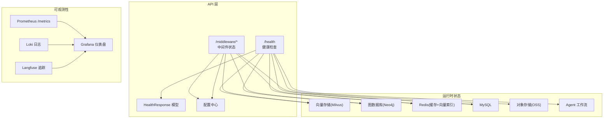
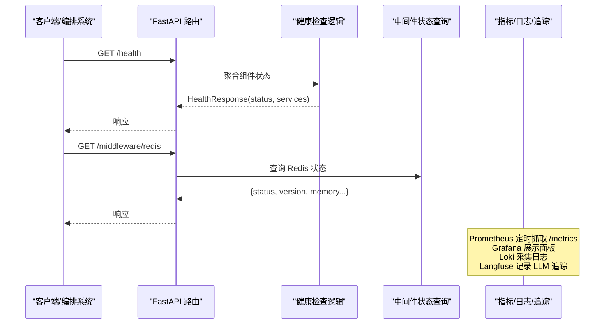
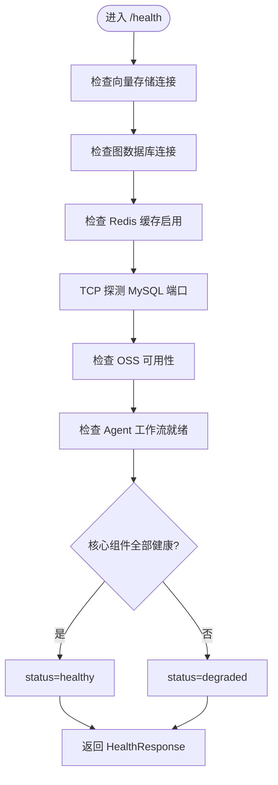
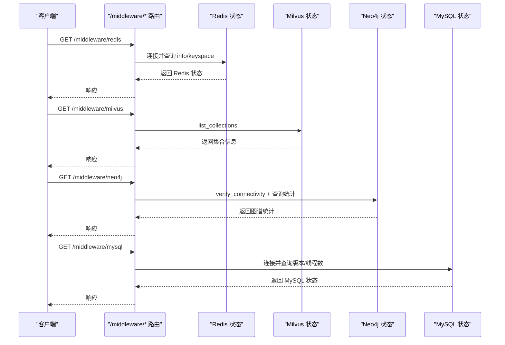
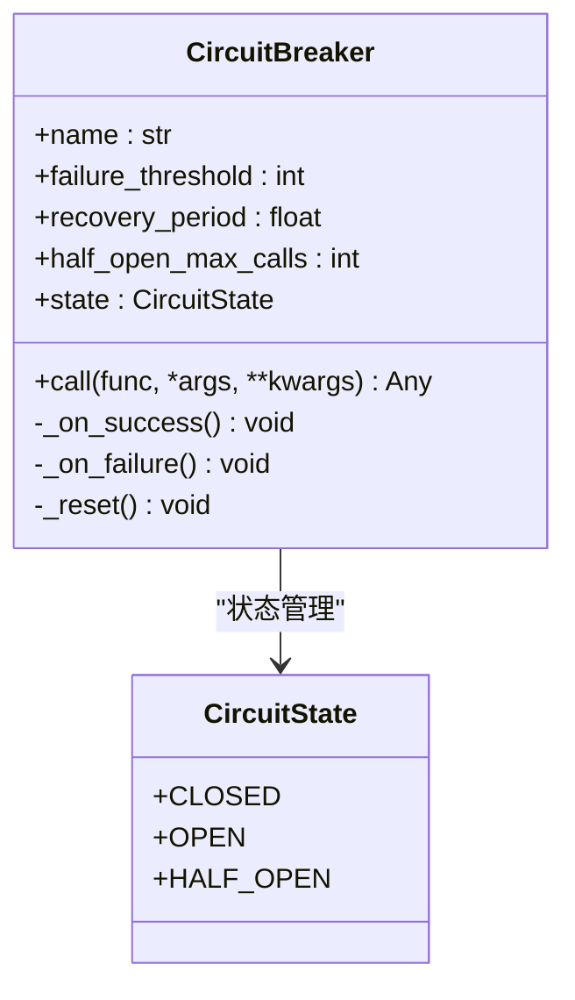
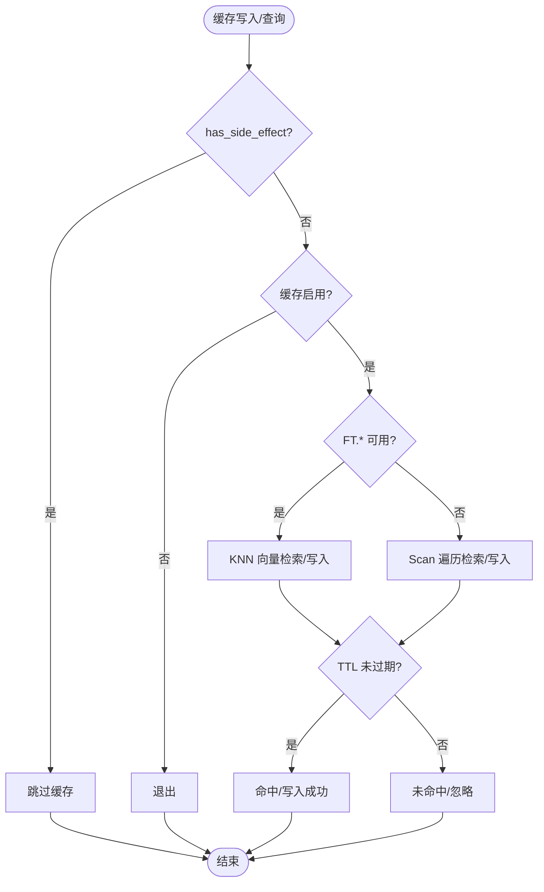
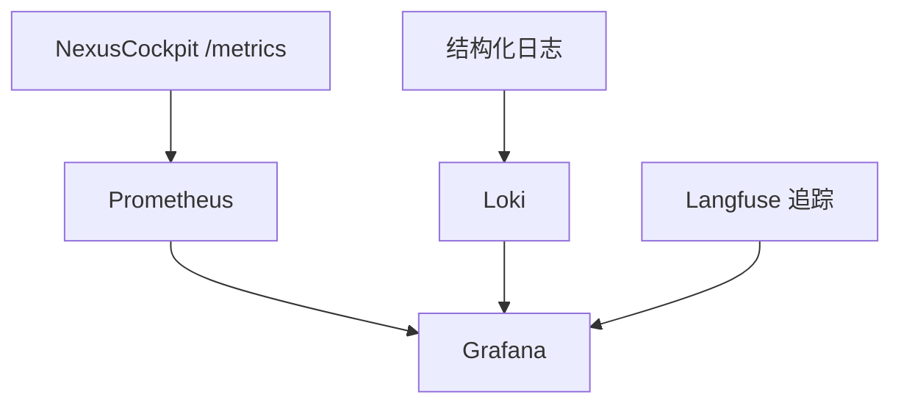
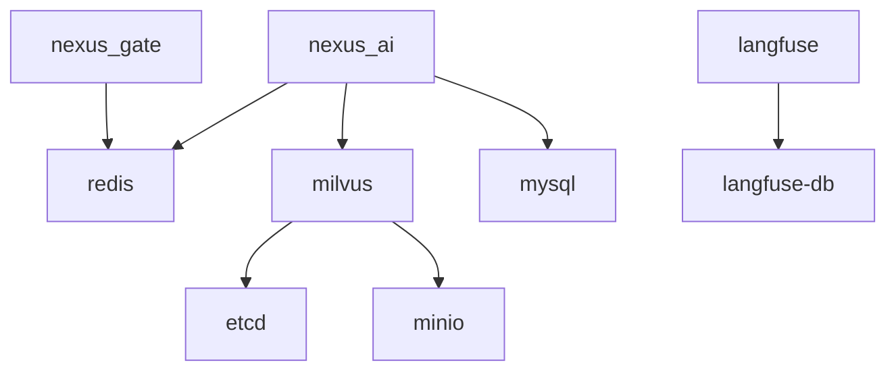
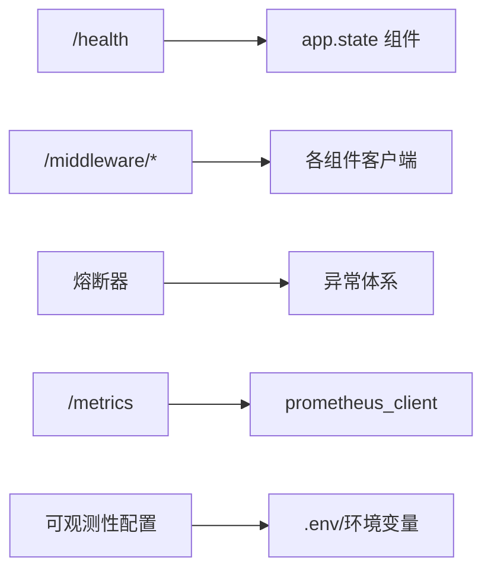

# 健康检查与监控

<cite>
**本文引用的文件**   
- [health.py](file://backend_design/nexus/api/routes/health.py)
- [middleware_status.py](file://backend_design/nexus/api/routes/middleware_status.py)
- [redis_cache.py](file://backend_design/nexus/middleware/redis_cache.py)
- [circuit_breaker.py](file://backend_design/nexus/core/circuit_breaker.py)
- [exceptions.py](file://backend_design/nexus/core/exceptions.py)
- [schemas.py](file://backend_design/nexus/models/schemas.py)
- [metrics.py](file://backend_design/nexus/observability/metrics.py)
- [observability.py](file://backend_design/nexus/config/observability.py)
- [prometheus.yml](file://config/prometheus/prometheus.yml)
- [nexuscockpit-overview.json](file://config/grafana/provisioning/dashboards/nexuscockpit-overview.json)
- [docker-compose.yml](file://docker-compose.yml)
- [logger.py](file://backend_design/nexus/core/logger.py)
</cite>

## 目录
1. [引言](#引言)
2. [项目结构](#项目结构)
3. [核心组件](#核心组件)
4. [架构总览](#架构总览)
5. [详细组件分析](#详细组件分析)
6. [依赖关系分析](#依赖关系分析)
7. [性能考量](#性能考量)
8. [故障排查指南](#故障排查指南)
9. [结论](#结论)
10. [附录](#附录)

## 引言
本技术文档围绕 NexusCockpit 的健康检查与监控系统展开，系统性阐述健康检查端点设计、服务依赖校验、熔断器模式实现、中间件状态监控、主动与被动健康检查策略、自定义健康检查器开发、Kubernetes 探针配置以及自动恢复机制（重试、降级、优雅关闭）。目标是帮助研发与运维人员构建完整、可观测、高可用的健康监控体系。

## 项目结构
本项目在 Python 后端中提供健康检查与中间件状态 API，结合 Prometheus/Grafana/Loki/Langfuse 等可观测性组件，形成端到端的监控闭环。关键路径包括：
- 健康检查路由：/health 返回应用与各依赖组件的状态
- 中间件状态路由：/middleware/* 提供 Redis/Milvus/Neo4j/MySQL/LLM/TTS/ASR 等运行态信息
- 指标采集：/metrics 暴露 Prometheus 指标
- 容器编排与健康探测：docker-compose 定义各服务的 healthcheck
- 日志与追踪：结构化日志与 Langfuse 追踪

图表来源 
- [health.py:26-95](file://backend_design/nexus/api/routes/health.py#L26-L95)
- [middleware_status.py:29-42](file://backend_design/nexus/api/routes/middleware_status.py#L29-L42)
- [metrics.py:1-108](file://backend_design/nexus/observability/metrics.py#L1-L108)
- [prometheus.yml:1-35](file://config/prometheus/prometheus.yml#L1-L35)
- [nexuscockpit-overview.json:1-200](file://config/grafana/provisioning/dashboards/nexuscockpit-overview.json#L1-L200)

章节来源
- [health.py:26-95](file://backend_design/nexus/api/routes/health.py#L26-L95)
- [middleware_status.py:29-42](file://backend_design/nexus/api/routes/middleware_status.py#L29-L42)
- [metrics.py:1-108](file://backend_design/nexus/observability/metrics.py#L1-L108)
- [prometheus.yml:1-35](file://config/prometheus/prometheus.yml#L1-L35)
- [nexuscockpit-overview.json:1-200](file://config/grafana/provisioning/dashboards/nexuscockpit-overview.json#L1-L200)

## 核心组件
- 健康检查端点：/health 聚合 Milvus、Neo4j、Redis、MySQL、OSS、Agent 等组件连接状态，并输出统一 HealthResponse。
- 中间件状态端点：/middleware/* 对 Redis、Milvus、Neo4j、MySQL、LLM、TTS、ASR 等进行更细粒度的运行态查询。
- 熔断器：基于三状态机（CLOSED/OPEN/HALF_OPEN）保护外部调用，失败阈值触发熔断，恢复期后试探恢复。
- 语义缓存：基于 Redis 8 RediSearch KNN 的语义缓存，支持用户隔离、TTL 分级、副作用安全（车控指令不缓存）。
- 指标与可视化：Prometheus 抓取 /metrics，Grafana 展示面板，Loki 收集日志，Langfuse 追踪 LLM 调用。

章节来源
- [health.py:26-95](file://backend_design/nexus/api/routes/health.py#L26-L95)
- [middleware_status.py:29-42](file://backend_design/nexus/api/routes/middleware_status.py#L29-L42)
- [circuit_breaker.py:48-176](file://backend_design/nexus/core/circuit_breaker.py#L48-L176)
- [redis_cache.py:57-128](file://backend_design/nexus/middleware/redis_cache.py#L57-L128)
- [metrics.py:1-108](file://backend_design/nexus/observability/metrics.py#L1-L108)

## 架构总览
健康检查与监控的整体流程如下：
- 客户端或编排系统访问 /health 获取整体健康；访问 /middleware/* 获取具体中间件详情。
- 健康检查内部通过 app.state 中的实例属性判断组件是否可用，并对 MySQL 进行 TCP 连通性探测。
- 指标通过 /metrics 暴露给 Prometheus 定期抓取，Grafana 展示趋势与告警。
- 日志通过结构化 logger 输出 JSON，便于 Loki 采集与检索。
- 容器编排使用 docker-compose healthcheck 对各服务进行健康探测，确保启动顺序与可用性。

图表来源 
- [health.py:26-95](file://backend_design/nexus/api/routes/health.py#L26-L95)
- [middleware_status.py:75-98](file://backend_design/nexus/api/routes/middleware_status.py#L75-L98)
- [metrics.py:1-108](file://backend_design/nexus/observability/metrics.py#L1-L108)

## 详细组件分析

### 健康检查端点 /health
- 功能：聚合 Milvus、Neo4j、Redis、MySQL、OSS、Agent 的连接状态，返回统一 HealthResponse。
- 关键点：
  - 向量存储：通过 app.state.vector_store.is_connected 判定。
  - 图数据库：通过 app.state.graph_store.driver 是否存在判定。
  - Redis：通过 app.state.semantic_cache.is_enabled 判定。
  - MySQL：通过 socket.connect_ex(host, port) 快速探测端口连通性。
  - OSS：根据 is_available 与 config.enabled 区分 connected/configured/disabled。
  - Agent：根据 app.state.agent_graph 是否存在判定 ready/not_ready。
  - 整体状态：仅对核心组件（milvus、neo4j、redis、agent、mysql）做健康判定，其余为辅助信息。

图表来源 
- [health.py:26-95](file://backend_design/nexus/api/routes/health.py#L26-L95)

章节来源
- [health.py:26-95](file://backend_design/nexus/api/routes/health.py#L26-L95)
- [schemas.py:70-75](file://backend_design/nexus/models/schemas.py#L70-L75)

### 中间件状态端点 /middleware/*
- 功能：分别提供 Redis、Milvus、Neo4j、MySQL 的详细运行态信息，以及 LLM/TTS/ASR/应用配置概览。
- 关键点：
  - Redis：创建异步客户端，执行 info/keyspace，返回版本、内存、连接数、keyspace。
  - Milvus：使用 MilvusClient 列出集合，返回集合数量与 URI。
  - Neo4j：驱动验证连接，执行简单查询统计节点/关系数量与标签列表。
  - MySQL：异步连接执行 SELECT VERSION() 与 SHOW STATUS LIKE 'Threads_connected'。
  - LLM/TTS/ASR：读取配置与模型路径，判断 available/model_not_found。
  - 应用配置：版本、环境、调试开关、CORS、限流与缓存开关等。

图表来源 
- [middleware_status.py:75-98](file://backend_design/nexus/api/routes/middleware_status.py#L75-L98)
- [middleware_status.py:101-117](file://backend_design/nexus/api/routes/middleware_status.py#L101-L117)
- [middleware_status.py:120-164](file://backend_design/nexus/api/routes/middleware_status.py#L120-L164)
- [middleware_status.py:167-194](file://backend_design/nexus/api/routes/middleware_status.py#L167-L194)

章节来源
- [middleware_status.py:29-42](file://backend_design/nexus/api/routes/middleware_status.py#L29-L42)
- [middleware_status.py:75-98](file://backend_design/nexus/api/routes/middleware_status.py#L75-L98)
- [middleware_status.py:101-117](file://backend_design/nexus/api/routes/middleware_status.py#L101-L117)
- [middleware_status.py:120-164](file://backend_design/nexus/api/routes/middleware_status.py#L120-L164)
- [middleware_status.py:167-194](file://backend_design/nexus/api/routes/middleware_status.py#L167-L194)

### 熔断器模式（Circuit Breaker）
- 状态机：CLOSED → OPEN（连续失败达到阈值）→ HALF_OPEN（等待恢复期）→ CLOSED（试探成功）或 OPEN（试探失败）。
- 参数：failure_threshold、recovery_period、half_open_max_calls。
- 行为：
  - OPEN 直接拒绝请求并抛出 CircuitBreakerError。
  - HALF_OPEN 限制并发试探次数，成功则恢复，失败则重新熔断。
  - CLOSED 正常放行，失败计数累计到阈值触发熔断。
- 适用场景：云端 LLM API、Milvus、车控服务等外部依赖连续失败时的降级与保护。

图表来源 
- [circuit_breaker.py:34-95](file://backend_design/nexus/core/circuit_breaker.py#L34-L95)
- [circuit_breaker.py:97-176](file://backend_design/nexus/core/circuit_breaker.py#L97-L176)

章节来源
- [circuit_breaker.py:48-176](file://backend_design/nexus/core/circuit_breaker.py#L48-L176)
- [exceptions.py:119-128](file://backend_design/nexus/core/exceptions.py#L119-L128)

### 语义缓存（Redis 8 RediSearch KNN）
- 特性：
  - 向量维度动态从配置获取，确保与 EmbeddingService 一致。
  - 用户分片隔离（user_id）、会话级清理（session_id）。
  - TTL 分级：闲聊 1h、知识库 24h、车控永不上缓存（has_side_effect=True）。
  - 双模式：RediSearch KNN（O(log n)）与 scan 遍历（O(n)）兼容。
- 安全检查：有副作用的响应永不写入缓存，避免车控指令被缓存后不执行。
- 统计：hit_count、miss_count、size、index_ready、hit_rate。

图表来源 
- [redis_cache.py:57-128](file://backend_design/nexus/middleware/redis_cache.py#L57-L128)
- [redis_cache.py:213-301](file://backend_design/nexus/middleware/redis_cache.py#L213-L301)
- [redis_cache.py:367-436](file://backend_design/nexus/middleware/redis_cache.py#L367-L436)

章节来源
- [redis_cache.py:57-128](file://backend_design/nexus/middleware/redis_cache.py#L57-L128)
- [redis_cache.py:213-301](file://backend_design/nexus/middleware/redis_cache.py#L213-L301)
- [redis_cache.py:367-436](file://backend_design/nexus/middleware/redis_cache.py#L367-L436)

### 指标与可视化（Prometheus/Grafana/Loki/Langfuse）
- Prometheus：抓取 /metrics，包含请求总数、延迟直方图、Agent/技能/缓存/RAG/LLM/连接数等指标。
- Grafana：预置仪表盘展示 API 请求总量、P95 延迟、缓存命中率等关键指标。
- Loki：集中日志采集，配合结构化日志输出。
- Langfuse：本地化部署用于 LLM 调用追踪，需配置 public_key/secret_key。

图表来源 
- [metrics.py:1-108](file://backend_design/nexus/observability/metrics.py#L1-L108)
- [prometheus.yml:1-35](file://config/prometheus/prometheus.yml#L1-L35)
- [nexuscockpit-overview.json:1-200](file://config/grafana/provisioning/dashboards/nexuscockpit-overview.json#L1-L200)
- [observability.py:15-47](file://backend_design/nexus/config/observability.py#L15-L47)

章节来源
- [metrics.py:1-108](file://backend_design/nexus/observability/metrics.py#L1-L108)
- [prometheus.yml:1-35](file://config/prometheus/prometheus.yml#L1-L35)
- [nexuscockpit-overview.json:1-200](file://config/grafana/provisioning/dashboards/nexuscockpit-overview.json#L1-L200)
- [observability.py:15-47](file://backend_design/nexus/config/observability.py#L15-L47)

### 容器编排与健康探测（docker-compose）
- 服务健康检查：
  - nexus_gate：wget 探测 http://localhost:8080/health
  - nexus_ai：curl 探测 http://localhost:8000/health
  - redis：redis-cli ping
  - milvus：curl 探测 /healthz
  - mysql：mysqladmin ping
  - langfuse：wget 探测 /api/publichealth
- 依赖关系：nexus_ai 依赖 redis/milvus/mysql 健康；nexus_gate 依赖 redis 健康。

图表来源 
- [docker-compose.yml:16-74](file://docker-compose.yml#L16-L74)
- [docker-compose.yml:126-146](file://docker-compose.yml#L126-L146)
- [docker-compose.yml:166-186](file://docker-compose.yml#L166-L186)
- [docker-compose.yml:189-208](file://docker-compose.yml#L189-L208)
- [docker-compose.yml:228-246](file://docker-compose.yml#L228-L246)

章节来源
- [docker-compose.yml:16-74](file://docker-compose.yml#L16-L74)
- [docker-compose.yml:126-146](file://docker-compose.yml#L126-L146)
- [docker-compose.yml:166-186](file://docker-compose.yml#L166-L186)
- [docker-compose.yml:189-208](file://docker-compose.yml#L189-L208)
- [docker-compose.yml:228-246](file://docker-compose.yml#L228-L246)

## 依赖关系分析
- 健康检查端点依赖 app.state 中的组件实例（vector_store、graph_store、semantic_cache、oss_storage、agent_graph）。
- 中间件状态端点依赖各组件的客户端库（aioredis、pymilvus、neo4j、aiomysql）。
- 熔断器依赖异常体系（CircuitBreakerError），用于统一错误处理与降级。
- 指标模块依赖 prometheus_client，暴露标准 /metrics。
- 可观测性配置依赖环境变量与 .env 文件加载。

图表来源 
- [health.py:26-95](file://backend_design/nexus/api/routes/health.py#L26-L95)
- [middleware_status.py:75-98](file://backend_design/nexus/api/routes/middleware_status.py#L75-L98)
- [circuit_breaker.py:48-176](file://backend_design/nexus/core/circuit_breaker.py#L48-L176)
- [metrics.py:1-108](file://backend_design/nexus/observability/metrics.py#L1-L108)
- [observability.py:15-47](file://backend_design/nexus/config/observability.py#L15-L47)

章节来源
- [health.py:26-95](file://backend_design/nexus/api/routes/health.py#L26-L95)
- [middleware_status.py:75-98](file://backend_design/nexus/api/routes/middleware_status.py#L75-L98)
- [circuit_breaker.py:48-176](file://backend_design/nexus/core/circuit_breaker.py#L48-L176)
- [metrics.py:1-108](file://backend_design/nexus/observability/metrics.py#L1-L108)
- [observability.py:15-47](file://backend_design/nexus/config/observability.py#L15-L47)

## 性能考量
- 健康检查：
  - MySQL 使用短超时 TCP 探测，避免阻塞。
  - 组件状态读取优先使用内存标志（如 is_connected/is_enabled），减少 I/O。
- 中间件状态：
  - Redis/Milvus/Neo4j/MySQL 查询尽量轻量，避免全量扫描。
  - Neo4j 查询使用最小必要语句，控制结果集大小。
- 语义缓存：
  - RediSearch KNN 检索 O(log n)，fallback 模式 O(n) 仅在 FT.* 不可用时使用。
  - 相似度阈值与 TTL 控制命中率与过期策略。
- 指标采集：
  - Prometheus scrape_interval 15s，避免高频抓取影响服务。
  - Histogram buckets 合理设置以覆盖典型延迟区间。

[本节为通用指导，不直接分析具体文件]

## 故障排查指南
- 健康检查异常：
  - 查看 /health 返回的 services 字段定位具体组件状态。
  - 若 MySQL 显示 disconnected，检查网络连通性与端口配置。
- 中间件状态异常：
  - /middleware/redis：确认 Redis 密码、maxmemory、protected-mode 配置。
  - /middleware/milvus：确认集合存在与 URI 可达。
  - /middleware/neo4j：确认驱动安装与认证信息。
  - /middleware/mysql：确认数据库名、用户权限与连接数。
- 熔断器触发：
  - 观察 CircuitBreakerError 日志，确认外部服务连续失败原因。
  - 调整 failure_threshold/recovery_period 以适应不同依赖稳定性。
- 指标与日志：
  - 检查 Prometheus 抓取状态与目标可达性。
  - 使用 Loki 搜索结构化日志关键字（如 "cache hit/miss"、"CircuitBreaker"）。
  - Langfuse 追踪 LLM 调用链路，定位推理阶段问题。

章节来源
- [health.py:26-95](file://backend_design/nexus/api/routes/health.py#L26-L95)
- [middleware_status.py:75-98](file://backend_design/nexus/api/routes/middleware_status.py#L75-L98)
- [circuit_breaker.py:97-176](file://backend_design/nexus/core/circuit_breaker.py#L97-L176)
- [metrics.py:1-108](file://backend_design/nexus/observability/metrics.py#L1-L108)
- [logger.py:83-202](file://backend_design/nexus/core/logger.py#L83-L202)

## 结论
NexusCockpit 的健康检查与监控系统通过统一的 /health 与 /middleware/* 接口，结合 Prometheus/Grafana/Loki/Langfuse 的可观测性栈，实现了从组件级到应用级的全面监控。熔断器模式有效隔离外部依赖故障，语义缓存提升性能与安全，容器编排保障服务健康启动。建议在生产环境中持续优化阈值配置、完善告警规则与自动化恢复策略，以提升系统的稳定性与可维护性。

[本节为总结性内容，不直接分析具体文件]

## 附录

### 主动与被动健康检查结合策略
- 主动健康检查：
  - 容器编排层：docker-compose healthcheck 周期性探测服务健康。
  - 应用层：/health 与 /middleware/* 提供细粒度状态。
- 被动健康检查：
  - 指标层：Prometheus 抓取 /metrics，基于阈值告警。
  - 日志层：Loki 采集异常日志，触发告警。
  - 追踪层：Langfuse 记录 LLM 调用失败率与延迟。

[本节为概念性说明，不直接分析具体文件]

### 自定义健康检查器开发指南
- 异步检查：
  - 使用 asyncio 与对应客户端库（如 aioredis、pymilvus、aiomysql）进行非阻塞探测。
- 超时处理：
  - 为每个检查设置合理超时（如 socket.settimeout、HTTP timeout）。
- 错误处理：
  - 捕获异常并返回标准化状态（connected/disconnected/not_configured）。
  - 记录结构化日志，便于追踪与排障。
- 集成方式：
  - 在 /health 中新增组件检查逻辑，更新 HealthResponse。
  - 在 /middleware/* 中新增详细状态查询。

[本节为通用指导，不直接分析具体文件]

### Kubernetes 探针与服务发现
- 探针配置：
  - livenessProbe：探测 /health，失败重启容器。
  - readinessProbe：探测 /health，失败摘除流量。
  - startupProbe：首次启动宽限时间，避免误判。
- 服务发现：
  - 使用 Service 暴露 /health 与 /metrics。
  - Ingress/Route 对外暴露健康检查与指标端点（谨慎暴露 /metrics）。

[本节为概念性说明，不直接分析具体文件]

### 故障自动恢复机制
- 重试策略：
  - 指数退避重试，限制最大重试次数与间隔。
- 降级处理：
  - 熔断器触发后切换到降级路径（如本地模型、Mock 服务）。
- 优雅关闭：
  - 停止接收新请求，完成进行中任务，释放资源（关闭连接、清理缓存）。

[本节为通用指导，不直接分析具体文件]