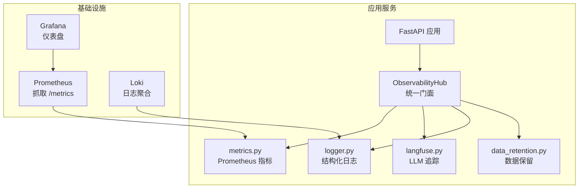
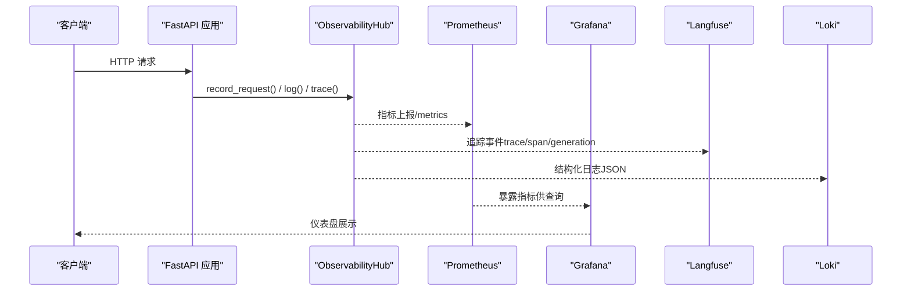
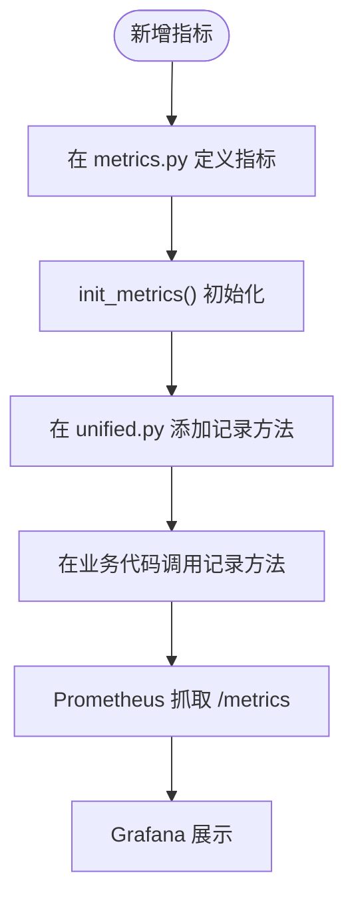
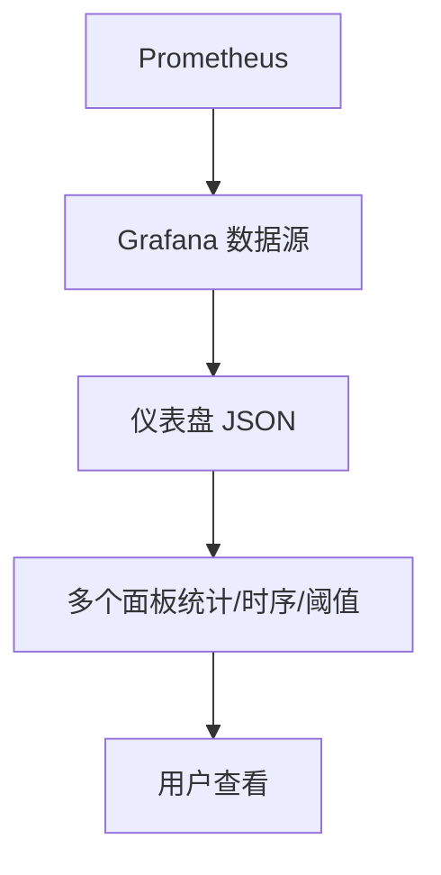
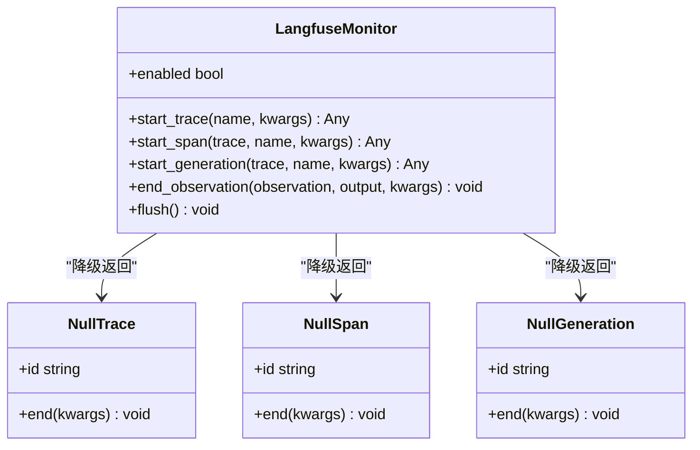
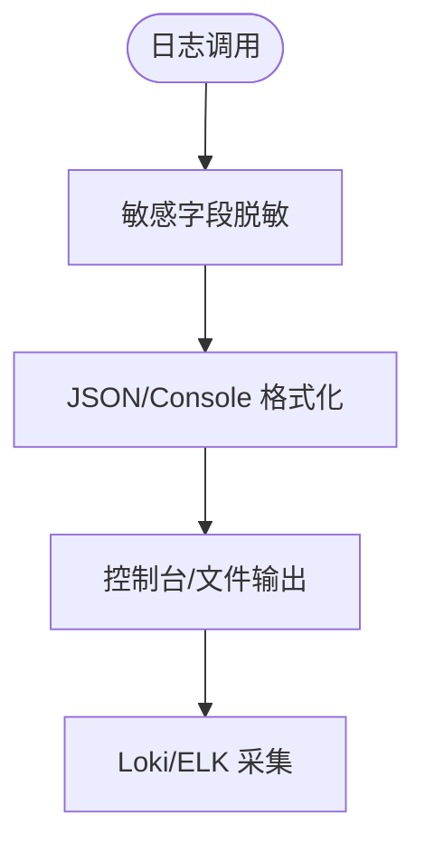
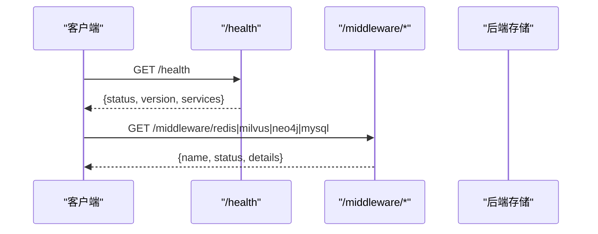
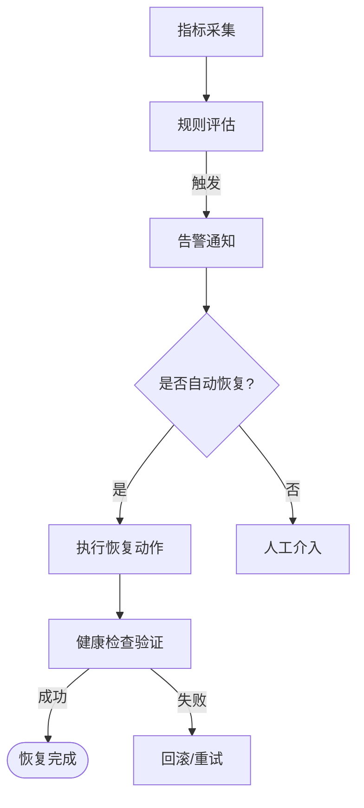
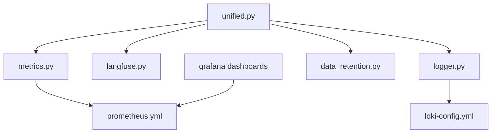

# 监控与可观测性

<cite>
**本文引用的文件**   
- [backend_design/nexus/observability/metrics.py](file://backend_design/nexus/observability/metrics.py)
- [backend_design/nexus/observability/langfuse.py](file://backend_design/nexus/observability/langfuse.py)
- [backend_design/nexus/observability/unified.py](file://backend_design/nexus/observability/unified.py)
- [backend_design/nexus/core/logger.py](file://backend_design/nexus/core/logger.py)
- [backend_design/nexus/config/observability.py](file://backend_design/nexus/config/observability.py)
- [config/prometheus/prometheus.yml](file://config/prometheus/prometheus.yml)
- [config/grafana/provisioning/dashboards/nexuscockpit-overview.json](file://config/grafana/provisioning/dashboards/nexuscockpit-overview.json)
- [config/grafana/provisioning/datasources/prometheus.yml](file://config/grafana/provisioning/datasources/prometheus.yml)
- [config/loki/loki-config.yml](file://config/loki/loki-config.yml)
- [backend_design/nexus/api/routes/health.py](file://backend_design/nexus/api/routes/health.py)
- [backend_design/nexus/api/routes/middleware_status.py](file://backend_design/nexus/api/routes/middleware_status.py)
- [backend_design/nexus/observability/data_retention.py](file://backend_design/nexus/observability/data_retention.py)
</cite>

## 目录
1. [简介](#简介)
2. [项目结构](#项目结构)
3. [核心组件](#核心组件)
4. [架构总览](#架构总览)
5. [详细组件分析](#详细组件分析)
6. [依赖关系分析](#依赖关系分析)
7. [性能考量](#性能考量)
8. [故障排查指南](#故障排查指南)
9. [结论](#结论)
10. [附录](#附录)

## 简介
本技术文档面向 NexusCockpit 的监控与可观测性体系，覆盖 Prometheus 指标采集、Grafana 看板配置、Langfuse LLM 调用链追踪、结构化日志收集与分析、中间件健康检查与服务状态监控、告警规则与自动恢复策略，以及性能基准测试、容量规划与扩容实践。文档以代码级为依据，提供可视化架构图与流程图，帮助运维开发者快速构建、扩展与维护完整的可观测性体系。

## 项目结构
NexusCockpit 的可观测性由以下关键模块构成：
- 指标采集：Prometheus 客户端定义与应用内埋点
- 统一门面：ObservabilityHub 统一日志、追踪、指标入口
- 追踪系统：Langfuse 集成与降级空操作
- 日志系统：structlog 结构化日志与敏感信息脱敏
- 配置管理：Langfuse 与 Prometheus/Grafana 地址等配置
- 数据保留：后台定时清理过期数据
- 健康检查：HTTP 健康端点与中间件状态 API
- 可视化：Grafana 预置仪表盘与 Prometheus 数据源
- 日志聚合：Loki 单机模式配置

**图表来源** 
- [backend_design/nexus/observability/unified.py](file://backend_design/nexus/observability/unified.py)
- [backend_design/nexus/observability/metrics.py](file://backend_design/nexus/observability/metrics.py)
- [backend_design/nexus/observability/langfuse.py](file://backend_design/nexus/observability/langfuse.py)
- [backend_design/nexus/core/logger.py](file://backend_design/nexus/core/logger.py)
- [backend_design/nexus/observability/data_retention.py](file://backend_design/nexus/observability/data_retention.py)
- [config/prometheus/prometheus.yml](file://config/prometheus/prometheus.yml)
- [config/grafana/provisioning/dashboards/nexuscockpit-overview.json](file://config/grafana/provisioning/dashboards/nexuscockpit-overview.json)
- [config/grafana/provisioning/datasources/prometheus.yml](file://config/grafana/provisioning/datasources/prometheus.yml)
- [config/loki/loki-config.yml](file://config/loki/loki-config.yml)

**章节来源**
- [backend_design/nexus/observability/unified.py](file://backend_design/nexus/observability/unified.py)
- [backend_design/nexus/observability/metrics.py](file://backend_design/nexus/observability/metrics.py)
- [backend_design/nexus/observability/langfuse.py](file://backend_design/nexus/observability/langfuse.py)
- [backend_design/nexus/core/logger.py](file://backend_design/nexus/core/logger.py)
- [backend_design/nexus/observability/data_retention.py](file://backend_design/nexus/observability/data_retention.py)
- [config/prometheus/prometheus.yml](file://config/prometheus/prometheus.yml)
- [config/grafana/provisioning/dashboards/nexuscockpit-overview.json](file://config/grafana/provisioning/dashboards/nexuscockpit-overview.json)
- [config/grafana/provisioning/datasources/prometheus.yml](file://config/grafana/provisioning/datasources/prometheus.yml)
- [config/loki/loki-config.yml](file://config/loki/loki-config.yml)

## 核心组件
- ObservabilityHub（统一门面）
  - 统一初始化日志、指标、追踪与数据保留
  - 统一日志入口（自动携带 trace_id 与上下文）
  - 统一追踪入口（trace/span/generation）
  - 统一指标记录（请求、Agent、技能、缓存、RAG、LLM）
  - 优雅关闭（刷新缓冲区、停止任务）

- Prometheus 指标（metrics.py）
  - 计数器：请求总数、Agent 调用、技能执行、缓存命中/未命中、RAG 检索、LLM 调用
  - 直方图：请求延迟、Agent 延迟、RAG 延迟、LLM 延迟
  - 仪表：活跃连接数
  - 初始化：应用版本、服务名等信息注入

- Langfuse 追踪（langfuse.py）
  - @observe 装饰器：自动追踪函数调用（支持 async/sync）
  - update_current_span：更新当前 span 元数据
  - NullTrace/NullSpan/NullGeneration：未启用时的降级空对象
  - LangfuseMonitor：客户端初始化、start_trace/start_span/start_generation、end_observation、flush

- 结构化日志（logger.py）
  - structlog JSON 输出（生产环境）与彩色控制台（开发环境）
  - 敏感字段脱敏处理器（API Key、Token、密码等）
  - 绑定/清除上下文变量（request_id、user_id）
  - 为 uvicorn 访问日志添加文件输出

- 配置（observability.py）
  - LangfuseConfig：public_key、secret_key、host、数据库相关参数
  - ObservabilityConfig：Prometheus URL、Grafana URL

- 数据保留（data_retention.py）
  - 多表保留策略（subagent_logs、mainagent_logs、audit_logs、chat_history、llm_cost_tracking、cockpit_stats）
  - 后台循环清理（按天间隔），异常安全处理

- 健康检查与中间件状态
  - /health：检查 Milvus、Neo4j、Redis、MySQL、OSS、Agent 工作流
  - /middleware/*：查询 Redis/Milvus/Neo4j/MySQL/LLM/TTS/ASR 运行状态

**章节来源**
- [backend_design/nexus/observability/unified.py](file://backend_design/nexus/observability/unified.py)
- [backend_design/nexus/observability/metrics.py](file://backend_design/nexus/observability/metrics.py)
- [backend_design/nexus/observability/langfuse.py](file://backend_design/nexus/observability/langfuse.py)
- [backend_design/nexus/core/logger.py](file://backend_design/nexus/core/logger.py)
- [backend_design/nexus/config/observability.py](file://backend_design/nexus/config/observability.py)
- [backend_design/nexus/observability/data_retention.py](file://backend_design/nexus/observability/data_retention.py)
- [backend_design/nexus/api/routes/health.py](file://backend_design/nexus/api/routes/health.py)
- [backend_design/nexus/api/routes/middleware_status.py](file://backend_design/nexus/api/routes/middleware_status.py)

## 架构总览
下图展示从应用到基础设施的数据流与组件交互：

**图表来源** 
- [backend_design/nexus/observability/unified.py](file://backend_design/nexus/observability/unified.py)
- [backend_design/nexus/observability/metrics.py](file://backend_design/nexus/observability/metrics.py)
- [backend_design/nexus/observability/langfuse.py](file://backend_design/nexus/observability/langfuse.py)
- [backend_design/nexus/core/logger.py](file://backend_design/nexus/core/logger.py)
- [config/prometheus/prometheus.yml](file://config/prometheus/prometheus.yml)
- [config/grafana/provisioning/dashboards/nexuscockpit-overview.json](file://config/grafana/provisioning/dashboards/nexuscockpit-overview.json)
- [config/grafana/provisioning/datasources/prometheus.yml](file://config/grafana/provisioning/datasources/prometheus.yml)
- [config/loki/loki-config.yml](file://config/loki/loki-config.yml)

## 详细组件分析

### Prometheus 指标采集与自定义指标
- 指标类型与用途
  - Counter：nexus_requests_total、nexus_agent_invocations_total、nexus_skill_executions_total、nexus_cache_hits_total、nexus_cache_misses_total、nexus_rag_retrievals_total、nexus_llm_calls_total
  - Histogram：nexus_request_latency_seconds、nexus_agent_latency_seconds、nexus_rag_latency_seconds、nexus_llm_latency_seconds
  - Gauge：nexus_active_connections
- 初始化与暴露
  - init_metrics() 设置应用信息（版本、服务名、描述）
  - FastAPI 通过 prometheus_client 暴露 /metrics 端点（由 Prometheus 抓取）
- 自定义指标步骤
  - 在 metrics.py 中新增指标定义（Counter/Histogram/Gauge）
  - 在 unified.py 中添加便捷记录方法（如 record_xxx）
  - 在业务逻辑中调用统一门面进行埋点

**图表来源** 
- [backend_design/nexus/observability/metrics.py](file://backend_design/nexus/observability/metrics.py)
- [backend_design/nexus/observability/unified.py](file://backend_design/nexus/observability/unified.py)
- [config/prometheus/prometheus.yml](file://config/prometheus/prometheus.yml)
- [config/grafana/provisioning/dashboards/nexuscockpit-overview.json](file://config/grafana/provisioning/dashboards/nexuscockpit-overview.json)

**章节来源**
- [backend_design/nexus/observability/metrics.py](file://backend_design/nexus/observability/metrics.py)
- [backend_design/nexus/observability/unified.py](file://backend_design/nexus/observability/unified.py)
- [config/prometheus/prometheus.yml](file://config/prometheus/prometheus.yml)
- [config/grafana/provisioning/dashboards/nexuscockpit-overview.json](file://config/grafana/provisioning/dashboards/nexuscockpit-overview.json)

### Grafana 看板配置与可视化仪表板
- 数据源配置
  - Prometheus 数据源名称、URL、UID、默认勾选
- 仪表盘
  - 预置 overview 面板：API 请求总数、P95 延迟、缓存命中率、活跃连接数、按方法分组的请求速率、延迟分布、Agent 调用速率、缓存命中/未命中趋势、Agent 执行延迟、RAG & LLM 延迟
- 阈值与单位
  - 各面板包含参考阈值与单位说明，便于快速定位异常

**图表来源** 
- [config/grafana/provisioning/datasources/prometheus.yml](file://config/grafana/provisioning/datasources/prometheus.yml)
- [config/grafana/provisioning/dashboards/nexuscockpit-overview.json](file://config/grafana/provisioning/dashboards/nexuscockpit-overview.json)

**章节来源**
- [config/grafana/provisioning/datasources/prometheus.yml](file://config/grafana/provisioning/datasources/prometheus.yml)
- [config/grafana/provisioning/dashboards/nexuscockpit-overview.json](file://config/grafana/provisioning/dashboards/nexuscockpit-overview.json)

### Langfuse 追踪系统集成与 LLM 调用链追踪
- 装饰器与上下文
  - @observe(name, as_type) 自动追踪函数调用（async/sync）
  - update_current_span(metadata, **kwargs) 更新当前 span 元数据
- 降级机制
  - 未安装或未配置时返回透传装饰器与 Null* 对象，不影响业务执行
- 使用方式
  - 在 Agent 节点、工具合成、LLM 调用处包裹 @observe
  - 在关键路径记录 generation（模型、输入、输出摘要、耗时）

**图表来源** 
- [backend_design/nexus/observability/langfuse.py](file://backend_design/nexus/observability/langfuse.py)

**章节来源**
- [backend_design/nexus/observability/langfuse.py](file://backend_design/nexus/observability/langfuse.py)

### 结构化日志收集、聚合与分析
- 输出格式
  - 生产环境 JSON（便于 Loki/ELK 采集）
  - 开发环境彩色控制台（便于调试）
- 敏感信息脱敏
  - 匹配 key 名称与值模式（Bearer Token、长密钥字符串）
- 上下文绑定
  - bind_context/clear_context 实现 request_id/user_id 传播
- 文件输出
  - 为 uvicorn.access/error 添加共享 FileHandler，确保访问日志写入文件

**图表来源** 
- [backend_design/nexus/core/logger.py](file://backend_design/nexus/core/logger.py)
- [config/loki/loki-config.yml](file://config/loki/loki-config.yml)

**章节来源**
- [backend_design/nexus/core/logger.py](file://backend_design/nexus/core/logger.py)
- [config/loki/loki-config.yml](file://config/loki/loki-config.yml)

### 中间件健康检查与服务状态监控
- /health 端点
  - 检查 Milvus、Neo4j、Redis、MySQL、OSS、Agent 工作流
  - 返回整体健康状态（healthy/degraded）与各组件状态
- /middleware/* API
  - 查询 Redis/Milvus/Neo4j/MySQL/LLM/TTS/ASR 的运行状态与配置信息
  - 用于前端“中间件看板”展示

**图表来源** 
- [backend_design/nexus/api/routes/health.py](file://backend_design/nexus/api/routes/health.py)
- [backend_design/nexus/api/routes/middleware_status.py](file://backend_design/nexus/api/routes/middleware_status.py)

**章节来源**
- [backend_design/nexus/api/routes/health.py](file://backend_design/nexus/api/routes/health.py)
- [backend_design/nexus/api/routes/middleware_status.py](file://backend_design/nexus/api/routes/middleware_status.py)

### 告警规则配置与故障自动恢复
- 指标告警建议
  - 请求错误率：increase(nexus_requests_total{status="error"}) 超过阈值
  - 延迟告警：histogram_quantile(0.95, rate(nexus_request_latency_seconds_bucket[5m])) > 阈值
  - 缓存命中率：nexus_cache_hits_total/(hits+misses) < 阈值
  - LLM 调用失败：nexus_llm_calls_total{status="error"} 突增
  - 活跃连接：nexus_active_connections > 阈值
- 自动恢复策略
  - 基于 Prometheus Alertmanager 触发重启或回滚
  - 结合 /health 与 /middleware/* 进行自愈前校验
  - 数据保留策略避免磁盘无限增长（后台清理）

**图表来源** 
- [backend_design/nexus/observability/metrics.py](file://backend_design/nexus/observability/metrics.py)
- [backend_design/nexus/api/routes/health.py](file://backend_design/nexus/api/routes/health.py)
- [backend_design/nexus/observability/data_retention.py](file://backend_design/nexus/observability/data_retention.py)

**章节来源**
- [backend_design/nexus/observability/metrics.py](file://backend_design/nexus/observability/metrics.py)
- [backend_design/nexus/api/routes/health.py](file://backend_design/nexus/api/routes/health.py)
- [backend_design/nexus/observability/data_retention.py](file://backend_design/nexus/observability/data_retention.py)

### 性能基准测试、容量规划与扩容策略
- 基准测试要点
  - 压测场景：并发请求、长尾延迟、缓存命中率、RAG 检索、LLM 调用
  - 指标关注：P50/P95/P99 延迟、错误率、吞吐、资源占用
- 容量规划
  - 根据峰值 QPS 与延迟目标估算 CPU/内存/网络带宽
  - 缓存与向量检索容量（Milvus 集合大小、索引策略）
  - 数据库连接池与慢查询优化
- 扩容策略
  - 水平扩容：增加应用实例与负载均衡
  - 垂直扩容：提升单实例资源上限
  - 分层缓存：本地缓存 + 分布式缓存（Redis）
  - 异步化与批处理：降低同步阻塞

[本节为通用指导，不直接分析具体文件]

## 依赖关系分析
- 组件耦合与内聚
  - ObservabilityHub 高内聚地封装日志、追踪、指标、数据保留
  - metrics.py 与 unified.py 解耦：指标定义与记录方法分离
  - langfuse.py 提供降级能力，避免强依赖
- 外部依赖
  - Prometheus 抓取 /metrics
  - Grafana 读取 Prometheus 数据源
  - Loki 聚合结构化日志
  - Langfuse 可选（未配置时降级）

**图表来源** 
- [backend_design/nexus/observability/unified.py](file://backend_design/nexus/observability/unified.py)
- [backend_design/nexus/observability/metrics.py](file://backend_design/nexus/observability/metrics.py)
- [backend_design/nexus/observability/langfuse.py](file://backend_design/nexus/observability/langfuse.py)
- [backend_design/nexus/core/logger.py](file://backend_design/nexus/core/logger.py)
- [backend_design/nexus/observability/data_retention.py](file://backend_design/nexus/observability/data_retention.py)
- [config/prometheus/prometheus.yml](file://config/prometheus/prometheus.yml)
- [config/grafana/provisioning/dashboards/nexuscockpit-overview.json](file://config/grafana/provisioning/dashboards/nexuscockpit-overview.json)
- [config/loki/loki-config.yml](file://config/loki/loki-config.yml)

**章节来源**
- [backend_design/nexus/observability/unified.py](file://backend_design/nexus/observability/unified.py)
- [backend_design/nexus/observability/metrics.py](file://backend_design/nexus/observability/metrics.py)
- [backend_design/nexus/observability/langfuse.py](file://backend_design/nexus/observability/langfuse.py)
- [backend_design/nexus/core/logger.py](file://backend_design/nexus/core/logger.py)
- [backend_design/nexus/observability/data_retention.py](file://backend_design/nexus/observability/data_retention.py)
- [config/prometheus/prometheus.yml](file://config/prometheus/prometheus.yml)
- [config/grafana/provisioning/dashboards/nexuscockpit-overview.json](file://config/grafana/provisioning/dashboards/nexuscockpit-overview.json)
- [config/loki/loki-config.yml](file://config/loki/loki-config.yml)

## 性能考量
- 指标粒度与开销
  - 合理选择 buckets 与标签维度，避免高基数导致内存膨胀
  - 控制直方图桶数量与时间窗口，平衡精度与性能
- 日志写入与脱敏
  - 生产环境 JSON 输出减少解析成本
  - 脱敏处理器仅在必要层级启用，避免过度正则匹配
- 追踪采样
  - 对高频函数采用采样策略，降低 Langfuse 上报压力
- 数据保留
  - 定期清理旧数据，防止 MySQL/Loki 存储无限增长

[本节为通用指导，不直接分析具体文件]

## 故障排查指南
- 常见问题定位
  - 指标缺失：检查 /metrics 端点是否暴露、Prometheus 抓取配置是否正确
  - 日志缺失：确认 logger.setup_logging() 已调用，文件路径与权限正确
  - 追踪未生效：检查 Langfuse 配置（public_key/secret_key/host）与 is_enabled
  - 健康检查异常：查看 /health 与 /middleware/* 返回的状态与错误信息
- 排查步骤
  - 查看应用日志文件（backend_logs/*.log）
  - 在 Grafana 中观察延迟与错误率曲线
  - 使用 Loki 搜索关键字与 trace_id
  - 检查 Prometheus 抓取状态与规则评估结果

**章节来源**
- [backend_design/nexus/core/logger.py](file://backend_design/nexus/core/logger.py)
- [backend_design/nexus/api/routes/health.py](file://backend_design/nexus/api/routes/health.py)
- [backend_design/nexus/api/routes/middleware_status.py](file://backend_design/nexus/api/routes/middleware_status.py)
- [config/prometheus/prometheus.yml](file://config/prometheus/prometheus.yml)
- [config/grafana/provisioning/dashboards/nexuscockpit-overview.json](file://config/grafana/provisioning/dashboards/nexuscockpit-overview.json)
- [config/loki/loki-config.yml](file://config/loki/loki-config.yml)

## 结论
NexusCockpit 的可观测性体系以 ObservabilityHub 为核心，整合 Prometheus 指标、Langfuse 追踪、structlog 结构化日志与数据保留策略，配合 Grafana 与 Loki 形成完整的监控与诊断闭环。通过统一的门面接口与降级机制，系统在功能完备性与健壮性之间取得平衡。运维开发者可依据本文档快速扩展指标、定制告警、优化性能并实施自动化恢复。

[本节为总结，不直接分析具体文件]

## 附录
- 新增监控指标示例路径
  - 定义指标：[backend_design/nexus/observability/metrics.py](file://backend_design/nexus/observability/metrics.py)
  - 统一记录方法：[backend_design/nexus/observability/unified.py](file://backend_design/nexus/observability/unified.py)
  - Prometheus 抓取配置：[config/prometheus/prometheus.yml](file://config/prometheus/prometheus.yml)
  - Grafana 仪表盘：[config/grafana/provisioning/dashboards/nexuscockpit-overview.json](file://config/grafana/provisioning/dashboards/nexuscockpit-overview.json)
- 自定义告警规则示例路径
  - 指标表达式参考：[config/grafana/provisioning/dashboards/nexuscockpit-overview.json](file://config/grafana/provisioning/dashboards/nexuscockpit-overview.json)
  - 健康检查端点：[backend_design/nexus/api/routes/health.py](file://backend_design/nexus/api/routes/health.py)
  - 中间件状态 API：[backend_design/nexus/api/routes/middleware_status.py](file://backend_design/nexus/api/routes/middleware_status.py)
- 结构化日志与 Loki 配置
  - 日志器与脱敏：[backend_design/nexus/core/logger.py](file://backend_design/nexus/core/logger.py)
  - Loki 配置：[config/loki/loki-config.yml](file://config/loki/loki-config.yml)
- Langfuse 追踪配置
  - 追踪集成与降级：[backend_design/nexus/observability/langfuse.py](file://backend_design/nexus/observability/langfuse.py)
  - 配置项：[backend_design/nexus/config/observability.py](file://backend_design/nexus/config/observability.py)
- 数据保留策略
  - 清理管理器：[backend_design/nexus/observability/data_retention.py](file://backend_design/nexus/observability/data_retention.py)