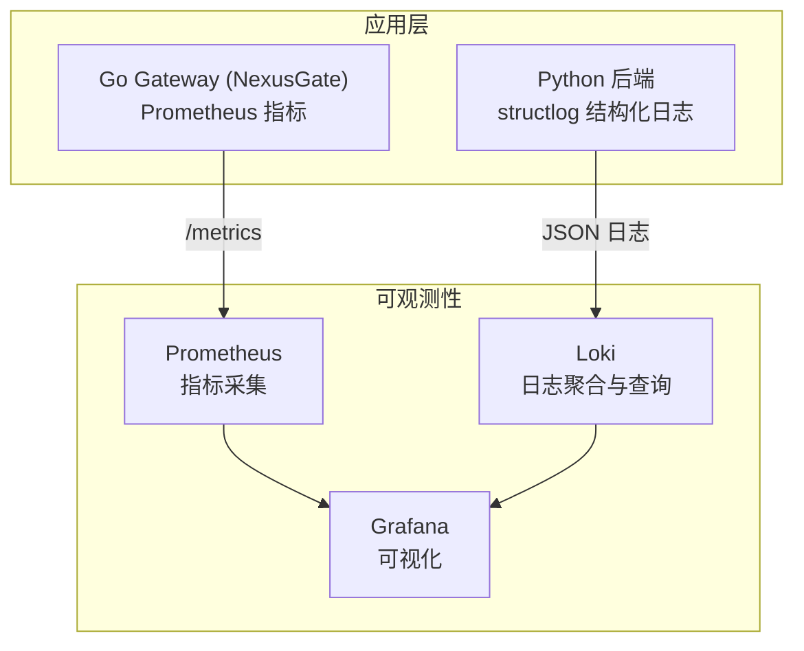
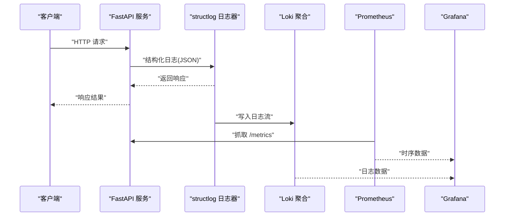
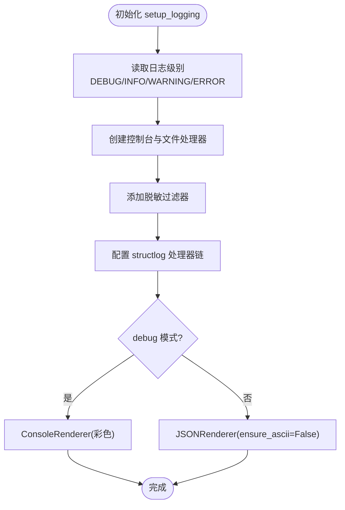
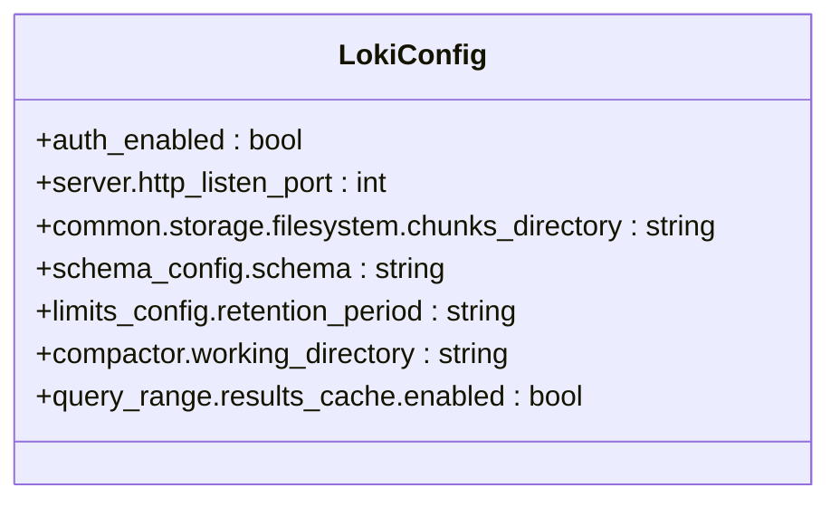
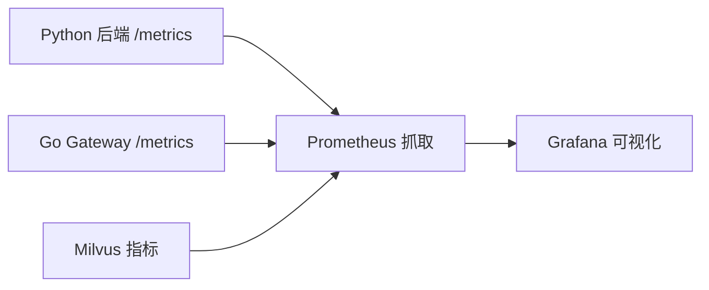
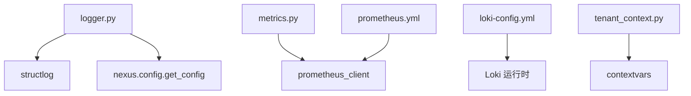

# 结构化日志收集

<cite>
**本文引用的文件**   
- [logger.py](file://backend_design/nexus/core/logger.py)
- [loki-config.yml](file://config/loki/loki-config.yml)
- [prometheus.yml](file://config/prometheus/prometheus.yml)
- [metrics.py](file://backend_design/nexus/observability/metrics.py)
- [server.py](file://backend_design/nexus/config/server.py)
- [tenant_context.py](file://backend_design/nexus/core/tenant_context.py)
</cite>

## 目录
1. [简介](#简介)
2. [项目结构](#项目结构)
3. [核心组件](#核心组件)
4. [架构总览](#架构总览)
5. [详细组件分析](#详细组件分析)
6. [依赖关系分析](#依赖关系分析)
7. [性能与容量规划](#性能与容量规划)
8. [故障排查指南](#故障排查指南)
9. [结论](#结论)
10. [附录：最佳实践与查询技巧](#附录最佳实践与查询技巧)

## 简介
本技术文档围绕 NexusCockpit 的结构化日志收集系统，系统性阐述日志框架设计、Loki 聚合配置、JSON 结构化输出规范、轮转归档策略、以及基于字段的查询与分析方法。同时覆盖安全脱敏、权限控制建议与常见业务场景的日志记录最佳实践，帮助开发者快速定位问题并提升可观测性。

## 项目结构
本项目在 Python 后端通过 structlog 实现结构化日志，统一输出 JSON；在 Go Gateway（NexusGate）侧可通过中间件或 SDK 接入 Prometheus 指标；日志聚合由 Loki 提供，指标采集由 Prometheus 提供，Grafana 用于可视化。关键路径如下：
- 结构化日志模块：backend_design/nexus/core/logger.py
- Loki 配置：config/loki/loki-config.yml
- Prometheus 抓取配置：config/prometheus/prometheus.yml
- 指标定义：backend_design/nexus/observability/metrics.py
- 服务器与日志级别配置：backend_design/nexus/config/server.py
- 多租户上下文（便于注入用户/座舱等上下文）：backend_design/nexus/core/tenant_context.py

图表来源 
- [logger.py:83-202](file://backend_design/nexus/core/logger.py#L83-L202)
- [loki-config.yml:1-56](file://config/loki/loki-config.yml#L1-L56)
- [prometheus.yml:1-35](file://config/prometheus/prometheus.yml#L1-L35)
- [metrics.py:1-108](file://backend_design/nexus/observability/metrics.py#L1-L108)

章节来源
- [logger.py:1-249](file://backend_design/nexus/core/logger.py#L1-L249)
- [loki-config.yml:1-56](file://config/loki/loki-config.yml#L1-L56)
- [prometheus.yml:1-35](file://config/prometheus/prometheus.yml#L1-L35)
- [metrics.py:1-108](file://backend_design/nexus/observability/metrics.py#L1-L108)
- [server.py:15-34](file://backend_design/nexus/config/server.py#L15-L34)
- [tenant_context.py:1-103](file://backend_design/nexus/core/tenant_context.py#L1-L103)

## 核心组件
- 结构化日志器（structlog）：提供 JSON 输出、时间戳、级别、调用栈、异常格式化、上下文绑定与敏感字段脱敏。
- Loki 日志聚合：TSDB + 文件系统存储，v12 schema，按天分片索引，保留期与压缩启用。
- Prometheus 指标：暴露 /metrics，采集请求、Agent、RAG、LLM 等关键指标。
- 服务器配置：日志级别、调试模式、端口等。
- 多租户上下文：协程安全的 cockpit_id/user_id 传递，便于日志与缓存隔离。

章节来源
- [logger.py:83-202](file://backend_design/nexus/core/logger.py#L83-L202)
- [loki-config.yml:24-44](file://config/loki/loki-config.yml#L24-L44)
- [metrics.py:14-108](file://backend_design/nexus/observability/metrics.py#L14-L108)
- [server.py:15-34](file://backend_design/nexus/config/server.py#L15-L34)
- [tenant_context.py:16-68](file://backend_design/nexus/core/tenant_context.py#L16-L68)

## 架构总览
下图展示从应用到 Loki/Prometheus/Grafana 的数据流与职责边界。

图表来源 
- [logger.py:180-202](file://backend_design/nexus/core/logger.py#L180-L202)
- [prometheus.yml:6-20](file://config/prometheus/prometheus.yml#L6-L20)
- [loki-config.yml:8-19](file://config/loki/loki-config.yml#L8-L19)

## 详细组件分析

### 结构化日志框架（structlog）
- 日志级别与格式
  - 开发环境：彩色控制台输出，便于阅读。
  - 生产环境：JSON 输出，包含时间戳、级别、模块名、调用栈、异常信息。
- 上下文绑定
  - 使用 contextvars 绑定 request_id、user_id、cockpit_id 等，自动附加到每条日志。
- 敏感信息脱敏
  - 对 key 匹配 api_key/secret/token/password 等进行掩码。
  - 对值中的 Bearer token 与长密钥字符串进行部分掩码。
- 标准 logging 集成
  - 为 uvicorn.access/error 添加共享 FileHandler，确保访问日志也落盘。
  - 抑制第三方库噪音日志（redis、neo4j、aiosqlite、openai、httpcore、python_multipart）。

图表来源 
- [logger.py:93-136](file://backend_design/nexus/core/logger.py#L93-L136)
- [logger.py:180-202](file://backend_design/nexus/core/logger.py#L180-L202)

章节来源
- [logger.py:33-81](file://backend_design/nexus/core/logger.py#L33-L81)
- [logger.py:83-177](file://backend_design/nexus/core/logger.py#L83-L177)
- [logger.py:179-202](file://backend_design/nexus/core/logger.py#L179-L202)
- [logger.py:218-249](file://backend_design/nexus/core/logger.py#L218-L249)

### Loki 日志聚合配置
- 存储与索引
  - TSDB + 文件系统对象存储，schema v12，索引前缀 index_，周期 24h。
- 保留与压缩
  - 保留期 168h（7 天），拒绝旧样本，启用 compactor 压缩与保留清理。
- 查询缓存
  - 内嵌缓存 100MB，加速重复查询。
- 认证
  - 单机模式关闭 auth_enabled，便于本地调试。

图表来源 
- [loki-config.yml:1-56](file://config/loki/loki-config.yml#L1-L56)

章节来源
- [loki-config.yml:12-23](file://config/loki/loki-config.yml#L12-L23)
- [loki-config.yml:24-38](file://config/loki/loki-config.yml#L24-L38)
- [loki-config.yml:41-51](file://config/loki/loki-config.yml#L41-L51)

### Prometheus 指标采集
- 抓取目标
  - nexus-ai（Python 后端）、nexus-gate（Go Gateway）、milvus、prometheus 自身。
- 指标维度
  - 请求计数/延迟、Agent 调用/延迟、技能执行、缓存命中/未命中、RAG 检索/延迟、LLM 调用/延迟、活跃连接数等。

图表来源 
- [prometheus.yml:6-20](file://config/prometheus/prometheus.yml#L6-L20)
- [metrics.py:20-96](file://backend_design/nexus/observability/metrics.py#L20-L96)

章节来源
- [prometheus.yml:1-35](file://config/prometheus/prometheus.yml#L1-L35)
- [metrics.py:14-108](file://backend_design/nexus/observability/metrics.py#L14-L108)

### 服务器与日志级别配置
- 日志级别
  - 通过环境变量 LOG_LEVEL 控制，默认 INFO。
- 调试模式
  - DEBUG=True 时开启热重载与彩色控制台输出。
- CORS、SSE 心跳等
  - 支持跨域与 SSE 心跳间隔配置。

章节来源
- [server.py:15-34](file://backend_design/nexus/config/server.py#L15-L34)

### 多租户上下文（用于日志与缓存隔离）
- 协程安全的 cockpit_id/user_id 传递。
- 提供上下文管理器 CockpitContext，自动设置与恢复。
- 结合日志上下文绑定，可在日志中体现用户与座舱信息。

章节来源
- [tenant_context.py:16-68](file://backend_design/nexus/core/tenant_context.py#L16-L68)
- [tenant_context.py:71-103](file://backend_design/nexus/core/tenant_context.py#L71-L103)

## 依赖关系分析
- logger.py 依赖 structlog、logging、re、sys、typing、nexus.config.get_config。
- loki-config.yml 定义存储、索引、保留、压缩、缓存等运行时参数。
- prometheus.yml 定义抓取任务与目标。
- metrics.py 定义各类 Counter/Histogram/Gauge 指标。
- server.py 提供日志级别与运行参数。
- tenant_context.py 提供上下文变量，供日志与缓存等模块使用。

图表来源 
- [logger.py:23-31](file://backend_design/nexus/core/logger.py#L23-L31)
- [metrics.py:12-18](file://backend_design/nexus/observability/metrics.py#L12-L18)
- [prometheus.yml:1-12](file://config/prometheus/prometheus.yml#L1-L12)
- [loki-config.yml:1-11](file://config/loki/loki-config.yml#L1-L11)
- [tenant_context.py:14-23](file://backend_design/nexus/core/tenant_context.py#L14-L23)

章节来源
- [logger.py:23-31](file://backend_design/nexus/core/logger.py#L23-L31)
- [metrics.py:12-18](file://backend_design/nexus/observability/metrics.py#L12-L18)
- [prometheus.yml:1-12](file://config/prometheus/prometheus.yml#L1-L12)
- [loki-config.yml:1-11](file://config/loki/loki-config.yml#L1-L11)
- [tenant_context.py:14-23](file://backend_design/nexus/core/tenant_context.py#L14-L23)

## 性能与容量规划
- Loki
  - 索引周期 24h，适合日级滚动；保留期 7 天，避免磁盘无限增长。
  - 启用 compactor 与 retention，定期清理与压缩旧数据。
  - 查询缓存 100MB，缓解热点查询压力。
- Prometheus
  - 抓取间隔 15s，评估间隔 15s，平衡实时性与负载。
  - 合理划分 job 与 labels，避免高基数导致内存膨胀。
- 应用端
  - 生产环境使用 JSON 输出，减少解析开销；开发环境彩色控制台便于调试。
  - 抑制第三方库噪音日志，降低 I/O 与 CPU 消耗。

[本节为通用指导，不直接分析具体文件]

## 故障排查指南
- 无法写入日志文件
  - 检查 logs/backend_logs 目录是否存在与写入权限。
  - 确认 setup_logging 已调用且 file_handler 已添加到 uvicorn 相关 logger。
- 日志未脱敏
  - 检查敏感键名是否匹配正则（api_key/secret/token/password 等）。
  - 检查值是否为字符串且包含 Bearer token 或长密钥。
- Loki 查询慢
  - 检查 query_range 缓存是否启用与大小是否足够。
  - 关注 limits_config.max_query_series 限制。
- Prometheus 抓取失败
  - 检查 targets 可达性与 /metrics 路径是否正确。
  - 查看 Prometheus 抓取状态与错误日志。

章节来源
- [logger.py:97-177](file://backend_design/nexus/core/logger.py#L97-L177)
- [logger.py:33-81](file://backend_design/nexus/core/logger.py#L33-L81)
- [loki-config.yml:46-51](file://config/loki/loki-config.yml#L46-L51)
- [prometheus.yml:6-20](file://config/prometheus/prometheus.yml#L6-L20)

## 结论
NexusCockpit 的结构化日志体系以 structlog 为核心，统一 JSON 输出与敏感信息脱敏；Loki 提供高性能日志聚合与查询；Prometheus 采集关键指标，配合 Grafana 形成完整的可观测闭环。通过合理的索引策略、保留期与缓存配置，系统在开发与生产环境下均能稳定运行。结合多租户上下文与最佳实践，可显著提升问题定位效率与系统稳定性。

[本节为总结性内容，不直接分析具体文件]

## 附录：最佳实践与查询技巧

### 结构化 JSON 日志规范
- 关键字段建议
  - 业务上下文：cockpit_id、user_id、request_id、trace_id。
  - 请求元信息：method、path、status_code、latency_ms。
  - 错误信息：error_type、error_message、stack_trace。
- 生成方式
  - 使用 get_logger(__name__) 获取日志器，bind_context(request_id=..., user_id=...) 绑定上下文。
  - 通过 info/warning/error 等方法输出结构化字段。

章节来源
- [logger.py:218-249](file://backend_design/nexus/core/logger.py#L218-L249)
- [tenant_context.py:16-68](file://backend_design/nexus/core/tenant_context.py#L16-L68)

### 日志轮转、压缩与归档策略
- 当前实现
  - 按启动时间生成日志文件，未内置轮转器。
- 建议方案
  - 使用 logrotate 按大小/时间切分，配合 gzip 压缩与归档。
  - 将 Loki 作为长期归档与查询入口，本地文件仅短期留存。
  - 在容器环境中，将日志输出到 stdout/stderr，由编排平台统一收集。

[本节为通用指导，不直接分析具体文件]

### 常见业务场景的日志记录最佳实践
- API 请求日志
  - 记录 method、path、status_code、latency_ms、client_ip、user_id、request_id。
  - 使用 Prometheus Histogram 统计延迟分布。
- Agent 执行日志
  - 记录 agent_name、node_name、status、latency_ms、input/output 摘要。
  - 使用 Counter 统计调用次数与成功率。
- 错误堆栈日志
  - 记录 error_type、error_message、stack_trace，避免泄露敏感信息。
  - 使用 format_exc_info 自动附加异常信息。

章节来源
- [metrics.py:20-96](file://backend_design/nexus/observability/metrics.py#L20-L96)
- [logger.py:180-202](file://backend_design/nexus/core/logger.py#L180-L202)

### 日志查询与分析技巧（Loki）
- 基于字段的过滤
  - 使用 label 选择器过滤 cockpit_id、user_id、level 等。
- 时间范围查询
  - 指定 start/end 时间范围，结合 limit 控制结果量。
- 聚合统计
  - 使用 count_over_time、sum_over_time 等函数进行统计。
  - 结合 Grafana 面板进行可视化分析。

[本节为通用指导，不直接分析具体文件]

### 日志安全考虑
- 敏感信息脱敏
  - 自动掩码 API Key、JWT Token、密码等键名与值。
- 访问权限控制
  - 在生产环境启用 Loki 认证与 RBAC，限制访问者权限。
  - 最小化日志中敏感字段，必要时进行二次脱敏。

章节来源
- [logger.py:33-81](file://backend_design/nexus/core/logger.py#L33-L81)
- [loki-config.yml:6](file://config/loki/loki-config.yml#L6-L6)

### 开发者调试与问题排查实用指南
- 快速定位
  - 使用 request_id 串联一次请求的全链路日志。
  - 结合 Prometheus 指标观察延迟与错误率变化。
- 常见问题
  - 日志缺失：检查 setup_logging 调用与 uvicorn logger 配置。
  - 查询缓慢：检查 Loki 缓存与索引策略。
  - 指标缺失：检查 /metrics 路径与抓取配置。

章节来源
- [logger.py:161-177](file://backend_design/nexus/core/logger.py#L161-L177)
- [prometheus.yml:6-20](file://config/prometheus/prometheus.yml#L6-L20)
- [loki-config.yml:46-51](file://config/loki/loki-config.yml#L46-L51)