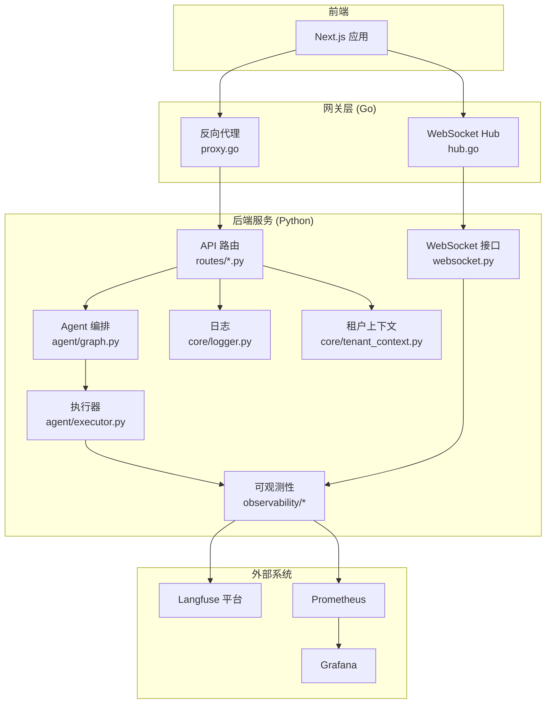
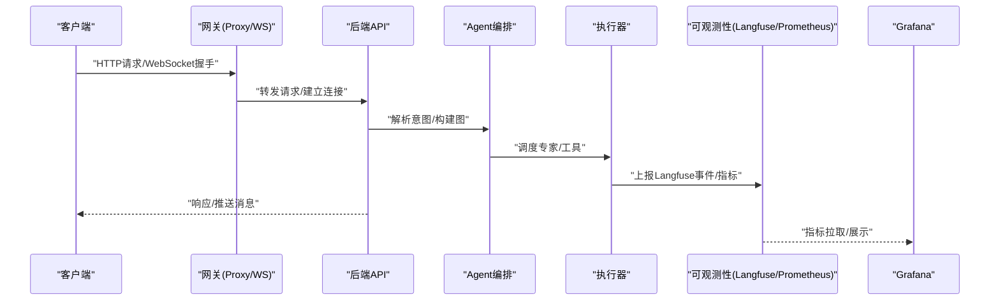
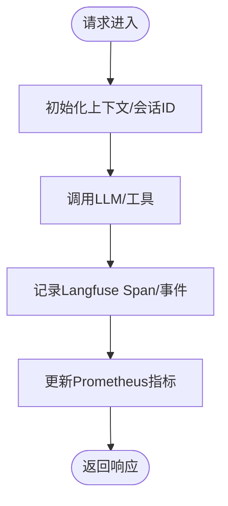
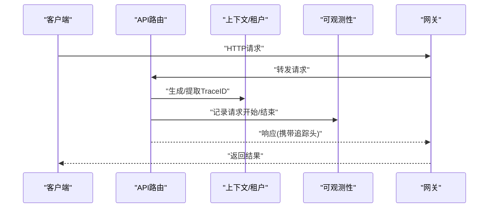
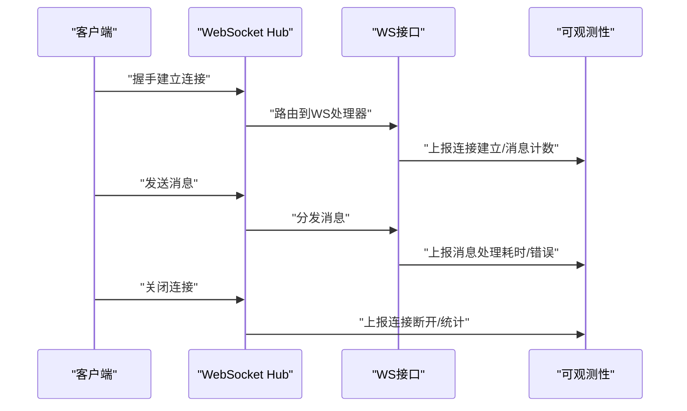
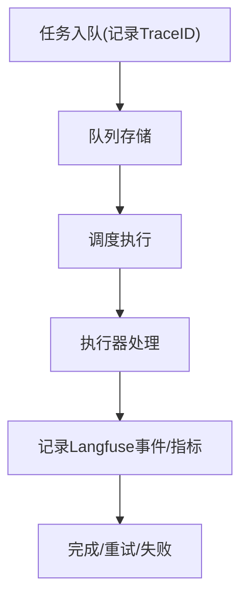
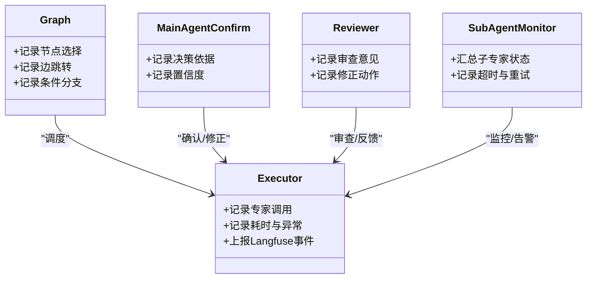
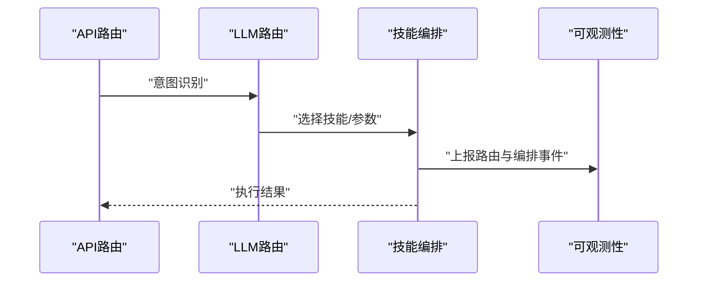
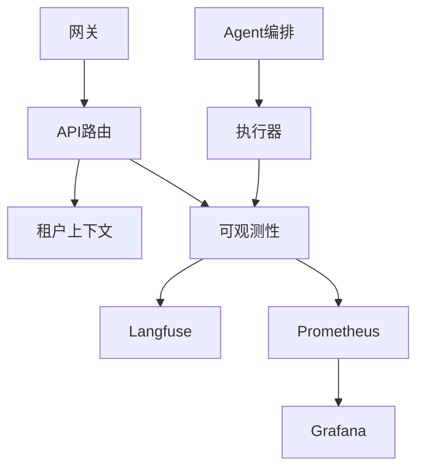

# 分布式链路追踪

<cite>
**本文引用的文件**   
- [backend_design/nexus/observability/langfuse.py](file://backend_design/nexus/observability/langfuse.py)
- [backend_design/nexus/observability/metrics.py](file://backend_design/nexus/observability/metrics.py)
- [backend_design/nexus/observability/cockpit_metrics.py](file://backend_design/nexus/observability/cockpit_metrics.py)
- [backend_design/nexus/api/websocket.py](file://backend_design/nexus/api/websocket.py)
- [backend_design/nexus/api/routes/chat.py](file://backend_design/nexus/api/routes/chat.py)
- [backend_design/nexus/core/logger.py](file://backend_design/nexus/core/logger.py)
- [backend_design/nexus/core/tenant_context.py](file://backend_design/nexus/core/tenant_context.py)
- [backend_design/nexus/agent/graph.py](file://backend_design/nexus/agent/graph.py)
- [backend_design/nexus/agent/executor.py](file://backend_design/nexus/agent/executor.py)
- [backend_design/nexus/agent/mainagent_confirm.py](file://backend_design/nexus/agent/mainagent_confirm.py)
- [backend_design/nexus/agent/responder.py](file://backend_design/nexus/agent/responder.py)
- [backend_design/nexus/agent/reviewer.py](file://backend_design/nexus/agent/reviewer.py)
- [backend_design/nexus/agent/subagent_monitor.py](file://backend_design/nexus/agent/subagent_monitor.py)
- [backend_design/nexus/intent/llm_router.py](file://backend_design/nexus/intent/llm_router.py)
- [backend_design/nexus/skills/orchestrator.py](file://backend_design/nexus/skills/orchestrator.py)
- [backend_design/nexus/middleware/task_queue.py](file://backend_design/nexus/middleware/task_queue.py)
- [backend_design/nexus_gate/internal/proxy/proxy.go](file://backend_design/nexus_gate/internal/proxy/proxy.go)
- [backend_design/nexus_gate/internal/ws/hub.go](file://backend_design/nexus_gate/internal/ws/hub.go)
- [config/grafana/provisioning/dashboards/nexuscockpit-overview.json](file://config/grafana/provisioning/dashboards/nexuscockpit-overview.json)
- [config/prometheus/prometheus.yml](file://config/prometheus/prometheus.yml)
</cite>

## 目录
1. [引言](#引言)
2. [项目结构](#项目结构)
3. [核心组件](#核心组件)
4. [架构总览](#架构总览)
5. [详细组件分析](#详细组件分析)
6. [依赖关系分析](#依赖关系分析)
7. [性能考量](#性能考量)
8. [故障排查指南](#故障排查指南)
9. [结论](#结论)
10. [附录](#附录)

## 引言
本文件面向NexusCockpit系统的分布式链路追踪与可观测性建设，重点说明Langfuse集成方案、跨服务调用链的追踪机制（HTTP请求、WebSocket连接、异步任务）、关键业务路径埋点方法、追踪数据收集策略，以及在Grafana中可视化展示调用链路与性能瓶颈的方法。同时提供Agent多专家协作流程的追踪分析与调试建议，并给出链路数据的分析与优化方向。

## 项目结构
本项目在后端Python服务中实现了基于Langfuse的LLM与Agent链路追踪能力，并通过Prometheus指标暴露系统级性能数据；前端通过Next.js访问后端API与WebSocket；Go语言网关负责鉴权、限流、反向代理与WebSocket转发。可观测性相关代码集中在observability目录，Agent编排位于agent目录，API路由在api/routes下，网关逻辑在nexus_gate。

图表来源
- [backend_design/nexus/api/websocket.py](file://backend_design/nexus/api/websocket.py)
- [backend_design/nexus/api/routes/chat.py](file://backend_design/nexus/api/routes/chat.py)
- [backend_design/nexus/agent/graph.py](file://backend_design/nexus/agent/graph.py)
- [backend_design/nexus/agent/executor.py](file://backend_design/nexus/agent/executor.py)
- [backend_design/nexus/observability/langfuse.py](file://backend_design/nexus/observability/langfuse.py)
- [backend_design/nexus/observability/metrics.py](file://backend_design/nexus/observability/metrics.py)
- [backend_design/nexus/core/logger.py](file://backend_design/nexus/core/logger.py)
- [backend_design/nexus/core/tenant_context.py](file://backend_design/nexus/core/tenant_context.py)
- [backend_design/nexus_gate/internal/proxy/proxy.go](file://backend_design/nexus_gate/internal/proxy/proxy.go)
- [backend_design/nexus_gate/internal/ws/hub.go](file://backend_design/nexus_gate/internal/ws/hub.go)

章节来源
- [backend_design/nexus/observability/langfuse.py](file://backend_design/nexus/observability/langfuse.py)
- [backend_design/nexus/observability/metrics.py](file://backend_design/nexus/observability/metrics.py)
- [backend_design/nexus/api/websocket.py](file://backend_design/nexus/api/websocket.py)
- [backend_design/nexus/api/routes/chat.py](file://backend_design/nexus/api/routes/chat.py)
- [backend_design/nexus/agent/graph.py](file://backend_design/nexus/agent/graph.py)
- [backend_design/nexus/agent/executor.py](file://backend_design/nexus/agent/executor.py)
- [backend_design/nexus/core/logger.py](file://backend_design/nexus/core/logger.py)
- [backend_design/nexus/core/tenant_context.py](file://backend_design/nexus/core/tenant_context.py)
- [backend_design/nexus_gate/internal/proxy/proxy.go](file://backend_design/nexus_gate/internal/proxy/proxy.go)
- [backend_design/nexus_gate/internal/ws/hub.go](file://backend_design/nexus_gate/internal/ws/hub.go)

## 核心组件
- Langfuse集成模块：封装Langfuse客户端初始化、会话与追踪事件上报，用于记录LLM调用、工具调用、Agent步骤等结构化追踪数据。
- 指标采集模块：定义并暴露Prometheus指标，包括请求耗时、错误率、队列长度、WebSocket连接数等。
- 仪表盘配置：提供Grafana仪表板JSON，聚合Prometheus指标进行可视化。
- WebSocket处理：维护长连接状态，结合可观测性上报连接生命周期与消息吞吐。
- 日志与租户上下文：统一日志格式与租户隔离信息，便于关联追踪ID与用户维度分析。
- Agent编排与执行：在图编排与执行过程中注入追踪点，记录子专家调用、决策分支、重试与失败原因。

章节来源
- [backend_design/nexus/observability/langfuse.py](file://backend_design/nexus/observability/langfuse.py)
- [backend_design/nexus/observability/metrics.py](file://backend_design/nexus/observability/metrics.py)
- [config/grafana/provisioning/dashboards/nexuscockpit-overview.json](file://config/grafana/provisioning/dashboards/nexuscockpit-overview.json)
- [backend_design/nexus/api/websocket.py](file://backend_design/nexus/api/websocket.py)
- [backend_design/nexus/core/logger.py](file://backend_design/nexus/core/logger.py)
- [backend_design/nexus/core/tenant_context.py](file://backend_design/nexus/core/tenant_context.py)
- [backend_design/nexus/agent/graph.py](file://backend_design/nexus/agent/graph.py)
- [backend_design/nexus/agent/executor.py](file://backend_design/nexus/agent/executor.py)

## 架构总览
下图展示了从前端到网关再到后端服务的完整链路，以及Langfuse与Grafana的数据流向。

图表来源
- [backend_design/nexus_gate/internal/proxy/proxy.go](file://backend_design/nexus_gate/internal/proxy/proxy.go)
- [backend_design/nexus_gate/internal/ws/hub.go](file://backend_design/nexus_gate/internal/ws/hub.go)
- [backend_design/nexus/api/routes/chat.py](file://backend_design/nexus/api/routes/chat.py)
- [backend_design/nexus/api/websocket.py](file://backend_design/nexus/api/websocket.py)
- [backend_design/nexus/agent/graph.py](file://backend_design/nexus/agent/graph.py)
- [backend_design/nexus/agent/executor.py](file://backend_design/nexus/agent/executor.py)
- [backend_design/nexus/observability/langfuse.py](file://backend_design/nexus/observability/langfuse.py)
- [backend_design/nexus/observability/metrics.py](file://backend_design/nexus/observability/metrics.py)
- [config/grafana/provisioning/dashboards/nexuscockpit-overview.json](file://config/grafana/provisioning/dashboards/nexuscockpit-overview.json)

## 详细组件分析

### Langfuse集成方案
- 初始化与配置：在服务启动时加载Langfuse服务端地址、密钥、默认项目与版本等信息，确保后续追踪事件能正确上报。
- 会话与追踪：为每次请求或会话生成唯一标识，将LLM调用、工具调用、Agent步骤作为Span或事件上报，附带输入输出摘要、耗时与错误码。
- 元数据与标签：附加租户ID、用户ID、模型名称、技能名称等标签，便于按维度筛选与分析。
- 容错与降级：当Langfuse不可用时，避免阻塞主流程，采用本地缓冲或丢弃策略，保证服务可用性。

图表来源
- [backend_design/nexus/observability/langfuse.py](file://backend_design/nexus/observability/langfuse.py)
- [backend_design/nexus/observability/metrics.py](file://backend_design/nexus/observability/metrics.py)

章节来源
- [backend_design/nexus/observability/langfuse.py](file://backend_design/nexus/observability/langfuse.py)
- [backend_design/nexus/observability/metrics.py](file://backend_design/nexus/observability/metrics.py)

### HTTP请求链路追踪
- 入口拦截：在API路由层对请求进行拦截，提取或生成TraceID，写入请求上下文，并在响应阶段追加追踪头以便下游或网关透传。
- 指标采集：记录请求开始与结束时间，计算耗时直方图；统计状态码分布与错误分类。
- 上下文传播：将TraceID与租户信息传递至Agent与执行器，确保整条链路具备一致标识。

图表来源
- [backend_design/nexus/api/routes/chat.py](file://backend_design/nexus/api/routes/chat.py)
- [backend_design/nexus/core/tenant_context.py](file://backend_design/nexus/core/tenant_context.py)
- [backend_design/nexus/observability/metrics.py](file://backend_design/nexus/observability/metrics.py)
- [backend_design/nexus_gate/internal/proxy/proxy.go](file://backend_design/nexus_gate/internal/proxy/proxy.go)

章节来源
- [backend_design/nexus/api/routes/chat.py](file://backend_design/nexus/api/routes/chat.py)
- [backend_design/nexus/core/tenant_context.py](file://backend_design/nexus/core/tenant_context.py)
- [backend_design/nexus/observability/metrics.py](file://backend_design/nexus/observability/metrics.py)
- [backend_design/nexus_gate/internal/proxy/proxy.go](file://backend_design/nexus_gate/internal/proxy/proxy.go)

### WebSocket连接追踪
- 连接生命周期：在Hub层记录连接建立、断开、消息收发数量与延迟，上报Langfuse事件与Prometheus指标。
- 状态同步：将连接ID与TraceID绑定，支持按会话维度查看实时消息时序与错误重连次数。
- 背压与限流：结合中间件限流与队列长度监控，防止突发流量导致链路抖动。

图表来源
- [backend_design/nexus/api/websocket.py](file://backend_design/nexus/api/websocket.py)
- [backend_design/nexus_gate/internal/ws/hub.go](file://backend_design/nexus_gate/internal/ws/hub.go)
- [backend_design/nexus/observability/metrics.py](file://backend_design/nexus/observability/metrics.py)

章节来源
- [backend_design/nexus/api/websocket.py](file://backend_design/nexus/api/websocket.py)
- [backend_design/nexus_gate/internal/ws/hub.go](file://backend_design/nexus_gate/internal/ws/hub.go)
- [backend_design/nexus/observability/metrics.py](file://backend_design/nexus/observability/metrics.py)

### 异步任务追踪
- 任务入队：在中间件任务队列中将任务ID与TraceID关联，记录入队时间与队列长度。
- 任务执行：在执行器中记录任务开始、结束、重试次数与失败原因，上报Langfuse事件。
- 结果回写：任务完成后更新状态并触发回调，确保端到端可追溯。

图表来源
- [backend_design/nexus/middleware/task_queue.py](file://backend_design/nexus/middleware/task_queue.py)
- [backend_design/nexus/agent/executor.py](file://backend_design/nexus/agent/executor.py)
- [backend_design/nexus/observability/langfuse.py](file://backend_design/nexus/observability/langfuse.py)

章节来源
- [backend_design/nexus/middleware/task_queue.py](file://backend_design/nexus/middleware/task_queue.py)
- [backend_design/nexus/agent/executor.py](file://backend_design/nexus/agent/executor.py)
- [backend_design/nexus/observability/langfuse.py](file://backend_design/nexus/observability/langfuse.py)

### Agent多专家协作流程追踪
- 图编排：在graph中记录节点选择、边跳转、条件分支与循环，形成完整的执行图轨迹。
- 执行器：在executor中记录每个专家的调用参数、返回摘要、耗时与异常，支持按专家维度聚合。
- 主Agent确认与审查：在主Agent确认与审查环节记录决策依据与置信度，便于回溯与审计。
- 子专家监控：在subagent_monitor中汇总子专家状态、超时与重试，提供健康度指标。

图表来源
- [backend_design/nexus/agent/graph.py](file://backend_design/nexus/agent/graph.py)
- [backend_design/nexus/agent/executor.py](file://backend_design/nexus/agent/executor.py)
- [backend_design/nexus/agent/mainagent_confirm.py](file://backend_design/nexus/agent/mainagent_confirm.py)
- [backend_design/nexus/agent/reviewer.py](file://backend_design/nexus/agent/reviewer.py)
- [backend_design/nexus/agent/subagent_monitor.py](file://backend_design/nexus/agent/subagent_monitor.py)

章节来源
- [backend_design/nexus/agent/graph.py](file://backend_design/nexus/agent/graph.py)
- [backend_design/nexus/agent/executor.py](file://backend_design/nexus/agent/executor.py)
- [backend_design/nexus/agent/mainagent_confirm.py](file://backend_design/nexus/agent/mainagent_confirm.py)
- [backend_design/nexus/agent/reviewer.py](file://backend_design/nexus/agent/reviewer.py)
- [backend_design/nexus/agent/subagent_monitor.py](file://backend_design/nexus/agent/subagent_monitor.py)

### 意图识别与技能编排追踪
- LLM路由：在llm_router中记录意图分类结果、候选技能列表与路由决策依据。
- 技能编排：在orchestrator中记录技能调用顺序、参数校验、缓存命中与回退策略。

图表来源
- [backend_design/nexus/intent/llm_router.py](file://backend_design/nexus/intent/llm_router.py)
- [backend_design/nexus/skills/orchestrator.py](file://backend_design/nexus/skills/orchestrator.py)
- [backend_design/nexus/observability/langfuse.py](file://backend_design/nexus/observability/langfuse.py)

章节来源
- [backend_design/nexus/intent/llm_router.py](file://backend_design/nexus/intent/llm_router.py)
- [backend_design/nexus/skills/orchestrator.py](file://backend_design/nexus/skills/orchestrator.py)
- [backend_design/nexus/observability/langfuse.py](file://backend_design/nexus/observability/langfuse.py)

### 日志与租户上下文
- 统一日志：在logger中记录结构化日志，包含TraceID、租户ID、用户ID、操作类型与结果。
- 租户上下文：在tenant_context中维护当前请求的租户信息，确保追踪数据按租户隔离。

章节来源
- [backend_design/nexus/core/logger.py](file://backend_design/nexus/core/logger.py)
- [backend_design/nexus/core/tenant_context.py](file://backend_design/nexus/core/tenant_context.py)

## 依赖关系分析
- 组件耦合：API路由依赖上下文与可观测性模块；Agent编排依赖执行器与监控；网关独立于后端实现，仅关注转发与连接管理。
- 外部依赖：Langfuse用于结构化追踪，Prometheus用于指标采集，Grafana用于可视化。
- 潜在环依赖：应避免在可观测性模块中直接依赖业务逻辑，保持单向依赖。

图表来源
- [backend_design/nexus/api/routes/chat.py](file://backend_design/nexus/api/routes/chat.py)
- [backend_design/nexus/core/tenant_context.py](file://backend_design/nexus/core/tenant_context.py)
- [backend_design/nexus/agent/graph.py](file://backend_design/nexus/agent/graph.py)
- [backend_design/nexus/agent/executor.py](file://backend_design/nexus/agent/executor.py)
- [backend_design/nexus/observability/langfuse.py](file://backend_design/nexus/observability/langfuse.py)
- [backend_design/nexus/observability/metrics.py](file://backend_design/nexus/observability/metrics.py)
- [backend_design/nexus_gate/internal/proxy/proxy.go](file://backend_design/nexus_gate/internal/proxy/proxy.go)

章节来源
- [backend_design/nexus/api/routes/chat.py](file://backend_design/nexus/api/routes/chat.py)
- [backend_design/nexus/core/tenant_context.py](file://backend_design/nexus/core/tenant_context.py)
- [backend_design/nexus/agent/graph.py](file://backend_design/nexus/agent/graph.py)
- [backend_design/nexus/agent/executor.py](file://backend_design/nexus/agent/executor.py)
- [backend_design/nexus/observability/langfuse.py](file://backend_design/nexus/observability/langfuse.py)
- [backend_design/nexus/observability/metrics.py](file://backend_design/nexus/observability/metrics.py)
- [backend_design/nexus_gate/internal/proxy/proxy.go](file://backend_design/nexus_gate/internal/proxy/proxy.go)

## 性能考量
- 采样与降采样：在高并发场景下对Langfuse事件进行采样，降低上报开销；对高频指标使用滑动窗口聚合。
- 批量上报：将多个追踪事件合并上报，减少网络往返。
- 非阻塞上报：采用异步队列与重试机制，避免影响主流程延迟。
- 指标粒度：合理设置直方图桶与标签基数，避免标签爆炸导致查询缓慢。

[本节为通用指导，不直接分析具体文件]

## 故障排查指南
- 定位慢调用：通过Grafana仪表板查看P95/P99耗时与错误率，结合Langfuse事件定位具体节点。
- 检查连接问题：在WebSocket Hub中查看连接建立与断开统计，排查网络抖动与认证失败。
- 分析Agent决策：在Graph与Executor中查看节点选择与专家调用详情，定位意图识别偏差或工具调用失败。
- 验证上下文传播：确认TraceID在各层是否一致，检查网关与后端的头部透传是否正确。

章节来源
- [backend_design/nexus/api/websocket.py](file://backend_design/nexus/api/websocket.py)
- [backend_design/nexus/agent/graph.py](file://backend_design/nexus/agent/graph.py)
- [backend_design/nexus/agent/executor.py](file://backend_design/nexus/agent/executor.py)
- [backend_design/nexus/observability/metrics.py](file://backend_design/nexus/observability/metrics.py)
- [config/grafana/provisioning/dashboards/nexuscockpit-overview.json](file://config/grafana/provisioning/dashboards/nexuscockpit-overview.json)

## 结论
通过在API、WebSocket、Agent与执行器各层注入追踪点，并结合Langfuse与Prometheus/Grafana，NexusCockpit实现了端到端的分布式链路追踪与可视化。建议在后续迭代中完善上下文传播规范、统一埋点模板与自动化回归测试，持续提升可观测性与稳定性。

[本节为总结，不直接分析具体文件]

## 附录
- 关键埋点清单：
  - HTTP请求：开始/结束、状态码、耗时、租户与用户标签
  - WebSocket：连接建立/断开、消息计数、延迟、错误重连
  - Agent：节点选择、专家调用、决策依据、重试与失败原因
  - 异步任务：入队/出队、执行耗时、重试次数、最终状态
- 可视化建议：
  - 在Grafana中创建“调用链热力图”、“专家耗时TopN”、“错误率趋势”、“队列积压告警”等面板
  - 结合Langfuse的事件视图进行根因分析

章节来源
- [backend_design/nexus/observability/metrics.py](file://backend_design/nexus/observability/metrics.py)
- [config/grafana/provisioning/dashboards/nexuscockpit-overview.json](file://config/grafana/provisioning/dashboards/nexuscockpit-overview.json)
- [config/prometheus/prometheus.yml](file://config/prometheus/prometheus.yml)