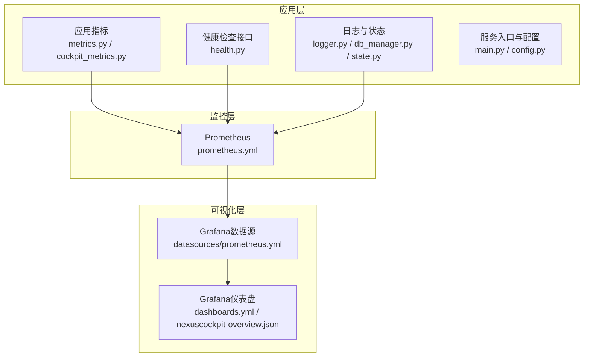
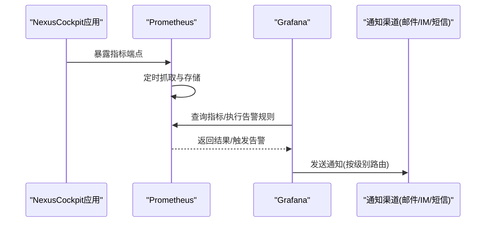
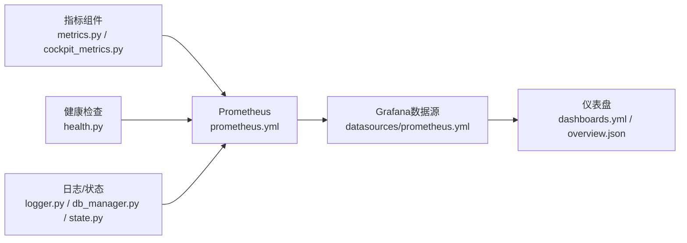

# 告警配置管理

<cite>
**本文引用的文件**   
- [backend_design/nexus/observability/metrics.py](file://backend_design/nexus/observability/metrics.py)
- [backend_design/nexus/observability/cockpit_metrics.py](file://backend_design/nexus/observability/cockpit_metrics.py)
- [backend_design/nexus/api/routes/health.py](file://backend_design/nexus/api/routes/health.py)
- [config/prometheus/prometheus.yml](file://config/prometheus/prometheus.yml)
- [config/grafana/provisioning/datasources/prometheus.yml](file://config/grafana/provisioning/datasources/prometheus.yml)
- [config/grafana/provisioning/dashboards/dashboards.yml](file://config/grafana/provisioning/dashboards/dashboards.yml)
- [config/grafana/provisioning/dashboards/nexuscockpit-overview.json](file://config/grafana/provisioning/dashboards/nexuscockpit-overview.json)
- [backend_design/nexus/core/logger.py](file://backend_design/nexus/core/logger.py)
- [backend_design/nexus/core/db_manager.py](file://backend_design/nexus/core/db_manager.py)
- [backend_design/nexus/models/state.py](file://backend_design/nexus/models/state.py)
- [backend_design/nexus/config.py](file://backend_design/nexus/config.py)
- [backend_design/nexus/main.py](file://backend_design/nexus/main.py)
</cite>

## 目录
1. [简介](#简介)
2. [项目结构](#项目结构)
3. [核心组件](#核心组件)
4. [架构总览](#架构总览)
5. [详细组件分析](#详细组件分析)
6. [依赖关系分析](#依赖关系分析)
7. [性能考虑](#性能考虑)
8. [故障排查指南](#故障排查指南)
9. [结论](#结论)
10. [附录](#附录)

## 简介
本文件面向NexusCockpit系统的告警配置与治理，聚焦以下目标：
- 设计并落地阈值告警、趋势告警与异常检测告警三类规则
- 定义告警级别策略与通知渠道配置
- 提供关键业务指标（API错误率、响应时间、系统资源使用率等）的告警规则示例
- 说明告警抑制、去重与升级机制的配置方法
- 给出告警历史查看与统计分析方法
- 总结告警优化最佳实践与告警风暴解决方案

## 项目结构
NexusCockpit在可观测性方面采用“应用内指标采集 + Prometheus抓取 + Grafana可视化”的组合。与告警相关的核心位置如下：
- 指标暴露与应用层埋点：backend_design/nexus/observability/*
- 健康检查接口：backend_design/nexus/api/routes/health.py
- 监控采集配置：config/prometheus/prometheus.yml
- 可视化与仪表盘：config/grafana/provisioning/*
- 日志与状态：backend_design/nexus/core/logger.py, backend_design/nexus/core/db_manager.py, backend_design/nexus/models/state.py
- 服务启动与中间件集成：backend_design/nexus/main.py, backend_design/nexus/config.py

图表来源
- [backend_design/nexus/observability/metrics.py](file://backend_design/nexus/observability/metrics.py)
- [backend_design/nexus/observability/cockpit_metrics.py](file://backend_design/nexus/observability/cockpit_metrics.py)
- [backend_design/nexus/api/routes/health.py](file://backend_design/nexus/api/routes/health.py)
- [config/prometheus/prometheus.yml](file://config/prometheus/prometheus.yml)
- [config/grafana/provisioning/datasources/prometheus.yml](file://config/grafana/provisioning/datasources/prometheus.yml)
- [config/grafana/provisioning/dashboards/dashboards.yml](file://config/grafana/provisioning/dashboards/dashboards.yml)
- [config/grafana/provisioning/dashboards/nexuscockpit-overview.json](file://config/grafana/provisioning/dashboards/nexuscockpit-overview.json)

章节来源
- [backend_design/nexus/observability/metrics.py](file://backend_design/nexus/observability/metrics.py)
- [backend_design/nexus/observability/cockpit_metrics.py](file://backend_design/nexus/observability/cockpit_metrics.py)
- [backend_design/nexus/api/routes/health.py](file://backend_design/nexus/api/routes/health.py)
- [config/prometheus/prometheus.yml](file://config/prometheus/prometheus.yml)
- [config/grafana/provisioning/datasources/prometheus.yml](file://config/grafana/provisioning/datasources/prometheus.yml)
- [config/grafana/provisioning/dashboards/dashboards.yml](file://config/grafana/provisioning/dashboards/dashboards.yml)
- [config/grafana/provisioning/dashboards/nexuscockpit-overview.json](file://config/grafana/provisioning/dashboards/nexuscockpit-overview.json)
- [backend_design/nexus/core/logger.py](file://backend_design/nexus/core/logger.py)
- [backend_design/nexus/core/db_manager.py](file://backend_design/nexus/core/db_manager.py)
- [backend_design/nexus/models/state.py](file://backend_design/nexus/models/state.py)
- [backend_design/nexus/main.py](file://backend_design/nexus/main.py)
- [backend_design/nexus/config.py](file://backend_design/nexus/config.py)

## 核心组件
- 指标采集与导出
  - 应用内指标定义与计数/计时器/直方图的使用，用于暴露HTTP请求量、错误数、延迟分布等
  - Cockpit专用指标封装，便于按模块或租户维度聚合
- 健康检查端点
  - 暴露健康状态供外部探针与调度器判断服务可用性
- 监控采集配置
  - Prometheus抓取目标与标签配置，确保指标稳定入库
- 可视化与仪表盘
  - Grafana数据源与预置仪表盘，快速定位问题与观察趋势
- 日志与状态
  - 结构化日志输出与数据库连接状态，辅助根因分析与告警上下文补充

章节来源
- [backend_design/nexus/observability/metrics.py](file://backend_design/nexus/observability/metrics.py)
- [backend_design/nexus/observability/cockpit_metrics.py](file://backend_design/nexus/observability/cockpit_metrics.py)
- [backend_design/nexus/api/routes/health.py](file://backend_design/nexus/api/routes/health.py)
- [config/prometheus/prometheus.yml](file://config/prometheus/prometheus.yml)
- [config/grafana/provisioning/datasources/prometheus.yml](file://config/grafana/provisioning/datasources/prometheus.yml)
- [config/grafana/provisioning/dashboards/dashboards.yml](file://config/grafana/provisioning/dashboards/dashboards.yml)
- [config/grafana/provisioning/dashboards/nexuscockpit-overview.json](file://config/grafana/provisioning/dashboards/nexuscockpit-overview.json)
- [backend_design/nexus/core/logger.py](file://backend_design/nexus/core/logger.py)
- [backend_design/nexus/core/db_manager.py](file://backend_design/nexus/core/db_manager.py)
- [backend_design/nexus/models/state.py](file://backend_design/nexus/models/state.py)

## 架构总览
下图展示从指标采集到告警可视化的端到端链路。Prometheus负责拉取与存储指标；Grafana提供查询与可视化；告警规则可在Prometheus或Grafana中配置，结合通知渠道实现分级触达。

图表来源
- [config/prometheus/prometheus.yml](file://config/prometheus/prometheus.yml)
- [config/grafana/provisioning/datasources/prometheus.yml](file://config/grafana/provisioning/datasources/prometheus.yml)
- [config/grafana/provisioning/dashboards/dashboards.yml](file://config/grafana/provisioning/dashboards/dashboards.yml)
- [config/grafana/provisioning/dashboards/nexuscockpit-overview.json](file://config/grafana/provisioning/dashboards/nexuscockpit-overview.json)

## 详细组件分析

### 指标与埋点组件
- 职责
  - 定义并维护应用级指标集合，包括请求计数、错误计数、延迟直方图等
  - 为Cockpit模块提供专用指标封装，支持按模块/租户维度打标签
- 复杂度与性能
  - 计数器与直方图的写入为O(1)，高并发下注意标签基数控制，避免内存膨胀
- 依赖链
  - 被业务逻辑调用以记录事件；被Prometheus抓取暴露
- 优化建议
  - 对高频指标进行采样或合并
  - 限制标签数量与取值范围，定期清理无效标签

章节来源
- [backend_design/nexus/observability/metrics.py](file://backend_design/nexus/observability/metrics.py)
- [backend_design/nexus/observability/cockpit_metrics.py](file://backend_design/nexus/observability/cockpit_metrics.py)

### 健康检查组件
- 职责
  - 提供健康检查接口，返回服务可用性与依赖项状态
- 处理逻辑
  - 读取内部状态与依赖检查结果，组合返回整体健康态
- 与告警的关系
  - 可作为外部探针判定服务存活，也可作为Prometheus规则的数据源之一

章节来源
- [backend_design/nexus/api/routes/health.py](file://backend_design/nexus/api/routes/health.py)

### 监控采集配置组件
- 职责
  - 定义Prometheus抓取目标、间隔、标签映射等
- 关键点
  - 确保指标端点可达、标签一致、抓取失败有重试与超时控制
- 与可视化的衔接
  - 通过Grafana数据源指向同一Prometheus实例，保证查询一致性

章节来源
- [config/prometheus/prometheus.yml](file://config/prometheus/prometheus.yml)
- [config/grafana/provisioning/datasources/prometheus.yml](file://config/grafana/provisioning/datasources/prometheus.yml)

### 可视化与仪表盘组件
- 职责
  - 提供统一数据源与预置仪表盘，帮助快速定位问题
- 关键点
  - 仪表盘JSON包含常用面板与查询模板，便于扩展与复用
- 与告警的联动
  - 在Grafana中可直接基于指标创建告警规则，并配置通知通道

章节来源
- [config/grafana/provisioning/dashboards/dashboards.yml](file://config/grafana/provisioning/dashboards/dashboards.yml)
- [config/grafana/provisioning/dashboards/nexuscockpit-overview.json](file://config/grafana/provisioning/dashboards/nexuscockpit-overview.json)

### 日志与状态组件
- 职责
  - 输出结构化日志，记录关键流程与异常堆栈
  - 维护数据库连接状态与初始化信息
- 与告警的关联
  - 将告警上下文（如请求ID、租户ID、错误码）写入日志，便于回溯

章节来源
- [backend_design/nexus/core/logger.py](file://backend_design/nexus/core/logger.py)
- [backend_design/nexus/core/db_manager.py](file://backend_design/nexus/core/db_manager.py)
- [backend_design/nexus/models/state.py](file://backend_design/nexus/models/state.py)

### 服务入口与配置组件
- 职责
  - 启动应用、加载配置、注册中间件与路由
- 与告警的关系
  - 配置项影响指标粒度、日志级别、健康检查行为等

章节来源
- [backend_design/nexus/main.py](file://backend_design/nexus/main.py)
- [backend_design/nexus/config.py](file://backend_design/nexus/config.py)

## 依赖关系分析
- 组件耦合
  - 指标组件被业务模块广泛引用，需保持低耦合与高内聚
  - 健康检查与状态组件相互独立，便于组合式健康判定
- 外部依赖
  - Prometheus与Grafana为外部系统，需关注版本兼容与网络连通性
- 潜在风险
  - 标签基数过大导致Prometheus内存压力
  - 抓取间隔过短造成负载上升

图表来源
- [backend_design/nexus/observability/metrics.py](file://backend_design/nexus/observability/metrics.py)
- [backend_design/nexus/observability/cockpit_metrics.py](file://backend_design/nexus/observability/cockpit_metrics.py)
- [backend_design/nexus/api/routes/health.py](file://backend_design/nexus/api/routes/health.py)
- [config/prometheus/prometheus.yml](file://config/prometheus/prometheus.yml)
- [config/grafana/provisioning/datasources/prometheus.yml](file://config/grafana/provisioning/datasources/prometheus.yml)
- [config/grafana/provisioning/dashboards/dashboards.yml](file://config/grafana/provisioning/dashboards/dashboards.yml)
- [config/grafana/provisioning/dashboards/nexuscockpit-overview.json](file://config/grafana/provisioning/dashboards/nexuscockpit-overview.json)

## 性能考虑
- 指标粒度与标签基数
  - 控制标签数量与取值范围，避免高基数字段（如用户ID）直接作为标签
- 抓取间隔与保留策略
  - 合理设置抓取间隔与数据保留时长，平衡实时性与存储成本
- 直方图分桶
  - 针对P95/P99延迟选择合适的分桶，减少计算开销
- 批量与异步
  - 对高频上报场景采用批处理或异步落盘，降低主路径阻塞

[本节为通用指导，不直接分析具体文件]

## 故障排查指南
- 指标缺失或异常
  - 检查Prometheus抓取目标是否可达、端口与路径是否正确
  - 确认应用侧指标端点是否正常暴露
- 告警未触发
  - 验证Prometheus/Grafana中的告警规则表达式与时间窗口
  - 检查标签匹配与过滤条件是否符合预期
- 通知失败
  - 校验通知渠道凭据与网络连通性
  - 查看通知队列与重试策略
- 日志与状态辅助
  - 通过结构化日志定位错误上下文
  - 检查数据库连接状态与健康检查返回值

章节来源
- [backend_design/nexus/core/logger.py](file://backend_design/nexus/core/logger.py)
- [backend_design/nexus/core/db_manager.py](file://backend_design/nexus/core/db_manager.py)
- [backend_design/nexus/api/routes/health.py](file://backend_design/nexus/api/routes/health.py)
- [config/prometheus/prometheus.yml](file://config/prometheus/prometheus.yml)
- [config/grafana/provisioning/datasources/prometheus.yml](file://config/grafana/provisioning/datasources/prometheus.yml)

## 结论
通过统一的指标采集、稳定的监控抓取与直观的可视化，NexusCockpit具备完善的告警基础能力。建议在现有基础上完善告警规则体系（阈值、趋势、异常检测），并结合抑制、去重与升级机制提升告警质量与处置效率。

[本节为总结性内容，不直接分析具体文件]

## 附录

### 告警规则设计与配置方法
- 阈值告警
  - 适用场景：错误率、响应时间、资源使用率等超过静态阈值
  - 配置要点：选择合适的时间窗口与聚合函数，避免瞬时抖动误报
- 趋势告警
  - 适用场景：指标持续上升或下降，提前预警潜在风险
  - 配置要点：使用增长率或移动平均，结合业务周期调整参数
- 异常检测告警
  - 适用场景：偏离历史模式或季节性规律的异常波动
  - 配置要点：基于统计模型或机器学习方法，设定置信区间与回退策略

[本节为概念性说明，不直接分析具体文件]

### 告警级别与通知渠道
- 级别划分
  - 提示：轻微异常，无需立即干预
  - 警告：需要关注并在一定时间内处理
  - 严重：影响核心业务，需立即响应
  - 致命：系统不可用或数据丢失风险，需最高优先级处置
- 通知渠道
  - 邮件、即时通讯、短信、电话等
  - 根据级别路由至不同渠道，确保关键告警必达

[本节为概念性说明，不直接分析具体文件]

### 关键业务指标告警规则示例
- API错误率
  - 指标：单位时间内错误请求占比
  - 阈值：例如超过5%持续5分钟
- API响应时间
  - 指标：P95/P99延迟
  - 阈值：例如P99超过2秒持续3分钟
- 系统资源使用率
  - 指标：CPU、内存、磁盘、网络IO
  - 阈值：例如CPU使用率超过85%持续10分钟

[本节为概念性说明，不直接分析具体文件]

### 告警抑制、去重与升级机制
- 抑制
  - 基于标签或环境（如维护窗口、灰度发布）屏蔽非关键告警
- 去重
  - 相同告警在短时间内合并，避免重复通知
- 升级
  - 长时间未恢复自动升级级别，并切换更紧急的通知渠道

[本节为概念性说明，不直接分析具体文件]

### 告警历史查看与统计分析
- 查看方式
  - 通过Grafana仪表盘查看告警状态与历史曲线
  - 在Prometheus中查询告警指标与状态变化
- 分析方法
  - 统计告警频率、持续时间、恢复时间
  - 识别热点指标与频繁误报规则，持续优化

[本节为概念性说明，不直接分析具体文件]

### 告警优化最佳实践与告警风暴解决方案
- 最佳实践
  - 明确指标语义与标签规范
  - 分层告警：系统层、服务层、业务层
  - 定期复盘告警规则，剔除无效与低频告警
- 告警风暴应对
  - 启用抑制与去重
  - 设置静默期与熔断策略
  - 引入根因分析，优先解决上游问题

[本节为概念性说明，不直接分析具体文件]