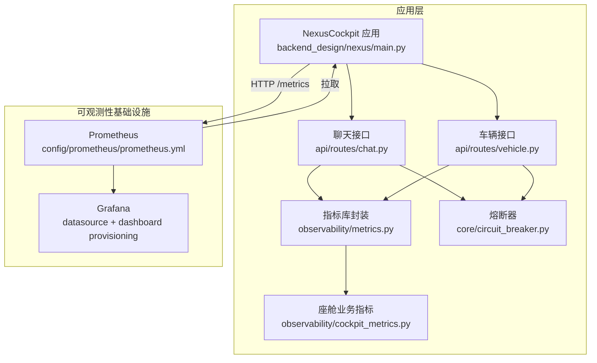
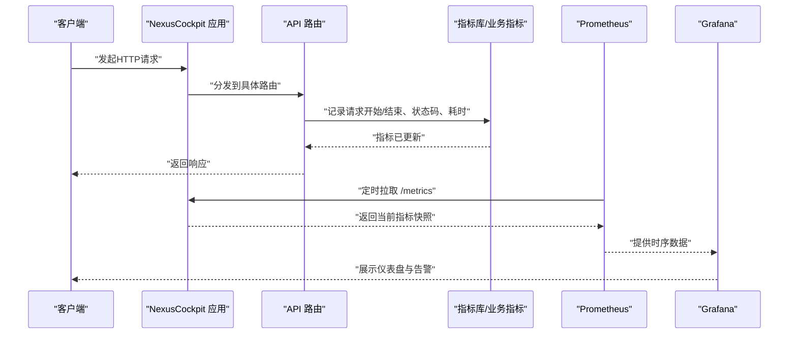
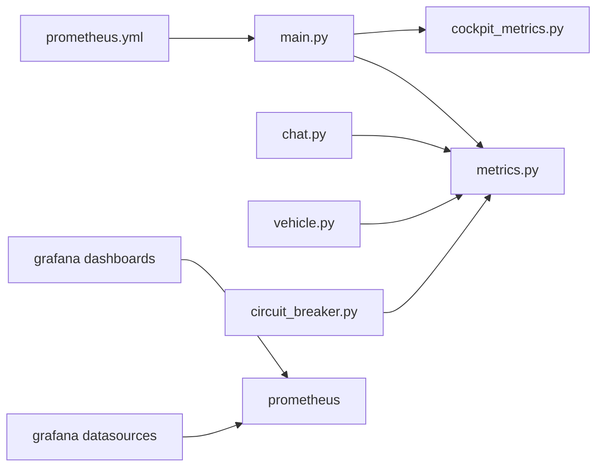

# 指标监控体系

<cite>
**本文引用的文件**   
- [backend_design/nexus/observability/metrics.py](file://backend_design/nexus/observability/metrics.py)
- [backend_design/nexus/observability/cockpit_metrics.py](file://backend_design/nexus/observability/cockpit_metrics.py)
- [backend_design/nexus/api/routes/chat.py](file://backend_design/nexus/api/routes/chat.py)
- [backend_design/nexus/api/routes/vehicle.py](file://backend_design/nexus/api/routes/vehicle.py)
- [backend_design/nexus/core/circuit_breaker.py](file://backend_design/nexus/core/circuit_breaker.py)
- [config/prometheus/prometheus.yml](file://config/prometheus/prometheus.yml)
- [config/grafana/provisioning/datasources/prometheus.yml](file://config/grafana/provisioning/datasources/prometheus.yml)
- [config/grafana/provisioning/dashboards/dashboards.yml](file://config/grafana/provisioning/dashboards/dashboards.yml)
- [config/grafana/provisioning/dashboards/nexuscockpit-overview.json](file://config/grafana/provisioning/dashboards/nexuscockpit-overview.json)
- [backend_design/nexus/main.py](file://backend_design/nexus/main.py)
- [backend_design/nexus/config.py](file://backend_design/nexus/config.py)
- [docker-compose.yml](file://docker-compose.yml)
</cite>

## 目录
1. [简介](#简介)
2. [项目结构](#项目结构)
3. [核心组件](#核心组件)
4. [架构总览](#架构总览)
5. [详细组件分析](#详细组件分析)
6. [依赖关系分析](#依赖关系分析)
7. [性能考量](#性能考量)
8. [故障排查指南](#故障排查指南)
9. [结论](#结论)
10. [附录](#附录)

## 简介
本文件面向NexusCockpit系统的可观测性建设，聚焦Prometheus监控体系的架构设计与配置方法，覆盖自定义指标的采集、存储与查询；定义关键性能指标（API响应时间、错误率、资源使用率等）的收集策略；提供Grafana仪表板配置与可视化方案；给出告警规则的配置方法与最佳实践；并说明如何监控Agent执行状态、车辆控制命令成功率、语音处理延迟等核心业务指标。

## 项目结构
本项目在Python后端中内置了基于Prometheus客户端库的指标埋点能力，并通过配置文件将服务暴露给Prometheus抓取；同时提供Grafana数据源与仪表板的Provisioning配置，便于快速搭建可视化看板。

图表来源
- [backend_design/nexus/main.py](file://backend_design/nexus/main.py)
- [backend_design/nexus/api/routes/chat.py](file://backend_design/nexus/api/routes/chat.py)
- [backend_design/nexus/api/routes/vehicle.py](file://backend_design/nexus/api/routes/vehicle.py)
- [backend_design/nexus/observability/metrics.py](file://backend_design/nexus/observability/metrics.py)
- [backend_design/nexus/observability/cockpit_metrics.py](file://backend_design/nexus/observability/cockpit_metrics.py)
- [backend_design/nexus/core/circuit_breaker.py](file://backend_design/nexus/core/circuit_breaker.py)
- [config/prometheus/prometheus.yml](file://config/prometheus/prometheus.yml)
- [config/grafana/provisioning/datasources/prometheus.yml](file://config/grafana/provisioning/datasources/prometheus.yml)
- [config/grafana/provisioning/dashboards/dashboards.yml](file://config/grafana/provisioning/dashboards/dashboards.yml)
- [config/grafana/provisioning/dashboards/nexuscockpit-overview.json](file://config/grafana/provisioning/dashboards/nexuscockpit-overview.json)

章节来源
- [backend_design/nexus/main.py](file://backend_design/nexus/main.py)
- [backend_design/nexus/config.py](file://backend_design/nexus/config.py)
- [config/prometheus/prometheus.yml](file://config/prometheus/prometheus.yml)
- [config/grafana/provisioning/datasources/prometheus.yml](file://config/grafana/provisioning/datasources/prometheus.yml)
- [config/grafana/provisioning/dashboards/dashboards.yml](file://config/grafana/provisioning/dashboards/dashboards.yml)
- [config/grafana/provisioning/dashboards/nexuscockpit-overview.json](file://config/grafana/provisioning/dashboards/nexuscockpit-overview.json)

## 核心组件
- 指标库封装：统一创建和注册Counter、Histogram、Gauge等类型指标，提供便捷API用于埋点。
- 座舱业务指标：围绕Agent执行、车辆控制、语音处理等场景定义业务级指标。
- 中间件与路由埋点：在API入口与关键路径上记录请求耗时、成功/失败计数、错误分类等。
- Prometheus抓取配置：通过prometheus.yml声明目标端点，自动发现并拉取指标。
- Grafana Provisioning：预置数据源与仪表盘JSON，开箱即用。

章节来源
- [backend_design/nexus/observability/metrics.py](file://backend_design/nexus/observability/metrics.py)
- [backend_design/nexus/observability/cockpit_metrics.py](file://backend_design/nexus/observability/cockpit_metrics.py)
- [backend_design/nexus/api/routes/chat.py](file://backend_design/nexus/api/routes/chat.py)
- [backend_design/nexus/api/routes/vehicle.py](file://backend_design/nexus/api/routes/vehicle.py)
- [config/prometheus/prometheus.yml](file://config/prometheus/prometheus.yml)
- [config/grafana/provisioning/datasources/prometheus.yml](file://config/grafana/provisioning/datasources/prometheus.yml)
- [config/grafana/provisioning/dashboards/dashboards.yml](file://config/grafana/provisioning/dashboards/dashboards.yml)
- [config/grafana/provisioning/dashboards/nexuscockpit-overview.json](file://config/grafana/provisioning/dashboards/nexuscockpit-overview.json)

## 架构总览
下图展示了从请求进入、指标采集到Prometheus抓取与Grafana可视化的端到端流程。

图表来源
- [backend_design/nexus/main.py](file://backend_design/nexus/main.py)
- [backend_design/nexus/api/routes/chat.py](file://backend_design/nexus/api/routes/chat.py)
- [backend_design/nexus/api/routes/vehicle.py](file://backend_design/nexus/api/routes/vehicle.py)
- [backend_design/nexus/observability/metrics.py](file://backend_design/nexus/observability/metrics.py)
- [backend_design/nexus/observability/cockpit_metrics.py](file://backend_design/nexus/observability/cockpit_metrics.py)
- [config/prometheus/prometheus.yml](file://config/prometheus/prometheus.yml)
- [config/grafana/provisioning/datasources/prometheus.yml](file://config/grafana/provisioning/datasources/prometheus.yml)
- [config/grafana/provisioning/dashboards/dashboards.yml](file://config/grafana/provisioning/dashboards/dashboards.yml)
- [config/grafana/provisioning/dashboards/nexuscockpit-overview.json](file://config/grafana/provisioning/dashboards/nexuscockpit-overview.json)

## 详细组件分析

### 指标库封装（通用埋点）
- 职责：封装Prometheus客户端，提供统一的指标创建、标签管理、增量更新与直方图桶配置。
- 设计要点：
  - 计数器（Counter）：用于累计事件次数，如请求总数、错误数、重试次数。
  - 直方图（Histogram）：用于统计耗时分布，支持分位值计算。
  - 度量（Gauge）：用于瞬时值，如并发连接数、队列长度、熔断器状态。
  - 标签维度：按模块、接口、状态码、错误类型等维度拆分，便于聚合与下钻。
- 复杂度与性能：
  - 指标写入为O(1)，对主路径影响极小。
  - 建议合理设置直方图桶上限与数量，避免内存膨胀。

章节来源
- [backend_design/nexus/observability/metrics.py](file://backend_design/nexus/observability/metrics.py)

### 座舱业务指标（Agent/车辆/语音）
- 职责：围绕核心业务链路定义指标，包括：
  - Agent执行状态：运行中、完成、失败、超时等状态计数与时序。
  - 车辆控制命令成功率：按命令类型、结果分类统计成功率与失败原因。
  - 语音处理延迟：ASR/TTS端到端时延、分段时延分布。
- 设计要点：
  - 以业务实体为维度（如会话ID、用户ID、设备ID），结合系统级标签进行多维分析。
  - 采用“开始-结束”模式记录耗时，并在异常分支补充错误分类标签。
- 典型指标示例（命名风格参考）：
  - 计数器：agent_exec_total{status="success|error|timeout"}
  - 直方图：voice_latency_seconds_bucket{stage="asr|tts|pipeline"}
  - 度量：vehicle_cmd_success_rate{cmd_type="open_window|set_ac"}

章节来源
- [backend_design/nexus/observability/cockpit_metrics.py](file://backend_design/nexus/observability/cockpit_metrics.py)

### API层埋点（聊天与车辆接口）
- 聊天接口：
  - 记录请求总量、成功/失败计数、平均/分位响应时间、错误分类。
  - 针对长耗时操作（如LLM调用）增加细分计时指标。
- 车辆接口：
  - 记录命令下发成功率、失败原因、重试次数、超时情况。
  - 结合熔断器状态，输出系统韧性相关指标。
- 中间件与熔断器：
  - 熔断器状态切换次数、触发阈值、恢复次数等。

章节来源
- [backend_design/nexus/api/routes/chat.py](file://backend_design/nexus/api/routes/chat.py)
- [backend_design/nexus/api/routes/vehicle.py](file://backend_design/nexus/api/routes/vehicle.py)
- [backend_design/nexus/core/circuit_breaker.py](file://backend_design/nexus/core/circuit_breaker.py)

### Prometheus抓取与存储
- 抓取配置：
  - 在prometheus.yml中声明NexusCockpit服务的/metrics端点作为目标。
  - 可配置抓取间隔、超时、TLS与认证参数。
- 存储与保留：
  - 默认本地TSDB存储，可通过配置调整保留时间与压缩策略。
- 查询语言：
  - 使用PromQL进行聚合、过滤、窗口计算与分位值提取。

章节来源
- [config/prometheus/prometheus.yml](file://config/prometheus/prometheus.yml)

### Grafana数据源与仪表盘
- 数据源：
  - 通过provisioning/datasources/prometheus.yml自动添加Prometheus数据源。
- 仪表盘：
  - dashboards.yml声明仪表盘清单。
  - nexuscockpit-overview.json提供概览视图，包含关键KPI与趋势。
- 扩展建议：
  - 新增业务仪表盘时，遵循现有Provisioning规范，确保版本化与可重复部署。

章节来源
- [config/grafana/provisioning/datasources/prometheus.yml](file://config/grafana/provisioning/datasources/prometheus.yml)
- [config/grafana/provisioning/dashboards/dashboards.yml](file://config/grafana/provisioning/dashboards/dashboards.yml)
- [config/grafana/provisioning/dashboards/nexuscockpit-overview.json](file://config/grafana/provisioning/dashboards/nexuscockpit-overview.json)

### 容器编排与服务发现
- docker-compose.yml中通常包含Prometheus与Grafana服务，以及NexusCockpit应用服务。
- 建议：
  - 为每个服务分配固定端口，确保/metrics端点可达。
  - 使用网络别名或环境变量传递服务地址，简化配置。

章节来源
- [docker-compose.yml](file://docker-compose.yml)

## 依赖关系分析

图表来源
- [backend_design/nexus/main.py](file://backend_design/nexus/main.py)
- [backend_design/nexus/observability/metrics.py](file://backend_design/nexus/observability/metrics.py)
- [backend_design/nexus/observability/cockpit_metrics.py](file://backend_design/nexus/observability/cockpit_metrics.py)
- [backend_design/nexus/api/routes/chat.py](file://backend_design/nexus/api/routes/chat.py)
- [backend_design/nexus/api/routes/vehicle.py](file://backend_design/nexus/api/routes/vehicle.py)
- [backend_design/nexus/core/circuit_breaker.py](file://backend_design/nexus/core/circuit_breaker.py)
- [config/prometheus/prometheus.yml](file://config/prometheus/prometheus.yml)
- [config/grafana/provisioning/datasources/prometheus.yml](file://config/grafana/provisioning/datasources/prometheus.yml)
- [config/grafana/provisioning/dashboards/dashboards.yml](file://config/grafana/provisioning/dashboards/dashboards.yml)

章节来源
- [backend_design/nexus/main.py](file://backend_design/nexus/main.py)
- [backend_design/nexus/observability/metrics.py](file://backend_design/nexus/observability/metrics.py)
- [backend_design/nexus/observability/cockpit_metrics.py](file://backend_design/nexus/observability/cockpit_metrics.py)
- [backend_design/nexus/api/routes/chat.py](file://backend_design/nexus/api/routes/chat.py)
- [backend_design/nexus/api/routes/vehicle.py](file://backend_design/nexus/api/routes/vehicle.py)
- [backend_design/nexus/core/circuit_breaker.py](file://backend_design/nexus/core/circuit_breaker.py)
- [config/prometheus/prometheus.yml](file://config/prometheus/prometheus.yml)
- [config/grafana/provisioning/datasources/prometheus.yml](file://config/grafana/provisioning/datasources/prometheus.yml)
- [config/grafana/provisioning/dashboards/dashboards.yml](file://config/grafana/provisioning/dashboards/dashboards.yml)

## 性能考量
- 指标粒度与标签基数：
  - 避免高基数字段（如用户ID）直接作为标签，必要时采样或聚合。
- 直方图桶配置：
  - 根据P95/P99目标设置合理的上限与步长，减少内存占用。
- 批量写入与异步上报：
  - 在高QPS场景下，考虑批量化或异步化指标更新，降低锁竞争。
- 抓取频率：
  - 根据业务需求调整Prometheus抓取间隔，平衡实时性与负载。
- 存储容量规划：
  - 评估指标数量、时间分辨率与保留期，预估磁盘与CPU开销。

[本节为通用指导，不直接分析具体文件]

## 故障排查指南
- 无法抓取指标：
  - 检查/metrics端点是否暴露且可达；确认prometheus.yml中的目标地址与端口。
- 指标缺失或维度不全：
  - 核对埋点位置是否在关键路径；确认标签维度是否符合预期。
- 直方图分位值异常：
  - 检查桶配置是否过宽或过窄；验证极端值是否超出上限。
- 熔断器频繁触发：
  - 观察下游依赖健康度与错误率；调整阈值与冷却时间。
- Grafana无数据：
  - 确认数据源连通性；检查Prometheus目标状态与最近抓取日志。

章节来源
- [config/prometheus/prometheus.yml](file://config/prometheus/prometheus.yml)
- [config/grafana/provisioning/datasources/prometheus.yml](file://config/grafana/provisioning/datasources/prometheus.yml)
- [backend_design/nexus/core/circuit_breaker.py](file://backend_design/nexus/core/circuit_breaker.py)

## 结论
通过在应用层统一埋点、在API层细化维度、在基础设施层标准化抓取与可视化，NexusCockpit构建了完整的Prometheus监控体系。配合Grafana仪表盘与告警规则，可实现对系统稳定性与业务健康度的持续洞察。后续建议完善告警策略与演练机制，持续提升排障效率与系统韧性。

[本节为总结性内容，不直接分析具体文件]

## 附录

### 关键性能指标定义与收集策略
- API响应时间：
  - 指标类型：直方图
  - 维度：接口名、方法、状态码
  - 收集点：API路由入口与出口
- 错误率：
  - 指标类型：计数器
  - 维度：接口名、错误分类
  - 收集点：异常分支与重试逻辑
- 资源使用率：
  - 指标类型：度量
  - 维度：进程、线程、外部依赖
  - 收集点：运行时探针或自定义采集器
- Agent执行状态：
  - 指标类型：计数器/度量
  - 维度：任务类型、状态
  - 收集点：执行器生命周期
- 车辆控制命令成功率：
  - 指标类型：计数器/直方图
  - 维度：命令类型、结果、重试次数
  - 收集点：车辆接口与熔断器
- 语音处理延迟：
  - 指标类型：直方图
  - 维度：阶段（ASR/TTS/管道）
  - 收集点：语音引擎前后

章节来源
- [backend_design/nexus/observability/metrics.py](file://backend_design/nexus/observability/metrics.py)
- [backend_design/nexus/observability/cockpit_metrics.py](file://backend_design/nexus/observability/cockpit_metrics.py)
- [backend_design/nexus/api/routes/chat.py](file://backend_design/nexus/api/routes/chat.py)
- [backend_design/nexus/api/routes/vehicle.py](file://backend_design/nexus/api/routes/vehicle.py)

### Grafana仪表板配置与可视化方案
- 数据源：
  - 通过Provisioning自动添加Prometheus数据源，无需手动配置。
- 仪表盘：
  - 使用nexuscockpit-overview.json作为基础模板，按需扩展业务视图。
- 推荐面板：
  - 总体概览：QPS、错误率、P95/P99延迟
  - 业务专题：Agent执行、车辆控制、语音处理
  - 系统健康：熔断器状态、重试与超时

章节来源
- [config/grafana/provisioning/datasources/prometheus.yml](file://config/grafana/provisioning/datasources/prometheus.yml)
- [config/grafana/provisioning/dashboards/dashboards.yml](file://config/grafana/provisioning/dashboards/dashboards.yml)
- [config/grafana/provisioning/dashboards/nexuscockpit-overview.json](file://config/grafana/provisioning/dashboards/nexuscockpit-overview.json)

### 告警规则配置方法与最佳实践
- 告警原则：
  - 关注业务影响而非单纯阈值；区分严重级别与通知渠道。
- 常见规则：
  - API错误率超过阈值持续一段时间
  - P99延迟高于SLA
  - 熔断器频繁触发或长时间处于打开状态
  - 语音处理延迟突增
- 配置建议：
  - 使用Prometheus规则文件集中管理；与CI/CD集成进行变更评审。
  - 为每条规则添加描述、联系人与抑制策略，避免告警风暴。

[本节为通用指导，不直接分析具体文件]