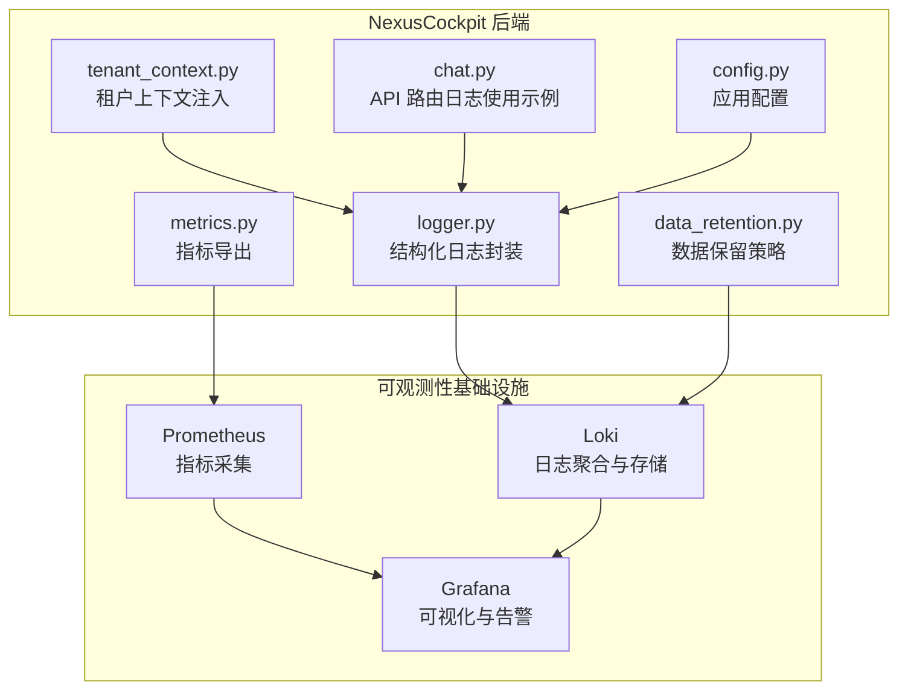
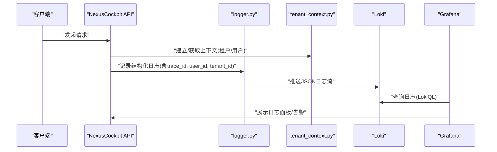
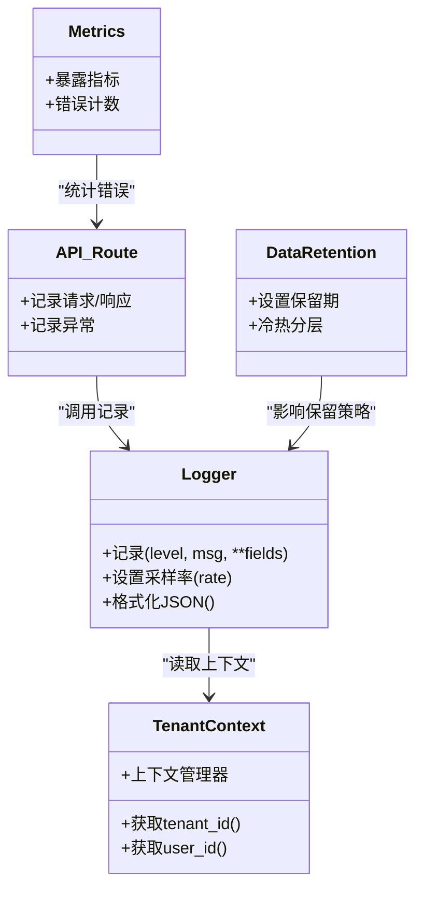

# 日志管理系统

<cite>
**本文引用的文件**   
- [backend_design/nexus/core/logger.py](file://backend_design/nexus/core/logger.py)
- [backend_design/nexus/core/tenant_context.py](file://backend_design/nexus/core/tenant_context.py)
- [backend_design/nexus/api/routes/chat.py](file://backend_design/nexus/api/routes/chat.py)
- [config/loki/loki-config.yml](file://config/loki/loki-config.yml)
- [docker-compose.yml](file://docker-compose.yml)
- [config/grafana/provisioning/datasources/prometheus.yml](file://config/grafana/provisioning/datasources/prometheus.yml)
- [backend_design/nexus/observability/metrics.py](file://backend_design/nexus/observability/metrics.py)
- [backend_design/nexus/observability/data_retention.py](file://backend_design/nexus/observability/data_retention.py)
- [backend_design/nexus/config.py](file://backend_design/nexus/config.py)
</cite>

## 目录
1. [简介](#简介)
2. [项目结构](#项目结构)
3. [核心组件](#核心组件)
4. [架构总览](#架构总览)
5. [详细组件分析](#详细组件分析)
6. [依赖关系分析](#依赖关系分析)
7. [性能考虑](#性能考虑)
8. [故障排查指南](#故障排查指南)
9. [结论](#结论)
10. [附录](#附录)

## 简介
本文件面向 NexusCockpit 系统的日志管理，聚焦于 Loki 日志聚合的部署与配置、结构化日志规范、采集策略、轮转与保留策略、Grafana 集成查询与分析、异常日志自动提取与告警机制，以及调试与排障技巧。文档以仓库现有实现为依据，结合可观测性相关模块进行系统化说明，帮助读者快速落地并高效运维。

## 项目结构
与日志系统直接相关的代码与配置主要分布在以下位置：
- 后端日志核心与上下文：backend_design/nexus/core/logger.py、backend_design/nexus/core/tenant_context.py
- API 路由中的日志使用示例：backend_design/nexus/api/routes/chat.py
- Loki 配置：config/loki/loki-config.yml
- 容器编排（含 Loki 服务）：docker-compose.yml
- Grafana 数据源配置：config/grafana/provisioning/datasources/prometheus.yml
- 指标与数据保留策略：backend_design/nexus/observability/metrics.py、backend_design/nexus/observability/data_retention.py
- 应用配置入口：backend_design/nexus/config.py

图表来源
- [backend_design/nexus/core/logger.py](file://backend_design/nexus/core/logger.py)
- [backend_design/nexus/core/tenant_context.py](file://backend_design/nexus/core/tenant_context.py)
- [backend_design/nexus/api/routes/chat.py](file://backend_design/nexus/api/routes/chat.py)
- [backend_design/nexus/observability/metrics.py](file://backend_design/nexus/observability/metrics.py)
- [backend_design/nexus/observability/data_retention.py](file://backend_design/nexus/observability/data_retention.py)
- [backend_design/nexus/config.py](file://backend_design/nexus/config.py)
- [config/loki/loki-config.yml](file://config/loki/loki-config.yml)
- [config/grafana/provisioning/datasources/prometheus.yml](file://config/grafana/provisioning/datasources/prometheus.yml)
- [docker-compose.yml](file://docker-compose.yml)

章节来源
- [backend_design/nexus/core/logger.py](file://backend_design/nexus/core/logger.py)
- [backend_design/nexus/core/tenant_context.py](file://backend_design/nexus/core/tenant_context.py)
- [backend_design/nexus/api/routes/chat.py](file://backend_design/nexus/api/routes/chat.py)
- [config/loki/loki-config.yml](file://config/loki/loki-config.yml)
- [docker-compose.yml](file://docker-compose.yml)
- [config/grafana/provisioning/datasources/prometheus.yml](file://config/grafana/provisioning/datasources/prometheus.yml)
- [backend_design/nexus/observability/metrics.py](file://backend_design/nexus/observability/metrics.py)
- [backend_design/nexus/observability/data_retention.py](file://backend_design/nexus/observability/data_retention.py)
- [backend_design/nexus/config.py](file://backend_design/nexus/config.py)

## 核心组件
- 结构化日志封装（logger.py）
  - 提供统一的日志记录接口，支持 JSON 格式输出，便于 Loki 解析。
  - 内置请求追踪 ID、用户上下文、租户标识等字段的自动注入。
  - 支持按级别过滤与采样，降低高吞吐场景下的写入开销。
- 租户上下文（tenant_context.py）
  - 在请求生命周期内维护当前租户与用户信息，供日志与鉴权链路复用。
  - 通过中间件或上下文管理器确保上下文隔离与清理。
- API 路由日志使用（chat.py）
  - 在关键路径记录入参、出参摘要、耗时与错误堆栈，便于问题定位。
- 指标与数据保留（metrics.py、data_retention.py）
  - 指标用于 Prometheus/Grafana 监控；数据保留策略指导日志与指标的留存周期。
- 应用配置（config.py）
  - 集中管理日志级别、输出目标、采样率、标签模板等开关与参数。

章节来源
- [backend_design/nexus/core/logger.py](file://backend_design/nexus/core/logger.py)
- [backend_design/nexus/core/tenant_context.py](file://backend_design/nexus/core/tenant_context.py)
- [backend_design/nexus/api/routes/chat.py](file://backend_design/nexus/api/routes/chat.py)
- [backend_design/nexus/observability/metrics.py](file://backend_design/nexus/observability/metrics.py)
- [backend_design/nexus/observability/data_retention.py](file://backend_design/nexus/observability/data_retention.py)
- [backend_design/nexus/config.py](file://backend_design/nexus/config.py)

## 架构总览
NexusCockpit 的后端服务通过统一日志库输出结构化 JSON 日志，由 Loki 收集、索引与存储；Grafana 作为统一可观测性平台，同时接入 Loki（日志）与 Prometheus（指标），实现跨维度关联分析与告警。

图表来源
- [backend_design/nexus/core/logger.py](file://backend_design/nexus/core/logger.py)
- [backend_design/nexus/core/tenant_context.py](file://backend_design/nexus/core/tenant_context.py)
- [config/loki/loki-config.yml](file://config/loki/loki-config.yml)
- [config/grafana/provisioning/datasources/prometheus.yml](file://config/grafana/provisioning/datasources/prometheus.yml)

## 详细组件分析

### 结构化日志设计与字段规范
- 基础字段
  - trace_id：请求级唯一标识，贯穿上下游调用链，便于端到端追踪。
  - level：日志级别（如 DEBUG/INFO/WARN/ERROR）。
  - ts：时间戳（建议 ISO8601 或 Unix 毫秒）。
  - service：服务名（NexusCockpit）。
  - tenant_id：租户标识，用于多租户隔离与检索。
  - user_id：用户标识（可选，匿名时留空）。
  - method/path/status：HTTP 方法、路径、状态码（API 层补充）。
  - duration_ms：请求耗时（毫秒）。
  - msg：人类可读消息。
  - error_code/error_msg：错误码与简要描述（异常时必填）。
  - stack_trace：堆栈信息（仅 ERROR 及以上级别）。
- 设计原则
  - 全量 JSON 输出，避免非结构化文本混入。
  - 敏感信息脱敏（如密码、令牌、手机号等）。
  - 大对象只记录摘要或哈希，必要时落盘并记录引用键。
  - 控制日志体积，避免高频打印长列表或完整响应体。

章节来源
- [backend_design/nexus/core/logger.py](file://backend_design/nexus/core/logger.py)
- [backend_design/nexus/core/tenant_context.py](file://backend_design/nexus/core/tenant_context.py)
- [backend_design/nexus/api/routes/chat.py](file://backend_design/nexus/api/routes/chat.py)

### 日志级别划分与采样策略
- 级别定义
  - DEBUG：开发调试，生产默认关闭。
  - INFO：关键业务事件与操作审计。
  - WARN：潜在风险与降级行为。
  - ERROR：异常与失败路径，需触发告警。
- 采样与限流
  - 对高频 INFO/DEBUG 日志启用采样，降低 Loki 写入压力。
  - 对 ERROR 级别不采样，保证问题可追溯。
  - 基于租户/用户维度的速率限制，防止热点租户打满。

章节来源
- [backend_design/nexus/core/logger.py](file://backend_design/nexus/core/logger.py)
- [backend_design/nexus/config.py](file://backend_design/nexus/config.py)

### 日志轮转与保留策略
- 本地轮转
  - 按大小/时间切分，保留最近 N 份本地副本，便于离线排查。
- 远端保留
  - 通过 data_retention.py 与 Loki 配置协同，设置最小/最大保留期与冷热分层。
  - 结合业务合规要求，设定不同租户/环境的保留时长。

章节来源
- [backend_design/nexus/observability/data_retention.py](file://backend_design/nexus/observability/data_retention.py)
- [config/loki/loki-config.yml](file://config/loki/loki-config.yml)

### 数据采集与传输
- 采集方式
  - 推荐采用 sidecar 或 DaemonSet 模式采集 stdout/stderr 或应用日志目录。
  - 为每条日志附加必要标签（service、tenant_id、user_id、env），提升查询效率。
- 传输优化
  - 批量发送、压缩传输，减少网络开销。
  - 断线重试与背压保护，避免影响主业务。

章节来源
- [docker-compose.yml](file://docker-compose.yml)
- [config/loki/loki-config.yml](file://config/loki/loki-config.yml)

### Grafana 集成与查询分析
- 数据源
  - 在 Grafana 中新增 Loki 数据源，指向 Loki 服务地址。
  - 可同时配置 Prometheus 数据源，实现指标与日志联动。
- 常用查询
  - 按 service、tenant_id、level 过滤。
  - 使用 trace_id 串联多服务日志。
  - 结合指标面板，观察错误率、延迟分布与资源占用。
- 仪表盘与告警
  - 创建“错误日志 TopN”、“慢请求日志”、“租户异常趋势”等看板。
  - 基于 LokiQL 或 PromQL 配置阈值/突变告警，通知至企业 IM/邮件。

章节来源
- [config/grafana/provisioning/datasources/prometheus.yml](file://config/grafana/provisioning/datasources/prometheus.yml)
- [config/loki/loki-config.yml](file://config/loki/loki-config.yml)

### 异常日志自动提取与告警
- 自动提取
  - 捕获未处理异常，记录 ERROR 级别日志，包含错误码、消息与堆栈。
  - 将异常类型与错误码标准化，便于规则化告警。
- 告警规则
  - 错误率突增、特定错误码频发、超时/拒绝访问比例上升。
  - 结合 Prometheus 指标（如 HTTP 错误计数）与 Loki 日志关键字双重校验，降低误报。

章节来源
- [backend_design/nexus/core/logger.py](file://backend_design/nexus/core/logger.py)
- [backend_design/nexus/observability/metrics.py](file://backend_design/nexus/observability/metrics.py)

### 调试技巧与排障清单
- 快速定位
  - 使用 trace_id 在多个服务间串联日志。
  - 按租户/用户维度缩小范围，优先关注热点租户。
- 常见症状
  - 日志缺失：检查采集器权限、路径映射与网络连通性。
  - 查询缓慢：确认标签选择性与索引策略，避免全表扫描。
  - 磁盘增长：核对保留策略与本地轮转上限。
- 验证步骤
  - 构造最小复现用例，开启 DEBUG 级别，观察是否产生预期日志。
  - 在 Grafana 中用简单过滤器逐步加条件，定位问题边界。

章节来源
- [backend_design/nexus/api/routes/chat.py](file://backend_design/nexus/api/routes/chat.py)
- [backend_design/nexus/core/logger.py](file://backend_design/nexus/core/logger.py)

## 依赖关系分析
- 组件耦合
  - logger.py 依赖 tenant_context.py 注入上下文字段。
  - API 路由依赖 logger.py 记录请求/响应与异常。
  - metrics.py 与 data_retention.py 分别对接 Prometheus 与 Loki 的保留策略。
- 外部依赖
  - Loki：日志存储与查询。
  - Prometheus：指标采集。
  - Grafana：可视化与告警。

图表来源
- [backend_design/nexus/core/logger.py](file://backend_design/nexus/core/logger.py)
- [backend_design/nexus/core/tenant_context.py](file://backend_design/nexus/core/tenant_context.py)
- [backend_design/nexus/api/routes/chat.py](file://backend_design/nexus/api/routes/chat.py)
- [backend_design/nexus/observability/metrics.py](file://backend_design/nexus/observability/metrics.py)
- [backend_design/nexus/observability/data_retention.py](file://backend_design/nexus/observability/data_retention.py)

章节来源
- [backend_design/nexus/core/logger.py](file://backend_design/nexus/core/logger.py)
- [backend_design/nexus/core/tenant_context.py](file://backend_design/nexus/core/tenant_context.py)
- [backend_design/nexus/api/routes/chat.py](file://backend_design/nexus/api/routes/chat.py)
- [backend_design/nexus/observability/metrics.py](file://backend_design/nexus/observability/metrics.py)
- [backend_design/nexus/observability/data_retention.py](file://backend_design/nexus/observability/data_retention.py)

## 性能考虑
- 日志体积控制
  - 避免打印大对象；必要时记录摘要或引用键。
  - 对高频路径启用采样，保持 ERROR 全量。
- 标签与索引
  - 合理选择标签键（service、tenant_id、level），避免过多低基数标签导致索引膨胀。
- 传输与存储
  - 批量发送与压缩，减少网络与存储压力。
  - 冷热分层与保留策略平衡成本与可追溯性。
- 监控联动
  - 通过指标面板观察日志写入延迟与丢弃率，及时调优。

[本节为通用指导，无需具体文件来源]

## 故障排查指南
- 日志未到达 Loki
  - 检查采集器运行状态、端口与挂载卷。
  - 验证应用日志输出是否为 JSON 且包含必要标签。
- 查询缓慢或无结果
  - 确认标签选择性与索引策略；避免模糊匹配大范围。
  - 检查时间范围与租户/服务过滤条件。
- 磁盘空间不足
  - 调整本地轮转上限与远端保留期。
  - 清理过期快照与临时文件。
- 告警风暴
  - 合并相似告警，增加冷却时间与抑制规则。
  - 引入双源校验（指标+日志）降低误报。

章节来源
- [config/loki/loki-config.yml](file://config/loki/loki-config.yml)
- [docker-compose.yml](file://docker-compose.yml)
- [backend_design/nexus/observability/data_retention.py](file://backend_design/nexus/observability/data_retention.py)

## 结论
通过统一的日志封装、严格的字段规范、合理的轮转与保留策略，以及 Grafana/Loki/Prometheus 的协同，NexusCockpit 实现了高可用、可观测、可治理的日志体系。建议在上线前完成最小化验证（采集、查询、告警），并在迭代中持续优化标签与保留策略，平衡成本与可追溯性。

[本节为总结，无需具体文件来源]

## 附录
- 部署要点
  - 使用 docker-compose.yml 启动 Loki 与 Grafana，确保网络互通与持久化卷挂载。
  - 在 Grafana 中预置数据源与仪表盘，缩短排障时间。
- 最佳实践
  - 所有服务统一日志格式与标签命名。
  - 建立“错误码字典”，统一异常上报口径。
  - 定期复盘告警规则，剔除无效告警，完善抑制与升级策略。

章节来源
- [docker-compose.yml](file://docker-compose.yml)
- [config/grafana/provisioning/datasources/prometheus.yml](file://config/grafana/provisioning/datasources/prometheus.yml)