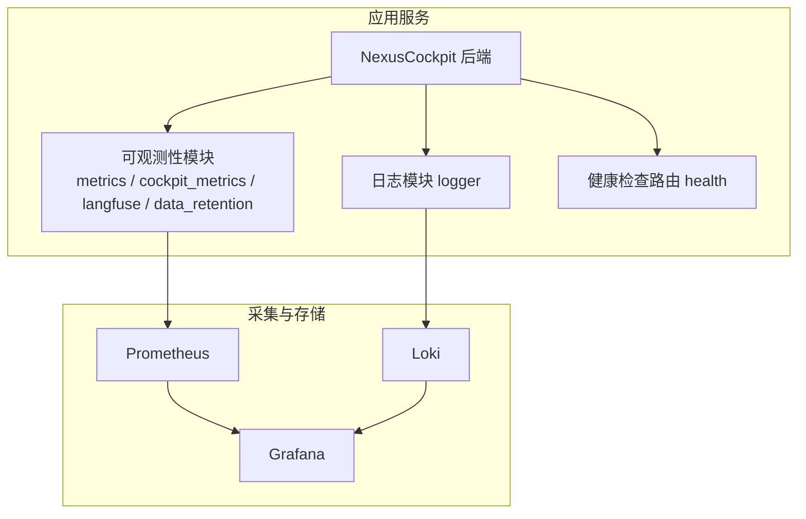
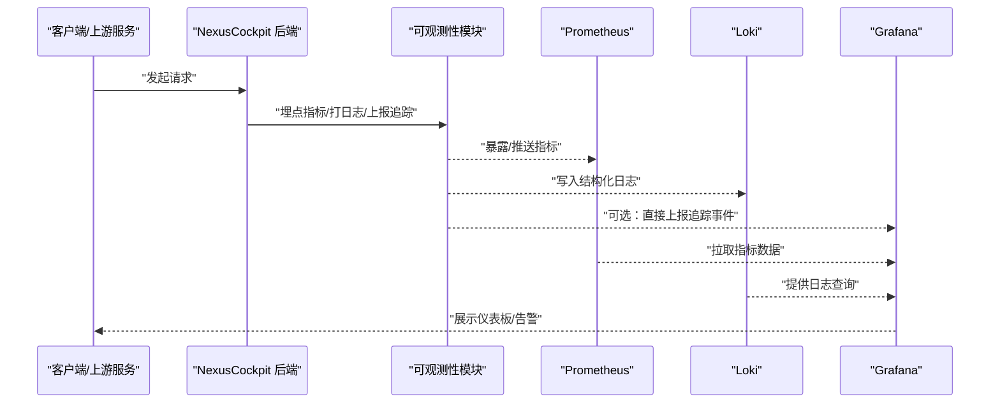
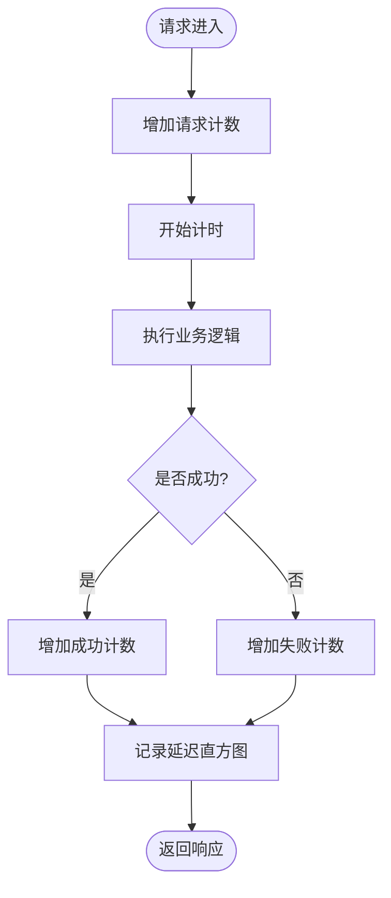
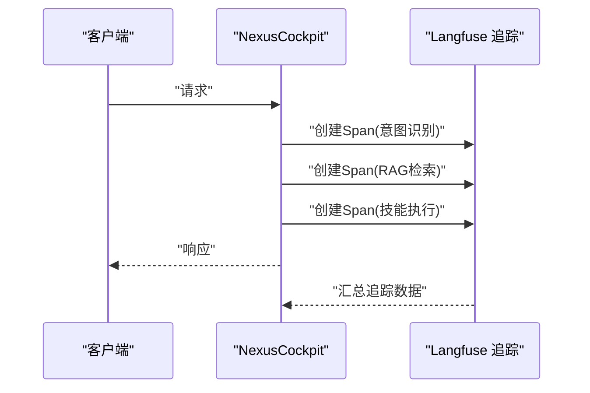
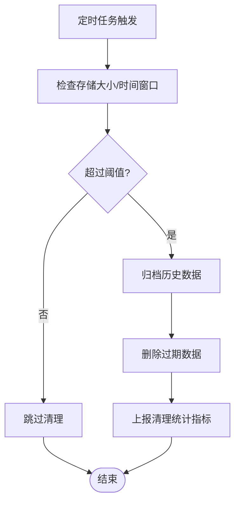
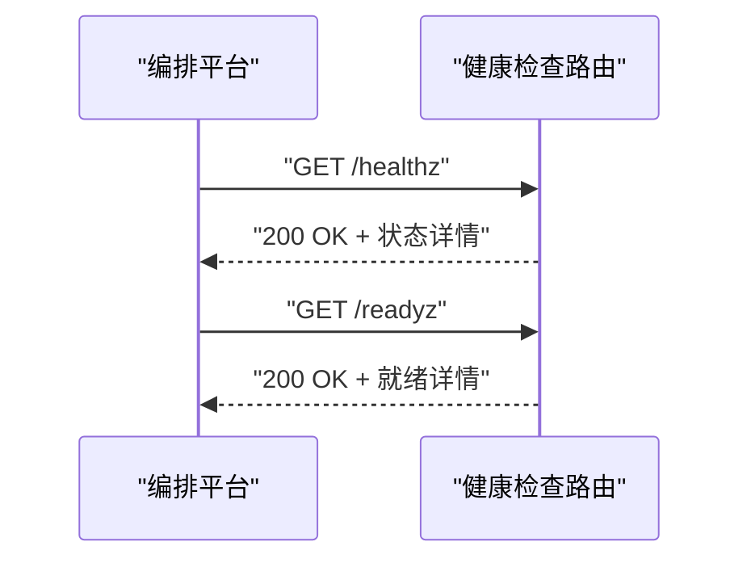
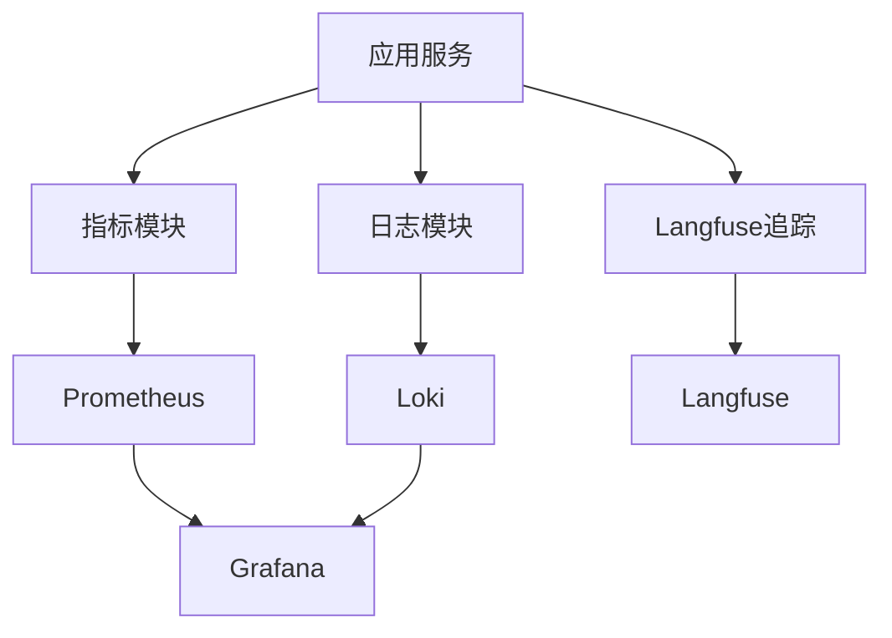

# 监控和可观测性

<cite>
**本文引用的文件**   
- [backend_design/nexus/observability/__init__.py](file://backend_design/nexus/observability/__init__.py)
- [backend_design/nexus/observability/metrics.py](file://backend_design/nexus/observability/metrics.py)
- [backend_design/nexus/observability/cockpit_metrics.py](file://backend_design/nexus/observability/cockpit_metrics.py)
- [backend_design/nexus/observability/langfuse.py](file://backend_design/nexus/observability/langfuse.py)
- [backend_design/nexus/observability/data_retention.py](file://backend_design/nexus/observability/data_retention.py)
- [backend_design/nexus/core/logger.py](file://backend_design/nexus/core/logger.py)
- [backend_design/nexus/api/routes/health.py](file://backend_design/nexus/api/routes/health.py)
- [config/prometheus/prometheus.yml](file://config/prometheus/prometheus.yml)
- [config/grafana/provisioning/datasources/prometheus.yml](file://config/grafana/provisioning/datasources/prometheus.yml)
- [config/grafana/provisioning/dashboards/dashboards.yml](file://config/grafana/provisioning/dashboards/dashboards.yml)
- [config/grafana/provisioning/dashboards/nexuscockpit-overview.json](file://config/grafana/provisioning/dashboards/nexuscockpit-overview.json)
- [config/loki/loki-config.yml](file://config/loki/loki-config.yml)
- [docker-compose.yml](file://docker-compose.yml)
- [backend_design/scripts/test_metrics.py](file://backend_design/scripts/test_metrics.py)
</cite>

## 目录
1. [简介](#简介)
2. [项目结构](#项目结构)
3. [核心组件](#核心组件)
4. [架构总览](#架构总览)
5. [详细组件分析](#详细组件分析)
6. [依赖关系分析](#依赖关系分析)
7. [性能考量](#性能考量)
8. [故障排查指南](#故障排查指南)
9. [结论](#结论)
10. [附录](#附录)

## 简介
本文件面向NexusCockpit系统的监控与可观测性建设，覆盖指标收集、日志管理、链路追踪与告警配置。重点说明Prometheus监控体系、Grafana可视化仪表板、Loki日志聚合的集成与使用；给出关键性能指标的监控方案、异常检测机制与故障诊断工具；并提供监控数据分析方法与运维最佳实践，以及系统健康检查与容量规划指导。

## 项目结构
与监控和可观测性相关的代码与配置主要分布在以下位置：
- 后端指标与可观测性模块：backend_design/nexus/observability
- 日志与中间件：backend_design/nexus/core/logger.py
- 健康检查接口：backend_design/nexus/api/routes/health.py
- Prometheus/Grafana/Loki配置：config/prometheus, config/grafana, config/loki
- 容器编排与服务发现：docker-compose.yml
- 指标测试脚本：backend_design/scripts/test_metrics.py

图表来源
- [backend_design/nexus/observability/metrics.py](file://backend_design/nexus/observability/metrics.py)
- [backend_design/nexus/observability/cockpit_metrics.py](file://backend_design/nexus/observability/cockpit_metrics.py)
- [backend_design/nexus/observability/langfuse.py](file://backend_design/nexus/observability/langfuse.py)
- [backend_design/nexus/observability/data_retention.py](file://backend_design/nexus/observability/data_retention.py)
- [backend_design/nexus/core/logger.py](file://backend_design/nexus/core/logger.py)
- [backend_design/nexus/api/routes/health.py](file://backend_design/nexus/api/routes/health.py)
- [config/prometheus/prometheus.yml](file://config/prometheus/prometheus.yml)
- [config/grafana/provisioning/datasources/prometheus.yml](file://config/grafana/provisioning/datasources/prometheus.yml)
- [config/grafana/provisioning/dashboards/dashboards.yml](file://config/grafana/provisioning/dashboards/dashboards.yml)
- [config/grafana/provisioning/dashboards/nexuscockpit-overview.json](file://config/grafana/provisioning/dashboards/nexuscockpit-overview.json)
- [config/loki/loki-config.yml](file://config/loki/loki-config.yml)

章节来源
- [backend_design/nexus/observability/metrics.py](file://backend_design/nexus/observability/metrics.py)
- [backend_design/nexus/observability/cockpit_metrics.py](file://backend_design/nexus/observability/cockpit_metrics.py)
- [backend_design/nexus/observability/langfuse.py](file://backend_design/nexus/observability/langfuse.py)
- [backend_design/nexus/observability/data_retention.py](file://backend_design/nexus/observability/data_retention.py)
- [backend_design/nexus/core/logger.py](file://backend_design/nexus/core/logger.py)
- [backend_design/nexus/api/routes/health.py](file://backend_design/nexus/api/routes/health.py)
- [config/prometheus/prometheus.yml](file://config/prometheus/prometheus.yml)
- [config/grafana/provisioning/datasources/prometheus.yml](file://config/grafana/provisioning/datasources/prometheus.yml)
- [config/grafana/provisioning/dashboards/dashboards.yml](file://config/grafana/provisioning/dashboards/dashboards.yml)
- [config/grafana/provisioning/dashboards/nexuscockpit-overview.json](file://config/grafana/provisioning/dashboards/nexuscockpit-overview.json)
- [config/loki/loki-config.yml](file://config/loki/loki-config.yml)

## 核心组件
- 指标定义与采集
  - 通用指标封装：提供计数器、直方图、计时器等常用指标类型与统一标签策略，便于跨模块复用。
  - 业务域指标：围绕对话会话、技能执行、意图识别、RAG检索等关键路径暴露细粒度指标（如请求量、延迟分布、错误率、缓存命中率等）。
- 日志系统
  - 结构化日志：为各模块输出包含上下文（租户、会话ID、请求ID）的结构化日志，便于Loki聚合与查询。
  - 日志分级与采样：按级别过滤与采样控制，降低高吞吐场景下的开销。
- 链路追踪
  - 基于Langfuse的LLM调用链追踪：记录提示词、模型调用、Token用量、耗时与结果摘要，辅助定位大模型侧问题。
- 数据保留与清理
  - 指标与日志数据的生命周期管理：支持按时间窗口与大小阈值进行归档与清理，避免存储膨胀。
- 健康检查
  - 提供HTTP健康检查端点，返回服务就绪状态、依赖组件可达性与资源水位，供负载均衡与编排平台使用。

章节来源
- [backend_design/nexus/observability/metrics.py](file://backend_design/nexus/observability/metrics.py)
- [backend_design/nexus/observability/cockpit_metrics.py](file://backend_design/nexus/observability/cockpit_metrics.py)
- [backend_design/nexus/observability/langfuse.py](file://backend_design/nexus/observability/langfuse.py)
- [backend_design/nexus/observability/data_retention.py](file://backend_design/nexus/observability/data_retention.py)
- [backend_design/nexus/core/logger.py](file://backend_design/nexus/core/logger.py)
- [backend_design/nexus/api/routes/health.py](file://backend_design/nexus/api/routes/health.py)

## 架构总览
下图展示了从应用层到采集、存储与可视化的整体链路：

图表来源
- [backend_design/nexus/observability/metrics.py](file://backend_design/nexus/observability/metrics.py)
- [backend_design/nexus/observability/cockpit_metrics.py](file://backend_design/nexus/observability/cockpit_metrics.py)
- [backend_design/nexus/observability/langfuse.py](file://backend_design/nexus/observability/langfuse.py)
- [backend_design/nexus/core/logger.py](file://backend_design/nexus/core/logger.py)
- [config/prometheus/prometheus.yml](file://config/prometheus/prometheus.yml)
- [config/grafana/provisioning/datasources/prometheus.yml](file://config/grafana/provisioning/datasources/prometheus.yml)
- [config/grafana/provisioning/dashboards/dashboards.yml](file://config/grafana/provisioning/dashboards/dashboards.yml)
- [config/grafana/provisioning/dashboards/nexuscockpit-overview.json](file://config/grafana/provisioning/dashboards/nexuscockpit-overview.json)
- [config/loki/loki-config.yml](file://config/loki/loki-config.yml)

## 详细组件分析

### 指标体系与采集
- 指标分层
  - 基础资源：CPU、内存、磁盘、网络等（由宿主或容器运行时提供）。
  - 进程级：JVM/Python运行时指标（GC、线程、句柄等）。
  - 应用级：QPS、P95/P99延迟、错误率、饱和度（队列长度、连接池占用）。
  - 业务级：对话轮次、技能调用成功率、RAG检索命中率、向量库查询耗时、TTS/ASR处理时长。
- 指标实现要点
  - 统一的标签规范：service、env、tenant、route、method、status_code等。
  - 直方图分桶策略：针对延迟类指标设置合理分桶，避免基数爆炸。
  - 增量计数与速率计算：在PromQL中通过rate()/irate()计算每秒变化。
- 暴露方式
  - HTTP /metrics端点：Prometheus定期抓取。
  - 可选Pushgateway：用于批处理任务上报一次性指标。

图表来源
- [backend_design/nexus/observability/metrics.py](file://backend_design/nexus/observability/metrics.py)
- [backend_design/nexus/observability/cockpit_metrics.py](file://backend_design/nexus/observability/cockpit_metrics.py)

章节来源
- [backend_design/nexus/observability/metrics.py](file://backend_design/nexus/observability/metrics.py)
- [backend_design/nexus/observability/cockpit_metrics.py](file://backend_design/nexus/observability/cockpit_metrics.py)
- [backend_design/scripts/test_metrics.py](file://backend_design/scripts/test_metrics.py)

### 日志管理与Loki集成
- 日志规范
  - 结构化字段：timestamp、level、service、tenant、request_id、session_id、message等。
  - 敏感信息脱敏：对密码、密钥、个人信息等进行掩码处理。
- 采集与索引
  - 将标准输出日志以JSON格式输出，由Filebeat/Fluent Bit等采集器推送到Loki。
  - 利用Loki的labels进行高效过滤（service、env、tenant等）。
- 查询与分析
  - 常用查询：按错误级别筛选、按租户隔离、按会话ID串联全链路日志。
  - 关联指标：在Grafana中将日志面板与指标面板联动，快速定位根因。

图表来源
- [backend_design/nexus/core/logger.py](file://backend_design/nexus/core/logger.py)
- [config/loki/loki-config.yml](file://config/loki/loki-config.yml)

章节来源
- [backend_design/nexus/core/logger.py](file://backend_design/nexus/core/logger.py)
- [config/loki/loki-config.yml](file://config/loki/loki-config.yml)

### 链路追踪（Langfuse）
- 追踪范围
  - LLM调用：提示词版本、输入输出摘要、Token用量、延迟、重试次数。
  - 业务链路：意图识别、RAG检索、技能执行、车辆控制等关键步骤。
- 集成方式
  - 在关键函数入口/出口注入追踪上下文，自动关联请求ID与会话ID。
  - 将追踪事件上报至Langfuse，结合Grafana或Langfuse控制台进行可视化。

图表来源
- [backend_design/nexus/observability/langfuse.py](file://backend_design/nexus/observability/langfuse.py)

章节来源
- [backend_design/nexus/observability/langfuse.py](file://backend_design/nexus/observability/langfuse.py)

### 数据保留与清理
- 策略
  - 指标：按时间窗口（如30天）与存储空间阈值进行滚动清理。
  - 日志：按租户与级别划分保留期，过期数据归档或删除。
- 自动化
  - 定时任务触发清理流程，记录清理统计指标，便于审计与回溯。

图表来源
- [backend_design/nexus/observability/data_retention.py](file://backend_design/nexus/observability/data_retention.py)

章节来源
- [backend_design/nexus/observability/data_retention.py](file://backend_design/nexus/observability/data_retention.py)

### 健康检查与就绪探针
- 健康检查端点
  - 返回服务状态、依赖组件（数据库、缓存、外部API）可达性、资源水位。
  - 支持liveness与readiness两种语义，分别用于重启与流量摘除。
- 编排集成
  - Kubernetes/容器编排平台通过HTTP探针周期性探测，保障自愈与滚动升级安全。

图表来源
- [backend_design/nexus/api/routes/health.py](file://backend_design/nexus/api/routes/health.py)

章节来源
- [backend_design/nexus/api/routes/health.py](file://backend_design/nexus/api/routes/health.py)

## 依赖关系分析
- 组件耦合
  - 可观测性模块与业务模块松耦合：通过装饰器/中间件注入指标与日志，避免侵入式修改。
  - 日志与追踪独立于指标采集，降低相互影响。
- 外部依赖
  - Prometheus：抓取指标，需正确配置scrape_configs与目标端口。
  - Loki：接收结构化日志，需配置labels与retention策略。
  - Langfuse：上报追踪事件，需配置鉴权与采样率。
- 潜在风险
  - 标签基数过大导致Prometheus/Loki性能下降。
  - 高频日志写入造成IO瓶颈，建议开启采样与异步写入。
  - 追踪事件过多导致外部服务限流，需调整采样与批量上报。

图表来源
- [backend_design/nexus/observability/metrics.py](file://backend_design/nexus/observability/metrics.py)
- [backend_design/nexus/observability/cockpit_metrics.py](file://backend_design/nexus/observability/cockpit_metrics.py)
- [backend_design/nexus/observability/langfuse.py](file://backend_design/nexus/observability/langfuse.py)
- [backend_design/nexus/core/logger.py](file://backend_design/nexus/core/logger.py)
- [config/prometheus/prometheus.yml](file://config/prometheus/prometheus.yml)
- [config/grafana/provisioning/datasources/prometheus.yml](file://config/grafana/provisioning/datasources/prometheus.yml)
- [config/grafana/provisioning/dashboards/dashboards.yml](file://config/grafana/provisioning/dashboards/dashboards.yml)
- [config/grafana/provisioning/dashboards/nexuscockpit-overview.json](file://config/grafana/provisioning/dashboards/nexuscockpit-overview.json)
- [config/loki/loki-config.yml](file://config/loki/loki-config.yml)

章节来源
- [docker-compose.yml](file://docker-compose.yml)
- [config/prometheus/prometheus.yml](file://config/prometheus/prometheus.yml)
- [config/grafana/provisioning/datasources/prometheus.yml](file://config/grafana/provisioning/datasources/prometheus.yml)
- [config/grafana/provisioning/dashboards/dashboards.yml](file://config/grafana/provisioning/dashboards/dashboards.yml)
- [config/grafana/provisioning/dashboards/nexuscockpit-overview.json](file://config/grafana/provisioning/dashboards/nexuscockpit-overview.json)
- [config/loki/loki-config.yml](file://config/loki/loki-config.yml)

## 性能考量
- 指标采集
  - 控制标签基数，避免高基数字段（如用户ID、随机字符串）作为标签。
  - 直方图分桶根据业务延迟分布调优，减少不必要的桶数量。
- 日志写入
  - 采用异步写入与批量提交，降低同步阻塞。
  - 启用日志采样，在高并发场景下仅保留代表性样本。
- 追踪上报
  - 设置合理的采样率，避免全量上报造成外部服务压力。
  - 合并小Span，减少网络往返。
- 存储与查询
  - 为Loki设置合适的索引与分片策略，提升查询性能。
  - 为Prometheus设置合理的保留期与压缩策略，控制磁盘增长。

[本节为通用性能建议，不直接分析具体文件]

## 故障排查指南
- 常见问题
  - 指标缺失：检查Prometheus抓取配置与目标端口，确认应用已暴露/metrics。
  - 日志丢失：确认采集器运行正常、Loki可用且labels匹配。
  - 追踪断链：检查Langfuse鉴权、网络连通与采样配置。
- 诊断步骤
  - 使用Grafana仪表板观察错误率与延迟突增。
  - 在Loki中按request_id或session_id串联相关日志。
  - 在Langfuse中查看具体Span耗时与输入输出摘要。
- 恢复措施
  - 临时扩容或降级非关键功能，优先保障核心链路。
  - 调整采样与保留策略，缓解存储压力。
  - 重启不健康实例，配合健康检查端点进行流量切换。

章节来源
- [backend_design/nexus/api/routes/health.py](file://backend_design/nexus/api/routes/health.py)
- [config/prometheus/prometheus.yml](file://config/prometheus/prometheus.yml)
- [config/grafana/provisioning/datasources/prometheus.yml](file://config/grafana/provisioning/datasources/prometheus.yml)
- [config/grafana/provisioning/dashboards/dashboards.yml](file://config/grafana/provisioning/dashboards/dashboards.yml)
- [config/grafana/provisioning/dashboards/nexuscockpit-overview.json](file://config/grafana/provisioning/dashboards/nexuscockpit-overview.json)
- [config/loki/loki-config.yml](file://config/loki/loki-config.yml)

## 结论
通过统一的指标、日志与追踪体系，NexusCockpit实现了端到端的可观测性。Prometheus+Grafana提供实时指标与可视化，Loki支撑结构化日志聚合与快速定位，Langfuse增强LLM调用链的可追溯能力。配合健康检查与数据保留策略，系统在稳定性、可维护性与可扩展性方面具备良好基础。后续应持续优化标签与采样策略，完善告警规则与演练预案，进一步提升故障发现与恢复效率。

[本节为总结性内容，不直接分析具体文件]

## 附录
- 关键性能指标建议
  - 请求量与错误率：rate(http_requests_total{status=~"5.."}[5m]) / rate(http_requests_total[5m])
  - 延迟分布：histogram_quantile(0.95, rate(http_request_duration_seconds_bucket[5m]))
  - 饱和度：队列长度、连接池占用、线程数
  - 业务指标：意图识别成功率、RAG检索命中率、技能执行耗时
- 告警规则建议
  - 错误率超过阈值持续N分钟
  - P99延迟超过SLA
  - 资源使用率接近上限（CPU/内存/磁盘）
  - 依赖组件不可达（数据库、缓存、外部API）
- 容量规划指导
  - 根据峰值QPS与平均延迟估算资源需求。
  - 评估日志与指标增长趋势，预留存储与计算余量。
  - 设计多副本与水平扩展策略，确保弹性伸缩。

[本节为通用指导，不直接分析具体文件]