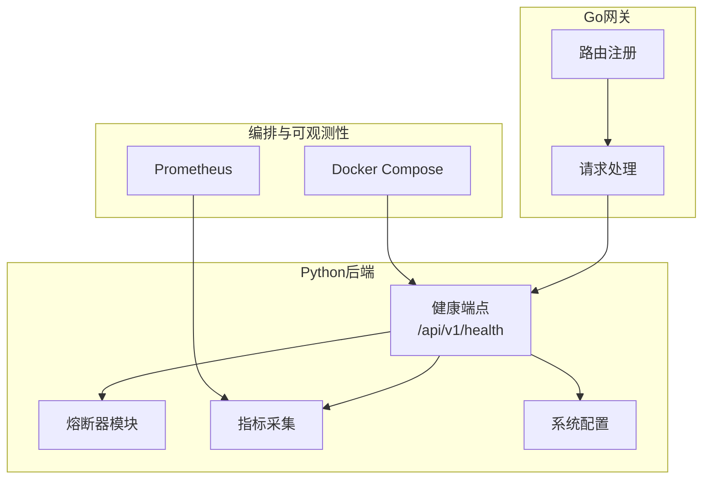
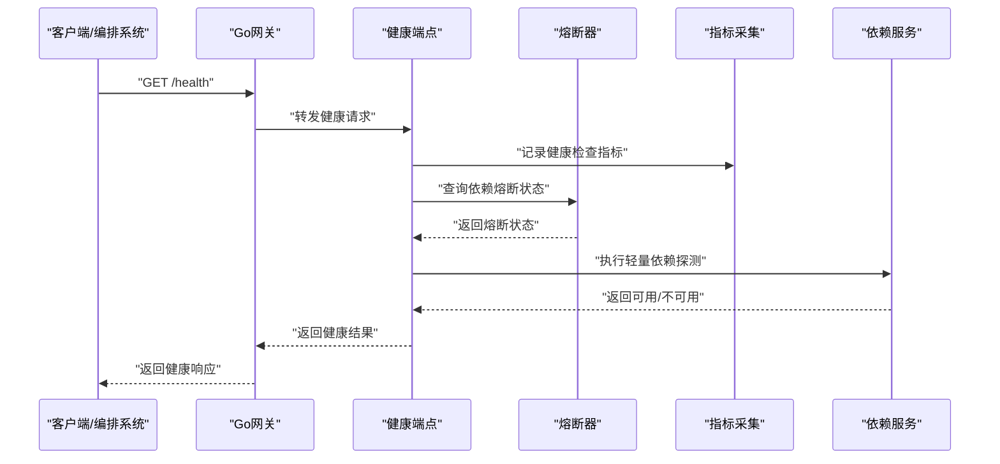
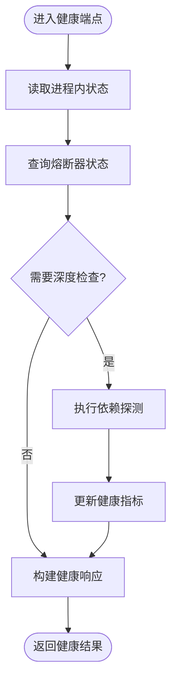
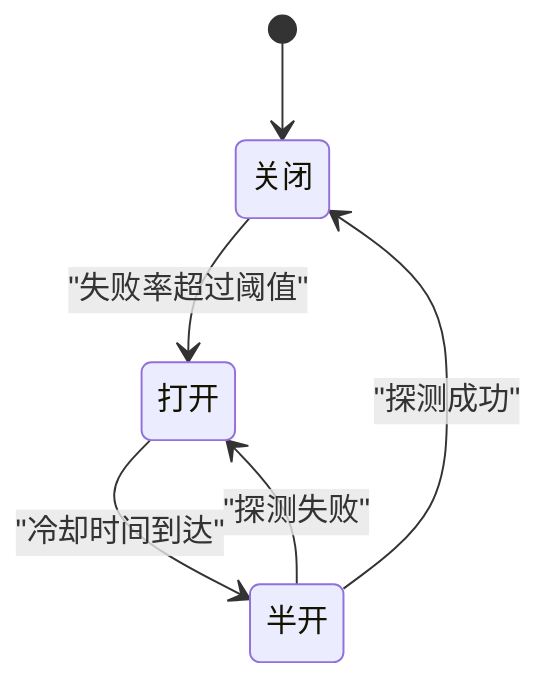
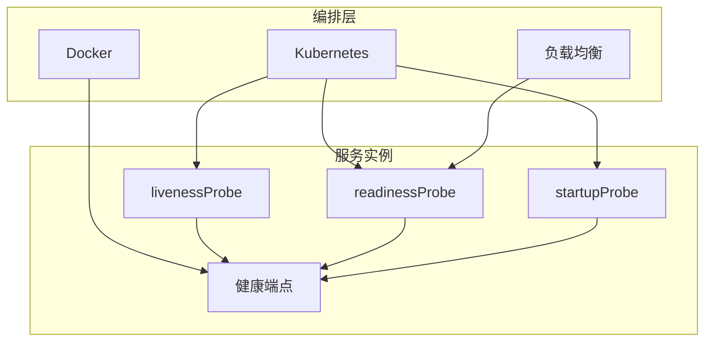
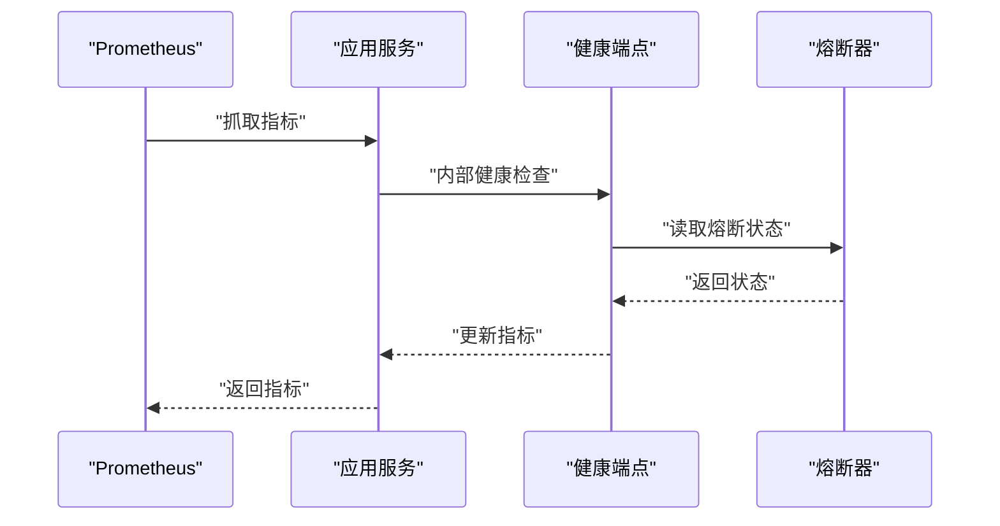
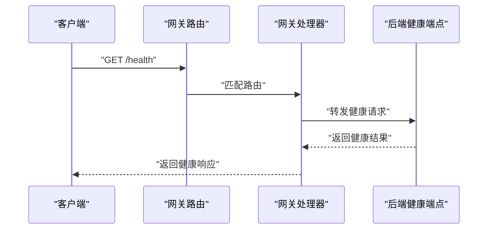
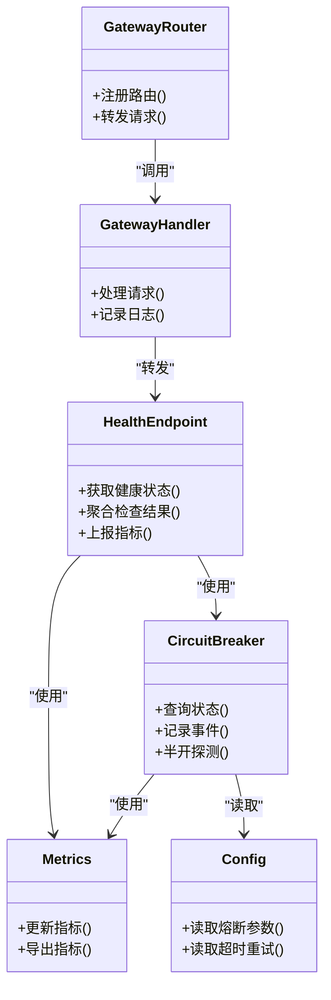

# 健康检查

<cite>
**本文引用的文件**   
- [backend_design/nexus/api/routes/health.py](file://backend_design/nexus/api/routes/health.py)
- [backend_design/nexus/core/circuit_breaker.py](file://backend_design/nexus/core/circuit_breaker.py)
- [backend_design/nexus/main.py](file://backend_design/nexus/main.py)
- [backend_design/nexus_gate/internal/handlers/handlers.go](file://backend_design/nexus_gate/internal/handlers/handlers.go)
- [backend_design/nexus_gate/internal/router/router.go](file://backend_design/nexus_gate/internal/router/router.go)
- [docker-compose.yml](file://docker-compose.yml)
- [config/prometheus/prometheus.yml](file://config/prometheus/prometheus.yml)
- [backend_design/nexus/observability/metrics.py](file://backend_design/nexus/observability/metrics.py)
- [backend_design/nexus/config.py](file://backend_design/nexus/config.py)
</cite>

## 目录
1. [简介](#简介)
2. [项目结构](#项目结构)
3. [核心组件](#核心组件)
4. [架构总览](#架构总览)
5. [详细组件分析](#详细组件分析)
6. [依赖关系分析](#依赖关系分析)
7. [性能考量](#性能考量)
8. [故障排查指南](#故障排查指南)
9. [结论](#结论)
10. [附录](#附录)

## 简介
本文件面向NexusCockpit系统的健康检查与容错能力，覆盖以下方面：
- HTTP健康端点与依赖服务检查
- 资源可用性验证（数据库、缓存、向量库、外部API等）
- 熔断器配置与管理（策略、降级、自动恢复）
- 容器健康检查（Docker、Kubernetes探针、负载均衡）
- 故障自愈策略（自动重启、实例替换、流量切换）

目标读者包括运维工程师、SRE、后端开发与平台工程团队。

## 项目结构
与健康检查相关的代码主要分布在以下位置：
- Python后端（FastAPI）：提供HTTP健康端点、指标暴露、熔断器实现
- Go网关：提供反向代理与可能的健康路由转发
- 编排与可观测性：Docker Compose、Prometheus抓取配置
- 配置中心：系统级配置项（如熔断阈值、超时、重试等）

图表来源
- [backend_design/nexus/api/routes/health.py](file://backend_design/nexus/api/routes/health.py)
- [backend_design/nexus/core/circuit_breaker.py](file://backend_design/nexus/core/circuit_breaker.py)
- [backend_design/nexus/observability/metrics.py](file://backend_design/nexus/observability/metrics.py)
- [backend_design/nexus/config.py](file://backend_design/nexus/config.py)
- [backend_design/nexus_gate/internal/router/router.go](file://backend_design/nexus_gate/internal/router/router.go)
- [backend_design/nexus_gate/internal/handlers/handlers.go](file://backend_design/nexus_gate/internal/handlers/handlers.go)
- [docker-compose.yml](file://docker-compose.yml)
- [config/prometheus/prometheus.yml](file://config/prometheus/prometheus.yml)

章节来源
- [backend_design/nexus/api/routes/health.py](file://backend_design/nexus/api/routes/health.py)
- [backend_design/nexus/core/circuit_breaker.py](file://backend_design/nexus/core/circuit_breaker.py)
- [backend_design/nexus/observability/metrics.py](file://backend_design/nexus/observability/metrics.py)
- [backend_design/nexus/config.py](file://backend_design/nexus/config.py)
- [backend_design/nexus_gate/internal/router/router.go](file://backend_design/nexus_gate/internal/router/router.go)
- [backend_design/nexus_gate/internal/handlers/handlers.go](file://backend_design/nexus_gate/internal/handlers/handlers.go)
- [docker-compose.yml](file://docker-compose.yml)
- [config/prometheus/prometheus.yml](file://config/prometheus/prometheus.yml)

## 核心组件
- 健康端点：对外暴露统一的健康检查接口，聚合各子系统状态，返回结构化结果。
- 熔断器：对关键依赖调用进行失败率与延迟监控，达到阈值后快速失败并触发降级。
- 指标采集：暴露运行时指标，便于Prometheus抓取与告警。
- 配置管理：集中管理熔断参数、超时、重试、探针间隔等。
- 网关路由：将健康请求转发至后端或本地健康检查，确保入口层一致性。

章节来源
- [backend_design/nexus/api/routes/health.py](file://backend_design/nexus/api/routes/health.py)
- [backend_design/nexus/core/circuit_breaker.py](file://backend_design/nexus/core/circuit_breaker.py)
- [backend_design/nexus/observability/metrics.py](file://backend_design/nexus/observability/metrics.py)
- [backend_design/nexus/config.py](file://backend_design/nexus/config.py)
- [backend_design/nexus_gate/internal/router/router.go](file://backend_design/nexus_gate/internal/router/router.go)
- [backend_design/nexus_gate/internal/handlers/handlers.go](file://backend_design/nexus_gate/internal/handlers/handlers.go)

## 架构总览
下图展示从客户端到后端健康端点的完整链路，以及熔断器与指标采集的交互。

图表来源
- [backend_design/nexus/api/routes/health.py](file://backend_design/nexus/api/routes/health.py)
- [backend_design/nexus/core/circuit_breaker.py](file://backend_design/nexus/core/circuit_breaker.py)
- [backend_design/nexus/observability/metrics.py](file://backend_design/nexus/observability/metrics.py)
- [backend_design/nexus_gate/internal/handlers/handlers.go](file://backend_design/nexus_gate/internal/handlers/handlers.go)

## 详细组件分析

### HTTP健康端点
- 职责：聚合应用进程、依赖服务、资源可用性状态，返回统一的结构化健康报告。
- 行为要点：
  - 快速失败：优先读取熔断器状态与缓存的健康快照，避免阻塞。
  - 分层检查：进程内状态、中间件（缓存/队列）、数据层（DB/向量库）、外部API。
  - 指标上报：每次健康检查更新相关指标，便于趋势分析与告警。
  - 幂等与低开销：健康检查应避免重型I/O，必要时采用只读或轻量探测。

图表来源
- [backend_design/nexus/api/routes/health.py](file://backend_design/nexus/api/routes/health.py)
- [backend_design/nexus/observability/metrics.py](file://backend_design/nexus/observability/metrics.py)

章节来源
- [backend_design/nexus/api/routes/health.py](file://backend_design/nexus/api/routes/health.py)
- [backend_design/nexus/observability/metrics.py](file://backend_design/nexus/observability/metrics.py)

### 熔断器配置与管理
- 功能：对关键依赖调用进行失败率与延迟监控，达到阈值后快速失败并触发降级；在冷却期后尝试半开探测以自动恢复。
- 关键参数（示例维度，具体值以配置为准）：
  - 失败率阈值、滑动窗口大小、最小请求数
  - 半开探测次数、最大并发探测
  - 超时与重试策略
  - 指标采样与持久化开关
- 行为模式：
  - 关闭：正常放行请求，统计失败率与延迟
  - 打开：快速失败，直接返回降级结果
  - 半开：允许有限探测，成功则关闭，失败则继续打开

图表来源
- [backend_design/nexus/core/circuit_breaker.py](file://backend_design/nexus/core/circuit_breaker.py)
- [backend_design/nexus/config.py](file://backend_design/nexus/config.py)

章节来源
- [backend_design/nexus/core/circuit_breaker.py](file://backend_design/nexus/core/circuit_breaker.py)
- [backend_design/nexus/config.py](file://backend_design/nexus/config.py)

### 容器健康检查
- Docker健康检查：通过容器内的健康端点周期性探测，决定容器是否健康。
- Kubernetes探针：
  - livenessProbe：用于检测进程是否存活，失败触发重启
  - readinessProbe：用于检测服务是否就绪，失败从负载均衡摘除
  - startupProbe：用于长启动场景，避免误判
- 负载均衡健康检测：结合网关与上游服务的健康状态，动态调整流量分发。

图表来源
- [docker-compose.yml](file://docker-compose.yml)
- [backend_design/nexus/api/routes/health.py](file://backend_design/nexus/api/routes/health.py)

章节来源
- [docker-compose.yml](file://docker-compose.yml)
- [backend_design/nexus/api/routes/health.py](file://backend_design/nexus/api/routes/health.py)

### 指标与可观测性
- Prometheus抓取：通过标准指标端点暴露健康与熔断相关指标，支持告警规则与可视化。
- 指标维度：
  - 健康检查耗时、成功率
  - 熔断器状态、失败率、延迟分位
  - 依赖服务可用性、错误码分布
- 集成方式：
  - 在健康端点中更新指标
  - 在熔断器中记录事件与状态变化

图表来源
- [config/prometheus/prometheus.yml](file://config/prometheus/prometheus.yml)
- [backend_design/nexus/observability/metrics.py](file://backend_design/nexus/observability/metrics.py)
- [backend_design/nexus/api/routes/health.py](file://backend_design/nexus/api/routes/health.py)
- [backend_design/nexus/core/circuit_breaker.py](file://backend_design/nexus/core/circuit_breaker.py)

章节来源
- [config/prometheus/prometheus.yml](file://config/prometheus/prometheus.yml)
- [backend_design/nexus/observability/metrics.py](file://backend_design/nexus/observability/metrics.py)
- [backend_design/nexus/api/routes/health.py](file://backend_design/nexus/api/routes/health.py)
- [backend_design/nexus/core/circuit_breaker.py](file://backend_design/nexus/core/circuit_breaker.py)

### 网关健康转发
- 路由注册：将健康路径映射到后端健康端点或本地健康检查逻辑。
- 请求处理：透传健康请求，附加必要上下文（租户、追踪ID），并记录访问日志。
- 故障隔离：当后端不可用时，返回网关侧的降级健康信息，避免雪崩。

图表来源
- [backend_design/nexus_gate/internal/router/router.go](file://backend_design/nexus_gate/internal/router/router.go)
- [backend_design/nexus_gate/internal/handlers/handlers.go](file://backend_design/nexus_gate/internal/handlers/handlers.go)
- [backend_design/nexus/api/routes/health.py](file://backend_design/nexus/api/routes/health.py)

章节来源
- [backend_design/nexus_gate/internal/router/router.go](file://backend_design/nexus_gate/internal/router/router.go)
- [backend_design/nexus_gate/internal/handlers/handlers.go](file://backend_design/nexus_gate/internal/handlers/handlers.go)
- [backend_design/nexus/api/routes/health.py](file://backend_design/nexus/api/routes/health.py)

## 依赖关系分析
- 耦合关系：
  - 健康端点依赖熔断器与指标模块
  - 熔断器依赖配置与指标模块
  - 网关依赖路由与处理器，最终指向后端健康端点
- 外部依赖：
  - 数据库、缓存、向量库、外部API等作为被探测对象
  - Prometheus作为指标消费方

图表来源
- [backend_design/nexus/api/routes/health.py](file://backend_design/nexus/api/routes/health.py)
- [backend_design/nexus/core/circuit_breaker.py](file://backend_design/nexus/core/circuit_breaker.py)
- [backend_design/nexus/observability/metrics.py](file://backend_design/nexus/observability/metrics.py)
- [backend_design/nexus/config.py](file://backend_design/nexus/config.py)
- [backend_design/nexus_gate/internal/router/router.go](file://backend_design/nexus_gate/internal/router/router.go)
- [backend_design/nexus_gate/internal/handlers/handlers.go](file://backend_design/nexus_gate/internal/handlers/handlers.go)

章节来源
- [backend_design/nexus/api/routes/health.py](file://backend_design/nexus/api/routes/health.py)
- [backend_design/nexus/core/circuit_breaker.py](file://backend_design/nexus/core/circuit_breaker.py)
- [backend_design/nexus/observability/metrics.py](file://backend_design/nexus/observability/metrics.py)
- [backend_design/nexus/config.py](file://backend_design/nexus/config.py)
- [backend_design/nexus_gate/internal/router/router.go](file://backend_design/nexus_gate/internal/router/router.go)
- [backend_design/nexus_gate/internal/handlers/handlers.go](file://backend_design/nexus_gate/internal/handlers/handlers.go)

## 性能考量
- 健康检查应轻量且幂等，避免引入额外负载
- 使用缓存的健康快照减少重复探测
- 合理设置探针间隔与超时，避免频繁抖动
- 熔断器阈值需基于历史指标调优，防止误触发
- 指标采集采用异步与批量化，降低对主流程的影响

## 故障排查指南
- 健康端点异常：
  - 检查健康端点日志与指标，确认聚合逻辑与依赖探测是否成功
  - 查看熔断器状态是否为打开，评估是否需要调整阈值
- 熔断器频繁打开：
  - 分析失败率与延迟分位，确认是否存在下游抖动
  - 检查重试与超时配置是否合理
- 容器健康检查失败：
  - 核对Docker与Kubernetes探针配置，确认端口与路径正确
  - 观察启动时间与资源限制，避免启动探针误判
- 指标缺失：
  - 检查Prometheus抓取配置与网络连通性
  - 确认指标端点可达且格式正确

章节来源
- [backend_design/nexus/api/routes/health.py](file://backend_design/nexus/api/routes/health.py)
- [backend_design/nexus/core/circuit_breaker.py](file://backend_design/nexus/core/circuit_breaker.py)
- [backend_design/nexus/observability/metrics.py](file://backend_design/nexus/observability/metrics.py)
- [docker-compose.yml](file://docker-compose.yml)
- [config/prometheus/prometheus.yml](file://config/prometheus/prometheus.yml)

## 结论
NexusCockpit的健康检查体系以HTTP健康端点为核心，结合熔断器与指标采集，形成“探测—决策—反馈”的闭环。通过容器探针与网关转发，系统在编排层与入口层均具备一致的健康语义。配合合理的阈值与降级策略，可实现快速故障隔离与自动恢复，提升整体稳定性与可观测性。

## 附录
- 建议的探针参数范围（仅供参考，需按实际环境调优）：
  - livenessProbe：初始延迟、周期、超时、失败阈值
  - readinessProbe：初始延迟、周期、超时、失败阈值
  - startupProbe：初始延迟、周期、超时、失败阈值
- 熔断器推荐阈值维度：
  - 失败率阈值、滑动窗口大小、最小请求数
  - 半开探测次数、最大并发探测
  - 超时与重试策略