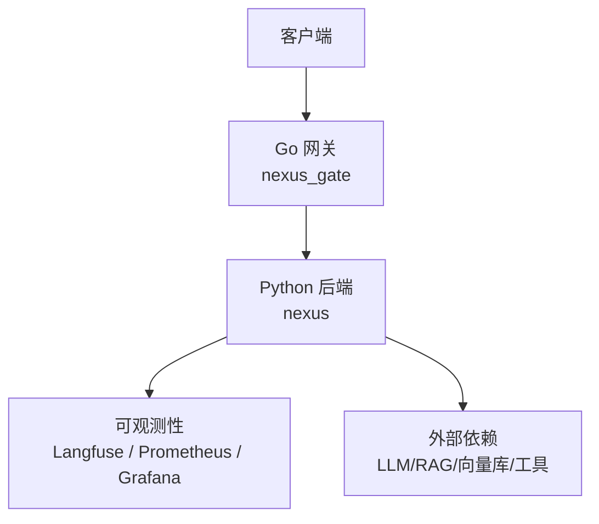
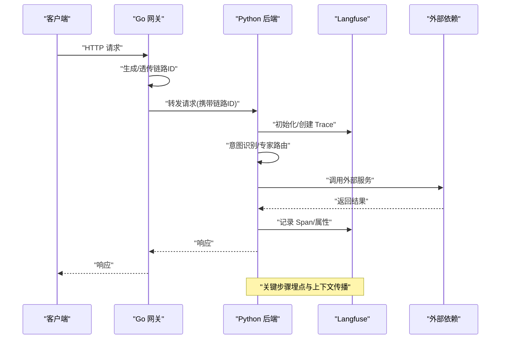
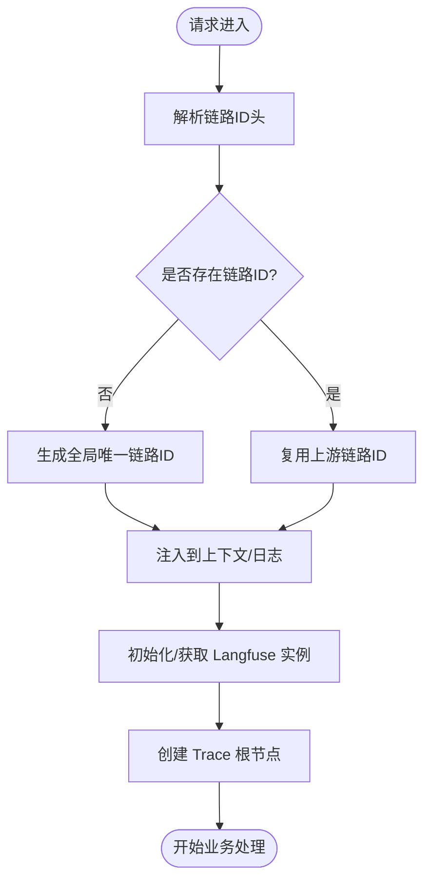
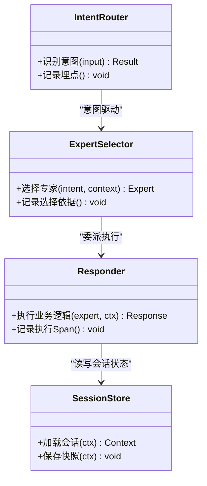
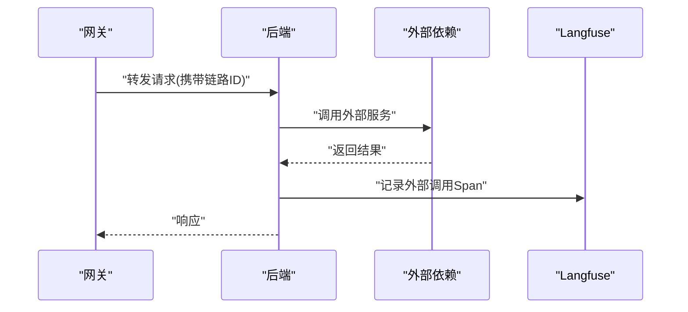
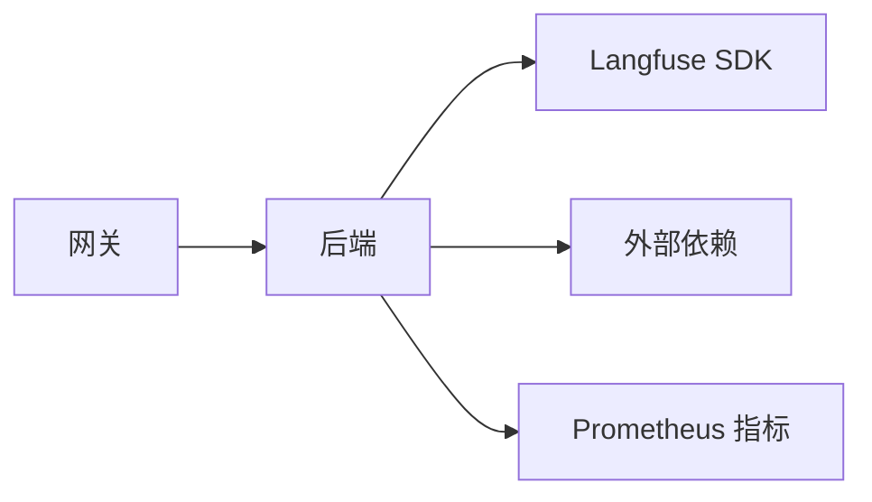

# 分布式追踪

<cite>
**本文引用的文件**   
- [backend_design/nexus/observability/langfuse.py](file://backend_design/nexus/observability/langfuse.py)
- [backend_design/nexus/core/logger.py](file://backend_design/nexus/core/logger.py)
- [backend_design/nexus/api/routes/chat.py](file://backend_design/nexus/api/routes/chat.py)
- [backend_design/nexus/intent/router.py](file://backend_design/nexus/intent/router.py)
- [backend_design/nexus/intent/llm_router.py](file://backend_design/nexus/intent/llm_router.py)
- [backend_design/nexus/agent/responder.py](file://backend_design/nexus/agent/responder.py)
- [backend_design/nexus/agent/supervisor_graph.py](file://backend_design/nexus/agent/supervisor_graph.py)
- [backend_design/nexus/middleware/session_store.py](file://backend_design/nexus/middleware/session_store.py)
- [backend_design/nexus/gate/internal/proxy/proxy.go](file://backend_design/nexus_gate/internal/proxy/proxy.go)
- [backend_design/nexus_gate/internal/handlers/handlers.go](file://backend_design/nexus_gate/internal/handlers/handlers.go)
- [backend_design/nexus_gate/cmd/main.go](file://backend_design/nexus_gate/cmd/main.go)
- [backend_design/nexus/config.py](file://backend_design/nexus/config.py)
- [config/prometheus/prometheus.yml](file://config/prometheus/prometheus.yml)
- [config/grafana/provisioning/dashboards/nexuscockpit-overview.json](file://config/grafana/provisioning/dashboards/nexuscockpit-overview.json)
</cite>

## 目录
1. [简介](#简介)
2. [项目结构](#项目结构)
3. [核心组件](#核心组件)
4. [架构总览](#架构总览)
5. [详细组件分析](#详细组件分析)
6. [依赖分析](#依赖分析)
7. [性能考虑](#性能考虑)
8. [故障排查指南](#故障排查指南)
9. [结论](#结论)
10. [附录](#附录)

## 简介
本文件面向 NexusCockpit 的分布式追踪与可观测性，聚焦以下目标：
- Langfuse 集成配置：追踪 SDK 初始化、上下文传播、链路 ID 生成策略。
- AI Agent 工作流追踪：专家路由过程、意图识别链路、多轮对话状态跟踪。
- 微服务间调用追踪：API 网关转发、内部服务通信、外部依赖调用。
- 性能瓶颈分析方法：慢查询识别、资源消耗分析、并发处理优化。

## 项目结构
NexusCockpit 采用前后端分离与多语言微服务组合：
- Python 后端（nexus）：提供业务 API、Agent 编排、RAG、ASR/TTS、可观测性能力等。
- Go 网关（nexus_gate）：统一入口、鉴权、限流、反向代理到后端。
- 可观测性配置：Prometheus/Grafana 用于指标采集与可视化；Langfuse 用于端到端追踪。

**图表来源** 
- [backend_design/nexus_gate/cmd/main.go](file://backend_design/nexus_gate/cmd/main.go)
- [backend_design/nexus_gate/internal/handlers/handlers.go](file://backend_design/nexus_gate/internal/handlers/handlers.go)
- [backend_design/nexus/api/routes/chat.py](file://backend_design/nexus/api/routes/chat.py)
- [backend_design/nexus/observability/langfuse.py](file://backend_design/nexus/observability/langfuse.py)

**章节来源**
- [backend_design/nexus/config.py](file://backend_design/nexus/config.py)
- [config/prometheus/prometheus.yml](file://config/prometheus/prometheus.yml)
- [config/grafana/provisioning/dashboards/nexuscockpit-overview.json](file://config/grafana/provisioning/dashboards/nexuscockpit-overview.json)

## 核心组件
- Langfuse 集成模块：负责追踪 SDK 初始化、Span/Trace 创建、属性注入与上下文传播。
- 日志与结构化输出：为追踪事件提供关联日志字段（如 trace_id、span_id）。
- 网关代理层：在请求进入时生成或透传链路标识，并在响应中携带必要头信息。
- 意图与路由：记录意图识别结果与专家选择路径，便于定位决策点。
- Agent 编排：将多步推理、检索、工具调用封装为可追踪的工作流节点。
- 会话存储：在多轮对话中维护并传播会话级上下文，支撑跨步骤追踪。

**章节来源**
- [backend_design/nexus/observability/langfuse.py](file://backend_design/nexus/observability/langfuse.py)
- [backend_design/nexus/core/logger.py](file://backend_design/nexus/core/logger.py)
- [backend_design/nexus_gate/internal/proxy/proxy.go](file://backend_design/nexus_gate/internal/proxy/proxy.go)
- [backend_design/nexus/intent/router.py](file://backend_design/nexus/intent/router.py)
- [backend_design/nexus/agent/responder.py](file://backend_design/nexus/agent/responder.py)
- [backend_design/nexus/middleware/session_store.py](file://backend_design/nexus/middleware/session_store.py)

## 架构总览
下图展示从客户端到后端再到外部依赖的完整追踪路径，以及 Langfuse 在各环节的记录点。

**图表来源** 
- [backend_design/nexus_gate/internal/handlers/handlers.go](file://backend_design/nexus_gate/internal/handlers/handlers.go)
- [backend_design/nexus/api/routes/chat.py](file://backend_design/nexus/api/routes/chat.py)
- [backend_design/nexus/observability/langfuse.py](file://backend_design/nexus/observability/langfuse.py)

## 详细组件分析

### Langfuse 集成与上下文传播
- 初始化与配置
  - 通过配置项控制是否启用 Langfuse、设置 API Key、Endpoint、默认项目与用户等。
  - 建议在应用启动阶段完成 SDK 初始化，避免重复创建实例。
- 链路 ID 生成与传播
  - 网关层优先使用上游传入的链路标识；若缺失则生成新的全局唯一 ID，并通过 HTTP 头向下传递。
  - 后端接收后解析链路 ID，作为 Langfuse Trace 的根标识，确保跨进程一致。
- 上下文传播
  - 在请求生命周期内，将 trace_id、span_id、session_id 等注入到日志与追踪事件中。
  - 对异步任务与后台作业，需显式序列化上下文并在消费端反序列化恢复。
- 埋点规范
  - 为关键步骤创建 Span：意图识别、专家路由、RAG 检索、LLM 调用、工具执行、数据库访问等。
  - 为每个 Span 记录输入/输出摘要、耗时、错误码与关键属性，便于问题定位与成本核算。

**图表来源** 
- [backend_design/nexus/observability/langfuse.py](file://backend_design/nexus/observability/langfuse.py)
- [backend_design/nexus_gate/internal/proxy/proxy.go](file://backend_design/nexus_gate/internal/proxy/proxy.go)
- [backend_design/nexus/core/logger.py](file://backend_design/nexus/core/logger.py)

**章节来源**
- [backend_design/nexus/observability/langfuse.py](file://backend_design/nexus/observability/langfuse.py)
- [backend_design/nexus/core/logger.py](file://backend_design/nexus/core/logger.py)
- [backend_design/nexus_gate/internal/proxy/proxy.go](file://backend_design/nexus_gate/internal/proxy/proxy.go)

### AI Agent 工作流追踪
- 意图识别链路
  - 记录用户输入的预处理、特征提取、分类器/规则匹配结果与置信度。
  - 将意图类别、候选列表、评分明细写入 Span 属性，便于回溯与调优。
- 专家路由过程
  - 根据意图与上下文选择具体专家（如导航、健康、车辆控制等），记录选择依据与备选方案。
  - 对专家调用进行独立 Span 标记，包含参数、返回摘要与异常信息。
- 多轮对话状态跟踪
  - 会话级上下文（历史消息、偏好、记忆片段）在每轮之间持久化与恢复。
  - 在每次交互中更新状态快照，并将变更点记录为事件，支持时间线回放。

**图表来源** 
- [backend_design/nexus/intent/router.py](file://backend_design/nexus/intent/router.py)
- [backend_design/nexus/agent/responder.py](file://backend_design/nexus/agent/responder.py)
- [backend_design/nexus/middleware/session_store.py](file://backend_design/nexus/middleware/session_store.py)

**章节来源**
- [backend_design/nexus/intent/router.py](file://backend_design/nexus/intent/router.py)
- [backend_design/nexus/intent/llm_router.py](file://backend_design/nexus/intent/llm_router.py)
- [backend_design/nexus/agent/responder.py](file://backend_design/nexus/agent/responder.py)
- [backend_design/nexus/middleware/session_store.py](file://backend_design/nexus/middleware/session_store.py)

### 微服务间调用追踪
- API 网关转发
  - 在入口处生成或透传链路 ID，并将其附加到下游请求头。
  - 对网关自身的关键操作（鉴权、限流、路由）进行 Span 记录。
- 内部服务通信
  - 后端服务在调用其他内部服务时，继承上游链路 ID，保证端到端一致性。
  - 对 RPC/HTTP 调用增加入参/出参摘要与耗时统计。
- 外部依赖调用
  - 对 LLM、RAG、向量库、第三方 API 等外部依赖建立独立 Span，记录错误码、重试次数与超时情况。

**图表来源** 
- [backend_design/nexus_gate/internal/handlers/handlers.go](file://backend_design/nexus_gate/internal/handlers/handlers.go)
- [backend_design/nexus/api/routes/chat.py](file://backend_design/nexus/api/routes/chat.py)
- [backend_design/nexus/observability/langfuse.py](file://backend_design/nexus/observability/langfuse.py)

**章节来源**
- [backend_design/nexus_gate/internal/proxy/proxy.go](file://backend_design/nexus_gate/internal/proxy/proxy.go)
- [backend_design/nexus_gate/internal/handlers/handlers.go](file://backend_design/nexus_gate/internal/handlers/handlers.go)
- [backend_design/nexus/api/routes/chat.py](file://backend_design/nexus/api/routes/chat.py)

### 追踪数据模型与关键字段
- Trace 根节点
  - 标识：trace_id（全局唯一）、session_id（会话级）、user_id（可选）。
  - 元数据：来源（网关/后端）、版本、环境。
- Span 节点
  - 标识：span_id、parent_span_id。
  - 类型：intent、route、rag、llm、tool、db、http。
  - 属性：输入摘要、输出摘要、耗时、错误码、重试次数、缓存命中。
- 事件与日志
  - 结构化日志包含 trace_id、span_id、level、message、key-value 属性。
  - 事件用于记录状态变更与关键决策点。

[本节为概念性说明，不直接分析具体文件]

## 依赖分析
- 组件耦合
  - 网关与后端通过 HTTP 头传递链路 ID，形成松耦合的追踪链路。
  - 后端与 Langfuse 通过 SDK 接口解耦，便于替换或扩展。
- 外部依赖
  - LLM/RAG/向量库等外部系统通过 Span 暴露性能与错误信息。
- 潜在循环依赖
  - 建议将追踪逻辑抽象为中间件/装饰器，避免业务代码强耦合。

**图表来源** 
- [backend_design/nexus_gate/cmd/main.go](file://backend_design/nexus_gate/cmd/main.go)
- [backend_design/nexus/observability/langfuse.py](file://backend_design/nexus/observability/langfuse.py)
- [config/prometheus/prometheus.yml](file://config/prometheus/prometheus.yml)

**章节来源**
- [backend_design/nexus_gate/cmd/main.go](file://backend_design/nexus_gate/cmd/main.go)
- [backend_design/nexus/observability/langfuse.py](file://backend_design/nexus/observability/langfuse.py)
- [config/prometheus/prometheus.yml](file://config/prometheus/prometheus.yml)

## 性能考虑
- 慢查询识别
  - 基于 Span 耗时阈值告警，结合数据库与外部依赖的慢查询日志。
  - 在 RAG 检索与 LLM 调用处增加采样与分页限制，避免长尾影响。
- 资源消耗分析
  - 监控 CPU/内存/IO 使用率，结合 Langfuse 的 Token 用量与调用次数评估成本。
  - 对热点路径进行火焰图分析，定位热点函数与锁竞争。
- 并发处理优化
  - 合理设置连接池大小与超时时间，避免线程/协程饥饿。
  - 对高延迟外部依赖引入熔断与降级策略，保障主流程稳定性。

[本节提供通用指导，不直接分析具体文件]

## 故障排查指南
- 常见问题
  - 链路 ID 丢失：检查网关头透传与后端解析逻辑，确认上下文传播链完整。
  - Span 未记录：确认 SDK 初始化成功且埋点未被跳过。
  - 追踪数据不一致：核对 session_id 与 user_id 的传递与持久化。
- 定位步骤
  - 通过 trace_id 在 Langfuse 中检索完整链路，查看各 Span 的属性与错误堆栈。
  - 结合结构化日志与指标面板，交叉验证异常时间点与资源峰值。
  - 对疑似热点路径开启更细粒度埋点与采样，复现问题并收集证据。

**章节来源**
- [backend_design/nexus/observability/langfuse.py](file://backend_design/nexus/observability/langfuse.py)
- [backend_design/nexus/core/logger.py](file://backend_design/nexus/core/logger.py)

## 结论
通过在网关与后端统一注入链路 ID、在关键业务路径完善 Span 埋点，并结合 Langfuse 与 Prometheus/Grafana 的联动，NexusCockpit 实现了端到端的可观测性与问题快速定位。后续可进一步细化采样策略、完善成本归因与自动化告警，以提升整体运维效率与用户体验。

[本节为总结性内容，不直接分析具体文件]

## 附录
- 配置参考
  - 后端配置项：包括 Langfuse 开关、API Key、Endpoint、默认项目与用户等。
  - 指标采集：Prometheus 抓取目标与 Grafana 仪表盘定义。
- 最佳实践
  - 统一链路 ID 命名规范与头约定。
  - 对所有外部依赖调用进行标准化埋点与错误码映射。
  - 定期审查埋点质量与数据完整性，避免噪声与遗漏。

**章节来源**
- [backend_design/nexus/config.py](file://backend_design/nexus/config.py)
- [config/prometheus/prometheus.yml](file://config/prometheus/prometheus.yml)
- [config/grafana/provisioning/dashboards/nexuscockpit-overview.json](file://config/grafana/provisioning/dashboards/nexuscockpit-overview.json)