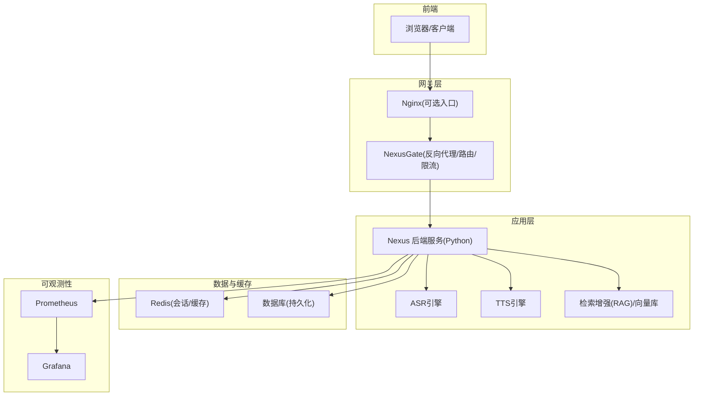
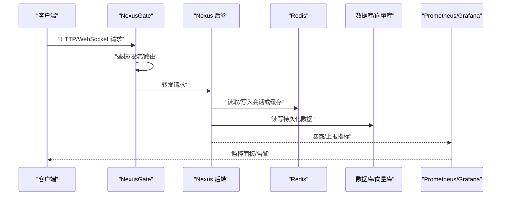
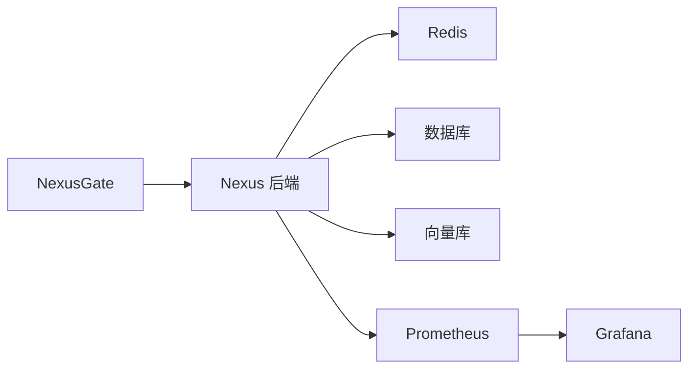

# 容量规划

<cite>
**本文引用的文件**   
- [docker-compose.yml](file://docker-compose.yml)
- [backend_design/nexus/main.py](file://backend_design/nexus/main.py)
- [backend_design/nexus/config.py](file://backend_design/nexus/config.py)
- [backend_design/nexus/observability/metrics.py](file://backend_design/nexus/observability/metrics.py)
- [backend_design/nexus/observability/cockpit_metrics.py](file://backend_design/nexus/observability/cockpit_metrics.py)
- [backend_design/nexus/api/routes/health.py](file://backend_design/nexus/api/routes/health.py)
- [backend_design/nexus/middleware/rate_limiter.py](file://backend_design/nexus/middleware/rate_limiter.py)
- [backend_design/nexus/middleware/session_store.py](file://backend_design/nexus/middleware/session_store.py)
- [backend_design/nexus_gate/internal/proxy/proxy.go](file://backend_design/nexus_gate/internal/proxy/proxy.go)
- [backend_design/nexus_gate/internal/router/router.go](file://backend_design/nexus_gate/internal/router/router.go)
- [backend_design/nexus_gate/internal/ratelimit/ratelimit.go](file://backend_design/nexus_gate/internal/ratelimit/ratelimit.go)
- [config/prometheus/prometheus.yml](file://config/prometheus/prometheus.yml)
- [config/grafana/provisioning/dashboards/nexuscockpit-overview.json](file://config/grafana/provisioning/dashboards/nexuscockpit-overview.json)
- [scripts/test_api.py](file://scripts/test_api.py)
- [scripts/test_metrics.py](file://scripts/test_metrics.py)
</cite>

## 目录
1. [简介](#简介)
2. [项目结构](#项目结构)
3. [核心组件](#核心组件)
4. [架构总览](#架构总览)
5. [详细组件分析](#详细组件分析)
6. [依赖分析](#依赖分析)
7. [性能考虑](#性能考虑)
8. [故障排查指南](#故障排查指南)
9. [结论](#结论)
10. [附录](#附录)

## 简介
本容量规划文档面向NexusCockpit系统，围绕资源监控与评估、弹性伸缩策略、负载均衡配置以及容量规划最佳实践展开。目标是在不深入代码细节的前提下，帮助读者建立对系统容量模型、观测指标来源、扩缩容触发条件与负载分发机制的系统性认知，并给出可操作的基准测试与扩容时机判断方法。

## 项目结构
从仓库结构可见，系统包含：
- 后端服务（Python）：提供API、中间件、可观测性指标采集等能力
- 网关（Go）：负责反向代理、路由、限流等
- 可观测性配置：Prometheus抓取配置、Grafana仪表盘
- 压测脚本：用于接口与指标验证的测试工具
- 容器编排：docker-compose定义多服务部署拓扑

[本图为概念性架构图，未直接映射到具体源码文件]

## 核心组件
- 网关层（NexusGate）
  - 职责：统一入口、请求转发、鉴权、限流、WebSocket Hub
  - 容量相关：并发连接数、QPS上限、队列积压、错误率
- 应用层（Nexus 后端）
  - 职责：业务API、中间件（速率限制、会话存储）、可观测性指标导出
  - 容量相关：CPU/内存占用、线程/进程池、I/O吞吐、外部依赖延迟
- 可观测性
  - Prometheus抓取应用指标；Grafana展示概览仪表盘
- 压测与验证
  - 提供API与指标验证脚本，辅助基线测试与回归

章节来源
- [docker-compose.yml](file://docker-compose.yml)
- [backend_design/nexus/main.py](file://backend_design/nexus/main.py)
- [backend_design/nexus/observability/metrics.py](file://backend_design/nexus/observability/metrics.py)
- [backend_design/nexus/observability/cockpit_metrics.py](file://backend_design/nexus/observability/cockpit_metrics.py)
- [backend_design/nexus_gate/internal/proxy/proxy.go](file://backend_design/nexus_gate/internal/proxy/proxy.go)
- [backend_design/nexus_gate/internal/router/router.go](file://backend_design/nexus_gate/internal/router/router.go)
- [backend_design/nexus_gate/internal/ratelimit/ratelimit.go](file://backend_design/nexus_gate/internal/ratelimit/ratelimit.go)
- [config/prometheus/prometheus.yml](file://config/prometheus/prometheus.yml)
- [config/grafana/provisioning/dashboards/nexuscockpit-overview.json](file://config/grafana/provisioning/dashboards/nexuscockpit-overview.json)
- [scripts/test_api.py](file://scripts/test_api.py)
- [scripts/test_metrics.py](file://scripts/test_metrics.py)

## 架构总览
下图展示了从客户端到网关、应用、数据与可观测性的整体链路，以及关键容量关注点。

图表来源
- [backend_design/nexus_gate/internal/proxy/proxy.go](file://backend_design/nexus_gate/internal/proxy/proxy.go)
- [backend_design/nexus_gate/internal/router/router.go](file://backend_design/nexus_gate/internal/router/router.go)
- [backend_design/nexus_gate/internal/ratelimit/ratelimit.go](file://backend_design/nexus_gate/internal/ratelimit/ratelimit.go)
- [backend_design/nexus/observability/metrics.py](file://backend_design/nexus/observability/metrics.py)
- [config/prometheus/prometheus.yml](file://config/prometheus/prometheus.yml)

章节来源
- [backend_design/nexus/main.py](file://backend_design/nexus/main.py)
- [backend_design/nexus/config.py](file://backend_design/nexus/config.py)
- [backend_design/nexus/middleware/session_store.py](file://backend_design/nexus/middleware/session_store.py)
- [backend_design/nexus/middleware/rate_limiter.py](file://backend_design/nexus/middleware/rate_limiter.py)

## 详细组件分析

### 资源监控与评估
- CPU与内存
  - 通过操作系统级指标与应用内自定义指标结合，观察进程CPU使用率、上下文切换、GC停顿（如适用）、内存峰值与泄漏趋势
  - 建议阈值：CPU持续高于70%、内存使用率超过80%且存在增长趋势时触发扩容或优化
- 磁盘
  - 关注日志、模型权重、向量索引、临时文件的磁盘使用率与IOPS
  - 建议阈值：磁盘使用率超过80%需清理或扩容；I/O等待时间升高需评估SSD或异步落盘
- 网络
  - 关注入/出带宽、连接数、丢包与RTT；WebSocket长连接需关注并发连接上限
  - 建议阈值：带宽利用率超过70%、连接数接近系统或网关限制时需扩容或限流
- 指标采集与可视化
  - Prometheus按配置抓取应用指标，Grafana提供“NexusCockpit概览”仪表盘
  - 建议将关键KPI（QPS、P95/P99延迟、错误率、连接数、缓存命中率）纳入看板

章节来源
- [config/prometheus/prometheus.yml](file://config/prometheus/prometheus.yml)
- [config/grafana/provisioning/dashboards/nexuscockpit-overview.json](file://config/grafana/provisioning/dashboards/nexuscockpit-overview.json)
- [backend_design/nexus/observability/metrics.py](file://backend_design/nexus/observability/metrics.py)
- [backend_design/nexus/observability/cockpit_metrics.py](file://backend_design/nexus/observability/cockpit_metrics.py)

### 弹性伸缩策略
- 水平扩展（HPA/副本数）
  - 基于CPU/内存/QPS/错误率等指标自动调整副本数量
  - 建议规则：CPU>70%持续5分钟扩容1个副本；错误率>1%持续2分钟扩容并回退策略
- 垂直扩缩容（VPA/资源配额）
  - 根据历史资源使用分布调整单实例CPU/内存配额，避免频繁抖动
  - 建议：为AI推理/ASR/TTS等重资源模块设置独立Pod/容器组，单独调参
- 自动伸缩触发与冷却
  - 引入冷却期（如扩容后5分钟内不再重复扩容），避免雪崩
  - 结合队列积压（如任务队列长度）作为前置信号，提前扩容
- 状态与会话保持
  - 会话外置至Redis，确保无状态横向扩展
  - WebSocket需保证同一会话粘滞到同一实例或使用共享Hub

章节来源
- [backend_design/nexus/middleware/session_store.py](file://backend_design/nexus/middleware/session_store.py)
- [backend_design/nexus/middleware/rate_limiter.py](file://backend_design/nexus/middleware/rate_limiter.py)
- [backend_design/nexus_gate/internal/ws/hub.go](file://backend_design/nexus_gate/internal/ws/hub.go)

### 负载均衡与服务发现
- 入口与分发
  - Nginx/NexusGate作为统一入口，进行健康检查与流量分发
  - 支持轮询、最少连接、加权等策略，依据后端实例健康度动态剔除
- 服务发现
  - 容器编排环境下通过注册表或服务名解析实现动态发现
  - 网关侧维护健康实例列表，异常实例自动摘除
- 会话保持
  - HTTP短连接无需会话保持；WebSocket可通过IP Hash或共享Hub实现一致性
  - 推荐优先采用无状态设计+外部会话存储，简化负载均衡复杂度

章节来源
- [backend_design/nexus_gate/internal/proxy/proxy.go](file://backend_design/nexus_gate/internal/proxy/proxy.go)
- [backend_design/nexus_gate/internal/router/router.go](file://backend_design/nexus_gate/internal/router/router.go)
- [backend_design/nexus/middleware/session_store.py](file://backend_design/nexus/middleware/session_store.py)

### 限流与降级
- 网关限流
  - 基于令牌桶/漏桶算法限制全局或分租户QPS，保护后端稳定
- 应用层限流
  - 针对热点接口与敏感操作进行细粒度限流
- 熔断与降级
  - 对下游依赖（LLM、ASR、TTS、向量库）设置熔断阈值，失败快速返回默认结果或缓存

章节来源
- [backend_design/nexus_gate/internal/ratelimit/ratelimit.go](file://backend_design/nexus_gate/internal/ratelimit/ratelimit.go)
- [backend_design/nexus/middleware/rate_limiter.py](file://backend_design/nexus/middleware/rate_limiter.py)

### 容量规划最佳实践
- 性能基准测试
  - 使用脚本模拟典型用户行为，测量QPS、延迟分布、错误率与资源占用
  - 覆盖冷启动、热路径、峰值场景，记录基线
- 压力测试方法
  - 阶梯加压：逐步提升并发，找到拐点（S曲线）
  - 稳定性测试：长时间运行观察内存泄漏、句柄泄露、GC抖动
- 扩容时机判断
  - 指标驱动：CPU/内存/延迟/错误率/队列长度
  - 业务驱动：活动促销、新功能上线前预扩容
- 容量预留
  - 保留20%-30%冗余应对突发流量与灰度发布

章节来源
- [scripts/test_api.py](file://scripts/test_api.py)
- [scripts/test_metrics.py](file://scripts/test_metrics.py)

## 依赖分析
- 组件耦合
  - 网关与后端松耦合，通过HTTP/WebSocket通信
  - 后端与Redis/DB/向量库通过中间件或SDK访问，具备可替换性
- 外部依赖
  - LLM/ASR/TTS为高延迟外部依赖，需熔断与超时控制
- 潜在环依赖
  - 当前未见循环导入；中间件与路由解耦清晰

图表来源
- [backend_design/nexus_gate/internal/proxy/proxy.go](file://backend_design/nexus_gate/internal/proxy/proxy.go)
- [backend_design/nexus/observability/metrics.py](file://backend_design/nexus/observability/metrics.py)
- [config/prometheus/prometheus.yml](file://config/prometheus/prometheus.yml)

章节来源
- [docker-compose.yml](file://docker-compose.yml)
- [backend_design/nexus/main.py](file://backend_design/nexus/main.py)

## 性能考虑
- 连接复用与池化
  - 数据库/向量库连接池大小按峰值QPS与平均延迟估算
- 缓存命中
  - 提高缓存命中率可降低后端与外部依赖压力
- I/O优化
  - 大对象传输启用压缩；日志异步落盘
- 资源隔离
  - 将AI推理、ASR/TTS、检索等模块拆分部署，避免相互影响

[本节为通用指导，不涉及具体源码分析]

## 故障排查指南
- 健康检查
  - 通过健康端点确认服务存活与依赖可用性
- 指标定位
  - 在Grafana中查看“NexusCockpit概览”，聚焦错误率、延迟、连接数
- 限流与熔断
  - 若出现大量429/5xx，检查限流阈值与熔断器状态
- 会话问题
  - 检查Redis连通性与键空间是否过期过快

章节来源
- [backend_design/nexus/api/routes/health.py](file://backend_design/nexus/api/routes/health.py)
- [config/grafana/provisioning/dashboards/nexuscockpit-overview.json](file://config/grafana/provisioning/dashboards/nexuscockpit-overview.json)
- [backend_design/nexus/middleware/rate_limiter.py](file://backend_design/nexus/middleware/rate_limiter.py)

## 结论
NexusCockpit通过网关与应用的解耦、完善的可观测性体系与可插拔的中间件，具备良好的容量扩展基础。建议以指标驱动为核心，结合业务节奏制定弹性伸缩策略，并通过持续的基准与压力测试校准容量模型，确保在高并发与复杂依赖场景下的稳定性与可扩展性。

## 附录
- 常用容量公式
  - 所需实例数 ≈ 峰值QPS × P95延迟 / (单实例有效吞吐)
  - 连接池大小 ≈ 峰值并发 × 平均等待时间 / 平均处理时间
- 监控清单
  - 应用：QPS、错误率、P95/P99延迟、线程/进程数、GC次数
  - 系统：CPU、内存、磁盘、网络
  - 依赖：外部调用成功率、延迟、重试次数

[本节为通用指导，不涉及具体源码分析]