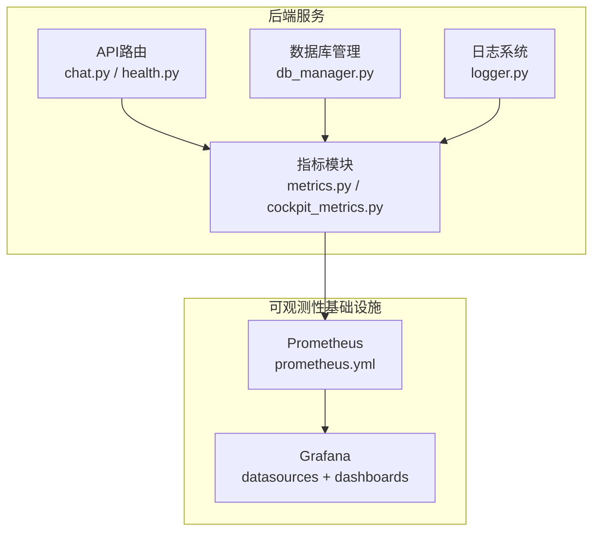
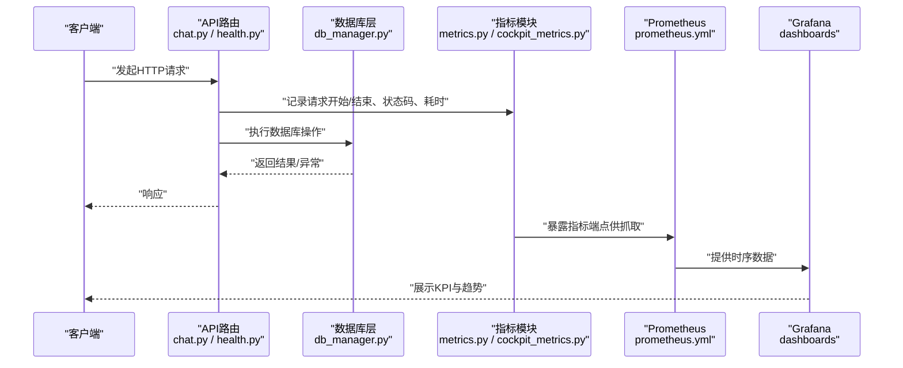
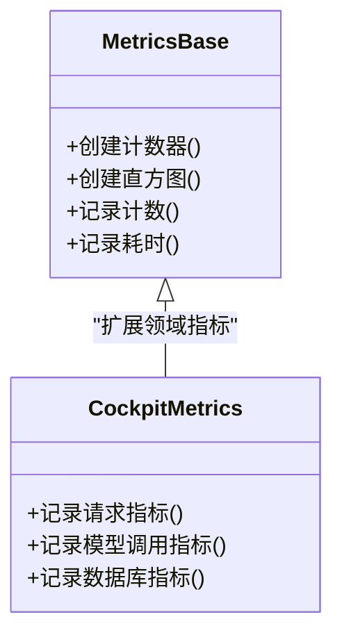
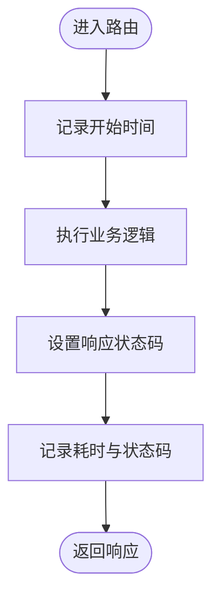
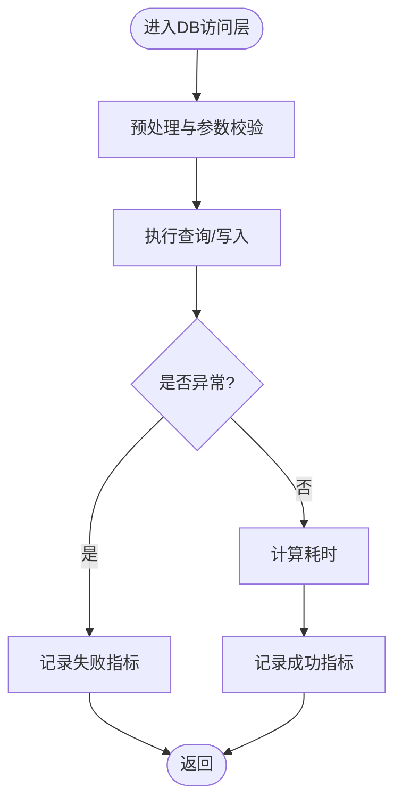
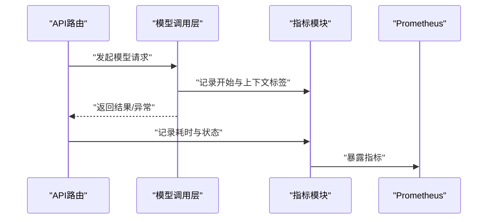
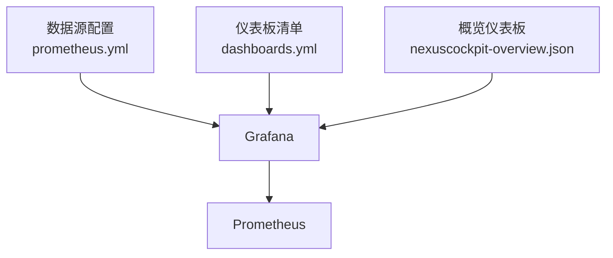
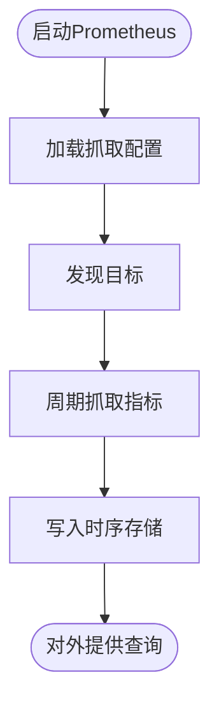
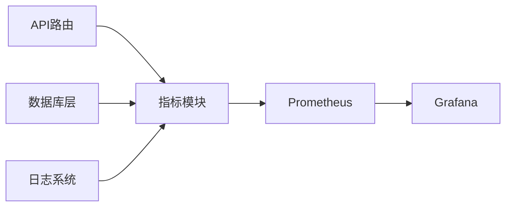

# 性能监控

<cite>
**本文引用的文件**   
- [backend_design/nexus/observability/metrics.py](file://backend_design/nexus/observability/metrics.py)
- [backend_design/nexus/observability/cockpit_metrics.py](file://backend_design/nexus/observability/cockpit_metrics.py)
- [backend_design/nexus/core/logger.py](file://backend_design/nexus/core/logger.py)
- [backend_design/nexus/api/routes/chat.py](file://backend_design/nexus/api/routes/chat.py)
- [backend_design/nexus/api/routes/health.py](file://backend_design/nexus/api/routes/health.py)
- [backend_design/nexus/core/db_manager.py](file://backend_design/nexus/core/db_manager.py)
- [config/prometheus/prometheus.yml](file://config/prometheus/prometheus.yml)
- [config/grafana/provisioning/datasources/prometheus.yml](file://config/grafana/provisioning/datasources/prometheus.yml)
- [config/grafana/provisioning/dashboards/dashboards.yml](file://config/grafana/provisioning/dashboards/dashboards.yml)
- [config/grafana/provisioning/dashboards/nexuscockpit-overview.json](file://config/grafana/provisioning/dashboards/nexuscockpit-overview.json)
- [backend_design/scripts/test_metrics.py](file://backend_design/scripts/test_metrics.py)
</cite>

## 目录
1. [简介](#简介)
2. [项目结构](#项目结构)
3. [核心组件](#核心组件)
4. [架构总览](#架构总览)
5. [详细组件分析](#详细组件分析)
6. [依赖关系分析](#依赖关系分析)
7. [性能考虑](#性能考虑)
8. [故障排查指南](#故障排查指南)
9. [结论](#结论)
10. [附录](#附录)

## 简介
本文件面向NexusCockpit系统的性能监控，聚焦Prometheus指标采集体系与Grafana可视化配置。内容覆盖：
- 自定义指标定义与埋点规范（HTTP请求、数据库查询、AI模型调用等）
- Grafana数据源与仪表板配置，关键性能指标(KPI)的实时监控与趋势分析
- 告警规则配置思路（阈值、通知策略、升级机制）
- 性能优化建议与最佳实践（采样、存储、查询调优）

## 项目结构
与性能监控相关的代码与配置主要分布在以下位置：
- 后端指标实现：backend_design/nexus/observability/*
- HTTP路由埋点示例：backend_design/nexus/api/routes/*
- 数据库访问层埋点参考：backend_design/nexus/core/db_manager.py
- Prometheus抓取配置：config/prometheus/prometheus.yml
- Grafana数据源与仪表板：config/grafana/provisioning/*
- 指标测试脚本：backend_design/scripts/test_metrics.py

图表来源
- [backend_design/nexus/api/routes/chat.py](file://backend_design/nexus/api/routes/chat.py)
- [backend_design/nexus/api/routes/health.py](file://backend_design/nexus/api/routes/health.py)
- [backend_design/nexus/core/db_manager.py](file://backend_design/nexus/core/db_manager.py)
- [backend_design/nexus/core/logger.py](file://backend_design/nexus/core/logger.py)
- [backend_design/nexus/observability/metrics.py](file://backend_design/nexus/observability/metrics.py)
- [backend_design/nexus/observability/cockpit_metrics.py](file://backend_design/nexus/observability/cockpit_metrics.py)
- [config/prometheus/prometheus.yml](file://config/prometheus/prometheus.yml)
- [config/grafana/provisioning/datasources/prometheus.yml](file://config/grafana/provisioning/datasources/prometheus.yml)
- [config/grafana/provisioning/dashboards/dashboards.yml](file://config/grafana/provisioning/dashboards/dashboards.yml)

章节来源
- [backend_design/nexus/observability/metrics.py](file://backend_design/nexus/observability/metrics.py)
- [backend_design/nexus/observability/cockpit_metrics.py](file://backend_design/nexus/observability/cockpit_metrics.py)
- [config/prometheus/prometheus.yml](file://config/prometheus/prometheus.yml)
- [config/grafana/provisioning/datasources/prometheus.yml](file://config/grafana/provisioning/datasources/prometheus.yml)
- [config/grafana/provisioning/dashboards/dashboards.yml](file://config/grafana/provisioning/dashboards/dashboards.yml)
- [config/grafana/provisioning/dashboards/nexuscockpit-overview.json](file://config/grafana/provisioning/dashboards/nexuscockpit-overview.json)

## 核心组件
- 指标定义与采集
  - 通用指标封装：提供计数器、直方图、摘要等常用类型的基础设施，便于在业务中快速埋点。
  - Cockpit领域指标：围绕对话、技能、车辆控制等场景定义专用指标，如请求量、耗时分布、错误率、队列长度等。
- HTTP请求指标
  - 建议在路由层统一记录方法、路径、状态码、耗时等维度，形成标准HTTP指标族。
- 数据库查询指标
  - 在数据库访问层对慢查询、失败次数、连接池使用情况进行统计。
- AI模型调用指标
  - 针对LLM/Reranker/ASR/TTS等外部或本地模型调用，记录调用次数、延迟、错误分类、重试次数等。

章节来源
- [backend_design/nexus/observability/metrics.py](file://backend_design/nexus/observability/metrics.py)
- [backend_design/nexus/observability/cockpit_metrics.py](file://backend_design/nexus/observability/cockpit_metrics.py)

## 架构总览
下图展示了从应用埋点到Prometheus抓取再到Grafana可视化的端到端链路。

图表来源
- [backend_design/nexus/api/routes/chat.py](file://backend_design/nexus/api/routes/chat.py)
- [backend_design/nexus/api/routes/health.py](file://backend_design/nexus/api/routes/health.py)
- [backend_design/nexus/core/db_manager.py](file://backend_design/nexus/core/db_manager.py)
- [backend_design/nexus/observability/metrics.py](file://backend_design/nexus/observability/metrics.py)
- [backend_design/nexus/observability/cockpit_metrics.py](file://backend_design/nexus/observability/cockpit_metrics.py)
- [config/prometheus/prometheus.yml](file://config/prometheus/prometheus.yml)
- [config/grafana/provisioning/dashboards/dashboards.yml](file://config/grafana/provisioning/dashboards/dashboards.yml)

## 详细组件分析

### 指标模块与领域指标
- 通用指标封装
  - 职责：提供统一的指标创建与记录接口，屏蔽底层库差异；支持标签化维度（如服务名、版本、环境）。
  - 复杂度：创建与记录通常为O(1)，聚合查询由PromQL完成。
- Cockpit领域指标
  - 职责：围绕对话会话、意图识别、技能执行、车辆控制等流程定义指标，便于定位具体环节的性能问题。
  - 典型维度：功能域、子模块、用户租户、设备型号等。

图表来源
- [backend_design/nexus/observability/metrics.py](file://backend_design/nexus/observability/metrics.py)
- [backend_design/nexus/observability/cockpit_metrics.py](file://backend_design/nexus/observability/cockpit_metrics.py)

章节来源
- [backend_design/nexus/observability/metrics.py](file://backend_design/nexus/observability/metrics.py)
- [backend_design/nexus/observability/cockpit_metrics.py](file://backend_design/nexus/observability/cockpit_metrics.py)

### HTTP请求指标埋点
- 目标：统一记录每个HTTP请求的方法、路径、状态码、耗时、错误分类等。
- 建议位置：在路由入口处记录开始时间并打点，在响应前记录状态码与耗时。
- 关键KPI：QPS、P95/P99延迟、错误率、按路径分组的延迟分布。

图表来源
- [backend_design/nexus/api/routes/chat.py](file://backend_design/nexus/api/routes/chat.py)
- [backend_design/nexus/api/routes/health.py](file://backend_design/nexus/api/routes/health.py)
- [backend_design/nexus/observability/metrics.py](file://backend_design/nexus/observability/metrics.py)

章节来源
- [backend_design/nexus/api/routes/chat.py](file://backend_design/nexus/api/routes/chat.py)
- [backend_design/nexus/api/routes/health.py](file://backend_design/nexus/api/routes/health.py)
- [backend_design/nexus/observability/metrics.py](file://backend_design/nexus/observability/metrics.py)

### 数据库查询指标
- 目标：统计慢查询、失败次数、连接池使用率、事务耗时等。
- 建议位置：在数据库访问层统一拦截，记录SQL类别、影响行数、是否超时等。
- 关键KPI：慢查询比例、平均/分位耗时、失败率、连接池等待时间。

图表来源
- [backend_design/nexus/core/db_manager.py](file://backend_design/nexus/core/db_manager.py)
- [backend_design/nexus/observability/metrics.py](file://backend_design/nexus/observability/metrics.py)

章节来源
- [backend_design/nexus/core/db_manager.py](file://backend_design/nexus/core/db_manager.py)
- [backend_design/nexus/observability/metrics.py](file://backend_design/nexus/observability/metrics.py)

### AI模型调用指标
- 目标：对LLM/Reranker/ASR/TTS等模型调用进行全链路埋点，包括输入特征、输出质量、重试与降级。
- 建议维度：模型名称、版本、任务类型、租户、设备、错误分类。
- 关键KPI：调用成功率、首字节延迟、端到端延迟、重试率、降级触发率。

图表来源
- [backend_design/nexus/observability/cockpit_metrics.py](file://backend_design/nexus/observability/cockpit_metrics.py)
- [backend_design/nexus/observability/metrics.py](file://backend_design/nexus/observability/metrics.py)

章节来源
- [backend_design/nexus/observability/cockpit_metrics.py](file://backend_design/nexus/observability/cockpit_metrics.py)
- [backend_design/nexus/observability/metrics.py](file://backend_design/nexus/observability/metrics.py)

### Grafana仪表板与数据源
- 数据源配置
  - 通过Provisioning方式自动注册Prometheus数据源，确保多环境一致性。
- 仪表板配置
  - 提供“概览”仪表板，集中展示KPI、趋势与热点路径。
  - 支持按租户、路径、模型等维度筛选与下钻。
- 关键面板建议
  - 请求总量与QPS、P95/P99延迟、错误率
  - 数据库慢查询Top N、连接池使用率
  - 模型调用成功率、延迟分布、重试与降级

图表来源
- [config/grafana/provisioning/datasources/prometheus.yml](file://config/grafana/provisioning/datasources/prometheus.yml)
- [config/grafana/provisioning/dashboards/dashboards.yml](file://config/grafana/provisioning/dashboards/dashboards.yml)
- [config/grafana/provisioning/dashboards/nexuscockpit-overview.json](file://config/grafana/provisioning/dashboards/nexuscockpit-overview.json)

章节来源
- [config/grafana/provisioning/datasources/prometheus.yml](file://config/grafana/provisioning/datasources/prometheus.yml)
- [config/grafana/provisioning/dashboards/dashboards.yml](file://config/grafana/provisioning/dashboards/dashboards.yml)
- [config/grafana/provisioning/dashboards/nexuscockpit-overview.json](file://config/grafana/provisioning/dashboards/nexuscockpit-overview.json)

### Prometheus抓取配置
- 目标：确保后端指标端点被正确发现与周期性抓取。
- 要点：
  - 指定抓取间隔与超时
  - 配置服务发现或静态目标
  - 合理设置保留期与压缩策略

图表来源
- [config/prometheus/prometheus.yml](file://config/prometheus/prometheus.yml)

章节来源
- [config/prometheus/prometheus.yml](file://config/prometheus/prometheus.yml)

### 指标测试与验证
- 目的：验证指标是否正确暴露与可被Prometheus抓取。
- 建议步骤：
  - 运行测试脚本，确认指标端点可达
  - 在Grafana中查询关键指标，确认数据更新正常
  - 模拟高负载，观察指标增长与延迟变化

章节来源
- [backend_design/scripts/test_metrics.py](file://backend_design/scripts/test_metrics.py)

## 依赖关系分析
- 组件耦合
  - API路由依赖指标模块进行埋点
  - 数据库访问层依赖指标模块记录DB相关指标
  - 日志系统与指标模块协同，用于关联追踪
- 外部依赖
  - Prometheus负责抓取与存储
  - Grafana负责可视化与告警

图表来源
- [backend_design/nexus/api/routes/chat.py](file://backend_design/nexus/api/routes/chat.py)
- [backend_design/nexus/core/db_manager.py](file://backend_design/nexus/core/db_manager.py)
- [backend_design/nexus/core/logger.py](file://backend_design/nexus/core/logger.py)
- [backend_design/nexus/observability/metrics.py](file://backend_design/nexus/observability/metrics.py)
- [config/prometheus/prometheus.yml](file://config/prometheus/prometheus.yml)
- [config/grafana/provisioning/datasources/prometheus.yml](file://config/grafana/provisioning/datasources/prometheus.yml)

章节来源
- [backend_design/nexus/api/routes/chat.py](file://backend_design/nexus/api/routes/chat.py)
- [backend_design/nexus/core/db_manager.py](file://backend_design/nexus/core/db_manager.py)
- [backend_design/nexus/core/logger.py](file://backend_design/nexus/core/logger.py)
- [backend_design/nexus/observability/metrics.py](file://backend_design/nexus/observability/metrics.py)
- [config/prometheus/prometheus.yml](file://config/prometheus/prometheus.yml)
- [config/grafana/provisioning/datasources/prometheus.yml](file://config/grafana/provisioning/datasources/prometheus.yml)

## 性能考虑
- 指标采样策略
  - 对高频指标采用降采样或窗口聚合，避免过度打点
  - 对直方图/摘要选择合适的桶边界，平衡精度与开销
- 存储优化
  - 合理设置Prometheus保留期与压缩级别
  - 控制标签基数，避免高基数字段导致存储膨胀
- 查询性能调优
  - 在Grafana中使用预聚合函数与范围选择器
  - 为常用查询建立索引视图或报表缓存
- 埋点成本评估
  - 优先在高价值路径埋点，减少冷路径的指标数量
  - 将复杂计算移至查询侧而非埋点侧

[本节为通用指导，不直接分析具体文件]

## 故障排查指南
- 常见问题
  - 指标未出现：检查Prometheus抓取配置与目标可达性
  - 指标缺失维度：核对标签定义与埋点位置
  - 延迟突增：结合日志与指标下钻到具体路由/模型/SQL
- 定位步骤
  - 在Grafana中查看错误率与延迟分布
  - 使用PromQL过滤特定路径或模型，定位热点
  - 结合日志系统关联时间戳与TraceID

章节来源
- [backend_design/nexus/core/logger.py](file://backend_design/nexus/core/logger.py)
- [backend_design/nexus/observability/metrics.py](file://backend_design/nexus/observability/metrics.py)
- [config/prometheus/prometheus.yml](file://config/prometheus/prometheus.yml)

## 结论
通过统一的指标模块与领域指标设计，配合Prometheus与Grafana的标准化配置，NexusCockpit可实现端到端的性能监控与可视化。建议持续优化指标维度与采样策略，完善告警规则与升级机制，并结合日志与链路追踪提升排障效率。

[本节为总结性内容，不直接分析具体文件]

## 附录
- 关键KPI建议
  - 请求级：QPS、P95/P99延迟、错误率、按路径分组的热度
  - 数据库级：慢查询比例、连接池使用率、事务耗时
  - 模型级：调用成功率、首字节延迟、重试与降级率
- 告警规则配置思路
  - 阈值设置：基于历史分位数与业务SLA设定
  - 通知策略：分级通知（邮件、IM、电话），避免告警风暴
  - 升级机制：长时间未恢复自动升级至更高级别联系人
- 最佳实践
  - 标签规范化与基数控制
  - 指标命名约定与文档化
  - 定期复盘指标有效性，清理无用指标

[本节为补充信息，不直接分析具体文件]