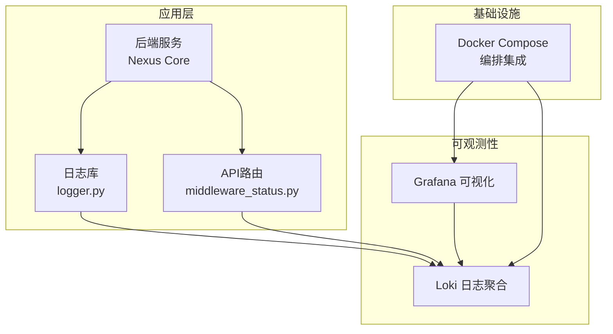
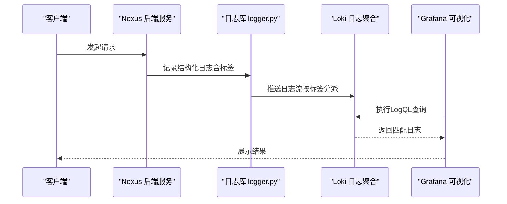
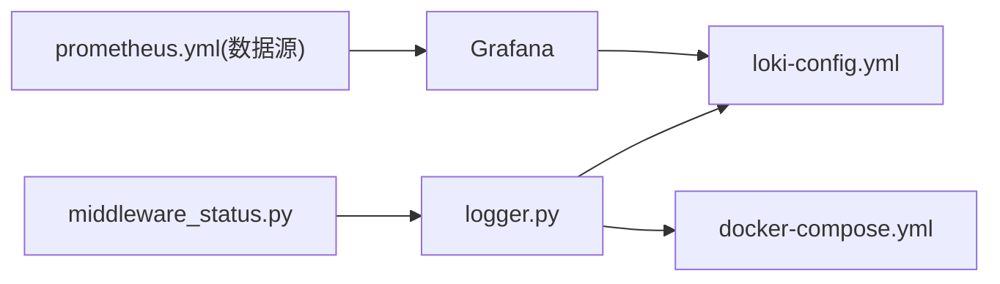

# 日志管理

<cite>
**本文引用的文件**   
- [config/loki/loki-config.yml](file://config/loki/loki-config.yml)
- [backend_design/nexus/core/logger.py](file://backend_design/nexus/core/logger.py)
- [backend_design/nexus/config.py](file://backend_design/nexus/config.py)
- [docker-compose.yml](file://docker-compose.yml)
- [config/grafana/provisioning/datasources/prometheus.yml](file://config/grafana/provisioning/datasources/prometheus.yml)
- [backend_design/nexus/api/routes/middleware_status.py](file://backend_design/nexus/api/routes/middleware_status.py)
- [backend_design/nexus/observability/data_retention.py](file://backend_design/nexus/observability/data_retention.py)
</cite>

## 目录
1. [简介](#简介)
2. [项目结构](#项目结构)
3. [核心组件](#核心组件)
4. [架构总览](#架构总览)
5. [详细组件分析](#详细组件分析)
6. [依赖关系分析](#依赖关系分析)
7. [性能考虑](#性能考虑)
8. [故障排查指南](#故障排查指南)
9. [结论](#结论)
10. [附录](#附录)

## 简介
本章节面向NexusCockpit系统的日志管理，围绕Loki日志聚合系统展开，涵盖以下方面：
- Loki配置与采集器设置
- 结构化日志规范与设计
- 日志查询与分析（LogQL、过滤技巧、性能分析方法）
- 日志生命周期管理（轮转策略、保留政策、存储优化）
- 调试与排障（常见错误模式、关联分析、定位方法）

## 项目结构
与日志相关的工程化配置与实现主要分布在如下位置：
- Loki服务端配置：config/loki/loki-config.yml
- 应用侧日志库与接入：backend_design/nexus/core/logger.py
- 服务配置入口：backend_design/nexus/config.py
- 容器编排与集成：docker-compose.yml
- Grafana数据源（用于可视化）：config/grafana/provisioning/datasources/prometheus.yml
- 中间件状态接口（便于观测与诊断）：backend_design/nexus/api/routes/middleware_status.py
- 数据保留策略参考实现：backend_design/nexus/observability/data_retention.py

图表来源
- [config/loki/loki-config.yml](file://config/loki/loki-config.yml)
- [backend_design/nexus/core/logger.py](file://backend_design/nexus/core/logger.py)
- [backend_design/nexus/api/routes/middleware_status.py](file://backend_design/nexus/api/routes/middleware_status.py)
- [docker-compose.yml](file://docker-compose.yml)
- [config/grafana/provisioning/datasources/prometheus.yml](file://config/grafana/provisioning/datasources/prometheus.yml)

章节来源
- [config/loki/loki-config.yml](file://config/loki/loki-config.yml)
- [backend_design/nexus/core/logger.py](file://backend_design/nexus/core/logger.py)
- [backend_design/nexus/config.py](file://backend_design/nexus/config.py)
- [docker-compose.yml](file://docker-compose.yml)
- [config/grafana/provisioning/datasources/prometheus.yml](file://config/grafana/provisioning/datasources/prometheus.yml)
- [backend_design/nexus/api/routes/middleware_status.py](file://backend_design/nexus/api/routes/middleware_status.py)
- [backend_design/nexus/observability/data_retention.py](file://backend_design/nexus/observability/data_retention.py)

## 核心组件
本节聚焦日志体系的关键组件及其职责：
- Loki服务端配置：定义存储、索引、分片、压缩、远端写入等参数，决定日志的采集、落盘与查询性能。
- 应用日志库：统一日志格式、标签（labels）、上下文注入（租户、会话、请求ID等），并对接Loki或本地输出。
- 容器编排：通过docker-compose将Loki、Grafana与应用服务组合部署，提供端到端链路。
- 数据保留策略：结合业务需求与存储成本，制定日志保留周期与清理策略。

章节来源
- [config/loki/loki-config.yml](file://config/loki/loki-config.yml)
- [backend_design/nexus/core/logger.py](file://backend_design/nexus/core/logger.py)
- [docker-compose.yml](file://docker-compose.yml)
- [backend_design/nexus/observability/data_retention.py](file://backend_design/nexus/observability/data_retention.py)

## 架构总览
下图展示从应用产生日志到Loki聚合、再到Grafana可视化的整体流程。

图表来源
- [backend_design/nexus/core/logger.py](file://backend_design/nexus/core/logger.py)
- [config/loki/loki-config.yml](file://config/loki/loki-config.yml)
- [config/grafana/provisioning/datasources/prometheus.yml](file://config/grafana/provisioning/datasources/prometheus.yml)

## 详细组件分析

### Loki服务端配置
- 关键维度
  - 存储与索引：包括块存储、索引类型、分片大小、压缩策略等，直接影响写入吞吐与查询延迟。
  - 采集与接收：HTTP/GRPC接收端点、批大小、超时、重试等。
  - 多租户与标签：标签键值设计、租户隔离、标签基数控制。
  - 远端写入与高可用：对象存储、复制因子、一致性级别。
- 建议实践
  - 合理设置块大小与压缩，平衡空间与查询性能。
  - 控制标签基数，避免高基数字段导致索引膨胀。
  - 为高频查询字段建立稳定标签，减少运行时计算。

章节来源
- [config/loki/loki-config.yml](file://config/loki/loki-config.yml)

### 应用侧日志库与结构化日志
- 职责
  - 统一日志格式：时间戳、级别、消息体、结构化字段。
  - 标签注入：服务名、实例、租户、会话、请求ID、模块等。
  - 输出目标：本地控制台/文件、Loki HTTP/GRPC、或同时双写。
- 设计要点
  - 使用固定标签集合，避免动态高基数字段。
  - 对敏感信息脱敏后再输出。
  - 在关键路径埋点，确保可追踪性（trace_id/span_id）。
- 复杂度与性能
  - 序列化与网络发送开销需评估；必要时采用异步队列与批量发送。
  - 控制日志级别与采样率，降低生产环境压力。

章节来源
- [backend_design/nexus/core/logger.py](file://backend_design/nexus/core/logger.py)
- [backend_design/nexus/config.py](file://backend_design/nexus/config.py)

### 容器编排与集成
- docker-compose负责拉起Loki、Grafana与应用服务，挂载必要卷与网络。
- 环境变量与端口映射应清晰，便于扩展与迁移。
- 健康检查与重启策略有助于提升可用性。

章节来源
- [docker-compose.yml](file://docker-compose.yml)

### 数据保留策略
- 目标
  - 满足合规与审计要求的同时，控制存储成本。
- 策略要素
  - 保留周期：按级别/模块/租户差异化保留。
  - 清理任务：定时扫描过期块/索引并删除。
  - 冷热分层：热数据快速查询，冷数据归档至低成本存储。
- 参考实现
  - 可参考现有数据保留模块的设计思路进行扩展。

章节来源
- [backend_design/nexus/observability/data_retention.py](file://backend_design/nexus/observability/data_retention.py)

### 日志查询与分析工具（LogQL）
- 基础语法
  - 选择器：基于标签过滤，如 {service="nexus", level="error"}。
  - 管道操作符：| json、| line_format、| drop、| keep等。
  - 聚合函数：count_over_time、sum_over_time、rate等。
- 过滤技巧
  - 优先使用稳定标签缩小范围，再在管道中进行文本过滤。
  - 避免全量扫描，尽量限定时间窗口与标签条件。
- 性能分析方法
  - 关注查询耗时与返回行数，逐步收紧条件。
  - 利用Grafana面板观察热点与异常时段。
  - 结合指标（如Loki查询延迟、CPU/内存）定位瓶颈。

[本节为概念性说明，不直接分析具体文件]

### 日志生命周期管理
- 采集阶段
  - 应用侧结构化输出，附带必要标签。
  - 可选本地缓冲与批量上报，降低抖动影响。
- 存储阶段
  - 根据Loki配置进行分片与压缩。
  - 控制标签基数，避免索引爆炸。
- 查询阶段
  - 使用高效选择器与管道，限制时间窗口。
- 清理阶段
  - 依据保留策略定期清理过期数据。
  - 监控存储空间与增长趋势，及时调整策略。

[本节为概念性说明，不直接分析具体文件]

### 调试与故障排查
- 常见问题模式
  - 标签基数过高导致查询缓慢或失败。
  - 日志未携带必要上下文（如请求ID），难以关联。
  - 网络抖动或Loki不可用导致丢日志。
- 关联分析方法
  - 以请求ID/会话ID作为主键串联上下游日志。
  - 结合中间件状态接口辅助定位问题边界。
- 定位步骤
  - 先通过稳定标签缩小范围，再逐步细化。
  - 对比正常与异常时段的差异（时间、标签、消息体）。
  - 查看Loki健康与指标，确认服务状态。

章节来源
- [backend_design/nexus/api/routes/middleware_status.py](file://backend_design/nexus/api/routes/middleware_status.py)

## 依赖关系分析
- 组件耦合
  - 应用日志库依赖Loki配置与服务发现。
  - Grafana依赖Loki数据源配置。
  - docker-compose协调各组件启动顺序与网络。
- 外部依赖
  - 对象存储（若启用远端写入）。
  - 操作系统文件系统（本地缓存/临时文件）。
- 潜在风险
  - 循环依赖应避免（当前未见）。
  - 高基数字段与大量并发写入可能引发性能退化。

图表来源
- [backend_design/nexus/core/logger.py](file://backend_design/nexus/core/logger.py)
- [config/loki/loki-config.yml](file://config/loki/loki-config.yml)
- [docker-compose.yml](file://docker-compose.yml)
- [config/grafana/provisioning/datasources/prometheus.yml](file://config/grafana/provisioning/datasources/prometheus.yml)
- [backend_design/nexus/api/routes/middleware_status.py](file://backend_design/nexus/api/routes/middleware_status.py)

章节来源
- [backend_design/nexus/core/logger.py](file://backend_design/nexus/core/logger.py)
- [config/loki/loki-config.yml](file://config/loki/loki-config.yml)
- [docker-compose.yml](file://docker-compose.yml)
- [config/grafana/provisioning/datasources/prometheus.yml](file://config/grafana/provisioning/datasources/prometheus.yml)
- [backend_design/nexus/api/routes/middleware_status.py](file://backend_design/nexus/api/routes/middleware_status.py)

## 性能考虑
- 写入优化
  - 批量发送与异步队列，减少频繁网络调用。
  - 控制日志级别与采样率，避免过度输出。
- 查询优化
  - 优先使用稳定标签与时间窗口。
  - 避免在管道中进行复杂正则匹配，尽量前置过滤。
- 存储优化
  - 调整块大小与压缩比，权衡空间与查询速度。
  - 定期清理过期数据，监控磁盘使用率。
- 容量规划
  - 预估日增日志量与保留周期，规划存储与节点规模。
  - 引入冷热分层与归档策略降低成本。

[本节为通用指导，不直接分析具体文件]

## 故障排查指南
- 快速定位
  - 使用稳定标签+时间窗口缩小范围。
  - 借助中间件状态接口验证服务健康与依赖连通性。
- 关联分析
  - 以请求ID/会话ID贯穿上下游日志，形成完整链路。
  - 对比不同实例/租户的差异，识别局部问题。
- 常见问题
  - 标签基数过高：审查动态标签来源，收敛为枚举或哈希。
  - 日志缺失：检查网络、Loki健康、应用日志输出目标。
  - 查询慢：优化选择器与管道，增加索引友好标签。
- 恢复与回滚
  - 临时降级日志级别或关闭非关键日志。
  - 回滚最近变更的配置或代码，验证是否恢复。

章节来源
- [backend_design/nexus/api/routes/middleware_status.py](file://backend_design/nexus/api/routes/middleware_status.py)

## 结论
通过统一的Loki配置、结构化日志设计与合理的生命周期管理，NexusCockpit可实现高效、可观测且可控成本的日志体系。配合LogQL与Grafana，能够快速定位问题、分析性能瓶颈，并为后续扩展（如多租户、冷热分层、远端归档）奠定基础。

[本节为总结性内容，不直接分析具体文件]

## 附录
- 术语
  - 标签（Labels）：用于筛选与聚合的键值对。
  - 块（Block）：Loki中日志数据的物理组织单元。
  - LogQL：Loki的查询语言。
- 最佳实践清单
  - 固定标签集合，避免高基数。
  - 结构化输出，包含必要上下文。
  - 合理保留周期与清理策略。
  - 持续监控存储与查询性能。

[本节为补充信息，不直接分析具体文件]