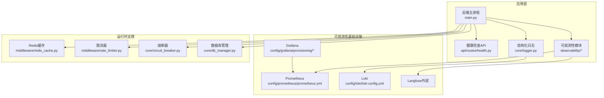
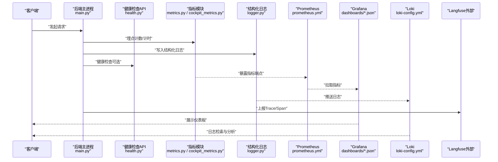
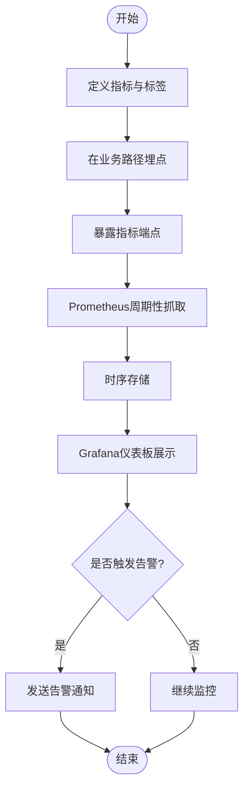
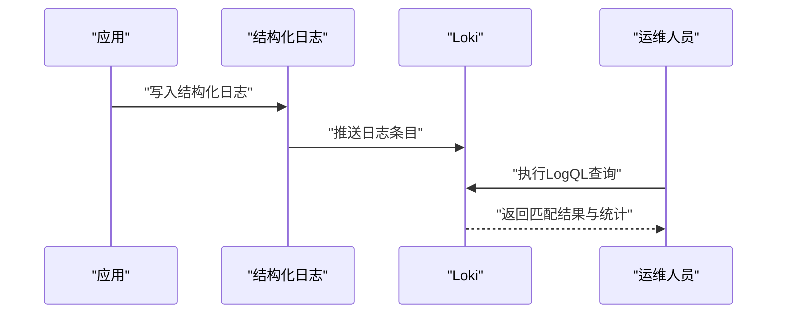
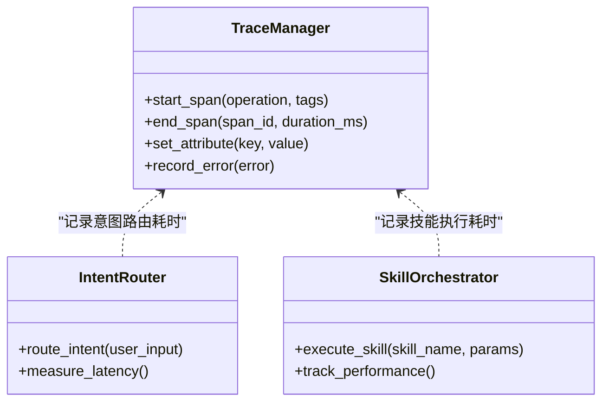
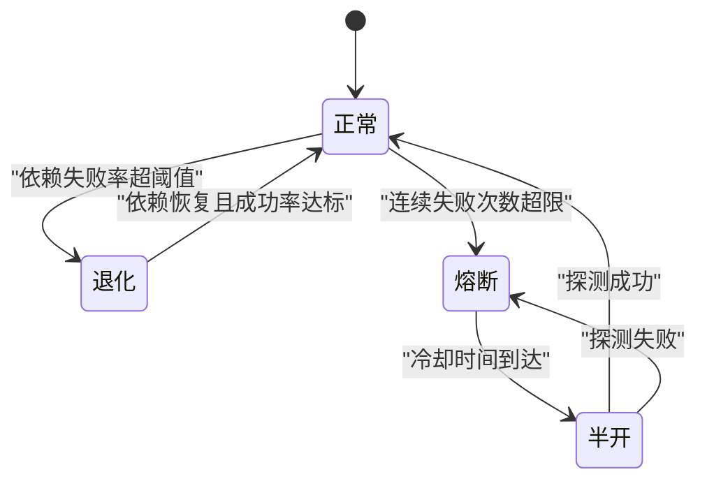
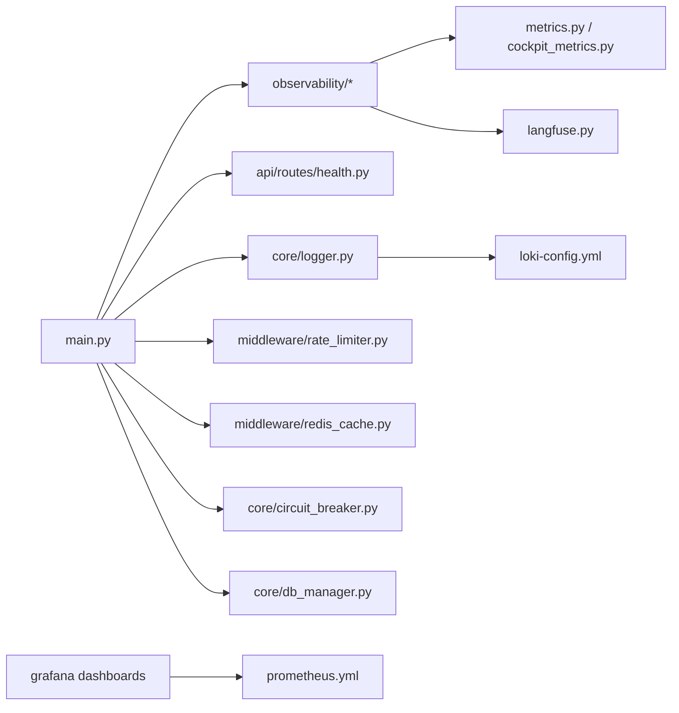

# 监控和运维

<cite>
**本文引用的文件**   
- [backend_design/nexus/observability/metrics.py](file://backend_design/nexus/observability/metrics.py)
- [backend_design/nexus/observability/cockpit_metrics.py](file://backend_design/nexus/observability/cockpit_metrics.py)
- [backend_design/nexus/observability/langfuse.py](file://backend_design/nexus/observability/langfuse.py)
- [backend_design/nexus/observability/data_retention.py](file://backend_design/nexus/observability/data_retention.py)
- [backend_design/nexus/api/routes/health.py](file://backend_design/nexus/api/routes/health.py)
- [backend_design/nexus/core/logger.py](file://backend_design/nexus/core/logger.py)
- [config/prometheus/prometheus.yml](file://config/prometheus/prometheus.yml)
- [config/grafana/provisioning/datasources/prometheus.yml](file://config/grafana/provisioning/datasources/prometheus.yml)
- [config/grafana/provisioning/dashboards/dashboards.yml](file://config/grafana/provisioning/dashboards/dashboards.yml)
- [config/grafana/provisioning/dashboards/nexuscockpit-overview.json](file://config/grafana/provisioning/dashboards/nexuscockpit-overview.json)
- [config/loki/loki-config.yml](file://config/loki/loki-config.yml)
- [docker-compose.yml](file://docker-compose.yml)
- [backend_design/nexus/main.py](file://backend_design/nexus/main.py)
- [backend_design/nexus/config.py](file://backend_design/nexus/config.py)
- [backend_design/nexus/core/circuit_breaker.py](file://backend_design/nexus/core/circuit_breaker.py)
- [backend_design/nexus/middleware/rate_limiter.py](file://backend_design/nexus/middleware/rate_limiter.py)
- [backend_design/nexus/middleware/redis_cache.py](file://backend_design/nexus/middleware/redis_cache.py)
- [backend_design/nexus/core/db_manager.py](file://backend_design/nexus/core/db_manager.py)
- [backend_design/nexus/intent/llm_router.py](file://backend_design/nexus/intent/llm_router.py)
- [backend_design/nexus/skills/orchestrator.py](file://backend_design/nexus/skills/orchestrator.py)
- [scripts/test_metrics.py](file://scripts/test_metrics.py)
</cite>

## 目录
1. [简介](#简介)
2. [项目结构](#项目结构)
3. [核心组件](#核心组件)
4. [架构总览](#架构总览)
5. [详细组件分析](#详细组件分析)
6. [依赖关系分析](#依赖关系分析)
7. [性能与容量规划](#性能与容量规划)
8. [故障排查指南](#故障排查指南)
9. [结论](#结论)
10. [附录](#附录)

## 简介
本章节面向NexusCockpit系统的监控与运维，覆盖以下方面：
- 指标采集与可视化：Prometheus指标收集、Grafana仪表板配置与展示
- 日志系统：Loki聚合、结构化日志格式、查询与分析
- 分布式追踪：Langfuse集成、链路追踪与瓶颈定位
- 健康检查：服务健康状态、依赖检查与自动恢复策略
- 容量规划与弹性伸缩：资源监控、扩缩容与负载均衡
- 故障排查：常见问题诊断方法与排障流程

## 项目结构
与监控和运维相关的代码与配置主要分布在以下位置：
- 后端可观测性模块：metrics、cockpit_metrics、langfuse、data_retention
- API健康检查路由：health
- 结构化日志：core.logger
- Prometheus/Grafana/Loki配置：config目录下对应配置文件
- 编排与部署：docker-compose.yml
- 关键业务入口与配置：main.py、config.py
- 中间件与稳定性机制：circuit_breaker、rate_limiter、redis_cache、db_manager
- 意图路由与技能编排：intent.llm_router、skills.orchestrator
- 测试脚本：test_metrics.py

图表来源
- [backend_design/nexus/main.py](file://backend_design/nexus/main.py)
- [backend_design/nexus/api/routes/health.py](file://backend_design/nexus/api/routes/health.py)
- [backend_design/nexus/observability/metrics.py](file://backend_design/nexus/observability/metrics.py)
- [backend_design/nexus/observability/cockpit_metrics.py](file://backend_design/nexus/observability/cockpit_metrics.py)
- [backend_design/nexus/observability/langfuse.py](file://backend_design/nexus/observability/langfuse.py)
- [backend_design/nexus/core/logger.py](file://backend_design/nexus/core/logger.py)
- [config/prometheus/prometheus.yml](file://config/prometheus/prometheus.yml)
- [config/grafana/provisioning/datasources/prometheus.yml](file://config/grafana/provisioning/datasources/prometheus.yml)
- [config/grafana/provisioning/dashboards/dashboards.yml](file://config/grafana/provisioning/dashboards/dashboards.yml)
- [config/grafana/provisioning/dashboards/nexuscockpit-overview.json](file://config/grafana/provisioning/dashboards/nexuscockpit-overview.json)
- [config/loki/loki-config.yml](file://config/loki/loki-config.yml)
- [backend_design/nexus/middleware/rate_limiter.py](file://backend_design/nexus/middleware/rate_limiter.py)
- [backend_design/nexus/middleware/redis_cache.py](file://backend_design/nexus/middleware/redis_cache.py)
- [backend_design/nexus/core/circuit_breaker.py](file://backend_design/nexus/core/circuit_breaker.py)
- [backend_design/nexus/core/db_manager.py](file://backend_design/nexus/core/db_manager.py)

章节来源
- [docker-compose.yml](file://docker-compose.yml)
- [backend_design/nexus/main.py](file://backend_design/nexus/main.py)
- [backend_design/nexus/config.py](file://backend_design/nexus/config.py)

## 核心组件
本节聚焦于指标、日志、追踪与健康检查四大可观测性支柱的实现要点。

- 指标体系
  - 通用指标封装：提供统一的指标注册、计数、计时与直方图能力，便于在业务路径中埋点
  - 领域指标：针对Cockpit场景的专用指标（如会话、技能调用、意图路由等），细化到维度标签
  - 暴露端点：通过HTTP端点对外暴露指标，供Prometheus抓取
  - 参考实现路径：
    - [backend_design/nexus/observability/metrics.py](file://backend_design/nexus/observability/metrics.py)
    - [backend_design/nexus/observability/cockpit_metrics.py](file://backend_design/nexus/observability/cockpit_metrics.py)

- 日志系统
  - 结构化日志：统一日志格式，包含时间戳、级别、请求ID、租户、用户、模块等字段
  - 输出目标：默认控制台输出，同时支持对接Loki进行集中化采集
  - 参考实现路径：
    - [backend_design/nexus/core/logger.py](file://backend_design/nexus/core/logger.py)

- 分布式追踪
  - Langfuse集成：为LLM相关调用生成trace/span，记录输入输出、耗时、模型参数等
  - 使用方式：在关键调用前后创建span并上报，结合上下文传播实现端到端追踪
  - 参考实现路径：
    - [backend_design/nexus/observability/langfuse.py](file://backend_design/nexus/observability/langfuse.py)

- 数据保留策略
  - 指标与日志数据的生命周期管理，包括过期清理与归档策略
  - 参考实现路径：
    - [backend_design/nexus/observability/data_retention.py](file://backend_design/nexus/observability/data_retention.py)

- 健康检查
  - 提供健康检查接口，返回服务状态与依赖检查结果
  - 参考实现路径：
    - [backend_design/nexus/api/routes/health.py](file://backend_design/nexus/api/routes/health.py)

章节来源
- [backend_design/nexus/observability/metrics.py](file://backend_design/nexus/observability/metrics.py)
- [backend_design/nexus/observability/cockpit_metrics.py](file://backend_design/nexus/observability/cockpit_metrics.py)
- [backend_design/nexus/observability/langfuse.py](file://backend_design/nexus/observability/langfuse.py)
- [backend_design/nexus/observability/data_retention.py](file://backend_design/nexus/observability/data_retention.py)
- [backend_design/nexus/core/logger.py](file://backend_design/nexus/core/logger.py)
- [backend_design/nexus/api/routes/health.py](file://backend_design/nexus/api/routes/health.py)

## 架构总览
下图展示了从应用层到可观测性基础设施的整体交互关系，以及关键中间件对稳定性的保障。

图表来源
- [backend_design/nexus/main.py](file://backend_design/nexus/main.py)
- [backend_design/nexus/api/routes/health.py](file://backend_design/nexus/api/routes/health.py)
- [backend_design/nexus/observability/metrics.py](file://backend_design/nexus/observability/metrics.py)
- [backend_design/nexus/observability/cockpit_metrics.py](file://backend_design/nexus/observability/cockpit_metrics.py)
- [backend_design/nexus/core/logger.py](file://backend_design/nexus/core/logger.py)
- [config/prometheus/prometheus.yml](file://config/prometheus/prometheus.yml)
- [config/grafana/provisioning/datasources/prometheus.yml](file://config/grafana/provisioning/datasources/prometheus.yml)
- [config/grafana/provisioning/dashboards/dashboards.yml](file://config/grafana/provisioning/dashboards/dashboards.yml)
- [config/grafana/provisioning/dashboards/nexuscockpit-overview.json](file://config/grafana/provisioning/dashboards/nexuscockpit-overview.json)
- [config/loki/loki-config.yml](file://config/loki/loki-config.yml)
- [backend_design/nexus/observability/langfuse.py](file://backend_design/nexus/observability/langfuse.py)

## 详细组件分析

### 指标采集与可视化（Prometheus + Grafana）
- 指标定义与埋点
  - 通用计数器与时序指标：用于统计请求量、错误数、处理时长分布等
  - Cockpit领域指标：围绕会话、技能、意图、车辆控制等维度的细分指标
  - 标签设计：建议包含模块、方法、状态码、租户、用户等维度，便于多维分析
- 暴露与抓取
  - 应用侧暴露指标HTTP端点
  - Prometheus按配置周期抓取指标
- 可视化与告警
  - Grafana数据源指向Prometheus
  - 预置仪表板：nexuscockpit-overview.json提供概览视图
  - 告警规则：基于阈值或趋势变化触发告警（例如P99延迟、错误率、饱和度）

图表来源
- [backend_design/nexus/observability/metrics.py](file://backend_design/nexus/observability/metrics.py)
- [backend_design/nexus/observability/cockpit_metrics.py](file://backend_design/nexus/observability/cockpit_metrics.py)
- [config/prometheus/prometheus.yml](file://config/prometheus/prometheus.yml)
- [config/grafana/provisioning/datasources/prometheus.yml](file://config/grafana/provisioning/datasources/prometheus.yml)
- [config/grafana/provisioning/dashboards/dashboards.yml](file://config/grafana/provisioning/dashboards/dashboards.yml)
- [config/grafana/provisioning/dashboards/nexuscockpit-overview.json](file://config/grafana/provisioning/dashboards/nexuscockpit-overview.json)

章节来源
- [backend_design/nexus/observability/metrics.py](file://backend_design/nexus/observability/metrics.py)
- [backend_design/nexus/observability/cockpit_metrics.py](file://backend_design/nexus/observability/cockpit_metrics.py)
- [config/prometheus/prometheus.yml](file://config/prometheus/prometheus.yml)
- [config/grafana/provisioning/datasources/prometheus.yml](file://config/grafana/provisioning/datasources/prometheus.yml)
- [config/grafana/provisioning/dashboards/dashboards.yml](file://config/grafana/provisioning/dashboards/dashboards.yml)
- [config/grafana/provisioning/dashboards/nexuscockpit-overview.json](file://config/grafana/provisioning/dashboards/nexuscockpit-overview.json)

### 日志收集与分析（Loki + 结构化日志）
- 结构化日志格式
  - 统一字段：时间戳、级别、请求ID、租户、用户、模块、消息体等
  - 便于索引与检索，提升查询效率
- 采集与聚合
  - 应用侧输出结构化日志
  - Loki作为日志聚合与索引后端
- 查询与分析
  - 使用LogQL进行过滤、聚合与关联分析
  - 结合请求ID将日志与追踪关联，形成闭环

图表来源
- [backend_design/nexus/core/logger.py](file://backend_design/nexus/core/logger.py)
- [config/loki/loki-config.yml](file://config/loki/loki-config.yml)

章节来源
- [backend_design/nexus/core/logger.py](file://backend_design/nexus/core/logger.py)
- [config/loki/loki-config.yml](file://config/loki/loki-config.yml)

### 分布式追踪（Langfuse）
- 集成方式
  - 在关键调用前后创建span，记录输入输出、耗时、模型参数等
  - 通过上下文传播实现跨服务链路追踪
- 使用场景
  - LLM调用链路：意图识别、RAG检索、TTS/ASR处理
  - 技能编排：多步骤任务的性能瓶颈定位
- 分析与优化
  - 结合指标与日志，定位慢调用与异常分支
  - 调整模型参数或降级策略以提升整体时延

图表来源
- [backend_design/nexus/observability/langfuse.py](file://backend_design/nexus/observability/langfuse.py)
- [backend_design/nexus/intent/llm_router.py](file://backend_design/nexus/intent/llm_router.py)
- [backend_design/nexus/skills/orchestrator.py](file://backend_design/nexus/skills/orchestrator.py)

章节来源
- [backend_design/nexus/observability/langfuse.py](file://backend_design/nexus/observability/langfuse.py)
- [backend_design/nexus/intent/llm_router.py](file://backend_design/nexus/intent/llm_router.py)
- [backend_design/nexus/skills/orchestrator.py](file://backend_design/nexus/skills/orchestrator.py)

### 健康检查与自动恢复
- 健康检查接口
  - 返回服务自身状态与依赖检查结果（数据库、缓存、外部服务）
  - 支持就绪探针与存活探针，配合容器编排进行自愈
- 自动恢复策略
  - 熔断器：当依赖服务失败率超过阈值时快速失败，避免雪崩
  - 重试与退避：对瞬时错误进行有限次重试与指数退避
  - 限流：保护上游与下游，防止过载

图表来源
- [backend_design/nexus/api/routes/health.py](file://backend_design/nexus/api/routes/health.py)
- [backend_design/nexus/core/circuit_breaker.py](file://backend_design/nexus/core/circuit_breaker.py)
- [backend_design/nexus/middleware/rate_limiter.py](file://backend_design/nexus/middleware/rate_limiter.py)

章节来源
- [backend_design/nexus/api/routes/health.py](file://backend_design/nexus/api/routes/health.py)
- [backend_design/nexus/core/circuit_breaker.py](file://backend_design/nexus/core/circuit_breaker.py)
- [backend_design/nexus/middleware/rate_limiter.py](file://backend_design/nexus/middleware/rate_limiter.py)

### 数据保留与清理策略
- 指标与日志的生命周期管理
  - 设置保留窗口与归档策略，避免无限增长
  - 定期清理过期数据，降低存储成本
- 参考实现路径
  - [backend_design/nexus/observability/data_retention.py](file://backend_design/nexus/observability/data_retention.py)

章节来源
- [backend_design/nexus/observability/data_retention.py](file://backend_design/nexus/observability/data_retention.py)

## 依赖关系分析
- 组件耦合与内聚
  - 可观测性模块相对独立，通过统一接口被业务层调用
  - 健康检查与中间件（熔断、限流、缓存）共同保障稳定性
- 外部依赖
  - Prometheus、Grafana、Loki、Langfuse为外部系统，需确保网络可达与配置正确
- 潜在循环依赖
  - 可观测性模块应避免反向依赖业务逻辑，保持单向引用

图表来源
- [backend_design/nexus/main.py](file://backend_design/nexus/main.py)
- [backend_design/nexus/observability/metrics.py](file://backend_design/nexus/observability/metrics.py)
- [backend_design/nexus/observability/cockpit_metrics.py](file://backend_design/nexus/observability/cockpit_metrics.py)
- [backend_design/nexus/observability/langfuse.py](file://backend_design/nexus/observability/langfuse.py)
- [backend_design/nexus/core/logger.py](file://backend_design/nexus/core/logger.py)
- [backend_design/nexus/api/routes/health.py](file://backend_design/nexus/api/routes/health.py)
- [backend_design/nexus/middleware/rate_limiter.py](file://backend_design/nexus/middleware/rate_limiter.py)
- [backend_design/nexus/middleware/redis_cache.py](file://backend_design/nexus/middleware/redis_cache.py)
- [backend_design/nexus/core/circuit_breaker.py](file://backend_design/nexus/core/circuit_breaker.py)
- [backend_design/nexus/core/db_manager.py](file://backend_design/nexus/core/db_manager.py)
- [config/prometheus/prometheus.yml](file://config/prometheus/prometheus.yml)
- [config/grafana/provisioning/dashboards/dashboards.yml](file://config/grafana/provisioning/dashboards/dashboards.yml)
- [config/loki/loki-config.yml](file://config/loki/loki-config.yml)

章节来源
- [backend_design/nexus/main.py](file://backend_design/nexus/main.py)
- [backend_design/nexus/config.py](file://backend_design/nexus/config.py)

## 性能与容量规划
- 资源监控
  - CPU、内存、磁盘、网络等基础指标纳入Prometheus监控
  - 应用级指标：QPS、P95/P99延迟、错误率、连接池饱和度
- 弹性伸缩
  - 基于CPU/内存或自定义指标（如队列长度、错误率）触发水平扩容
  - 容器编排平台（Kubernetes/Docker Compose）配合HPA或手动扩缩容
- 负载均衡
  - 网关层或服务网格进行流量分发，避免单点过载
  - 结合熔断与限流，保护下游依赖
- 容量规划建议
  - 压测基线：确定不同负载下的资源消耗曲线
  - 预留冗余：峰值负载下仍保持一定余量
  - 数据保留：合理设置指标与日志保留窗口，平衡成本与可追溯性

[本节为通用指导，不直接分析具体文件]

## 故障排查指南
- 指标异常
  - 现象：错误率上升、延迟升高、饱和度接近上限
  - 排查：查看Grafana仪表板，定位异常时间段；结合LogQL检索相关日志
  - 参考路径：
    - [config/grafana/provisioning/dashboards/nexuscockpit-overview.json](file://config/grafana/provisioning/dashboards/nexuscockpit-overview.json)
    - [config/prometheus/prometheus.yml](file://config/prometheus/prometheus.yml)
- 日志问题
  - 现象：日志缺失、格式不一致、无法检索
  - 排查：确认结构化日志字段完整；检查Loki配置与采集链路
  - 参考路径：
    - [backend_design/nexus/core/logger.py](file://backend_design/nexus/core/logger.py)
    - [config/loki/loki-config.yml](file://config/loki/loki-config.yml)
- 追踪断链
  - 现象：Langfuse无trace或span不完整
  - 排查：确认上下文传播与span创建时机；检查外部服务连通性与鉴权
  - 参考路径：
    - [backend_design/nexus/observability/langfuse.py](file://backend_design/nexus/observability/langfuse.py)
- 健康检查失败
  - 现象：就绪探针失败、服务不可用
  - 排查：检查依赖服务状态、熔断器状态、限流器阈值
  - 参考路径：
    - [backend_design/nexus/api/routes/health.py](file://backend_design/nexus/api/routes/health.py)
    - [backend_design/nexus/core/circuit_breaker.py](file://backend_design/nexus/core/circuit_breaker.py)
    - [backend_design/nexus/middleware/rate_limiter.py](file://backend_design/nexus/middleware/rate_limiter.py)
- 指标测试
  - 使用测试脚本验证指标端点可用性与数据完整性
  - 参考路径：
    - [scripts/test_metrics.py](file://scripts/test_metrics.py)

章节来源
- [config/grafana/provisioning/dashboards/nexuscockpit-overview.json](file://config/grafana/provisioning/dashboards/nexuscockpit-overview.json)
- [config/prometheus/prometheus.yml](file://config/prometheus/prometheus.yml)
- [backend_design/nexus/core/logger.py](file://backend_design/nexus/core/logger.py)
- [config/loki/loki-config.yml](file://config/loki/loki-config.yml)
- [backend_design/nexus/observability/langfuse.py](file://backend_design/nexus/observability/langfuse.py)
- [backend_design/nexus/api/routes/health.py](file://backend_design/nexus/api/routes/health.py)
- [backend_design/nexus/core/circuit_breaker.py](file://backend_design/nexus/core/circuit_breaker.py)
- [backend_design/nexus/middleware/rate_limiter.py](file://backend_design/nexus/middleware/rate_limiter.py)
- [scripts/test_metrics.py](file://scripts/test_metrics.py)

## 结论
NexusCockpit的可观测性体系以指标、日志、追踪为核心，辅以健康检查与稳定性中间件，形成完整的监控与运维闭环。通过Prometheus与Grafana实现指标可视化与告警，Loki提供结构化日志聚合与查询，Langfuse支撑LLM链路追踪与性能分析。结合熔断、限流与缓存等机制，系统在复杂环境下具备较强的韧性与可维护性。建议在持续演进中完善告警规则、优化指标粒度与日志字段，并建立容量规划与弹性伸缩策略，以保障高可用与高性能。

[本节为总结性内容，不直接分析具体文件]

## 附录
- 部署与运行
  - 使用docker-compose编排应用与可观测性组件，确保端口与网络互通
  - 参考路径：
    - [docker-compose.yml](file://docker-compose.yml)
- 配置项
  - 应用配置与可观测性开关可通过配置文件管理
  - 参考路径：
    - [backend_design/nexus/config.py](file://backend_design/nexus/config.py)

章节来源
- [docker-compose.yml](file://docker-compose.yml)
- [backend_design/nexus/config.py](file://backend_design/nexus/config.py)