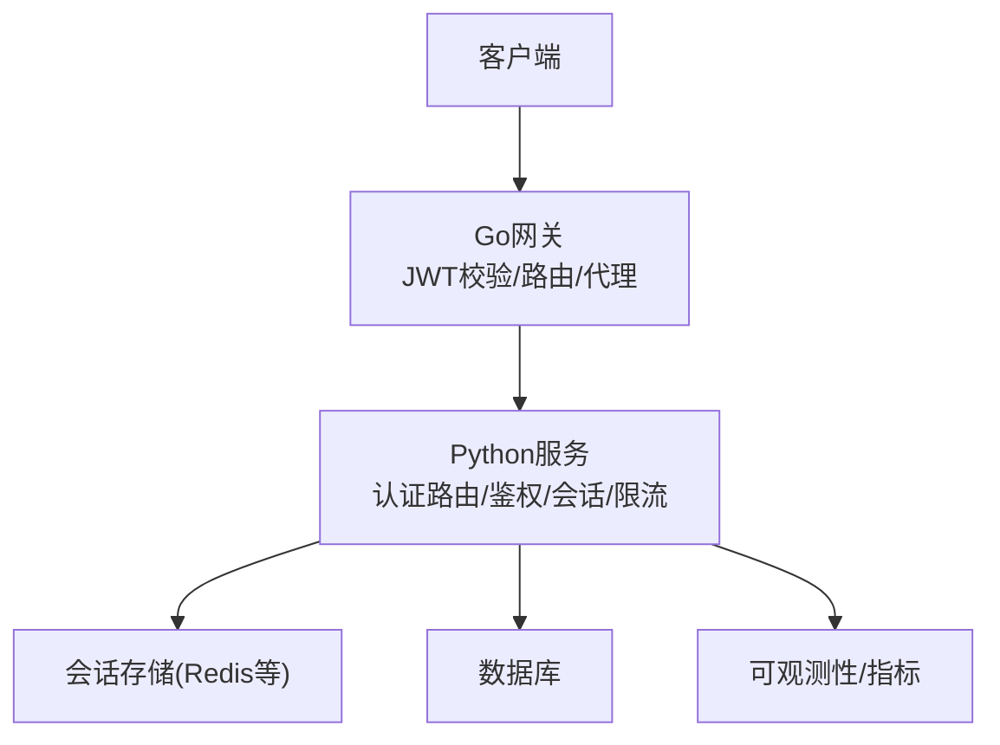
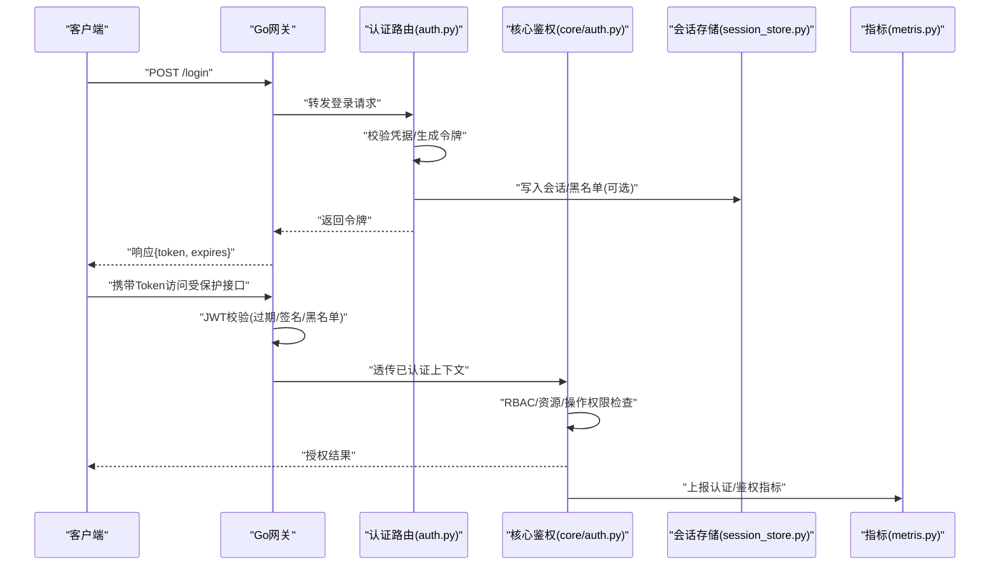
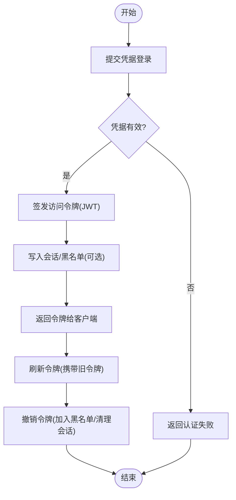
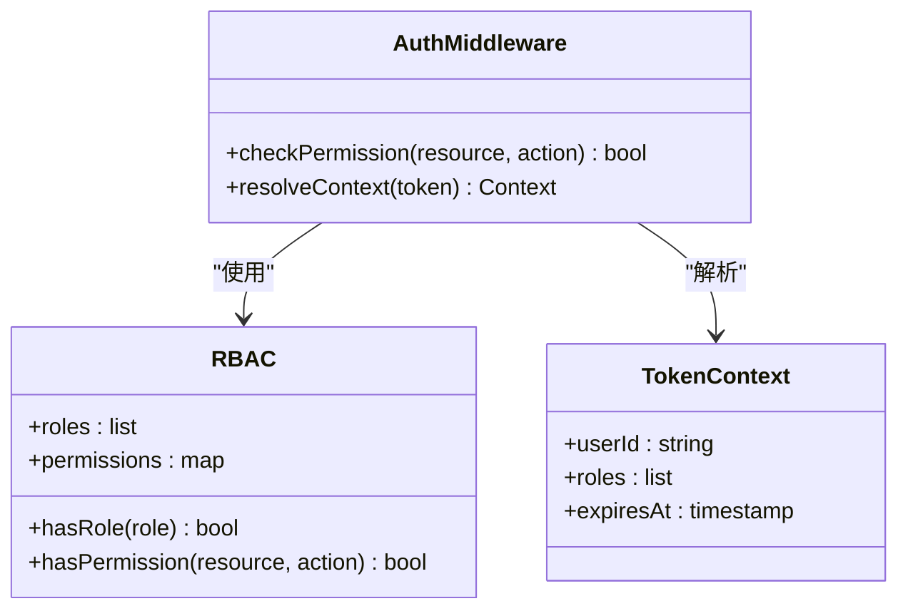
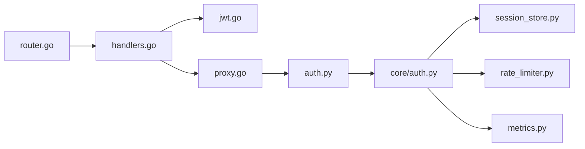

# API安全与认证

<cite>
**本文引用的文件**   
- [backend_design/nexus/api/routes/auth.py](file://backend_design/nexus/api/routes/auth.py)
- [backend_design/nexus/core/auth.py](file://backend_design/nexus/core/auth.py)
- [backend_design/nexus/middleware/session_store.py](file://backend_design/nexus/middleware/session_store.py)
- [backend_design/nexus/middleware/rate_limiter.py](file://backend_design/nexus/middleware/rate_limiter.py)
- [backend_design/nexus/config.py](file://backend_design/nexus/config.py)
- [backend_design/nexus/main.py](file://backend_design/nexus/main.py)
- [backend_design/nexus_gate/internal/auth/jwt.go](file://backend_design/nexus_gate/internal/auth/jwt.go)
- [backend_design/nexus_gate/internal/handlers/handlers.go](file://backend_design/nexus_gate/internal/handlers/handlers.go)
- [backend_design/nexus_gate/internal/proxy/proxy.go](file://backend_design/nexus_gate/internal/proxy/proxy.go)
- [backend_design/nexus_gate/internal/router/router.go](file://backend_design/nexus_gate/internal/router/router.go)
- [backend_design/nexus/observability/metrics.py](file://backend_design/nexus/observability/metrics.py)
</cite>

## 目录
1. [简介](#简介)
2. [项目结构](#项目结构)
3. [核心组件](#核心组件)
4. [架构总览](#架构总览)
5. [详细组件分析](#详细组件分析)
6. [依赖关系分析](#依赖关系分析)
7. [性能与安全权衡](#性能与安全权衡)
8. [故障排查指南](#故障排查指南)
9. [结论](#结论)
10. [附录](#附录)

## 简介
本文件面向NexusCockpit系统的API安全与认证，聚焦以下目标：
- 身份认证机制：用户登录、令牌签发、令牌刷新与撤销流程
- 权限控制模型：基于角色的访问控制（RBAC）、资源权限与操作权限管理
- API安全防护：请求签名验证、防重放攻击、SQL注入防护、XSS防护
- 敏感数据处理：密码加密存储、传输加密、日志脱敏
- 安全最佳实践：输入验证、输出编码、安全头设置
- 安全监控与审计：登录日志记录、异常行为检测与告警通知

## 项目结构
与认证和安全相关的后端代码主要分布在Python服务与Go网关两个子系统中：
- Python服务（业务层）
  - 认证路由与鉴权中间件：auth路由、核心鉴权逻辑、会话存储、限流中间件
  - 配置与主入口：全局配置、应用启动与中间件注册
- Go网关（边缘层）
  - JWT校验、反向代理、路由与处理器
  - 负责在网关侧进行JWT校验与转发，减轻业务层负担

图表来源
- [backend_design/nexus_gate/internal/router/router.go](file://backend_design/nexus_gate/internal/router/router.go)
- [backend_design/nexus_gate/internal/handlers/handlers.go](file://backend_design/nexus_gate/internal/handlers/handlers.go)
- [backend_design/nexus_gate/internal/proxy/proxy.go](file://backend_design/nexus_gate/internal/proxy/proxy.go)
- [backend_design/nexus/main.py](file://backend_design/nexus/main.py)
- [backend_design/nexus/middleware/session_store.py](file://backend_design/nexus/middleware/session_store.py)
- [backend_design/nexus/observability/metrics.py](file://backend_design/nexus/observability/metrics.py)

章节来源
- [backend_design/nexus/main.py](file://backend_design/nexus/main.py)
- [backend_design/nexus_gate/internal/router/router.go](file://backend_design/nexus_gate/internal/router/router.go)

## 核心组件
- 认证路由与流程
  - 提供登录、令牌签发、刷新与撤销接口
  - 参考路径：[backend_design/nexus/api/routes/auth.py](file://backend_design/nexus/api/routes/auth.py)
- 核心鉴权逻辑
  - 解析并校验令牌、上下文注入、权限检查
  - 参考路径：[backend_design/nexus/core/auth.py](file://backend_design/nexus/core/auth.py)
- 会话存储
  - 用于会话状态、黑名单或短期令牌缓存
  - 参考路径：[backend_design/nexus/middleware/session_store.py](file://backend_design/nexus/middleware/session_store.py)
- 速率限制
  - 防止暴力破解与重放滥用
  - 参考路径：[backend_design/nexus/middleware/rate_limiter.py](file://backend_design/nexus/middleware/rate_limiter.py)
- 网关JWT校验与代理
  - 在网关层完成JWT校验与转发，统一入口安全策略
  - 参考路径：
    - [backend_design/nexus_gate/internal/auth/jwt.go](file://backend_design/nexus_gate/internal/auth/jwt.go)
    - [backend_design/nexus_gate/internal/handlers/handlers.go](file://backend_design/nexus_gate/internal/handlers/handlers.go)
    - [backend_design/nexus_gate/internal/proxy/proxy.go](file://backend_design/nexus_gate/internal/proxy/proxy.go)
    - [backend_design/nexus_gate/internal/router/router.go](file://backend_design/nexus_gate/internal/router/router.go)
- 配置与可观测性
  - 安全相关配置项与指标上报
  - 参考路径：
    - [backend_design/nexus/config.py](file://backend_design/nexus/config.py)
    - [backend_design/nexus/observability/metrics.py](file://backend_design/nexus/observability/metrics.py)

章节来源
- [backend_design/nexus/api/routes/auth.py](file://backend_design/nexus/api/routes/auth.py)
- [backend_design/nexus/core/auth.py](file://backend_design/nexus/core/auth.py)
- [backend_design/nexus/middleware/session_store.py](file://backend_design/nexus/middleware/session_store.py)
- [backend_design/nexus/middleware/rate_limiter.py](file://backend_design/nexus/middleware/rate_limiter.py)
- [backend_design/nexus_gate/internal/auth/jwt.go](file://backend_design/nexus_gate/internal/auth/jwt.go)
- [backend_design/nexus_gate/internal/handlers/handlers.go](file://backend_design/nexus_gate/internal/handlers/handlers.go)
- [backend_design/nexus_gate/internal/proxy/proxy.go](file://backend_design/nexus_gate/internal/proxy/proxy.go)
- [backend_design/nexus_gate/internal/router/router.go](file://backend_design/nexus_gate/internal/router/router.go)
- [backend_design/nexus/config.py](file://backend_design/nexus/config.py)
- [backend_design/nexus/observability/metrics.py](file://backend_design/nexus/observability/metrics.py)

## 架构总览
整体采用“网关前置校验 + 业务层细粒度鉴权”的分层安全架构。Go网关负责JWT校验、路由分发与反代；Python服务负责业务鉴权、会话管理与安全中间件。

图表来源
- [backend_design/nexus/api/routes/auth.py](file://backend_design/nexus/api/routes/auth.py)
- [backend_design/nexus/core/auth.py](file://backend_design/nexus/core/auth.py)
- [backend_design/nexus/middleware/session_store.py](file://backend_design/nexus/middleware/session_store.py)
- [backend_design/nexus/observability/metrics.py](file://backend_design/nexus/observability/metrics.py)
- [backend_design/nexus_gate/internal/auth/jwt.go](file://backend_design/nexus_gate/internal/auth/jwt.go)
- [backend_design/nexus_gate/internal/handlers/handlers.go](file://backend_design/nexus_gate/internal/handlers/handlers.go)
- [backend_design/nexus_gate/internal/proxy/proxy.go](file://backend_design/nexus_gate/internal/proxy/proxy.go)
- [backend_design/nexus_gate/internal/router/router.go](file://backend_design/nexus_gate/internal/router/router.go)

## 详细组件分析

### 身份认证流程（登录、签发、刷新、撤销）
- 登录
  - 客户端提交用户名/密码至认证路由
  - 路由层校验凭据，成功则签发短期访问令牌（JWT），必要时写入会话存储
  - 参考路径：[backend_design/nexus/api/routes/auth.py](file://backend_design/nexus/api/routes/auth.py)
- 令牌签发
  - 使用网关或业务层密钥对签发JWT，包含必要声明（如用户标识、角色、过期时间）
  - 参考路径：
    - [backend_design/nexus_gate/internal/auth/jwt.go](file://backend_design/nexus_gate/internal/auth/jwt.go)
    - [backend_design/nexus/api/routes/auth.py](file://backend_design/nexus/api/routes/auth.py)
- 令牌刷新
  - 客户端携带有效访问令牌申请新令牌，服务端校验后签发新的短期令牌
  - 参考路径：[backend_design/nexus/api/routes/auth.py](file://backend_design/nexus/api/routes/auth.py)
- 令牌撤销
  - 支持将令牌加入黑名单或清除会话，使后续请求被拒绝
  - 参考路径：
    - [backend_design/nexus/middleware/session_store.py](file://backend_design/nexus/middleware/session_store.py)
    - [backend_design/nexus_gate/internal/auth/jwt.go](file://backend_design/nexus_gate/internal/auth/jwt.go)

图表来源
- [backend_design/nexus/api/routes/auth.py](file://backend_design/nexus/api/routes/auth.py)
- [backend_design/nexus/middleware/session_store.py](file://backend_design/nexus/middleware/session_store.py)
- [backend_design/nexus_gate/internal/auth/jwt.go](file://backend_design/nexus_gate/internal/auth/jwt.go)

章节来源
- [backend_design/nexus/api/routes/auth.py](file://backend_design/nexus/api/routes/auth.py)
- [backend_design/nexus/middleware/session_store.py](file://backend_design/nexus/middleware/session_store.py)
- [backend_design/nexus_gate/internal/auth/jwt.go](file://backend_design/nexus_gate/internal/auth/jwt.go)

### 权限控制模型（RBAC、资源权限、操作权限）
- 角色与权限
  - 通过JWT声明或会话上下文携带用户角色与权限集合
  - 参考路径：[backend_design/nexus/core/auth.py](file://backend_design/nexus/core/auth.py)
- 资源与操作
  - 在路由或控制器层定义资源与操作映射，结合RBAC进行细粒度授权
  - 参考路径：[backend_design/nexus/core/auth.py](file://backend_design/nexus/core/auth.py)
- 鉴权中间件
  - 在请求进入业务逻辑前执行权限检查，未通过则拒绝访问
  - 参考路径：[backend_design/nexus/core/auth.py](file://backend_design/nexus/core/auth.py)

图表来源
- [backend_design/nexus/core/auth.py](file://backend_design/nexus/core/auth.py)

章节来源
- [backend_design/nexus/core/auth.py](file://backend_design/nexus/core/auth.py)

### API安全防护措施
- 请求签名验证
  - 建议在网关层对关键接口启用签名校验，确保请求完整性与来源可信
  - 参考路径：[backend_design/nexus_gate/internal/handlers/handlers.go](file://backend_design/nexus_gate/internal/handlers/handlers.go)
- 防重放攻击
  - 使用一次性Nonce+时间戳，并在会话存储中记录已使用的Nonce窗口
  - 参考路径：
    - [backend_design/nexus/middleware/session_store.py](file://backend_design/nexus/middleware/session_store.py)
    - [backend_design/nexus/middleware/rate_limiter.py](file://backend_design/nexus/middleware/rate_limiter.py)
- SQL注入防护
  - 使用参数化查询与ORM，避免拼接SQL
  - 参考路径：[backend_design/nexus/core/auth.py](file://backend_design/nexus/core/auth.py)
- XSS防护
  - 对所有输出进行HTML转义，设置安全响应头（如Content-Type、X-Content-Type-Options）
  - 参考路径：[backend_design/nexus/main.py](file://backend_design/nexus/main.py)

章节来源
- [backend_design/nexus_gate/internal/handlers/handlers.go](file://backend_design/nexus_gate/internal/handlers/handlers.go)
- [backend_design/nexus/middleware/session_store.py](file://backend_design/nexus/middleware/session_store.py)
- [backend_design/nexus/middleware/rate_limiter.py](file://backend_design/nexus/middleware/rate_limiter.py)
- [backend_design/nexus/core/auth.py](file://backend_design/nexus/core/auth.py)
- [backend_design/nexus/main.py](file://backend_design/nexus/main.py)

### 敏感数据处理
- 密码加密存储
  - 使用强哈希算法（如bcrypt/argon2）存储密码，禁止明文
  - 参考路径：[backend_design/nexus/api/routes/auth.py](file://backend_design/nexus/api/routes/auth.py)
- 数据传输加密
  - 强制HTTPS/TLS，禁用弱协议与套件
  - 参考路径：[backend_design/nexus/config.py](file://backend_design/nexus/config.py)
- 日志脱敏
  - 对敏感字段（密码、令牌、手机号等）进行掩码或移除
  - 参考路径：[backend_design/nexus/observability/metrics.py](file://backend_design/nexus/observability/metrics.py)

章节来源
- [backend_design/nexus/api/routes/auth.py](file://backend_design/nexus/api/routes/auth.py)
- [backend_design/nexus/config.py](file://backend_design/nexus/config.py)
- [backend_design/nexus/observability/metrics.py](file://backend_design/nexus/observability/metrics.py)

### 安全最佳实践
- 输入验证
  - 严格校验所有输入类型、长度与格式，白名单优先
  - 参考路径：[backend_design/nexus/core/auth.py](file://backend_design/nexus/core/auth.py)
- 输出编码
  - 根据上下文进行HTML/JSON/URL编码，避免跨站脚本
  - 参考路径：[backend_design/nexus/main.py](file://backend_design/nexus/main.py)
- 安全头设置
  - 设置HSTS、CSP、X-Frame-Options、Referrer-Policy等
  - 参考路径：[backend_design/nexus/main.py](file://backend_design/nexus/main.py)

章节来源
- [backend_design/nexus/core/auth.py](file://backend_design/nexus/core/auth.py)
- [backend_design/nexus/main.py](file://backend_design/nexus/main.py)

### 安全监控与审计
- 登录日志记录
  - 记录登录成功/失败、IP、User-Agent、时间戳
  - 参考路径：[backend_design/nexus/api/routes/auth.py](file://backend_design/nexus/api/routes/auth.py)
- 异常行为检测
  - 基于速率限制与阈值触发告警（如频繁失败、异常地理位置）
  - 参考路径：[backend_design/nexus/middleware/rate_limiter.py](file://backend_design/nexus/middleware/rate_limiter.py)
- 告警通知
  - 将指标与事件上报到监控系统，配置告警规则
  - 参考路径：[backend_design/nexus/observability/metrics.py](file://backend_design/nexus/observability/metrics.py)

章节来源
- [backend_design/nexus/api/routes/auth.py](file://backend_design/nexus/api/routes/auth.py)
- [backend_design/nexus/middleware/rate_limiter.py](file://backend_design/nexus/middleware/rate_limiter.py)
- [backend_design/nexus/observability/metrics.py](file://backend_design/nexus/observability/metrics.py)

## 依赖关系分析
- 网关与业务层解耦
  - 网关负责JWT校验与路由，业务层专注RBAC与资源授权
- 中间件依赖
  - 会话存储为令牌撤销与防重放提供状态能力
  - 速率限制为暴力破解与重放提供防护
- 可观测性耦合
  - 认证与鉴权过程上报指标，便于审计与告警

图表来源
- [backend_design/nexus_gate/internal/router/router.go](file://backend_design/nexus_gate/internal/router/router.go)
- [backend_design/nexus_gate/internal/handlers/handlers.go](file://backend_design/nexus_gate/internal/handlers/handlers.go)
- [backend_design/nexus_gate/internal/auth/jwt.go](file://backend_design/nexus_gate/internal/auth/jwt.go)
- [backend_design/nexus_gate/internal/proxy/proxy.go](file://backend_design/nexus_gate/internal/proxy/proxy.go)
- [backend_design/nexus/api/routes/auth.py](file://backend_design/nexus/api/routes/auth.py)
- [backend_design/nexus/core/auth.py](file://backend_design/nexus/core/auth.py)
- [backend_design/nexus/middleware/session_store.py](file://backend_design/nexus/middleware/session_store.py)
- [backend_design/nexus/middleware/rate_limiter.py](file://backend_design/nexus/middleware/rate_limiter.py)
- [backend_design/nexus/observability/metrics.py](file://backend_design/nexus/observability/metrics.py)

章节来源
- [backend_design/nexus_gate/internal/router/router.go](file://backend_design/nexus_gate/internal/router/router.go)
- [backend_design/nexus_gate/internal/handlers/handlers.go](file://backend_design/nexus_gate/internal/handlers/handlers.go)
- [backend_design/nexus_gate/internal/auth/jwt.go](file://backend_design/nexus_gate/internal/auth/jwt.go)
- [backend_design/nexus_gate/internal/proxy/proxy.go](file://backend_design/nexus_gate/internal/proxy/proxy.go)
- [backend_design/nexus/api/routes/auth.py](file://backend_design/nexus/api/routes/auth.py)
- [backend_design/nexus/core/auth.py](file://backend_design/nexus/core/auth.py)
- [backend_design/nexus/middleware/session_store.py](file://backend_design/nexus/middleware/session_store.py)
- [backend_design/nexus/middleware/rate_limiter.py](file://backend_design/nexus/middleware/rate_limiter.py)
- [backend_design/nexus/observability/metrics.py](file://backend_design/nexus/observability/metrics.py)

## 性能与安全权衡
- 短生命周期令牌
  - 缩短访问令牌有效期，降低泄露风险，配合刷新机制提升用户体验
- 网关集中校验
  - 减少业务层重复校验开销，提高吞吐
- 会话存储选择
  - 使用高性能键值存储（如Redis）承载会话与黑名单，注意连接池与超时配置
- 速率限制策略
  - 针对登录与刷新接口实施更严格的限制，平衡安全性与可用性

[本节为通用指导，不直接分析具体文件]

## 故障排查指南
- 登录失败
  - 检查凭据校验逻辑与错误返回
  - 参考路径：[backend_design/nexus/api/routes/auth.py](file://backend_design/nexus/api/routes/auth.py)
- 令牌无效或过期
  - 确认JWT签名与过期时间，检查黑名单与会话状态
  - 参考路径：
    - [backend_design/nexus_gate/internal/auth/jwt.go](file://backend_design/nexus_gate/internal/auth/jwt.go)
    - [backend_design/nexus/middleware/session_store.py](file://backend_design/nexus/middleware/session_store.py)
- 权限不足
  - 核对RBAC配置与资源/操作映射
  - 参考路径：[backend_design/nexus/core/auth.py](file://backend_design/nexus/core/auth.py)
- 速率限制触发
  - 调整限制阈值或排查异常流量
  - 参考路径：[backend_design/nexus/middleware/rate_limiter.py](file://backend_design/nexus/middleware/rate_limiter.py)
- 指标缺失
  - 检查指标上报链路
  - 参考路径：[backend_design/nexus/observability/metrics.py](file://backend_design/nexus/observability/metrics.py)

章节来源
- [backend_design/nexus/api/routes/auth.py](file://backend_design/nexus/api/routes/auth.py)
- [backend_design/nexus_gate/internal/auth/jwt.go](file://backend_design/nexus_gate/internal/auth/jwt.go)
- [backend_design/nexus/middleware/session_store.py](file://backend_design/nexus/middleware/session_store.py)
- [backend_design/nexus/core/auth.py](file://backend_design/nexus/core/auth.py)
- [backend_design/nexus/middleware/rate_limiter.py](file://backend_design/nexus/middleware/rate_limiter.py)
- [backend_design/nexus/observability/metrics.py](file://backend_design/nexus/observability/metrics.py)

## 结论
NexusCockpit采用网关前置校验与业务层细粒度鉴权的分层安全架构，结合JWT、RBAC、会话存储与速率限制，形成较为完整的认证与授权体系。通过输入验证、输出编码、安全头与日志脱敏等措施，进一步提升系统安全性。建议在生产环境持续完善签名校验、防重放与异常检测，并建立完善的监控与告警机制。

[本节为总结性内容，不直接分析具体文件]

## 附录
- 术语
  - JWT：JSON Web Token，用于无状态身份认证
  - RBAC：基于角色的访问控制
  - 会话存储：用于保存会话状态、黑名单等临时数据
- 参考实现路径
  - 认证路由：[backend_design/nexus/api/routes/auth.py](file://backend_design/nexus/api/routes/auth.py)
  - 核心鉴权：[backend_design/nexus/core/auth.py](file://backend_design/nexus/core/auth.py)
  - 会话存储：[backend_design/nexus/middleware/session_store.py](file://backend_design/nexus/middleware/session_store.py)
  - 速率限制：[backend_design/nexus/middleware/rate_limiter.py](file://backend_design/nexus/middleware/rate_limiter.py)
  - 网关JWT：[backend_design/nexus_gate/internal/auth/jwt.go](file://backend_design/nexus_gate/internal/auth/jwt.go)
  - 网关处理器与代理：[backend_design/nexus_gate/internal/handlers/handlers.go](file://backend_design/nexus_gate/internal/handlers/handlers.go)、[backend_design/nexus_gate/internal/proxy/proxy.go](file://backend_design/nexus_gate/internal/proxy/proxy.go)
  - 网关路由：[backend_design/nexus_gate/internal/router/router.go](file://backend_design/nexus_gate/internal/router/router.go)
  - 配置与指标：[backend_design/nexus/config.py](file://backend_design/nexus/config.py)、[backend_design/nexus/observability/metrics.py](file://backend_design/nexus/observability/metrics.py)