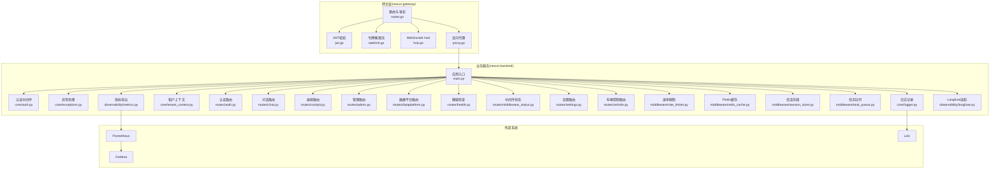
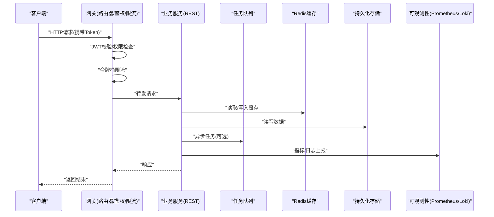
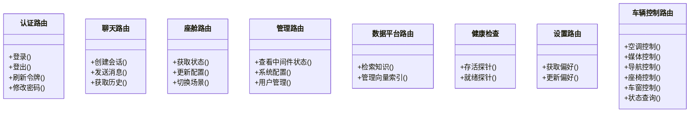
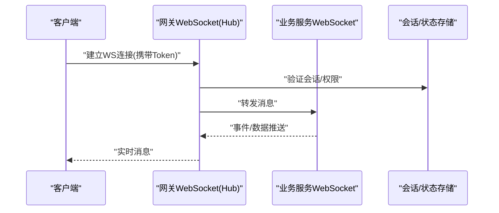
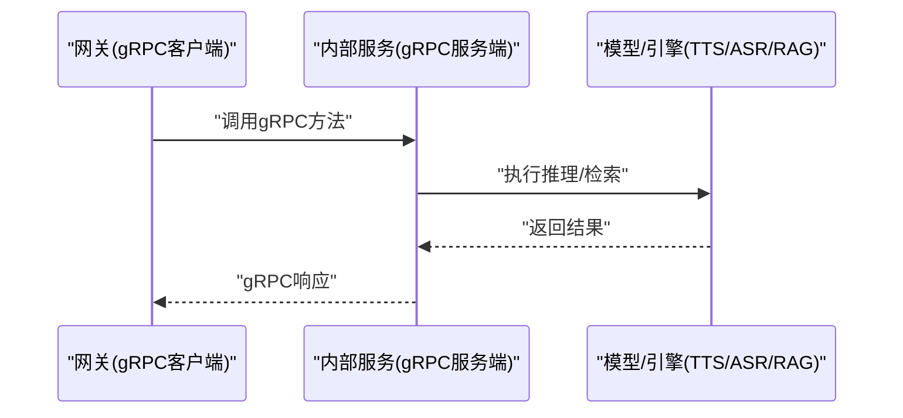
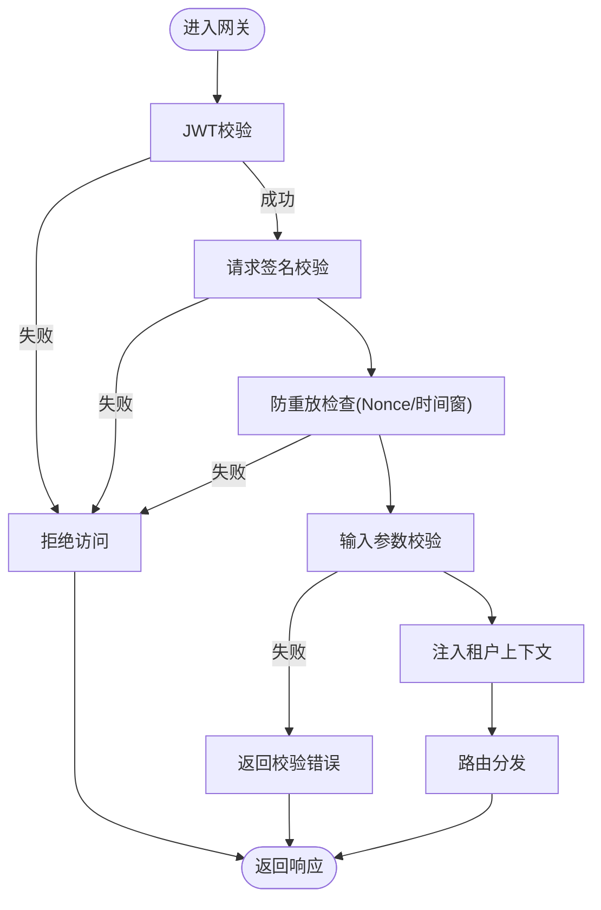
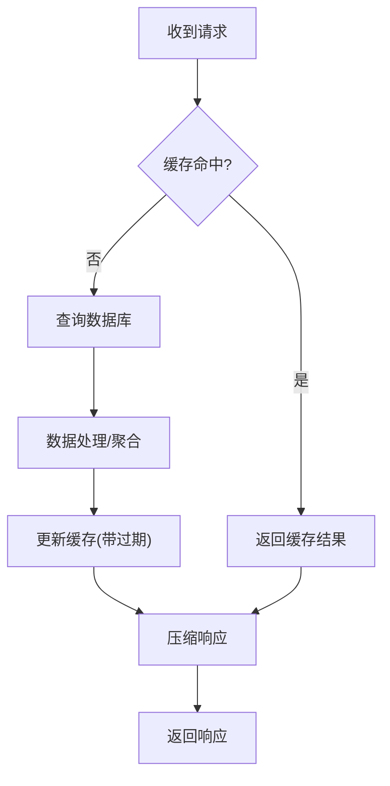
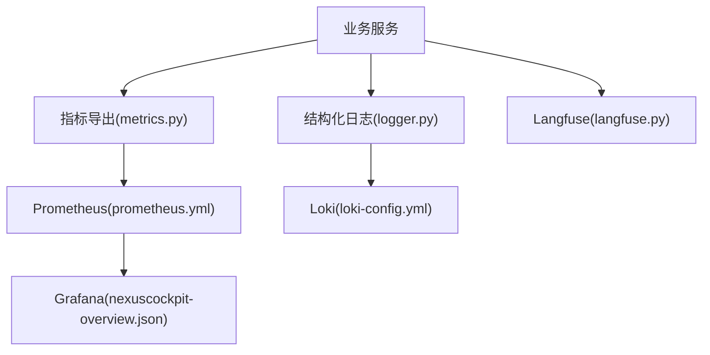
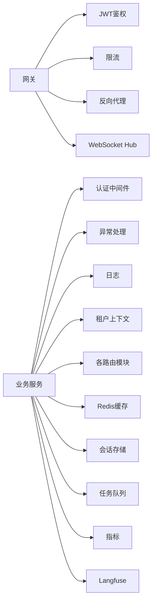

# API架构

<cite>
**本文引用的文件**   
- [backend_design/nexus/main.py](file://backend_design/nexus/main.py)
- [backend_design/nexus/api/__init__.py](file://backend_design/nexus/api/__init__.py)
- [backend_design/nexus/api/websocket.py](file://backend_design/nexus/api/websocket.py)
- [backend_design/nexus/api/routes/auth.py](file://backend_design/nexus/api/routes/auth.py)
- [backend_design/nexus/api/routes/chat.py](file://backend_design/nexus/api/routes/chat.py)
- [backend_design/nexus/api/routes/cockpit.py](file://backend_design/nexus/api/routes/cockpit.py)
- [backend_design/nexus/api/routes/admin.py](file://backend_design/nexus/api/routes/admin.py)
- [backend_design/nexus/api/routes/dataplatform.py](file://backend_design/nexus/api/routes/dataplatform.py)
- [backend_design/nexus/api/routes/health.py](file://backend_design/nexus/api/routes/health.py)
- [backend_design/nexus/api/routes/middleware_status.py](file://backend_design/nexus/api/routes/middleware_status.py)
- [backend_design/nexus/api/routes/settings.py](file://backend_design/nexus/api/routes/settings.py)
- [backend_design/nexus/api/routes/vehicle.py](file://backend_design/nexus/api/routes/vehicle.py)
- [backend_design/nexus/core/auth.py](file://backend_design/nexus/core/auth.py)
- [backend_design/nexus/core/exceptions.py](file://backend_design/nexus/core/exceptions.py)
- [backend_design/nexus/core/logger.py](file://backend_design/nexus/core/logger.py)
- [backend_design/nexus/core/tenant_context.py](file://backend_design/nexus/core/tenant_context.py)
- [backend_design/nexus/middleware/rate_limiter.py](file://backend_design/nexus/middleware/rate_limiter.py)
- [backend_design/nexus/middleware/redis_cache.py](file://backend_design/nexus/middleware/redis_cache.py)
- [backend_design/nexus/middleware/session_store.py](file://backend_design/nexus/middleware/session_store.py)
- [backend_design/nexus/middleware/task_queue.py](file://backend_design/nexus/middleware/task_queue.py)
- [backend_design/nexus/observability/metrics.py](file://backend_design/nexus/observability/metrics.py)
- [backend_design/nexus/observability/langfuse.py](file://backend_design/nexus/observability/langfuse.py)
- [backend_design/nexus_gate/internal/router/router.go](file://backend_design/nexus_gate/internal/router/router.go)
- [backend_design/nexus_gate/internal/handlers/handlers.go](file://backend_design/nexus_gate/internal/handlers/handlers.go)
- [backend_design/nexus_gate/internal/ws/hub.go](file://backend_design/nexus_gate/internal/ws/hub.go)
- [backend_design/nexus_gate/proto/nexus.proto](file://backend_design/nexus_gate/proto/nexus.proto)
- [backend_design/nexus_gate/internal/proxy/proxy.go](file://backend_design/nexus_gate/internal/proxy/proxy.go)
- [backend_design/nexus_gate/internal/auth/jwt.go](file://backend_design/nexus_gate/internal/auth/jwt.go)
- [backend_design/nexus_gate/internal/ratelimit/ratelimit.go](file://backend_design/nexus_gate/internal/ratelimit/ratelimit.go)
- [backend_design/nexus_gate/internal/config/config.go](file://backend_design/nexus_gate/internal/config/config.go)
- [config/grafana/provisioning/dashboards/nexuscockpit-overview.json](file://config/grafana/provisioning/dashboards/nexuscockpit-overview.json)
- [config/prometheus/prometheus.yml](file://config/prometheus/prometheus.yml)
- [config/loki/loki-config.yml](file://config/loki/loki-config.yml)
</cite>

## 目录
1. [简介](#简介)
2. [项目结构](#项目结构)
3. [核心组件](#核心组件)
4. [架构总览](#架构总览)
5. [详细组件分析](#详细组件分析)
6. [依赖关系分析](#依赖关系分析)
7. [性能考虑](#性能考虑)
8. [故障排查指南](#故障排查指南)
9. [结论](#结论)
10. [附录](#附录)

## 简介
本文件面向NexusCockpit系统的API架构，聚焦以下目标：
- 分层设计：RESTful API、WebSocket API与gRPC内部接口的职责划分与交互边界
- 版本管理：向后兼容策略、废弃API迁移路径与客户端适配方案
- 安全架构：认证授权、请求签名、防重放攻击与输入校验
- 性能优化：响应压缩、分页查询、批量操作与缓存策略
- 文档生成与维护：OpenAPI规范、自动文档生成与在线调试工具
- 监控告警：请求追踪、错误统计与性能分析

## 项目结构
后端服务采用Python（FastAPI）实现业务API与中间件；网关采用Go实现反向代理、鉴权、限流与WebSocket转发；可观测性通过Prometheus/Grafana/Loki集成。

图表来源
- [backend_design/nexus/main.py](file://backend_design/nexus/main.py)
- [backend_design/nexus/core/auth.py](file://backend_design/nexus/core/auth.py)
- [backend_design/nexus/core/exceptions.py](file://backend_design/nexus/core/exceptions.py)
- [backend_design/nexus/core/logger.py](file://backend_design/nexus/core/logger.py)
- [backend_design/nexus/core/tenant_context.py](file://backend_design/nexus/core/tenant_context.py)
- [backend_design/nexus/api/routes/auth.py](file://backend_design/nexus/api/routes/auth.py)
- [backend_design/nexus/api/routes/chat.py](file://backend_design/nexus/api/routes/chat.py)
- [backend_design/nexus/api/routes/cockpit.py](file://backend_design/nexus/api/routes/cockpit.py)
- [backend_design/nexus/api/routes/admin.py](file://backend_design/nexus/api/routes/admin.py)
- [backend_design/nexus/api/routes/dataplatform.py](file://backend_design/nexus/api/routes/dataplatform.py)
- [backend_design/nexus/api/routes/health.py](file://backend_design/nexus/api/routes/health.py)
- [backend_design/nexus/api/routes/middleware_status.py](file://backend_design/nexus/api/routes/middleware_status.py)
- [backend_design/nexus/api/routes/settings.py](file://backend_design/nexus/api/routes/settings.py)
- [backend_design/nexus/api/routes/vehicle.py](file://backend_design/nexus/api/routes/vehicle.py)
- [backend_design/nexus/middleware/rate_limiter.py](file://backend_design/nexus/middleware/rate_limiter.py)
- [backend_design/nexus/middleware/redis_cache.py](file://backend_design/nexus/middleware/redis_cache.py)
- [backend_design/nexus/middleware/session_store.py](file://backend_design/nexus/middleware/session_store.py)
- [backend_design/nexus/middleware/task_queue.py](file://backend_design/nexus/middleware/task_queue.py)
- [backend_design/nexus/observability/metrics.py](file://backend_design/nexus/observability/metrics.py)
- [backend_design/nexus/observability/langfuse.py](file://backend_design/nexus/observability/langfuse.py)
- [backend_design/nexus_gate/internal/router/router.go](file://backend_design/nexus_gate/internal/router/router.go)
- [backend_design/nexus_gate/internal/handlers/handlers.go](file://backend_design/nexus_gate/internal/handlers/handlers.go)
- [backend_design/nexus_gate/internal/ws/hub.go](file://backend_design/nexus_gate/internal/ws/hub.go)
- [backend_design/nexus_gate/internal/proxy/proxy.go](file://backend_design/nexus_gate/internal/proxy/proxy.go)
- [backend_design/nexus_gate/internal/auth/jwt.go](file://backend_design/nexus_gate/internal/auth/jwt.go)
- [backend_design/nexus_gate/internal/ratelimit/ratelimit.go](file://backend_design/nexus_gate/internal/ratelimit/ratelimit.go)
- [config/prometheus/prometheus.yml](file://config/prometheus/prometheus.yml)
- [config/grafana/provisioning/dashboards/nexuscockpit-overview.json](file://config/grafana/provisioning/dashboards/nexuscockpit-overview.json)
- [config/loki/loki-config.yml](file://config/loki/loki-config.yml)

章节来源
- [backend_design/nexus/main.py](file://backend_design/nexus/main.py)
- [backend_design/nexus_gate/internal/router/router.go](file://backend_design/nexus_gate/internal/router/router.go)

## 核心组件
- 网关层（nexus-gateway）
  - 统一入口：HTTP/gRPC/WebSocket聚合
  - 鉴权：JWT签发/校验、权限校验
  - 限流：令牌桶算法，按IP/用户维度
  - 代理：将HTTP请求转发至后端服务
  - WebSocket：Hub模式连接管理与消息广播
- 业务服务（nexus-backend）
  - REST路由：按领域拆分（认证、聊天、座舱、管理、数据平台、健康检查、中间件状态、设置、车辆）
  - 中间件：速率限制、Redis缓存、会话存储、异步任务队列
  - 可观测性：指标导出、分布式追踪、结构化日志
  - 安全：认证中间件、异常标准化、租户上下文隔离

章节来源
- [backend_design/nexus/api/routes/auth.py](file://backend_design/nexus/api/routes/auth.py)
- [backend_design/nexus/api/routes/chat.py](file://backend_design/nexus/api/routes/chat.py)
- [backend_design/nexus/api/routes/cockpit.py](file://backend_design/nexus/api/routes/cockpit.py)
- [backend_design/nexus/api/routes/admin.py](file://backend_design/nexus/api/routes/admin.py)
- [backend_design/nexus/api/routes/dataplatform.py](file://backend_design/nexus/api/routes/dataplatform.py)
- [backend_design/nexus/api/routes/health.py](file://backend_design/nexus/api/routes/health.py)
- [backend_design/nexus/api/routes/middleware_status.py](file://backend_design/nexus/api/routes/middleware_status.py)
- [backend_design/nexus/api/routes/settings.py](file://backend_design/nexus/api/routes/settings.py)
- [backend_design/nexus/api/routes/vehicle.py](file://backend_design/nexus/api/routes/vehicle.py)
- [backend_design/nexus/middleware/rate_limiter.py](file://backend_design/nexus/middleware/rate_limiter.py)
- [backend_design/nexus/middleware/redis_cache.py](file://backend_design/nexus/middleware/redis_cache.py)
- [backend_design/nexus/middleware/session_store.py](file://backend_design/nexus/middleware/session_store.py)
- [backend_design/nexus/middleware/task_queue.py](file://backend_design/nexus/middleware/task_queue.py)
- [backend_design/nexus/observability/metrics.py](file://backend_design/nexus/observability/metrics.py)
- [backend_design/nexus/observability/langfuse.py](file://backend_design/nexus/observability/langfuse.py)
- [backend_design/nexus/core/auth.py](file://backend_design/nexus/core/auth.py)
- [backend_design/nexus/core/exceptions.py](file://backend_design/nexus/core/exceptions.py)
- [backend_design/nexus/core/logger.py](file://backend_design/nexus/core/logger.py)
- [backend_design/nexus/core/tenant_context.py](file://backend_design/nexus/core/tenant_context.py)
- [backend_design/nexus_gate/internal/auth/jwt.go](file://backend_design/nexus_gate/internal/auth/jwt.go)
- [backend_design/nexus_gate/internal/ratelimit/ratelimit.go](file://backend_design/nexus_gate/internal/ratelimit/ratelimit.go)
- [backend_design/nexus_gate/internal/ws/hub.go](file://backend_design/nexus_gate/internal/ws/hub.go)
- [backend_design/nexus_gate/internal/proxy/proxy.go](file://backend_design/nexus_gate/internal/proxy/proxy.go)

## 架构总览
NexusCockpit采用“网关+微服务”的分层架构：
- 网关层负责协议转换、鉴权、限流、代理与WebSocket桥接
- 业务服务提供REST接口与领域逻辑，并通过中间件扩展能力
- 可观测性贯穿全链路，指标上报Prometheus，日志写入Loki，可视化于Grafana

图表来源
- [backend_design/nexus_gate/internal/router/router.go](file://backend_design/nexus_gate/internal/router/router.go)
- [backend_design/nexus_gate/internal/auth/jwt.go](file://backend_design/nexus_gate/internal/auth/jwt.go)
- [backend_design/nexus_gate/internal/ratelimit/ratelimit.go](file://backend_design/nexus_gate/internal/ratelimit/ratelimit.go)
- [backend_design/nexus_gate/internal/proxy/proxy.go](file://backend_design/nexus_gate/internal/proxy/proxy.go)
- [backend_design/nexus/middleware/redis_cache.py](file://backend_design/nexus/middleware/redis_cache.py)
- [backend_design/nexus/middleware/task_queue.py](file://backend_design/nexus/middleware/task_queue.py)
- [backend_design/nexus/observability/metrics.py](file://backend_design/nexus/observability/metrics.py)
- [backend_design/nexus/core/logger.py](file://backend_design/nexus/core/logger.py)

## 详细组件分析

### RESTful API设计与职责划分
- 认证路由：登录、登出、刷新令牌、密码修改等
- 聊天路由：会话创建、消息发送/接收、历史查询
- 座舱路由：座舱状态、配置、场景切换
- 管理路由：系统配置、用户管理、中间件状态查看
- 数据平台路由：数据集、检索、向量库操作
- 健康检查：存活/就绪探针
- 中间件状态：缓存、会话、任务队列状态
- 设置路由：用户偏好、全局设置
- 车辆控制路由：空调、媒体、导航、座椅、车窗、状态查询

图表来源
- [backend_design/nexus/api/routes/auth.py](file://backend_design/nexus/api/routes/auth.py)
- [backend_design/nexus/api/routes/chat.py](file://backend_design/nexus/api/routes/chat.py)
- [backend_design/nexus/api/routes/cockpit.py](file://backend_design/nexus/api/routes/cockpit.py)
- [backend_design/nexus/api/routes/admin.py](file://backend_design/nexus/api/routes/admin.py)
- [backend_design/nexus/api/routes/dataplatform.py](file://backend_design/nexus/api/routes/dataplatform.py)
- [backend_design/nexus/api/routes/health.py](file://backend_design/nexus/api/routes/health.py)
- [backend_design/nexus/api/routes/settings.py](file://backend_design/nexus/api/routes/settings.py)
- [backend_design/nexus/api/routes/vehicle.py](file://backend_design/nexus/api/routes/vehicle.py)

章节来源
- [backend_design/nexus/api/routes/auth.py](file://backend_design/nexus/api/routes/auth.py)
- [backend_design/nexus/api/routes/chat.py](file://backend_design/nexus/api/routes/chat.py)
- [backend_design/nexus/api/routes/cockpit.py](file://backend_design/nexus/api/routes/cockpit.py)
- [backend_design/nexus/api/routes/admin.py](file://backend_design/nexus/api/routes/admin.py)
- [backend_design/nexus/api/routes/dataplatform.py](file://backend_design/nexus/api/routes/dataplatform.py)
- [backend_design/nexus/api/routes/health.py](file://backend_design/nexus/api/routes/health.py)
- [backend_design/nexus/api/routes/settings.py](file://backend_design/nexus/api/routes/settings.py)
- [backend_design/nexus/api/routes/vehicle.py](file://backend_design/nexus/api/routes/vehicle.py)

### WebSocket API设计与职责划分
- 实时通信：用于聊天流式输出、座舱事件推送、车辆状态订阅
- 连接管理：Hub维护连接集合，支持广播与点对点消息
- 鉴权与会话：基于JWT或会话ID建立可信连接
- 背压与限流：结合网关限流与中间件速率控制

图表来源
- [backend_design/nexus/api/websocket.py](file://backend_design/nexus/api/websocket.py)
- [backend_design/nexus_gate/internal/ws/hub.go](file://backend_design/nexus_gate/internal/ws/hub.go)
- [backend_design/nexus/middleware/session_store.py](file://backend_design/nexus/middleware/session_store.py)

章节来源
- [backend_design/nexus/api/websocket.py](file://backend_design/nexus/api/websocket.py)
- [backend_design/nexus_gate/internal/ws/hub.go](file://backend_design/nexus_gate/internal/ws/hub.go)
- [backend_design/nexus/middleware/session_store.py](file://backend_design/nexus/middleware/session_store.py)

### gRPC内部接口设计与职责划分
- 协议定义：使用proto描述服务契约
- 网关内聚：在网关侧实现gRPC到HTTP的适配或直接调用内部服务
- 典型场景：高性能内部调用（如RAG检索、TTS合成、ASR转写）

图表来源
- [backend_design/nexus_gate/proto/nexus.proto](file://backend_design/nexus_gate/proto/nexus.proto)
- [backend_design/nexus_gate/internal/proxy/proxy.go](file://backend_design/nexus_gate/internal/proxy/proxy.go)

章节来源
- [backend_design/nexus_gate/proto/nexus.proto](file://backend_design/nexus_gate/proto/nexus.proto)
- [backend_design/nexus_gate/internal/proxy/proxy.go](file://backend_design/nexus_gate/internal/proxy/proxy.go)

### API版本管理策略
- 版本标识：URL前缀或Header中声明版本（如/v1、/v2）
- 向后兼容：新增字段非破坏性变更；删除字段需保留兼容映射
- 废弃策略：通过响应头或文档标注废弃，提供迁移期与替代接口
- 客户端适配：SDK/客户端根据版本协商选择实现；灰度发布与A/B测试

[本节为概念性说明，不直接分析具体文件]

### API安全架构
- 认证授权：网关JWT校验，业务层权限控制；支持多租户上下文隔离
- 请求签名：对敏感操作附加时间戳、随机数与HMAC签名
- 防重放攻击：Nonce+时间窗口校验；幂等键去重
- 输入验证：Pydantic模型校验、白名单过滤、长度/格式约束
- 传输安全：HTTPS强制、证书轮换、TLS最小版本控制

图表来源
- [backend_design/nexus_gate/internal/auth/jwt.go](file://backend_design/nexus_gate/internal/auth/jwt.go)
- [backend_design/nexus/core/auth.py](file://backend_design/nexus/core/auth.py)
- [backend_design/nexus/core/tenant_context.py](file://backend_design/nexus/core/tenant_context.py)
- [backend_design/nexus/core/exceptions.py](file://backend_design/nexus/core/exceptions.py)

章节来源
- [backend_design/nexus_gate/internal/auth/jwt.go](file://backend_design/nexus_gate/internal/auth/jwt.go)
- [backend_design/nexus/core/auth.py](file://backend_design/nexus/core/auth.py)
- [backend_design/nexus/core/tenant_context.py](file://backend_design/nexus/core/tenant_context.py)
- [backend_design/nexus/core/exceptions.py](file://backend_design/nexus/core/exceptions.py)

### API性能优化策略
- 响应压缩：启用gzip/br压缩，减少带宽占用
- 分页查询：游标/偏移分页，避免大结果集
- 批量操作：合并多次请求为一次批量接口
- 缓存策略：Redis热点缓存、ETag/Last-Modified、失效策略
- 异步任务：耗时操作入队，前端轮询或WebSocket推送结果

图表来源
- [backend_design/nexus/middleware/redis_cache.py](file://backend_design/nexus/middleware/redis_cache.py)
- [backend_design/nexus/middleware/task_queue.py](file://backend_design/nexus/middleware/task_queue.py)

章节来源
- [backend_design/nexus/middleware/redis_cache.py](file://backend_design/nexus/middleware/redis_cache.py)
- [backend_design/nexus/middleware/task_queue.py](file://backend_design/nexus/middleware/task_queue.py)

### API文档生成与维护方案
- OpenAPI规范：基于FastAPI自动生成OpenAPI JSON/YAML
- 自动文档：Swagger UI/Redoc在线浏览与尝试
- 在线调试：集成Playwright或Postman集合进行端到端调试
- 版本化文档：按版本分支维护，发布时同步更新

[本节为概念性说明，不直接分析具体文件]

### API监控与告警机制
- 指标采集：Prometheus抓取业务指标（QPS、延迟、错误率）
- 可视化：Grafana仪表盘展示关键KPI
- 日志收集：Loki集中存储结构化日志，支持快速检索
- 分布式追踪：Langfuse记录LLM调用链路与耗时
- 告警规则：阈值触发（错误率、延迟、资源使用），通知渠道（邮件/IM）

图表来源
- [backend_design/nexus/observability/metrics.py](file://backend_design/nexus/observability/metrics.py)
- [backend_design/nexus/core/logger.py](file://backend_design/nexus/core/logger.py)
- [backend_design/nexus/observability/langfuse.py](file://backend_design/nexus/observability/langfuse.py)
- [config/prometheus/prometheus.yml](file://config/prometheus/prometheus.yml)
- [config/grafana/provisioning/dashboards/nexuscockpit-overview.json](file://config/grafana/provisioning/dashboards/nexuscockpit-overview.json)
- [config/loki/loki-config.yml](file://config/loki/loki-config.yml)

章节来源
- [backend_design/nexus/observability/metrics.py](file://backend_design/nexus/observability/metrics.py)
- [backend_design/nexus/core/logger.py](file://backend_design/nexus/core/logger.py)
- [backend_design/nexus/observability/langfuse.py](file://backend_design/nexus/observability/langfuse.py)
- [config/prometheus/prometheus.yml](file://config/prometheus/prometheus.yml)
- [config/grafana/provisioning/dashboards/nexuscockpit-overview.json](file://config/grafana/provisioning/dashboards/nexuscockpit-overview.json)
- [config/loki/loki-config.yml](file://config/loki/loki-config.yml)

## 依赖关系分析
- 网关依赖：路由、鉴权、限流、代理、WebSocket Hub
- 业务服务依赖：认证中间件、异常处理、日志、租户上下文、各路由模块、中间件（缓存/会话/任务）、可观测性
- 外部依赖：Prometheus、Grafana、Loki、Redis、消息队列、向量库/图数据库

图表来源
- [backend_design/nexus_gate/internal/router/router.go](file://backend_design/nexus_gate/internal/router/router.go)
- [backend_design/nexus_gate/internal/auth/jwt.go](file://backend_design/nexus_gate/internal/auth/jwt.go)
- [backend_design/nexus_gate/internal/ratelimit/ratelimit.go](file://backend_design/nexus_gate/internal/ratelimit/ratelimit.go)
- [backend_design/nexus_gate/internal/proxy/proxy.go](file://backend_design/nexus_gate/internal/proxy/proxy.go)
- [backend_design/nexus_gate/internal/ws/hub.go](file://backend_design/nexus_gate/internal/ws/hub.go)
- [backend_design/nexus/core/auth.py](file://backend_design/nexus/core/auth.py)
- [backend_design/nexus/core/exceptions.py](file://backend_design/nexus/core/exceptions.py)
- [backend_design/nexus/core/logger.py](file://backend_design/nexus/core/logger.py)
- [backend_design/nexus/core/tenant_context.py](file://backend_design/nexus/core/tenant_context.py)
- [backend_design/nexus/middleware/redis_cache.py](file://backend_design/nexus/middleware/redis_cache.py)
- [backend_design/nexus/middleware/session_store.py](file://backend_design/nexus/middleware/session_store.py)
- [backend_design/nexus/middleware/task_queue.py](file://backend_design/nexus/middleware/task_queue.py)
- [backend_design/nexus/observability/metrics.py](file://backend_design/nexus/observability/metrics.py)
- [backend_design/nexus/observability/langfuse.py](file://backend_design/nexus/observability/langfuse.py)

章节来源
- [backend_design/nexus_gate/internal/router/router.go](file://backend_design/nexus_gate/internal/router/router.go)
- [backend_design/nexus/core/auth.py](file://backend_design/nexus/core/auth.py)
- [backend_design/nexus/core/exceptions.py](file://backend_design/nexus/core/exceptions.py)
- [backend_design/nexus/core/logger.py](file://backend_design/nexus/core/logger.py)
- [backend_design/nexus/core/tenant_context.py](file://backend_design/nexus/core/tenant_context.py)
- [backend_design/nexus/middleware/redis_cache.py](file://backend_design/nexus/middleware/redis_cache.py)
- [backend_design/nexus/middleware/session_store.py](file://backend_design/nexus/middleware/session_store.py)
- [backend_design/nexus/middleware/task_queue.py](file://backend_design/nexus/middleware/task_queue.py)
- [backend_design/nexus/observability/metrics.py](file://backend_design/nexus/observability/metrics.py)
- [backend_design/nexus/observability/langfuse.py](file://backend_design/nexus/observability/langfuse.py)

## 性能考虑
- 网关层：连接复用、并发调度、超时控制、熔断降级
- 业务层：缓存命中率提升、SQL/向量检索优化、批处理与异步化
- 网络层：压缩、HTTP/2、Keep-Alive
- 资源层：CPU/内存/IO监控，弹性扩缩容

[本节为通用指导，不直接分析具体文件]

## 故障排查指南
- 常见问题
  - 鉴权失败：检查JWT签名、过期时间、权限范围
  - 限流触发：调整令牌桶参数或扩容实例
  - 缓存不一致：清理热点Key、检查失效策略
  - 任务堆积：检查队列消费者、重试与死信策略
- 定位手段
  - 指标：查看QPS、延迟、错误率趋势
  - 日志：按TraceID检索完整链路
  - 追踪：Langfuse链路分析LLM调用耗时与失败原因

章节来源
- [backend_design/nexus/core/exceptions.py](file://backend_design/nexus/core/exceptions.py)
- [backend_design/nexus/core/logger.py](file://backend_design/nexus/core/logger.py)
- [backend_design/nexus/observability/metrics.py](file://backend_design/nexus/observability/metrics.py)
- [backend_design/nexus/observability/langfuse.py](file://backend_design/nexus/observability/langfuse.py)

## 结论
NexusCockpit的API架构以网关为核心入口，结合业务服务的模块化路由与中间件扩展，形成清晰的分层与职责边界。通过统一的鉴权、限流、缓存、异步与可观测性体系，保障高可用与高性能。建议持续完善OpenAPI文档、自动化测试与灰度发布流程，进一步提升稳定性与可维护性。

## 附录
- 配置参考
  - Prometheus抓取配置：[prometheus.yml](file://config/prometheus/prometheus.yml)
  - Grafana仪表盘：[nexuscockpit-overview.json](file://config/grafana/provisioning/dashboards/nexuscockpit-overview.json)
  - Loki日志配置：[loki-config.yml](file://config/loki/loki-config.yml)
- 网关配置
  - 路由与处理器：[router.go](file://backend_design/nexus_gate/internal/router/router.go)、[handlers.go](file://backend_design/nexus_gate/internal/handlers/handlers.go)
  - 鉴权与限流：[jwt.go](file://backend_design/nexus_gate/internal/auth/jwt.go)、[ratelimit.go](file://backend_design/nexus_gate/internal/ratelimit/ratelimit.go)
  - 代理与WebSocket：[proxy.go](file://backend_design/nexus_gate/internal/proxy/proxy.go)、[hub.go](file://backend_design/nexus_gate/internal/ws/hub.go)
- 业务服务入口与中间件
  - 应用入口：[main.py](file://backend_design/nexus/main.py)
  - 中间件：[rate_limiter.py](file://backend_design/nexus/middleware/rate_limiter.py)、[redis_cache.py](file://backend_design/nexus/middleware/redis_cache.py)、[session_store.py](file://backend_design/nexus/middleware/session_store.py)、[task_queue.py](file://backend_design/nexus/middleware/task_queue.py)
  - 可观测性：[metrics.py](file://backend_design/nexus/observability/metrics.py)、[langfuse.py](file://backend_design/nexus/observability/langfuse.py)