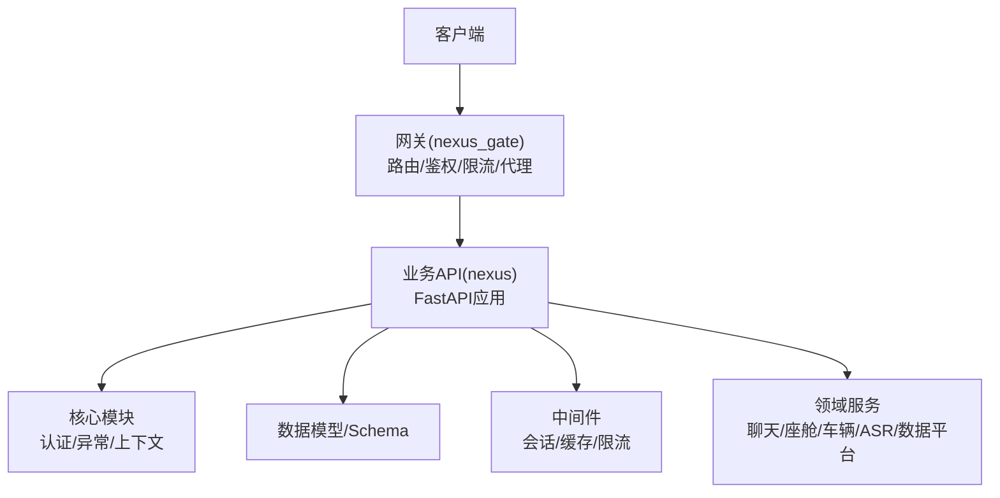
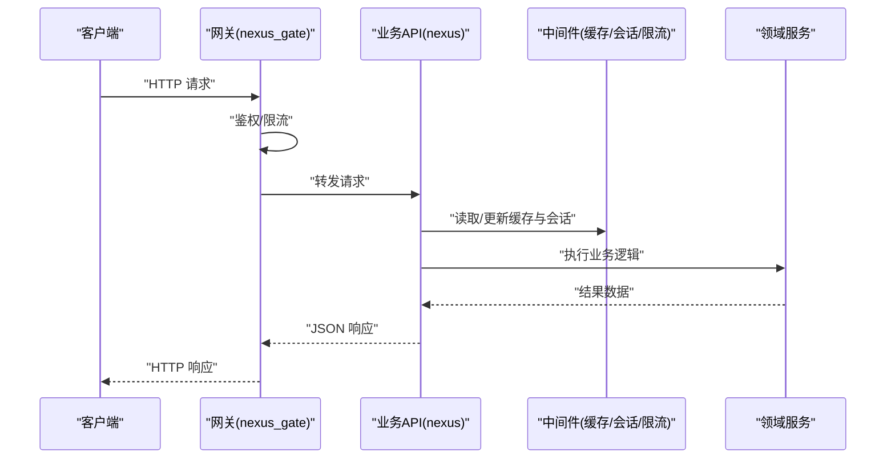
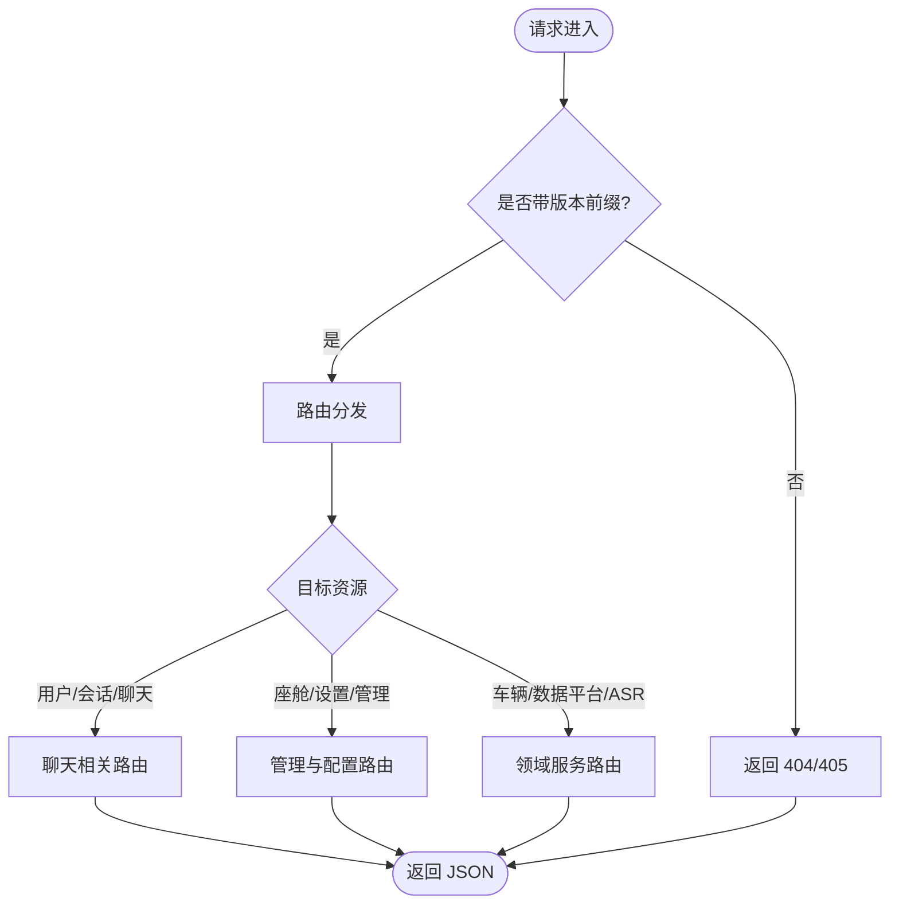
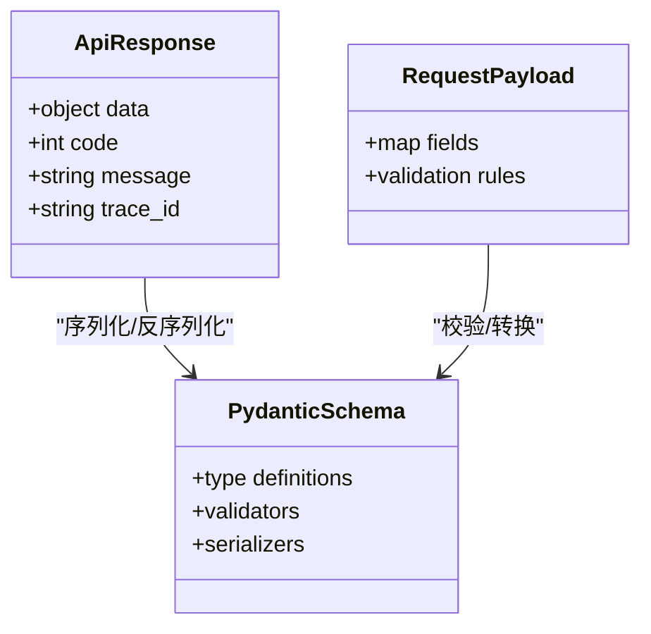
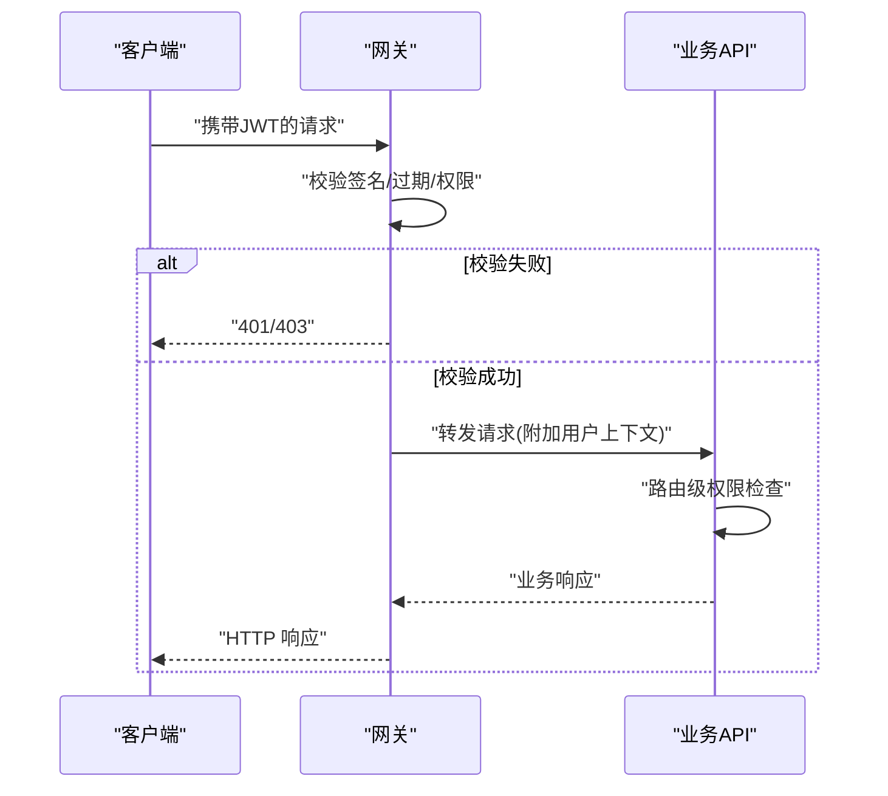
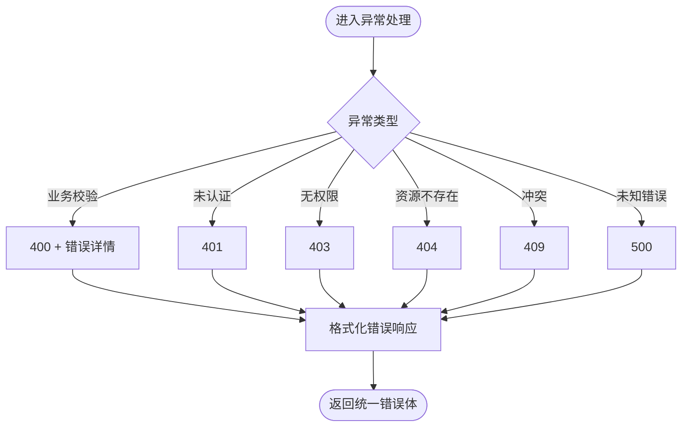
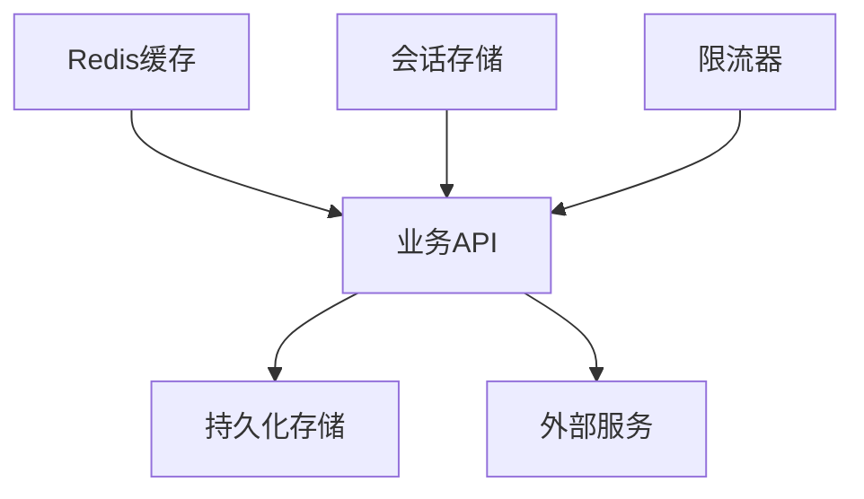
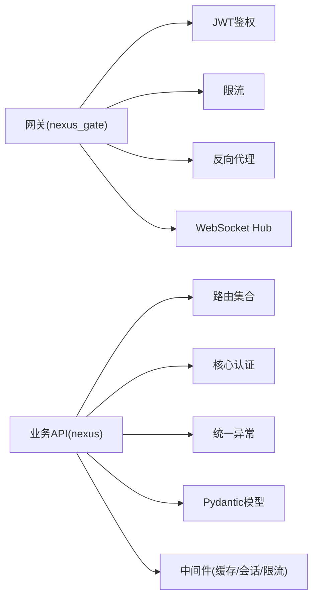

# RESTful API设计

<cite>
**本文引用的文件**   
- [backend_design/nexus/main.py](file://backend_design/nexus/main.py)
- [backend_design/nexus/api/__init__.py](file://backend_design/nexus/api/__init__.py)
- [backend_design/nexus/api/routes/auth.py](file://backend_design/nexus/api/routes/auth.py)
- [backend_design/nexus/api/routes/chat.py](file://backend_design/nexus/api/routes/chat.py)
- [backend_design/nexus/api/routes/chat_sessions.py](file://backend_design/nexus/api/routes/chat_sessions.py)
- [backend_design/nexus/api/routes/cockpit.py](file://backend_design/nexus/api/routes/cockpit.py)
- [backend_design/nexus/api/routes/admin.py](file://backend_design/nexus/api/routes/admin.py)
- [backend_design/nexus/api/routes/settings.py](file://backend_design/nexus/api/routes/settings.py)
- [backend_design/nexus/api/routes/vehicle.py](file://backend_design/nexus/api/routes/vehicle.py)
- [backend_design/nexus/api/routes/dataplatform.py](file://backend_design/nexus/api/routes/dataplatform.py)
- [backend_design/nexus/api/routes/asr.py](file://backend_design/nexus/api/routes/asr.py)
- [backend_design/nexus/api/routes/middleware_status.py](file://backend_design/nexus/api/routes/middleware_status.py)
- [backend_design/nexus/core/auth.py](file://backend_design/nexus/core/auth.py)
- [backend_design/nexus/core/exceptions.py](file://backend_design/nexus/core/exceptions.py)
- [backend_design/nexus/models/schemas.py](file://backend_design/nexus/models/schemas.py)
- [backend_design/nexus/middleware/session_store.py](file://backend_design/nexus/middleware/session_store.py)
- [backend_design/nexus/middleware/redis_cache.py](file://backend_design/nexus/middleware/redis_cache.py)
- [backend_design/nexus/middleware/rate_limiter.py](file://backend_design/nexus/middleware/rate_limiter.py)
- [backend_design/nexus_gate/internal/handlers/handlers.go](file://backend_design/nexus_gate/internal/handlers/handlers.go)
- [backend_design/nexus_gate/internal/router/router.go](file://backend_design/nexus_gate/internal/router/router.go)
- [backend_design/nexus_gate/internal/proxy/proxy.go](file://backend_design/nexus_gate/internal/proxy/proxy.go)
- [backend_design/nexus_gate/internal/auth/jwt.go](file://backend_design/nexus_gate/internal/auth/jwt.go)
- [backend_design/nexus_gate/internal/ratelimit/ratelimit.go](file://backend_design/nexus_gate/internal/ratelimit/ratelimit.go)
</cite>

## 目录
1. [简介](#简介)
2. [项目结构](#项目结构)
3. [核心组件](#核心组件)
4. [架构总览](#架构总览)
5. [详细组件分析](#详细组件分析)
6. [依赖分析](#依赖分析)
7. [性能考虑](#性能考虑)
8. [故障排查指南](#故障排查指南)
9. [结论](#结论)
10. [附录](#附录)

## 简介
本文件为NexusCockpit系统的RESTful API设计文档，聚焦于后端Python服务与前置网关（Go）的接口规范、路由组织、认证授权、数据格式、错误处理、文档生成与性能优化策略。文档面向开发者与集成方，提供从原则到落地的完整说明，并给出可操作的实现建议与图示。

## 项目结构
NexusCockpit采用“网关 + 业务服务”的分层架构：
- 网关层（nexus_gate）：负责请求转发、鉴权、限流、WebSocket代理等。
- 业务服务层（nexus）：基于FastAPI构建，提供REST与WebSocket能力，包含路由、模型、中间件、核心逻辑等。

**图表来源**
- [backend_design/nexus/main.py](file://backend_design/nexus/main.py)
- [backend_design/nexus_gate/internal/router/router.go](file://backend_design/nexus_gate/internal/router/router.go)
- [backend_design/nexus_gate/internal/handlers/handlers.go](file://backend_design/nexus_gate/internal/handlers/handlers.go)

**章节来源**
- [backend_design/nexus/main.py](file://backend_design/nexus/main.py)
- [backend_design/nexus/api/__init__.py](file://backend_design/nexus/api/__init__.py)
- [backend_design/nexus_gate/internal/router/router.go](file://backend_design/nexus_gate/internal/router/router.go)
- [backend_design/nexus_gate/internal/handlers/handlers.go](file://backend_design/nexus_gate/internal/handlers/handlers.go)

## 核心组件
- 应用入口与路由挂载：在应用初始化时注册各功能子路由，形成统一对外API边界。
- 认证与权限：结合网关JWT校验与服务端权限控制，实现细粒度访问限制。
- 数据模型与验证：使用Pydantic Schema定义请求/响应结构，确保类型安全与一致性。
- 中间件：会话存储、Redis缓存、速率限制等横切能力。
- 网关能力：反向代理、鉴权、限流、WebSocket Hub。

**章节来源**
- [backend_design/nexus/main.py](file://backend_design/nexus/main.py)
- [backend_design/nexus/api/__init__.py](file://backend_design/nexus/api/__init__.py)
- [backend_design/nexus/core/auth.py](file://backend_design/nexus/core/auth.py)
- [backend_design/nexus/models/schemas.py](file://backend_design/nexus/models/schemas.py)
- [backend_design/nexus/middleware/session_store.py](file://backend_design/nexus/middleware/session_store.py)
- [backend_design/nexus/middleware/redis_cache.py](file://backend_design/nexus/middleware/redis_cache.py)
- [backend_design/nexus/middleware/rate_limiter.py](file://backend_design/nexus/middleware/rate_limiter.py)
- [backend_design/nexus_gate/internal/auth/jwt.go](file://backend_design/nexus_gate/internal/auth/jwt.go)
- [backend_design/nexus_gate/internal/ratelimit/ratelimit.go](file://backend_design/nexus_gate/internal/ratelimit/ratelimit.go)

## 架构总览
整体调用链：客户端通过网关进入，网关完成鉴权与限流后转发至业务服务；业务服务按路由分发到具体处理器，读取/写入模型与中间件，返回结构化JSON。

**图表来源**
- [backend_design/nexus_gate/internal/handlers/handlers.go](file://backend_design/nexus_gate/internal/handlers/handlers.go)
- [backend_design/nexus_gate/internal/proxy/proxy.go](file://backend_design/nexus_gate/internal/proxy/proxy.go)
- [backend_design/nexus/main.py](file://backend_design/nexus/main.py)
- [backend_design/nexus/middleware/redis_cache.py](file://backend_design/nexus/middleware/redis_cache.py)
- [backend_design/nexus/middleware/session_store.py](file://backend_design/nexus/middleware/session_store.py)

## 详细组件分析

### 路由组织与版本化策略
- 资源路由：以名词复数形式表示资源，如 /api/v1/chats、/api/v1/cockpits、/api/v1/vehicles。
- 嵌套资源：对从属资源进行层级表达，如 /api/v1/chats/{chat_id}/messages。
- 版本化：采用URL路径前缀 v1，便于后续演进与兼容。
- 路由挂载：主应用集中挂载各功能子路由，保持清晰边界。

**图表来源**
- [backend_design/nexus/api/__init__.py](file://backend_design/nexus/api/__init__.py)
- [backend_design/nexus/api/routes/chat.py](file://backend_design/nexus/api/routes/chat.py)
- [backend_design/nexus/api/routes/chat_sessions.py](file://backend_design/nexus/api/routes/chat_sessions.py)
- [backend_design/nexus/api/routes/cockpit.py](file://backend_design/nexus/api/routes/cockpit.py)
- [backend_design/nexus/api/routes/admin.py](file://backend_design/nexus/api/routes/admin.py)
- [backend_design/nexus/api/routes/settings.py](file://backend_design/nexus/api/routes/settings.py)
- [backend_design/nexus/api/routes/vehicle.py](file://backend_design/nexus/api/routes/vehicle.py)
- [backend_design/nexus/api/routes/dataplatform.py](file://backend_design/nexus/api/routes/dataplatform.py)
- [backend_design/nexus/api/routes/asr.py](file://backend_design/nexus/api/routes/asr.py)
- [backend_design/nexus/api/routes/middleware_status.py](file://backend_design/nexus/api/routes/middleware_status.py)

**章节来源**
- [backend_design/nexus/api/__init__.py](file://backend_design/nexus/api/__init__.py)
- [backend_design/nexus/api/routes/chat.py](file://backend_design/nexus/api/routes/chat.py)
- [backend_design/nexus/api/routes/chat_sessions.py](file://backend_design/nexus/api/routes/chat_sessions.py)
- [backend_design/nexus/api/routes/cockpit.py](file://backend_design/nexus/api/routes/cockpit.py)
- [backend_design/nexus/api/routes/admin.py](file://backend_design/nexus/api/routes/admin.py)
- [backend_design/nexus/api/routes/settings.py](file://backend_design/nexus/api/routes/settings.py)
- [backend_design/nexus/api/routes/vehicle.py](file://backend_design/nexus/api/routes/vehicle.py)
- [backend_design/nexus/api/routes/dataplatform.py](file://backend_design/nexus/api/routes/dataplatform.py)
- [backend_design/nexus/api/routes/asr.py](file://backend_design/nexus/api/routes/asr.py)
- [backend_design/nexus/api/routes/middleware_status.py](file://backend_design/nexus/api/routes/middleware_status.py)

### HTTP方法与状态码规范
- 方法约定：
  - GET：查询资源列表或详情
  - POST：创建资源
  - PUT：全量更新资源
  - PATCH：部分更新资源
  - DELETE：删除资源
- 状态码：
  - 2xx：成功（200/201/204）
  - 4xx：客户端错误（400/401/403/404/409/422/429）
  - 5xx：服务端错误（500/502/503）
- 批量操作：建议使用POST /batch，并在请求体中声明操作数组。
- 分页：GET 列表支持 query 参数 page、page_size，或 cursor 分页。

[本节为通用规范说明，不直接分析具体文件]

### 请求与响应数据格式
- 内容类型：application/json
- 统一响应包装：
  - data：业务数据
  - code：业务状态码
  - message：人类可读消息
  - trace_id：链路追踪ID
- 字段验证：使用Pydantic Schema进行强类型校验与默认值处理。
- 类型转换：日期时间使用ISO 8601，枚举使用字符串常量。

**图表来源**
- [backend_design/nexus/models/schemas.py](file://backend_design/nexus/models/schemas.py)

**章节来源**
- [backend_design/nexus/models/schemas.py](file://backend_design/nexus/models/schemas.py)

### 认证与授权机制
- JWT令牌：
  - 签发：登录成功后由服务端签发，或网关侧校验外部身份源。
  - 传递：Authorization: Bearer <token>
  - 刷新：提供刷新接口，短生命周期Access Token + 长生命周期Refresh Token。
- 权限控制：
  - 基于角色的访问控制（RBAC），在路由级或处理器级校验。
  - 租户隔离：通过上下文注入当前租户标识。
- 网关鉴权：
  - 在网关层校验签名与过期时间，失败直接拒绝。
  - 将用户信息透传到下游服务。

**图表来源**
- [backend_design/nexus_gate/internal/auth/jwt.go](file://backend_design/nexus_gate/internal/auth/jwt.go)
- [backend_design/nexus/core/auth.py](file://backend_design/nexus/core/auth.py)

**章节来源**
- [backend_design/nexus_gate/internal/auth/jwt.go](file://backend_design/nexus_gate/internal/auth/jwt.go)
- [backend_design/nexus/core/auth.py](file://backend_design/nexus/core/auth.py)

### 错误处理机制
- 统一异常：在服务端定义标准异常类，映射到HTTP状态码与JSON错误体。
- 全局异常处理器：捕获未处理异常，返回一致的错误结构。
- 网关错误：对上游不可用、超时、鉴权失败等返回明确状态码与提示。

**图表来源**
- [backend_design/nexus/core/exceptions.py](file://backend_design/nexus/core/exceptions.py)

**章节来源**
- [backend_design/nexus/core/exceptions.py](file://backend_design/nexus/core/exceptions.py)

### API文档生成方案
- OpenAPI规范：基于FastAPI自动生成的OpenAPI描述，提供JSON/YAML导出。
- 在线文档：启用交互式文档界面，支持在线测试与示例。
- 自动化：在CI中导出规范并归档，供前端与第三方消费。
- 网关集成：网关可聚合多服务文档，提供统一入口。

[本节为通用方案说明，不直接分析具体文件]

### 性能优化策略
- 响应压缩：启用gzip/br压缩，减少带宽占用。
- 分页查询：列表接口强制分页，避免大对象传输。
- 批量操作：合并多次请求，降低网络往返。
- 缓存机制：
  - Redis缓存热点数据，设置合理TTL与失效策略。
  - 会话存储分离，提升并发能力。
- 限流保护：网关与服务端双重限流，防止雪崩。

**图表来源**
- [backend_design/nexus/middleware/redis_cache.py](file://backend_design/nexus/middleware/redis_cache.py)
- [backend_design/nexus/middleware/session_store.py](file://backend_design/nexus/middleware/session_store.py)
- [backend_design/nexus/middleware/rate_limiter.py](file://backend_design/nexus/middleware/rate_limiter.py)
- [backend_design/nexus_gate/internal/ratelimit/ratelimit.go](file://backend_design/nexus_gate/internal/ratelimit/ratelimit.go)

**章节来源**
- [backend_design/nexus/middleware/redis_cache.py](file://backend_design/nexus/middleware/redis_cache.py)
- [backend_design/nexus/middleware/session_store.py](file://backend_design/nexus/middleware/session_store.py)
- [backend_design/nexus/middleware/rate_limiter.py](file://backend_design/nexus/middleware/rate_limiter.py)
- [backend_design/nexus_gate/internal/ratelimit/ratelimit.go](file://backend_design/nexus_gate/internal/ratelimit/ratelimit.go)

## 依赖分析
- 网关依赖：
  - 路由分发、鉴权、限流、WebSocket Hub。
- 业务服务依赖：
  - FastAPI路由与中间件、Pydantic模型、核心认证与异常处理。
- 外部依赖：
  - Redis（缓存与会话）、数据库（持久化）、外部LLM/ASR/TTS服务。

**图表来源**
- [backend_design/nexus_gate/internal/router/router.go](file://backend_design/nexus_gate/internal/router/router.go)
- [backend_design/nexus_gate/internal/auth/jwt.go](file://backend_design/nexus_gate/internal/auth/jwt.go)
- [backend_design/nexus_gate/internal/ratelimit/ratelimit.go](file://backend_design/nexus_gate/internal/ratelimit/ratelimit.go)
- [backend_design/nexus_gate/internal/proxy/proxy.go](file://backend_design/nexus_gate/internal/proxy/proxy.go)
- [backend_design/nexus/main.py](file://backend_design/nexus/main.py)
- [backend_design/nexus/core/auth.py](file://backend_design/nexus/core/auth.py)
- [backend_design/nexus/core/exceptions.py](file://backend_design/nexus/core/exceptions.py)
- [backend_design/nexus/models/schemas.py](file://backend_design/nexus/models/schemas.py)
- [backend_design/nexus/middleware/redis_cache.py](file://backend_design/nexus/middleware/redis_cache.py)
- [backend_design/nexus/middleware/session_store.py](file://backend_design/nexus/middleware/session_store.py)
- [backend_design/nexus/middleware/rate_limiter.py](file://backend_design/nexus/middleware/rate_limiter.py)

**章节来源**
- [backend_design/nexus_gate/internal/router/router.go](file://backend_design/nexus_gate/internal/router/router.go)
- [backend_design/nexus_gate/internal/auth/jwt.go](file://backend_design/nexus_gate/internal/auth/jwt.go)
- [backend_design/nexus_gate/internal/ratelimit/ratelimit.go](file://backend_design/nexus_gate/internal/ratelimit/ratelimit.go)
- [backend_design/nexus_gate/internal/proxy/proxy.go](file://backend_design/nexus_gate/internal/proxy/proxy.go)
- [backend_design/nexus/main.py](file://backend_design/nexus/main.py)
- [backend_design/nexus/core/auth.py](file://backend_design/nexus/core/auth.py)
- [backend_design/nexus/core/exceptions.py](file://backend_design/nexus/core/exceptions.py)
- [backend_design/nexus/models/schemas.py](file://backend_design/nexus/models/schemas.py)
- [backend_design/nexus/middleware/redis_cache.py](file://backend_design/nexus/middleware/redis_cache.py)
- [backend_design/nexus/middleware/session_store.py](file://backend_design/nexus/middleware/session_store.py)
- [backend_design/nexus/middleware/rate_limiter.py](file://backend_design/nexus/middleware/rate_limiter.py)

## 性能考虑
- 连接复用与池化：数据库与外部服务连接池化，减少握手开销。
- 异步处理：I/O密集型任务异步执行，提高吞吐。
- 缓存分层：本地内存缓存 + Redis分布式缓存，缩短延迟。
- 压缩与分块：大响应启用压缩与分块传输。
- 监控与告警：指标采集与阈值告警，快速定位瓶颈。

[本节为通用指导，不直接分析具体文件]

## 故障排查指南
- 常见问题：
  - 鉴权失败：检查JWT签名、过期时间与权限配置。
  - 限流触发：查看网关与服务端限流阈值与日志。
  - 缓存异常：确认Redis连通性与键空间清理策略。
  - 会话丢失：检查会话存储可用性与迁移策略。
- 诊断步骤：
  - 查看trace_id定位请求链路。
  - 核对状态码与错误体结构。
  - 检查中间件顺序与副作用。

**章节来源**
- [backend_design/nexus/core/exceptions.py](file://backend_design/nexus/core/exceptions.py)
- [backend_design/nexus/middleware/redis_cache.py](file://backend_design/nexus/middleware/redis_cache.py)
- [backend_design/nexus/middleware/session_store.py](file://backend_design/nexus/middleware/session_store.py)
- [backend_design/nexus/middleware/rate_limiter.py](file://backend_design/nexus/middleware/rate_limiter.py)
- [backend_design/nexus_gate/internal/auth/jwt.go](file://backend_design/nexus_gate/internal/auth/jwt.go)
- [backend_design/nexus_gate/internal/ratelimit/ratelimit.go](file://backend_design/nexus_gate/internal/ratelimit/ratelimit.go)

## 结论
本设计明确了NexusCockpit的RESTful API原则、路由组织、认证授权、数据格式、错误处理、文档生成与性能优化策略。通过网关与业务服务的协同，系统具备高内聚、低耦合、可扩展与可观测的特性。建议在迭代中持续完善OpenAPI规范与自动化测试，保障接口质量与稳定性。

## 附录
- 术语表：
  - JWT：JSON Web Token，用于身份认证与授权。
  - RBAC：基于角色的访问控制。
  - TTL：生存时间，用于缓存与令牌过期。
- 参考实现路径：
  - 路由挂载与子路由：见各routes文件。
  - 认证与异常：见core模块。
  - 模型与验证：见models/schemas.py。
  - 中间件：见middleware目录。
  - 网关能力：见nexus_gate内部模块。