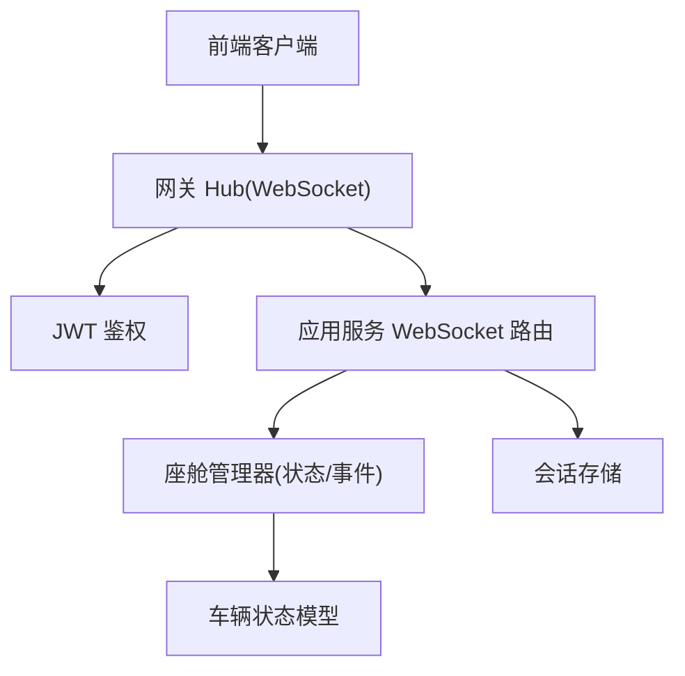
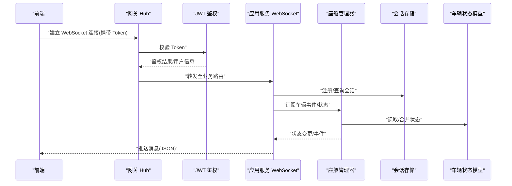
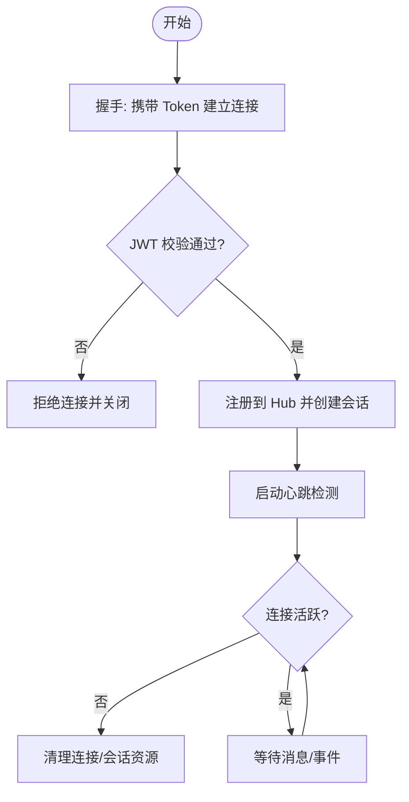
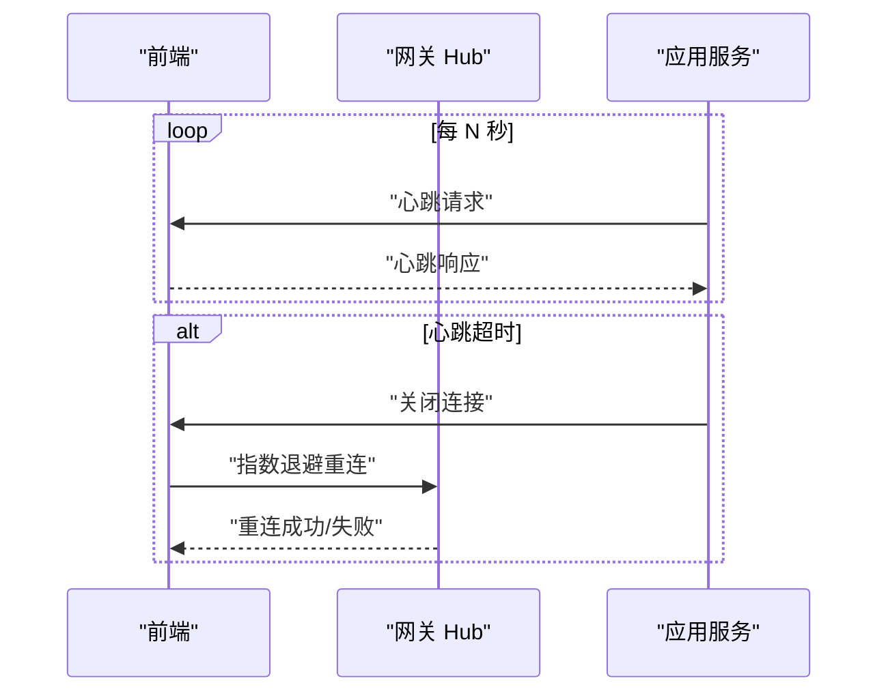
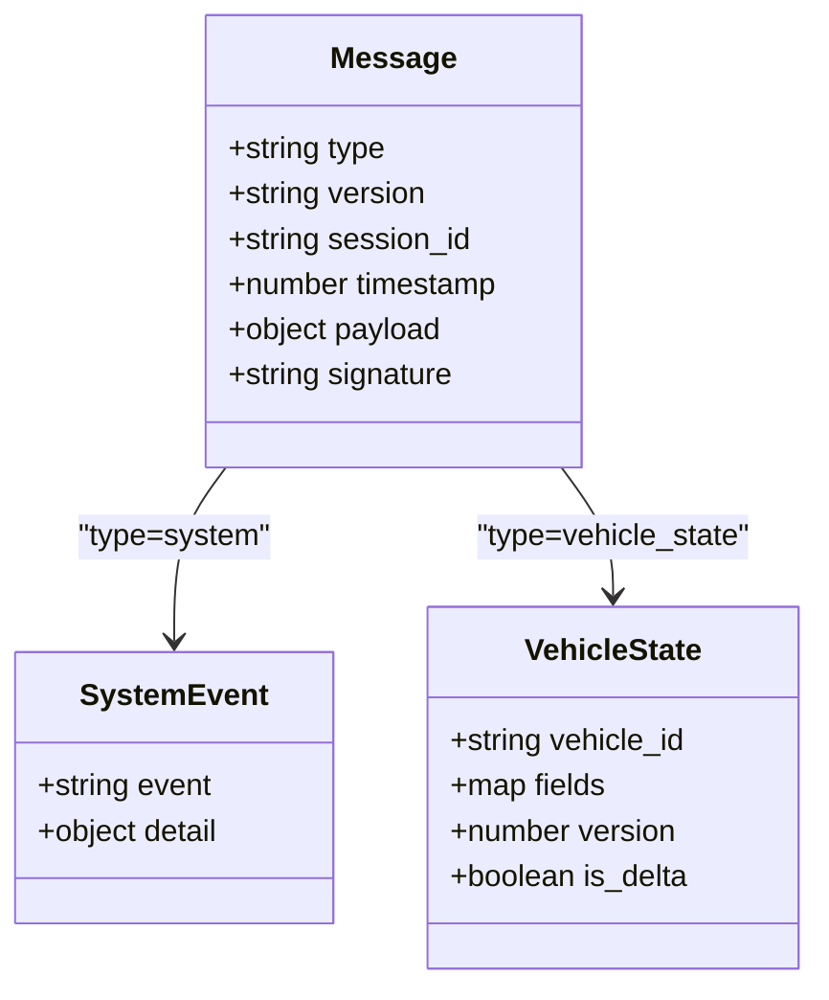
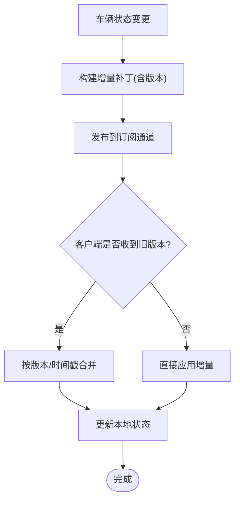
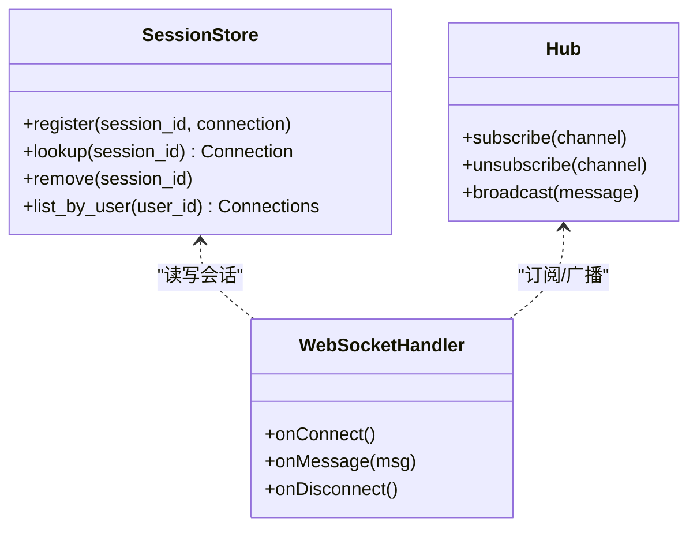
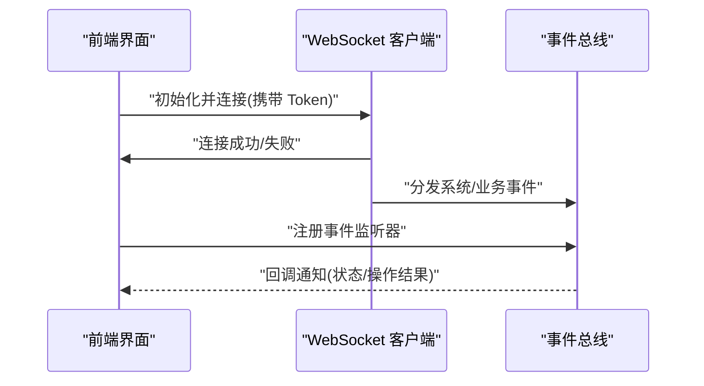
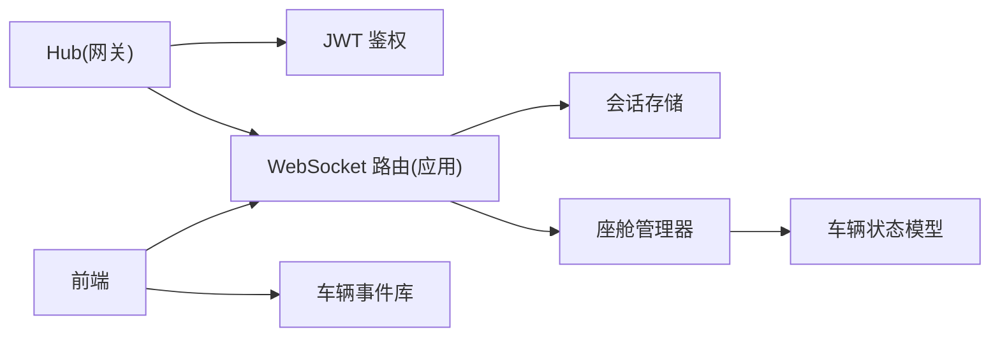

# WebSocket实时通信

<cite>
**本文引用的文件**   
- [backend_design/nexus/api/websocket.py](file://backend_design/nexus/api/websocket.py)
- [backend_design/nexus/core/cockpit_manager.py](file://backend_design/nexus/core/cockpit_manager.py)
- [backend_design/nexus/middleware/session_store.py](file://backend_design/nexus/middleware/session_store.py)
- [backend_design/nexus/models/state.py](file://backend_design/nexus/models/state.py)
- [backend_design/nexus_gate/internal/ws/hub.go](file://backend_design/nexus_gate/internal/ws/hub.go)
- [backend_design/nexus_gate/internal/auth/jwt.go](file://backend_design/nexus_gate/internal/auth/jwt.go)
- [frontend_design/src/lib/vehicle-events.ts](file://frontend_design/src/lib/vehicle-events.ts)
</cite>

## 目录
1. [简介](#简介)
2. [项目结构](#项目结构)
3. [核心组件](#核心组件)
4. [架构总览](#架构总览)
5. [详细组件分析](#详细组件分析)
6. [依赖分析](#依赖分析)
7. [性能考虑](#性能考虑)
8. [故障排查指南](#故障排查指南)
9. [结论](#结论)
10. [附录](#附录)

## 简介
本文件为 NexusCockpit 系统的 WebSocket 实时通信 API 文档，覆盖连接建立与管理、心跳与断线重连、连接池管理、消息协议设计、车辆状态同步机制、用户会话管理以及前端集成与性能优化建议。目标是帮助后端与前端工程师快速理解并正确接入实时能力。

## 项目结构
NexusCockpit 的 WebSocket 能力由网关层（Go）与应用服务层（Python）共同实现：
- 网关层负责鉴权、路由转发、Hub 广播与连接生命周期管理。
- 应用服务层提供业务级 WebSocket 接口、会话存储、车辆状态管理与推送。

图表来源
- [backend_design/nexus_gate/internal/ws/hub.go](file://backend_design/nexus_gate/internal/ws/hub.go)
- [backend_design/nexus_gate/internal/auth/jwt.go](file://backend_design/nexus_gate/internal/auth/jwt.go)
- [backend_design/nexus/api/websocket.py](file://backend_design/nexus/api/websocket.py)
- [backend_design/nexus/core/cockpit_manager.py](file://backend_design/nexus/core/cockpit_manager.py)
- [backend_design/nexus/middleware/session_store.py](file://backend_design/nexus/middleware/session_store.py)
- [backend_design/nexus/models/state.py](file://backend_design/nexus/models/state.py)

章节来源
- [backend_design/nexus/api/websocket.py](file://backend_design/nexus/api/websocket.py)
- [backend_design/nexus/core/cockpit_manager.py](file://backend_design/nexus/core/cockpit_manager.py)
- [backend_design/nexus/middleware/session_store.py](file://backend_design/nexus/middleware/session_store.py)
- [backend_design/nexus/models/state.py](file://backend_design/nexus/models/state.py)
- [backend_design/nexus_gate/internal/ws/hub.go](file://backend_design/nexus_gate/internal/ws/hub.go)
- [backend_design/nexus_gate/internal/auth/jwt.go](file://backend_design/nexus_gate/internal/auth/jwt.go)

## 核心组件
- 网关 Hub：维护所有活跃连接，处理订阅/退订、广播与连接生命周期。
- JWT 鉴权：在握手阶段校验令牌，绑定用户身份与会话上下文。
- 应用服务 WebSocket 路由：将业务语义映射到具体处理器，协调状态与事件。
- 座舱管理器：聚合车辆状态变更、事件分发与冲突解决策略。
- 会话存储：跨进程/节点共享用户会话与连接映射。
- 车辆状态模型：定义状态字段、版本与增量更新语义。

章节来源
- [backend_design/nexus_gate/internal/ws/hub.go](file://backend_design/nexus_gate/internal/ws/hub.go)
- [backend_design/nexus_gate/internal/auth/jwt.go](file://backend_design/nexus_gate/internal/auth/jwt.go)
- [backend_design/nexus/api/websocket.py](file://backend_design/nexus/api/websocket.py)
- [backend_design/nexus/core/cockpit_manager.py](file://backend_design/nexus/core/cockpit_manager.py)
- [backend_design/nexus/middleware/session_store.py](file://backend_design/nexus/middleware/session_store.py)
- [backend_design/nexus/models/state.py](file://backend_design/nexus/models/state.py)

## 架构总览
整体采用“网关 Hub + 应用服务”的双层架构：
- 前端通过 WebSocket 连接到网关；
- 网关完成鉴权后将连接交由应用服务进行业务处理；
- 应用服务基于座舱管理器与状态模型进行事件/状态同步；
- 会话存储保证多实例下的会话一致性。

图表来源
- [backend_design/nexus_gate/internal/ws/hub.go](file://backend_design/nexus_gate/internal/ws/hub.go)
- [backend_design/nexus_gate/internal/auth/jwt.go](file://backend_design/nexus_gate/internal/auth/jwt.go)
- [backend_design/nexus/api/websocket.py](file://backend_design/nexus/api/websocket.py)
- [backend_design/nexus/core/cockpit_manager.py](file://backend_design/nexus/core/cockpit_manager.py)
- [backend_design/nexus/middleware/session_store.py](file://backend_design/nexus/middleware/session_store.py)
- [backend_design/nexus/models/state.py](file://backend_design/nexus/models/state.py)

## 详细组件分析

### 连接建立与管理
- 握手流程：前端携带 Token 发起连接，网关执行 JWT 校验，通过后建立会话并将连接注册到 Hub。
- 连接生命周期：包括连接建立、心跳保活、异常关闭与资源清理。
- 连接池管理：按用户/租户维度维护连接集合，支持限流与容量控制。

图表来源
- [backend_design/nexus_gate/internal/ws/hub.go](file://backend_design/nexus_gate/internal/ws/hub.go)
- [backend_design/nexus_gate/internal/auth/jwt.go](file://backend_design/nexus_gate/internal/auth/jwt.go)
- [backend_design/nexus/api/websocket.py](file://backend_design/nexus/api/websocket.py)

章节来源
- [backend_design/nexus_gate/internal/ws/hub.go](file://backend_design/nexus_gate/internal/ws/hub.go)
- [backend_design/nexus_gate/internal/auth/jwt.go](file://backend_design/nexus_gate/internal/auth/jwt.go)
- [backend_design/nexus/api/websocket.py](file://backend_design/nexus/api/websocket.py)

### 心跳检测与断线重连
- 心跳机制：服务端周期性发送心跳帧，客户端需按时响应；超时则判定为断线。
- 断线重连：客户端指数退避重试，避免雪崩；服务端对重复连接做去重与幂等处理。
- 保活策略：结合空闲超时与最大连接数限制，防止资源泄露。

图表来源
- [backend_design/nexus_gate/internal/ws/hub.go](file://backend_design/nexus_gate/internal/ws/hub.go)
- [backend_design/nexus/api/websocket.py](file://backend_design/nexus/api/websocket.py)

章节来源
- [backend_design/nexus_gate/internal/ws/hub.go](file://backend_design/nexus_gate/internal/ws/hub.go)
- [backend_design/nexus/api/websocket.py](file://backend_design/nexus/api/websocket.py)

### 实时消息协议设计
- 传输格式：统一使用 JSON 序列化，便于跨语言与扩展。
- 消息头：包含消息类型、版本号、会话标识、时间戳与可选签名。
- 事件分类：
  - 系统事件：连接、心跳、错误、权限变更。
  - 业务事件：车辆状态变更、导航/媒体/空调等操作反馈。
  - 数据事件：批量快照、增量补丁、全量拉取。
- 幂等与顺序：通过序列号或时间戳保证顺序性，客户端可去重处理。

图表来源
- [backend_design/nexus/api/websocket.py](file://backend_design/nexus/api/websocket.py)
- [backend_design/nexus/models/state.py](file://backend_design/nexus/models/state.py)

章节来源
- [backend_design/nexus/api/websocket.py](file://backend_design/nexus/api/websocket.py)
- [backend_design/nexus/models/state.py](file://backend_design/nexus/models/state.py)

### 车辆状态同步机制
- 状态变更推送：当车辆状态变化时，座舱管理器生成事件并推送到相关订阅者。
- 增量更新：仅推送变更字段，附带版本号，客户端合并后保持本地一致。
- 冲突解决：以服务端权威为准，结合时间戳与版本号进行合并；必要时触发全量拉取。

图表来源
- [backend_design/nexus/core/cockpit_manager.py](file://backend_design/nexus/core/cockpit_manager.py)
- [backend_design/nexus/models/state.py](file://backend_design/nexus/models/state.py)

章节来源
- [backend_design/nexus/core/cockpit_manager.py](file://backend_design/nexus/core/cockpit_manager.py)
- [backend_design/nexus/models/state.py](file://backend_design/nexus/models/state.py)

### 用户会话管理
- 多客户端支持：同一用户可在多个设备/标签页同时在线，各自拥有独立连接与会话。
- 会话隔离：按用户/租户维度隔离消息路由与状态视图。
- 状态共享：通过会话存储实现跨实例的状态共享与连接映射。

图表来源
- [backend_design/nexus/middleware/session_store.py](file://backend_design/nexus/middleware/session_store.py)
- [backend_design/nexus_gate/internal/ws/hub.go](file://backend_design/nexus_gate/internal/ws/hub.go)
- [backend_design/nexus/api/websocket.py](file://backend_design/nexus/api/websocket.py)

章节来源
- [backend_design/nexus/middleware/session_store.py](file://backend_design/nexus/middleware/session_store.py)
- [backend_design/nexus_gate/internal/ws/hub.go](file://backend_design/nexus_gate/internal/ws/hub.go)
- [backend_design/nexus/api/websocket.py](file://backend_design/nexus/api/websocket.py)

### 前端集成指南
- 连接管理：封装连接建立、鉴权参数注入、自动重连与退避策略。
- 事件监听：按事件类型注册回调，区分系统事件与业务事件。
- 错误处理：捕获网络异常、鉴权失败、协议不兼容等场景，并提供降级策略。
- 参考模块：前端事件总线与工具库用于统一处理车辆事件与通用逻辑。

图表来源
- [frontend_design/src/lib/vehicle-events.ts](file://frontend_design/src/lib/vehicle-events.ts)
- [backend_design/nexus/api/websocket.py](file://backend_design/nexus/api/websocket.py)

章节来源
- [frontend_design/src/lib/vehicle-events.ts](file://frontend_design/src/lib/vehicle-events.ts)
- [backend_design/nexus/api/websocket.py](file://backend_design/nexus/api/websocket.py)

## 依赖分析
- 网关 Hub 依赖 JWT 鉴权与连接注册表。
- 应用服务 WebSocket 依赖会话存储与座舱管理器。
- 座舱管理器依赖车辆状态模型与事件源。
- 前端依赖事件总线与通用工具库。

图表来源
- [backend_design/nexus_gate/internal/ws/hub.go](file://backend_design/nexus_gate/internal/ws/hub.go)
- [backend_design/nexus_gate/internal/auth/jwt.go](file://backend_design/nexus_gate/internal/auth/jwt.go)
- [backend_design/nexus/api/websocket.py](file://backend_design/nexus/api/websocket.py)
- [backend_design/nexus/middleware/session_store.py](file://backend_design/nexus/middleware/session_store.py)
- [backend_design/nexus/core/cockpit_manager.py](file://backend_design/nexus/core/cockpit_manager.py)
- [backend_design/nexus/models/state.py](file://backend_design/nexus/models/state.py)
- [frontend_design/src/lib/vehicle-events.ts](file://frontend_design/src/lib/vehicle-events.ts)

章节来源
- [backend_design/nexus_gate/internal/ws/hub.go](file://backend_design/nexus_gate/internal/ws/hub.go)
- [backend_design/nexus_gate/internal/auth/jwt.go](file://backend_design/nexus_gate/internal/auth/jwt.go)
- [backend_design/nexus/api/websocket.py](file://backend_design/nexus/api/websocket.py)
- [backend_design/nexus/middleware/session_store.py](file://backend_design/nexus/middleware/session_store.py)
- [backend_design/nexus/core/cockpit_manager.py](file://backend_design/nexus/core/cockpit_manager.py)
- [backend_design/nexus/models/state.py](file://backend_design/nexus/models/state.py)
- [frontend_design/src/lib/vehicle-events.ts](file://frontend_design/src/lib/vehicle-events.ts)

## 性能考虑
- 消息批处理：对高频小消息进行聚合，降低序列化与网络开销。
- 连接复用：在同一用户/租户下复用长连接，减少握手成本。
- 资源清理：及时释放未使用的订阅与临时缓存，避免内存泄漏。
- 背压与限流：在高负载时启用速率限制与丢弃策略，保障核心功能可用。
- 增量优先：默认推送增量补丁，仅在必要时回退到全量快照。

[本节为通用指导，无需特定文件引用]

## 故障排查指南
- 连接失败：检查 Token 有效性、网关可达性与防火墙策略。
- 心跳超时：确认客户端与服务端的心跳间隔配置一致，观察网络抖动。
- 状态不同步：核对版本号与时间戳，必要时触发全量拉取。
- 会话丢失：检查会话存储可用性，验证跨实例连接映射是否正确。
- 日志定位：结合网关与应用服务的日志，定位握手、鉴权与推送链路。

章节来源
- [backend_design/nexus_gate/internal/ws/hub.go](file://backend_design/nexus_gate/internal/ws/hub.go)
- [backend_design/nexus_gate/internal/auth/jwt.go](file://backend_design/nexus_gate/internal/auth/jwt.go)
- [backend_design/nexus/api/websocket.py](file://backend_design/nexus/api/websocket.py)
- [backend_design/nexus/middleware/session_store.py](file://backend_design/nexus/middleware/session_store.py)

## 结论
NexusCockpit 的 WebSocket 实时通信通过网关 Hub 与应用服务协同，实现了高可靠、可扩展的实时能力。统一的 JSON 协议、增量状态同步与会话隔离确保了良好的用户体验与运维可控性。建议在生产环境完善监控告警与压测验证，持续优化性能与稳定性。

[本节为总结性内容，无需特定文件引用]

## 附录
- 术语说明：
  - 会话：用户维度的连接上下文，承载鉴权信息与订阅关系。
  - 增量补丁：仅包含变更字段的轻量状态更新。
  - 背压：在高负载时对输入进行限速或丢弃的策略。
- 最佳实践：
  - 前端实现指数退避重连与连接池管理。
  - 服务端启用心跳与空闲超时，配合限流保护。
  - 状态同步优先使用增量，必要时回退全量。

[本节为补充说明，无需特定文件引用]