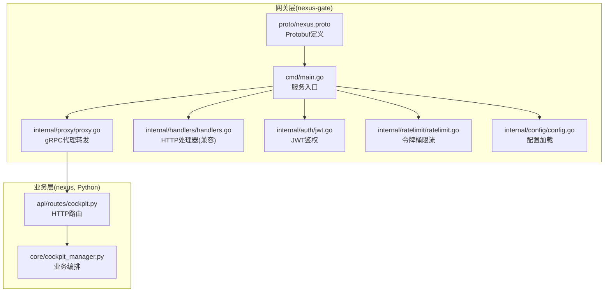
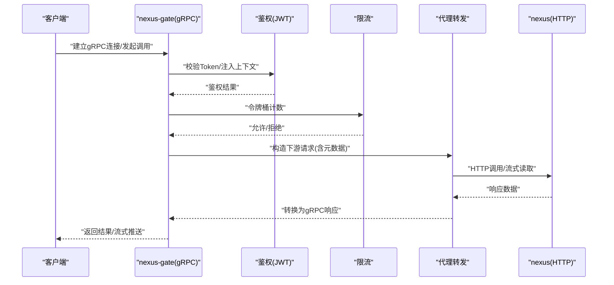
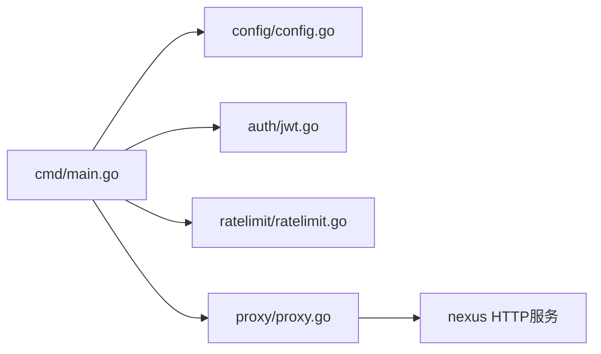

# gRPC内部接口

<cite>
**本文引用的文件**   
- [backend_design/nexus_gate/proto/nexus.proto](file://backend_design/nexus_gate/proto/nexus.proto)
- [backend_design/nexus_gate/cmd/main.go](file://backend_design/nexus_gate/cmd/main.go)
- [backend_design/nexus_gate/internal/proxy/proxy.go](file://backend_design/nexus_gate/internal/proxy/proxy.go)
- [backend_design/nexus_gate/internal/handlers/handlers.go](file://backend_design/nexus_gate/internal/handlers/handlers.go)
- [backend_design/nexus_gate/internal/auth/jwt.go](file://backend_design/nexus_gate/internal/auth/jwt.go)
- [backend_design/nexus_gate/internal/ratelimit/ratelimit.go](file://backend_design/nexus_gate/internal/ratelimit/ratelimit.go)
- [backend_design/nexus_gate/internal/config/config.go](file://backend_design/nexus_gate/internal/config/config.go)
- [backend_design/nexus/api/routes/cockpit.py](file://backend_design/nexus/api/routes/cockpit.py)
- [backend_design/nexus/core/cockpit_manager.py](file://backend_design/nexus/core/cockpit_manager.py)
</cite>

## 目录
1. [简介](#简介)
2. [项目结构](#项目结构)
3. [核心组件](#核心组件)
4. [架构总览](#架构总览)
5. [详细组件分析](#详细组件分析)
6. [依赖关系分析](#依赖关系分析)
7. [性能考虑](#性能考虑)
8. [故障排查指南](#故障排查指南)
9. [结论](#结论)
10. [附录](#附录)

## 简介
本文件为NexusCockpit系统的gRPC内部接口文档，聚焦于网关服务nexus-gate与后端Python服务nexus之间的内部通信。内容涵盖：
- gRPC服务架构设计与服务划分
- Protobuf消息格式定义、类型映射与版本兼容性策略
- 服务间通信模式（同步调用、异步处理、流式传输）
- 服务发现与服务注册机制（负载均衡、故障转移、健康检查）
- gRPC客户端开发指南（连接配置、调用封装、错误处理）
- gRPC性能优化策略（连接池管理、消息压缩、并发控制）

## 项目结构
本项目中与gRPC相关的实现主要集中在Go实现的网关服务nexus-gate中，包含proto定义、服务启动、鉴权、限流、代理转发等模块；后端Python服务nexus提供HTTP API供网关转发或扩展使用。

图表来源
- [backend_design/nexus_gate/cmd/main.go](file://backend_design/nexus_gate/cmd/main.go)
- [backend_design/nexus_gate/internal/proxy/proxy.go](file://backend_design/nexus_gate/internal/proxy/proxy.go)
- [backend_design/nexus_gate/internal/handlers/handlers.go](file://backend_design/nexus_gate/internal/handlers/handlers.go)
- [backend_design/nexus_gate/internal/auth/jwt.go](file://backend_design/nexus_gate/internal/auth/jwt.go)
- [backend_design/nexus_gate/internal/ratelimit/ratelimit.go](file://backend_design/nexus_gate/internal/ratelimit/ratelimit.go)
- [backend_design/nexus_gate/internal/config/config.go](file://backend_design/nexus_gate/internal/config/config.go)
- [backend_design/nexus_gate/proto/nexus.proto](file://backend_design/nexus_gate/proto/nexus.proto)
- [backend_design/nexus/api/routes/cockpit.py](file://backend_design/nexus/api/routes/cockpit.py)
- [backend_design/nexus/core/cockpit_manager.py](file://backend_design/nexus/core/cockpit_manager.py)

章节来源
- [backend_design/nexus_gate/cmd/main.go](file://backend_design/nexus_gate/cmd/main.go)
- [backend_design/nexus_gate/proto/nexus.proto](file://backend_design/nexus_gate/proto/nexus.proto)

## 核心组件
- 服务入口与生命周期管理：负责初始化配置、加载中间件、启动gRPC服务器并注册服务。
- Protobuf定义：统一消息结构与字段语义，作为跨语言契约。
- 代理转发：将gRPC请求按方法路由到后端服务，支持透传上下文与元数据。
- 鉴权与限流：在接入层进行JWT校验与速率限制，保障安全与稳定性。
- 配置中心：集中化管理端口、TLS、后端地址、超时等参数。

章节来源
- [backend_design/nexus_gate/cmd/main.go](file://backend_design/nexus_gate/cmd/main.go)
- [backend_design/nexus_gate/internal/config/config.go](file://backend_design/nexus_gate/internal/config/config.go)
- [backend_design/nexus_gate/internal/auth/jwt.go](file://backend_design/nexus_gate/internal/auth/jwt.go)
- [backend_design/nexus_gate/internal/ratelimit/ratelimit.go](file://backend_design/nexus_gate/internal/ratelimit/ratelimit.go)
- [backend_design/nexus_gate/internal/proxy/proxy.go](file://backend_design/nexus_gate/internal/proxy/proxy.go)
- [backend_design/nexus_gate/proto/nexus.proto](file://backend_design/nexus_gate/proto/nexus.proto)

## 架构总览
整体采用“网关+后端”的内外分层架构。外部客户端通过gRPC访问网关，网关完成鉴权、限流后，将请求转发至后端Python服务。对于需要长时任务或实时数据的场景，可通过流式gRPC或WebSocket配合实现。

图表来源
- [backend_design/nexus_gate/cmd/main.go](file://backend_design/nexus_gate/cmd/main.go)
- [backend_design/nexus_gate/internal/auth/jwt.go](file://backend_design/nexus_gate/internal/auth/jwt.go)
- [backend_design/nexus_gate/internal/ratelimit/ratelimit.go](file://backend_design/nexus_gate/internal/ratelimit/ratelimit.go)
- [backend_design/nexus_gate/internal/proxy/proxy.go](file://backend_design/nexus_gate/internal/proxy/proxy.go)
- [backend_design/nexus/api/routes/cockpit.py](file://backend_design/nexus/api/routes/cockpit.py)

## 详细组件分析

### Protobuf消息与接口定义
- 作用域：定义服务名、方法与消息体，确保前后端一致的数据契约。
- 类型映射：标准Protobuf标量类型与Go/Python原生类型一一对应，避免精度丢失与编码歧义。
- 版本兼容：新增字段采用向后兼容策略（仅追加字段），删除字段需废弃标记与迁移期过渡。
- 命名规范：服务与方法采用小驼峰或下划线风格统一，消息字段使用小写下划线。

章节来源
- [backend_design/nexus_gate/proto/nexus.proto](file://backend_design/nexus_gate/proto/nexus.proto)

### 服务划分与职责
- nexus-gate（网关）
  - 暴露gRPC服务，承担鉴权、限流、日志、追踪、协议转换与转发职责。
  - 可横向扩展，无状态设计便于水平扩容。
- nexus（后端）
  - 提供领域能力与数据访问，当前以HTTP接口为主，可由网关适配为gRPC。
  - 负责复杂业务编排、持久化与外部系统交互。

章节来源
- [backend_design/nexus_gate/cmd/main.go](file://backend_design/nexus_gate/cmd/main.go)
- [backend_design/nexus/api/routes/cockpit.py](file://backend_design/nexus/api/routes/cockpit.py)
- [backend_design/nexus/core/cockpit_manager.py](file://backend_design/nexus/core/cockpit_manager.py)

### 服务间通信模式
- 同步调用：适用于短耗时、强一致的场景，如查询类接口。
- 异步处理：通过队列或事件总线解耦，适用于耗时任务与批处理。
- 流式传输：服务端/客户端双向流用于实时数据推送或大文件分块传输。

章节来源
- [backend_design/nexus_gate/internal/proxy/proxy.go](file://backend_design/nexus_gate/internal/proxy/proxy.go)
- [backend_design/nexus/api/routes/cockpit.py](file://backend_design/nexus/api/routes/cockpit.py)

### 鉴权与限流
- JWT鉴权：解析Token、校验签名、提取用户上下文并注入到下游请求头。
- 令牌桶限流：基于IP/用户维度进行QPS限制，防止过载与滥用。

章节来源
- [backend_design/nexus_gate/internal/auth/jwt.go](file://backend_design/nexus_gate/internal/auth/jwt.go)
- [backend_design/nexus_gate/internal/ratelimit/ratelimit.go](file://backend_design/nexus_gate/internal/ratelimit/ratelimit.go)

### 配置管理
- 集中化配置：包括gRPC监听端口、TLS证书、后端服务地址、超时时间、重试策略等。
- 动态更新：支持热重载配置项，减少重启带来的抖动。

章节来源
- [backend_design/nexus_gate/internal/config/config.go](file://backend_design/nexus_gate/internal/config/config.go)

## 依赖关系分析
- 直接依赖
  - cmd/main.go 依赖 config、auth、ratelimit、proxy 等模块。
  - proxy 依赖后端HTTP服务与配置。
  - auth 依赖密钥与算法库。
  - ratelimit 依赖内存或Redis存储（视实现）。
- 间接依赖
  - 日志、监控、追踪等横切关注点由中间件注入。
- 潜在循环依赖
  - 建议通过接口抽象与依赖注入避免包级循环引用。

图表来源
- [backend_design/nexus_gate/cmd/main.go](file://backend_design/nexus_gate/cmd/main.go)
- [backend_design/nexus_gate/internal/config/config.go](file://backend_design/nexus_gate/internal/config/config.go)
- [backend_design/nexus_gate/internal/auth/jwt.go](file://backend_design/nexus_gate/internal/auth/jwt.go)
- [backend_design/nexus_gate/internal/ratelimit/ratelimit.go](file://backend_design/nexus_gate/internal/ratelimit/ratelimit.go)
- [backend_design/nexus_gate/internal/proxy/proxy.go](file://backend_design/nexus_gate/internal/proxy/proxy.go)

章节来源
- [backend_design/nexus_gate/cmd/main.go](file://backend_design/nexus_gate/cmd/main.go)
- [backend_design/nexus_gate/internal/proxy/proxy.go](file://backend_design/nexus_gate/internal/proxy/proxy.go)

## 性能考虑
- 连接池管理
  - 复用底层TCP连接，合理设置最大空闲连接数与连接存活时间。
  - 针对热点服务启用连接预热，降低冷启动延迟。
- 消息压缩
  - 对大体积消息启用gzip或snappy压缩，权衡CPU与带宽成本。
  - 对小消息禁用压缩以减少开销。
- 并发控制
  - 限制单实例并发度，结合队列背压保护后端。
  - 使用批量发送与合并响应减少往返次数。
- 超时与重试
  - 设置合理的调用超时与退避重试策略，避免雪崩。
  - 区分幂等与非幂等操作的重试边界。
- 缓存与旁路
  - 热点读路径引入本地/分布式缓存，降低后端压力。
- 观测性
  - 采集延迟、吞吐、错误率指标，结合链路追踪定位瓶颈。

[本节为通用指导，不直接分析具体文件]

## 故障排查指南
- 常见问题
  - 鉴权失败：检查JWT签名、过期时间与颁发者配置。
  - 限流触发：观察令牌桶剩余配额与峰值流量，调整阈值。
  - 代理超时：核对后端可用性与网络延迟，适当放宽超时或增加重试。
  - 流式中断：检查心跳与保活配置，确认中间设备未截断长连接。
- 诊断手段
  - 开启详细日志与Trace ID透传，快速定位问题链路。
  - 使用健康检查端点验证服务可用性。
  - 压测模拟异常场景，验证熔断与降级策略。

章节来源
- [backend_design/nexus_gate/internal/auth/jwt.go](file://backend_design/nexus_gate/internal/auth/jwt.go)
- [backend_design/nexus_gate/internal/ratelimit/ratelimit.go](file://backend_design/nexus_gate/internal/ratelimit/ratelimit.go)
- [backend_design/nexus_gate/internal/proxy/proxy.go](file://backend_design/nexus_gate/internal/proxy/proxy.go)

## 结论
通过统一的Protobuf契约与网关层的鉴权、限流、代理能力，NexusCockpit实现了稳定高效的内部gRPC通信。建议在后续演进中逐步将后端关键接口迁移为原生gRPC，以提升端到端性能与可观测性，同时完善服务发现与健康检查体系，支撑大规模集群部署。

[本节为总结性内容，不直接分析具体文件]

## 附录

### gRPC客户端开发指南
- 连接配置
  - 指定目标地址、端口与TLS选项；配置连接池大小与空闲回收策略。
  - 设置全局超时与默认元数据（如租户ID、TraceID）。
- 调用封装
  - 封装重试与退避逻辑，区分幂等与非幂等操作。
  - 统一错误码映射与异常包装，便于上层处理。
- 错误处理
  - 区分网络错误、鉴权错误、限流错误与业务错误。
  - 对可恢复错误实施指数退避重试，对不可恢复错误快速失败。
- 流式调用
  - 客户端流：适合上传大量数据或持续输入。
  - 服务端流：适合实时推送与增量更新。
  - 双向流：适合交互式会话与协同编辑。

[本节为通用指导，不直接分析具体文件]

### 服务发现与注册机制
- 注册与发现
  - 服务启动时向注册中心登记自身信息（地址、端口、标签）。
  - 客户端从注册中心拉取最新实例列表，实现就近访问。
- 负载均衡
  - 支持轮询、最少连接、一致性哈希等策略。
  - 结合权重与地域标签实现灰度与多活。
- 故障转移与健康检查
  - 定期探测实例健康状态，剔除异常节点。
  - 自动重路由与重试，提升可用性。
- 配置下发
  - 动态下发路由规则、黑白名单与开关策略。

[本节为通用指导，不直接分析具体文件]

### Protobuf版本兼容性策略
- 字段增删改
  - 新增字段：保持向后兼容，旧客户端忽略未知字段。
  - 删除字段：先标记废弃，保留一段时间后再移除。
  - 修改字段：谨慎变更类型与语义，必要时创建新消息并双写过渡。
- 枚举与嵌套
  - 枚举新增值需向后兼容，禁止重排已有值。
  - 嵌套结构变更遵循最小影响原则。
- 生成代码
  - 在多语言环境中保持生成器版本一致，避免ABI差异。

[本节为通用指导，不直接分析具体文件]