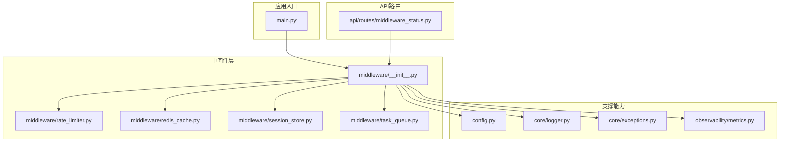
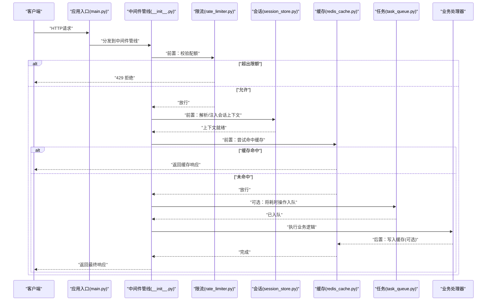
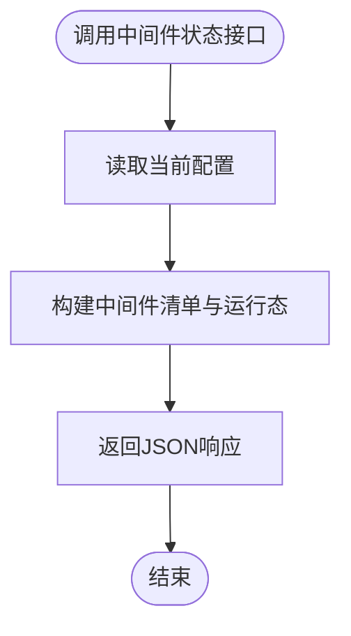
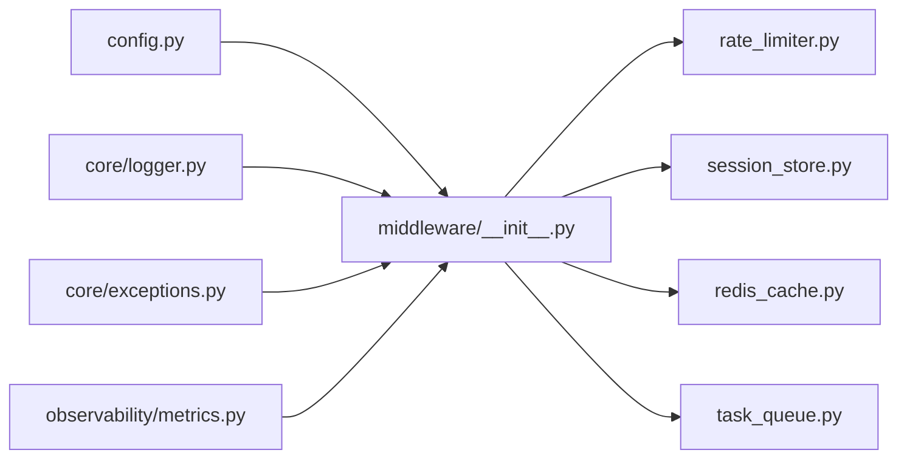

# 中间件架构

<cite>
**本文引用的文件**   
- [backend_design/nexus/middleware/__init__.py](file://backend_design/nexus/middleware/__init__.py)
- [backend_design/nexus/middleware/rate_limiter.py](file://backend_design/nexus/middleware/rate_limiter.py)
- [backend_design/nexus/middleware/redis_cache.py](file://backend_design/nexus/middleware/redis_cache.py)
- [backend_design/nexus/middleware/session_store.py](file://backend_design/nexus/middleware/session_store.py)
- [backend_design/nexus/middleware/task_queue.py](file://backend_design/nexus/middleware/task_queue.py)
- [backend_design/nexus/api/routes/middleware_status.py](file://backend_design/nexus/api/routes/middleware_status.py)
- [backend_design/nexus/config.py](file://backend_design/nexus/config.py)
- [backend_design/nexus/core/logger.py](file://backend_design/nexus/core/logger.py)
- [backend_design/nexus/core/exceptions.py](file://backend_design/nexus/core/exceptions.py)
- [backend_design/nexus/observability/metrics.py](file://backend_design/nexus/observability/metrics.py)
- [backend_design/nexus/main.py](file://backend_design/nexus/main.py)
</cite>

## 目录
1. [简介](#简介)
2. [项目结构](#项目结构)
3. [核心组件](#核心组件)
4. [架构总览](#架构总览)
5. [详细组件分析](#详细组件分析)
6. [依赖关系分析](#依赖关系分析)
7. [性能考量](#性能考量)
8. [故障排查指南](#故障排查指南)
9. [结论](#结论)
10. [附录](#附录)

## 简介
本文件面向NexusCockpit系统的中间件层，系统性阐述其设计模式与实现要点。文档覆盖请求拦截、响应处理与横切关注点的统一处理方式；详解限流、缓存、会话存储与任务队列等关键中间件的原理与行为；说明执行顺序、依赖关系、错误传播与性能影响；给出配置与管理方式（动态启用/禁用、参数调优、监控指标）；并提供自定义中间件的开发指南（接口规范、最佳实践、测试方法），以及高可用设计与故障隔离策略。

## 项目结构
中间件位于后端模块的 middleware 包中，配合路由层、配置与可观测性能力形成完整的横切能力体系。整体组织遵循“按功能域分层 + 按能力模块化”的方式：
- 中间件实现：rate_limiter、redis_cache、session_store、task_queue
- 中间件注册与装配入口：middleware 包的初始化文件
- 运行时管理：API 路由提供中间件状态查询与动态控制
- 配置与日志：config、logger、exceptions
- 可观测性：metrics 暴露关键指标

图表来源
- [backend_design/nexus/main.py](file://backend_design/nexus/main.py)
- [backend_design/nexus/middleware/__init__.py](file://backend_design/nexus/middleware/__init__.py)
- [backend_design/nexus/middleware/rate_limiter.py](file://backend_design/nexus/middleware/rate_limiter.py)
- [backend_design/nexus/middleware/redis_cache.py](file://backend_design/nexus/middleware/redis_cache.py)
- [backend_design/nexus/middleware/session_store.py](file://backend_design/nexus/middleware/session_store.py)
- [backend_design/nexus/middleware/task_queue.py](file://backend_design/nexus/middleware/task_queue.py)
- [backend_design/nexus/api/routes/middleware_status.py](file://backend_design/nexus/api/routes/middleware_status.py)
- [backend_design/nexus/config.py](file://backend_design/nexus/config.py)
- [backend_design/nexus/core/logger.py](file://backend_design/nexus/core/logger.py)
- [backend_design/nexus/core/exceptions.py](file://backend_design/nexus/core/exceptions.py)
- [backend_design/nexus/observability/metrics.py](file://backend_design/nexus/observability/metrics.py)

章节来源
- [backend_design/nexus/middleware/__init__.py](file://backend_design/nexus/middleware/__init__.py)
- [backend_design/nexus/main.py](file://backend_design/nexus/main.py)

## 核心组件
本节聚焦中间件层的通用机制与各具体中间件职责：
- 通用机制
  - 请求拦截与响应处理：在请求进入业务逻辑前进行前置处理，在返回响应后进行后置处理，保证横切关注点（如鉴权、限流、缓存、会话、异步任务）的统一编排。
  - 执行顺序与依赖：通过统一的装配入口维护加载顺序，确保依赖先于被依赖者执行（例如会话存储应在缓存之前完成上下文注入）。
  - 错误传播与降级：异常由中间件捕获并转换为标准响应或继续向上传播，同时记录日志与指标。
  - 可观测性：埋点指标包括耗时、命中率、拒绝率、队列长度等。
- 具体中间件
  - 限流中间件：基于客户端标识或租户维度进行速率限制，支持滑动窗口或令牌桶策略，超限直接拒绝并返回相应状态码。
  - 缓存中间件：对读多写少接口提供缓存命中与回源写入，支持键空间、TTL、失效策略与一致性保障。
  - 会话存储中间件：负责会话上下文的创建、读取与更新，持久化到外部存储（如Redis），并在请求间传递用户与租户信息。
  - 任务队列中间件：将耗时操作入队，解耦主请求路径，支持优先级、重试与失败告警。

章节来源
- [backend_design/nexus/middleware/rate_limiter.py](file://backend_design/nexus/middleware/rate_limiter.py)
- [backend_design/nexus/middleware/redis_cache.py](file://backend_design/nexus/middleware/redis_cache.py)
- [backend_design/nexus/middleware/session_store.py](file://backend_design/nexus/middleware/session_store.py)
- [backend_design/nexus/middleware/task_queue.py](file://backend_design/nexus/middleware/task_queue.py)

## 架构总览
中间件层采用“管道+过滤器”模式，所有请求在进入控制器之前依次经过各中间件，每个中间件可选择短路返回或放行至下一个中间件。

图表来源
- [backend_design/nexus/main.py](file://backend_design/nexus/main.py)
- [backend_design/nexus/middleware/__init__.py](file://backend_design/nexus/middleware/__init__.py)
- [backend_design/nexus/middleware/rate_limiter.py](file://backend_design/nexus/middleware/rate_limiter.py)
- [backend_design/nexus/middleware/session_store.py](file://backend_design/nexus/middleware/session_store.py)
- [backend_design/nexus/middleware/redis_cache.py](file://backend_design/nexus/middleware/redis_cache.py)
- [backend_design/nexus/middleware/task_queue.py](file://backend_design/nexus/middleware/task_queue.py)

## 详细组件分析

### 限流中间件
- 设计目标
  - 保护系统免受突发流量冲击，防止资源耗尽。
  - 支持多维度限流（IP、租户、用户、接口级别）。
- 关键特性
  - 策略：滑动窗口/令牌桶（根据实现选择）。
  - 阈值：全局与局部配额，支持动态调整。
  - 拒绝策略：快速失败，返回标准状态码与提示。
- 执行位置
  - 通常置于管线最前端，尽早拒绝非法或超量请求。
- 指标与日志
  - 计数：请求总量、拒绝次数、拒绝原因分布。
  - 延迟：限流判断耗时。
- 错误与降级
  - 若限流存储不可用，可选择保守放行或严格拒绝（依据配置）。
- 配置项建议
  - 开关、默认配额、维度键生成规则、存储后端地址、统计周期。

章节来源
- [backend_design/nexus/middleware/rate_limiter.py](file://backend_design/nexus/middleware/rate_limiter.py)
- [backend_design/nexus/core/logger.py](file://backend_design/nexus/core/logger.py)
- [backend_design/nexus/observability/metrics.py](file://backend_design/nexus/observability/metrics.py)

### 缓存中间件
- 设计目标
  - 降低热点数据访问延迟，减少下游压力。
- 关键特性
  - 命中/未命中分支：命中直接返回；未命中回源后回填。
  - 键空间：按接口、参数、租户等维度生成稳定键。
  - TTL与失效：支持过期时间与主动失效。
  - 一致性：考虑并发回源与缓存击穿防护。
- 执行位置
  - 通常在会话上下文之后，确保键空间包含必要上下文。
- 指标与日志
  - 命中率、回源次数、缓存写入次数、过期数量。
- 错误与降级
  - 缓存不可用时降级为直连回源；记录错误并上报。
- 配置项建议
  - 是否启用、TTL默认值、键前缀、最大容量、压缩策略、读写超时。

章节来源
- [backend_design/nexus/middleware/redis_cache.py](file://backend_design/nexus/middleware/redis_cache.py)
- [backend_design/nexus/core/logger.py](file://backend_design/nexus/core/logger.py)
- [backend_design/nexus/observability/metrics.py](file://backend_design/nexus/observability/metrics.py)

### 会话存储中间件
- 设计目标
  - 在请求间维护用户与租户上下文，提供一致的会话生命周期管理。
- 关键特性
  - 会话创建/读取/更新：从请求头或Cookie解析标识，加载或创建会话。
  - 持久化：使用外部存储（如Redis）保存会话数据。
  - 上下文注入：将会话信息注入后续中间件与业务逻辑。
- 执行位置
  - 在限流之后、缓存之前，确保会话上下文可用于键生成与权限判断。
- 指标与日志
  - 会话创建数、读取数、更新数、过期清理数。
- 错误与降级
  - 存储不可用时，可选择本地内存兜底或拒绝请求（依据安全策略）。
- 配置项建议
  - 存储地址、密钥加密、会话TTL、最大大小、清理策略。

章节来源
- [backend_design/nexus/middleware/session_store.py](file://backend_design/nexus/middleware/session_store.py)
- [backend_design/nexus/core/logger.py](file://backend_design/nexus/core/logger.py)
- [backend_design/nexus/observability/metrics.py](file://backend_design/nexus/observability/metrics.py)

### 任务队列中间件
- 设计目标
  - 将耗时操作异步化，提升主请求吞吐与稳定性。
- 关键特性
  - 入队：将任务序列化后投递到队列。
  - 出队与消费：独立消费者处理任务，支持重试与死信。
  - 幂等与去重：基于任务ID或业务键避免重复处理。
- 执行位置
  - 在业务处理前后按需入队，避免阻塞主流程。
- 指标与日志
  - 入队/出队速率、积压长度、失败重试次数、平均处理时长。
- 错误与降级
  - 队列不可用时，可选择同步执行（降级）、丢弃（仅非关键任务）或延迟重试。
- 配置项建议
  - 队列地址、并发度、重试次数、超时时间、优先级策略。

章节来源
- [backend_design/nexus/middleware/task_queue.py](file://backend_design/nexus/middleware/task_queue.py)
- [backend_design/nexus/core/logger.py](file://backend_design/nexus/core/logger.py)
- [backend_design/nexus/observability/metrics.py](file://backend_design/nexus/observability/metrics.py)

### 中间件状态管理与动态控制
- 能力概述
  - 提供API用于查询与动态调整中间件状态（启用/禁用、参数热更新）。
  - 结合配置中心或本地配置实现灰度与回滚。
- 典型流程
  - 调用状态接口 -> 读取当前配置 -> 返回中间件清单与运行态 -> 可选更新配置并生效。
- 安全与审计
  - 管理接口需鉴权与审计，变更需留痕并可追溯。

图表来源
- [backend_design/nexus/api/routes/middleware_status.py](file://backend_design/nexus/api/routes/middleware_status.py)
- [backend_design/nexus/config.py](file://backend_design/nexus/config.py)

章节来源
- [backend_design/nexus/api/routes/middleware_status.py](file://backend_design/nexus/api/routes/middleware_status.py)
- [backend_design/nexus/config.py](file://backend_design/nexus/config.py)

## 依赖关系分析
- 内部依赖
  - 中间件均依赖配置模块获取运行时参数。
  - 中间件使用日志模块记录关键事件与诊断信息。
  - 中间件通过异常模块抛出标准化错误，便于上层统一处理。
  - 中间件通过指标模块上报可观测性数据。
- 外部依赖
  - 缓存与会话可能依赖Redis等外部存储。
  - 任务队列依赖消息队列服务。
- 耦合与内聚
  - 中间件之间通过上下文对象传递共享状态，避免直接相互引用，保持松耦合。
  - 管线装配集中管理，提高内聚性与可维护性。

图表来源
- [backend_design/nexus/config.py](file://backend_design/nexus/config.py)
- [backend_design/nexus/core/logger.py](file://backend_design/nexus/core/logger.py)
- [backend_design/nexus/core/exceptions.py](file://backend_design/nexus/core/exceptions.py)
- [backend_design/nexus/observability/metrics.py](file://backend_design/nexus/observability/metrics.py)
- [backend_design/nexus/middleware/__init__.py](file://backend_design/nexus/middleware/__init__.py)
- [backend_design/nexus/middleware/rate_limiter.py](file://backend_design/nexus/middleware/rate_limiter.py)
- [backend_design/nexus/middleware/session_store.py](file://backend_design/nexus/middleware/session_store.py)
- [backend_design/nexus/middleware/redis_cache.py](file://backend_design/nexus/middleware/redis_cache.py)
- [backend_design/nexus/middleware/task_queue.py](file://backend_design/nexus/middleware/task_queue.py)

章节来源
- [backend_design/nexus/middleware/__init__.py](file://backend_design/nexus/middleware/__init__.py)
- [backend_design/nexus/config.py](file://backend_design/nexus/config.py)
- [backend_design/nexus/core/logger.py](file://backend_design/nexus/core/logger.py)
- [backend_design/nexus/core/exceptions.py](file://backend_design/nexus/core/exceptions.py)
- [backend_design/nexus/observability/metrics.py](file://backend_design/nexus/observability/metrics.py)

## 性能考量
- 执行顺序优化
  - 将无副作用且低开销的中间件前置（如限流），尽早短路以节省资源。
  - 将需要上下文的中间件（会话）放在缓存之前，避免无效缓存键计算。
- I/O与并发
  - 对外部存储（Redis/队列）的调用应设置合理超时与重试上限，避免雪崩。
  - 批量操作与连接池复用可降低网络开销。
- 缓存策略
  - 合理设置TTL与键粒度，避免过大对象与频繁失效。
  - 使用布隆过滤器或预取策略缓解缓存穿透与击穿。
- 任务队列
  - 控制消费者并发度，避免背压导致内存增长。
  - 对长尾任务进行拆分与超时控制。
- 指标与观测
  - 采集P95/P99延迟、错误率、队列积压、缓存命中率等关键指标，建立告警阈值。

[本节为通用指导，不直接分析具体文件]

## 故障排查指南
- 常见问题定位
  - 限流误杀：检查维度键生成是否正确、配额阈值是否过低、存储是否可用。
  - 缓存不一致：核对键空间与失效策略，确认回源写入时机与并发控制。
  - 会话丢失：验证会话存储连通性、TTL设置与跨节点共享策略。
  - 任务堆积：观察消费者健康度、重试策略与死信队列情况。
- 日志与指标
  - 使用日志模块输出关键路径与异常堆栈。
  - 通过指标模块查看各中间件运行态与健康度。
- 快速恢复
  - 动态禁用问题中间件或切换降级策略。
  - 临时扩容或调整配额/TTL/并发度。

章节来源
- [backend_design/nexus/core/logger.py](file://backend_design/nexus/core/logger.py)
- [backend_design/nexus/core/exceptions.py](file://backend_design/nexus/core/exceptions.py)
- [backend_design/nexus/observability/metrics.py](file://backend_design/nexus/observability/metrics.py)

## 结论
NexusCockpit的中间件层通过统一的管线装配与清晰的职责划分，实现了请求拦截、响应处理与横切关注点的系统化治理。限流、缓存、会话与任务队列四大中间件协同工作，在保证性能与稳定性的同时，提供了良好的可观测性与可运维性。借助动态管理能力与完善的指标日志体系，系统可在复杂生产环境中灵活演进与快速排障。

[本节为总结性内容，不直接分析具体文件]

## 附录

### 自定义中间件开发指南
- 接口规范
  - 定义前置与后置钩子：在请求进入时执行前置逻辑，在响应返回时执行后置逻辑。
  - 上下文传递：通过中间件上下文对象共享状态，避免全局变量。
  - 错误处理：抛出标准化异常或使用统一错误类型，确保上层可捕获。
  - 指标埋点：记录耗时、成功/失败计数与关键业务指标。
- 最佳实践
  - 幂等与短路径：尽量保证幂等，避免在中间件中执行昂贵I/O。
  - 可配置化：所有可调参数通过配置模块注入，支持运行时调整。
  - 可测试性：提供Mock外部依赖的能力，便于单元测试与集成测试。
- 测试方法
  - 单测：构造最小请求上下文，断言前置/后置行为与指标上报。
  - 集成测：启动完整管线，验证端到端行为与错误传播。
  - 混沌测试：模拟外部依赖故障，验证降级与恢复策略。

[本节为通用指导，不直接分析具体文件]

### 高可用与故障隔离
- 高可用设计
  - 外部依赖冗余：缓存与会话存储采用集群或多副本部署。
  - 弹性伸缩：任务队列消费者水平扩展，自动扩缩容。
  - 熔断与退避：对不稳定依赖实施熔断与指数退避重试。
- 故障隔离
  - 舱壁隔离：不同租户或接口的限流与资源配额相互隔离。
  - 降级策略：当某中间件不可用时，自动切换到降级路径（如直连回源、跳过非关键步骤）。
  - 快速失败：对超时与资源不足场景快速返回，避免级联故障。

[本节为通用指导，不直接分析具体文件]