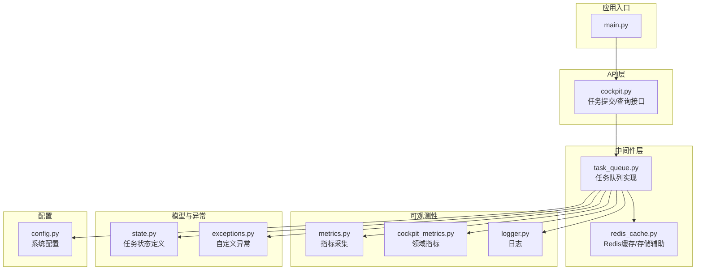
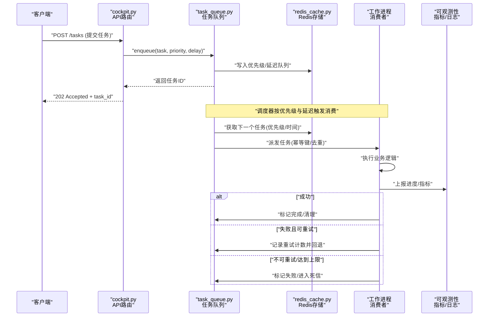
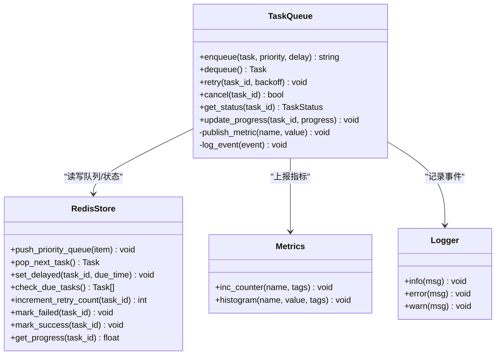
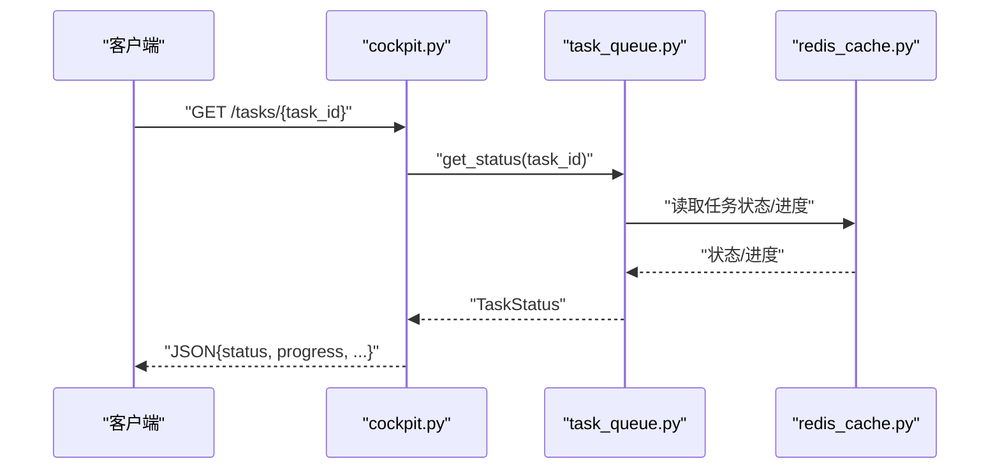
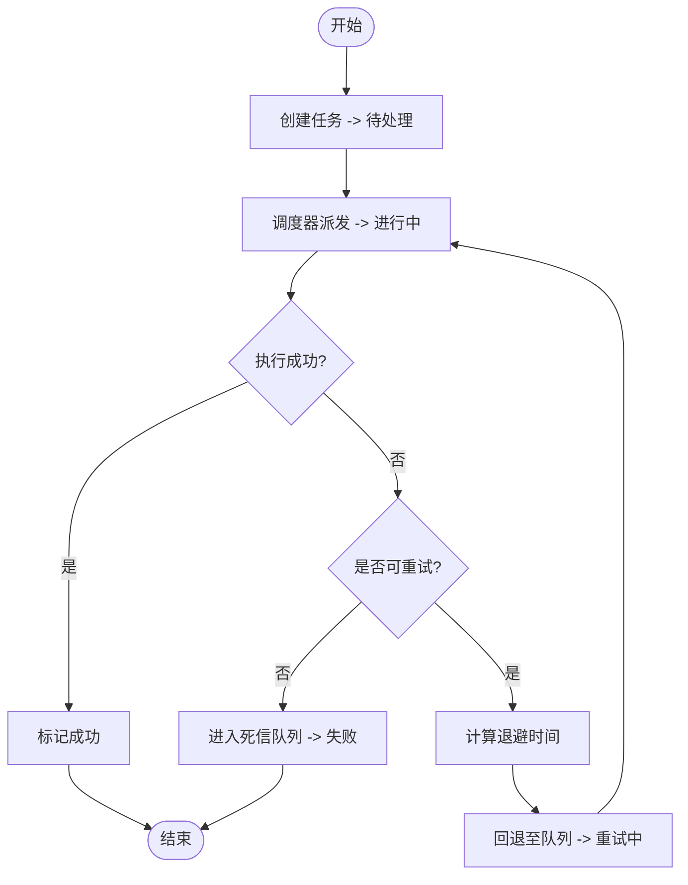
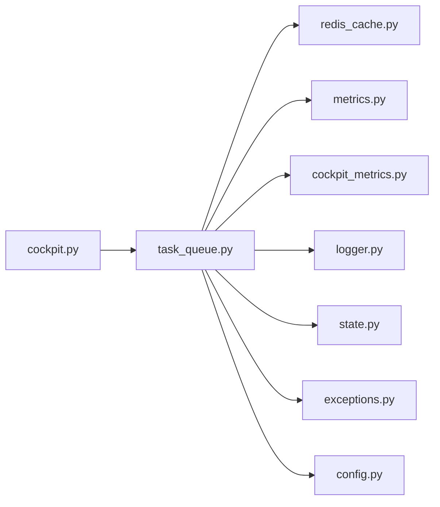

# 任务队列中间件

<cite>
**本文引用的文件**   
- [backend_design/nexus/middleware/task_queue.py](file://backend_design/nexus/middleware/task_queue.py)
- [backend_design/nexus/api/routes/cockpit.py](file://backend_design/nexus/api/routes/cockpit.py)
- [backend_design/nexus/core/logger.py](file://backend_design/nexus/core/logger.py)
- [backend_design/nexus/config.py](file://backend_design/nexus/config.py)
- [backend_design/nexus/observability/metrics.py](file://backend_design/nexus/observability/metrics.py)
- [backend_design/nexus/observability/cockpit_metrics.py](file://backend_design/nexus/observability/cockpit_metrics.py)
- [backend_design/nexus/models/state.py](file://backend_design/nexus/models/state.py)
- [backend_design/nexus/core/exceptions.py](file://backend_design/nexus/core/exceptions.py)
- [backend_design/nexus/middleware/redis_cache.py](file://backend_design/nexus/middleware/redis_cache.py)
- [backend_design/nexus/main.py](file://backend_design/nexus/main.py)
</cite>

## 目录
1. [简介](#简介)
2. [项目结构](#项目结构)
3. [核心组件](#核心组件)
4. [架构总览](#架构总览)
5. [详细组件分析](#详细组件分析)
6. [依赖分析](#依赖分析)
7. [性能考虑](#性能考虑)
8. [故障排查指南](#故障排查指南)
9. [结论](#结论)
10. [附录](#附录)

## 简介
本文件面向NexusCockpit系统的“任务队列中间件”，聚焦异步任务处理架构与工程实践。文档围绕以下目标展开：
- 解释任务生产者、消费者与工作进程的设计模式与职责边界
- 描述任务调度策略（优先级队列、延迟任务、重试机制）
- 说明任务状态管理与进度跟踪（生命周期、错误处理、补偿机制）
- 阐述扩展性设计（水平扩展、负载均衡、故障转移）
- 提供监控与调试工具使用指南，以及性能调优最佳实践

## 项目结构
任务队列中间件位于后端模块的中间件层，并与API路由、可观测性、配置与异常体系紧密协作。下图展示了与本主题相关的文件关系与职责分工。

图表来源
- [backend_design/nexus/main.py](file://backend_design/nexus/main.py)
- [backend_design/nexus/api/routes/cockpit.py](file://backend_design/nexus/api/routes/cockpit.py)
- [backend_design/nexus/middleware/task_queue.py](file://backend_design/nexus/middleware/task_queue.py)
- [backend_design/nexus/middleware/redis_cache.py](file://backend_design/nexus/middleware/redis_cache.py)
- [backend_design/nexus/observability/metrics.py](file://backend_design/nexus/observability/metrics.py)
- [backend_design/nexus/observability/cockpit_metrics.py](file://backend_design/nexus/observability/cockpit_metrics.py)
- [backend_design/nexus/core/logger.py](file://backend_design/nexus/core/logger.py)
- [backend_design/nexus/models/state.py](file://backend_design/nexus/models/state.py)
- [backend_design/nexus/core/exceptions.py](file://backend_design/nexus/core/exceptions.py)
- [backend_design/nexus/config.py](file://backend_design/nexus/config.py)

章节来源
- [backend_design/nexus/main.py](file://backend_design/nexus/main.py)
- [backend_design/nexus/api/routes/cockpit.py](file://backend_design/nexus/api/routes/cockpit.py)
- [backend_design/nexus/middleware/task_queue.py](file://backend_design/nexus/middleware/task_queue.py)
- [backend_design/nexus/middleware/redis_cache.py](file://backend_design/nexus/middleware/redis_cache.py)
- [backend_design/nexus/observability/metrics.py](file://backend_design/nexus/observability/metrics.py)
- [backend_design/nexus/observability/cockpit_metrics.py](file://backend_design/nexus/observability/cockpit_metrics.py)
- [backend_design/nexus/core/logger.py](file://backend_design/nexus/core/logger.py)
- [backend_design/nexus/models/state.py](file://backend_design/nexus/models/state.py)
- [backend_design/nexus/core/exceptions.py](file://backend_design/nexus/core/exceptions.py)
- [backend_design/nexus/config.py](file://backend_design/nexus/config.py)

## 核心组件
- 任务队列服务：负责任务的入队、出队、调度、重试、延迟执行与状态更新，是中间件的核心。
- Redis缓存/存储辅助：为队列提供持久化与原子操作能力（如列表、有序集合、哈希等）。
- API路由：暴露任务提交、查询、取消等HTTP接口，作为生产者与消费者的对外契约。
- 可观测性：统一指标与日志输出，便于监控与排障。
- 状态模型与异常：定义任务状态枚举与业务异常类型，保证一致性与可恢复性。
- 配置：集中管理队列参数（并发度、超时、重试次数、延迟策略等）。

章节来源
- [backend_design/nexus/middleware/task_queue.py](file://backend_design/nexus/middleware/task_queue.py)
- [backend_design/nexus/middleware/redis_cache.py](file://backend_design/nexus/middleware/redis_cache.py)
- [backend_design/nexus/api/routes/cockpit.py](file://backend_design/nexus/api/routes/cockpit.py)
- [backend_design/nexus/observability/metrics.py](file://backend_design/nexus/observability/metrics.py)
- [backend_design/nexus/observability/cockpit_metrics.py](file://backend_design/nexus/observability/cockpit_metrics.py)
- [backend_design/nexus/core/logger.py](file://backend_design/nexus/core/logger.py)
- [backend_design/nexus/models/state.py](file://backend_design/nexus/models/state.py)
- [backend_design/nexus/core/exceptions.py](file://backend_design/nexus/core/exceptions.py)
- [backend_design/nexus/config.py](file://backend_design/nexus/config.py)

## 架构总览
下图展示从API到队列再到工作进程的端到端流程，包括优先级、延迟与重试的关键路径。

图表来源
- [backend_design/nexus/api/routes/cockpit.py](file://backend_design/nexus/api/routes/cockpit.py)
- [backend_design/nexus/middleware/task_queue.py](file://backend_design/nexus/middleware/task_queue.py)
- [backend_design/nexus/middleware/redis_cache.py](file://backend_design/nexus/middleware/redis_cache.py)
- [backend_design/nexus/observability/metrics.py](file://backend_design/nexus/observability/metrics.py)
- [backend_design/nexus/observability/cockpit_metrics.py](file://backend_design/nexus/observability/cockpit_metrics.py)

## 详细组件分析

### 任务队列服务（task_queue.py）
- 职责
  - 任务入队：支持优先级与延迟参数；生成唯一任务ID；幂等键去重。
  - 任务出队：基于优先级与到期时间的选择策略；支持批量拉取。
  - 重试与退避：指数退避或固定间隔；最大重试次数限制。
  - 状态管理：创建、进行中、成功、失败、重试中、已取消、死信等状态流转。
  - 进度上报：允许消费者周期性更新进度，供查询接口读取。
  - 补偿机制：对长时间未确认的任务进行重新派发；对失败任务进入死信队列以便人工干预。
- 关键设计点
  - 优先级队列：通过有序集合或带权重的列表实现，确保高优先级优先消费。
  - 延迟任务：利用时间戳排序或定时扫描，将未到期的任务延后处理。
  - 幂等性：基于任务幂等键避免重复执行；消费者需具备幂等处理能力。
  - 可观测性：在关键路径上报指标与日志，便于追踪与定位问题。
  - 配置驱动：从配置中心加载并发度、超时、重试策略等参数。

图表来源
- [backend_design/nexus/middleware/task_queue.py](file://backend_design/nexus/middleware/task_queue.py)
- [backend_design/nexus/middleware/redis_cache.py](file://backend_design/nexus/middleware/redis_cache.py)
- [backend_design/nexus/observability/metrics.py](file://backend_design/nexus/observability/metrics.py)
- [backend_design/nexus/core/logger.py](file://backend_design/nexus/core/logger.py)

章节来源
- [backend_design/nexus/middleware/task_queue.py](file://backend_design/nexus/middleware/task_queue.py)
- [backend_design/nexus/middleware/redis_cache.py](file://backend_design/nexus/middleware/redis_cache.py)
- [backend_design/nexus/observability/metrics.py](file://backend_design/nexus/observability/metrics.py)
- [backend_design/nexus/core/logger.py](file://backend_design/nexus/core/logger.py)

### API路由（cockpit.py）
- 职责
  - 接收外部请求，校验参数，调用任务队列服务进行入队或查询。
  - 返回标准响应格式（任务ID、状态码、错误信息）。
  - 提供任务状态与进度查询接口，支持分页与过滤。
- 关键设计点
  - 输入校验：对优先级、延迟、幂等键等进行合法性检查。
  - 幂等提交：相同幂等键的请求直接返回已有任务ID，避免重复入队。
  - 限流保护：结合网关或中间件进行速率限制，防止队列过载。

图表来源
- [backend_design/nexus/api/routes/cockpit.py](file://backend_design/nexus/api/routes/cockpit.py)
- [backend_design/nexus/middleware/task_queue.py](file://backend_design/nexus/middleware/task_queue.py)
- [backend_design/nexus/middleware/redis_cache.py](file://backend_design/nexus/middleware/redis_cache.py)

章节来源
- [backend_design/nexus/api/routes/cockpit.py](file://backend_design/nexus/api/routes/cockpit.py)

### 状态模型与异常（state.py, exceptions.py）
- 任务状态
  - 常见状态：待处理、进行中、成功、失败、重试中、已取消、死信。
  - 状态机：明确各状态的转换条件与约束，保证一致性。
- 异常类型
  - 业务异常：如任务不存在、重复提交、超过重试上限等。
  - 系统异常：如存储不可用、超时、内部错误等。
  - 异常传播：API层捕获并转换为标准错误响应；队列层记录上下文以便排障。

图表来源
- [backend_design/nexus/models/state.py](file://backend_design/nexus/models/state.py)
- [backend_design/nexus/core/exceptions.py](file://backend_design/nexus/core/exceptions.py)
- [backend_design/nexus/middleware/task_queue.py](file://backend_design/nexus/middleware/task_queue.py)

章节来源
- [backend_design/nexus/models/state.py](file://backend_design/nexus/models/state.py)
- [backend_design/nexus/core/exceptions.py](file://backend_design/nexus/core/exceptions.py)

### 可观测性（metrics.py, cockpit_metrics.py, logger.py）
- 指标
  - 队列长度、入队/出队速率、平均处理时长、重试次数、失败率、延迟任务积压等。
  - 维度标签：任务类型、优先级、消费者实例等。
- 日志
  - 结构化日志：包含任务ID、阶段、耗时、错误堆栈等。
  - 采样策略：在高负载下降低非关键日志量，保留关键路径。
- 集成
  - 与Prometheus/Grafana对接，提供可视化面板与告警规则。

章节来源
- [backend_design/nexus/observability/metrics.py](file://backend_design/nexus/observability/metrics.py)
- [backend_design/nexus/observability/cockpit_metrics.py](file://backend_design/nexus/observability/cockpit_metrics.py)
- [backend_design/nexus/core/logger.py](file://backend_design/nexus/core/logger.py)

### 配置（config.py）
- 关键参数
  - 并发度：每个工作进程同时处理的并发任务数。
  - 超时：任务执行超时阈值，用于检测卡住的任务。
  - 重试策略：最大重试次数、退避算法（固定/指数）、退避上限。
  - 延迟策略：最小延迟粒度、扫描周期。
  - 资源配额：队列容量上限、内存占用限制。
- 动态调整
  - 支持运行时热更新，无需重启服务即可生效。

章节来源
- [backend_design/nexus/config.py](file://backend_design/nexus/config.py)

## 依赖分析
任务队列中间件与多个子系统存在耦合关系，下图展示主要依赖方向与交互点。

图表来源
- [backend_design/nexus/api/routes/cockpit.py](file://backend_design/nexus/api/routes/cockpit.py)
- [backend_design/nexus/middleware/task_queue.py](file://backend_design/nexus/middleware/task_queue.py)
- [backend_design/nexus/middleware/redis_cache.py](file://backend_design/nexus/middleware/redis_cache.py)
- [backend_design/nexus/observability/metrics.py](file://backend_design/nexus/observability/metrics.py)
- [backend_design/nexus/observability/cockpit_metrics.py](file://backend_design/nexus/observability/cockpit_metrics.py)
- [backend_design/nexus/core/logger.py](file://backend_design/nexus/core/logger.py)
- [backend_design/nexus/models/state.py](file://backend_design/nexus/models/state.py)
- [backend_design/nexus/core/exceptions.py](file://backend_design/nexus/core/exceptions.py)
- [backend_design/nexus/config.py](file://backend_design/nexus/config.py)

章节来源
- [backend_design/nexus/api/routes/cockpit.py](file://backend_design/nexus/api/routes/cockpit.py)
- [backend_design/nexus/middleware/task_queue.py](file://backend_design/nexus/middleware/task_queue.py)
- [backend_design/nexus/middleware/redis_cache.py](file://backend_design/nexus/middleware/redis_cache.py)
- [backend_design/nexus/observability/metrics.py](file://backend_design/nexus/observability/metrics.py)
- [backend_design/nexus/observability/cockpit_metrics.py](file://backend_design/nexus/observability/cockpit_metrics.py)
- [backend_design/nexus/core/logger.py](file://backend_design/nexus/core/logger.py)
- [backend_design/nexus/models/state.py](file://backend_design/nexus/models/state.py)
- [backend_design/nexus/core/exceptions.py](file://backend_design/nexus/core/exceptions.py)
- [backend_design/nexus/config.py](file://backend_design/nexus/config.py)

## 性能考虑
- 并发与吞吐
  - 合理设置工作进程数量与每进程并发度，避免CPU/IO瓶颈。
  - 批量出队与批处理可降低网络与序列化开销。
- 延迟与优先级
  - 延迟任务采用时间轮或有序集合，减少全表扫描成本。
  - 优先级队列使用带权重的数据结构，避免频繁重排。
- 重试与退避
  - 指数退避配合抖动，避免雪崩效应。
  - 设置最大重试次数与死信队列，防止无限重试。
- 资源隔离
  - 不同任务类型使用独立队列或命名空间，避免相互影响。
- 监控与告警
  - 关注队列积压、处理时延、失败率、重试率等关键指标。
  - 建立阈值告警与自动扩容策略。

[本节为通用性能建议，不直接分析具体文件]

## 故障排查指南
- 常见问题
  - 任务堆积：检查消费者健康、下游依赖可用性、队列容量与并发度。
  - 重复执行：确认幂等键是否正确传递，消费者是否具备幂等处理。
  - 延迟任务未触发：核对延迟队列扫描周期与时间同步。
  - 重试风暴：检查退避策略与抖动参数，避免瞬时放大。
- 诊断步骤
  - 查看任务状态与进度：通过API查询任务详情。
  - 检查指标与日志：定位失败原因与耗时热点。
  - 验证依赖：确认Redis连接、下游服务可用性与限流情况。
- 恢复策略
  - 手动重试：对少量失败任务进行人工干预。
  - 死信队列：导出失败任务进行分析与修复。
  - 降级与熔断：在依赖不可用时快速降级，保障核心链路。

章节来源
- [backend_design/nexus/api/routes/cockpit.py](file://backend_design/nexus/api/routes/cockpit.py)
- [backend_design/nexus/middleware/task_queue.py](file://backend_design/nexus/middleware/task_queue.py)
- [backend_design/nexus/observability/metrics.py](file://backend_design/nexus/observability/metrics.py)
- [backend_design/nexus/observability/cockpit_metrics.py](file://backend_design/nexus/observability/cockpit_metrics.py)
- [backend_design/nexus/core/logger.py](file://backend_design/nexus/core/logger.py)

## 结论
任务队列中间件通过清晰的职责划分、可靠的状态机与完善的可观测性，为NexusCockpit提供了高可用的异步处理能力。借助优先级、延迟与重试机制，系统能够在复杂场景下保持稳定性与可扩展性。建议在生产环境中持续优化并发与资源分配，完善监控告警与自动化运维，以进一步提升整体性能与可靠性。

[本节为总结性内容，不直接分析具体文件]

## 附录
- 术语
  - 任务：一次异步执行的单元，包含输入参数、优先级、延迟与幂等键。
  - 消费者：从队列拉取任务并执行的业务逻辑。
  - 工作进程：运行消费者的进程实例，支持多实例水平扩展。
  - 死信队列：存放无法处理或重试耗尽的任务，供后续分析与人工处理。
- 参考
  - 相关代码文件路径见“本文引用的文件”列表。

[本节为补充信息，不直接分析具体文件]