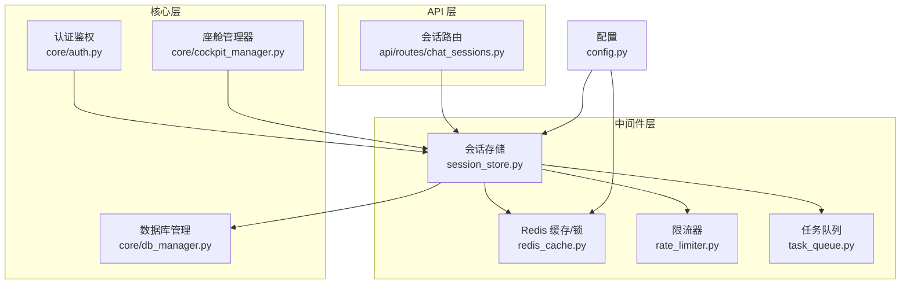
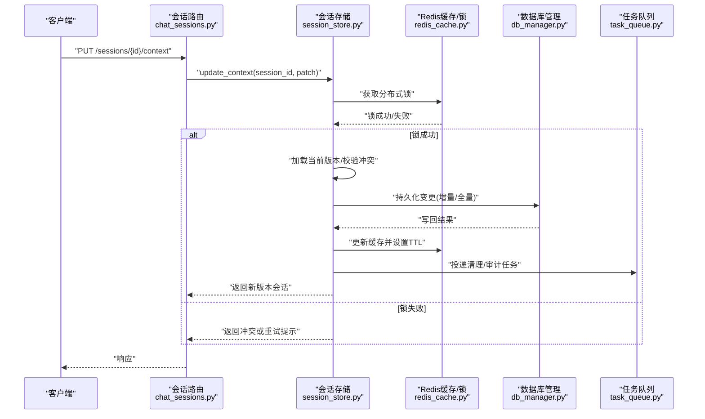
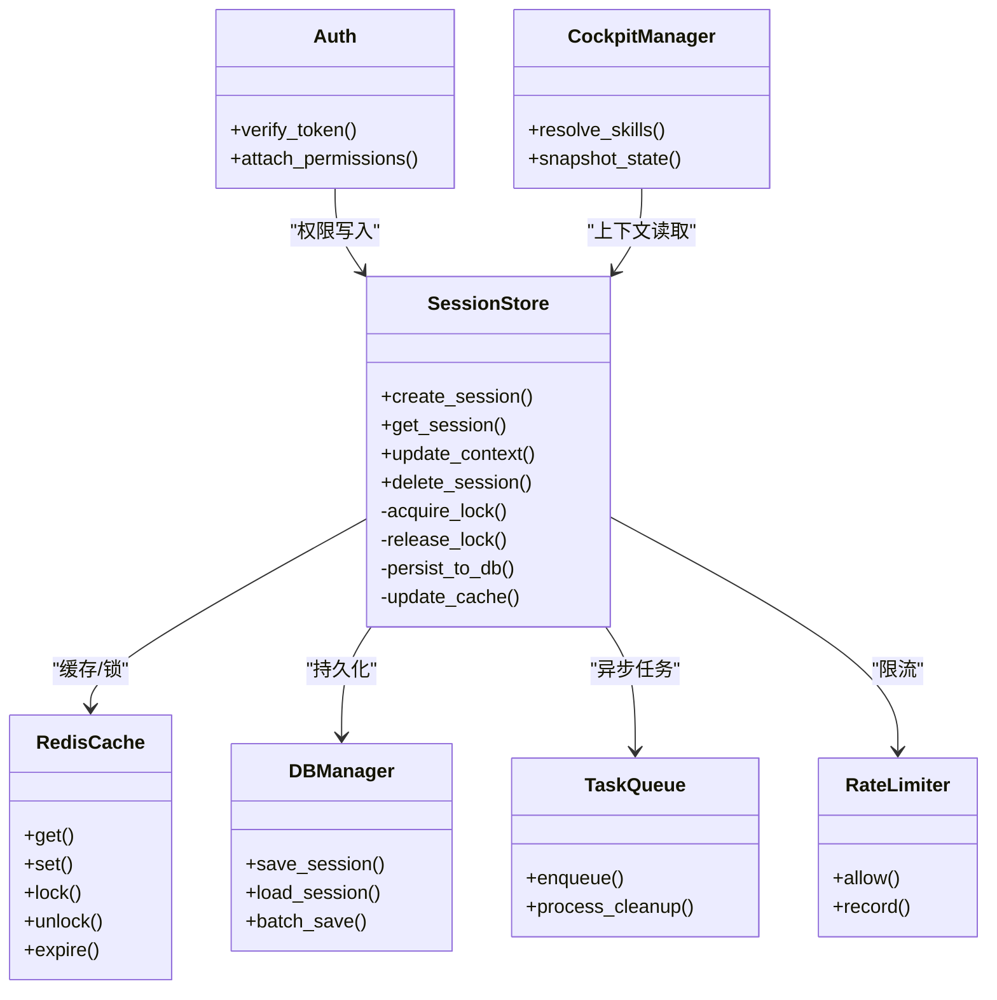

# 会话存储中间件

<cite>
**本文引用的文件**   
- [session_store.py](file://backend_design/nexus/middleware/session_store.py)
- [redis_cache.py](file://backend_design/nexus/middleware/redis_cache.py)
- [rate_limiter.py](file://backend_design/nexus/middleware/rate_limiter.py)
- [task_queue.py](file://backend_design/nexus/middleware/task_queue.py)
- [__init__.py](file://backend_design/nexus/middleware/__init__.py)
- [auth.py](file://backend_design/nexus/core/auth.py)
- [cockpit_manager.py](file://backend_design/nexus/core/cockpit_manager.py)
- [db_manager.py](file://backend_design/nexus/core/db_manager.py)
- [chat_sessions.py](file://backend_design/nexus/api/routes/chat_sessions.py)
- [config.py](file://backend_design/nexus/config.py)
</cite>

## 目录
1. [简介](#简介)
2. [项目结构](#项目结构)
3. [核心组件](#核心组件)
4. [架构总览](#架构总览)
5. [详细组件分析](#详细组件分析)
6. [依赖关系分析](#依赖关系分析)
7. [性能考量](#性能考量)
8. [故障排查指南](#故障排查指南)
9. [结论](#结论)
10. [附录](#附录)

## 简介
本文件为 NexusCockpit 系统的“会话存储中间件”提供系统化、可操作的技术文档。内容覆盖：
- 会话生命周期与状态同步
- 持久化策略（内存、Redis、数据库）
- 并发访问控制（锁、版本、冲突解决）
- 安全策略（加密、防篡改、敏感信息保护）
- 清理策略与内存泄漏防护
- 数据模型与组织方式（用户信息、权限状态、上下文数据）

目标读者包括后端工程师、运维人员与产品/测试同学，力求在保持技术深度的同时兼顾可读性。

## 项目结构
与会话存储相关的代码主要位于 backend_design/nexus/middleware 目录，并与 core、api 层协作：
- middleware/session_store.py：会话存储核心实现
- middleware/redis_cache.py：基于 Redis 的缓存与分布式锁能力
- middleware/rate_limiter.py：限流器（与会话请求频率相关）
- middleware/task_queue.py：异步任务队列（用于会话清理等后台任务）
- middleware/__init__.py：中间件包入口与导出
- core/auth.py：认证与鉴权（与会话权限状态联动）
- core/cockpit_manager.py：座舱管理器（与会话上下文关联）
- core/db_manager.py：数据库连接管理（持久化落库）
- api/routes/chat_sessions.py：会话相关 API 路由（创建、读取、更新、删除）
- config.py：系统配置（含会话与缓存相关参数）

图表来源
- [session_store.py](file://backend_design/nexus/middleware/session_store.py)
- [redis_cache.py](file://backend_design/nexus/middleware/redis_cache.py)
- [rate_limiter.py](file://backend_design/nexus/middleware/rate_limiter.py)
- [task_queue.py](file://backend_design/nexus/middleware/task_queue.py)
- [auth.py](file://backend_design/nexus/core/auth.py)
- [cockpit_manager.py](file://backend_design/nexus/core/cockpit_manager.py)
- [db_manager.py](file://backend_design/nexus/core/db_manager.py)
- [chat_sessions.py](file://backend_design/nexus/api/routes/chat_sessions.py)
- [config.py](file://backend_design/nexus/config.py)

章节来源
- [session_store.py](file://backend_design/nexus/middleware/session_store.py)
- [redis_cache.py](file://backend_design/nexus/middleware/redis_cache.py)
- [rate_limiter.py](file://backend_design/nexus/middleware/rate_limiter.py)
- [task_queue.py](file://backend_design/nexus/middleware/task_queue.py)
- [__init__.py](file://backend_design/nexus/middleware/__init__.py)
- [auth.py](file://backend_design/nexus/core/auth.py)
- [cockpit_manager.py](file://backend_design/nexus/core/cockpit_manager.py)
- [db_manager.py](file://backend_design/nexus/core/db_manager.py)
- [chat_sessions.py](file://backend_design/nexus/api/routes/chat_sessions.py)
- [config.py](file://backend_design/nexus/config.py)

## 核心组件
- 会话存储（SessionStore）
  - 职责：维护会话对象的生命周期（创建、读写、更新、销毁），负责内存缓存与持久化一致性，协调分布式锁与版本控制，触发清理任务。
  - 关键能力：
    - 会话键空间设计（按租户/用户/会话维度）
    - 多级缓存（进程内 + Redis）
    - 幂等写入与乐观锁（版本号）
    - 事件驱动清理（TTL、空闲超时、定时扫描）
- Redis 缓存与分布式锁（RedisCache）
  - 职责：提供高性能读路径、跨进程共享状态、分布式锁、原子计数与过期策略。
- 限流器（RateLimiter）
  - 职责：对会话相关接口进行速率限制，防止滥用与雪崩。
- 任务队列（TaskQueue）
  - 职责：异步执行会话清理、索引重建、统计上报等后台任务。
- 配置（Config）
  - 职责：集中管理会话 TTL、最大大小、锁超时、加密开关、持久化开关等。

章节来源
- [session_store.py](file://backend_design/nexus/middleware/session_store.py)
- [redis_cache.py](file://backend_design/nexus/middleware/redis_cache.py)
- [rate_limiter.py](file://backend_design/nexus/middleware/rate_limiter.py)
- [task_queue.py](file://backend_design/nexus/middleware/task_queue.py)
- [config.py](file://backend_design/nexus/config.py)

## 架构总览
下图展示一次典型“更新会话上下文”的请求流程，体现中间件如何协同工作：

图表来源
- [chat_sessions.py](file://backend_design/nexus/api/routes/chat_sessions.py)
- [session_store.py](file://backend_design/nexus/middleware/session_store.py)
- [redis_cache.py](file://backend_design/nexus/middleware/redis_cache.py)
- [db_manager.py](file://backend_design/nexus/core/db_manager.py)
- [task_queue.py](file://backend_design/nexus/middleware/task_queue.py)

## 详细组件分析

### 会话存储（SessionStore）
- 会话生命周期
  - 创建：初始化默认上下文、权限状态、时间戳、版本号；写入缓存与数据库。
  - 读取：优先从本地缓存命中，未命中则回源 Redis/DB，回填本地缓存。
  - 更新：采用“拉取-合并-校验-落盘”的流程，支持增量补丁与全量覆盖两种模式。
  - 销毁：软删除标记 + 异步清理，避免热点抖动。
- 状态同步
  - 本地缓存与 Redis 双写，失效策略以 TTL 为主，辅以主动失效。
  - 通过版本号实现乐观锁，冲突时返回重试码或协商合并策略。
- 持久化策略
  - 热数据常驻内存，冷数据下沉至 Redis/DB。
  - 批量落库与延迟写入，降低 IO 压力。
- 并发控制
  - 分布式锁粒度：会话级（session_id）。
  - 锁超时与自动续期机制，避免死锁。
  - 版本字段参与写路径，冲突检测与回退。
- 安全策略
  - 可选字段加密（如用户令牌、PII），密钥由配置中心注入。
  - 签名校验（HMAC）保障完整性，异常时拒绝写入。
- 清理与内存防护
  - 基于 TTL 的惰性失效 + 定时扫描回收。
  - 最大条目数与内存水位告警，超限触发淘汰策略（LRU/LFU）。
  - 大对象分片存储，避免单条过大导致 GC 抖动。

```mermaid
flowchart TD
Start(["进入 update"]) --> Lock["获取分布式锁"]
Lock --> |失败| Conflict["返回冲突/重试"]
Lock --> |成功| Load["加载当前会话(内存/缓存/DB)"]
Load --> Merge["应用补丁/合并策略"]
Merge --> Validate{"校验版本/签名"}
Validate --> |失败| Conflict
Validate --> |通过| Persist["持久化到DB"]
Persist --> UpdateCache["更新缓存+TTL"]
UpdateCache --> Enqueue["投递清理/审计任务"]
Enqueue --> Return(["返回新版本会话"])
```

图表来源
- [session_store.py](file://backend_design/nexus/middleware/session_store.py)
- [redis_cache.py](file://backend_design/nexus/middleware/redis_cache.py)
- [db_manager.py](file://backend_design/nexus/core/db_manager.py)
- [task_queue.py](file://backend_design/nexus/middleware/task_queue.py)

章节来源
- [session_store.py](file://backend_design/nexus/middleware/session_store.py)

### Redis 缓存与分布式锁（RedisCache）
- 功能要点
  - 通用 KV 存取、哈希结构存储会话片段、列表/集合辅助统计。
  - 分布式锁（SET NX EX）、锁续期、公平性保证。
  - 原子计数器（访问次数、错误率）与滑动窗口限流支撑。
- 可靠性
  - 连接池与重试退避，网络抖动降级为只读。
  - 多副本/哨兵部署下的主从切换兼容。
- 容量与过期
  - 合理设置 key 前缀与命名空间，避免冲突。
  - 分层 TTL（短 TTL 热键、长 TTL 冷键）。

章节来源
- [redis_cache.py](file://backend_design/nexus/middleware/redis_cache.py)

### 限流器（RateLimiter）
- 作用范围
  - 针对会话创建、频繁更新、批量查询等接口进行限速。
- 算法与存储
  - 滑动窗口/令牌桶，使用 Redis 原子操作实现。
- 行为
  - 超限时返回标准错误码，配合前端重试退避。

章节来源
- [rate_limiter.py](file://backend_design/nexus/middleware/rate_limiter.py)

### 任务队列（TaskQueue）
- 用途
  - 会话清理、索引重建、指标上报、审计日志归档。
- 特性
  - 去重、重试、死信队列、优先级。
  - 与监控集成，暴露任务积压与耗时指标。

章节来源
- [task_queue.py](file://backend_design/nexus/middleware/task_queue.py)

### 认证与鉴权（Auth）
- 与会话的关系
  - 登录成功后生成会话，绑定用户身份与权限集。
  - 每次请求校验 JWT/Token，并刷新会话活跃时间。
- 权限状态
  - 将角色、资源权限、租户上下文写入会话上下文，供业务快速判断。

章节来源
- [auth.py](file://backend_design/nexus/core/auth.py)

### 座舱管理器（CockpitManager）
- 与会话的关系
  - 根据会话上下文选择技能/工具，维护运行时状态。
  - 将运行态快照周期性落盘，便于恢复。

章节来源
- [cockpit_manager.py](file://backend_design/nexus/core/cockpit_manager.py)

### 数据库管理（DBManager）
- 与会话的关系
  - 会话元数据、上下文快照、审计记录持久化。
  - 提供事务与批量写入能力，减少往返开销。

章节来源
- [db_manager.py](file://backend_design/nexus/core/db_manager.py)

### 会话路由（ChatSessions API）
- 端点职责
  - 创建/读取/更新/删除会话，以及上下文追加、权限刷新、清理触发。
- 与中间件交互
  - 调用 SessionStore 完成一致性读写，结合 RateLimiter 做入口限流。

章节来源
- [chat_sessions.py](file://backend_design/nexus/api/routes/chat_sessions.py)

### 配置（Config）
- 关键项
  - 会话 TTL、最大条目数、锁超时、加密开关、持久化开关、Redis 连接参数。
- 动态调整
  - 支持运行时重载，无需重启服务。

章节来源
- [config.py](file://backend_design/nexus/config.py)

## 依赖关系分析

图表来源
- [session_store.py](file://backend_design/nexus/middleware/session_store.py)
- [redis_cache.py](file://backend_design/nexus/middleware/redis_cache.py)
- [db_manager.py](file://backend_design/nexus/core/db_manager.py)
- [task_queue.py](file://backend_design/nexus/middleware/task_queue.py)
- [rate_limiter.py](file://backend_design/nexus/middleware/rate_limiter.py)
- [auth.py](file://backend_design/nexus/core/auth.py)
- [cockpit_manager.py](file://backend_design/nexus/core/cockpit_manager.py)

章节来源
- [session_store.py](file://backend_design/nexus/middleware/session_store.py)
- [redis_cache.py](file://backend_design/nexus/middleware/redis_cache.py)
- [db_manager.py](file://backend_design/nexus/core/db_manager.py)
- [task_queue.py](file://backend_design/nexus/middleware/task_queue.py)
- [rate_limiter.py](file://backend_design/nexus/middleware/rate_limiter.py)
- [auth.py](file://backend_design/nexus/core/auth.py)
- [cockpit_manager.py](file://backend_design/nexus/core/cockpit_manager.py)

## 性能考量
- 读路径优化
  - 本地缓存命中率优先，二级回源 Redis，三级回源 DB。
  - 热点会话预加载与预热策略。
- 写路径优化
  - 增量合并与批量落库，减少锁持有时间。
  - 写放大控制：仅持久化差异字段。
- 锁与并发
  - 细粒度锁（会话级），避免全局锁。
  - 锁超时与重试退避，防止雪崩。
- 内存与存储
  - 大对象分片与压缩，控制单条大小。
  - 淘汰策略（LRU/LFU）与内存水位告警。
- 观测性
  - 暴露 QPS、P99、锁竞争、缓存命中率、持久化延迟等指标。

[本节为通用性能建议，不直接分析具体文件]

## 故障排查指南
- 常见问题
  - 锁超时/死锁：检查锁超时配置、客户端是否及时释放锁、是否存在长事务。
  - 缓存不一致：确认双写顺序与失效时机，核对版本号与签名。
  - 持久化失败：查看 DB 连接池、慢查询与磁盘 IO，必要时降级为只读。
  - 内存泄漏：定位未释放的大对象、未关闭的连接、未清理的定时器。
- 诊断手段
  - 启用调试日志与链路追踪，定位热点会话与瓶颈环节。
  - 使用 Redis 监控与慢查询日志，评估锁竞争与命令耗时。
  - 压测回归，验证不同负载下的稳定性与吞吐。

章节来源
- [session_store.py](file://backend_design/nexus/middleware/session_store.py)
- [redis_cache.py](file://backend_design/nexus/middleware/redis_cache.py)
- [db_manager.py](file://backend_design/nexus/core/db_manager.py)
- [task_queue.py](file://backend_design/nexus/middleware/task_queue.py)

## 结论
会话存储中间件通过“内存+Redis+DB”的多级存储与“分布式锁+版本控制”的一致性保障，实现了高可用、可扩展且安全的会话管理能力。配合限流、任务队列与完善的清理策略，可在复杂生产环境中稳定运行。建议在上线前完成容量规划、压测与监控告警配置，确保关键指标达标。

[本节为总结性内容，不直接分析具体文件]

## 附录
- 术语
  - 会话：一次用户交互的有界上下文，包含用户信息、权限状态与运行时上下文。
  - 分布式锁：跨进程/节点的互斥原语，用于串行化同一资源的写操作。
  - 乐观锁：通过版本号在提交阶段检测冲突，避免长时间持锁。
- 最佳实践
  - 小步快写：尽量增量更新，减少锁持有时间。
  - 幂等设计：所有写接口具备幂等性，支持重试。
  - 安全基线：开启敏感字段加密与完整性校验，最小权限原则。
  - 可观测性：完善日志、指标与追踪，建立健康检查与自愈策略。

[本节为概念性补充，不直接分析具体文件]