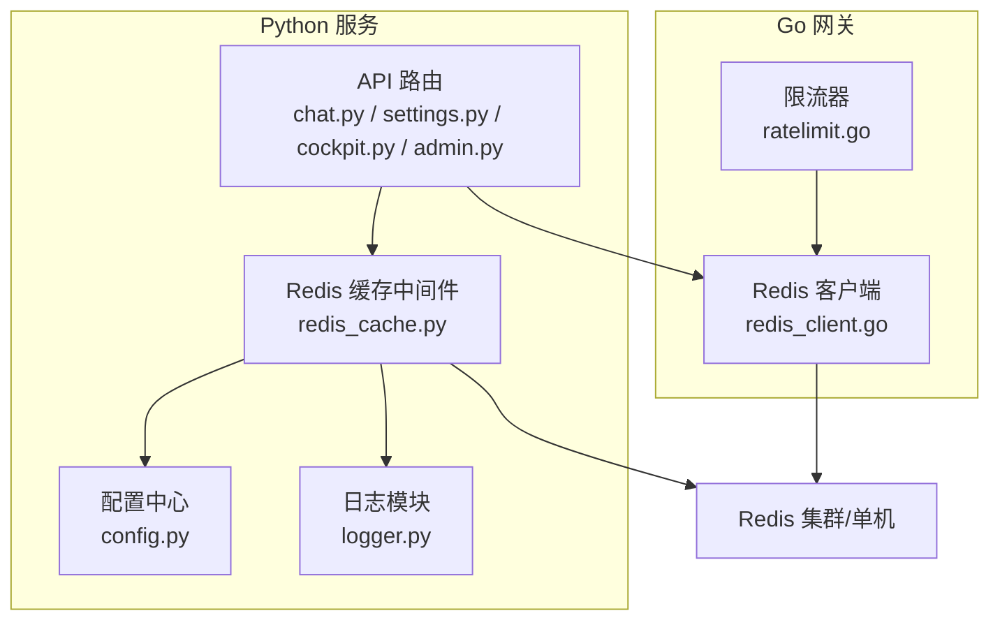
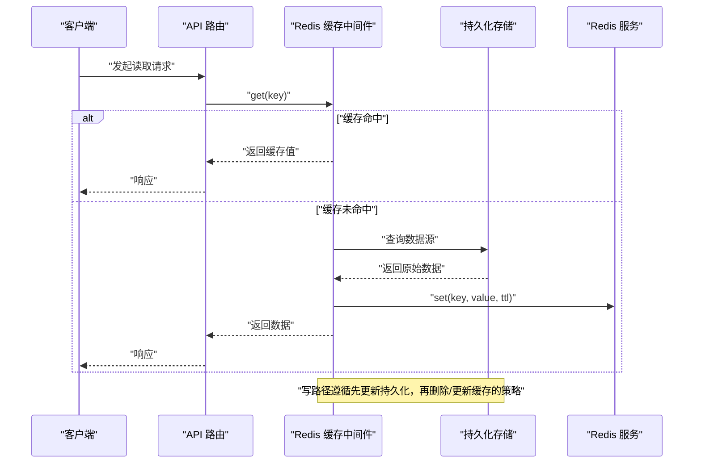
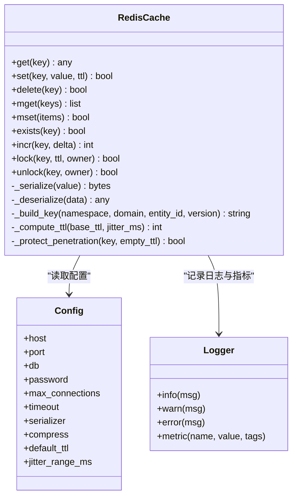
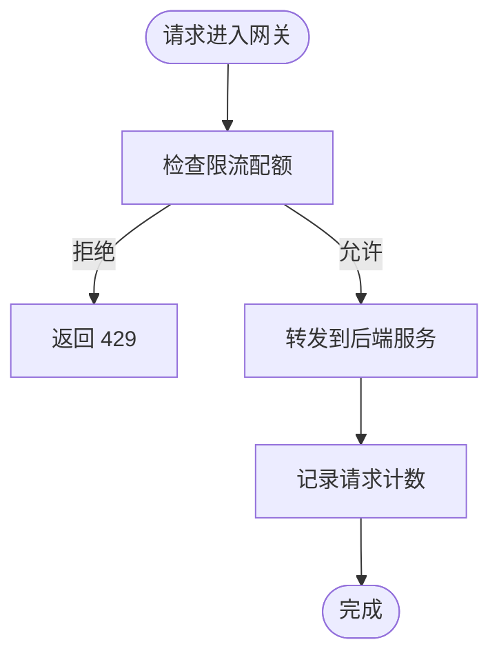
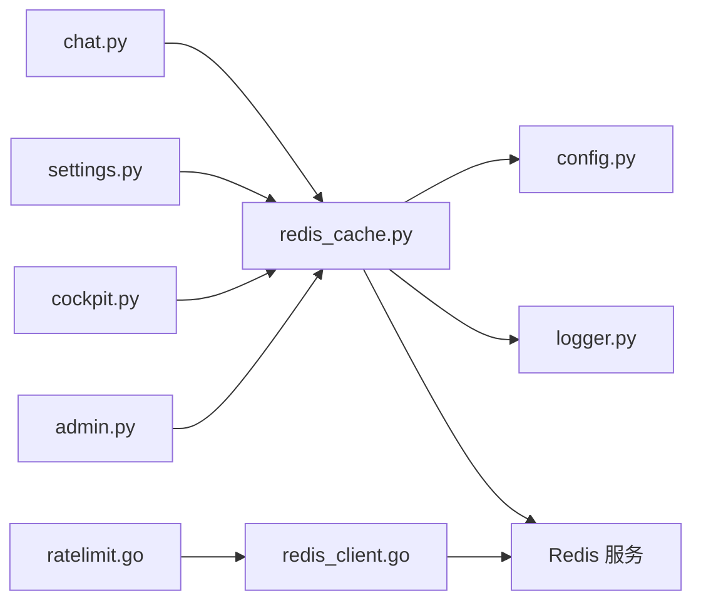

# 缓存中间件

<cite>
**本文引用的文件**   
- [backend_design/nexus/middleware/redis_cache.py](file://backend_design/nexus/middleware/redis_cache.py)
- [backend_design/nexus/config.py](file://backend_design/nexus/config.py)
- [backend_design/nexus/core/logger.py](file://backend_design/nexus/core/logger.py)
- [backend_design/nexus/api/routes/chat.py](file://backend_design/nexus/api/routes/chat.py)
- [backend_design/nexus/api/routes/settings.py](file://backend_design/nexus/api/routes/settings.py)
- [backend_design/nexus/api/routes/cockpit.py](file://backend_design/nexus/api/routes/cockpit.py)
- [backend_design/nexus/api/routes/admin.py](file://backend_design/nexus/api/routes/admin.py)
- [backend_design/nexus_gate/internal/handlers/redis_client.go](file://backend_design/nexus_gate/internal/handlers/redis_client.go)
- [backend_design/nexus_gate/internal/ratelimit/ratelimit.go](file://backend_design/nexus_gate/internal/ratelimit/ratelimit.go)
</cite>

## 目录
1. [简介](#简介)
2. [项目结构](#项目结构)
3. [核心组件](#核心组件)
4. [架构总览](#架构总览)
5. [详细组件分析](#详细组件分析)
6. [依赖关系分析](#依赖关系分析)
7. [性能考虑](#性能考虑)
8. [故障排查指南](#故障排查指南)
9. [结论](#结论)
10. [附录](#附录)

## 简介
本文件为 NexusCockpit 系统的 Redis 缓存中间件提供系统化文档，覆盖缓存策略设计模式、键生成与过期管理、穿透防护、读写分离、预热与一致性保证、序列化与压缩选型、连接池与内存管理、分布式锁实现、失效策略与热点数据处理等主题。目标读者包括后端工程师、运维与平台工程人员，以及需要理解系统缓存行为的产品与测试人员。

## 项目结构
NexusCockpit 的缓存能力由 Python 服务中的 Redis 缓存中间件与 Go 网关侧的 Redis 客户端共同构成：
- Python 侧：提供统一的缓存抽象、键空间管理、TTL 控制、序列化与错误处理，并在多个 API 路由中消费。
- Go 网关侧：提供轻量 Redis 客户端用于限流等场景，作为跨语言共享的缓存基础设施补充。

图示来源
- [backend_design/nexus/middleware/redis_cache.py](file://backend_design/nexus/middleware/redis_cache.py)
- [backend_design/nexus/config.py](file://backend_design/nexus/config.py)
- [backend_design/nexus/core/logger.py](file://backend_design/nexus/core/logger.py)
- [backend_design/nexus/api/routes/chat.py](file://backend_design/nexus/api/routes/chat.py)
- [backend_design/nexus/api/routes/settings.py](file://backend_design/nexus/api/routes/settings.py)
- [backend_design/nexus/api/routes/cockpit.py](file://backend_design/nexus/api/routes/cockpit.py)
- [backend_design/nexus/api/routes/admin.py](file://backend_design/nexus/api/routes/admin.py)
- [backend_design/nexus_gate/internal/handlers/redis_client.go](file://backend_design/nexus_gate/internal/handlers/redis_client.go)
- [backend_design/nexus_gate/internal/ratelimit/ratelimit.go](file://backend_design/nexus_gate/internal/ratelimit/ratelimit.go)

章节来源
- [backend_design/nexus/middleware/redis_cache.py](file://backend_design/nexus/middleware/redis_cache.py)
- [backend_design/nexus/config.py](file://backend_design/nexus/config.py)
- [backend_design/nexus/core/logger.py](file://backend_design/nexus/core/logger.py)
- [backend_design/nexus/api/routes/chat.py](file://backend_design/nexus/api/routes/chat.py)
- [backend_design/nexus/api/routes/settings.py](file://backend_design/nexus/api/routes/settings.py)
- [backend_design/nexus/api/routes/cockpit.py](file://backend_design/nexus/api/routes/cockpit.py)
- [backend_design/nexus/api/routes/admin.py](file://backend_design/nexus/api/routes/admin.py)
- [backend_design/nexus_gate/internal/handlers/redis_client.go](file://backend_design/nexus_gate/internal/handlers/redis_client.go)
- [backend_design/nexus_gate/internal/ratelimit/ratelimit.go](file://backend_design/nexus_gate/internal/ratelimit/ratelimit.go)

## 核心组件
- 缓存中间件（Python）
  - 职责：统一封装 Redis 操作，提供键空间命名、TTL 管理、序列化/反序列化、异常与降级、可观测性埋点。
  - 关键特性：键前缀与命名空间、过期时间策略、缓存穿透防护、读写路径选择、批量操作支持。
- 配置模块（Python）
  - 职责：集中管理 Redis 连接参数、超时、重试、序列化格式、TTL 默认值、连接池大小等。
- 日志模块（Python）
  - 职责：记录缓存命中/未命中、异常、慢查询、键变更事件，便于定位问题与性能分析。
- 网关 Redis 客户端（Go）
  - 职责：为网关层提供轻量 Redis 访问能力，支撑限流、会话计数等场景。
- 限流器（Go）
  - 职责：基于 Redis 的滑动窗口或令牌桶算法进行请求限流，避免缓存雪崩与下游过载。

章节来源
- [backend_design/nexus/middleware/redis_cache.py](file://backend_design/nexus/middleware/redis_cache.py)
- [backend_design/nexus/config.py](file://backend_design/nexus/config.py)
- [backend_design/nexus/core/logger.py](file://backend_design/nexus/core/logger.py)
- [backend_design/nexus_gate/internal/handlers/redis_client.go](file://backend_design/nexus_gate/internal/handlers/redis_client.go)
- [backend_design/nexus_gate/internal/ratelimit/ratelimit.go](file://backend_design/nexus_gate/internal/ratelimit/ratelimit.go)

## 架构总览
下图展示从 API 到缓存再到数据源的典型调用链，以及缓存与数据库的一致性保障流程。

图示来源
- [backend_design/nexus/api/routes/chat.py](file://backend_design/nexus/api/routes/chat.py)
- [backend_design/nexus/api/routes/settings.py](file://backend_design/nexus/api/routes/settings.py)
- [backend_design/nexus/api/routes/cockpit.py](file://backend_design/nexus/api/routes/cockpit.py)
- [backend_design/nexus/api/routes/admin.py](file://backend_design/nexus/api/routes/admin.py)
- [backend_design/nexus/middleware/redis_cache.py](file://backend_design/nexus/middleware/redis_cache.py)

## 详细组件分析

### 缓存中间件（Python）
- 设计要点
  - 键生成规则：采用“命名空间 + 业务域 + 实体标识 + 版本/哈希”的分层结构，确保键唯一且可读。
  - TTL 管理：按业务语义设置不同过期时间；对热点数据使用随机抖动避免集中过期。
  - 穿透防护：对空结果也写入短 TTL 占位键，防止恶意或异常键击穿至后端。
  - 读写分离：读路径优先走缓存，写路径采用“先写库后删缓存”或“延迟双删”，降低不一致窗口。
  - 序列化与压缩：默认 JSON，可选 MessagePack；大对象启用压缩以减少带宽占用。
  - 错误与降级：网络异常时快速失败并回退到直连数据源，同时记录告警指标。
  - 可观测性：命中/未命中、延迟、错误率、键分布统计上报。

图示来源
- [backend_design/nexus/middleware/redis_cache.py](file://backend_design/nexus/middleware/redis_cache.py)
- [backend_design/nexus/config.py](file://backend_design/nexus/config.py)
- [backend_design/nexus/core/logger.py](file://backend_design/nexus/core/logger.py)

章节来源
- [backend_design/nexus/middleware/redis_cache.py](file://backend_design/nexus/middleware/redis_cache.py)
- [backend_design/nexus/config.py](file://backend_design/nexus/config.py)
- [backend_design/nexus/core/logger.py](file://backend_design/nexus/core/logger.py)

#### 键生成与命名空间
- 命名空间：以租户/环境维度隔离键空间，避免多租户冲突。
- 业务域：如 chat、settings、cockpit、admin 等，便于监控与清理。
- 实体标识：用户 ID、会话 ID、设备 ID 等。
- 版本/哈希：字段级变更时通过版本号或内容哈希避免脏读。

章节来源
- [backend_design/nexus/middleware/redis_cache.py](file://backend_design/nexus/middleware/redis_cache.py)

#### 过期时间与抖动
- 基础 TTL：根据数据新鲜度要求设定。
- 随机抖动：在 TTL 上叠加小范围随机值，分散过期峰值，缓解雪崩。
- 热点数据：可延长 TTL 并配合主动刷新机制。

章节来源
- [backend_design/nexus/middleware/redis_cache.py](file://backend_design/nexus/middleware/redis_cache.py)

#### 缓存穿透防护
- 空值缓存：对不存在的数据写入短 TTL 占位键，限制重复穿透。
- 布隆过滤器（可选）：在缓存前置过滤非法键，进一步降低穿透概率。
- 限流保护：结合网关限流，抑制突发恶意请求。

章节来源
- [backend_design/nexus/middleware/redis_cache.py](file://backend_design/nexus/middleware/redis_cache.py)
- [backend_design/nexus_gate/internal/ratelimit/ratelimit.go](file://backend_design/nexus_gate/internal/ratelimit/ratelimit.go)

#### 读写一致性与一致性策略
- 写路径：先更新数据库，再删除缓存；必要时采用延迟双删或订阅 binlog 异步删除。
- 读路径：若发现缓存缺失，回源加载并回填；对强一致场景可采用本地锁或分布式锁串行化重建。
- 版本控制：通过版本号或内容哈希判断缓存是否失效，减少无效重建。

章节来源
- [backend_design/nexus/middleware/redis_cache.py](file://backend_design/nexus/middleware/redis_cache.py)

#### 序列化与压缩策略
- JSON：通用性好，调试友好，适合中小对象。
- MessagePack：体积更小、解析更快，适合大对象或高吞吐场景。
- 压缩：对大对象启用 gzip/zstd 压缩，权衡 CPU 与带宽。

章节来源
- [backend_design/nexus/middleware/redis_cache.py](file://backend_design/nexus/middleware/redis_cache.py)

#### 分布式锁实现
- 原子性：基于 SETNX/SET with EX 实现互斥。
- 防误删：owner 标识校验，仅持有者可释放。
- 续期：看门狗或定时任务延长锁 TTL，避免业务未完成导致锁过期。
- 公平性：结合队列或有序集合提升公平性（可选）。

章节来源
- [backend_design/nexus/middleware/redis_cache.py](file://backend_design/nexus/middleware/redis_cache.py)

#### 缓存预热
- 启动预热：服务启动时预加载热点键，缩短冷启动延迟。
- 增量预热：后台任务周期性扫描热点数据并回填缓存。
- 灰度预热：新实例逐步加入流量，分批预热避免冲击。

章节来源
- [backend_design/nexus/middleware/redis_cache.py](file://backend_design/nexus/middleware/redis_cache.py)

### 网关侧 Redis 客户端与限流（Go）
- Redis 客户端
  - 提供连接复用、超时与重试、错误分类与指标上报。
  - 面向网关场景优化，强调低延迟与高并发。
- 限流器
  - 基于 Redis 的滑动窗口或令牌桶算法实现。
  - 与缓存中间件协同，防止热点键导致的雪崩与穿透。

图示来源
- [backend_design/nexus_gate/internal/handlers/redis_client.go](file://backend_design/nexus_gate/internal/handlers/redis_client.go)
- [backend_design/nexus_gate/internal/ratelimit/ratelimit.go](file://backend_design/nexus_gate/internal/ratelimit/ratelimit.go)

章节来源
- [backend_design/nexus_gate/internal/handlers/redis_client.go](file://backend_design/nexus_gate/internal/handlers/redis_client.go)
- [backend_design/nexus_gate/internal/ratelimit/ratelimit.go](file://backend_design/nexus_gate/internal/ratelimit/ratelimit.go)

### API 路由中的缓存使用示例
- 聊天会话（chat.py）
  - 读取：优先从缓存获取会话上下文，未命中则加载并回填。
  - 写入：消息落库后删除对应会话缓存，触发下次重建。
- 设置项（settings.py）
  - 读取：用户偏好设置缓存，TTL 较长，变更时主动失效。
  - 写入：更新设置后删除缓存，必要时广播通知其他实例失效。
- 座舱状态（cockpit.py）
  - 读取：车辆状态高频读取，采用短 TTL 与抖动策略。
  - 写入：状态变更后删除缓存，避免脏读。
- 管理接口（admin.py）
  - 批量操作：提供缓存清理、预热、统计等管理能力。

章节来源
- [backend_design/nexus/api/routes/chat.py](file://backend_design/nexus/api/routes/chat.py)
- [backend_design/nexus/api/routes/settings.py](file://backend_design/nexus/api/routes/settings.py)
- [backend_design/nexus/api/routes/cockpit.py](file://backend_design/nexus/api/routes/cockpit.py)
- [backend_design/nexus/api/routes/admin.py](file://backend_design/nexus/api/routes/admin.py)

## 依赖关系分析
- 内部依赖
  - API 路由依赖缓存中间件进行读写。
  - 缓存中间件依赖配置与日志模块。
  - 网关限流器依赖网关 Redis 客户端。
- 外部依赖
  - Redis 服务（单机或集群），需关注网络分区、主从切换、持久化策略。
  - 序列化库（JSON/MessagePack）、压缩库（gzip/zstd）。

图示来源
- [backend_design/nexus/api/routes/chat.py](file://backend_design/nexus/api/routes/chat.py)
- [backend_design/nexus/api/routes/settings.py](file://backend_design/nexus/api/routes/settings.py)
- [backend_design/nexus/api/routes/cockpit.py](file://backend_design/nexus/api/routes/cockpit.py)
- [backend_design/nexus/api/routes/admin.py](file://backend_design/nexus/api/routes/admin.py)
- [backend_design/nexus/middleware/redis_cache.py](file://backend_design/nexus/middleware/redis_cache.py)
- [backend_design/nexus/config.py](file://backend_design/nexus/config.py)
- [backend_design/nexus/core/logger.py](file://backend_design/nexus/core/logger.py)
- [backend_design/nexus_gate/internal/ratelimit/ratelimit.go](file://backend_design/nexus_gate/internal/ratelimit/ratelimit.go)
- [backend_design/nexus_gate/internal/handlers/redis_client.go](file://backend_design/nexus_gate/internal/handlers/redis_client.go)

章节来源
- [backend_design/nexus/api/routes/chat.py](file://backend_design/nexus/api/routes/chat.py)
- [backend_design/nexus/api/routes/settings.py](file://backend_design/nexus/api/routes/settings.py)
- [backend_design/nexus/api/routes/cockpit.py](file://backend_design/nexus/api/routes/cockpit.py)
- [backend_design/nexus/api/routes/admin.py](file://backend_design/nexus/api/routes/admin.py)
- [backend_design/nexus/middleware/redis_cache.py](file://backend_design/nexus/middleware/redis_cache.py)
- [backend_design/nexus/config.py](file://backend_design/nexus/config.py)
- [backend_design/nexus/core/logger.py](file://backend_design/nexus/core/logger.py)
- [backend_design/nexus_gate/internal/ratelimit/ratelimit.go](file://backend_design/nexus_gate/internal/ratelimit/ratelimit.go)
- [backend_design/nexus_gate/internal/handlers/redis_client.go](file://backend_design/nexus_gate/internal/handlers/redis_client.go)

## 性能考虑
- 连接池配置
  - max_connections：根据 QPS 与 RT 估算，预留一定余量。
  - timeout：合理设置读写超时，避免长尾阻塞。
  - retry/backoff：对瞬时失败进行指数退避重试，限制最大次数。
- 内存管理
  - 对象大小：超过阈值启用压缩或拆分键。
  - 淘汰策略：LRU/LFU 结合业务冷热特征选择。
  - 键空间清理：定期扫描过期与孤儿键，避免膨胀。
- 序列化与压缩
  - JSON vs MessagePack：按对象大小与解析开销权衡。
  - 压缩级别：平衡 CPU 与带宽，热点路径建议适度压缩。
- 分布式锁
  - 锁粒度：尽量缩小锁范围，避免热点竞争。
  - 锁超时：设置合理 TTL，配合看门狗续期。
  - 死锁检测：记录持有者与等待者，异常时强制释放。
- 热点数据
  - 本地缓存：在进程内增加 L1 缓存，降低 Redis 压力。
  - 分片与副本：将热点键分散到多个节点，避免单点瓶颈。
  - 预取与预写：预测性加载，减少首查延迟。

[本节为通用指导，不直接分析具体文件]

## 故障排查指南
- 常见问题
  - 缓存未命中率高：检查键生成规则、TTL 设置、序列化兼容性。
  - 缓存穿透：确认空值占位键是否生效，是否开启限流与布隆过滤器。
  - 缓存雪崩：检查 TTL 抖动是否启用，是否存在集中过期。
  - 一致性异常：核对写路径顺序，是否采用延迟双删或 binlog 同步。
  - 锁争用：评估锁粒度与持有时间，查看等待队列与超时情况。
- 诊断手段
  - 指标：命中率、P95/P99 延迟、错误率、键分布、锁等待时长。
  - 日志：命中/未命中、异常堆栈、慢查询、键变更事件。
  - 链路追踪：从 API 到 Redis 的全链路耗时与失败点定位。
- 恢复策略
  - 快速降级：缓存不可用时回退到直连数据源。
  - 局部重启：对热点实例进行滚动重启，触发预热。
  - 容量扩容：横向扩展 Redis 节点，调整分片与副本。

章节来源
- [backend_design/nexus/core/logger.py](file://backend_design/nexus/core/logger.py)
- [backend_design/nexus/middleware/redis_cache.py](file://backend_design/nexus/middleware/redis_cache.py)

## 结论
NexusCockpit 的 Redis 缓存中间件通过规范的键空间管理、严格的 TTL 与抖动策略、完善的穿透防护与一致性保障，结合序列化与压缩的灵活选型，为系统提供了高性能、可扩展的缓存能力。配合网关限流与可观测性体系，能够有效应对高并发与热点场景，保障整体稳定性与用户体验。

[本节为总结性内容，不直接分析具体文件]

## 附录
- 最佳实践清单
  - 明确键命名规范与版本策略。
  - 为所有写路径定义一致的失效策略。
  - 为热点键设置独立 TTL 与抖动范围。
  - 对大对象启用压缩与分片。
  - 建立完善的指标与告警。
- 参考实现位置
  - 缓存中间件：[backend_design/nexus/middleware/redis_cache.py](file://backend_design/nexus/middleware/redis_cache.py)
  - 配置中心：[backend_design/nexus/config.py](file://backend_design/nexus/config.py)
  - 日志与指标：[backend_design/nexus/core/logger.py](file://backend_design/nexus/core/logger.py)
  - API 使用示例：
    - [backend_design/nexus/api/routes/chat.py](file://backend_design/nexus/api/routes/chat.py)
    - [backend_design/nexus/api/routes/settings.py](file://backend_design/nexus/api/routes/settings.py)
    - [backend_design/nexus/api/routes/cockpit.py](file://backend_design/nexus/api/routes/cockpit.py)
    - [backend_design/nexus/api/routes/admin.py](file://backend_design/nexus/api/routes/admin.py)
  - 网关 Redis 客户端与限流：
    - [backend_design/nexus_gate/internal/handlers/redis_client.go](file://backend_design/nexus_gate/internal/handlers/redis_client.go)
    - [backend_design/nexus_gate/internal/ratelimit/ratelimit.go](file://backend_design/nexus_gate/internal/ratelimit/ratelimit.go)