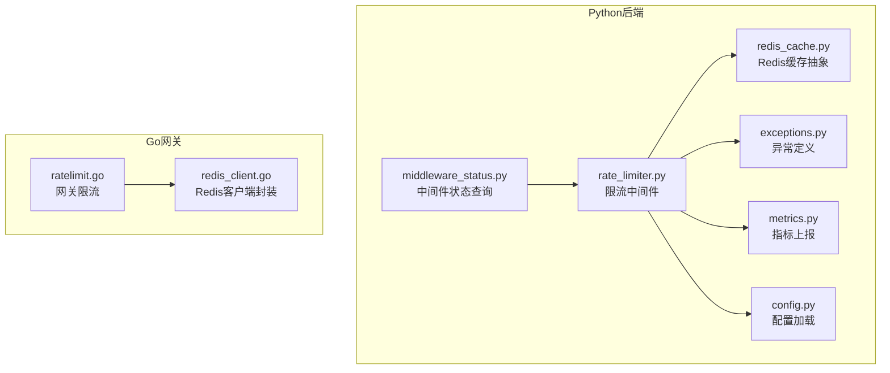
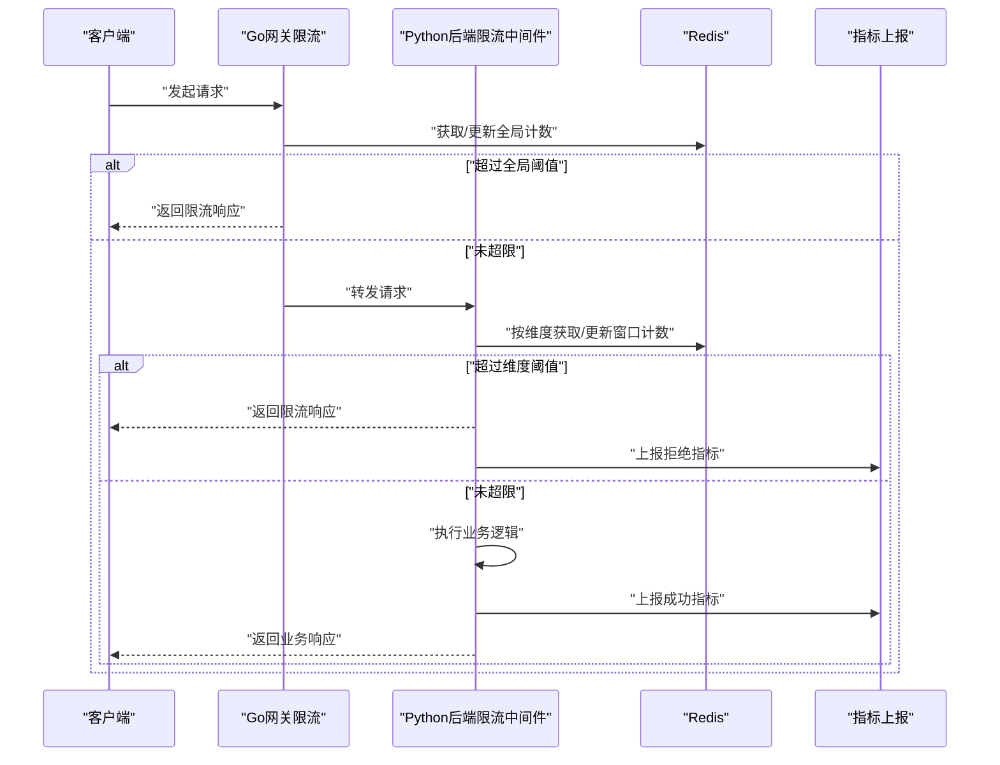
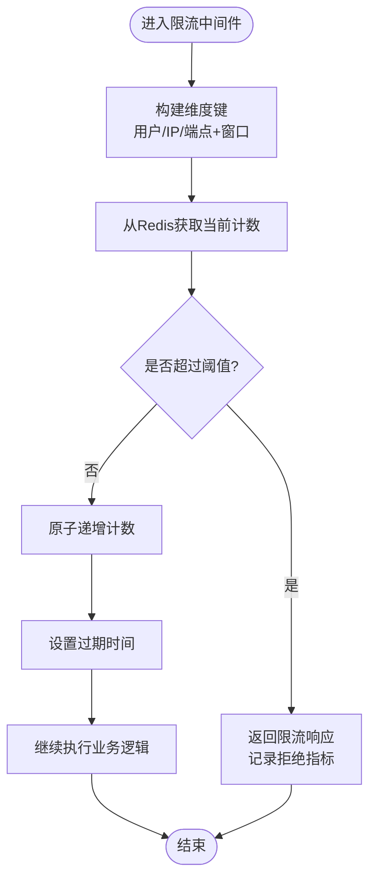
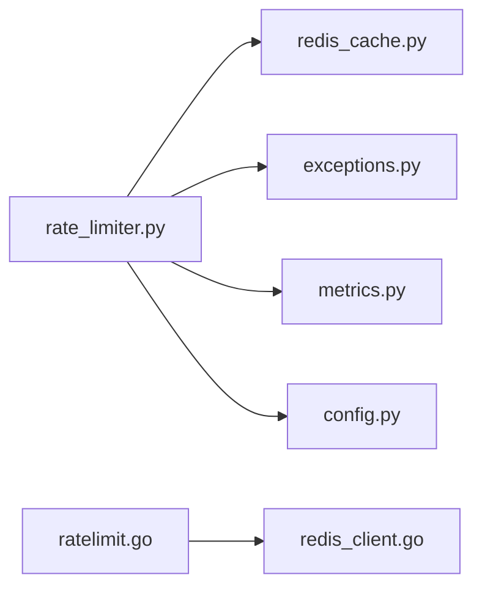

# 限流中间件

<cite>
**本文引用的文件**   
- [backend_design/nexus/middleware/rate_limiter.py](file://backend_design/nexus/middleware/rate_limiter.py)
- [backend_design/nexus/middleware/redis_cache.py](file://backend_design/nexus/middleware/redis_cache.py)
- [backend_design/nexus/core/exceptions.py](file://backend_design/nexus/core/exceptions.py)
- [backend_design/nexus/config.py](file://backend_design/nexus/config.py)
- [backend_design/nexus/api/routes/middleware_status.py](file://backend_design/nexus/api/routes/middleware_status.py)
- [backend_design/nexus/observability/metrics.py](file://backend_design/nexus/observability/metrics.py)
- [backend_design/nexus_gate/internal/ratelimit/ratelimit.go](file://backend_design/nexus_gate/internal/ratelimit/ratelimit.go)
- [backend_design/nexus_gate/internal/handlers/redis_client.go](file://backend_design/nexus_gate/internal/handlers/redis_client.go)
</cite>

## 目录
1. [简介](#简介)
2. [项目结构](#项目结构)
3. [核心组件](#核心组件)
4. [架构总览](#架构总览)
5. [详细组件分析](#详细组件分析)
6. [依赖分析](#依赖分析)
7. [性能考虑](#性能考虑)
8. [故障排查指南](#故障排查指南)
9. [结论](#结论)
10. [附录](#附录)

## 简介
本文件面向NexusCockpit系统的限流中间件，系统性阐述其算法策略、规则定义、执行机制、配置与监控、性能优化及故障恢复。系统同时提供Python后端与Go网关两个维度的限流能力：
- Python后端：基于Redis的滑动窗口计数实现，支持按用户、IP、API端点等多维度限流，并集成指标上报与状态查询接口。
- Go网关：在网关层进行请求拦截与限流判断，结合Redis作为分布式计数器，统一对外暴露限流能力。

## 项目结构
限流相关代码主要分布在以下位置：
- Python后端中间件与缓存抽象
  - 限流中间件：backend_design/nexus/middleware/rate_limiter.py
  - Redis缓存抽象：backend_design/nexus/middleware/redis_cache.py
  - 异常定义：backend_design/nexus/core/exceptions.py
  - 配置加载：backend_design/nexus/config.py
  - 中间件状态查询路由：backend_design/nexus/api/routes/middleware_status.py
  - 指标上报：backend_design/nexus/observability/metrics.py
- Go网关限流
  - 限流逻辑：backend_design/nexus_gate/internal/ratelimit/ratelimit.go
  - Redis客户端封装：backend_design/nexus_gate/internal/handlers/redis_client.go

图表来源
- [backend_design/nexus/middleware/rate_limiter.py](file://backend_design/nexus/middleware/rate_limiter.py)
- [backend_design/nexus/middleware/redis_cache.py](file://backend_design/nexus/middleware/redis_cache.py)
- [backend_design/nexus/core/exceptions.py](file://backend_design/nexus/core/exceptions.py)
- [backend_design/nexus/config.py](file://backend_design/nexus/config.py)
- [backend_design/nexus/api/routes/middleware_status.py](file://backend_design/nexus/api/routes/middleware_status.py)
- [backend_design/nexus/observability/metrics.py](file://backend_design/nexus/observability/metrics.py)
- [backend_design/nexus_gate/internal/ratelimit/ratelimit.go](file://backend_design/nexus_gate/internal/ratelimit/ratelimit.go)
- [backend_design/nexus_gate/internal/handlers/redis_client.go](file://backend_design/nexus_gate/internal/handlers/redis_client.go)

章节来源
- [backend_design/nexus/middleware/rate_limiter.py](file://backend_design/nexus/middleware/rate_limiter.py)
- [backend_design/nexus/middleware/redis_cache.py](file://backend_design/nexus/middleware/redis_cache.py)
- [backend_design/nexus/core/exceptions.py](file://backend_design/nexus/core/exceptions.py)
- [backend_design/nexus/config.py](file://backend_design/nexus/config.py)
- [backend_design/nexus/api/routes/middleware_status.py](file://backend_design/nexus/api/routes/middleware_status.py)
- [backend_design/nexus/observability/metrics.py](file://backend_design/nexus/observability/metrics.py)
- [backend_design/nexus_gate/internal/ratelimit/ratelimit.go](file://backend_design/nexus_gate/internal/ratelimit/ratelimit.go)
- [backend_design/nexus_gate/internal/handlers/redis_client.go](file://backend_design/nexus_gate/internal/handlers/redis_client.go)

## 核心组件
- 限流中间件（Python）
  - 职责：在请求进入业务处理前进行限流判定；根据维度（用户、IP、端点）计算窗口内请求数；决定是否放行或拒绝；记录指标与日志。
  - 关键能力：
    - 多维度键空间：以“维度标识+时间窗口”为键，使用原子操作更新计数。
    - 可插拔存储：通过Redis缓存抽象访问Redis，便于替换或扩展。
    - 指标上报：统计允许/拒绝次数、延迟等。
    - 状态查询：提供接口返回当前限流状态与阈值。
- Redis缓存抽象（Python）
  - 职责：封装Redis连接、命令与错误处理，向上层提供统一的缓存访问接口。
- 异常定义（Python）
  - 职责：定义限流相关的异常类型，供中间件抛出与上层捕获。
- 配置加载（Python）
  - 职责：读取限流相关配置项（如默认阈值、窗口大小、是否启用等）。
- 中间件状态查询路由（Python）
  - 职责：暴露HTTP接口，返回限流器实例的状态信息，便于运维观测。
- 指标上报（Python）
  - 职责：将限流结果、QPS、拒绝率等指标上报到监控系统。
- 网关限流（Go）
  - 职责：在网关层对入站请求进行快速拦截与限流，减少后端压力。
- Redis客户端封装（Go）
  - 职责：封装Redis连接池、重试与错误处理，为网关限流提供稳定可靠的计数服务。

章节来源
- [backend_design/nexus/middleware/rate_limiter.py](file://backend_design/nexus/middleware/rate_limiter.py)
- [backend_design/nexus/middleware/redis_cache.py](file://backend_design/nexus/middleware/redis_cache.py)
- [backend_design/nexus/core/exceptions.py](file://backend_design/nexus/core/exceptions.py)
- [backend_design/nexus/config.py](file://backend_design/nexus/config.py)
- [backend_design/nexus/api/routes/middleware_status.py](file://backend_design/nexus/api/routes/middleware_status.py)
- [backend_design/nexus/observability/metrics.py](file://backend_design/nexus/observability/metrics.py)
- [backend_design/nexus_gate/internal/ratelimit/ratelimit.go](file://backend_design/nexus_gate/internal/ratelimit/ratelimit.go)
- [backend_design/nexus_gate/internal/handlers/redis_client.go](file://backend_design/nexus_gate/internal/handlers/redis_client.go)

## 架构总览
整体采用“网关+后端”双层限流架构：
- 网关层（Go）：对全局流量进行粗粒度控制，保护后端免受突发流量冲击。
- 后端层（Python）：针对具体业务维度（用户、IP、端点）进行细粒度限流，保障资源公平与稳定性。
- 共享存储（Redis）：作为分布式计数器，保证多实例一致性。

图表来源
- [backend_design/nexus_gate/internal/ratelimit/ratelimit.go](file://backend_design/nexus_gate/internal/ratelimit/ratelimit.go)
- [backend_design/nexus_gate/internal/handlers/redis_client.go](file://backend_design/nexus_gate/internal/handlers/redis_client.go)
- [backend_design/nexus/middleware/rate_limiter.py](file://backend_design/nexus/middleware/rate_limiter.py)
- [backend_design/nexus/middleware/redis_cache.py](file://backend_design/nexus/middleware/redis_cache.py)
- [backend_design/nexus/observability/metrics.py](file://backend_design/nexus/observability/metrics.py)

## 详细组件分析

### 限流算法与策略选择
- 滑动窗口计数（推荐用于后端）
  - 原理：维护固定时间窗口内的请求计数，每次请求时原子递增，并在窗口过期后重置。
  - 优点：平滑限制，避免令牌桶在临界时刻的突发放大问题；易于实现多维度组合。
  - 适用场景：按用户/IP/端点的精细化限流。
- 令牌桶（可用于网关或轻量场景）
  - 原理：以固定速率生成令牌，请求消耗令牌，无令牌则拒绝。
  - 优点：实现简单，适合全局粗粒度限流。
  - 注意：需要谨慎设置桶容量与填充速率，避免瞬时拥塞。

说明：本项目后端采用滑动窗口计数，网关侧可根据需求选择令牌桶或滑动窗口。

章节来源
- [backend_design/nexus/middleware/rate_limiter.py](file://backend_design/nexus/middleware/rate_limiter.py)
- [backend_design/nexus_gate/internal/ratelimit/ratelimit.go](file://backend_design/nexus_gate/internal/ratelimit/ratelimit.go)

### 限流规则定义与维度
- 维度
  - 用户维度：以用户标识为键空间，限制单个用户的请求频率。
  - IP维度：以客户端IP为键空间，限制单IP的请求频率。
  - API端点维度：以URL路径或路由标识为键空间，限制特定接口的请求频率。
- 规则要素
  - 窗口时长：例如每秒、每分钟。
  - 阈值上限：窗口内最大允许请求数。
  - 优先级：当多个规则命中时，取最严格者生效。
- 动态配置
  - 可通过配置中心或运行时接口调整阈值与窗口，无需重启服务。

章节来源
- [backend_design/nexus/middleware/rate_limiter.py](file://backend_design/nexus/middleware/rate_limiter.py)
- [backend_design/nexus/config.py](file://backend_design/nexus/config.py)

### 执行机制与流程
- 请求拦截时机
  - 网关层：在反向代理阶段进行全局限流判断。
  - 后端层：在路由解析后、业务处理前执行中间件。
- 计数更新逻辑
  - 使用Redis原子操作（如INCR/EXPIRE或Lua脚本）确保多实例一致性。
  - 键命名包含维度与时间窗口，避免冲突。
- 拒绝响应处理
  - 返回标准限流状态码与提示，附带重试建议（如Retry-After）。
  - 上报拒绝指标，便于监控告警。

图表来源
- [backend_design/nexus/middleware/rate_limiter.py](file://backend_design/nexus/middleware/rate_limiter.py)
- [backend_design/nexus/middleware/redis_cache.py](file://backend_design/nexus/middleware/redis_cache.py)

章节来源
- [backend_design/nexus/middleware/rate_limiter.py](file://backend_design/nexus/middleware/rate_limiter.py)
- [backend_design/nexus/middleware/redis_cache.py](file://backend_design/nexus/middleware/redis_cache.py)

### 中间件状态查询与可观测性
- 状态查询接口
  - 提供HTTP接口返回各维度限流器的当前状态（阈值、窗口、当前计数等）。
- 指标上报
  - 上报允许/拒绝次数、QPS、P99延迟、Redis往返耗时等。
  - 与Prometheus/Grafana集成，形成可视化看板。

章节来源
- [backend_design/nexus/api/routes/middleware_status.py](file://backend_design/nexus/api/routes/middleware_status.py)
- [backend_design/nexus/observability/metrics.py](file://backend_design/nexus/observability/metrics.py)

### 网关限流（Go）
- 功能要点
  - 在网关层进行快速拦截，降低后端负载。
  - 使用Redis客户端封装进行计数与超时控制。
  - 支持全局阈值与可选的分发策略（如按上游服务）。
- 与后端联动
  - 网关负责粗粒度保护，后端负责细粒度控制，二者共同构成多层防护。

章节来源
- [backend_design/nexus_gate/internal/ratelimit/ratelimit.go](file://backend_design/nexus_gate/internal/ratelimit/ratelimit.go)
- [backend_design/nexus_gate/internal/handlers/redis_client.go](file://backend_design/nexus_gate/internal/handlers/redis_client.go)

## 依赖分析
- 内部依赖
  - 限流中间件依赖Redis缓存抽象、异常定义、配置加载与指标上报。
  - 网关限流依赖Redis客户端封装。
- 外部依赖
  - Redis：分布式计数器与状态存储。
  - 监控系统：Prometheus/Grafana用于指标采集与可视化。

图表来源
- [backend_design/nexus/middleware/rate_limiter.py](file://backend_design/nexus/middleware/rate_limiter.py)
- [backend_design/nexus/middleware/redis_cache.py](file://backend_design/nexus/middleware/redis_cache.py)
- [backend_design/nexus/core/exceptions.py](file://backend_design/nexus/core/exceptions.py)
- [backend_design/nexus/config.py](file://backend_design/nexus/config.py)
- [backend_design/nexus/observability/metrics.py](file://backend_design/nexus/observability/metrics.py)
- [backend_design/nexus_gate/internal/ratelimit/ratelimit.go](file://backend_design/nexus_gate/internal/ratelimit/ratelimit.go)
- [backend_design/nexus_gate/internal/handlers/redis_client.go](file://backend_design/nexus_gate/internal/handlers/redis_client.go)

章节来源
- [backend_design/nexus/middleware/rate_limiter.py](file://backend_design/nexus/middleware/rate_limiter.py)
- [backend_design/nexus/middleware/redis_cache.py](file://backend_design/nexus/middleware/redis_cache.py)
- [backend_design/nexus/core/exceptions.py](file://backend_design/nexus/core/exceptions.py)
- [backend_design/nexus/config.py](file://backend_design/nexus/config.py)
- [backend_design/nexus/observability/metrics.py](file://backend_design/nexus/observability/metrics.py)
- [backend_design/nexus_gate/internal/ratelimit/ratelimit.go](file://backend_design/nexus_gate/internal/ratelimit/ratelimit.go)
- [backend_design/nexus_gate/internal/handlers/redis_client.go](file://backend_design/nexus_gate/internal/handlers/redis_client.go)

## 性能考虑
- 原子性与一致性
  - 使用Redis原子操作或Lua脚本，避免并发竞争导致计数不准确。
- 键空间设计
  - 合理拆分维度与窗口，避免热点键过大；必要时引入分片或哈希。
- 网络与序列化开销
  - 复用连接池，减少Redis往返；尽量使用紧凑的数据格式。
- 降级与熔断
  - 当Redis不可用时，可回退至本地内存计数（单机），或直接放行并告警，避免雪崩。
- 监控与调优
  - 关注Redis延迟、命中率、拒绝率；结合Grafana看板进行容量规划与阈值调优。

[本节为通用性能指导，不直接分析具体文件]

## 故障排查指南
- 常见问题
  - Redis连接失败：检查网络连通性、认证信息与连接池配置。
  - 计数异常：确认原子操作与过期时间设置是否正确。
  - 误判限流：核对维度键命名与阈值配置，检查是否存在热点键。
- 定位步骤
  - 查看中间件状态接口返回，确认当前阈值与计数。
  - 检查指标上报中的拒绝率与延迟分布。
  - 在网关与后端分别开启调试日志，追踪请求链路。
- 恢复策略
  - 临时放宽阈值或关闭某维度限流，优先恢复业务可用性。
  - 修复Redis后逐步恢复限流策略，观察指标回归正常。

章节来源
- [backend_design/nexus/api/routes/middleware_status.py](file://backend_design/nexus/api/routes/middleware_status.py)
- [backend_design/nexus/observability/metrics.py](file://backend_design/nexus/observability/metrics.py)
- [backend_design/nexus/middleware/rate_limiter.py](file://backend_design/nexus/middleware/rate_limiter.py)

## 结论
NexusCockpit的限流中间件通过“网关+后端”双层架构与Redis分布式计数，实现了高可用、可扩展的多维度限流能力。滑动窗口计数在后端提供了精细化的流量控制，配合完善的指标与状态查询，便于运维观测与快速排障。建议在上线前完成容量评估与压测，持续优化阈值与监控告警策略，确保系统在高峰期的稳定性与用户体验。

[本节为总结性内容，不直接分析具体文件]

## 附录
- 最佳实践清单
  - 分层限流：网关粗粒度、后端细粒度。
  - 维度清晰：用户/IP/端点分离，避免键冲突。
  - 动态可调：支持运行时调整阈值与窗口。
  - 指标完备：拒绝率、延迟、QPS全面覆盖。
  - 降级预案：Redis不可用时的回退策略。
- 参考实现路径
  - Python限流中间件：[backend_design/nexus/middleware/rate_limiter.py](file://backend_design/nexus/middleware/rate_limiter.py)
  - Redis缓存抽象：[backend_design/nexus/middleware/redis_cache.py](file://backend_design/nexus/middleware/redis_cache.py)
  - 网关限流：[backend_design/nexus_gate/internal/ratelimit/ratelimit.go](file://backend_design/nexus_gate/internal/ratelimit/ratelimit.go)
  - Redis客户端封装：[backend_design/nexus_gate/internal/handlers/redis_client.go](file://backend_design/nexus_gate/internal/handlers/redis_client.go)