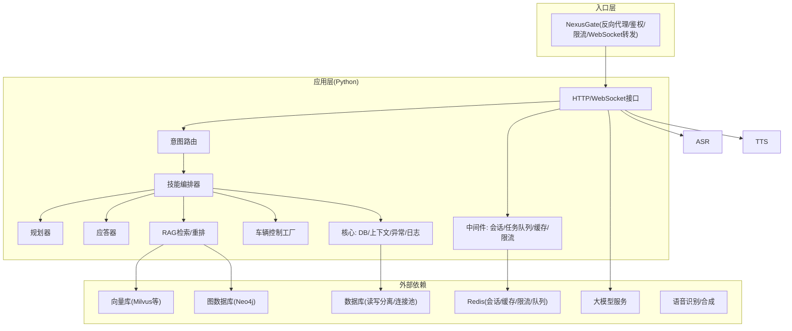
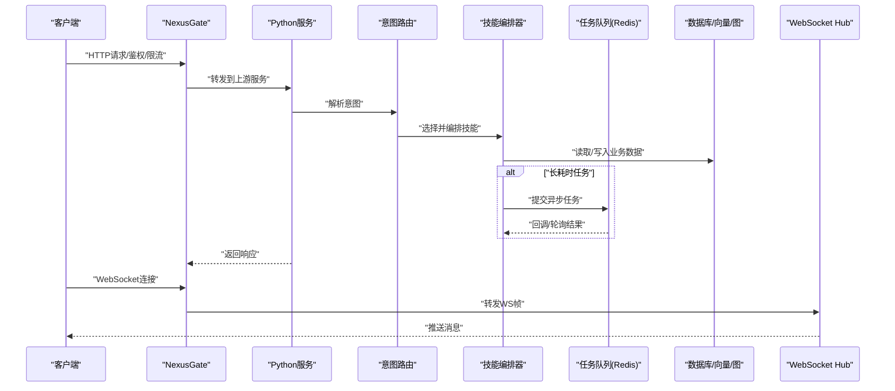
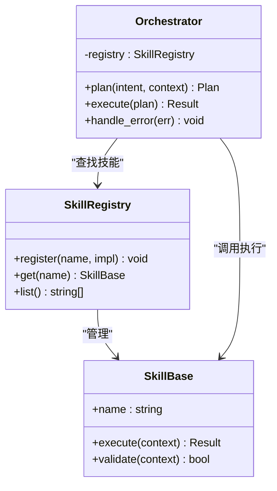
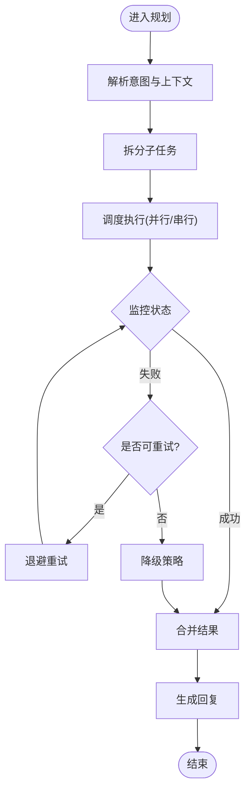
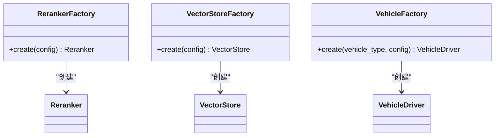
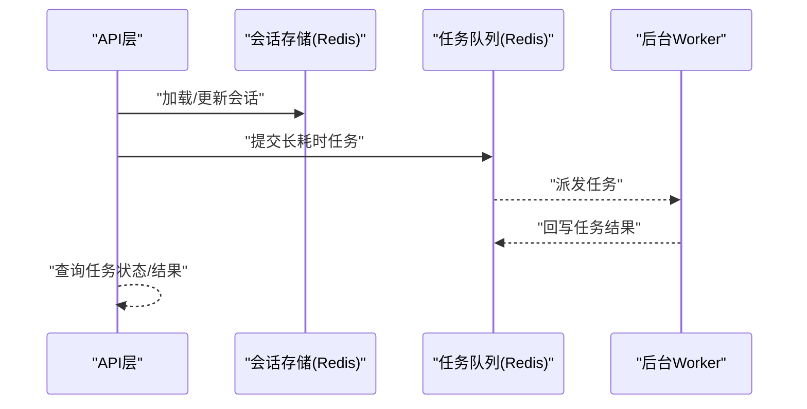
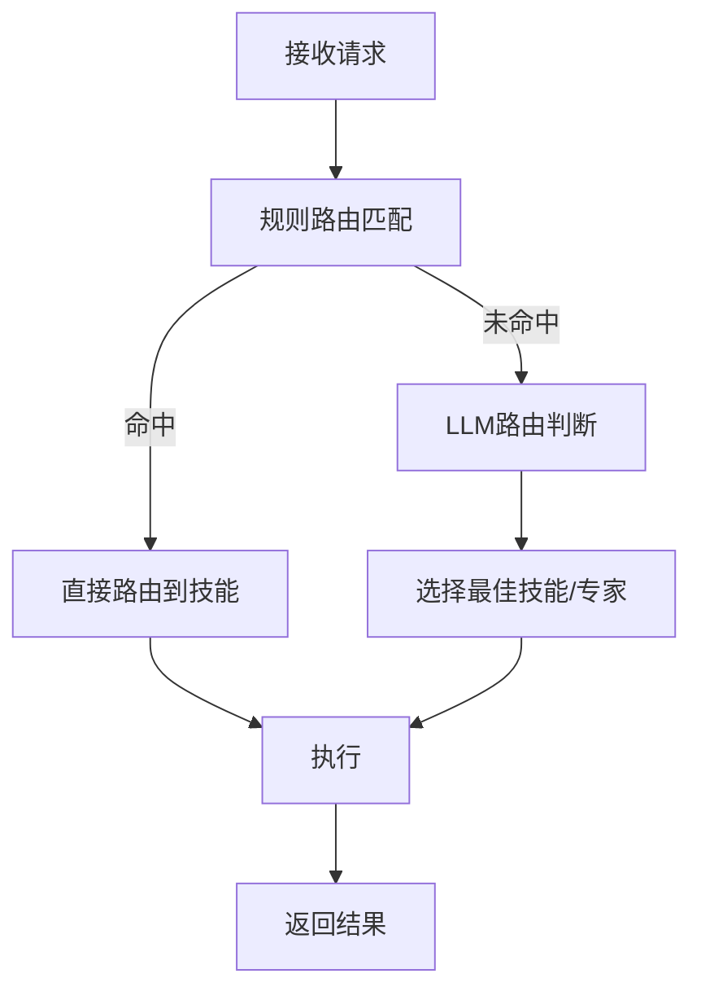
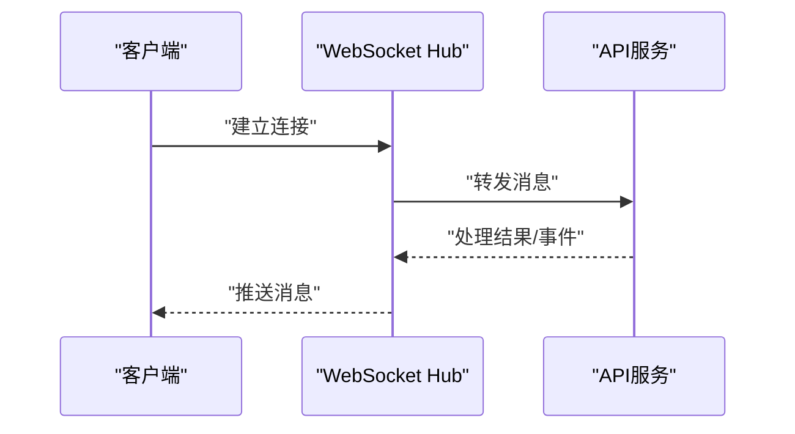
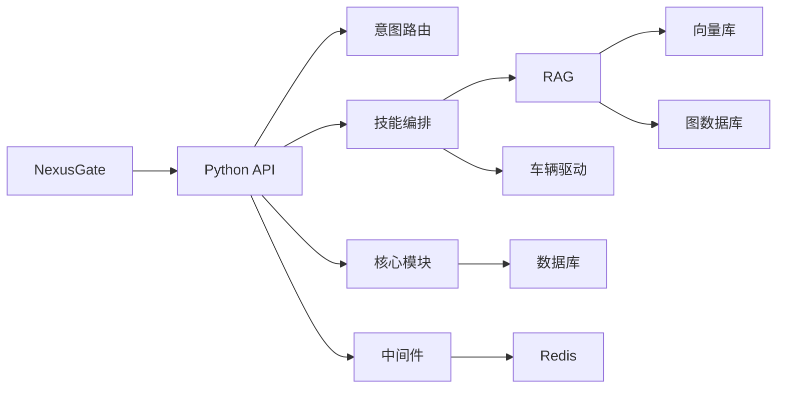

# 可扩展性设计

<cite>
**本文引用的文件**   
- [backend_design/nexus/main.py](file://backend_design/nexus/main.py)
- [backend_design/nexus/skills/registry.py](file://backend_design/nexus/skills/registry.py)
- [backend_design/nexus/skills/base.py](file://backend_design/nexus/skills/base.py)
- [backend_design/nexus/skills/orchestrator.py](file://backend_design/nexus/skills/orchestrator.py)
- [backend_design/nexus/agent/planner.py](file://backend_design/nexus/agent/planner.py)
- [backend_design/nexus/agent/responder.py](file://backend_design/nexus/agent/responder.py)
- [backend_design/nexus/agent/graph.py](file://backend_design/nexus/agent/graph.py)
- [backend_design/nexus/agent/subagent_monitor.py](file://backend_design/nexus/agent/subagent_monitor.py)
- [backend_design/nexus/core/db_manager.py](file://backend_design/nexus/core/db_manager.py)
- [backend_design/nexus/core/cockpit_manager.py](file://backend_design/nexus/core/cockpit_manager.py)
- [backend_design/nexus/middleware/session_store.py](file://backend_design/nexus/middleware/session_store.py)
- [backend_design/nexus/middleware/task_queue.py](file://backend_design/nexus/middleware/task_queue.py)
- [backend_design/nexus/intent/router.py](file://backend_design/nexus/intent/router.py)
- [backend_design/nexus/intent/llm_router.py](file://backend_design/nexus/intent/llm_router.py)
- [backend_design/nexus/api/routes/chat.py](file://backend_design/nexus/api/routes/chat.py)
- [backend_design/nexus/api/websocket.py](file://backend_design/nexus/api/websocket.py)
- [backend_design/nexus/reranker_factory.py](file://backend_design/nexus/rag/reranker_factory.py)
- [backend_design/nexus/vector_factory.py](file://backend_design/nexus/rag/vector_factory.py)
- [backend_design/nexus/vehicle/factory.py](file://backend_design/nexus/vehicle/factory.py)
- [backend_design/nexus_gate/internal/proxy/proxy.go](file://backend_design/nexus_gate/internal/proxy/proxy.go)
- [backend_design/nexus_gate/internal/auth/jwt.go](file://backend_design/nexus_gate/internal/auth/jwt.go)
- [backend_design/nexus_gate/internal/ratelimit/ratelimit.go](file://backend_design/nexus_gate/internal/ratelimit/ratelimit.go)
- [backend_design/nexus_gate/internal/ws/hub.go](file://backend_design/nexus_gate/internal/ws/hub.go)
- [docker-compose.yml](file://docker-compose.yml)
- [config/prometheus/prometheus.yml](file://config/prometheus/prometheus.yml)
- [config/grafana/provisioning/dashboards/nexuscockpit-overview.json](file://config/grafana/provisioning/dashboards/nexuscockpit-overview.json)
</cite>

## 目录
1. [引言](#引言)
2. [项目结构](#项目结构)
3. [核心组件](#核心组件)
4. [架构总览](#架构总览)
5. [详细组件分析](#详细组件分析)
6. [依赖分析](#依赖分析)
7. [性能考虑](#性能考虑)
8. [故障排查指南](#故障排查指南)
9. [结论](#结论)
10. [附录](#附录)

## 引言
本设计文档面向NexusCockpit的可扩展性，围绕插件化架构、水平与垂直扩展策略、微服务拆分原则、资源隔离与弹性伸缩、容量规划、压测方案以及分布式问题（单点故障、数据一致性、分布式事务）进行系统化阐述。目标读者包括架构师、后端工程师、运维与测试人员。

## 项目结构
系统由Python主服务与Go网关组成：
- Python主服务负责意图路由、技能编排、专家系统、RAG检索、车辆控制、会话与记忆、中间件（限流、缓存、任务队列）、可观测性等。
- Go网关承担鉴权、反向代理、WebSocket转发、限流等能力，提升入口层吞吐与稳定性。

图表来源
- [backend_design/nexus/main.py](file://backend_design/nexus/main.py)
- [backend_design/nexus/api/routes/chat.py](file://backend_design/nexus/api/routes/chat.py)
- [backend_design/nexus/api/websocket.py](file://backend_design/nexus/api/websocket.py)
- [backend_design/nexus/intent/router.py](file://backend_design/nexus/intent/router.py)
- [backend_design/nexus/skills/orchestrator.py](file://backend_design/nexus/skills/orchestrator.py)
- [backend_design/nexus/agent/planner.py](file://backend_design/nexus/agent/planner.py)
- [backend_design/nexus/agent/responder.py](file://backend_design/nexus/agent/responder.py)
- [backend_design/nexus/reranker_factory.py](file://backend_design/nexus/rag/reranker_factory.py)
- [backend_design/nexus/vector_factory.py](file://backend_design/nexus/rag/vector_factory.py)
- [backend_design/nexus/vehicle/factory.py](file://backend_design/nexus/vehicle/factory.py)
- [backend_design/nexus/core/db_manager.py](file://backend_design/nexus/core/db_manager.py)
- [backend_design/nexus/middleware/session_store.py](file://backend_design/nexus/middleware/session_store.py)
- [backend_design/nexus/middleware/task_queue.py](file://backend_design/nexus/middleware/task_queue.py)
- [backend_design/nexus_gate/internal/proxy/proxy.go](file://backend_design/nexus_gate/internal/proxy/proxy.go)
- [backend_design/nexus_gate/internal/auth/jwt.go](file://backend_design/nexus_gate/internal/auth/jwt.go)
- [backend_design/nexus_gate/internal/ratelimit/ratelimit.go](file://backend_design/nexus_gate/internal/ratelimit/ratelimit.go)
- [backend_design/nexus_gate/internal/ws/hub.go](file://backend_design/nexus_gate/internal/ws/hub.go)

章节来源
- [backend_design/nexus/main.py](file://backend_design/nexus/main.py)
- [docker-compose.yml](file://docker-compose.yml)

## 核心组件
- 技能注册表与编排：通过注册表集中管理技能，编排器按意图与上下文调度执行。
- 专家系统与规划：规划器将复杂任务分解为子步骤，专家系统提供领域能力。
- 工厂模式：RAG重排器、向量存储、车辆驱动均通过工厂按需创建实例，便于替换与扩展。
- 中间件：会话外置、任务队列异步化、缓存与限流提升吞吐与稳定性。
- 网关：Go实现的鉴权、代理、限流与WebSocket转发，支撑水平扩展。

章节来源
- [backend_design/nexus/skills/registry.py](file://backend_design/nexus/skills/registry.py)
- [backend_design/nexus/skills/base.py](file://backend_design/nexus/skills/base.py)
- [backend_design/nexus/skills/orchestrator.py](file://backend_design/nexus/skills/orchestrator.py)
- [backend_design/nexus/agent/planner.py](file://backend_design/nexus/agent/planner.py)
- [backend_design/nexus/agent/responder.py](file://backend_design/nexus/agent/responder.py)
- [backend_design/nexus/reranker_factory.py](file://backend_design/nexus/rag/reranker_factory.py)
- [backend_design/nexus/vector_factory.py](file://backend_design/nexus/rag/vector_factory.py)
- [backend_design/nexus/vehicle/factory.py](file://backend_design/nexus/vehicle/factory.py)
- [backend_design/nexus/middleware/session_store.py](file://backend_design/nexus/middleware/session_store.py)
- [backend_design/nexus/middleware/task_queue.py](file://backend_design/nexus/middleware/task_queue.py)
- [backend_design/nexus_gate/internal/proxy/proxy.go](file://backend_design/nexus_gate/internal/proxy/proxy.go)
- [backend_design/nexus_gate/internal/auth/jwt.go](file://backend_design/nexus_gate/internal/auth/jwt.go)
- [backend_design/nexus_gate/internal/ratelimit/ratelimit.go](file://backend_design/nexus_gate/internal/ratelimit/ratelimit.go)
- [backend_design/nexus_gate/internal/ws/hub.go](file://backend_design/nexus_gate/internal/ws/hub.go)

## 架构总览
整体采用“网关+无状态服务+共享中间件”的架构：
- 网关层：多副本部署，统一鉴权、限流、WebSocket转发。
- 应用层：无状态服务，横向扩容；会话与状态外置至Redis；长耗时任务入队异步处理。
- 数据层：数据库读写分离、向量/图数据库用于知识检索；对象存储用于媒体文件。
- 可观测性：Prometheus/Grafana采集指标，集中日志与链路追踪。

图表来源
- [backend_design/nexus_gate/internal/proxy/proxy.go](file://backend_design/nexus_gate/internal/proxy/proxy.go)
- [backend_design/nexus_gate/internal/auth/jwt.go](file://backend_design/nexus_gate/internal/auth/jwt.go)
- [backend_design/nexus_gate/internal/ratelimit/ratelimit.go](file://backend_design/nexus_gate/internal/ratelimit/ratelimit.go)
- [backend_design/nexus_gate/internal/ws/hub.go](file://backend_design/nexus_gate/internal/ws/hub.go)
- [backend_design/nexus/api/websocket.py](file://backend_design/nexus/api/websocket.py)
- [backend_design/nexus/intent/router.py](file://backend_design/nexus/intent/router.py)
- [backend_design/nexus/skills/orchestrator.py](file://backend_design/nexus/skills/orchestrator.py)
- [backend_design/nexus/middleware/task_queue.py](file://backend_design/nexus/middleware/task_queue.py)

## 详细组件分析

### 插件化架构：技能注册表与编排
- 技能基类定义标准接口，确保新增技能无需修改核心流程。
- 注册表维护技能名称到实现类的映射，支持动态发现与热插拔。
- 编排器根据意图与上下文选择技能，组合执行顺序，处理错误与重试。

图表来源
- [backend_design/nexus/skills/base.py](file://backend_design/nexus/skills/base.py)
- [backend_design/nexus/skills/registry.py](file://backend_design/nexus/skills/registry.py)
- [backend_design/nexus/skills/orchestrator.py](file://backend_design/nexus/skills/orchestrator.py)

章节来源
- [backend_design/nexus/skills/base.py](file://backend_design/nexus/skills/base.py)
- [backend_design/nexus/skills/registry.py](file://backend_design/nexus/skills/registry.py)
- [backend_design/nexus/skills/orchestrator.py](file://backend_design/nexus/skills/orchestrator.py)

### 专家系统与规划器
- 规划器将用户意图拆解为子任务序列，协调多个专家或工具完成。
- 子任务监控器跟踪执行进度、超时与失败，触发重试或降级。
- 应答器负责生成最终回复，结合记忆与上下文优化表达。

图表来源
- [backend_design/nexus/agent/planner.py](file://backend_design/nexus/agent/planner.py)
- [backend_design/nexus/agent/subagent_monitor.py](file://backend_design/nexus/agent/subagent_monitor.py)
- [backend_design/nexus/agent/responder.py](file://backend_design/nexus/agent/responder.py)

章节来源
- [backend_design/nexus/agent/planner.py](file://backend_design/nexus/agent/planner.py)
- [backend_design/nexus/agent/subagent_monitor.py](file://backend_design/nexus/agent/subagent_monitor.py)
- [backend_design/nexus/agent/responder.py](file://backend_design/nexus/agent/responder.py)

### 工厂模式：RAG与车辆驱动
- RAG重排器与向量存储通过工厂按需创建，支持多种后端切换与配置注入。
- 车辆驱动工厂根据车型或协议选择具体实现，屏蔽差异。

图表来源
- [backend_design/nexus/reranker_factory.py](file://backend_design/nexus/rag/reranker_factory.py)
- [backend_design/nexus/vector_factory.py](file://backend_design/nexus/rag/vector_factory.py)
- [backend_design/nexus/vehicle/factory.py](file://backend_design/nexus/vehicle/factory.py)

章节来源
- [backend_design/nexus/reranker_factory.py](file://backend_design/nexus/rag/reranker_factory.py)
- [backend_design/nexus/vector_factory.py](file://backend_design/nexus/rag/vector_factory.py)
- [backend_design/nexus/vehicle/factory.py](file://backend_design/nexus/vehicle/factory.py)

### 会话与任务中间件
- 会话外置：会话状态存入Redis，服务无状态化，支持多副本与负载均衡。
- 任务队列：长耗时任务入队，消费者异步处理，避免阻塞请求路径。

图表来源
- [backend_design/nexus/middleware/session_store.py](file://backend_design/nexus/middleware/session_store.py)
- [backend_design/nexus/middleware/task_queue.py](file://backend_design/nexus/middleware/task_queue.py)

章节来源
- [backend_design/nexus/middleware/session_store.py](file://backend_design/nexus/middleware/session_store.py)
- [backend_design/nexus/middleware/task_queue.py](file://backend_design/nexus/middleware/task_queue.py)

### 意图路由与LLM路由
- 规则路由基于关键词与模板匹配快速决策。
- LLM路由在复杂场景下交由大模型判断，提高泛化能力。

图表来源
- [backend_design/nexus/intent/router.py](file://backend_design/nexus/intent/router.py)
- [backend_design/nexus/intent/llm_router.py](file://backend_design/nexus/intent/llm_router.py)

章节来源
- [backend_design/nexus/intent/router.py](file://backend_design/nexus/intent/router.py)
- [backend_design/nexus/intent/llm_router.py](file://backend_design/nexus/intent/llm_router.py)

### HTTP与WebSocket接口
- HTTP接口承载常规业务逻辑，遵循REST风格。
- WebSocket用于实时交互，如聊天流式输出、车辆事件推送。

图表来源
- [backend_design/nexus/api/websocket.py](file://backend_design/nexus/api/websocket.py)
- [backend_design/nexus_gate/internal/ws/hub.go](file://backend_design/nexus_gate/internal/ws/hub.go)

章节来源
- [backend_design/nexus/api/websocket.py](file://backend_design/nexus/api/websocket.py)
- [backend_design/nexus_gate/internal/ws/hub.go](file://backend_design/nexus_gate/internal/ws/hub.go)

## 依赖分析
- 网关与Python服务解耦，通过HTTP/WebSocket通信，降低耦合度。
- 中间件与核心逻辑通过接口抽象，便于替换与扩展。
- 外部依赖（Redis、数据库、向量/图数据库、LLM、ASR/TTS）通过工厂与配置注入，支持多后端。

图表来源
- [backend_design/nexus/main.py](file://backend_design/nexus/main.py)
- [backend_design/nexus/intent/router.py](file://backend_design/nexus/intent/router.py)
- [backend_design/nexus/skills/orchestrator.py](file://backend_design/nexus/skills/orchestrator.py)
- [backend_design/nexus/core/db_manager.py](file://backend_design/nexus/core/db_manager.py)
- [backend_design/nexus/middleware/session_store.py](file://backend_design/nexus/middleware/session_store.py)
- [backend_design/nexus/reranker_factory.py](file://backend_design/nexus/rag/reranker_factory.py)
- [backend_design/nexus/vector_factory.py](file://backend_design/nexus/rag/vector_factory.py)
- [backend_design/nexus/vehicle/factory.py](file://backend_design/nexus/vehicle/factory.py)

章节来源
- [backend_design/nexus/main.py](file://backend_design/nexus/main.py)
- [backend_design/nexus/core/db_manager.py](file://backend_design/nexus/core/db_manager.py)

## 性能考虑
- 水平扩展
  - 无状态服务：会话与状态外置Redis，多副本部署，配合负载均衡。
  - 网关多副本：Go网关无状态，支持水平扩容。
  - 任务队列：使用Redis队列，消费者多实例消费，提升吞吐。
- 垂直扩展
  - 数据库读写分离：读多写少场景下，读从库分担压力。
  - 缓存层优化：热点数据缓存，减少数据库访问。
  - 异步处理：长耗时任务入队，避免阻塞请求路径。
- 资源隔离
  - 进程/容器级隔离，限制CPU/内存配额。
  - 关键路径与非关键路径分池，防止相互影响。
- 弹性伸缩
  - 基于CPU/内存/队列长度指标自动扩缩容。
  - 网关与服务分层扩缩容，避免瓶颈转移。
- 容量规划
  - 以峰值QPS、P99延迟、错误率为基准，评估资源需求。
  - 预留冗余容量应对突发流量。

[本节为通用指导，不直接分析具体文件]

## 故障排查指南
- 单点故障
  - Redis集群化部署，避免会话与队列单点。
  - 数据库主从高可用，自动故障转移。
- 数据一致性
  - 跨服务操作采用最终一致性，借助消息队列与补偿机制。
  - 幂等设计：对重复请求进行去重与幂等校验。
- 分布式事务
  - 优先使用Saga或Outbox模式，避免强一致带来的性能损耗。
- 可观测性
  - Prometheus指标采集，Grafana可视化告警。
  - 集中日志与链路追踪，定位慢请求与异常。

章节来源
- [config/prometheus/prometheus.yml](file://config/prometheus/prometheus.yml)
- [config/grafana/provisioning/dashboards/nexuscockpit-overview.json](file://config/grafana/provisioning/dashboards/nexuscockpit-overview.json)

## 结论
NexusCockpit通过插件化架构、工厂模式与中间件体系，实现了良好的可扩展性与可维护性。结合网关无状态化、会话外置、任务异步化与读写分离，系统在水平与垂直方向均具备良好扩展能力。建议在生产环境完善高可用与可观测性，持续进行压测与容量规划，保障稳定与性能。

[本节为总结，不直接分析具体文件]

## 附录

### 扩展开发指南与最佳实践
- 新增技能
  - 继承技能基类，实现标准接口。
  - 在注册表中登记新技能，确保名称唯一。
  - 在编排器中配置默认策略与降级路径。
- 新增RAG后端
  - 实现重排器或向量存储接口。
  - 在对应工厂中注册新实现，并通过配置切换。
- 新增车辆驱动
  - 实现车辆驱动接口，适配不同协议。
  - 在车辆工厂中注册，按车型选择实现。
- 中间件扩展
  - 复用会话与任务队列抽象，避免侵入核心逻辑。
  - 限流与缓存策略通过配置注入，便于灰度与回滚。

章节来源
- [backend_design/nexus/skills/base.py](file://backend_design/nexus/skills/base.py)
- [backend_design/nexus/skills/registry.py](file://backend_design/nexus/skills/registry.py)
- [backend_design/nexus/skills/orchestrator.py](file://backend_design/nexus/skills/orchestrator.py)
- [backend_design/nexus/reranker_factory.py](file://backend_design/nexus/rag/reranker_factory.py)
- [backend_design/nexus/vector_factory.py](file://backend_design/nexus/rag/vector_factory.py)
- [backend_design/nexus/vehicle/factory.py](file://backend_design/nexus/vehicle/factory.py)
- [backend_design/nexus/middleware/session_store.py](file://backend_design/nexus/middleware/session_store.py)
- [backend_design/nexus/middleware/task_queue.py](file://backend_design/nexus/middleware/task_queue.py)

### 微服务拆分原则与服务粒度
- 单一职责：每个服务聚焦一个领域（如会话、任务、RAG）。
- 松耦合：通过API与消息总线交互，避免紧耦合。
- 可独立部署：服务可独立发布与扩缩容。
- 数据边界清晰：每个服务拥有自己的数据存储，避免共享数据库。

[本节为概念性内容，不直接分析具体文件]

### 压测与基准测试方案
- 压测目标
  - 峰值QPS、P99/P95延迟、错误率、资源利用率。
- 压测场景
  - 常规对话、长耗时任务、WebSocket实时推送。
- 压测工具
  - 使用负载生成器模拟并发请求，观察网关与服务指标。
- 压测环境
  - 与生产一致的硬件与网络拓扑，避免偏差。
- 结果分析
  - 定位瓶颈（CPU/IO/网络/数据库），针对性优化。

[本节为通用指导，不直接分析具体文件]