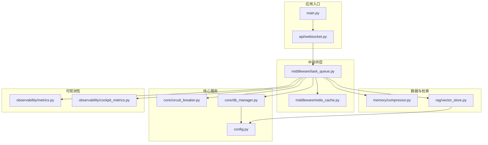
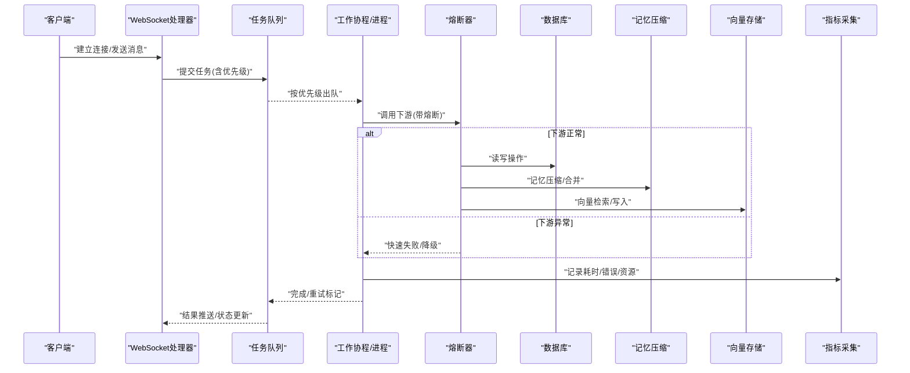
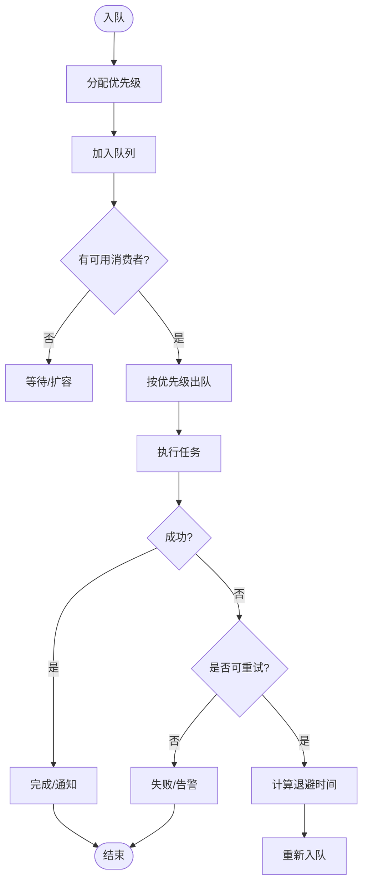
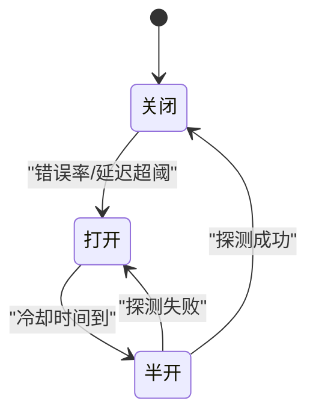
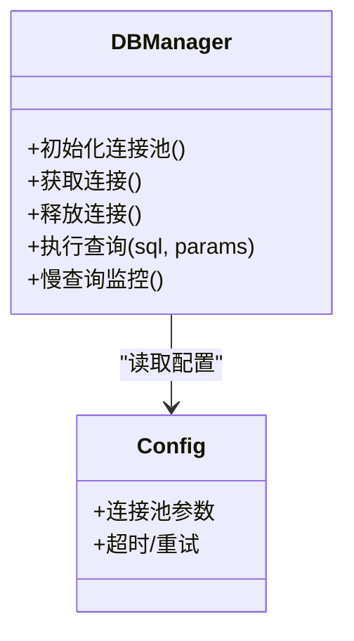
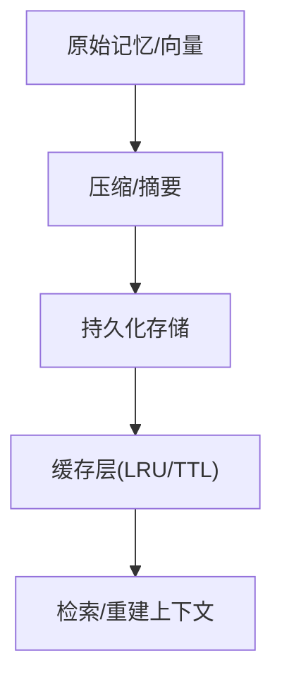
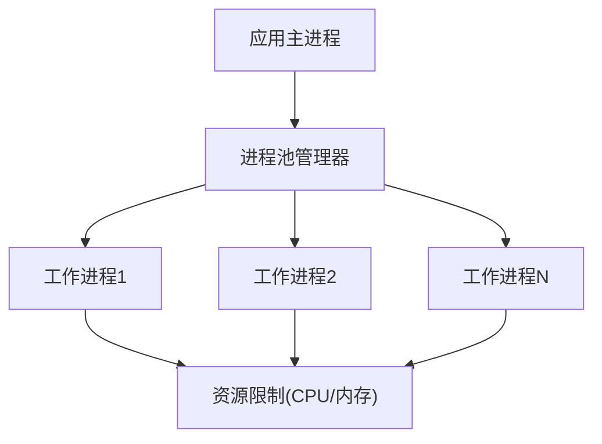
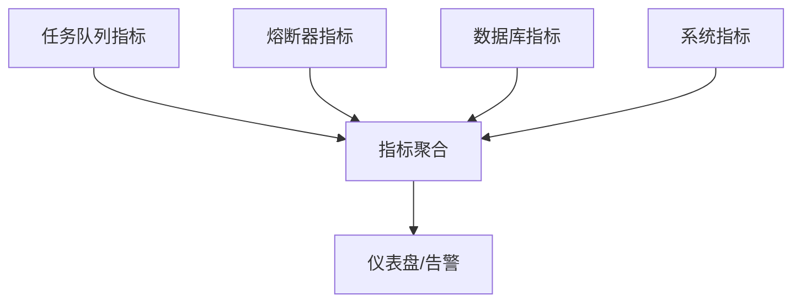
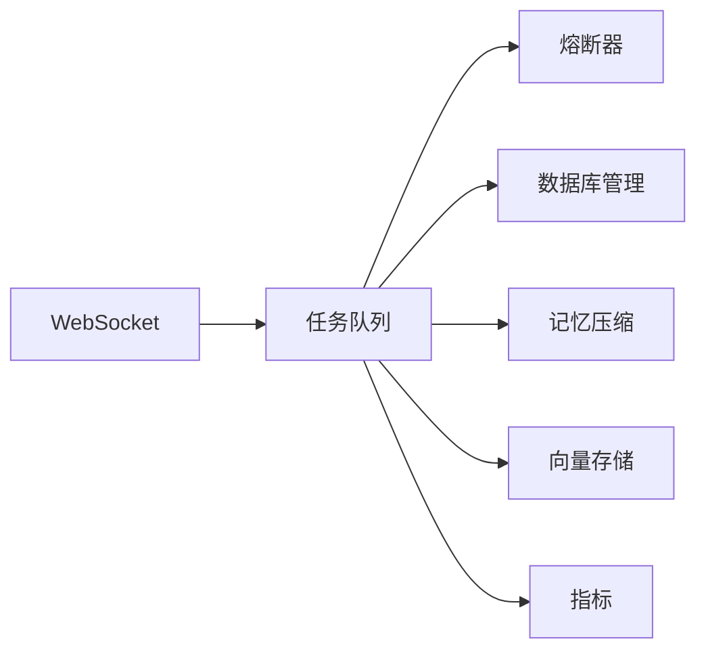

# 垂直扩展方案

<cite>
**本文引用的文件**   
- [backend_design/nexus/middleware/task_queue.py](file://backend_design/nexus/middleware/task_queue.py)
- [backend_design/nexus/memory/compressor.py](file://backend_design/nexus/memory/compressor.py)
- [backend_design/nexus/rag/vector_store.py](file://backend_design/nexus/rag/vector_store.py)
- [backend_design/nexus/core/circuit_breaker.py](file://backend_design/nexus/core/circuit_breaker.py)
- [backend_design/nexus/core/db_manager.py](file://backend_design/nexus/core/db_manager.py)
- [backend_design/nexus/config.py](file://backend_design/nexus/config.py)
- [backend_design/nexus/observability/metrics.py](file://backend_design/nexus/observability/metrics.py)
- [backend_design/nexus/observability/cockpit_metrics.py](file://backend_design/nexus/observability/cockpit_metrics.py)
- [backend_design/nexus/api/websocket.py](file://backend_design/nexus/api/websocket.py)
- [backend_design/nexus/main.py](file://backend_design/nexus/main.py)
</cite>

## 目录
1. [简介](#简介)
2. [项目结构](#项目结构)
3. [核心组件](#核心组件)
4. [架构总览](#架构总览)
5. [详细组件分析](#详细组件分析)
6. [依赖关系分析](#依赖关系分析)
7. [性能考虑](#性能考虑)
8. [故障排查指南](#故障排查指南)
9. [结论](#结论)
10. [附录](#附录)

## 简介
本方案面向NexusCockpit的“单节点垂直扩展”，聚焦在以下关键能力：异步任务队列与优先级、重试策略；内存管理与数据压缩（记忆压缩、向量降维、缓存优化）；熔断器与降级；数据库查询优化与连接池；CPU密集型任务的进程池与资源限制；性能瓶颈识别与优化技巧；内存泄漏检测与性能分析工具使用；以及单节点资源竞争与死锁问题的解决。

## 项目结构
与垂直扩展密切相关的后端模块主要位于 backend_design/nexus 下，包括中间件（任务队列、缓存）、内存管理（压缩）、RAG（向量存储）、核心（熔断器、数据库管理）、可观测性（指标）、API（WebSocket）等。

图表来源
- [backend_design/nexus/main.py](file://backend_design/nexus/main.py)
- [backend_design/nexus/api/websocket.py](file://backend_design/nexus/api/websocket.py)
- [backend_design/nexus/middleware/task_queue.py](file://backend_design/nexus/middleware/task_queue.py)
- [backend_design/nexus/core/circuit_breaker.py](file://backend_design/nexus/core/circuit_breaker.py)
- [backend_design/nexus/core/db_manager.py](file://backend_design/nexus/core/db_manager.py)
- [backend_design/nexus/memory/compressor.py](file://backend_design/nexus/memory/compressor.py)
- [backend_design/nexus/rag/vector_store.py](file://backend_design/nexus/rag/vector_store.py)
- [backend_design/nexus/observability/metrics.py](file://backend_design/nexus/observability/metrics.py)
- [backend_design/nexus/observability/cockpit_metrics.py](file://backend_design/nexus/observability/cockpit_metrics.py)

章节来源
- [backend_design/nexus/main.py](file://backend_design/nexus/main.py)
- [backend_design/nexus/api/websocket.py](file://backend_design/nexus/api/websocket.py)
- [backend_design/nexus/middleware/task_queue.py](file://backend_design/nexus/middleware/task_queue.py)
- [backend_design/nexus/core/circuit_breaker.py](file://backend_design/nexus/core/circuit_breaker.py)
- [backend_design/nexus/core/db_manager.py](file://backend_design/nexus/core/db_manager.py)
- [backend_design/nexus/memory/compressor.py](file://backend_design/nexus/memory/compressor.py)
- [backend_design/nexus/rag/vector_store.py](file://backend_design/nexus/rag/vector_store.py)
- [backend_design/nexus/observability/metrics.py](file://backend_design/nexus/observability/metrics.py)
- [backend_design/nexus/observability/cockpit_metrics.py](file://backend_design/nexus/observability/cockpit_metrics.py)

## 核心组件
- 任务队列与调度：提供异步任务入队、出队、优先级与重试机制，支撑高吞吐与弹性伸缩。
- 熔断器与降级：对下游依赖进行快速失败与隔离，避免雪崩。
- 数据库管理：封装连接池、事务与慢查询监控，配合索引与查询调优。
- 记忆压缩与向量降维：降低长上下文与向量库占用，提升检索效率。
- 可观测性：统一采集延迟、错误率、资源使用等指标，辅助定位瓶颈。

章节来源
- [backend_design/nexus/middleware/task_queue.py](file://backend_design/nexus/middleware/task_queue.py)
- [backend_design/nexus/core/circuit_breaker.py](file://backend_design/nexus/core/circuit_breaker.py)
- [backend_design/nexus/core/db_manager.py](file://backend_design/nexus/core/db_manager.py)
- [backend_design/nexus/memory/compressor.py](file://backend_design/nexus/memory/compressor.py)
- [backend_design/nexus/rag/vector_store.py](file://backend_design/nexus/rag/vector_store.py)
- [backend_design/nexus/observability/metrics.py](file://backend_design/nexus/observability/metrics.py)
- [backend_design/nexus/observability/cockpit_metrics.py](file://backend_design/nexus/observability/cockpit_metrics.py)

## 架构总览
下图展示请求从WebSocket进入，经任务队列分发，调用熔断器保护的服务，访问数据库与向量/记忆组件，并输出指标的端到端流程。

图表来源
- [backend_design/nexus/api/websocket.py](file://backend_design/nexus/api/websocket.py)
- [backend_design/nexus/middleware/task_queue.py](file://backend_design/nexus/middleware/task_queue.py)
- [backend_design/nexus/core/circuit_breaker.py](file://backend_design/nexus/core/circuit_breaker.py)
- [backend_design/nexus/core/db_manager.py](file://backend_design/nexus/core/db_manager.py)
- [backend_design/nexus/memory/compressor.py](file://backend_design/nexus/memory/compressor.py)
- [backend_design/nexus/rag/vector_store.py](file://backend_design/nexus/rag/vector_store.py)
- [backend_design/nexus/observability/metrics.py](file://backend_design/nexus/observability/metrics.py)

## 详细组件分析

### 异步任务队列：设计、优先级与重试
- 设计要点
  - 支持多优先级队列，确保关键任务优先执行。
  - 任务生命周期包含入队、调度、执行、成功/失败、重试、过期清理。
  - 与WebSocket集成，实现任务进度与结果的实时回推。
- 优先级策略
  - 基于数值或标签的优先级排序，结合公平调度避免饥饿。
- 重试策略
  - 指数退避+抖动，最大重试次数与超时控制。
  - 幂等键去重，避免重复处理。
- 背压与限流
  - 队列容量上限、消费者并发度限制，防止内存膨胀。

图表来源
- [backend_design/nexus/middleware/task_queue.py](file://backend_design/nexus/middleware/task_queue.py)
- [backend_design/nexus/api/websocket.py](file://backend_design/nexus/api/websocket.py)

章节来源
- [backend_design/nexus/middleware/task_queue.py](file://backend_design/nexus/middleware/task_queue.py)
- [backend_design/nexus/api/websocket.py](file://backend_design/nexus/api/websocket.py)

### 熔断器与降级：故障隔离与服务保护
- 熔断三态：关闭→打开→半开，依据错误率/延迟阈值切换。
- 降级策略：返回默认值、缓存兜底、只读路径、限流拒绝。
- 隔离：线程/进程级隔离，避免共享资源争用导致扩散。
- 指标驱动：基于滑动窗口统计错误率与P99延迟。

图表来源
- [backend_design/nexus/core/circuit_breaker.py](file://backend_design/nexus/core/circuit_breaker.py)

章节来源
- [backend_design/nexus/core/circuit_breaker.py](file://backend_design/nexus/core/circuit_breaker.py)

### 数据库查询优化：索引、调优与连接池
- 连接池配置
  - 最小/最大连接数、空闲回收、超时与重试。
  - 针对读写分离场景的独立池化。
- 索引策略
  - 高频过滤字段建索引，复合索引覆盖常见查询。
  - 定期分析慢查询日志，补齐缺失索引。
- 查询调优
  - 避免SELECT *，按需投影；分页游标替代偏移。
  - 批量写入/更新，减少往返。
- 监控
  - 暴露连接池使用率、等待时间、慢查询计数。

图表来源
- [backend_design/nexus/core/db_manager.py](file://backend_design/nexus/core/db_manager.py)
- [backend_design/nexus/config.py](file://backend_design/nexus/config.py)

章节来源
- [backend_design/nexus/core/db_manager.py](file://backend_design/nexus/core/db_manager.py)
- [backend_design/nexus/config.py](file://backend_design/nexus/config.py)

### 记忆压缩与向量降维：内存与存储优化
- 记忆压缩
  - 摘要/去重/合并相似片段，降低上下文长度与存储体积。
  - 分层存储：热数据内存、冷数据持久化。
- 向量降维
  - 对嵌入向量进行PCA/随机投影等降维，平衡相似度质量与检索速度。
  - 动态维度选择：根据业务精度需求调整。
- 缓存优化
  - 热点条目LRU/TTL，跨请求复用。
  - 多级缓存：本地内存+分布式缓存。

图表来源
- [backend_design/nexus/memory/compressor.py](file://backend_design/nexus/memory/compressor.py)
- [backend_design/nexus/rag/vector_store.py](file://backend_design/nexus/rag/vector_store.py)

章节来源
- [backend_design/nexus/memory/compressor.py](file://backend_design/nexus/memory/compressor.py)
- [backend_design/nexus/rag/vector_store.py](file://backend_design/nexus/rag/vector_store.py)

### CPU密集型任务：进程池与资源限制
- 进程池模型
  - 使用独立进程执行CPU密集任务，规避GIL限制。
  - 进程数量=CPU核数或略低，避免上下文切换开销。
- 资源限制
  - 设置CPU亲和、内存上限、I/O超时。
  - 任务粒度切分，避免长时独占。
- 监控与自愈
  - 监控进程存活、内存峰值、GC停顿。
  - 自动重启异常进程，保留诊断信息。

[本节为概念性说明，未直接映射具体源码文件]

### 可观测性与指标：定位瓶颈
- 指标体系
  - 任务队列：入队/出队速率、积压、重试率、P95/P99延迟。
  - 熔断器：状态切换次数、拒绝率。
  - 数据库：连接池使用率、慢查询数、事务耗时。
  - 系统：CPU/内存/IO/GC。
- 可视化
  - 通过统一指标导出至监控系统，构建仪表盘与告警规则。

图表来源
- [backend_design/nexus/observability/metrics.py](file://backend_design/nexus/observability/metrics.py)
- [backend_design/nexus/observability/cockpit_metrics.py](file://backend_design/nexus/observability/cockpit_metrics.py)

章节来源
- [backend_design/nexus/observability/metrics.py](file://backend_design/nexus/observability/metrics.py)
- [backend_design/nexus/observability/cockpit_metrics.py](file://backend_design/nexus/observability/cockpit_metrics.py)

## 依赖关系分析
- 耦合关系
  - WebSocket依赖任务队列进行异步处理。
  - 任务队列依赖熔断器保护下游，依赖数据库与向量/记忆组件。
  - 所有组件向可观测性模块上报指标。
- 外部依赖
  - 数据库连接池、向量存储、缓存（如Redis）。
- 潜在环依赖
  - 通过接口解耦与事件总线避免循环导入。

图表来源
- [backend_design/nexus/api/websocket.py](file://backend_design/nexus/api/websocket.py)
- [backend_design/nexus/middleware/task_queue.py](file://backend_design/nexus/middleware/task_queue.py)
- [backend_design/nexus/core/circuit_breaker.py](file://backend_design/nexus/core/circuit_breaker.py)
- [backend_design/nexus/core/db_manager.py](file://backend_design/nexus/core/db_manager.py)
- [backend_design/nexus/memory/compressor.py](file://backend_design/nexus/memory/compressor.py)
- [backend_design/nexus/rag/vector_store.py](file://backend_design/nexus/rag/vector_store.py)
- [backend_design/nexus/observability/metrics.py](file://backend_design/nexus/observability/metrics.py)

章节来源
- [backend_design/nexus/api/websocket.py](file://backend_design/nexus/api/websocket.py)
- [backend_design/nexus/middleware/task_queue.py](file://backend_design/nexus/middleware/task_queue.py)
- [backend_design/nexus/core/circuit_breaker.py](file://backend_design/nexus/core/circuit_breaker.py)
- [backend_design/nexus/core/db_manager.py](file://backend_design/nexus/core/db_manager.py)
- [backend_design/nexus/memory/compressor.py](file://backend_design/nexus/memory/compressor.py)
- [backend_design/nexus/rag/vector_store.py](file://backend_design/nexus/rag/vector_store.py)
- [backend_design/nexus/observability/metrics.py](file://backend_design/nexus/observability/metrics.py)

## 性能考虑
- 任务队列
  - 合理设置消费者并发与队列深度，避免OOM。
  - 采用批处理与零拷贝传输，减少序列化开销。
- 熔断器
  - 阈值需结合业务SLA与历史基线动态调整。
- 数据库
  - 连接池大小与负载匹配，避免过多连接导致上下文切换。
  - 利用覆盖索引与预编译语句，减少解析与网络往返。
- 记忆与向量
  - 压缩比与召回率权衡，定期评估效果。
  - 向量降维后做离线回归测试，保证精度损失可控。
- 可观测性
  - 采样策略与指标粒度平衡，避免监控自身成为瓶颈。

[本节为通用指导，不直接引用具体源码文件]

## 故障排查指南
- 常见问题
  - 任务堆积：检查消费者健康、重试风暴、下游慢查询。
  - 熔断频繁打开：定位错误源，查看延迟分布与错误率。
  - 数据库连接耗尽：确认连接池上限与泄漏，排查长事务。
  - 内存增长：关注大对象、缓存未清理、向量/记忆未压缩。
- 定位方法
  - 使用指标与日志关联追踪，定位慢路径。
  - 开启堆快照与火焰图，分析CPU热点与内存占用。
  - 对关键路径添加埋点，细化到函数级耗时。
- 恢复策略
  - 临时扩容消费者、提高熔断阈值、降级非关键路径。
  - 清理冷数据与过期缓存，重建索引或调整查询计划。

章节来源
- [backend_design/nexus/observability/metrics.py](file://backend_design/nexus/observability/metrics.py)
- [backend_design/nexus/observability/cockpit_metrics.py](file://backend_design/nexus/observability/cockpit_metrics.py)
- [backend_design/nexus/core/circuit_breaker.py](file://backend_design/nexus/core/circuit_breaker.py)
- [backend_design/nexus/core/db_manager.py](file://backend_design/nexus/core/db_manager.py)

## 结论
通过引入优先级任务队列、熔断器与降级、数据库连接池与索引优化、记忆压缩与向量降维、以及完善的可观测性体系，NexusCockpit可在单节点内实现更高的吞吐与稳定性。配合进程池与资源限制，可有效应对CPU密集型任务。持续的性能分析与容量规划将保障系统在压力下的稳健运行。

## 附录
- 术语
  - 熔断器：基于错误率/延迟的开关模式，用于快速失败与隔离。
  - 指数退避：重试间隔随次数呈指数增长，并加入随机抖动。
  - 覆盖索引：查询所需列均在索引中，无需回表。
- 参考实践
  - 指标采集建议：以秒级粒度聚合，保留最近24小时明细。
  - 压测方法：逐步增加并发，观察P99延迟与错误率拐点。

[本节为补充说明，不直接引用具体源码文件]