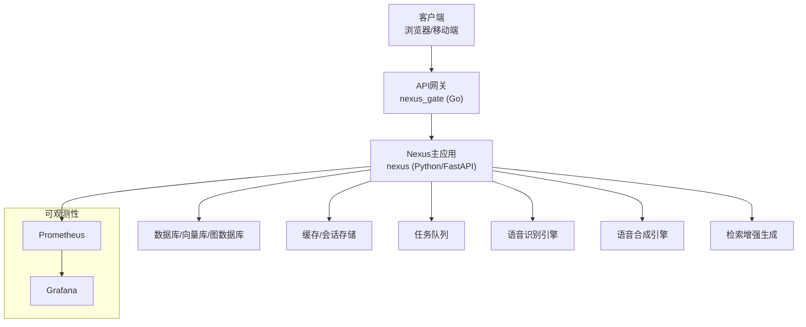
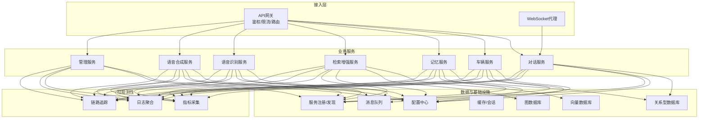
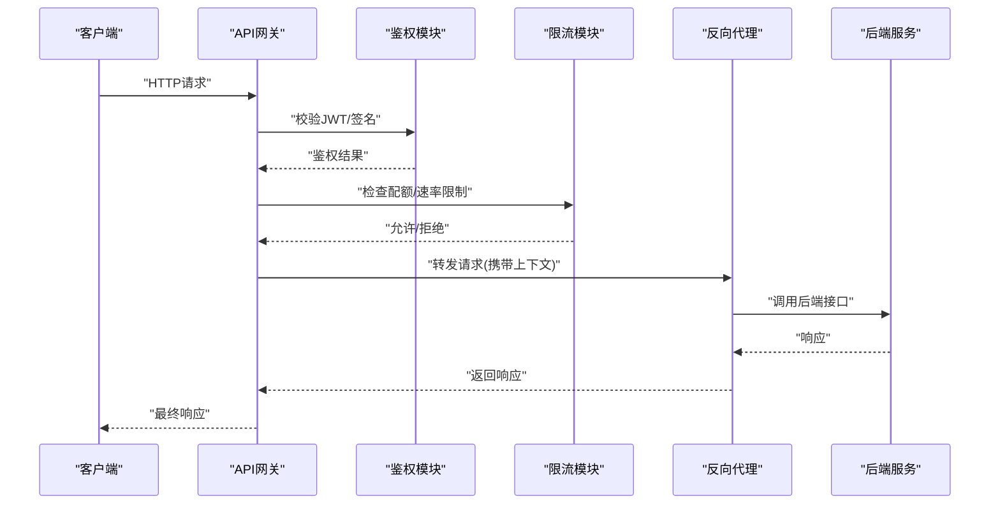
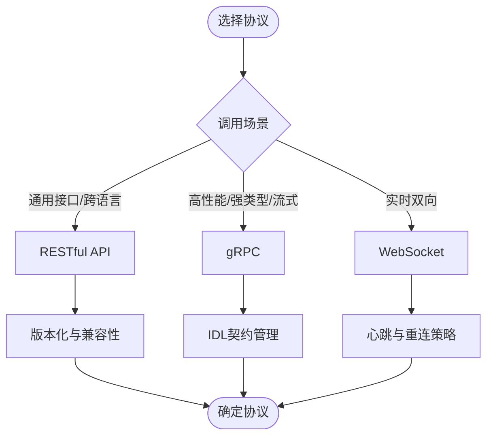
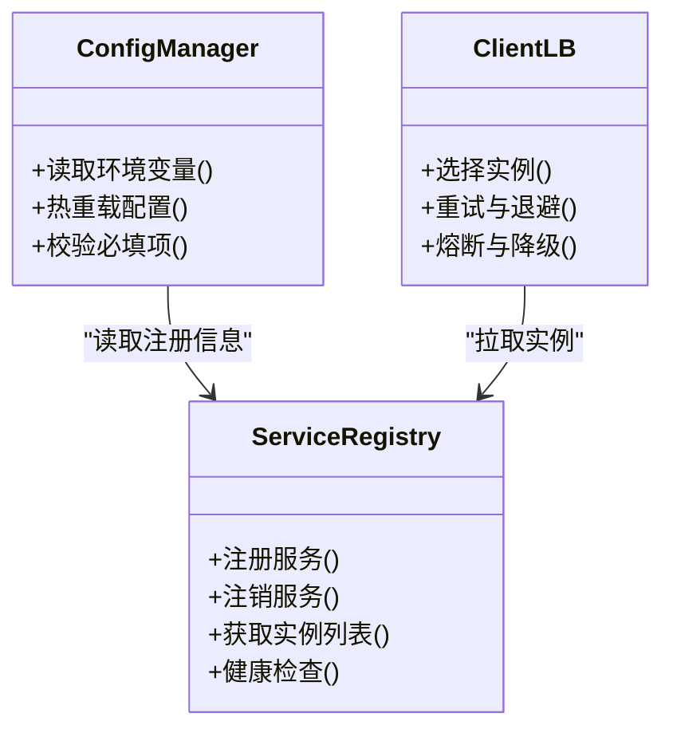
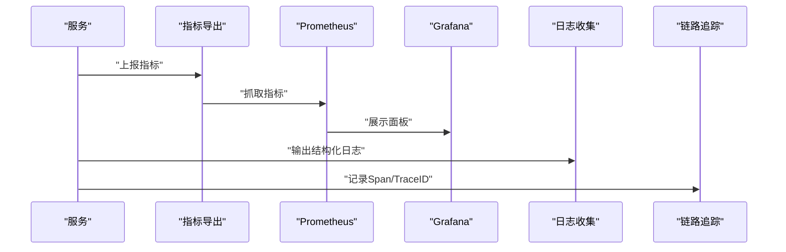
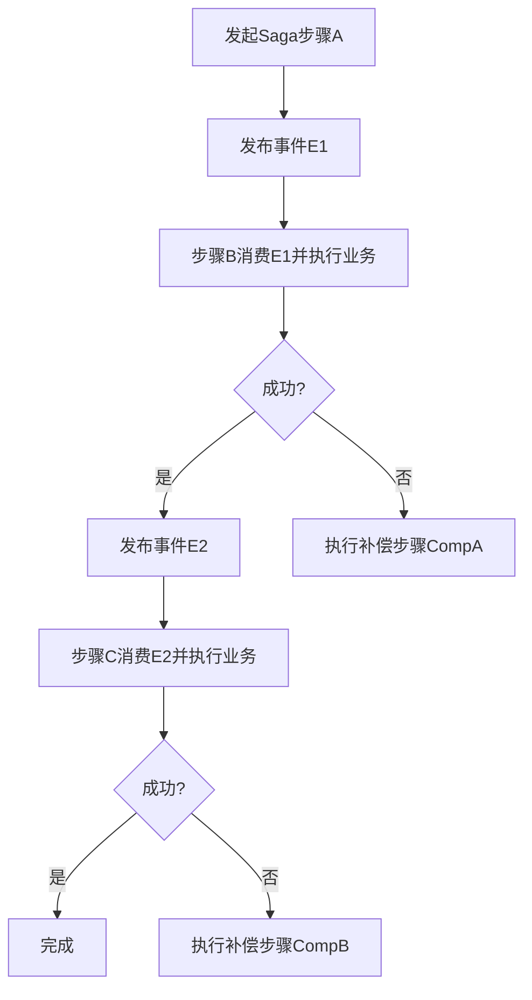
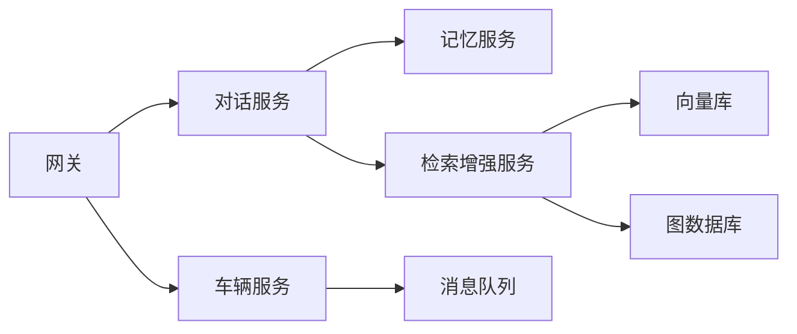

# 微服务拆分原则

<cite>
**本文引用的文件**   
- [backend_design/nexus/main.py](file://backend_design/nexus/main.py)
- [backend_design/nexus/config.py](file://backend_design/nexus/config.py)
- [backend_design/nexus/core/auth.py](file://backend_design/nexus/core/auth.py)
- [backend_design/nexus/core/exceptions.py](file://backend_design/nexus/core/exceptions.py)
- [backend_design/nexus/core/logger.py](file://backend_design/nexus/core/logger.py)
- [backend_design/nexus/core/circuit_breaker.py](file://backend_design/nexus/core/circuit_breaker.py)
- [backend_design/nexus/api/routes/chat.py](file://backend_design/nexus/api/routes/chat.py)
- [backend_design/nexus/api/routes/auth.py](file://backend_design/nexus/api/routes/auth.py)
- [backend_design/nexus/api/websocket.py](file://backend_design/nexus/api/websocket.py)
- [backend_design/nexus/middleware/rate_limiter.py](file://backend_design/nexus/middleware/rate_limiter.py)
- [backend_design/nexus/observability/metrics.py](file://backend_design/nexus/observability/metrics.py)
- [backend_design/nexus_gate/cmd/main.go](file://backend_design/nexus_gate/cmd/main.go)
- [backend_design/nexus_gate/internal/router/router.go](file://backend_design/nexus_gate/internal/router/router.go)
- [backend_design/nexus_gate/internal/proxy/proxy.go](file://backend_design/nexus_gate/internal/proxy/proxy.go)
- [backend_design/nexus_gate/internal/auth/jwt.go](file://backend_design/nexus_gate/internal/auth/jwt.go)
- [backend_design/nexus_gate/internal/ratelimit/ratelimit.go](file://backend_design/nexus_gate/internal/ratelimit/ratelimit.go)
- [backend_design/nexus_gate/internal/ws/hub.go](file://backend_design/nexus_gate/internal/ws/hub.go)
- [docker-compose.yml](file://docker-compose.yml)
- [config/prometheus/prometheus.yml](file://config/prometheus/prometheus.yml)
- [config/grafana/provisioning/dashboards/dashboards.yml](file://config/grafana/provisioning/dashboards/dashboards.yml)
- [config/grafana/provisioning/dashboards/nexuscockpit-overview.json](file://config/grafana/provisioning/dashboards/nexuscockpit-overview.json)
</cite>

## 目录
1. [引言](#引言)
2. [项目结构](#项目结构)
3. [核心组件](#核心组件)
4. [架构总览](#架构总览)
5. [详细组件分析](#详细组件分析)
6. [依赖分析](#依赖分析)
7. [性能考虑](#性能考虑)
8. [故障排查指南](#故障排查指南)
9. [结论](#结论)
10. [附录](#附录)

## 引言
本文件面向NexusCockpit的微服务拆分与治理，给出可落地的拆分原则与实践建议。内容覆盖：
- 服务边界划分标准（业务领域、数据所有权、技术栈）
- 服务粒度设计原则（避免过度拆分与服务碎片化）
- API网关设计（路由策略、认证授权、限流控制）
- 服务间通信协议选择（RESTful、gRPC、WebSocket）
- 配置中心与服务发现（环境变量管理、动态配置更新）
- 监控与链路追踪（指标、日志聚合、错误追踪）
- 部署拓扑与依赖关系图
- 分布式事务、数据一致性与服务治理方案

## 项目结构
当前仓库采用“单体应用 + 独立网关”的混合形态：
- 后端主应用（Python/FastAPI）：承载对话、车辆技能、记忆、RAG、ASR/TTS等能力
- 网关子项目（Go）：提供统一入口、鉴权、限流、反向代理与WebSocket转发
- 前端（Next.js）：通过网关访问后端
- 可观测性：Prometheus/Grafana集成，应用内埋点
- 编排：docker-compose定义多容器拓扑

**图表来源**
- [backend_design/nexus/main.py:1-200](file://backend_design/nexus/main.py#L1-L200)
- [backend_design/nexus_gate/cmd/main.go:1-200](file://backend_design/nexus_gate/cmd/main.go#L1-L200)
- [config/prometheus/prometheus.yml:1-200](file://config/prometheus/prometheus.yml#L1-L200)
- [config/grafana/provisioning/dashboards/dashboards.yml:1-200](file://config/grafana/provisioning/dashboards/dashboards.yml#L1-L200)

**章节来源**
- [backend_design/nexus/main.py:1-200](file://backend_design/nexus/main.py#L1-L200)
- [backend_design/nexus_gate/cmd/main.go:1-200](file://backend_design/nexus_gate/cmd/main.go#L1-L200)
- [docker-compose.yml:1-200](file://docker-compose.yml#L1-L200)

## 核心组件
- API网关（Go）
  - 职责：统一入口、路由分发、JWT鉴权、令牌桶限流、WebSocket代理
  - 关键模块：路由、鉴权、限流、代理、WS Hub
- 主应用（Python/FastAPI）
  - 职责：业务路由、领域逻辑、中间件（限流、缓存、会话）、可观测性埋点
  - 关键模块：API路由、核心能力（鉴权、异常、日志、熔断器）、中间件、可观测性
- 可观测性
  - Prometheus抓取应用指标，Grafana展示仪表盘
- 外部依赖
  - 数据库/向量库/图数据库、缓存、任务队列、ASR/TTS/RAG等

**章节来源**
- [backend_design/nexus_gate/internal/router/router.go:1-200](file://backend_design/nexus_gate/internal/router/router.go#L1-L200)
- [backend_design/nexus_gate/internal/auth/jwt.go:1-200](file://backend_design/nexus_gate/internal/auth/jwt.go#L1-L200)
- [backend_design/nexus_gate/internal/ratelimit/ratelimit.go:1-200](file://backend_design/nexus_gate/internal/ratelimit/ratelimit.go#L1-L200)
- [backend_design/nexus_gate/internal/proxy/proxy.go:1-200](file://backend_design/nexus_gate/internal/proxy/proxy.go#L1-L200)
- [backend_design/nexus_gate/internal/ws/hub.go:1-200](file://backend_design/nexus_gate/internal/ws/hub.go#L1-L200)
- [backend_design/nexus/api/routes/chat.py:1-200](file://backend_design/nexus/api/routes/chat.py#L1-L200)
- [backend_design/nexus/api/routes/auth.py:1-200](file://backend_design/nexus/api/routes/auth.py#L1-L200)
- [backend_design/nexus/api/websocket.py:1-200](file://backend_design/nexus/api/websocket.py#L1-L200)
- [backend_design/nexus/middleware/rate_limiter.py:1-200](file://backend_design/nexus/middleware/rate_limiter.py#L1-L200)
- [backend_design/nexus/observability/metrics.py:1-200](file://backend_design/nexus/observability/metrics.py#L1-L200)

## 架构总览
从“单体+网关”向“微服务”演进时，应遵循以下总体原则：
- 以业务域为边界，按数据所有权切分服务
- 网关作为唯一对外入口，内部服务通过轻量协议通信
- 可观测性与配置治理前置到每个服务
- 渐进式拆分，先解耦高内聚模块，再拆分为独立进程

[此图为概念性架构图，不直接映射具体源码文件]

## 详细组件分析

### 服务边界划分原则
- 业务领域分离
  - 对话服务：会话管理、意图识别、提示词编排、结果渲染
  - 车辆服务：车辆状态、远程控制、事件订阅
  - 记忆服务：用户画像、短期/长期记忆、冲突合并
  - 检索增强服务：文档索引、向量检索、图谱查询、重排
  - 语音服务：ASR/TTS，负责音频编解码与模型推理
  - 管理服务：系统设置、租户管理、权限与审计
- 数据所有权
  - 每个服务独占其核心数据表/集合；跨域读通过只读副本或事件同步
  - 写路径严格归属单一服务，避免共享写
- 技术栈选择
  - 语言/框架以服务特性决定：Python适合AI/数据处理，Go适合高并发网关/边车，Node/TS适合前端与轻服务
  - 数据库选型匹配数据模型：关系型用于事务型数据，向量/图用于知识检索

**章节来源**
- [backend_design/nexus/api/routes/chat.py:1-200](file://backend_design/nexus/api/routes/chat.py#L1-L200)
- [backend_design/nexus/api/routes/auth.py:1-200](file://backend_design/nexus/api/routes/auth.py#L1-L200)
- [backend_design/nexus/api/websocket.py:1-200](file://backend_design/nexus/api/websocket.py#L1-L200)
- [backend_design/nexus/models/cockpit.py:1-200](file://backend_design/nexus/models/cockpit.py#L1-L200)
- [backend_design/nexus/models/state.py:1-200](file://backend_design/nexus/models/state.py#L1-L200)

### 服务粒度设计原则
- 高内聚低耦合：围绕一个业务能力组织代码与数据
- 变更频率与团队规模匹配：高频变更的服务独立部署
- 避免过度拆分：优先将紧密协作的模块放在同一服务，减少跨服务调用
- 明确退化策略：对非关键依赖具备降级与超时熔断

**章节来源**
- [backend_design/nexus/core/circuit_breaker.py:1-200](file://backend_design/nexus/core/circuit_breaker.py#L1-L200)
- [backend_design/nexus/middleware/rate_limiter.py:1-200](file://backend_design/nexus/middleware/rate_limiter.py#L1-L200)

### API网关设计
- 路由策略
  - 基于路径前缀与HTTP方法分发至对应服务
  - 静态资源与动态API分离
- 认证授权
  - 统一校验JWT，注入用户上下文至下游服务
- 限流控制
  - 令牌桶/滑动窗口实现全局与租户级限流
- WebSocket支持
  - 连接建立、心跳、消息广播与转发

**图表来源**
- [backend_design/nexus_gate/internal/router/router.go:1-200](file://backend_design/nexus_gate/internal/router/router.go#L1-L200)
- [backend_design/nexus_gate/internal/auth/jwt.go:1-200](file://backend_design/nexus_gate/internal/auth/jwt.go#L1-L200)
- [backend_design/nexus_gate/internal/ratelimit/ratelimit.go:1-200](file://backend_design/nexus_gate/internal/ratelimit/ratelimit.go#L1-L200)
- [backend_design/nexus_gate/internal/proxy/proxy.go:1-200](file://backend_design/nexus_gate/internal/proxy/proxy.go#L1-L200)

**章节来源**
- [backend_design/nexus_gate/cmd/main.go:1-200](file://backend_design/nexus_gate/cmd/main.go#L1-L200)
- [backend_design/nexus_gate/internal/router/router.go:1-200](file://backend_design/nexus_gate/internal/router/router.go#L1-L200)
- [backend_design/nexus_gate/internal/auth/jwt.go:1-200](file://backend_design/nexus_gate/internal/auth/jwt.go#L1-L200)
- [backend_design/nexus_gate/internal/ratelimit/ratelimit.go:1-200](file://backend_design/nexus_gate/internal/ratelimit/ratelimit.go#L1-L200)
- [backend_design/nexus_gate/internal/proxy/proxy.go:1-200](file://backend_design/nexus_gate/internal/proxy/proxy.go#L1-L200)
- [backend_design/nexus_gate/internal/ws/hub.go:1-200](file://backend_design/nexus_gate/internal/ws/hub.go#L1-L200)

### 服务间通信协议选择
- RESTful API
  - 适用：通用CRUD、跨语言、易调试
  - 要求：幂等设计、版本化、错误码规范
- gRPC
  - 适用：高性能内部调用、强类型契约、流式传输
  - 要求：IDL管理、负载均衡、重试与超时
- WebSocket
  - 适用：实时推送、长连接交互（如聊天、车辆遥测）
  - 要求：心跳保活、断线重连、消息去抖与顺序保证

[此图为概念性流程图，不直接映射具体源码文件]

### 配置中心与服务发现
- 环境变量管理
  - 所有敏感与运行期参数通过环境变量注入，禁止硬编码
- 动态配置更新
  - 支持热加载配置项（如开关、阈值），重启最小化
- 服务发现
  - 使用注册中心维护实例地址与健康状态
  - 客户端侧负载均衡与失败重试

[此图为概念类图，不直接映射具体源码文件]

**章节来源**
- [backend_design/nexus/config.py:1-200](file://backend_design/nexus/config.py#L1-L200)
- [backend_design/nexus/main.py:1-200](file://backend_design/nexus/main.py#L1-L200)

### 监控、链路追踪与日志
- 指标采集
  - 暴露Prometheus端点，采集QPS、延迟、错误率、资源使用
- 日志聚合
  - 结构化JSON日志，统一收集与检索
- 链路追踪
  - 跨服务传播TraceID，定位慢调用与异常

**图表来源**
- [backend_design/nexus/observability/metrics.py:1-200](file://backend_design/nexus/observability/metrics.py#L1-L200)
- [config/prometheus/prometheus.yml:1-200](file://config/prometheus/prometheus.yml#L1-L200)
- [config/grafana/provisioning/dashboards/dashboards.yml:1-200](file://config/grafana/provisioning/dashboards/dashboards.yml#L1-L200)
- [config/grafana/provisioning/dashboards/nexuscockpit-overview.json:1-200](file://config/grafana/provisioning/dashboards/nexuscockpit-overview.json#L1-L200)

**章节来源**
- [backend_design/nexus/observability/metrics.py:1-200](file://backend_design/nexus/observability/metrics.py#L1-L200)
- [config/prometheus/prometheus.yml:1-200](file://config/prometheus/prometheus.yml#L1-L200)
- [config/grafana/provisioning/dashboards/dashboards.yml:1-200](file://config/grafana/provisioning/dashboards/dashboards.yml#L1-L200)
- [config/grafana/provisioning/dashboards/nexuscockpit-overview.json:1-200](file://config/grafana/provisioning/dashboards/nexuscockpit-overview.json#L1-L200)

### 分布式事务与数据一致性
- 最终一致性优先
  - 通过事件驱动与补偿机制达成最终一致
- Saga模式
  - 将长事务拆分为本地事务+事件，失败执行补偿步骤
- 幂等与去重
  - 所有跨服务操作需幂等，结合唯一键/消息ID去重
- 读写分离与快照
  - 读多写少场景采用只读副本，降低热点压力

[此图为概念性流程图，不直接映射具体源码文件]

### 服务治理
- 熔断与降级
  - 快速失败与回退策略，保护上游
- 限流与背压
  - 网关层与服务层双重限流，防止雪崩
- 健康检查与自愈
  - 主动探测与自动重启/替换
- 灰度与蓝绿发布
  - 基于权重或标签的流量切换

**章节来源**
- [backend_design/nexus/core/circuit_breaker.py:1-200](file://backend_design/nexus/core/circuit_breaker.py#L1-L200)
- [backend_design/nexus/middleware/rate_limiter.py:1-200](file://backend_design/nexus/middleware/rate_limiter.py#L1-L200)

## 依赖分析
- 组件耦合
  - 网关与后端服务松耦合，通过HTTP/gRPC/WS通信
  - 业务服务之间通过事件总线或API间接耦合
- 外部依赖
  - 数据库、缓存、消息队列、向量/图数据库、ASR/TTS/RAG
- 潜在循环依赖
  - 避免服务间互相直调，必要时引入事件或API编排

**图表来源**
- [backend_design/nexus/api/routes/chat.py:1-200](file://backend_design/nexus/api/routes/chat.py#L1-L200)
- [backend_design/nexus/api/routes/auth.py:1-200](file://backend_design/nexus/api/routes/auth.py#L1-L200)
- [backend_design/nexus/api/websocket.py:1-200](file://backend_design/nexus/api/websocket.py#L1-L200)

**章节来源**
- [backend_design/nexus/main.py:1-200](file://backend_design/nexus/main.py#L1-L200)
- [backend_design/nexus_gate/cmd/main.go:1-200](file://backend_design/nexus_gate/cmd/main.go#L1-L200)

## 性能考虑
- 连接复用与池化：数据库、HTTP/gRPC连接池
- 缓存策略：热点数据多级缓存（本地+分布式）
- 异步化：耗时任务入队处理，提升吞吐
- 批处理与压缩：批量写入、响应压缩
- 容量规划：CPU/内存/IO瓶颈分析与扩容策略

[本节为通用指导，无需源码引用]

## 故障排查指南
- 常见问题
  - 鉴权失败：检查JWT签发/校验、时钟同步、密钥轮换
  - 限流触发：查看令牌桶计数与阈值，调整配额
  - 熔断打开：定位下游异常与超时，恢复后观察半开状态
  - 日志缺失：确认日志级别与输出格式，检查收集器连通性
  - 指标丢失：核对Prometheus抓取目标与端口
- 诊断工具
  - 网关访问日志、服务错误堆栈、链路TraceID关联
  - Grafana面板告警与PromQL查询

**章节来源**
- [backend_design/nexus/core/auth.py:1-200](file://backend_design/nexus/core/auth.py#L1-L200)
- [backend_design/nexus/core/exceptions.py:1-200](file://backend_design/nexus/core/exceptions.py#L1-L200)
- [backend_design/nexus/core/logger.py:1-200](file://backend_design/nexus/core/logger.py#L1-L200)
- [backend_design/nexus/core/circuit_breaker.py:1-200](file://backend_design/nexus/core/circuit_breaker.py#L1-L200)
- [backend_design/nexus/middleware/rate_limiter.py:1-200](file://backend_design/nexus/middleware/rate_limiter.py#L1-L200)
- [backend_design/nexus/observability/metrics.py:1-200](file://backend_design/nexus/observability/metrics.py#L1-L200)

## 结论
- 以业务域和数据所有权为核心进行服务拆分，保持高内聚低耦合
- 网关统一治理，内部服务采用合适协议高效通信
- 配置与发现集中化，可观测性贯穿全链路
- 通过事件与补偿实现最终一致性，配合熔断限流保障稳定性
- 渐进式演进，先解耦再拆分，持续优化服务粒度与部署拓扑

[本节为总结性内容，无需源码引用]

## 附录
- 部署拓扑与依赖关系（参考“架构总览”图）
- 配置与环境变量清单（参见配置模块）
- 监控面板与告警规则（参见Grafana/Prometheus配置）

**章节来源**
- [docker-compose.yml:1-200](file://docker-compose.yml#L1-L200)
- [backend_design/nexus/config.py:1-200](file://backend_design/nexus/config.py#L1-L200)
- [config/prometheus/prometheus.yml:1-200](file://config/prometheus/prometheus.yml#L1-L200)
- [config/grafana/provisioning/dashboards/dashboards.yml:1-200](file://config/grafana/provisioning/dashboards/dashboards.yml#L1-L200)
- [config/grafana/provisioning/dashboards/nexuscockpit-overview.json:1-200](file://config/grafana/provisioning/dashboards/nexuscockpit-overview.json#L1-L200)