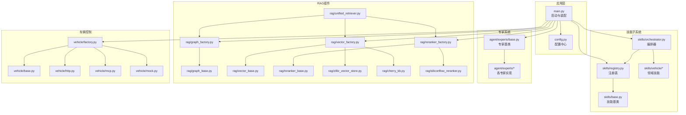
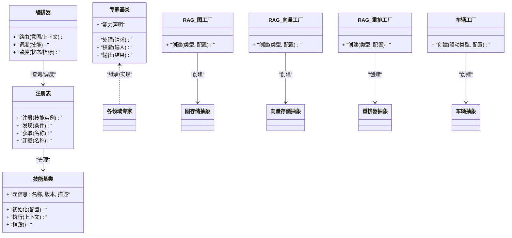
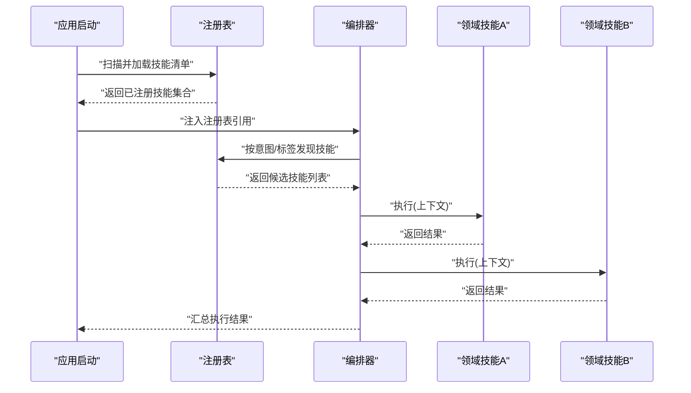
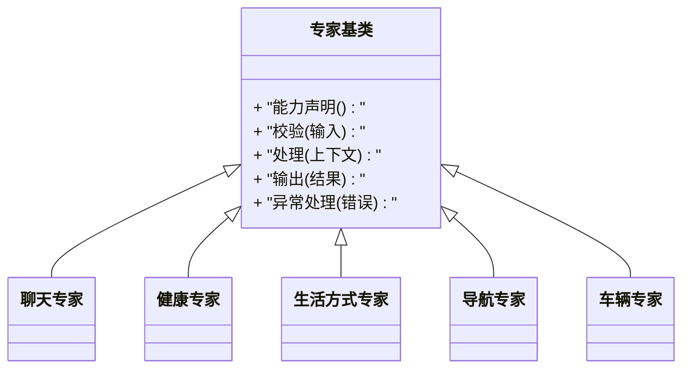
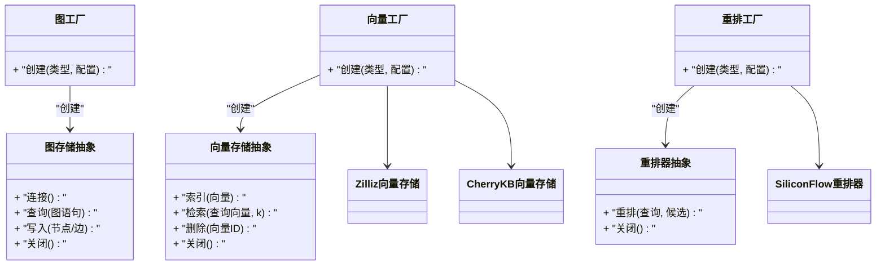
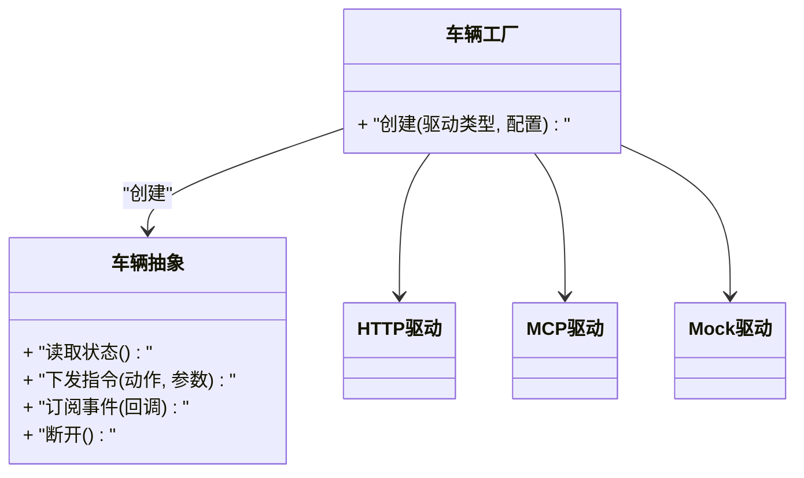
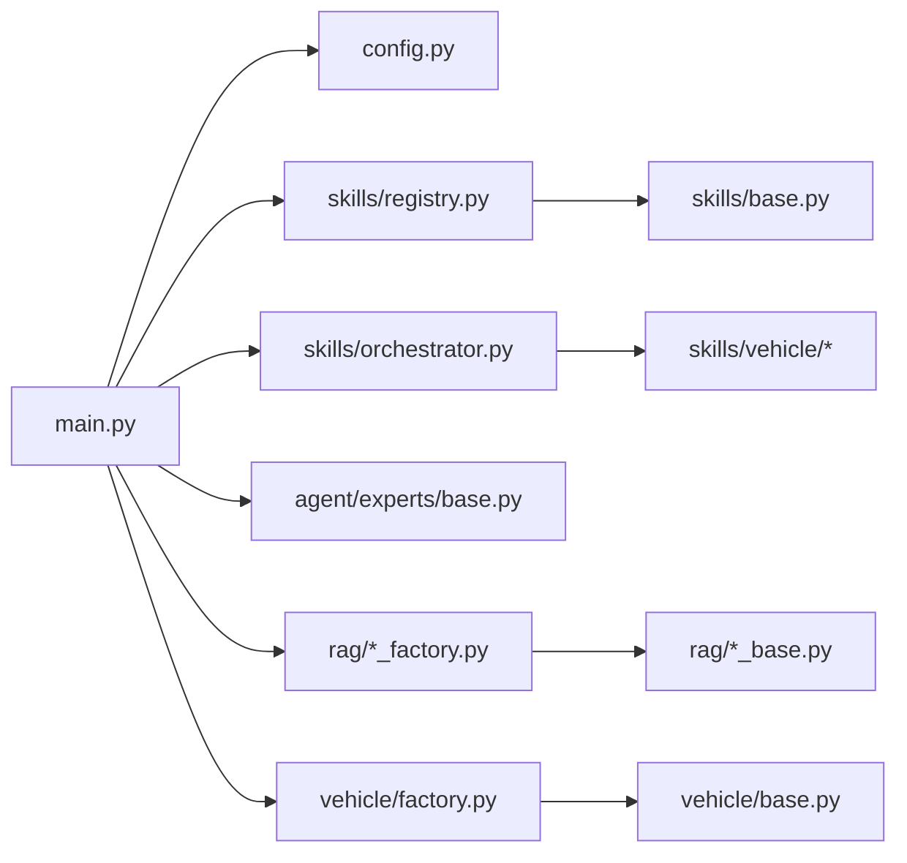

# 插件化架构设计

<cite>
**本文引用的文件**   
- [backend_design/nexus/skills/registry.py](file://backend_design/nexus/skills/registry.py)
- [backend_design/nexus/skills/base.py](file://backend_design/nexus/skills/base.py)
- [backend_design/nexus/skills/orchestrator.py](file://backend_design/nexus/skills/orchestrator.py)
- [backend_design/nexus/skills/__init__.py](file://backend_design/nexus/skills/__init__.py)
- [backend_design/nexus/skills/vehicle/climate.py](file://backend_design/nexus/skills/vehicle/climate.py)
- [backend_design/nexus/skills/vehicle/navigation.py](file://backend_design/nexus/skills/vehicle/navigation.py)
- [backend_design/nexus/skills/vehicle/media.py](file://backend_design/nexus/skills/vehicle/media.py)
- [backend_design/nexus/skills/vehicle/seat.py](file://backend_design/nexus/skills/vehicle/seat.py)
- [backend_design/nexus/skills/vehicle/window.py](file://backend_design/nexus/skills/vehicle/window.py)
- [backend_design/nexus/skills/vehicle/status.py](file://backend_design/nexus/skills/vehicle/status.py)
- [backend_design/nexus/agent/experts/base.py](file://backend_design/nexus/agent/experts/base.py)
- [backend_design/nexus/agent/experts/chat_expert.py](file://backend_design/nexus/agent/experts/chat_expert.py)
- [backend_design/nexus/agent/experts/health_expert.py](file://backend_design/nexus/agent/experts/health_expert.py)
- [backend_design/nexus/agent/experts/lifestyle_expert.py](file://backend_design/nexus/agent/experts/lifestyle_expert.py)
- [backend_design/nexus/agent/experts/nav_expert.py](file://backend_design/nexus/agent/experts/nav_expert.py)
- [backend_design/nexus/agent/experts/vehicle_expert.py](file://backend_design/nexus/agent/experts/vehicle_expert.py)
- [backend_design/nexus/rag/graph_factory.py](file://backend_design/nexus/rag/graph_factory.py)
- [backend_design/nexus/rag/vector_factory.py](file://backend_design/nexus/rag/vector_factory.py)
- [backend_design/nexus/rag/reranker_factory.py](file://backend_design/nexus/rag/reranker_factory.py)
- [backend_design/nexus/rag/graph_base.py](file://backend_design/nexus/rag/graph_base.py)
- [backend_design/nexus/rag/vector_base.py](file://backend_design/nexus/rag/vector_base.py)
- [backend_design/nexus/rag/reranker_base.py](file://backend_design/nexus/rag/reranker_base.py)
- [backend_design/nexus/rag/zilliz_vector_store.py](file://backend_design/nexus/rag/zilliz_vector_store.py)
- [backend_design/nexus/rag/cherry_kb.py](file://backend_design/nexus/rag/cherry_kb.py)
- [backend_design/nexus/rag/siliconflow_reranker.py](file://backend_design/nexus/rag/siliconflow_reranker.py)
- [backend_design/nexus/rag/unified_retriever.py](file://backend_design/nexus/rag/unified_retriever.py)
- [backend_design/nexus/vehicle/factory.py](file://backend_design/nexus/vehicle/factory.py)
- [backend_design/nexus/vehicle/base.py](file://backend_design/nexus/vehicle/base.py)
- [backend_design/nexus/vehicle/http.py](file://backend_design/nexus/vehicle/http.py)
- [backend_design/nexus/vehicle/mcp.py](file://backend_design/nexus/vehicle/mcp.py)
- [backend_design/nexus/vehicle/mock.py](file://backend_design/nexus/vehicle/mock.py)
- [backend_design/nexus/config.py](file://backend_design/nexus/config.py)
- [backend_design/nexus/main.py](file://backend_design/nexus/main.py)
</cite>

## 目录
1. [引言](#引言)
2. [项目结构](#项目结构)
3. [核心组件](#核心组件)
4. [架构总览](#架构总览)
5. [详细组件分析](#详细组件分析)
6. [依赖关系分析](#依赖关系分析)
7. [性能考量](#性能考量)
8. [故障排查指南](#故障排查指南)
9. [结论](#结论)
10. [附录](#附录)

## 引言
本设计文档面向NexusCockpit的插件化架构，聚焦以下目标：
- 技能注册表机制：技能发现、加载与生命周期管理
- 专家系统扩展点：基类抽象、接口规范与实现约定
- 工厂模式在RAG组件与车辆控制中的应用：动态实例化与依赖注入策略
- 插件配置管理、版本兼容性与热重载机制
- 自定义技能与专家开发指南（含最佳实践）
- 插件间通信协议与数据交换格式
- 插件冲突检测与资源隔离方案

## 项目结构
NexusCockpit后端采用分层与模块化组织方式，关键目录与职责如下：
- skills：技能子系统，包含基类、注册表、编排器及领域技能（如车辆相关）
- agent/experts：专家系统，定义专家基类与各领域专家实现
- rag：检索增强生成组件，提供图存储、向量存储、重排器的工厂与基础抽象
- vehicle：车辆控制抽象与多通道实现（HTTP/MCP/Mock），并提供统一工厂
- config/main：全局配置与启动入口，负责装配与初始化

图表来源
- [backend_design/nexus/main.py](file://backend_design/nexus/main.py)
- [backend_design/nexus/config.py](file://backend_design/nexus/config.py)
- [backend_design/nexus/skills/registry.py](file://backend_design/nexus/skills/registry.py)
- [backend_design/nexus/skills/orchestrator.py](file://backend_design/nexus/skills/orchestrator.py)
- [backend_design/nexus/skills/base.py](file://backend_design/nexus/skills/base.py)
- [backend_design/nexus/agent/experts/base.py](file://backend_design/nexus/agent/experts/base.py)
- [backend_design/nexus/rag/graph_factory.py](file://backend_design/nexus/rag/graph_factory.py)
- [backend_design/nexus/rag/vector_factory.py](file://backend_design/nexus/rag/vector_factory.py)
- [backend_design/nexus/rag/reranker_factory.py](file://backend_design/nexus/rag/reranker_factory.py)
- [backend_design/nexus/rag/graph_base.py](file://backend_design/nexus/rag/graph_base.py)
- [backend_design/nexus/rag/vector_base.py](file://backend_design/nexus/rag/vector_base.py)
- [backend_design/nexus/rag/reranker_base.py](file://backend_design/nexus/rag/reranker_base.py)
- [backend_design/nexus/rag/zilliz_vector_store.py](file://backend_design/nexus/rag/zilliz_vector_store.py)
- [backend_design/nexus/rag/cherry_kb.py](file://backend_design/nexus/rag/cherry_kb.py)
- [backend_design/nexus/rag/siliconflow_reranker.py](file://backend_design/nexus/rag/siliconflow_reranker.py)
- [backend_design/nexus/rag/unified_retriever.py](file://backend_design/nexus/rag/unified_retriever.py)
- [backend_design/nexus/vehicle/factory.py](file://backend_design/nexus/vehicle/factory.py)
- [backend_design/nexus/vehicle/base.py](file://backend_design/nexus/vehicle/base.py)
- [backend_design/nexus/vehicle/http.py](file://backend_design/nexus/vehicle/http.py)
- [backend_design/nexus/vehicle/mcp.py](file://backend_design/nexus/vehicle/mcp.py)
- [backend_design/nexus/vehicle/mock.py](file://backend_design/nexus/vehicle/mock.py)

章节来源
- [backend_design/nexus/main.py](file://backend_design/nexus/main.py)
- [backend_design/nexus/config.py](file://backend_design/nexus/config.py)

## 核心组件
本节概述插件化架构的关键构件及其职责：
- 技能注册表：集中维护技能元信息与实例，支持按名称或标签发现与按需加载
- 技能编排器：根据意图或上下文选择并调度相应技能执行
- 专家基类与专家实现：定义统一的专家接口与能力边界，便于扩展新专家
- RAG工厂族：为图存储、向量存储、重排器提供统一创建入口，屏蔽具体实现差异
- 车辆控制工厂：基于配置动态创建HTTP/MCP/Mock等驱动，统一对外暴露控制接口

章节来源
- [backend_design/nexus/skills/registry.py](file://backend_design/nexus/skills/registry.py)
- [backend_design/nexus/skills/orchestrator.py](file://backend_design/nexus/skills/orchestrator.py)
- [backend_design/nexus/agent/experts/base.py](file://backend_design/nexus/agent/experts/base.py)
- [backend_design/nexus/rag/graph_factory.py](file://backend_design/nexus/rag/graph_factory.py)
- [backend_design/nexus/rag/vector_factory.py](file://backend_design/nexus/rag/vector_factory.py)
- [backend_design/nexus/rag/reranker_factory.py](file://backend_design/nexus/rag/reranker_factory.py)
- [backend_design/nexus/vehicle/factory.py](file://backend_design/nexus/vehicle/factory.py)

## 架构总览
整体架构围绕“可插拔”的核心思想展开：通过注册表与工厂将具体实现与调用方解耦；通过基类与接口约束扩展点；通过配置驱动动态装配。

图表来源
- [backend_design/nexus/skills/base.py](file://backend_design/nexus/skills/base.py)
- [backend_design/nexus/skills/registry.py](file://backend_design/nexus/skills/registry.py)
- [backend_design/nexus/skills/orchestrator.py](file://backend_design/nexus/skills/orchestrator.py)
- [backend_design/nexus/agent/experts/base.py](file://backend_design/nexus/agent/experts/base.py)
- [backend_design/nexus/rag/graph_factory.py](file://backend_design/nexus/rag/graph_factory.py)
- [backend_design/nexus/rag/vector_factory.py](file://backend_design/nexus/rag/vector_factory.py)
- [backend_design/nexus/rag/reranker_factory.py](file://backend_design/nexus/rag/reranker_factory.py)
- [backend_design/nexus/rag/graph_base.py](file://backend_design/nexus/rag/graph_base.py)
- [backend_design/nexus/rag/vector_base.py](file://backend_design/nexus/nexus/rag/vector_base.py)
- [backend_design/nexus/rag/reranker_base.py](file://backend_design/nexus/rag/reranker_base.py)
- [backend_design/nexus/vehicle/factory.py](file://backend_design/nexus/vehicle/factory.py)
- [backend_design/nexus/vehicle/base.py](file://backend_design/nexus/vehicle/base.py)

## 详细组件分析

### 技能注册表与生命周期
- 技能发现：扫描已安装模块或配置文件中的技能清单，解析元信息（名称、版本、依赖、标签）
- 技能加载：依据配置与运行时环境按需导入并实例化，完成依赖注入与初始化
- 生命周期管理：提供启动、运行、停止、销毁钩子，确保资源释放与状态一致性
- 并发与安全：注册表需保证线程安全，避免重复注册与竞态条件

图表来源
- [backend_design/nexus/skills/registry.py](file://backend_design/nexus/skills/registry.py)
- [backend_design/nexus/skills/orchestrator.py](file://backend_design/nexus/skills/orchestrator.py)
- [backend_design/nexus/skills/base.py](file://backend_design/nexus/skills/base.py)

章节来源
- [backend_design/nexus/skills/registry.py](file://backend_design/nexus/skills/registry.py)
- [backend_design/nexus/skills/orchestrator.py](file://backend_design/nexus/skills/orchestrator.py)
- [backend_design/nexus/skills/base.py](file://backend_design/nexus/skills/base.py)

### 专家系统扩展点
- 基类抽象：定义专家通用能力（能力声明、输入校验、处理流程、输出格式化）
- 接口规范：统一方法签名与错误码约定，便于编排器与上层调用
- 实现约定：每个专家应声明其适用场景、所需外部依赖与资源配额
- 组合与复用：专家之间可通过共享上下文或消息总线协作

图表来源
- [backend_design/nexus/agent/experts/base.py](file://backend_design/nexus/agent/experts/base.py)
- [backend_design/nexus/agent/experts/chat_expert.py](file://backend_design/nexus/agent/experts/chat_expert.py)
- [backend_design/nexus/agent/experts/health_expert.py](file://backend_design/nexus/agent/experts/health_expert.py)
- [backend_design/nexus/agent/experts/lifestyle_expert.py](file://backend_design/nexus/agent/experts/lifestyle_expert.py)
- [backend_design/nexus/agent/experts/nav_expert.py](file://backend_design/nexus/agent/experts/nav_expert.py)
- [backend_design/nexus/agent/experts/vehicle_expert.py](file://backend_design/nexus/agent/experts/vehicle_expert.py)

章节来源
- [backend_design/nexus/agent/experts/base.py](file://backend_design/nexus/agent/experts/base.py)
- [backend_design/nexus/agent/experts/chat_expert.py](file://backend_design/nexus/agent/experts/chat_expert.py)
- [backend_design/nexus/agent/experts/health_expert.py](file://backend_design/nexus/agent/experts/health_expert.py)
- [backend_design/nexus/agent/experts/lifestyle_expert.py](file://backend_design/nexus/agent/experts/lifestyle_expert.py)
- [backend_design/nexus/agent/experts/nav_expert.py](file://backend_design/nexus/agent/experts/nav_expert.py)
- [backend_design/nexus/agent/experts/vehicle_expert.py](file://backend_design/nexus/agent/experts/vehicle_expert.py)

### 工厂模式在RAG组件中的应用
- 图存储工厂：根据配置创建不同图数据库客户端，统一封装连接与事务
- 向量存储工厂：按类型创建向量库实例（如Zilliz、Cherry KB），支持参数化配置
- 重排器工厂：动态实例化重排模型（如SiliconFlow），注入模型路径与推理参数
- 统一检索器：组合图、向量与重排器，形成端到端检索链路

图表来源
- [backend_design/nexus/rag/graph_factory.py](file://backend_design/nexus/rag/graph_factory.py)
- [backend_design/nexus/rag/vector_factory.py](file://backend_design/nexus/rag/vector_factory.py)
- [backend_design/nexus/rag/reranker_factory.py](file://backend_design/nexus/rag/reranker_factory.py)
- [backend_design/nexus/rag/graph_base.py](file://backend_design/nexus/rag/graph_base.py)
- [backend_design/nexus/rag/vector_base.py](file://backend_design/nexus/rag/vector_base.py)
- [backend_design/nexus/rag/reranker_base.py](file://backend_design/nexus/rag/reranker_base.py)
- [backend_design/nexus/rag/zilliz_vector_store.py](file://backend_design/nexus/rag/zilliz_vector_store.py)
- [backend_design/nexus/rag/cherry_kb.py](file://backend_design/nexus/rag/cherry_kb.py)
- [backend_design/nexus/rag/siliconflow_reranker.py](file://backend_design/nexus/rag/siliconflow_reranker.py)

章节来源
- [backend_design/nexus/rag/graph_factory.py](file://backend_design/nexus/rag/graph_factory.py)
- [backend_design/nexus/rag/vector_factory.py](file://backend_design/nexus/rag/vector_factory.py)
- [backend_design/nexus/rag/reranker_factory.py](file://backend_design/nexus/rag/reranker_factory.py)
- [backend_design/nexus/rag/graph_base.py](file://backend_design/nexus/rag/graph_base.py)
- [backend_design/nexus/rag/vector_base.py](file://backend_design/nexus/rag/vector_base.py)
- [backend_design/nexus/rag/reranker_base.py](file://backend_design/nexus/rag/reranker_base.py)
- [backend_design/nexus/rag/zilliz_vector_store.py](file://backend_design/nexus/rag/zilliz_vector_store.py)
- [backend_design/nexus/rag/cherry_kb.py](file://backend_design/nexus/rag/cherry_kb.py)
- [backend_design/nexus/rag/siliconflow_reranker.py](file://backend_design/nexus/rag/siliconflow_reranker.py)
- [backend_design/nexus/rag/unified_retriever.py](file://backend_design/nexus/rag/unified_retriever.py)

### 工厂模式在车辆控制中的应用
- 驱动抽象：定义车辆控制的统一接口（状态读取、指令下发、事件订阅）
- 驱动工厂：根据配置选择HTTP/MCP/Mock等驱动，注入认证、超时、重试等参数
- 多通道适配：不同驱动遵循相同契约，便于无缝切换与测试

图表来源
- [backend_design/nexus/vehicle/factory.py](file://backend_design/nexus/vehicle/factory.py)
- [backend_design/nexus/vehicle/base.py](file://backend_design/nexus/vehicle/base.py)
- [backend_design/nexus/vehicle/http.py](file://backend_design/nexus/vehicle/http.py)
- [backend_design/nexus/vehicle/mcp.py](file://backend_design/nexus/vehicle/mcp.py)
- [backend_design/nexus/vehicle/mock.py](file://backend_design/nexus/vehicle/mock.py)

章节来源
- [backend_design/nexus/vehicle/factory.py](file://backend_design/nexus/vehicle/factory.py)
- [backend_design/nexus/vehicle/base.py](file://backend_design/nexus/vehicle/base.py)
- [backend_design/nexus/vehicle/http.py](file://backend_design/nexus/vehicle/http.py)
- [backend_design/nexus/vehicle/mcp.py](file://backend_design/nexus/vehicle/mcp.py)
- [backend_design/nexus/vehicle/mock.py](file://backend_design/nexus/vehicle/mock.py)

### 插件配置管理与版本兼容性
- 配置中心：集中管理插件清单、驱动参数、特征开关与限流策略
- 版本兼容：插件元信息包含最小/最大兼容版本，启动时进行校验与告警
- 灰度发布：支持按租户或会话维度选择插件版本，逐步放量

章节来源
- [backend_design/nexus/config.py](file://backend_design/nexus/config.py)
- [backend_design/nexus/main.py](file://backend_design/nexus/main.py)

### 热重载机制
- 监听变更：监控插件包或配置文件的增量更新
- 平滑替换：在保持服务可用的前提下，重建实例并迁移上下文
- 回滚策略：新版本异常时自动回滚至上一稳定版本

章节来源
- [backend_design/nexus/main.py](file://backend_design/nexus/main.py)
- [backend_design/nexus/config.py](file://backend_design/nexus/config.py)

### 插件间通信协议与数据交换格式
- 通信协议：建议采用轻量消息总线或事件流，支持发布/订阅与点对点调用
- 数据格式：使用结构化JSON或Protobuf，明确字段语义与必填项
- 幂等与重试：对关键操作提供唯一ID与去重策略，失败可重试

章节来源
- [backend_design/nexus/skills/orchestrator.py](file://backend_design/nexus/skills/orchestrator.py)
- [backend_design/nexus/agent/experts/base.py](file://backend_design/nexus/agent/experts/base.py)

### 插件冲突检测与资源隔离
- 冲突检测：基于元信息（名称、版本、依赖）构建依赖图，检测环与版本不匹配
- 资源隔离：为插件分配独立命名空间与资源配额（CPU/内存/IO），防止相互影响
- 熔断与降级：对不稳定插件启用熔断，快速失败并降级到默认实现

章节来源
- [backend_design/nexus/skills/registry.py](file://backend_design/nexus/skills/registry.py)
- [backend_design/nexus/config.py](file://backend_design/nexus/config.py)

## 依赖关系分析
- 低耦合：通过注册表与工厂将调用方与具体实现解耦
- 高内聚：同一领域的代码集中在对应模块中，职责清晰
- 可扩展：新增技能、专家、RAG组件或车辆驱动只需遵循接口规范并注册

图表来源
- [backend_design/nexus/main.py](file://backend_design/nexus/main.py)
- [backend_design/nexus/config.py](file://backend_design/nexus/config.py)
- [backend_design/nexus/skills/registry.py](file://backend_design/nexus/skills/registry.py)
- [backend_design/nexus/skills/orchestrator.py](file://backend_design/nexus/skills/orchestrator.py)
- [backend_design/nexus/skills/base.py](file://backend_design/nexus/skills/base.py)
- [backend_design/nexus/agent/experts/base.py](file://backend_design/nexus/agent/experts/base.py)
- [backend_design/nexus/rag/graph_factory.py](file://backend_design/nexus/rag/graph_factory.py)
- [backend_design/nexus/rag/vector_factory.py](file://backend_design/nexus/rag/vector_factory.py)
- [backend_design/nexus/rag/reranker_factory.py](file://backend_design/nexus/rag/reranker_factory.py)
- [backend_design/nexus/rag/graph_base.py](file://backend_design/nexus/rag/graph_base.py)
- [backend_design/nexus/rag/vector_base.py](file://backend_design/nexus/rag/vector_base.py)
- [backend_design/nexus/rag/reranker_base.py](file://backend_design/nexus/rag/reranker_base.py)
- [backend_design/nexus/vehicle/factory.py](file://backend_design/nexus/vehicle/factory.py)
- [backend_design/nexus/vehicle/base.py](file://backend_design/nexus/vehicle/base.py)

章节来源
- [backend_design/nexus/main.py](file://backend_design/nexus/main.py)
- [backend_design/nexus/config.py](file://backend_design/nexus/config.py)

## 性能考量
- 懒加载与缓存：对重型组件（如模型、连接池）采用懒加载与对象缓存
- 批量与异步：对检索与指令下发采用批处理与异步调用，降低延迟
- 限流与熔断：对下游依赖设置限流阈值与熔断策略，保障整体稳定性
- 观测性：埋点记录关键路径耗时与错误率，支撑容量规划与问题定位

[本节为通用指导，无需特定文件来源]

## 故障排查指南
- 启动阶段
  - 检查插件清单与版本兼容性，确认依赖满足要求
  - 验证工厂创建是否成功，关注异常堆栈与日志
- 运行阶段
  - 观察编排器路由是否正确，核对意图与技能标签映射
  - 检查RAG检索链路各环节（图、向量、重排）的返回质量
  - 监控车辆驱动的连通性与指令成功率
- 恢复策略
  - 启用回滚与降级，优先恢复核心功能
  - 清理僵尸连接与未释放资源，重启受影响组件

章节来源
- [backend_design/nexus/main.py](file://backend_design/nexus/main.py)
- [backend_design/nexus/skills/orchestrator.py](file://backend_design/nexus/skills/orchestrator.py)
- [backend_design/nexus/rag/unified_retriever.py](file://backend_design/nexus/rag/unified_retriever.py)
- [backend_design/nexus/vehicle/factory.py](file://backend_design/nexus/vehicle/factory.py)

## 结论
本设计通过注册表与工厂模式实现了高度可插拔的架构，使技能、专家、RAG组件与车辆驱动均可按需扩展与替换。配合配置管理、版本兼容与热重载机制，系统在演进过程中具备良好弹性与可维护性。建议在后续迭代中完善插件间通信协议与观测体系，进一步提升系统的可靠性与可观测性。

[本节为总结性内容，无需特定文件来源]

## 附录

### 自定义技能开发指南
- 步骤
  - 继承技能基类，实现必要方法与元信息
  - 在注册表中登记技能，提供名称、版本与标签
  - 编写单元测试，覆盖正常与异常路径
- 最佳实践
  - 明确输入输出契约，做好参数校验与错误码定义
  - 合理拆分职责，避免单技能过重
  - 使用配置驱动行为，减少硬编码

章节来源
- [backend_design/nexus/skills/base.py](file://backend_design/nexus/skills/base.py)
- [backend_design/nexus/skills/registry.py](file://backend_design/nexus/skills/registry.py)
- [backend_design/nexus/skills/vehicle/climate.py](file://backend_design/nexus/skills/vehicle/climate.py)
- [backend_design/nexus/skills/vehicle/navigation.py](file://backend_design/nexus/skills/vehicle/navigation.py)
- [backend_design/nexus/skills/vehicle/media.py](file://backend_design/nexus/skills/vehicle/media.py)
- [backend_design/nexus/skills/vehicle/seat.py](file://backend_design/nexus/skills/vehicle/seat.py)
- [backend_design/nexus/skills/vehicle/window.py](file://backend_design/nexus/skills/vehicle/window.py)
- [backend_design/nexus/skills/vehicle/status.py](file://backend_design/nexus/skills/vehicle/status.py)

### 自定义专家开发指南
- 步骤
  - 继承专家基类，实现能力声明、输入校验与处理逻辑
  - 在专家系统中注册，指定适用场景与优先级
  - 编写集成测试，验证与其他专家的协作
- 最佳实践
  - 保持专家单一职责，复杂流程拆分为子专家
  - 使用上下文传递共享状态，避免全局变量
  - 对第三方依赖进行抽象，便于替换与测试

章节来源
- [backend_design/nexus/agent/experts/base.py](file://backend_design/nexus/agent/experts/base.py)
- [backend_design/nexus/agent/experts/chat_expert.py](file://backend_design/nexus/agent/experts/chat_expert.py)
- [backend_design/nexus/agent/experts/health_expert.py](file://backend_design/nexus/agent/experts/health_expert.py)
- [backend_design/nexus/agent/experts/lifestyle_expert.py](file://backend_design/nexus/agent/experts/lifestyle_expert.py)
- [backend_design/nexus/agent/experts/nav_expert.py](file://backend_design/nexus/agent/experts/nav_expert.py)
- [backend_design/nexus/agent/experts/vehicle_expert.py](file://backend_design/nexus/agent/experts/vehicle_expert.py)

### 插件间通信协议与数据格式示例
- 协议建议
  - 事件：topic、payload、trace_id、timestamp
  - 请求/响应：id、method、params、result/error
- 数据格式
  - JSON Schema定义字段类型与约束
  - Protobuf用于高性能场景的二进制序列化

章节来源
- [backend_design/nexus/skills/orchestrator.py](file://backend_design/nexus/skills/orchestrator.py)
- [backend_design/nexus/agent/experts/base.py](file://backend_design/nexus/agent/experts/base.py)