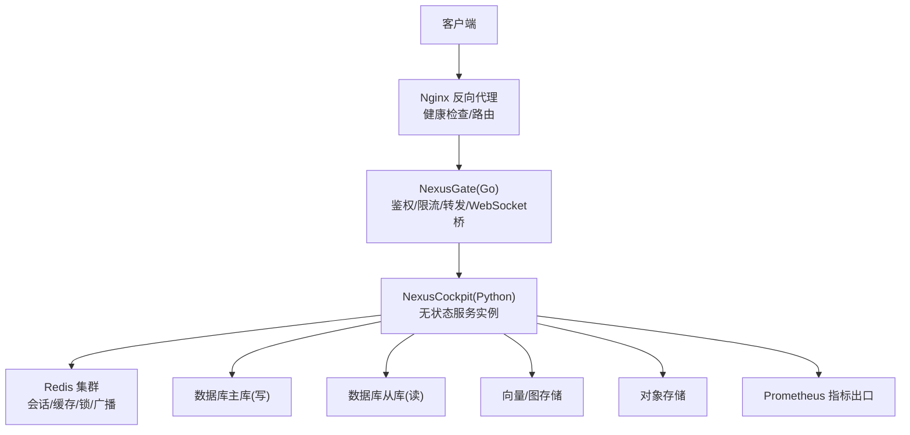
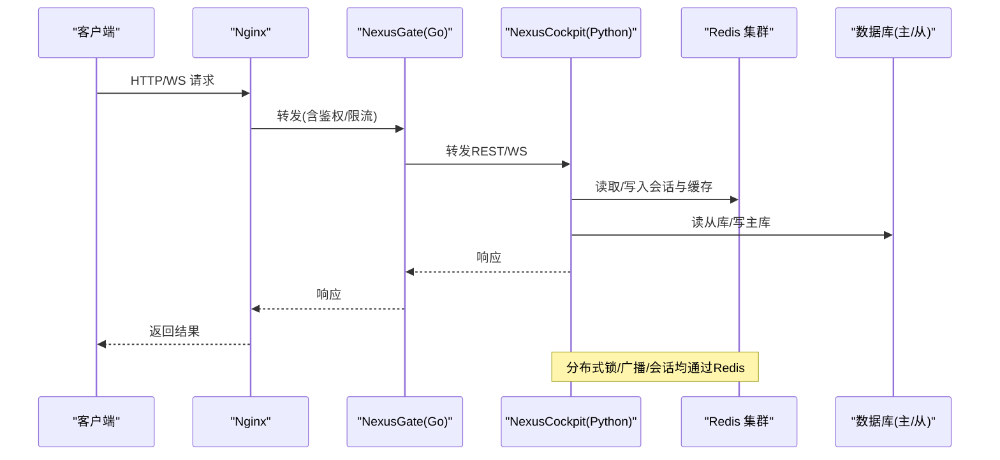
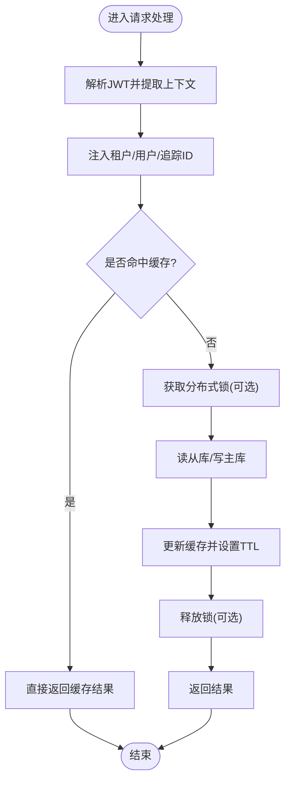
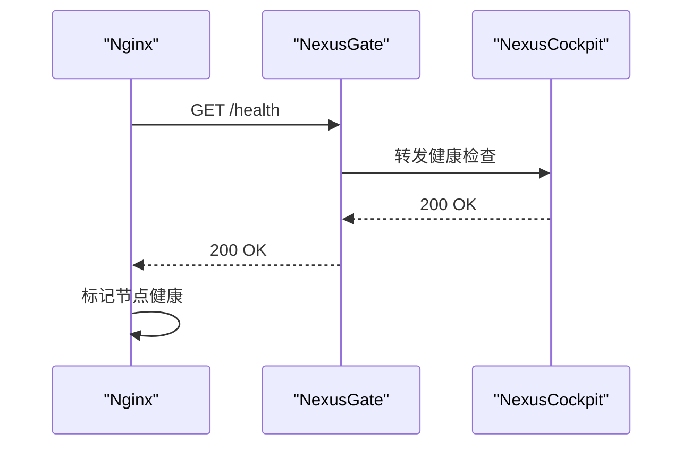
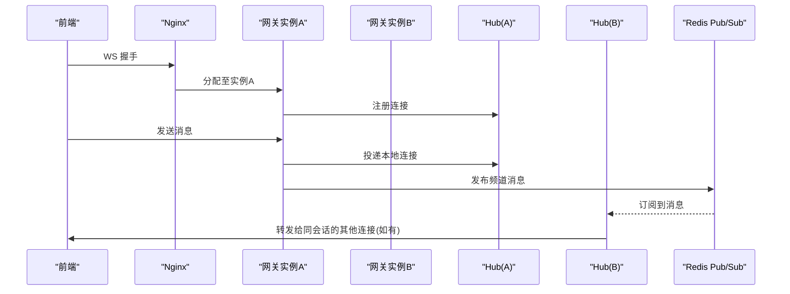
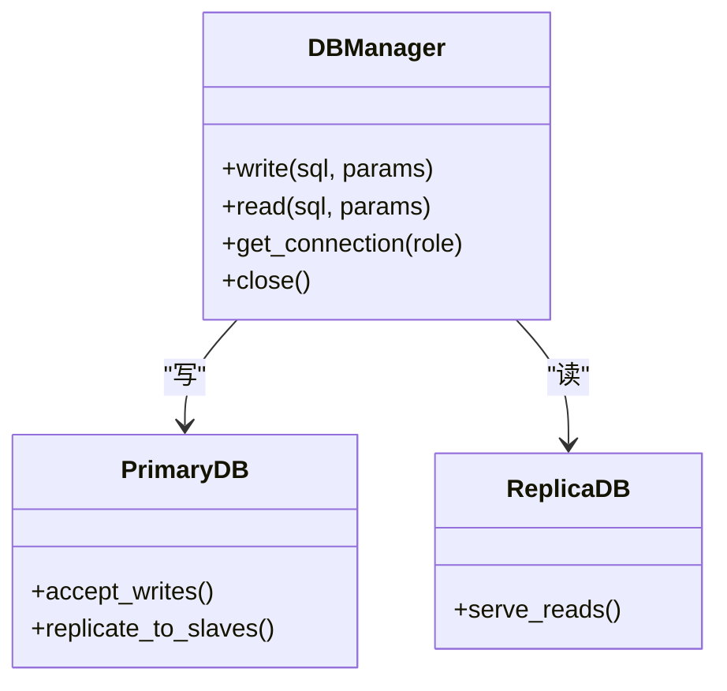
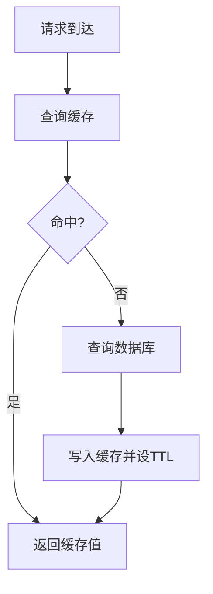
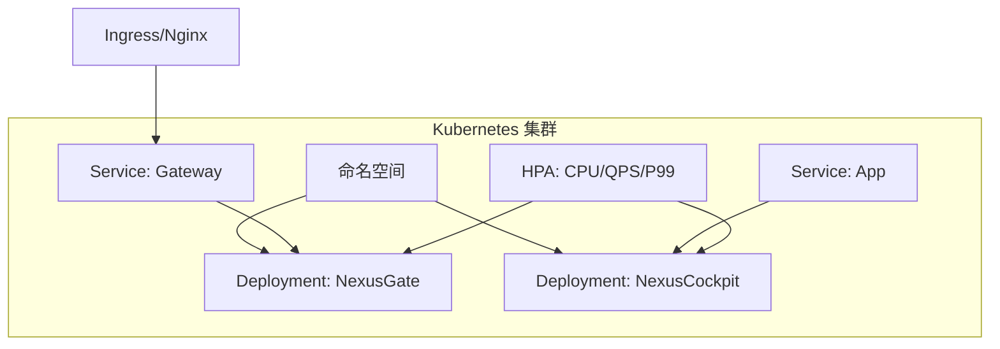
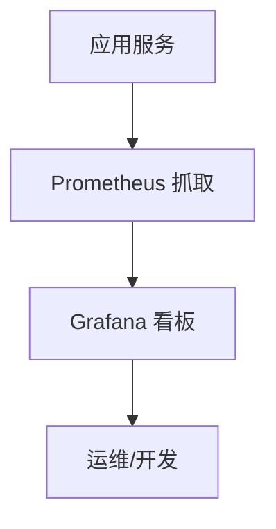
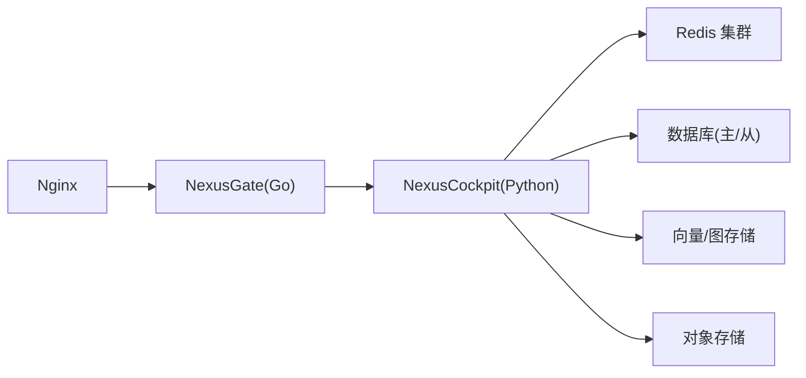

# 水平扩展策略

<cite>
**本文引用的文件**   
- [backend_design/nexus/main.py](file://backend_design/nexus/main.py)
- [backend_design/nexus/config.py](file://backend_design/nexus/config.py)
- [backend_design/nexus/core/db_manager.py](file://backend_design/nexus/core/db_manager.py)
- [backend_design/nexus/middleware/session_store.py](file://backend_design/nexus/middleware/session_store.py)
- [backend_design/nexus/middleware/redis_cache.py](file://backend_design/nexus/middleware/redis_cache.py)
- [backend_design/nexus/api/websocket.py](file://backend_design/nexus/api/websocket.py)
- [backend_design/nexus_gate/internal/ws/hub.go](file://backend_design/nexus_gate/internal/ws/hub.go)
- [backend_design/nexus_gate/internal/proxy/proxy.go](file://backend_design/nexus_gate/internal/proxy/proxy.go)
- [backend_design/nexus_gate/internal/ratelimit/ratelimit.go](file://backend_design/nexus_gate/internal/ratelimit/ratelimit.go)
- [backend_design/nexus_gate/internal/auth/jwt.go](file://backend_design/nexus_gate/internal/auth/jwt.go)
- [config/nginx/nginx.conf](file://config/nginx/nginx.conf)
- [docker-compose.yml](file://docker-compose.yml)
- [backend_design/nexus/observability/metrics.py](file://backend_design/nexus/observability/metrics.py)
- [backend_design/nexus/observability/cockpit_metrics.py](file://backend_design/nexus/observability/cockpit_metrics.py)
</cite>

## 目录
1. [引言](#引言)
2. [项目结构](#项目结构)
3. [核心组件](#核心组件)
4. [架构总览](#架构总览)
5. [详细组件分析](#详细组件分析)
6. [依赖关系分析](#依赖关系分析)
7. [性能考虑](#性能考虑)
8. [故障排查指南](#故障排查指南)
9. [结论](#结论)
10. [附录](#附录)

## 引言
本文件面向NexusCockpit的水平扩展与高可用部署，围绕无状态服务设计、负载均衡、WebSocket横向扩展、数据库读写分离与分库分表、缓存层优化、容器编排与弹性伸缩、以及监控指标与容量规划等主题给出可落地的策略与实践建议。文档同时结合现有代码中的网关（Go）、后端（Python）与中间件（Redis、数据库、消息通道）进行映射说明，帮助读者在真实系统中落地扩展方案。

## 项目结构
从水平扩展视角，系统由以下关键层次构成：
- 接入层：Nginx反向代理与健康检查；Go语言网关负责鉴权、限流、请求转发与WebSocket桥接。
- 应用层：Python后端提供REST与WebSocket接口，保持无状态，会话与上下文外置到Redis。
- 数据层：主从数据库、向量/图存储、对象存储；通过连接池与读写分离提升吞吐。
- 缓存层：Redis集群作为会话、缓存、分布式锁与广播通道。
- 可观测性：Prometheus/Grafana采集业务与系统指标，支撑扩缩容决策。

图表来源
- [config/nginx/nginx.conf](file://config/nginx/nginx.conf)
- [backend_design/nexus_gate/internal/proxy/proxy.go](file://backend_design/nexus_gate/internal/proxy/proxy.go)
- [backend_design/nexus/main.py](file://backend_design/nexus/main.py)
- [backend_design/nexus/middleware/redis_cache.py](file://backend_design/nexus/middleware/redis_cache.py)
- [backend_design/nexus/core/db_manager.py](file://backend_design/nexus/core/db_manager.py)

章节来源
- [backend_design/nexus/main.py](file://backend_design/nexus/main.py)
- [backend_design/nexus/config.py](file://backend_design/nexus/config.py)
- [backend_design/nexus/core/db_manager.py](file://backend_design/nexus/core/db_manager.py)
- [backend_design/nexus/middleware/redis_cache.py](file://backend_design/nexus/middleware/redis_cache.py)
- [backend_design/nexus/api/websocket.py](file://backend_design/nexus/api/websocket.py)
- [backend_design/nexus_gate/internal/ws/hub.go](file://backend_design/nexus_gate/internal/ws/hub.go)
- [backend_design/nexus_gate/internal/proxy/proxy.go](file://backend_design/nexus_gate/internal/proxy/proxy.go)
- [config/nginx/nginx.conf](file://config/nginx/nginx.conf)
- [docker-compose.yml](file://docker-compose.yml)

## 核心组件
- 无状态服务设计
  - 会话状态外置：使用Redis集中存储会话与用户上下文，避免进程内状态导致无法横向扩展。
  - 请求上下文传递：将租户ID、用户标识、追踪ID等放入请求头或JWT载荷，跨网关与应用层一致传递。
  - 分布式锁：基于Redis原子操作实现互斥，用于热点资源保护与任务去重。
- 负载均衡与健康检查
  - Nginx对后端多实例做轮询/加权转发，配置健康检查探针，剔除异常节点。
  - Go网关暴露轻量健康端点，供Nginx探测存活与就绪。
- WebSocket横向扩展
  - 前端经Nginx与Go网关建立WS连接，Go侧维护Hub并基于Redis Pub/Sub将消息广播至所有实例。
- 数据库读写分离与分片
  - 写走主库，读走从库；按租户或业务域进行分库分表，降低单库压力。
- 缓存层优化
  - Redis集群承载会话、热点缓存、分布式锁与广播；采用合理的TTL与失效策略保证一致性。
- 容器编排与弹性伸缩
  - 以Docker封装服务，Kubernetes管理副本数与HPA，依据CPU/内存/自定义指标自动扩缩容。
- 监控与容量规划
  - 暴露Prometheus指标，结合Grafana看板观察QPS、延迟、错误率、连接数、缓存命中率等，指导扩容阈值。

章节来源
- [backend_design/nexus/middleware/session_store.py](file://backend_design/nexus/middleware/session_store.py)
- [backend_design/nexus/middleware/redis_cache.py](file://backend_design/nexus/middleware/redis_cache.py)
- [backend_design/nexus/core/db_manager.py](file://backend_design/nexus/core/db_manager.py)
- [backend_design/nexus/api/websocket.py](file://backend_design/nexus/api/websocket.py)
- [backend_design/nexus_gate/internal/ws/hub.go](file://backend_design/nexus_gate/internal/ws/hub.go)
- [backend_design/nexus_gate/internal/proxy/proxy.go](file://backend_design/nexus_gate/internal/proxy/proxy.go)
- [backend_design/nexus_gate/internal/ratelimit/ratelimit.go](file://backend_design/nexus_gate/internal/ratelimit/ratelimit.go)
- [backend_design/nexus_gate/internal/auth/jwt.go](file://backend_design/nexus_gate/internal/auth/jwt.go)
- [config/nginx/nginx.conf](file://config/nginx/nginx.conf)
- [docker-compose.yml](file://docker-compose.yml)
- [backend_design/nexus/observability/metrics.py](file://backend_design/nexus/observability/metrics.py)
- [backend_design/nexus/observability/cockpit_metrics.py](file://backend_design/nexus/observability/cockpit_metrics.py)

## 架构总览
下图展示水平扩展下的端到端调用链与关键外部依赖。

图表来源
- [config/nginx/nginx.conf](file://config/nginx/nginx.conf)
- [backend_design/nexus_gate/internal/proxy/proxy.go](file://backend_design/nexus_gate/internal/proxy/proxy.go)
- [backend_design/nexus/main.py](file://backend_design/nexus/main.py)
- [backend_design/nexus/middleware/redis_cache.py](file://backend_design/nexus/middleware/redis_cache.py)
- [backend_design/nexus/core/db_manager.py](file://backend_design/nexus/core/db_manager.py)

## 详细组件分析

### 无状态服务设计与上下文传递
- 会话外置
  - 将用户会话、偏好设置、临时状态存入Redis，服务重启或迁移不影响会话连续性。
- 上下文传递
  - 在网关层解析JWT并注入租户ID、用户ID、追踪ID等，通过HTTP头或消息体字段传递给后端。
- 分布式锁
  - 基于Redis SETNX/DEL或Lua脚本实现细粒度锁，避免重复执行与竞态条件。

图表来源
- [backend_design/nexus_gate/internal/auth/jwt.go](file://backend_design/nexus_gate/internal/auth/jwt.go)
- [backend_design/nexus/middleware/redis_cache.py](file://backend_design/nexus/middleware/redis_cache.py)
- [backend_design/nexus/core/db_manager.py](file://backend_design/nexus/core/db_manager.py)

章节来源
- [backend_design/nexus/middleware/session_store.py](file://backend_design/nexus/middleware/session_store.py)
- [backend_design/nexus/middleware/redis_cache.py](file://backend_design/nexus/middleware/redis_cache.py)
- [backend_design/nexus/core/db_manager.py](file://backend_design/nexus/core/db_manager.py)

### 负载均衡与健康检查
- Nginx反向代理
  - 配置upstream指向多个后端实例，启用健康检查与失败重试。
  - 针对WebSocket路径开启长连接支持，合理设置超时与缓冲。
- 网关健康端点
  - 提供轻量健康检查接口，返回服务就绪状态，便于Nginx剔除不健康节点。

图表来源
- [config/nginx/nginx.conf](file://config/nginx/nginx.conf)
- [backend_design/nexus_gate/internal/proxy/proxy.go](file://backend_design/nexus_gate/internal/proxy/proxy.go)

章节来源
- [config/nginx/nginx.conf](file://config/nginx/nginx.conf)
- [backend_design/nexus_gate/internal/proxy/proxy.go](file://backend_design/nexus_gate/internal/proxy/proxy.go)

### WebSocket横向扩展与消息广播
- 连接分发
  - 前端经Nginx与Go网关建立WS连接，网关根据负载策略分配到不同实例。
- 消息广播
  - 网关内部Hub维护连接表，并通过Redis Pub/Sub将消息广播到其他实例的Hub，确保同一会话的多实例可达。
- 会话亲和
  - 若需会话亲和，可在Nginx层基于Cookie或IP哈希绑定，但会牺牲部分均衡度。

图表来源
- [backend_design/nexus/api/websocket.py](file://backend_design/nexus/api/websocket.py)
- [backend_design/nexus_gate/internal/ws/hub.go](file://backend_design/nexus_gate/internal/ws/hub.go)
- [backend_design/nexus_gate/internal/proxy/proxy.go](file://backend_design/nexus_gate/internal/proxy/proxy.go)

章节来源
- [backend_design/nexus/api/websocket.py](file://backend_design/nexus/api/websocket.py)
- [backend_design/nexus_gate/internal/ws/hub.go](file://backend_design/nexus_gate/internal/ws/hub.go)
- [backend_design/nexus_gate/internal/proxy/proxy.go](file://backend_design/nexus_gate/internal/proxy/proxy.go)

### 数据库读写分离与分库分表
- 读写分离
  - 写操作走主库，读操作走从库；通过连接池隔离读写通道，避免互相阻塞。
- 分库分表
  - 按租户ID或业务域进行水平拆分，降低单库容量与锁竞争；配合全局序列号或雪花算法生成唯一键。
- 事务与一致性
  - 跨分片事务谨慎使用，优先采用最终一致性补偿机制。

图表来源
- [backend_design/nexus/core/db_manager.py](file://backend_design/nexus/core/db_manager.py)

章节来源
- [backend_design/nexus/core/db_manager.py](file://backend_design/nexus/core/db_manager.py)

### 缓存层优化与一致性
- 缓存策略
  - 热点数据前置到Redis，设置合理TTL与随机抖动，避免雪崩。
  - 采用Cache-Aside模式，先读缓存，未命中再回源DB并回填。
- 一致性保证
  - 更新时先更新DB再删除缓存，或使用延迟双删；必要时引入版本号或时间戳校验。
- 集群与高可用
  - Redis集群分片+哨兵/Cluster模式，跨机房部署，保障可用性。

图表来源
- [backend_design/nexus/middleware/redis_cache.py](file://backend_design/nexus/middleware/redis_cache.py)

章节来源
- [backend_design/nexus/middleware/redis_cache.py](file://backend_design/nexus/middleware/redis_cache.py)

### 容器编排与弹性伸缩
- 容器化
  - 使用Docker封装Go网关与Python后端，镜像最小化并多阶段构建。
- Kubernetes部署
  - 使用Deployment管理副本数，Service暴露端口，Ingress/Nginx作为入口。
- 自动扩缩容
  - 基于CPU/内存/自定义指标（如QPS、P99延迟、Redis连接数）配置HPA，设定目标利用率与最小/最大副本。
- 滚动升级与回滚
  - 利用RollingUpdate策略平滑升级，保留历史版本以便快速回滚。

[此图为概念性架构图，无需图表来源]

章节来源
- [docker-compose.yml](file://docker-compose.yml)

### 监控指标与容量规划
- 指标采集
  - 暴露Prometheus指标，包括请求量、延迟分布、错误率、连接数、缓存命中率、队列长度等。
- 告警与看板
  - Grafana可视化关键指标，设置阈值告警（如P99延迟、错误率、Redis内存）。
- 容量规划
  - 基于压测曲线与增长趋势，预估CPU/内存/带宽/存储需求；为突发流量预留冗余。

[此图为概念性架构图，无需图表来源]

章节来源
- [backend_design/nexus/observability/metrics.py](file://backend_design/nexus/observability/metrics.py)
- [backend_design/nexus/observability/cockpit_metrics.py](file://backend_design/nexus/observability/cockpit_metrics.py)

## 依赖关系分析
- 组件耦合
  - 网关与后端通过HTTP/WS解耦；后端与Redis/DB通过客户端库交互，边界清晰。
- 外部依赖
  - Redis集群、数据库主从、向量/图存储、对象存储均为外部强依赖，需关注其SLA与容量。
- 潜在循环依赖
  - 当前分层清晰，未见循环依赖；建议在新增模块时遵循单向依赖原则。

图表来源
- [config/nginx/nginx.conf](file://config/nginx/nginx.conf)
- [backend_design/nexus_gate/internal/proxy/proxy.go](file://backend_design/nexus_gate/internal/proxy/proxy.go)
- [backend_design/nexus/main.py](file://backend_design/nexus/main.py)
- [backend_design/nexus/middleware/redis_cache.py](file://backend_design/nexus/middleware/redis_cache.py)
- [backend_design/nexus/core/db_manager.py](file://backend_design/nexus/core/db_manager.py)

章节来源
- [backend_design/nexus/main.py](file://backend_design/nexus/main.py)
- [backend_design/nexus/config.py](file://backend_design/nexus/config.py)
- [backend_design/nexus/middleware/redis_cache.py](file://backend_design/nexus/middleware/redis_cache.py)
- [backend_design/nexus/core/db_manager.py](file://backend_design/nexus/core/db_manager.py)

## 性能考虑
- 连接复用与池化
  - 数据库与Redis连接池按需调整大小，避免频繁创建销毁带来的开销。
- 超时与重试
  - 合理设置I/O超时与重试次数，防止级联故障；对幂等接口启用重试。
- 批量与异步
  - 对非实时场景采用批量写入与异步任务队列，削峰填谷。
- 缓存命中率
  - 热点Key预热与局部淘汰策略，减少冷数据占用。
- 网络与序列化
  - 选择高效序列化协议，压缩大Payload，减少跨实例传输成本。

[本节为通用性能建议，不涉及具体文件分析]

## 故障排查指南
- 常见问题定位
  - 连接失败：检查Redis/DB连通性与认证信息，查看连接池耗尽告警。
  - 会话丢失：确认会话外置存储是否可用，核对TTL与过期策略。
  - 广播异常：核查Redis Pub/Sub订阅是否正常，Hub连接表是否同步。
  - 健康检查失败：检查网关健康端点与Nginx上游状态。
- 日志与追踪
  - 统一日志格式与追踪ID，关联跨组件调用链路。
- 回滚与降级
  - 灰度发布与快速回滚；在下游不可用时启用降级策略（如只读模式）。

章节来源
- [backend_design/nexus_gate/internal/proxy/proxy.go](file://backend_design/nexus_gate/internal/proxy/proxy.go)
- [backend_design/nexus/middleware/redis_cache.py](file://backend_design/nexus/middleware/redis_cache.py)
- [backend_design/nexus/api/websocket.py](file://backend_design/nexus/api/websocket.py)

## 结论
通过无状态服务设计、集中式会话与缓存、分布式锁、读写分离与分库分表、WebSocket广播、容器编排与弹性伸缩、以及完善的监控与容量规划，NexusCockpit可实现稳定高效的水平扩展。建议在上线前完成压测与演练，持续优化阈值与资源配置，确保在高并发与故障场景下仍能提供高质量服务。

## 附录
- 术语
  - 无状态服务：不保存进程内状态，所有状态外置到共享存储。
  - 读写分离：写主读从，降低读压力。
  - 分库分表：按规则将数据分散到多个库/表，提升可扩展性。
  - HPA：基于指标的自动扩缩容控制器。

[本节为概念性内容，不涉及具体文件分析]