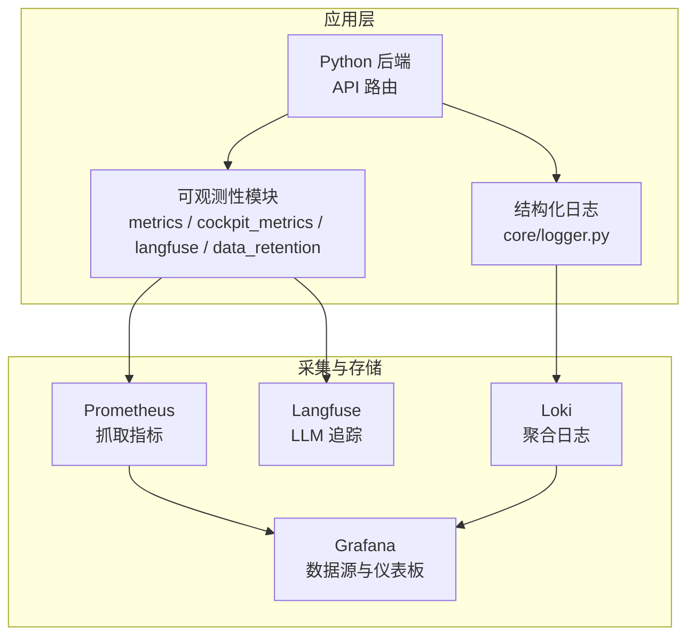
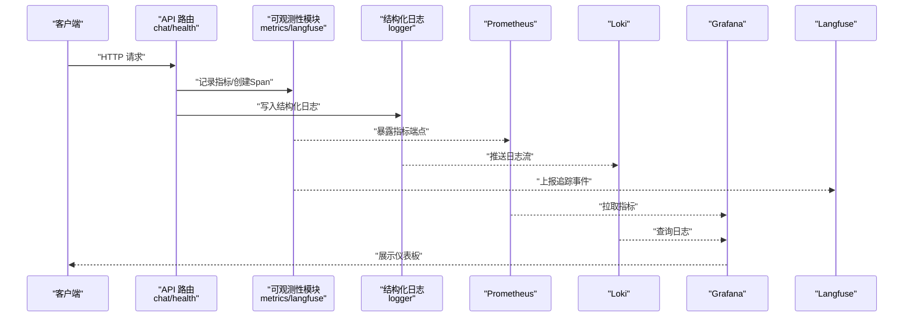
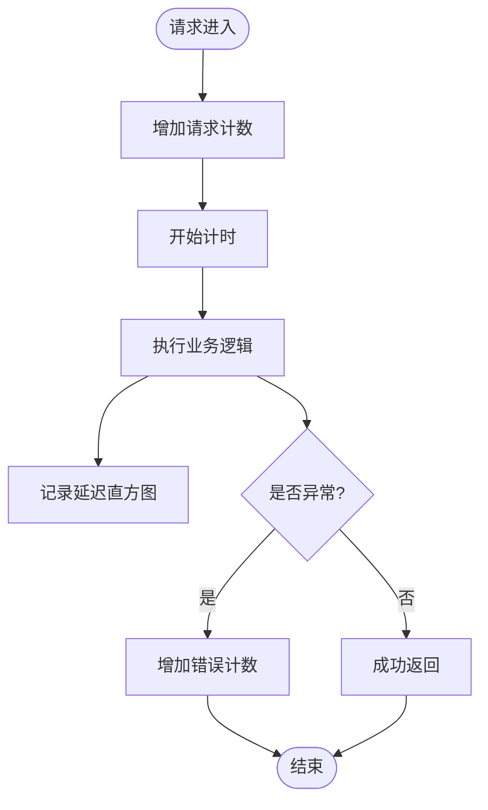
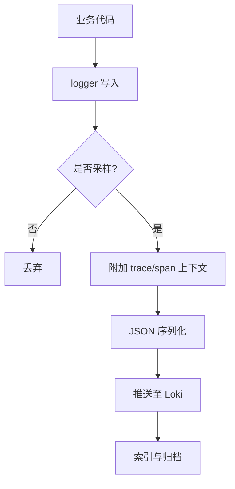
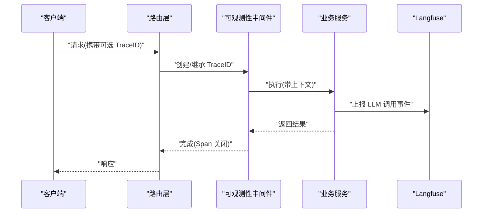
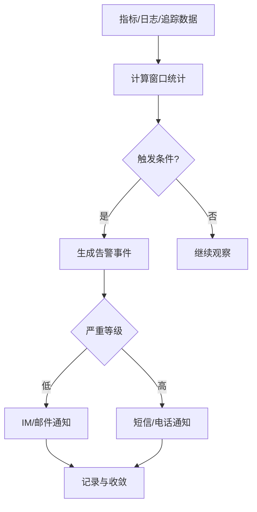
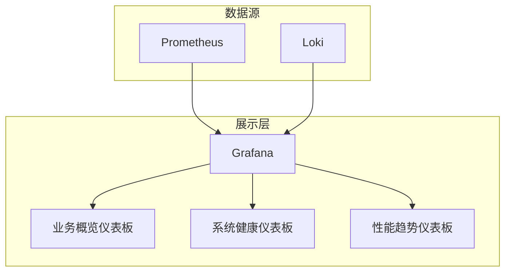
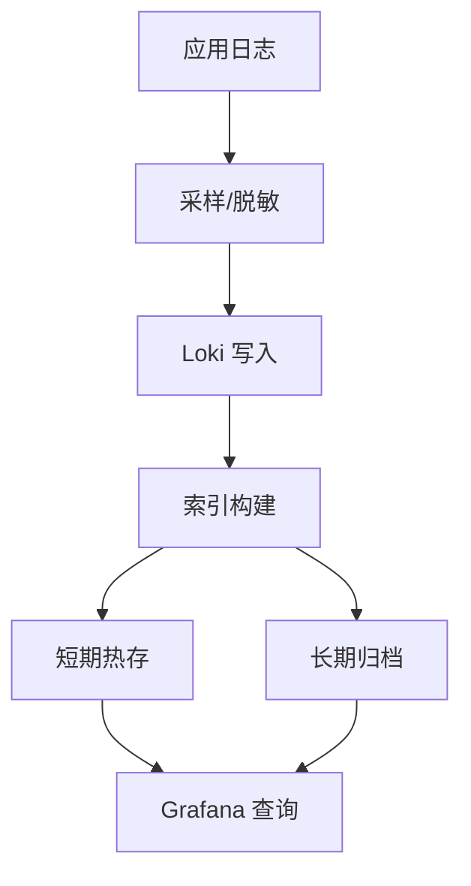
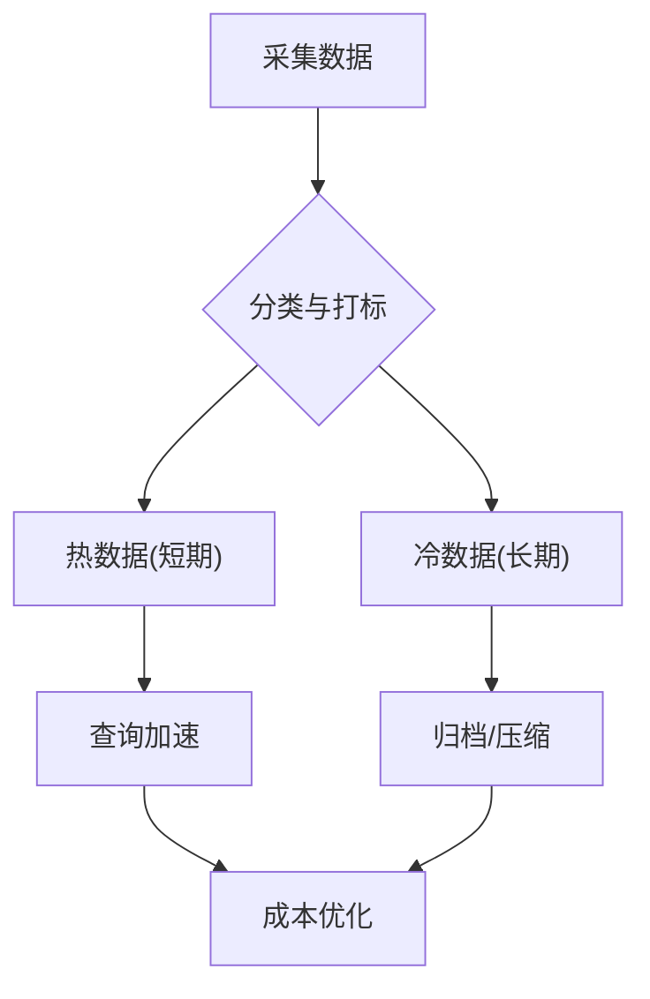
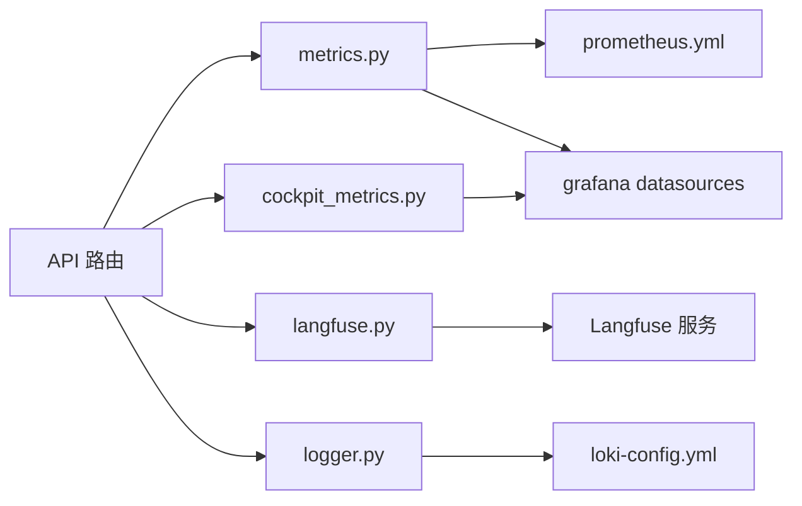

# 可观测性架构

<cite>
**本文引用的文件**   
- [backend_design/nexus/observability/__init__.py](file://backend_design/nexus/observability/__init__.py)
- [backend_design/nexus/observability/cockpit_metrics.py](file://backend_design/nexus/observability/cockpit_metrics.py)
- [backend_design/nexus/observability/metrics.py](file://backend_design/nexus/observability/metrics.py)
- [backend_design/nexus/observability/langfuse.py](file://backend_design/nexus/observability/langfuse.py)
- [backend_design/nexus/observability/data_retention.py](file://backend_design/nexus/observability/data_retention.py)
- [config/grafana/provisioning/dashboards/nexuscockpit-overview.json](file://config/grafana/provisioning/dashboards/nexuscockpit-overview.json)
- [config/grafana/provisioning/datasources/prometheus.yml](file://config/grafana/provisioning/datasources/prometheus.yml)
- [config/prometheus/prometheus.yml](file://config/prometheus/prometheus.yml)
- [config/loki/loki-config.yml](file://config/loki/loki-config.yml)
- [backend_design/nexus/core/logger.py](file://backend_design/nexus/core/logger.py)
- [backend_design/nexus/api/routes/chat.py](file://backend_design/nexus/api/routes/chat.py)
- [backend_design/nexus/api/routes/health.py](file://backend_design/nexus/api/routes/health.py)
- [backend_design/nexus/config.py](file://backend_design/nexus/config.py)
- [docker-compose.yml](file://docker-compose.yml)
</cite>

## 目录
1. [简介](#简介)
2. [项目结构](#项目结构)
3. [核心组件](#核心组件)
4. [架构总览](#架构总览)
5. [详细组件分析](#详细组件分析)
6. [依赖关系分析](#依赖关系分析)
7. [性能考虑](#性能考虑)
8. [故障排查指南](#故障排查指南)
9. [结论](#结论)
10. [附录](#附录)

## 简介
本文件为 NexusCockpit 系统的可观测性架构文档，围绕三大支柱（指标监控、日志收集、链路追踪）给出端到端集成方案。重点说明分布式追踪的 Trace ID 传递与 Span 关联、告警规则设计、可视化仪表板规划、日志聚合与分析策略，以及可观测性数据的治理（保留、隐私与成本）。

## 项目结构
NexusCockpit 的可观测性相关代码与配置主要分布在以下位置：
- Python 后端可观测性实现：backend_design/nexus/observability/*
- 结构化日志模块：backend_design/nexus/core/logger.py
- API 路由示例（用于埋点与上下文透传）：backend_design/nexus/api/routes/*
- Prometheus/Grafana/Loki 配置：config/prometheus/*, config/grafana/*, config/loki/*
- 服务编排与依赖：docker-compose.yml

图表来源
- [backend_design/nexus/observability/metrics.py](file://backend_design/nexus/observability/metrics.py)
- [backend_design/nexus/observability/cockpit_metrics.py](file://backend_design/nexus/observability/cockpit_metrics.py)
- [backend_design/nexus/observability/langfuse.py](file://backend_design/nexus/observability/langfuse.py)
- [backend_design/nexus/observability/data_retention.py](file://backend_design/nexus/observability/data_retention.py)
- [backend_design/nexus/core/logger.py](file://backend_design/nexus/core/logger.py)
- [config/prometheus/prometheus.yml](file://config/prometheus/prometheus.yml)
- [config/grafana/provisioning/datasources/prometheus.yml](file://config/grafana/provisioning/datasources/prometheus.yml)
- [config/grafana/provisioning/dashboards/nexuscockpit-overview.json](file://config/grafana/provisioning/dashboards/nexuscockpit-overview.json)
- [config/loki/loki-config.yml](file://config/loki/loki-config.yml)

章节来源
- [backend_design/nexus/observability/__init__.py](file://backend_design/nexus/observability/__init__.py)
- [backend_design/nexus/observability/metrics.py](file://backend_design/nexus/observability/metrics.py)
- [backend_design/nexus/observability/cockpit_metrics.py](file://backend_design/nexus/observability/cockpit_metrics.py)
- [backend_design/nexus/observability/langfuse.py](file://backend_design/nexus/observability/langfuse.py)
- [backend_design/nexus/observability/data_retention.py](file://backend_design/nexus/observability/data_retention.py)
- [backend_design/nexus/core/logger.py](file://backend_design/nexus/core/logger.py)
- [config/prometheus/prometheus.yml](file://config/prometheus/prometheus.yml)
- [config/grafana/provisioning/datasources/prometheus.yml](file://config/grafana/provisioning/datasources/prometheus.yml)
- [config/grafana/provisioning/dashboards/nexuscockpit-overview.json](file://config/grafana/provisioning/dashboards/nexuscockpit-overview.json)
- [config/loki/loki-config.yml](file://config/loki/loki-config.yml)

## 核心组件
- 指标采集与暴露
  - 通用指标封装与注册：metrics.py
  - 业务域指标（座舱场景）：cockpit_metrics.py
  - 暴露端点由框架中间件或路由统一处理，供 Prometheus 抓取
- 结构化日志
  - 日志初始化、字段规范与采样开关：core/logger.py
- 分布式追踪（LLM 与业务调用）
  - Langfuse 集成：langfuse.py
  - 在关键路径注入 Trace/Span 上下文，贯穿上游到下游
- 数据生命周期治理
  - 保留策略与清理任务：data_retention.py
- 外部系统对接
  - Prometheus 抓取配置：prometheus.yml
  - Grafana 数据源与仪表板：grafana/*
  - Loki 日志聚合配置：loki-config.yml

章节来源
- [backend_design/nexus/observability/metrics.py](file://backend_design/nexus/observability/metrics.py)
- [backend_design/nexus/observability/cockpit_metrics.py](file://backend_design/nexus/observability/cockpit_metrics.py)
- [backend_design/nexus/observability/langfuse.py](file://backend_design/nexus/observability/langfuse.py)
- [backend_design/nexus/observability/data_retention.py](file://backend_design/nexus/observability/data_retention.py)
- [backend_design/nexus/core/logger.py](file://backend_design/nexus/core/logger.py)
- [config/prometheus/prometheus.yml](file://config/prometheus/prometheus.yml)
- [config/grafana/provisioning/datasources/prometheus.yml](file://config/grafana/provisioning/datasources/prometheus.yml)
- [config/grafana/provisioning/dashboards/nexuscockpit-overview.json](file://config/grafana/provisioning/dashboards/nexuscockpit-overview.json)
- [config/loki/loki-config.yml](file://config/loki/loki-config.yml)

## 架构总览
下图展示从请求进入、指标与日志采集、追踪贯穿，到存储与可视化的整体流程。

图表来源
- [backend_design/nexus/api/routes/chat.py](file://backend_design/nexus/api/routes/chat.py)
- [backend_design/nexus/api/routes/health.py](file://backend_design/nexus/api/routes/health.py)
- [backend_design/nexus/observability/metrics.py](file://backend_design/nexus/observability/metrics.py)
- [backend_design/nexus/observability/langfuse.py](file://backend_design/nexus/observability/langfuse.py)
- [backend_design/nexus/core/logger.py](file://backend_design/nexus/core/logger.py)
- [config/prometheus/prometheus.yml](file://config/prometheus/prometheus.yml)
- [config/loki/loki-config.yml](file://config/loki/loki-config.yml)
- [config/grafana/provisioning/datasources/prometheus.yml](file://config/grafana/provisioning/datasources/prometheus.yml)

## 详细组件分析

### 指标监控（Metrics）
- 指标定义与注册
  - 通用计数器、直方图、计时器封装，便于在路由/中间件中快速埋点
  - 业务域指标按“座舱”维度组织，包含请求量、延迟、错误率等
- 指标暴露与抓取
  - 通过 HTTP 端点暴露，Prometheus 按配置文件周期性抓取
- 典型指标类别
  - 业务类：会话数、意图识别成功率、技能调用次数
  - 系统类：CPU/内存/磁盘/网络（由运行时或导出器提供）
  - 质量类：P95/P99 延迟、错误码分布、超时比例

图表来源
- [backend_design/nexus/observability/metrics.py](file://backend_design/nexus/observability/metrics.py)
- [backend_design/nexus/observability/cockpit_metrics.py](file://backend_design/nexus/observability/cockpit_metrics.py)
- [config/prometheus/prometheus.yml](file://config/prometheus/prometheus.yml)

章节来源
- [backend_design/nexus/observability/metrics.py](file://backend_design/nexus/observability/metrics.py)
- [backend_design/nexus/observability/cockpit_metrics.py](file://backend_design/nexus/observability/cockpit_metrics.py)
- [config/prometheus/prometheus.yml](file://config/prometheus/prometheus.yml)

### 日志收集（Logging）
- 结构化日志规范
  - 统一字段：trace_id、span_id、tenant、user_id、level、msg、duration_ms 等
  - 输出格式建议 JSON，便于 Loki 解析与索引
- 采样与脱敏
  - 支持按环境/流量级别进行采样；敏感字段自动脱敏
- 采集与存储
  - 应用侧直接推送到 Loki，或通过 sidecar/Agent 转发
  - 使用标签（labels）对租户、服务、版本进行分片

图表来源
- [backend_design/nexus/core/logger.py](file://backend_design/nexus/core/logger.py)
- [config/loki/loki-config.yml](file://config/loki/loki-config.yml)

章节来源
- [backend_design/nexus/core/logger.py](file://backend_design/nexus/core/logger.py)
- [config/loki/loki-config.yml](file://config/loki/loki-config.yml)

### 链路追踪（Tracing）
- 追踪范围
  - 覆盖 API 入口、意图路由、RAG 检索、LLM 调用、TTS/ASR 等关键路径
- Trace ID 传递
  - 在入站请求生成/继承 Trace ID，跨进程/服务透传
  - 将 Trace ID 注入日志字段，实现“日志-追踪”联动
- Span 关联
  - 每个子操作创建子 Span，记录输入输出摘要、耗时与错误
  - 对 LLM 调用使用 Langfuse 上报，形成完整调用链
- 瓶颈定位
  - 基于 P95/P99 延迟与错误率筛选慢调用
  - 结合日志关键字与 Span 详情下钻根因

图表来源
- [backend_design/nexus/observability/langfuse.py](file://backend_design/nexus/observability/langfuse.py)
- [backend_design/nexus/api/routes/chat.py](file://backend_design/nexus/api/routes/chat.py)
- [backend_design/nexus/core/logger.py](file://backend_design/nexus/core/logger.py)

章节来源
- [backend_design/nexus/observability/langfuse.py](file://backend_design/nexus/observability/langfuse.py)
- [backend_design/nexus/api/routes/chat.py](file://backend_design/nexus/api/routes/chat.py)
- [backend_design/nexus/core/logger.py](file://backend_design/nexus/core/logger.py)

### 告警规则设计
- 阈值告警
  - 错误率、延迟 P95/P99、QPS 突降、资源水位（CPU/内存/磁盘）
- 异常检测
  - 基于滑动窗口的同比/环比突变检测；LLM 调用失败率突增
- 多级通知策略
  - 一级：内部 IM/邮件（低优先级）
  - 二级：短信/电话（高优先级）
  - 升级策略：持续未恢复自动升级
- 规则管理
  - 以 YAML 形式集中管理，配合 CI 校验与灰度发布

[本节为概念性说明，不直接分析具体文件]

### 可视化仪表板设计
- 关键业务指标
  - 请求总量、成功率、P95/P99 延迟、意图识别准确率、技能调用 TopN
- 系统健康状态
  - CPU/内存/磁盘/网络、数据库连接池、缓存命中率、消息队列积压
- 性能趋势
  - 日/周/月对比、容量预测、变更前后对比
- 数据来源
  - Prometheus 作为指标数据源，Grafana 提供数据源与仪表板配置

图表来源
- [config/grafana/provisioning/datasources/prometheus.yml](file://config/grafana/provisioning/datasources/prometheus.yml)
- [config/grafana/provisioning/dashboards/nexuscockpit-overview.json](file://config/grafana/provisioning/dashboards/nexuscockpit-overview.json)

章节来源
- [config/grafana/provisioning/datasources/prometheus.yml](file://config/grafana/provisioning/datasources/prometheus.yml)
- [config/grafana/provisioning/dashboards/nexuscockpit-overview.json](file://config/grafana/provisioning/dashboards/nexuscockpit-overview.json)

### 日志聚合与分析方案
- 结构化日志
  - 强制 JSON 输出，统一字段命名与类型
- 日志采样
  - 按租户/用户/接口维度采样，降低存储压力
- 长期存储
  - 热数据短期保留（如 7-14 天），冷数据归档至对象存储
- 分析与检索
  - 基于标签过滤（租户、服务、版本）、关键字检索、错误堆栈聚合

图表来源
- [backend_design/nexus/core/logger.py](file://backend_design/nexus/core/logger.py)
- [config/loki/loki-config.yml](file://config/loki/loki-config.yml)

章节来源
- [backend_design/nexus/core/logger.py](file://backend_design/nexus/core/logger.py)
- [config/loki/loki-config.yml](file://config/loki/loki-config.yml)

### 可观测性数据治理
- 数据保留策略
  - 指标：短周期高精度 + 长周期降采样
  - 日志：热/冷分层，按租户与业务域设置不同保留期
  - 追踪：仅保留必要 Span 摘要，原始大附件外置
- 隐私保护
  - 敏感字段脱敏（手机号、身份证、Token 等）
  - 访问控制与审计（最小权限、操作留痕）
- 成本控制
  - 采样率动态调整、标签基数控制、冷热分层与压缩

图表来源
- [backend_design/nexus/observability/data_retention.py](file://backend_design/nexus/observability/data_retention.py)

章节来源
- [backend_design/nexus/observability/data_retention.py](file://backend_design/nexus/observability/data_retention.py)

## 依赖关系分析
- 组件耦合
  - API 路由依赖可观测性模块进行埋点与追踪
  - 可观测性模块依赖配置与环境变量
  - 外部系统：Prometheus、Loki、Grafana、Langfuse
- 外部依赖
  - docker-compose 编排各组件，确保端口与网络连通

图表来源
- [backend_design/nexus/api/routes/chat.py](file://backend_design/nexus/api/routes/chat.py)
- [backend_design/nexus/observability/metrics.py](file://backend_design/nexus/observability/metrics.py)
- [backend_design/nexus/observability/cockpit_metrics.py](file://backend_design/nexus/observability/cockpit_metrics.py)
- [backend_design/nexus/observability/langfuse.py](file://backend_design/nexus/observability/langfuse.py)
- [backend_design/nexus/core/logger.py](file://backend_design/nexus/core/logger.py)
- [config/prometheus/prometheus.yml](file://config/prometheus/prometheus.yml)
- [config/loki/loki-config.yml](file://config/loki/loki-config.yml)
- [config/grafana/provisioning/datasources/prometheus.yml](file://config/grafana/provisioning/datasources/prometheus.yml)

章节来源
- [backend_design/nexus/api/routes/chat.py](file://backend_design/nexus/api/routes/chat.py)
- [backend_design/nexus/observability/metrics.py](file://backend_design/nexus/observability/metrics.py)
- [backend_design/nexus/observability/cockpit_metrics.py](file://backend_design/nexus/observability/cockpit_metrics.py)
- [backend_design/nexus/observability/langfuse.py](file://backend_design/nexus/observability/langfuse.py)
- [backend_design/nexus/core/logger.py](file://backend_design/nexus/core/logger.py)
- [config/prometheus/prometheus.yml](file://config/prometheus/prometheus.yml)
- [config/loki/loki-config.yml](file://config/loki/loki-config.yml)
- [config/grafana/provisioning/datasources/prometheus.yml](file://config/grafana/provisioning/datasources/prometheus.yml)
- [docker-compose.yml](file://docker-compose.yml)

## 性能考虑
- 指标采集
  - 避免高频打点导致 GC 抖动；使用批量/合并上报
  - 合理选择直方图桶边界，减少 Cardinality
- 日志采样
  - 默认低采样率，仅在错误/慢请求时提高采样
  - 大字段截断与异步落盘
- 追踪开销
  - 仅对关键路径开启全量追踪；对 LLM 调用采用轻量 Span
- 存储与查询
  - 冷热分层、降采样与压缩；限制复杂查询与宽时间窗口

[本节为通用指导，不直接分析具体文件]

## 故障排查指南
- 常见问题
  - 指标缺失：检查 Prometheus 抓取目标与健康端点
  - 日志丢失：确认 Loki 接入与标签完整性
  - 追踪断裂：核对 Trace ID 透传与 Span 关闭时机
- 快速定位
  - 通过 Trace ID 在日志中检索上下文
  - 使用 Grafana 查看延迟与错误率曲线，定位异常时段
  - 结合 Langfuse 查看 LLM 调用细节与失败原因
- 健康检查
  - 使用健康端点验证服务可用性

章节来源
- [backend_design/nexus/api/routes/health.py](file://backend_design/nexus/api/routes/health.py)
- [backend_design/nexus/observability/metrics.py](file://backend_design/nexus/observability/metrics.py)
- [backend_design/nexus/observability/langfuse.py](file://backend_design/nexus/observability/langfuse.py)
- [backend_design/nexus/core/logger.py](file://backend_design/nexus/core/logger.py)

## 结论
本架构以指标、日志、追踪三大支柱为核心，结合 Grafana/Loki/Prometheus/Langfuse 构建统一的观测平台。通过结构化日志、Trace ID 贯通与精细化告警，实现对业务与系统的全面可见性与可控性。同时，通过数据治理策略保障隐私与成本可控，支撑生产环境的稳定运行与持续演进。

## 附录
- 配置要点
  - Prometheus 抓取目标与间隔
  - Grafana 数据源与仪表板加载
  - Loki 索引与保留策略
  - Langfuse 接入参数与采样开关
- 环境变量与配置项
  - 服务配置入口：backend_design/nexus/config.py

章节来源
- [backend_design/nexus/config.py](file://backend_design/nexus/config.py)
- [config/prometheus/prometheus.yml](file://config/prometheus/prometheus.yml)
- [config/grafana/provisioning/datasources/prometheus.yml](file://config/grafana/provisioning/datasources/prometheus.yml)
- [config/grafana/provisioning/dashboards/nexuscockpit-overview.json](file://config/grafana/provisioning/dashboards/nexuscockpit-overview.json)
- [config/loki/loki-config.yml](file://config/loki/loki-config.yml)