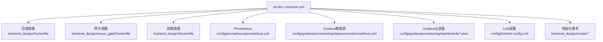
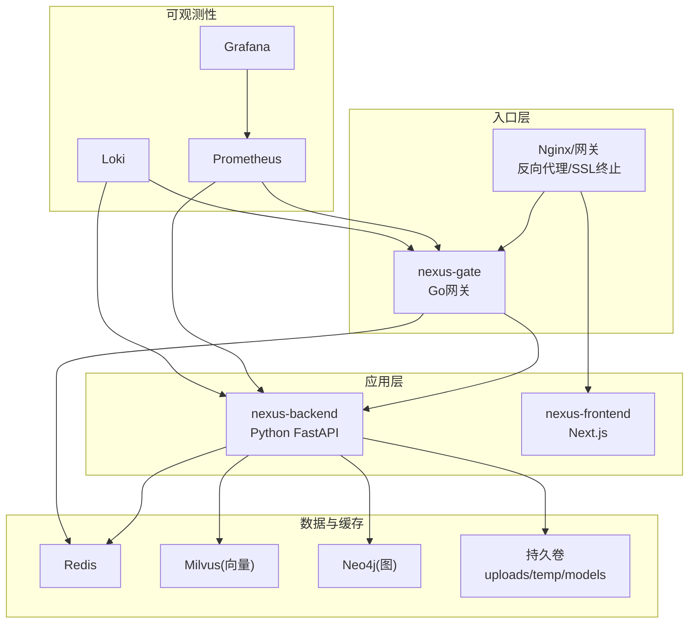
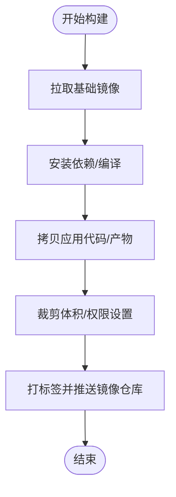
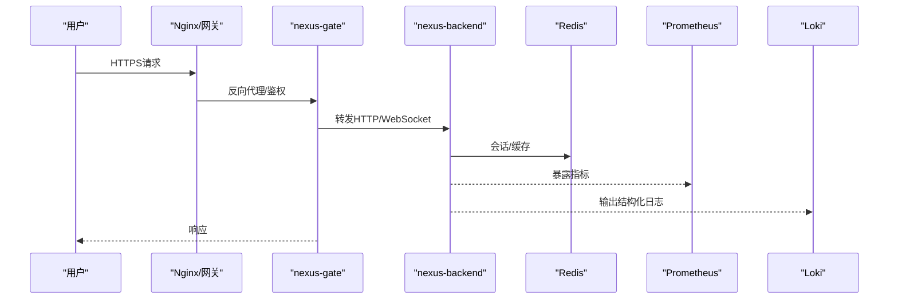
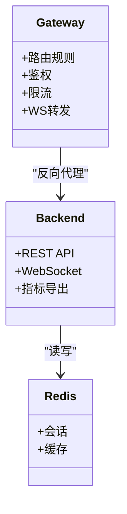
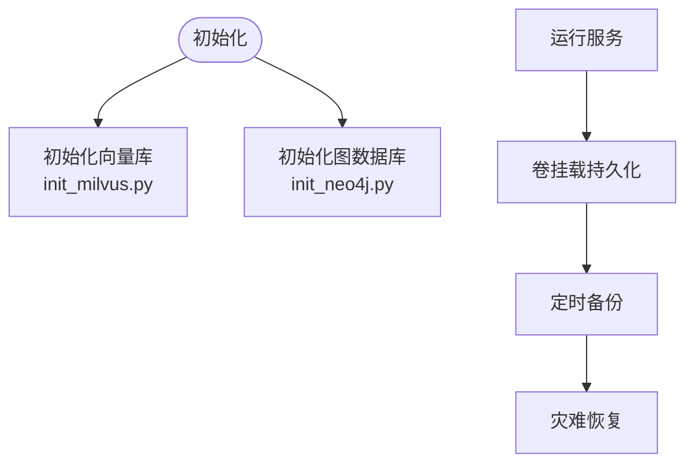
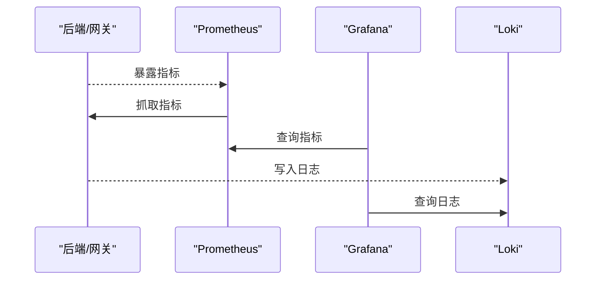
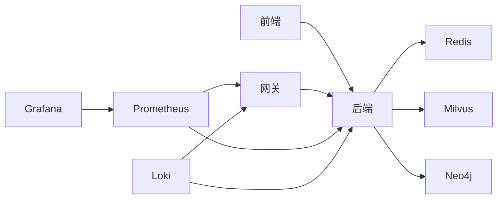

# 基础设施架构

<cite>
**本文引用的文件**   
- [docker-compose.yml](file://docker-compose.yml)
- [backend_design/Dockerfile](file://backend_design/Dockerfile)
- [backend_design/nexus_gate/Dockerfile](file://backend_design/nexus_gate/Dockerfile)
- [frontend_design/Dockerfile](file://frontend_design/Dockerfile)
- [config/prometheus/prometheus.yml](file://config/prometheus/prometheus.yml)
- [config/grafana/provisioning/datasources/prometheus.yml](file://config/grafana/provisioning/datasources/prometheus.yml)
- [config/grafana/provisioning/dashboards/dashboards.yml](file://config/grafana/provisioning/dashboards/dashboards.yml)
- [config/grafana/provisioning/dashboards/nexuscockpit-overview.json](file://config/grafana/provisioning/dashboards/nexuscockpit-overview.json)
- [config/loki/loki-config.yml](file://config/loki/loki-config.yml)
- [backend_design/nexus/observability/metrics.py](file://backend_design/nexus/observability/metrics.py)
- [backend_design/nexus/observability/cockpit_metrics.py](file://backend_design/nexus/observability/cockpit_metrics.py)
- [backend_design/nexus/core/logger.py](file://backend_design/nexus/core/logger.py)
- [backend_design/nexus/config.py](file://backend_design/nexus/config.py)
- [backend_design/nexus/main.py](file://backend_design/nexus/main.py)
- [backend_design/nexus/api/websocket.py](file://backend_design/nexus/api/websocket.py)
- [backend_design/nexus/middleware/session_store.py](file://backend_design/nexus/middleware/session_store.py)
- [backend_design/nexus/middleware/redis_cache.py](file://backend_design/nexus/middleware/redis_cache.py)
- [backend_design/nexus/core/db_manager.py](file://backend_design/nexus/core/db_manager.py)
- [backend_design/nexus/rag/vector_store.py](file://backend_design/nexus/rag/vector_store.py)
- [backend_design/nexus/rag/graph_store.py](file://backend_design/nexus/rag/graph_store.py)
- [backend_design/scripts/init_milvus.py](file://backend_design/scripts/init_milvus.py)
- [backend_design/scripts/init_neo4j.py](file://backend_design/scripts/init_neo4j.py)
- [backend_design/nexus_gate/internal/config/config.go](file://backend_design/nexus_gate/internal/config/config.go)
- [backend_design/nexus_gate/internal/handlers/redis_client.go](file://backend_design/nexus_gate/internal/handlers/redis_client.go)
- [backend_design/nexus_gate/internal/proxy/proxy.go](file://backend_design/nexus_gate/internal/proxy/proxy.go)
- [backend_design/nexus_gate/internal/router/router.go](file://backend_design/nexus_gate/internal/router/router.go)
- [backend_design/nexus_gate/internal/ws/hub.go](file://backend_design/nexus_gate/internal/ws/hub.go)
- [.github/workflows/ci.yml](file://.github/workflows/ci.yml)
- [Makefile](file://Makefile)
</cite>

## 目录
1. [简介](#简介)
2. [项目结构](#项目结构)
3. [核心组件](#核心组件)
4. [架构总览](#架构总览)
5. [详细组件分析](#详细组件分析)
6. [依赖关系分析](#依赖关系分析)
7. [性能与容量规划](#性能与容量规划)
8. [故障排查指南](#故障排查指南)
9. [结论](#结论)
10. [附录](#附录)

## 简介
本文件面向NexusCockpit系统的基础设施架构，聚焦容器化部署、服务编排、IaC实现、网络与安全、存储与备份、监控与日志、环境隔离与资源配额等关键主题。文档以仓库中的实际配置与代码为依据，提供可操作的部署与运维指导，并辅以架构图与流程图帮助读者快速理解系统全貌。

## 项目结构
从基础设施视角，仓库中与容器化与编排相关的核心位置如下：
- 顶层编排：docker-compose.yml
- 镜像构建：后端、网关、前端各自Dockerfile
- 可观测性配置：Prometheus、Grafana、Loki
- 初始化脚本：向量库与图数据库初始化
- CI流水线：GitHub Actions
- 本地开发辅助：Makefile

图表来源
- [docker-compose.yml](file://docker-compose.yml)
- [backend_design/Dockerfile](file://backend_design/Dockerfile)
- [backend_design/nexus_gate/Dockerfile](file://backend_design/nexus_gate/Dockerfile)
- [frontend_design/Dockerfile](file://frontend_design/Dockerfile)
- [config/prometheus/prometheus.yml](file://config/prometheus/prometheus.yml)
- [config/grafana/provisioning/datasources/prometheus.yml](file://config/grafana/provisioning/datasources/prometheus.yml)
- [config/grafana/provisioning/dashboards/dashboards.yml](file://config/grafana/provisioning/dashboards/dashboards.yml)
- [config/grafana/provisioning/dashboards/nexuscockpit-overview.json](file://config/grafana/provisioning/dashboards/nexuscockpit-overview.json)
- [config/loki/loki-config.yml](file://config/loki/loki-config.yml)
- [backend_design/scripts/init_milvus.py](file://backend_design/scripts/init_milvus.py)
- [backend_design/scripts/init_neo4j.py](file://backend_design/scripts/init_neo4j.py)

章节来源
- [docker-compose.yml](file://docker-compose.yml)
- [backend_design/Dockerfile](file://backend_design/Dockerfile)
- [backend_design/nexus_gate/Dockerfile](file://backend_design/nexus_gate/Dockerfile)
- [frontend_design/Dockerfile](file://frontend_design/Dockerfile)
- [config/prometheus/prometheus.yml](file://config/prometheus/prometheus.yml)
- [config/grafana/provisioning/datasources/prometheus.yml](file://config/grafana/provisioning/datasources/prometheus.yml)
- [config/grafana/provisioning/dashboards/dashboards.yml](file://config/grafana/provisioning/dashboards/dashboards.yml)
- [config/grafana/provisioning/dashboards/nexuscockpit-overview.json](file://config/grafana/provisioning/dashboards/nexuscockpit-overview.json)
- [config/loki/loki-config.yml](file://config/loki/loki-config.yml)
- [backend_design/scripts/init_milvus.py](file://backend_design/scripts/init_milvus.py)
- [backend_design/scripts/init_neo4j.py](file://backend_design/scripts/init_neo4j.py)

## 核心组件
- 应用服务
  - 后端（Python）：业务API、WebSocket、中间件、可观测性指标导出
  - 网关（Go）：反向代理、鉴权、限流、WebSocket转发
  - 前端（Next.js）：静态站点与服务端渲染产物
- 中间件与数据层
  - Redis：会话缓存、速率限制、分布式锁
  - 向量数据库（Milvus）：RAG检索
  - 图数据库（Neo4j）：知识图谱
  - 对象存储/文件系统：上传、临时文件、模型权重挂载
- 可观测性
  - Prometheus：指标采集
  - Grafana：可视化与告警
  - Loki：日志聚合
- 编排与CI
  - Docker Compose：本地与小型集群编排
  - GitHub Actions：CI流水线
  - Makefile：常用命令封装

章节来源
- [backend_design/nexus/main.py](file://backend_design/nexus/main.py)
- [backend_design/nexus/api/websocket.py](file://backend_design/nexus/api/websocket.py)
- [backend_design/nexus/middleware/session_store.py](file://backend_design/nexus/middleware/session_store.py)
- [backend_design/nexus/middleware/redis_cache.py](file://backend_design/nexus/middleware/redis_cache.py)
- [backend_design/nexus/core/db_manager.py](file://backend_design/nexus/core/db_manager.py)
- [backend_design/nexus/rag/vector_store.py](file://backend_design/nexus/rag/vector_store.py)
- [backend_design/nexus/rag/graph_store.py](file://backend_design/nexus/rag/graph_store.py)
- [backend_design/nexus/observability/metrics.py](file://backend_design/nexus/observability/metrics.py)
- [backend_design/nexus/observability/cockpit_metrics.py](file://backend_design/nexus/observability/cockpit_metrics.py)
- [backend_design/nexus_gate/internal/proxy/proxy.go](file://backend_design/nexus_gate/internal/proxy/proxy.go)
- [backend_design/nexus_gate/internal/ws/hub.go](file://backend_design/nexus_gate/internal/ws/hub.go)
- [backend_design/nexus_gate/internal/config/config.go](file://backend_design/nexus_gate/internal/config/config.go)
- [backend_design/nexus_gate/internal/handlers/redis_client.go](file://backend_design/nexus_gate/internal/handlers/redis_client.go)
- [backend_design/nexus_gate/internal/router/router.go](file://backend_design/nexus_gate/internal/router/router.go)

## 架构总览
下图展示容器化部署的整体视图，包括入口网关、后端服务、中间件、可观测性与外部依赖的交互关系。

图表来源
- [docker-compose.yml](file://docker-compose.yml)
- [backend_design/nexus_gate/internal/proxy/proxy.go](file://backend_design/nexus_gate/internal/proxy/proxy.go)
- [backend_design/nexus_gate/internal/ws/hub.go](file://backend_design/nexus_gate/internal/ws/hub.go)
- [backend_design/nexus/api/websocket.py](file://backend_design/nexus/api/websocket.py)
- [config/prometheus/prometheus.yml](file://config/prometheus/prometheus.yml)
- [config/grafana/provisioning/datasources/prometheus.yml](file://config/grafana/provisioning/datasources/prometheus.yml)
- [config/loki/loki-config.yml](file://config/loki/loki-config.yml)

## 详细组件分析

### 容器镜像构建策略
- 多阶段构建
  - 后端：使用轻量基础镜像，安装Python依赖，拷贝应用代码，暴露端口
  - 网关：编译Go二进制，最小化运行时镜像
  - 前端：构建Next.js产物，使用静态服务器运行
- 安全与可重复性
  - 固定基础镜像版本与依赖版本
  - 非root用户运行
  - 仅复制必要文件，减少攻击面

图表来源
- [backend_design/Dockerfile](file://backend_design/Dockerfile)
- [backend_design/nexus_gate/Dockerfile](file://backend_design/nexus_gate/Dockerfile)
- [frontend_design/Dockerfile](file://frontend_design/Dockerfile)

章节来源
- [backend_design/Dockerfile](file://backend_design/Dockerfile)
- [backend_design/nexus_gate/Dockerfile](file://backend_design/nexus_gate/Dockerfile)
- [frontend_design/Dockerfile](file://frontend_design/Dockerfile)

### 容器编排与环境变量管理
- 服务定义
  - 通过docker-compose.yml声明各服务、端口映射、网络、卷挂载、环境变量
- 环境变量
  - 后端通过配置文件加载（如数据库、Redis、LLM、RAG等参数）
  - 网关通过配置加载（上游地址、鉴权、限流等）
  - 可观测性组件通过配置文件注入（抓取间隔、保留策略等）
- 启动顺序与健康检查
  - 依赖服务先启动，再启动应用服务
  - 健康检查确保依赖就绪后再提供服务

图表来源
- [docker-compose.yml](file://docker-compose.yml)
- [backend_design/nexus/config.py](file://backend_design/nexus/config.py)
- [backend_design/nexus_gate/internal/config/config.go](file://backend_design/nexus_gate/internal/config/config.go)
- [backend_design/nexus/api/websocket.py](file://backend_design/nexus/api/websocket.py)
- [config/prometheus/prometheus.yml](file://config/prometheus/prometheus.yml)
- [config/loki/loki-config.yml](file://config/loki/loki-config.yml)

章节来源
- [docker-compose.yml](file://docker-compose.yml)
- [backend_design/nexus/config.py](file://backend_design/nexus/config.py)
- [backend_design/nexus_gate/internal/config/config.go](file://backend_design/nexus_gate/internal/config/config.go)

### 服务发现与负载均衡
- 服务发现
  - 在单机或小型集群中，通过Docker内部DNS进行服务名解析
  - 网关与后端之间通过服务名访问
- 负载均衡
  - 网关对后端实例进行轮询或基于权重的分发
  - WebSocket连接保持由网关与后端协同处理

图表来源
- [backend_design/nexus_gate/internal/router/router.go](file://backend_design/nexus_gate/internal/router/router.go)
- [backend_design/nexus_gate/internal/proxy/proxy.go](file://backend_design/nexus_gate/internal/proxy/proxy.go)
- [backend_design/nexus_gate/internal/ws/hub.go](file://backend_design/nexus_gate/internal/ws/hub.go)
- [backend_design/nexus/middleware/session_store.py](file://backend_design/nexus/middleware/session_store.py)
- [backend_design/nexus/middleware/redis_cache.py](file://backend_design/nexus/middleware/redis_cache.py)

章节来源
- [backend_design/nexus_gate/internal/router/router.go](file://backend_design/nexus_gate/internal/router/router.go)
- [backend_design/nexus_gate/internal/proxy/proxy.go](file://backend_design/nexus_gate/internal/proxy/proxy.go)
- [backend_design/nexus_gate/internal/ws/hub.go](file://backend_design/nexus_gate/internal/ws/hub.go)
- [backend_design/nexus/middleware/session_store.py](file://backend_design/nexus/middleware/session_store.py)
- [backend_design/nexus/middleware/redis_cache.py](file://backend_design/nexus/middleware/redis_cache.py)

### 网络安全与SSL终止
- SSL终止
  - 在入口层（Nginx/网关）统一终止TLS，避免后端证书管理复杂度
- 访问控制
  - 网关层实施鉴权与限流
  - 后端接口按域划分，结合JWT校验
- 网络隔离
  - 不同环境使用独立网络命名空间
  - 仅暴露必要端口

章节来源
- [backend_design/nexus_gate/internal/config/config.go](file://backend_design/nexus_gate/internal/config/config.go)
- [backend_design/nexus_gate/internal/handlers/redis_client.go](file://backend_design/nexus_gate/internal/handlers/redis_client.go)

### 存储架构与数据迁移
- 数据持久化
  - 用户上传、临时文件、模型权重通过卷挂载到宿主机或云盘
  - 会话与缓存落盘可选（Redis持久化）
- 备份恢复
  - 定期快照卷数据
  - 数据库逻辑备份（SQL导出/图数据库导出）
- 数据迁移
  - 使用脚本初始化向量库与图数据库
  - 版本化迁移脚本纳入CI

图表来源
- [backend_design/scripts/init_milvus.py](file://backend_design/scripts/init_milvus.py)
- [backend_design/scripts/init_neo4j.py](file://backend_design/scripts/init_neo4j.py)
- [docker-compose.yml](file://docker-compose.yml)

章节来源
- [backend_design/scripts/init_milvus.py](file://backend_design/scripts/init_milvus.py)
- [backend_design/scripts/init_neo4j.py](file://backend_design/scripts/init_neo4j.py)
- [docker-compose.yml](file://docker-compose.yml)

### 可观测性方案（指标、日志、可视化）
- 指标采集
  - 后端暴露Prometheus指标端点
  - 网关暴露运行时指标
  - Prometheus按周期抓取
- 可视化
  - Grafana预置数据源与仪表盘
  - 自定义仪表盘用于NexusCockpit概览
- 日志聚合
  - 应用输出结构化日志至Loki
  - 支持按服务、租户、时间范围检索

图表来源
- [config/prometheus/prometheus.yml](file://config/prometheus/prometheus.yml)
- [config/grafana/provisioning/datasources/prometheus.yml](file://config/grafana/provisioning/datasources/prometheus.yml)
- [config/grafana/provisioning/dashboards/dashboards.yml](file://config/grafana/provisioning/dashboards/dashboards.yml)
- [config/grafana/provisioning/dashboards/nexuscockpit-overview.json](file://config/grafana/provisioning/dashboards/nexuscockpit-overview.json)
- [config/loki/loki-config.yml](file://config/loki/loki-config.yml)
- [backend_design/nexus/observability/metrics.py](file://backend_design/nexus/observability/metrics.py)
- [backend_design/nexus/observability/cockpit_metrics.py](file://backend_design/nexus/observability/cockpit_metrics.py)
- [backend_design/nexus/core/logger.py](file://backend_design/nexus/core/logger.py)

章节来源
- [config/prometheus/prometheus.yml](file://config/prometheus/prometheus.yml)
- [config/grafana/provisioning/datasources/prometheus.yml](file://config/grafana/provisioning/datasources/prometheus.yml)
- [config/grafana/provisioning/dashboards/dashboards.yml](file://config/grafana/provisioning/dashboards/dashboards.yml)
- [config/grafana/provisioning/dashboards/nexuscockpit-overview.json](file://config/grafana/provisioning/dashboards/nexuscockpit-overview.json)
- [config/loki/loki-config.yml](file://config/loki/loki-config.yml)
- [backend_design/nexus/observability/metrics.py](file://backend_design/nexus/observability/metrics.py)
- [backend_design/nexus/observability/cockpit_metrics.py](file://backend_design/nexus/observability/cockpit_metrics.py)
- [backend_design/nexus/core/logger.py](file://backend_design/nexus/core/logger.py)

### 环境隔离与资源配额
- 环境隔离
  - 通过Compose文件与独立网络、卷、环境变量区分开发、测试、生产
  - 使用不同的镜像标签与配置集
- 资源配额
  - 为每个服务设置CPU/内存限制
  - 限制并发连接数与队列长度
- 灰度与回滚
  - 通过滚动更新与蓝绿发布降低风险
  - 保留历史镜像以便快速回滚

章节来源
- [docker-compose.yml](file://docker-compose.yml)
- [.github/workflows/ci.yml](file://.github/workflows/ci.yml)
- [Makefile](file://Makefile)

## 依赖关系分析
- 直接依赖
  - 后端依赖Redis、Milvus、Neo4j、对象存储
  - 网关依赖Redis（鉴权/限流）、后端（反向代理）
  - 可观测性组件相互独立但与应用服务有读取关系
- 间接依赖
  - 前端依赖后端API
  - 仪表盘依赖Prometheus/Loki数据源

图表来源
- [docker-compose.yml](file://docker-compose.yml)
- [backend_design/nexus/config.py](file://backend_design/nexus/config.py)
- [backend_design/nexus_gate/internal/config/config.go](file://backend_design/nexus_gate/internal/config/config.go)
- [config/prometheus/prometheus.yml](file://config/prometheus/prometheus.yml)
- [config/loki/loki-config.yml](file://config/loki/loki-config.yml)

章节来源
- [docker-compose.yml](file://docker-compose.yml)
- [backend_design/nexus/config.py](file://backend_design/nexus/config.py)
- [backend_design/nexus_gate/internal/config/config.go](file://backend_design/nexus_gate/internal/config/config.go)
- [config/prometheus/prometheus.yml](file://config/prometheus/prometheus.yml)
- [config/loki/loki-config.yml](file://config/loki/loki-config.yml)

## 性能与容量规划
- 水平扩展
  - 后端无状态化，便于横向扩展；会话与缓存外置至Redis
  - 网关具备高吞吐能力，可按QPS扩容
- 缓存策略
  - 热点数据缓存于Redis，合理设置TTL与失效策略
- 存储容量
  - 根据上传量与模型大小预估卷容量，预留增长空间
- 监控阈值
  - 针对CPU、内存、磁盘、连接数、错误率设定阈值与告警

[本节为通用指导，不直接分析具体文件]

## 故障排查指南
- 常见问题定位
  - 指标缺失：检查Prometheus抓取配置与目标可达性
  - 日志缺失：确认Loki配置与日志输出格式
  - 连接失败：验证服务间网络连通性与凭据
- 诊断步骤
  - 查看服务日志与事件
  - 检查健康检查与依赖状态
  - 复现问题并收集上下文信息

章节来源
- [config/prometheus/prometheus.yml](file://config/prometheus/prometheus.yml)
- [config/loki/loki-config.yml](file://config/loki/loki-config.yml)
- [backend_design/nexus/core/logger.py](file://backend_design/nexus/core/logger.py)

## 结论
本基础设施架构以容器化为基石，采用Docker Compose进行编排，结合Prometheus/Grafana/Loki实现可观测性闭环。通过网关统一入口、中间件解耦与数据层外置，系统在可扩展性、安全性与可维护性方面具备良好基础。建议在生产环境引入更完善的CI/CD、密钥管理与弹性伸缩策略，进一步提升稳定性与效率。

## 附录
- 常用命令
  - 使用Makefile封装的构建、启动、停止命令
- 参考文档
  - 部署与验证说明位于docs/deployment
  - 架构分层文档位于docs/architecture

章节来源
- [Makefile](file://Makefile)
- [docs/deployment/SETUP.md](file://docs/deployment/SETUP.md)
- [docs/architecture/README.md](file://docs/architecture/README.md)