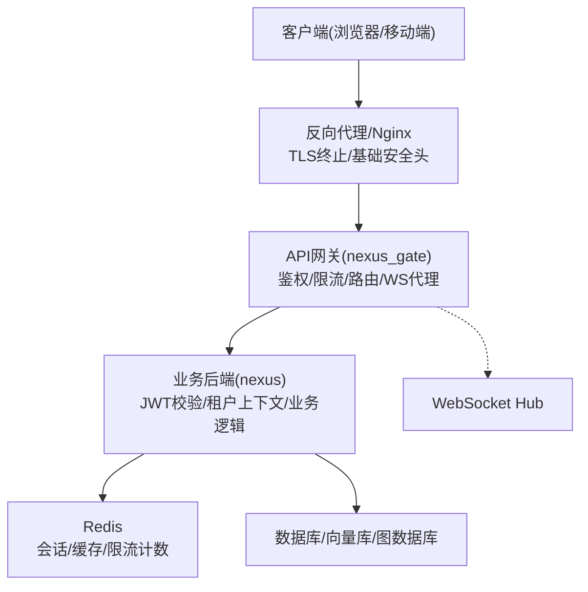
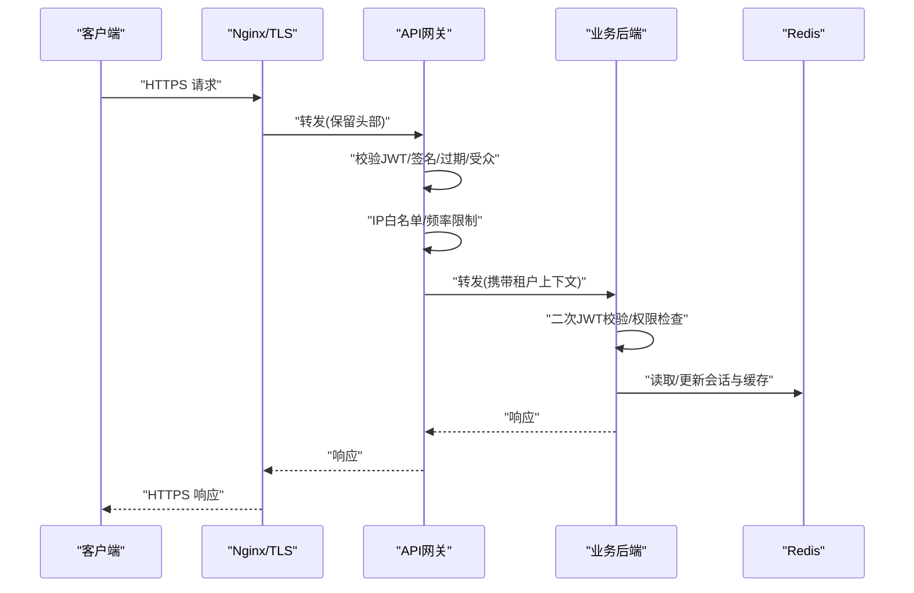
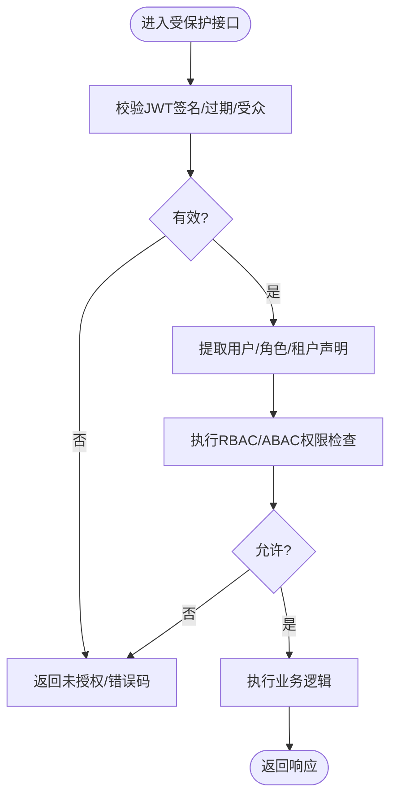
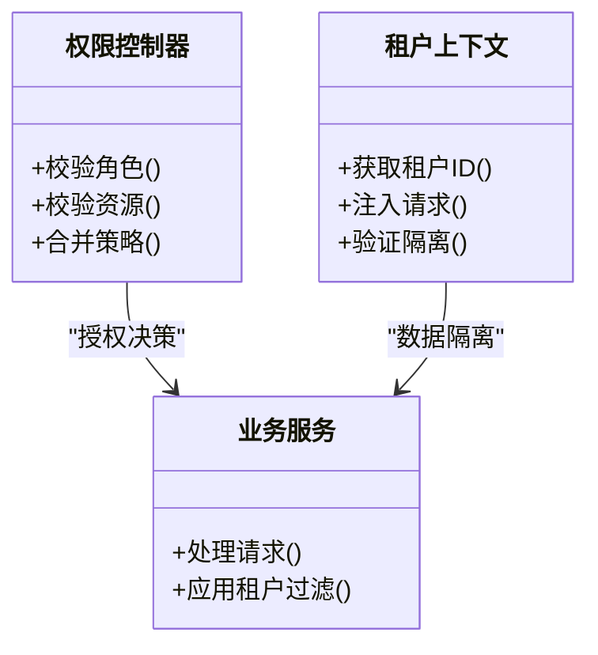
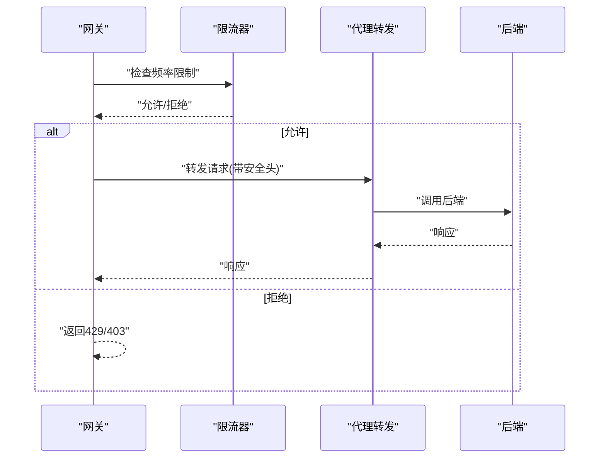
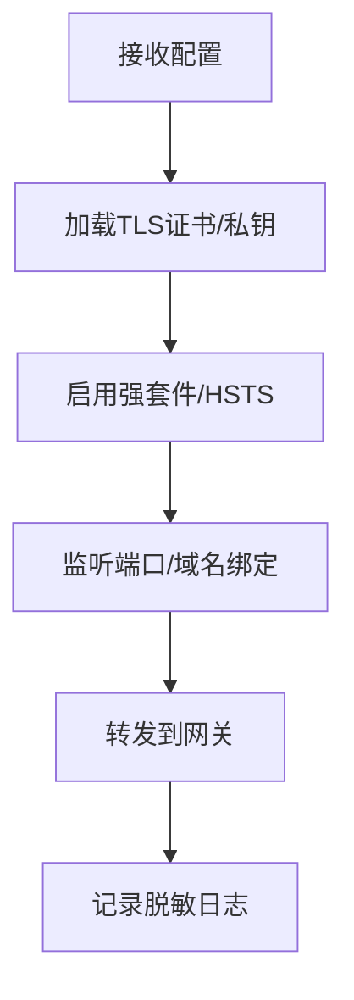
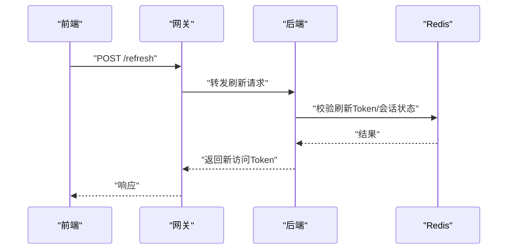
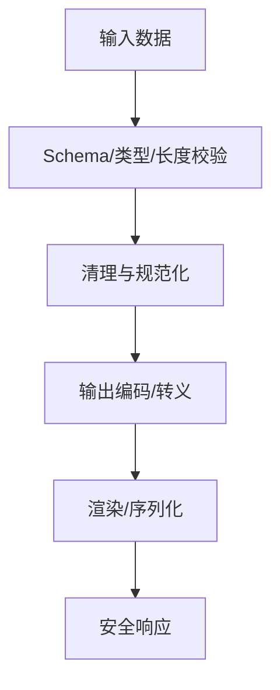
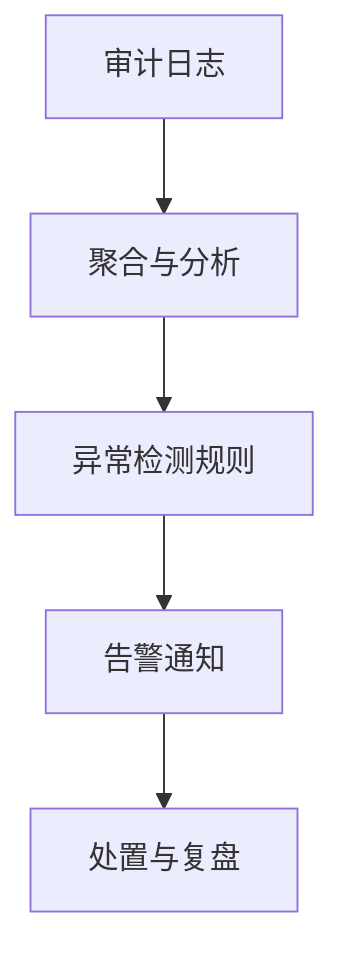
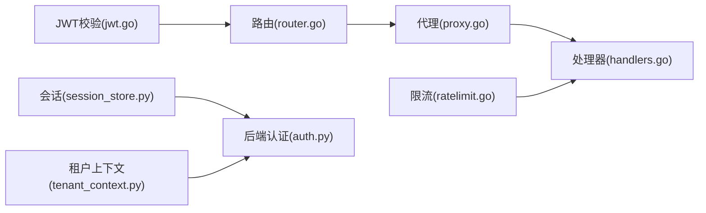

# 安全架构设计

<cite>
**本文引用的文件**   
- [backend_design/nexus_gate/internal/auth/jwt.go](file://backend_design/nexus_gate/internal/auth/jwt.go)
- [backend_design/nexus_gate/internal/ratelimit/ratelimit.go](file://backend_design/nexus_gate/internal/ratelimit/ratelimit.go)
- [backend_design/nexus_gate/internal/handlers/handlers.go](file://backend_design/nexus_gate/internal/handlers/handlers.go)
- [backend_design/nexus_gate/internal/proxy/proxy.go](file://backend_design/nexus_gate/internal/proxy/proxy.go)
- [backend_design/nexus_gate/internal/router/router.go](file://backend_design/nexus_gate/internal/router/router.go)
- [backend_design/nexus/core/auth.py](file://backend_design/nexus/core/auth.py)
- [backend_design/nexus/core/tenant_context.py](file://backend_design/nexus/core/tenant_context.py)
- [backend_design/nexus/middleware/session_store.py](file://backend_design/nexus/middleware/session_store.py)
- [backend_design/nexus/api/routes/auth.py](file://backend_design/nexus/api/routes/auth.py)
- [backend_design/nexus/config.py](file://backend_design/nexus/config.py)
- [backend_design/nexus/core/logger.py](file://backend_design/nexus/core/logger.py)
- [backend_design/nexus/core/exceptions.py](file://backend_design/nexus/core/exceptions.py)
- [backend_design/nexus/middleware/rate_limiter.py](file://backend_design/nexus/middleware/rate_limiter.py)
- [backend_design/nexus/middleware/redis_cache.py](file://backend_design/nexus/middleware/redis_cache.py)
- [config/nginx/...](file://config/nginx/)
</cite>

## 目录
1. [引言](#引言)
2. [项目结构](#项目结构)
3. [核心组件](#核心组件)
4. [架构总览](#架构总览)
5. [详细组件分析](#详细组件分析)
6. [依赖关系分析](#依赖关系分析)
7. [性能与安全权衡](#性能与安全权衡)
8. [故障排查指南](#故障排查指南)
9. [结论](#结论)
10. [附录](#附录)

## 引言
本安全架构设计文档面向NexusCockpit系统，围绕多层安全防护体系展开，覆盖身份认证、权限控制、租户隔离、API网关策略、数据传输与密钥管理、会话与Token生命周期、输入输出防护、威胁建模与风险评估、审计日志与告警、以及合规与隐私保护。目标是提供可落地的安全方案与实施要点，帮助研发与运维团队在开发与部署中落实一致的安全基线。

## 项目结构
NexusCockpit采用前后端分离与微服务化演进路线：
- API网关（Go）：负责鉴权、限流、转发、WebSocket代理等边界安全能力。
- 业务后端（Python）：实现JWT校验、租户上下文注入、会话存储、业务逻辑与数据访问。
- 前端（Next.js）：通过HTTPS访问网关，安全地持有短期Token并刷新长Token。
- 配置与基础设施：Nginx/TLS终止、Redis缓存与会话存储、Prometheus/Grafana/Loki监控与日志。

[本节为概念性结构说明，不直接分析具体文件]

## 核心组件
- 网关层安全
  - JWT签发与校验：网关侧统一解析与校验签名、过期时间、受众与发行者等声明。
  - 请求频率限制：基于IP/用户维度的令牌桶或滑动窗口限流，防止滥用与暴力破解。
  - 路由与代理：将受保护的请求转发至后端，透传必要的安全上下文（如租户ID）。
- 后端安全
  - JWT校验与权限控制：对受保护接口进行二次校验，结合角色/资源ACL。
  - 租户隔离：通过租户上下文贯穿请求链路，确保数据访问按租户隔离。
  - 会话管理：支持无状态JWT与有状态会话混合模式，兼顾安全性与可用性。
- 传输与密钥
  - HTTPS/TLS：强制加密通道，禁用弱协议与套件。
  - 敏感信息脱敏：日志与指标中避免泄露敏感字段。
  - 密钥管理：集中化密钥配置与轮换策略。

**章节来源**
- [backend_design/nexus_gate/internal/auth/jwt.go](file://backend_design/nexus_gate/internal/auth/jwt.go)
- [backend_design/nexus_gate/internal/ratelimit/ratelimit.go](file://backend_design/nexus_gate/internal/ratelimit/ratelimit.go)
- [backend_design/nexus_gate/internal/handlers/handlers.go](file://backend_design/nexus_gate/internal/handlers/handlers.go)
- [backend_design/nexus_gate/internal/proxy/proxy.go](file://backend_design/nexus_gate/internal/proxy/proxy.go)
- [backend_design/nexus_gate/internal/router/router.go](file://backend_design/nexus_gate/internal/router/router.go)
- [backend_design/nexus/core/auth.py](file://backend_design/nexus/core/auth.py)
- [backend_design/nexus/core/tenant_context.py](file://backend_design/nexus/core/tenant_context.py)
- [backend_design/nexus/middleware/session_store.py](file://backend_design/nexus/middleware/session_store.py)
- [backend_design/nexus/config.py](file://backend_design/nexus/config.py)

## 架构总览
下图展示从客户端到后端的端到端安全路径，包括TLS终止、网关鉴权与限流、后端JWT校验与租户上下文注入、以及会话与缓存的交互。

**图表来源**
- [backend_design/nexus_gate/internal/auth/jwt.go](file://backend_design/nexus_gate/internal/auth/jwt.go)
- [backend_design/nexus_gate/internal/ratelimit/ratelimit.go](file://backend_design/nexus_gate/internal/ratelimit/ratelimit.go)
- [backend_design/nexus_gate/internal/handlers/handlers.go](file://backend_design/nexus_gate/internal/handlers/handlers.go)
- [backend_design/nexus_gate/internal/proxy/proxy.go](file://backend_design/nexus_gate/internal/proxy/proxy.go)
- [backend_design/nexus/core/auth.py](file://backend_design/nexus/core/auth.py)
- [backend_design/nexus/core/tenant_context.py](file://backend_design/nexus/core/tenant_context.py)
- [backend_design/nexus/middleware/session_store.py](file://backend_design/nexus/middleware/session_store.py)

**章节来源**
- [backend_design/nexus_gate/internal/auth/jwt.go](file://backend_design/nexus_gate/internal/auth/jwt.go)
- [backend_design/nexus_gate/internal/ratelimit/ratelimit.go](file://backend_design/nexus_gate/internal/ratelimit/ratelimit.go)
- [backend_design/nexus/core/auth.py](file://backend_design/nexus/core/auth.py)
- [backend_design/nexus/core/tenant_context.py](file://backend_design/nexus/core/tenant_context.py)
- [backend_design/nexus/middleware/session_store.py](file://backend_design/nexus/middleware/session_store.py)

## 详细组件分析

### 身份认证与授权（JWT）
- 网关侧JWT校验
  - 校验签名、算法、发行者、受众、过期时间；拒绝无效或过期的Token。
  - 将用户标识、角色、租户ID等声明注入下游请求头。
- 后端侧JWT校验与权限控制
  - 对受保护接口再次校验JWT，确保跨进程一致性。
  - 基于RBAC/ABAC的资源级权限判断，结合租户上下文进行数据隔离。
- Token类型与生命周期
  - 短时效访问Token用于高频调用，长时效刷新Token用于续期。
  - 刷新流程需校验刷新Token有效性、设备指纹与环境一致性。

**图表来源**
- [backend_design/nexus_gate/internal/auth/jwt.go](file://backend_design/nexus_gate/internal/auth/jwt.go)
- [backend_design/nexus/core/auth.py](file://backend_design/nexus/core/auth.py)

**章节来源**
- [backend_design/nexus_gate/internal/auth/jwt.go](file://backend_design/nexus_gate/internal/auth/jwt.go)
- [backend_design/nexus/core/auth.py](file://backend_design/nexus/core/auth.py)

### 权限控制与租户隔离
- 权限模型
  - 基于角色的访问控制（RBAC），可扩展为属性型（ABAC）以支持更细粒度策略。
  - 资源维度包含模块、操作、数据范围（如车辆ID、会话ID）。
- 租户隔离
  - 通过租户上下文贯穿请求链路，所有数据查询自动附加租户过滤条件。
  - 跨租户访问一律拒绝，并在审计日志中记录异常尝试。

**图表来源**
- [backend_design/nexus/core/auth.py](file://backend_design/nexus/core/auth.py)
- [backend_design/nexus/core/tenant_context.py](file://backend_design/nexus/core/tenant_context.py)

**章节来源**
- [backend_design/nexus/core/auth.py](file://backend_design/nexus/core/auth.py)
- [backend_design/nexus/core/tenant_context.py](file://backend_design/nexus/core/tenant_context.py)

### API网关安全策略
- 请求验证
  - 严格校验Content-Type、长度、方法白名单、路径参数格式。
  - 拒绝非法或不完整请求，减少攻击面。
- IP白名单
  - 对管理接口与内部服务调用启用源IP白名单。
  - 动态黑名单机制应对恶意扫描与爆破。
- 请求频率限制
  - 基于IP与用户的速率限制，防止暴力破解与资源耗尽。
  - 分级限流：登录、刷新、普通接口差异化阈值。
- SQL注入防护
  - 使用参数化查询与ORM，禁止拼接SQL。
  - 输入校验与类型转换，拒绝危险字符与异常长度。

**图表来源**
- [backend_design/nexus_gate/internal/ratelimit/ratelimit.go](file://backend_design/nexus_gate/internal/ratelimit/ratelimit.go)
- [backend_design/nexus_gate/internal/handlers/handlers.go](file://backend_design/nexus_gate/internal/handlers/handlers.go)
- [backend_design/nexus_gate/internal/proxy/proxy.go](file://backend_design/nexus_gate/internal/proxy/proxy.go)
- [backend_design/nexus/middleware/rate_limiter.py](file://backend_design/nexus/middleware/rate_limiter.py)

**章节来源**
- [backend_design/nexus_gate/internal/ratelimit/ratelimit.go](file://backend_design/nexus_gate/internal/ratelimit/ratelimit.go)
- [backend_design/nexus_gate/internal/handlers/handlers.go](file://backend_design/nexus_gate/internal/handlers/handlers.go)
- [backend_design/nexus_gate/internal/proxy/proxy.go](file://backend_design/nexus_gate/internal/proxy/proxy.go)
- [backend_design/nexus/middleware/rate_limiter.py](file://backend_design/nexus/middleware/rate_limiter.py)

### 数据传输安全与密钥管理
- HTTPS/TLS
  - 强制TLS 1.2+，禁用弱套件与旧协议，启用HSTS与证书固定（可选）。
  - Nginx作为TLS终止点，统一证书管理与SNI。
- 敏感信息脱敏
  - 日志与指标中屏蔽密码、Token、手机号、身份证号等敏感字段。
  - 结构化日志便于检索与审计。
- 密钥管理
  - 集中化配置（环境变量/密钥管理服务），避免硬编码。
  - 定期轮换与版本化，支持灰度切换与回滚。

**图表来源**
- [config/nginx/...](file://config/nginx/)
- [backend_design/nexus/config.py](file://backend_design/nexus/config.py)
- [backend_design/nexus/core/logger.py](file://backend_design/nexus/core/logger.py)

**章节来源**
- [backend_design/nexus/config.py](file://backend_design/nexus/config.py)
- [backend_design/nexus/core/logger.py](file://backend_design/nexus/core/logger.py)
- [config/nginx/...](file://config/nginx/)

### 会话管理与Token刷新
- 会话存储
  - 使用Redis存储会话元数据与黑名单，支持分布式共享与快速失效。
  - 会话绑定设备指纹与IP段，增强抗劫持能力。
- Token刷新
  - 刷新接口需校验刷新Token有效性、环境一致性与最近活动。
  - 刷新成功后生成新访问Token，并记录审计事件。
- 安全存储
  - 前端仅保存短期访问Token于内存或HttpOnly Cookie。
  - 刷新Token采用更安全存储策略（服务端优先）。

**图表来源**
- [backend_design/nexus/middleware/session_store.py](file://backend_design/nexus/middleware/session_store.py)
- [backend_design/nexus/api/routes/auth.py](file://backend_design/nexus/api/routes/auth.py)

**章节来源**
- [backend_design/nexus/middleware/session_store.py](file://backend_design/nexus/middleware/session_store.py)
- [backend_design/nexus/api/routes/auth.py](file://backend_design/nexus/api/routes/auth.py)

### 输入验证、输出编码与XSS防护
- 输入验证
  - 严格的Schema校验、类型转换、长度与枚举约束。
  - 拒绝异常结构与潜在危险字符。
- 输出编码
  - 模板渲染时自动转义，避免原生HTML注入。
  - JSON响应统一序列化，禁止直接拼接字符串。
- XSS防护
  - 设置安全响应头（X-Content-Type-Options、X-Frame-Options、Content-Security-Policy）。
  - 前端启用严格模式与内容安全策略。

[本节为通用安全实践说明，不直接分析具体文件]

### 安全威胁模型与风险评估
- 威胁分类
  - 认证绕过、Token伪造、越权访问、会话劫持、重放攻击、注入攻击、DDoS、信息泄露。
- 风险矩阵
  - 高影响：认证与权限缺陷、数据泄露。
  - 中影响：频率限制不足、日志敏感信息。
  - 低影响：非关键接口的输入校验缺失。
- 缓解措施
  - 多因子认证（可选）、最小权限原则、输入输出双重校验、全链路审计与告警。

[本节为概念性威胁建模，不直接分析具体文件]

### 安全审计日志、异常检测与告警
- 审计日志
  - 记录认证事件、权限决策、租户访问、刷新与失败原因。
  - 脱敏敏感字段，保留必要上下文（用户、租户、IP、UA）。
- 异常检测
  - 基于规则的异常识别（频繁失败、异常地理位置、异常设备）。
  - 指标聚合与趋势分析，识别潜在攻击。
- 告警机制
  - 关键事件实时告警（认证失败率、限流触发、异常流量）。
  - 与监控系统集成（Prometheus/Grafana/Loki）。

**图表来源**
- [backend_design/nexus/core/logger.py](file://backend_design/nexus/core/logger.py)
- [backend_design/nexus/core/exceptions.py](file://backend_design/nexus/core/exceptions.py)

**章节来源**
- [backend_design/nexus/core/logger.py](file://backend_design/nexus/core/logger.py)
- [backend_design/nexus/core/exceptions.py](file://backend_design/nexus/core/exceptions.py)

### 合规性与隐私保护
- 合规要求
  - 遵循数据安全法与个人信息保护法，最小化收集、明确目的、用户同意。
  - 跨境数据传输评估与审批，本地化存储优先。
- 隐私保护
  - 数据去标识化与匿名化处理，保留最小必要信息。
  - 数据留存周期与删除策略，支持用户撤回与删除请求。
- 审计与追溯
  - 完整的访问与操作审计，满足监管抽查与取证需求。

[本节为合规与隐私概念说明，不直接分析具体文件]

## 依赖关系分析
- 网关与后端耦合点
  - 通过HTTP头传递租户与用户声明，约定一致的Claim命名与校验规则。
  - 限流与缓存依赖Redis，需保证高可用与幂等。
- 外部依赖
  - TLS证书与密钥由配置中心或KMS管理。
  - 监控与日志平台用于观测与告警。

**图表来源**
- [backend_design/nexus_gate/internal/auth/jwt.go](file://backend_design/nexus_gate/internal/auth/jwt.go)
- [backend_design/nexus_gate/internal/router/router.go](file://backend_design/nexus_gate/internal/router/router.go)
- [backend_design/nexus_gate/internal/proxy/proxy.go](file://backend_design/nexus_gate/internal/proxy/proxy.go)
- [backend_design/nexus_gate/internal/handlers/handlers.go](file://backend_design/nexus_gate/internal/handlers/handlers.go)
- [backend_design/nexus_gate/internal/ratelimit/ratelimit.go](file://backend_design/nexus_gate/internal/ratelimit/ratelimit.go)
- [backend_design/nexus/core/auth.py](file://backend_design/nexus/core/auth.py)
- [backend_design/nexus/core/tenant_context.py](file://backend_design/nexus/core/tenant_context.py)
- [backend_design/nexus/middleware/session_store.py](file://backend_design/nexus/middleware/session_store.py)

**章节来源**
- [backend_design/nexus_gate/internal/auth/jwt.go](file://backend_design/nexus_gate/internal/auth/jwt.go)
- [backend_design/nexus_gate/internal/router/router.go](file://backend_design/nexus_gate/internal/router/router.go)
- [backend_design/nexus_gate/internal/proxy/proxy.go](file://backend_design/nexus_gate/internal/proxy/proxy.go)
- [backend_design/nexus_gate/internal/handlers/handlers.go](file://backend_design/nexus_gate/internal/handlers/handlers.go)
- [backend_design/nexus_gate/internal/ratelimit/ratelimit.go](file://backend_design/nexus_gate/internal/ratelimit/ratelimit.go)
- [backend_design/nexus/core/auth.py](file://backend_design/nexus/core/auth.py)
- [backend_design/nexus/core/tenant_context.py](file://backend_design/nexus/core/tenant_context.py)
- [backend_design/nexus/middleware/session_store.py](file://backend_design/nexus/middleware/session_store.py)

## 性能与安全权衡
- 鉴权开销
  - 网关与后端双重校验增加延迟，建议缓存公钥与声明，减少重复计算。
- 限流策略
  - 精细化限流提升用户体验，但需平衡误杀与漏放。
- 会话存储
  - Redis高可用与分区策略影响吞吐与一致性，需根据业务SLA选择。
- 日志与审计
  - 全量日志带来I/O压力，建议采样与分层记录。

[本节为通用性能讨论，不直接分析具体文件]

## 故障排查指南
- 常见问题
  - 认证失败：检查JWT签名、算法、过期时间与受众声明。
  - 限流触发：查看限流计数器与阈值配置，确认是否被误判。
  - 会话丢失：检查Redis连通性与Key过期策略。
- 诊断步骤
  - 查看网关与后端日志，定位错误码与堆栈。
  - 核对Nginx/TLS配置与证书有效期。
  - 复现请求并抓取网络包，确认头部与载荷完整性。

**章节来源**
- [backend_design/nexus/core/exceptions.py](file://backend_design/nexus/core/exceptions.py)
- [backend_design/nexus/core/logger.py](file://backend_design/nexus/core/logger.py)

## 结论
NexusCockpit的安全架构以“边界防护+纵深防御”为核心，通过网关层的JWT校验、限流与代理，结合后端的权限控制与租户隔离，形成多层次防护体系。配合HTTPS/TLS、敏感信息脱敏、密钥管理与审计告警，能够有效降低常见安全风险。建议在后续迭代中引入更细粒度的策略引擎与自动化威胁检测，持续提升整体安全水位。

[本节为总结性内容，不直接分析具体文件]

## 附录
- 术语表
  - JWT：JSON Web Token，用于身份与授权的标准化令牌。
  - RBAC/ABAC：基于角色/属性的访问控制模型。
  - HSTS：HTTP Strict Transport Security，强制HTTPS访问。
- 参考配置
  - Nginx TLS与安全头配置示例路径：[config/nginx/...](file://config/nginx/)
  - 后端配置与日志脱敏：[backend_design/nexus/config.py](file://backend_design/nexus/config.py)、[backend_design/nexus/core/logger.py](file://backend_design/nexus/core/logger.py)

[本节为补充信息，不直接分析具体文件]