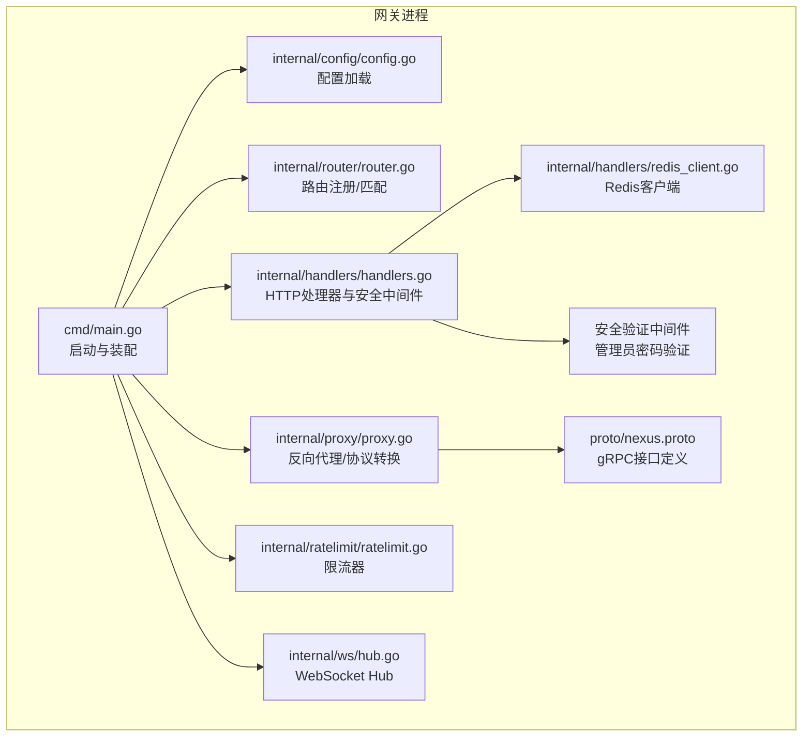
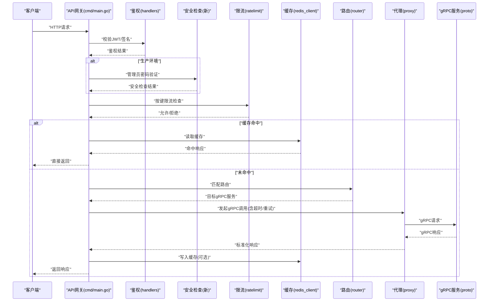
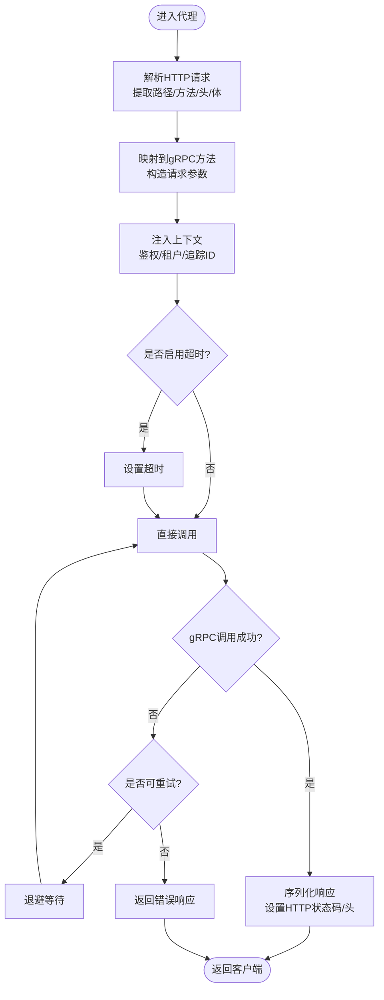
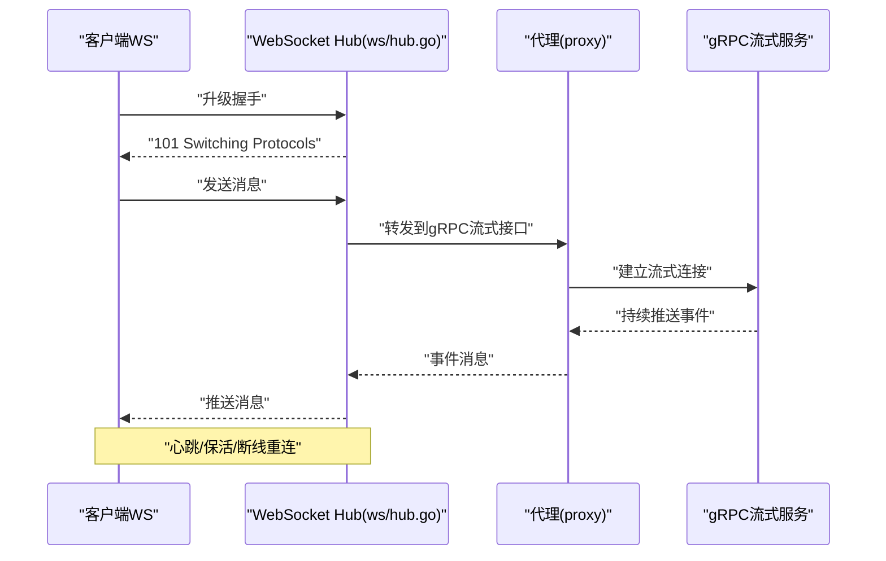
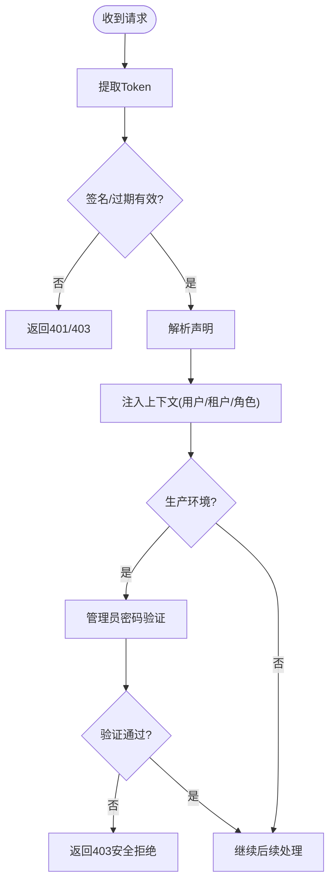
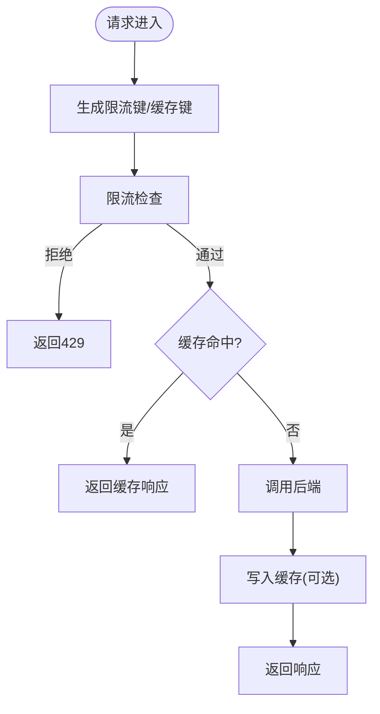
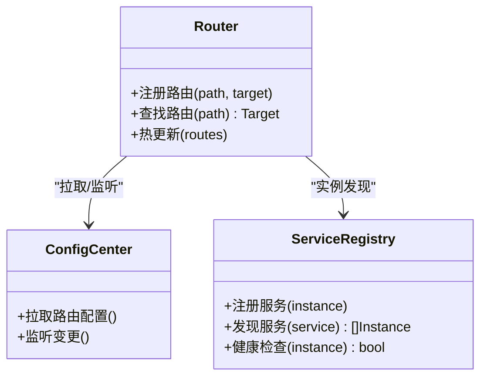
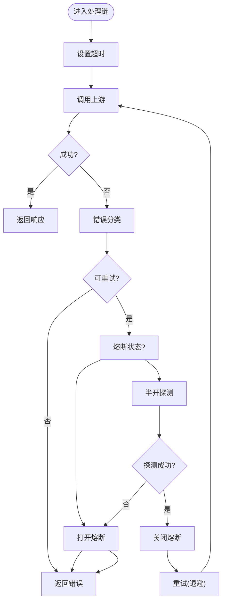
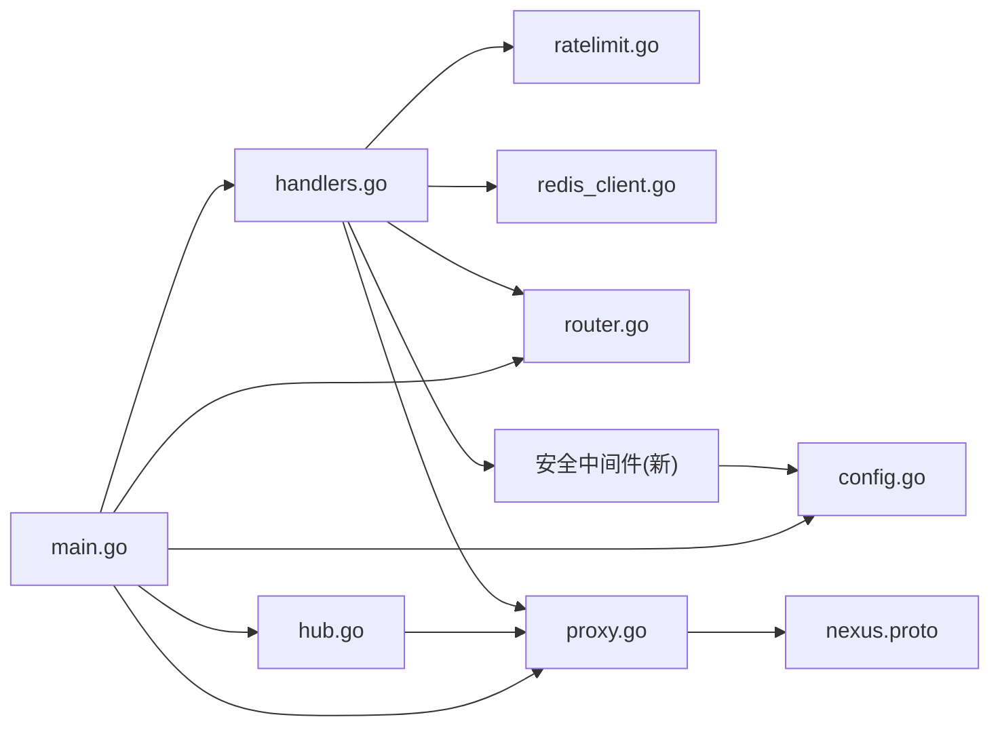

# API网关服务设计

<cite>
**本文引用的文件**   
- [backend_design/nexus_gate/cmd/main.go](file://backend_design/nexus_gate/cmd/main.go)
- [backend_design/nexus_gate/internal/config/config.go](file://backend_design/nexus_gate/internal/config/config.go)
- [backend_design/nexus_gate/internal/handlers/handlers.go](file://backend_design/nexus_gate/internal/handlers/handlers.go)
- [backend_design/nexus_gate/internal/handlers/redis_client.go](file://backend_design/nexus_gate/internal/handlers/redis_client.go)
- [backend_design/nexus_gate/internal/proxy/proxy.go](file://backend_design/nexus_gate/internal/proxy/proxy.go)
- [backend_design/nexus_gate/internal/ratelimit/ratelimit.go](file://backend_design/nexus_gate/internal/ratelimit/ratelimit.go)
- [backend_design/nexus_gate/internal/router/router.go](file://backend_design/nexus_gate/internal/router/router.go)
- [backend_design/nexus_gate/internal/ws/hub.go](file://backend_design/nexus_gate/internal/ws/hub.go)
- [backend_design/nexus_gate/proto/nexus.proto](file://backend_design/nexus_gate/proto/nexus.proto)
</cite>

## 更新摘要
**变更内容**   
- 新增管理员密码验证机制，增强生产环境安全检查
- 改进请求处理中间件集成，提升安全性与健壮性
- 强化认证流程的安全控制与错误处理
- 优化安全配置管理策略

## 目录
1. [简介](#简介)
2. [项目结构](#项目结构)
3. [核心组件](#核心组件)
4. [架构总览](#架构总览)
5. [详细组件分析](#详细组件分析)
6. [依赖关系分析](#依赖关系分析)
7. [性能考虑](#性能考虑)
8. [故障排查指南](#故障排查指南)
9. [结论](#结论)
10. [附录](#附录)

## 简介
本设计文档面向NexusCockpit的Go API网关服务，聚焦以下职责与能力：
- 请求路由与负载均衡
- HTTP到gRPC协议转换
- WebSocket连接管理与代理转发
- JWT认证集成、请求限流与缓存策略
- **管理员密码验证机制与安全加固**
- 路由配置管理、动态路由更新与服务发现
- 错误处理、超时控制与重试策略
- 性能优化建议与监控指标采集方案

该网关作为统一入口，将外部HTTP/WS流量转换为内部gRPC调用，提供鉴权、限流、缓存、可观测性等横切能力，并增强了生产环境的安全检查机制。

## 项目结构
Go网关位于 backend_design/nexus_gate 目录下，采用分层与按功能模块组织的方式：
- cmd/main.go：进程启动、配置加载、中间件装配、服务监听
- internal/config：配置模型与加载逻辑
- internal/handlers：HTTP处理器、Redis客户端封装、**安全中间件集成**
- internal/proxy：反向代理与协议转换（HTTP/gRPC）
- internal/ratelimit：令牌桶/滑动窗口等限流实现
- internal/router：静态/动态路由表、匹配与分发
- internal/ws：WebSocket Hub，连接与会话管理
- proto/nexus.proto：gRPC接口定义

**图表来源**
- [backend_design/nexus_gate/cmd/main.go](file://backend_design/nexus_gate/cmd/main.go)
- [backend_design/nexus_gate/internal/config/config.go](file://backend_design/nexus_gate/internal/config/config.go)
- [backend_design/nexus_gate/internal/router/router.go](file://backend_design/nexus_gate/internal/router/router.go)
- [backend_design/nexus_gate/internal/handlers/handlers.go](file://backend_design/nexus_gate/internal/handlers/handlers.go)
- [backend_design/nexus_gate/internal/handlers/redis_client.go](file://backend_design/nexus_gate/internal/handlers/redis_client.go)
- [backend_design/nexus_gate/internal/proxy/proxy.go](file://backend_design/nexus_gate/internal/proxy/proxy.go)
- [backend_design/nexus_gate/internal/ratelimit/ratelimit.go](file://backend_design/nexus_gate/internal/ratelimit/ratelimit.go)
- [backend_design/nexus_gate/internal/ws/hub.go](file://backend_design/nexus_gate/internal/ws/hub.go)
- [backend_design/nexus_gate/proto/nexus.proto](file://backend_design/nexus_gate/proto/nexus.proto)

**章节来源**
- [backend_design/nexus_gate/cmd/main.go](file://backend_design/nexus_gate/cmd/main.go)
- [backend_design/nexus_gate/internal/config/config.go](file://backend_design/nexus_gate/internal/config/config.go)
- [backend_design/nexus_gate/internal/router/router.go](file://backend_design/nexus_gate/internal/router/router.go)
- [backend_design/nexus_gate/internal/handlers/handlers.go](file://backend_design/nexus_gate/internal/handlers/handlers.go)
- [backend_design/nexus_gate/internal/handlers/redis_client.go](file://backend_design/nexus_gate/internal/handlers/redis_client.go)
- [backend_design/nexus_gate/internal/proxy/proxy.go](file://backend_design/nexus_gate/internal/proxy/proxy.go)
- [backend_design/nexus_gate/internal/ratelimit/ratelimit.go](file://backend_design/nexus_gate/internal/ratelimit/ratelimit.go)
- [backend_design/nexus_gate/internal/ws/hub.go](file://backend_design/nexus_gate/internal/ws/hub.go)
- [backend_design/nexus_gate/proto/nexus.proto](file://backend_design/nexus_gate/proto/nexus.proto)

## 核心组件
- 配置中心（config）
  - 负责加载应用配置（端口、后端gRPC地址、JWT密钥、限流参数、缓存开关等），为其他组件提供只读配置视图。
- 路由（router）
  - 维护路径到目标服务的映射，支持前缀/精确匹配；可扩展为动态更新（如从配置中心或注册中心拉取）。
- 处理器（handlers）
  - 接收HTTP请求，执行鉴权、限流、缓存命中检查、上下文注入，并委派给代理层。
  - **新增安全中间件集成，支持管理员密码验证和生产环境安全检查**。
- 代理（proxy）
  - 根据路由选择目标gRPC服务，完成HTTP到gRPC的协议转换、载荷编解码、头映射与响应回写；对长连接场景进行特殊处理。
- 限流（ratelimit）
  - 基于键（如用户ID、IP、租户）进行速率限制，返回拒绝或放行信号。
- WebSocket Hub（ws）
  - 管理WebSocket连接生命周期、消息广播与订阅，必要时与后端gRPC流式接口对接。
- Redis客户端（handlers/redis_client）
  - 提供缓存读写、分布式锁、会话存储等能力，供处理器与代理使用。

**章节来源**
- [backend_design/nexus_gate/internal/config/config.go](file://backend_design/nexus_gate/internal/config/config.go)
- [backend_design/nexus_gate/internal/router/router.go](file://backend_design/nexus_gate/internal/router/router.go)
- [backend_design/nexus_gate/internal/handlers/handlers.go](file://backend_design/nexus_gate/internal/handlers/handlers.go)
- [backend_design/nexus_gate/internal/handlers/redis_client.go](file://backend_design/nexus_gate/internal/handlers/redis_client.go)
- [backend_design/nexus_gate/internal/proxy/proxy.go](file://backend_design/nexus_gate/internal/proxy/proxy.go)
- [backend_design/nexus_gate/internal/ratelimit/ratelimit.go](file://backend_design/nexus_gate/internal/ratelimit/ratelimit.go)
- [backend_design/nexus_gate/internal/ws/hub.go](file://backend_design/nexus_gate/internal/ws/hub.go)

## 架构总览
整体数据流：客户端HTTP/WS请求进入网关，经鉴权与限流后，由路由器选择目标服务；代理层将HTTP请求转换为gRPC调用，读取后端响应并返回；WebSocket通过Hub维持双向通道。**新增的安全验证环节在生产环境中强制执行管理员密码验证**。

**图表来源**
- [backend_design/nexus_gate/cmd/main.go](file://backend_design/nexus_gate/cmd/main.go)
- [backend_design/nexus_gate/internal/handlers/handlers.go](file://backend_design/nexus_gate/internal/handlers/handlers.go)
- [backend_design/nexus_gate/internal/ratelimit/ratelimit.go](file://backend_design/nexus_gate/internal/ratelimit/ratelimit.go)
- [backend_design/nexus_gate/internal/handlers/redis_client.go](file://backend_design/nexus_gate/internal/handlers/redis_client.go)
- [backend_design/nexus_gate/internal/router/router.go](file://backend_design/nexus_gate/internal/router/router.go)
- [backend_design/nexus_gate/internal/proxy/proxy.go](file://backend_design/nexus_gate/internal/proxy/proxy.go)
- [backend_design/nexus_gate/proto/nexus.proto](file://backend_design/nexus_gate/proto/nexus.proto)

## 详细组件分析

### 组件A：HTTP到gRPC协议转换与代理
- 职责
  - 解析HTTP路径与方法，映射到proto定义的gRPC方法与参数
  - 构建gRPC请求上下文（包含鉴权信息、追踪ID、租户标识等）
  - 设置超时、重试、熔断等策略
  - 将gRPC响应序列化为HTTP响应体与头部
- 关键流程
  - 请求入站 -> 鉴权/限流/缓存 -> 路由匹配 -> 代理构造gRPC请求 -> 调用后端 -> 响应回写
- 异常与边界
  - 超时、网络抖动、后端不可用时的降级与重试
  - 大报文与流式响应的背压处理
  - 头字段大小写与保留字冲突的处理

**图表来源**
- [backend_design/nexus_gate/internal/proxy/proxy.go](file://backend_design/nexus_gate/internal/proxy/proxy.go)
- [backend_design/nexus_gate/proto/nexus.proto](file://backend_design/nexus_gate/proto/nexus.proto)

**章节来源**
- [backend_design/nexus_gate/internal/proxy/proxy.go](file://backend_design/nexus_gate/internal/proxy/proxy.go)
- [backend_design/nexus_gate/proto/nexus.proto](file://backend_design/nexus_gate/proto/nexus.proto)

### 组件B：WebSocket连接管理与代理转发
- 职责
  - 建立WebSocket握手，分配连接ID，加入Hub
  - 将前端消息转发至后端gRPC流式接口（如有）
  - 将后端推送消息广播给订阅者
  - 处理断线重连、心跳保活、资源清理
- 关键流程
  - 握手 -> 注册连接 -> 消息路由 -> 双向转发 -> 关闭清理

**图表来源**
- [backend_design/nexus_gate/internal/ws/hub.go](file://backend_design/nexus_gate/internal/ws/hub.go)
- [backend_design/nexus_gate/internal/proxy/proxy.go](file://backend_design/nexus_gate/internal/proxy/proxy.go)
- [backend_design/nexus_gate/proto/nexus.proto](file://backend_design/nexus_gate/proto/nexus.proto)

**章节来源**
- [backend_design/nexus_gate/internal/ws/hub.go](file://backend_design/nexus_gate/internal/ws/hub.go)
- [backend_design/nexus_gate/internal/proxy/proxy.go](file://backend_design/nexus_gate/internal/proxy/proxy.go)
- [backend_design/nexus_gate/proto/nexus.proto](file://backend_design/nexus_gate/proto/nexus.proto)

### 组件C：JWT认证集成与安全加固
- 职责
  - 从请求头/查询参数中获取Token
  - 验证签名、过期时间、算法白名单
  - 解析声明（用户ID、租户、角色）并注入上下文
  - **新增管理员密码验证机制，支持生产环境安全检查**
- 安全要点
  - 仅接受强算法（如RS256/ES256）
  - 严格校验issuer、audience、scope
  - 失败时快速返回401/403
  - **生产环境强制管理员密码验证**
  - **增强的请求处理中间件集成**

**图表来源**
- [backend_design/nexus_gate/internal/handlers/handlers.go](file://backend_design/nexus_gate/internal/handlers/handlers.go)

**章节来源**
- [backend_design/nexus_gate/internal/handlers/handlers.go](file://backend_design/nexus_gate/internal/handlers/handlers.go)

### 组件D：请求限流与缓存策略
- 限流
  - 维度：用户ID/IP/租户/接口
  - 算法：令牌桶/滑动窗口
  - 行为：超限返回429，附带重试After
- 缓存
  - 键：规范化后的请求指纹（路径+查询+必要头）
  - 策略：GET幂等接口优先；TTL可配；缓存穿透/雪崩防护
  - 一致性：写操作失效相关缓存

**图表来源**
- [backend_design/nexus_gate/internal/ratelimit/ratelimit.go](file://backend_design/nexus_gate/internal/ratelimit/ratelimit.go)
- [backend_design/nexus_gate/internal/handlers/redis_client.go](file://backend_design/nexus_gate/internal/handlers/redis_client.go)

**章节来源**
- [backend_design/nexus_gate/internal/ratelimit/ratelimit.go](file://backend_design/nexus_gate/internal/ratelimit/ratelimit.go)
- [backend_design/nexus_gate/internal/handlers/redis_client.go](file://backend_design/nexus_gate/internal/handlers/redis_client.go)

### 组件E：路由配置管理与动态更新
- 静态路由
  - 在启动时加载路径到gRPC服务/方法的映射
- 动态路由
  - 支持热更新：从配置中心/注册中心拉取最新路由表
  - 原子替换路由表，避免并发竞争
- 服务发现
  - 结合健康检查与权重，选择最优实例
  - 失败自动剔除，恢复后自动加入

**图表来源**
- [backend_design/nexus_gate/internal/router/router.go](file://backend_design/nexus_gate/internal/router/router.go)

**章节来源**
- [backend_design/nexus_gate/internal/router/router.go](file://backend_design/nexus_gate/internal/router/router.go)

### 组件F：错误处理、超时控制与重试策略
- 错误分类
  - 客户端错误（4xx）、服务端错误（5xx）、上游不可用、超时、限流
- 超时控制
  - 全局默认超时 + 按路由覆盖
  - 区分连接超时、读超时、写超时
- 重试策略
  - 仅对幂等请求重试
  - 指数退避 + 抖动 + 最大重试次数
  - 熔断器防止雪崩

**图表来源**
- [backend_design/nexus_gate/internal/proxy/proxy.go](file://backend_design/nexus_gate/internal/proxy/proxy.go)

**章节来源**
- [backend_design/nexus_gate/internal/proxy/proxy.go](file://backend_design/nexus_gate/internal/proxy/proxy.go)

## 依赖关系分析
- 组件耦合
  - handlers依赖config、ratelimit、redis_client、router、proxy
  - proxy依赖proto定义与后端gRPC客户端
  - ws依赖proxy以桥接gRPC流式接口
  - **新增安全中间件依赖配置中心的admin密码配置**
- 外部依赖
  - Redis用于缓存与分布式限流
  - gRPC服务作为上游
  - 可选：配置中心/注册中心用于动态路由与服务发现

**图表来源**
- [backend_design/nexus_gate/cmd/main.go](file://backend_design/nexus_gate/cmd/main.go)
- [backend_design/nexus_gate/internal/config/config.go](file://backend_design/nexus_gate/internal/config/config.go)
- [backend_design/nexus_gate/internal/handlers/handlers.go](file://backend_design/nexus_gate/internal/handlers/handlers.go)
- [backend_design/nexus_gate/internal/handlers/redis_client.go](file://backend_design/nexus_gate/internal/handlers/redis_client.go)
- [backend_design/nexus_gate/internal/proxy/proxy.go](file://backend_design/nexus_gate/internal/proxy/proxy.go)
- [backend_design/nexus_gate/internal/ratelimit/ratelimit.go](file://backend_design/nexus_gate/internal/ratelimit/ratelimit.go)
- [backend_design/nexus_gate/internal/router/router.go](file://backend_design/nexus_gate/internal/router/router.go)
- [backend_design/nexus_gate/internal/ws/hub.go](file://backend_design/nexus_gate/internal/ws/hub.go)
- [backend_design/nexus_gate/proto/nexus.proto](file://backend_design/nexus_gate/proto/nexus.proto)

**章节来源**
- [backend_design/nexus_gate/cmd/main.go](file://backend_design/nexus_gate/cmd/main.go)
- [backend_design/nexus_gate/internal/config/config.go](file://backend_design/nexus_gate/internal/config/config.go)
- [backend_design/nexus_gate/internal/handlers/handlers.go](file://backend_design/nexus_gate/internal/handlers/handlers.go)
- [backend_design/nexus_gate/internal/handlers/redis_client.go](file://backend_design/nexus_gate/internal/handlers/redis_client.go)
- [backend_design/nexus_gate/internal/proxy/proxy.go](file://backend_design/nexus_gate/internal/proxy/proxy.go)
- [backend_design/nexus_gate/internal/ratelimit/ratelimit.go](file://backend_design/nexus_gate/internal/ratelimit/ratelimit.go)
- [backend_design/nexus_gate/internal/router/router.go](file://backend_design/nexus_gate/internal/router/router.go)
- [backend_design/nexus_gate/internal/ws/hub.go](file://backend_design/nexus_gate/internal/ws/hub.go)
- [backend_design/nexus_gate/proto/nexus.proto](file://backend_design/nexus_gate/proto/nexus.proto)

## 性能考虑
- 连接复用
  - 复用gRPC连接池，减少握手开销
  - 合理设置KeepAlive与IdleTimeout
- 并发与缓冲
  - 使用goroutine池限制并发度，避免OOM
  - 对大响应启用分块传输与流式处理
- 缓存命中率
  - 精细化缓存键，避免过大对象缓存
  - 热点Key预热与防穿透/击穿/雪崩策略
- 限流粒度
  - 细粒度键空间（用户/租户/接口）
  - 本地+分布式两级限流，降低跨节点延迟
- 超时与重试
  - 短超时+快速失败，配合重试提升可用性
  - 指数退避+抖动，避免惊群效应
- **安全验证性能优化**
  - 管理员密码验证缓存，避免重复计算
  - 生产环境安全检查异步化
  - 中间件链优化，减少不必要的验证步骤
- 监控与可观测性
  - 暴露Prometheus指标（QPS、P95/P99延迟、错误率、缓存命中率、限流拒绝数、gRPC下游延迟）
  - 结构化日志与Trace ID透传
  - **新增安全验证指标监控**

## 故障排查指南
- 常见问题定位
  - 鉴权失败：检查JWT算法、密钥、过期时间与声明
  - **安全验证失败：检查管理员密码配置、生产环境标志位**
  - 限流触发：核对限流键与阈值，观察429返回频率
  - 缓存异常：确认键规范、TTL、Redis连通性与内存水位
  - 上游超时：查看gRPC调用耗时分布与重试次数
  - WebSocket断开：检查心跳间隔、网络丢包与Hub容量
- 诊断手段
  - 开启调试日志与Trace ID
  - 导出Prometheus指标与Grafana看板
  - 使用压力测试工具验证瓶颈点
  - **新增安全验证日志分析**

**章节来源**
- [backend_design/nexus_gate/internal/handlers/handlers.go](file://backend_design/nexus_gate/internal/handlers/handlers.go)
- [backend_design/nexus_gate/internal/ratelimit/ratelimit.go](file://backend_design/nexus_gate/internal/ratelimit/ratelimit.go)
- [backend_design/nexus_gate/internal/handlers/redis_client.go](file://backend_design/nexus_gate/internal/handlers/redis_client.go)
- [backend_design/nexus_gate/internal/proxy/proxy.go](file://backend_design/nexus_gate/internal/proxy/proxy.go)
- [backend_design/nexus_gate/internal/ws/hub.go](file://backend_design/nexus_gate/internal/ws/hub.go)

## 结论
本网关以"轻量、可插拔、高可用"为目标，围绕HTTP到gRPC的协议转换为核心，结合鉴权、限流、缓存、路由与服务发现，形成统一的API接入面。**通过新增的管理员密码验证机制和增强的生产环境安全检查，进一步提升了系统的安全性**。通过合理的超时、重试与熔断策略保障稳定性，并通过完善的监控指标体系支撑运维与优化。

## 附录
- 术语
  - 上游：被网关调用的后端gRPC服务
  - 键空间：限流/缓存的命名空间（如用户/租户/接口）
  - 熔断：当错误率超过阈值时快速失败，保护系统
  - **管理员密码验证：生产环境强制的安全验证机制**
- 参考实现位置
  - 启动与装配：[backend_design/nexus_gate/cmd/main.go](file://backend_design/nexus_gate/cmd/main.go)
  - 配置加载：[backend_design/nexus_gate/internal/config/config.go](file://backend_design/nexus_gate/internal/config/config.go)
  - 路由匹配：[backend_design/nexus_gate/internal/router/router.go](file://backend_design/nexus_gate/internal/router/router.go)
  - 处理器与Redis：[backend_design/nexus_gate/internal/handlers/handlers.go](file://backend_design/nexus_gate/internal/handlers/handlers.go)、[backend_design/nexus_gate/internal/handlers/redis_client.go](file://backend_design/nexus_gate/internal/handlers/redis_client.go)
  - 代理与协议转换：[backend_design/nexus_gate/internal/proxy/proxy.go](file://backend_design/nexus_gate/internal/proxy/proxy.go)
  - 限流：[backend_design/nexus_gate/internal/ratelimit/ratelimit.go](file://backend_design/nexus_gate/internal/ratelimit/ratelimit.go)
  - WebSocket Hub：[backend_design/nexus_gate/internal/ws/hub.go](file://backend_design/nexus_gate/internal/ws/hub.go)
  - gRPC接口定义：[backend_design/nexus_gate/proto/nexus.proto](file://backend_design/nexus_gate/proto/nexus.proto)