# 微服务架构设计

<cite>
**本文引用的文件**   
- [backend_design/nexus_gate/cmd/main.go](file://backend_design/nexus_gate/cmd/main.go)
- [backend_design/nexus_gate/internal/config/config.go](file://backend_design/nexus_gate/internal/config/config.go)
- [backend_design/nexus_gate/internal/handlers/handlers.go](file://backend_design/nexus_gate/internal/handlers/handlers.go)
- [backend_design/nexus_gate/internal/proxy/proxy.go](file://backend_design/nexus_gate/internal/proxy/proxy.go)
- [backend_design/nexus_gate/internal/ratelimit/ratelimit.go](file://backend_design/nexus_gate/internal/ratelimit/ratelimit.go)
- [backend_design/nexus_gate/internal/router/router.go](file://backend_design/nexus_gate/internal/router/router.go)
- [backend_design/nexus_gate/internal/ws/hub.go](file://backend_design/nexus_gate/internal/ws/hub.go)
- [backend_design/nexus_gate/proto/nexus.proto](file://backend_design/nexus_gate/proto/nexus.proto)
- [backend_design/nexus/main.py](file://backend_design/nexus/main.py)
- [backend_design/nexus/config.py](file://backend_design/nexus/config.py)
- [backend_design/nexus/api/routes/chat.py](file://backend_design/nexus/api/routes/chat.py)
- [backend_design/nexus/api/routes/health.py](file://backend_design/nexus/api/routes/health.py)
- [backend_design/nexus/core/circuit_breaker.py](file://backend_design/nexus/core/circuit_breaker.py)
- [backend_design/nexus/middleware/session_store.py](file://backend_design/nexus/middleware/session_store.py)
- [backend_design/nexus/middleware/redis_cache.py](file://backend_design/nexus/middleware/redis_cache.py)
- [backend_design/nexus/observability/metrics.py](file://backend_design/nexus/observability/metrics.py)
- [backend_design/nexus/observability/langfuse.py](file://backend_design/nexus/observability/langfuse.py)
- [docker-compose.yml](file://docker-compose.yml)
</cite>

## 目录
1. [引言](#引言)
2. [项目结构](#项目结构)
3. [核心组件](#核心组件)
4. [架构总览](#架构总览)
5. [详细组件分析](#详细组件分析)
6. [依赖关系分析](#依赖关系分析)
7. [性能考量](#性能考量)
8. [故障排查指南](#故障排查指南)
9. [结论](#结论)
10. [附录](#附录)

## 引言
本设计文档面向 NexusCockpit 的微服务架构，聚焦 Go 网关服务与 Python 业务服务的职责分离与设计原则。文档覆盖服务发现、负载均衡、服务间通信机制；API 网关的路由策略、请求转发与响应处理流程；配置管理、环境变量与动态配置更新；服务边界定义、接口契约与数据一致性策略；容错、熔断降级与重试机制；以及监控、日志收集与链路追踪集成方案。目标是帮助读者快速理解系统整体设计与关键实现要点，并在实际部署与运维中具备可操作性。

## 项目结构
NexusCockpit 采用前后端分离与多语言微服务组合：
- Go 网关服务（nexus_gate）：负责外部流量接入、鉴权、限流、路由转发、WebSocket 代理等。
- Python 业务服务（nexus）：提供领域 API、会话与记忆、RAG、ASR/TTS、车辆控制、技能编排、可观测性指标等。
- 前端（frontend_design）：Next.js 应用，通过网关访问后端 API。
- 基础设施与配置：Docker Compose 编排、Prometheus/Grafana/Loki 配置等。

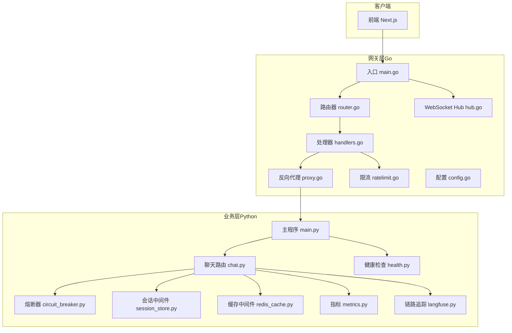

图表来源
- [backend_design/nexus_gate/cmd/main.go](file://backend_design/nexus_gate/cmd/main.go)
- [backend_design/nexus_gate/internal/router/router.go](file://backend_design/nexus_gate/internal/router/router.go)
- [backend_design/nexus_gate/internal/handlers/handlers.go](file://backend_design/nexus_gate/internal/handlers/handlers.go)
- [backend_design/nexus_gate/internal/proxy/proxy.go](file://backend_design/nexus_gate/internal/proxy/proxy.go)
- [backend_design/nexus_gate/internal/ratelimit/ratelimit.go](file://backend_design/nexus_gate/internal/ratelimit/ratelimit.go)
- [backend_design/nexus_gate/internal/ws/hub.go](file://backend_design/nexus_gate/internal/ws/hub.go)
- [backend_design/nexus/main.py](file://backend_design/nexus/main.py)
- [backend_design/nexus/api/routes/chat.py](file://backend_design/nexus/api/routes/chat.py)
- [backend_design/nexus/api/routes/health.py](file://backend_design/nexus/api/routes/health.py)
- [backend_design/nexus/core/circuit_breaker.py](file://backend_design/nexus/core/circuit_breaker.py)
- [backend_design/nexus/middleware/session_store.py](file://backend_design/nexus/middleware/session_store.py)
- [backend_design/nexus/middleware/redis_cache.py](file://backend_design/nexus/middleware/redis_cache.py)
- [backend_design/nexus/observability/metrics.py](file://backend_design/nexus/observability/metrics.py)
- [backend_design/nexus/observability/langfuse.py](file://backend_design/nexus/observability/langfuse.py)

章节来源
- [backend_design/nexus_gate/cmd/main.go](file://backend_design/nexus_gate/cmd/main.go)
- [backend_design/nexus/main.py](file://backend_design/nexus/main.py)
- [docker-compose.yml](file://docker-compose.yml)

## 核心组件
- Go 网关服务
  - 入口与生命周期管理：负责启动 HTTP/WebSocket 服务器、加载配置、注册路由与中间件。
  - 路由与处理器：按路径前缀或方法将请求分发到具体处理器，统一鉴权、限流、日志与错误包装。
  - 反向代理：将内部业务请求透明转发至 Python 服务，支持连接复用与超时控制。
  - WebSocket 代理：维护长连接与会话状态，透传消息并支持广播。
  - 限流：基于令牌桶或滑动窗口对入口流量进行保护。
  - 配置：集中读取环境变量与配置文件，支持热更新。

- Python 业务服务
  - 主程序：初始化框架、挂载路由、启动异步任务与可观测性采集。
  - 路由层：按领域划分 API（如聊天、健康检查、设置、车辆等）。
  - 中间件：会话存储、Redis 缓存、速率限制、租户上下文等。
  - 核心能力：意图识别、RAG、ASR/TTS、车辆控制、技能编排、记忆管理等。
  - 可观测性：指标上报、结构化日志、链路追踪。

章节来源
- [backend_design/nexus_gate/internal/config/config.go](file://backend_design/nexus_gate/internal/config/config.go)
- [backend_design/nexus_gate/internal/handlers/handlers.go](file://backend_design/nexus_gate/internal/handlers/handlers.go)
- [backend_design/nexus_gate/internal/proxy/proxy.go](file://backend_design/nexus_gate/internal/proxy/proxy.go)
- [backend_design/nexus_gate/internal/ratelimit/ratelimit.go](file://backend_design/nexus_gate/internal/ratelimit/ratelimit.go)
- [backend_design/nexus_gate/internal/ws/hub.go](file://backend_design/nexus_gate/internal/ws/hub.go)
- [backend_design/nexus/main.py](file://backend_design/nexus/main.py)
- [backend_design/nexus/api/routes/chat.py](file://backend_design/nexus/api/routes/chat.py)
- [backend_design/nexus/api/routes/health.py](file://backend_design/nexus/api/routes/health.py)
- [backend_design/nexus/middleware/session_store.py](file://backend_design/nexus/middleware/session_store.py)
- [backend_design/nexus/middleware/redis_cache.py](file://backend_design/nexus/middleware/redis_cache.py)
- [backend_design/nexus/observability/metrics.py](file://backend_design/nexus/observability/metrics.py)
- [backend_design/nexus/observability/langfuse.py](file://backend_design/nexus/observability/langfuse.py)

## 架构总览
NexusCockpit 的网关与业务服务解耦清晰：
- 网关承担“非业务”关注点：鉴权、限流、协议适配、转发、WebSocket 代理。
- 业务服务专注领域逻辑：对话、记忆、RAG、语音、车辆控制、技能编排。
- 服务间通信以 HTTP/REST 为主，WebSocket 用于实时交互；可选 gRPC 用于高性能场景（proto 已存在）。
- 配置与环境变量统一管理，支持运行时动态更新。
- 可观测性贯穿全链路：指标、日志、追踪三件套。

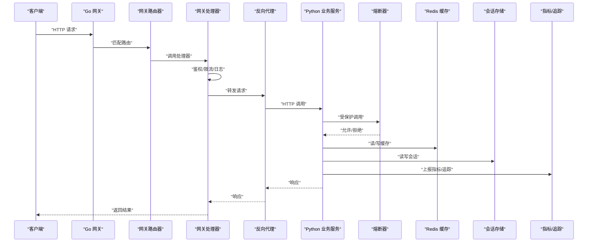

图表来源
- [backend_design/nexus_gate/cmd/main.go](file://backend_design/nexus_gate/cmd/main.go)
- [backend_design/nexus_gate/internal/router/router.go](file://backend_design/nexus_gate/internal/router/router.go)
- [backend_design/nexus_gate/internal/handlers/handlers.go](file://backend_design/nexus_gate/internal/handlers/handlers.go)
- [backend_design/nexus_gate/internal/proxy/proxy.go](file://backend_design/nexus_gate/internal/proxy/proxy.go)
- [backend_design/nexus/main.py](file://backend_design/nexus/main.py)
- [backend_design/nexus/core/circuit_breaker.py](file://backend_design/nexus/core/circuit_breaker.py)
- [backend_design/nexus/middleware/redis_cache.py](file://backend_design/nexus/middleware/redis_cache.py)
- [backend_design/nexus/middleware/session_store.py](file://backend_design/nexus/middleware/session_store.py)
- [backend_design/nexus/observability/metrics.py](file://backend_design/nexus/observability/metrics.py)
- [backend_design/nexus/observability/langfuse.py](file://backend_design/nexus/observability/langfuse.py)

## 详细组件分析

### Go 网关服务
- 入口与生命周期
  - 负责解析配置、初始化日志、启动 HTTP 与 WebSocket 服务、优雅关闭。
- 路由与处理器
  - 按路径与方法注册路由，处理器执行鉴权、限流、请求校验、响应封装。
- 反向代理
  - 将上游业务地址抽象为服务名或集群，支持连接池、超时、重试与熔断。
- WebSocket 代理
  - 维护 Hub 与房间模型，透传消息、心跳检测、断线重连。
- 限流
  - 基于 IP/用户维度进行令牌桶或滑动窗口限流，防止雪崩。
- 配置管理
  - 从环境变量与配置文件加载，支持热更新与默认值回退。

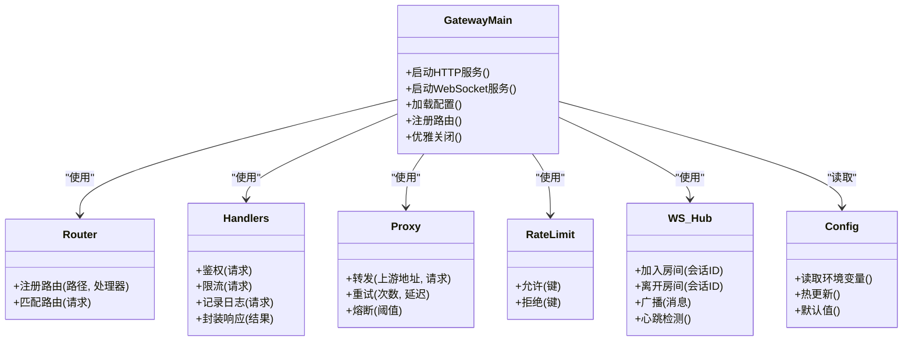

图表来源
- [backend_design/nexus_gate/cmd/main.go](file://backend_design/nexus_gate/cmd/main.go)
- [backend_design/nexus_gate/internal/router/router.go](file://backend_design/nexus_gate/internal/router/router.go)
- [backend_design/nexus_gate/internal/handlers/handlers.go](file://backend_design/nexus_gate/internal/handlers/handlers.go)
- [backend_design/nexus_gate/internal/proxy/proxy.go](file://backend_design/nexus_gate/internal/proxy/proxy.go)
- [backend_design/nexus_gate/internal/ratelimit/ratelimit.go](file://backend_design/nexus_gate/internal/ratelimit/ratelimit.go)
- [backend_design/nexus_gate/internal/ws/hub.go](file://backend_design/nexus_gate/internal/ws/hub.go)
- [backend_design/nexus_gate/internal/config/config.go](file://backend_design/nexus_gate/internal/config/config.go)

章节来源
- [backend_design/nexus_gate/cmd/main.go](file://backend_design/nexus_gate/cmd/main.go)
- [backend_design/nexus_gate/internal/config/config.go](file://backend_design/nexus_gate/internal/config/config.go)
- [backend_design/nexus_gate/internal/handlers/handlers.go](file://backend_design/nexus_gate/internal/handlers/handlers.go)
- [backend_design/nexus_gate/internal/proxy/proxy.go](file://backend_design/nexus_gate/internal/proxy/proxy.go)
- [backend_design/nexus_gate/internal/ratelimit/ratelimit.go](file://backend_design/nexus_gate/internal/ratelimit/ratelimit.go)
- [backend_design/nexus_gate/internal/router/router.go](file://backend_design/nexus_gate/internal/router/router.go)
- [backend_design/nexus_gate/internal/ws/hub.go](file://backend_design/nexus_gate/internal/ws/hub.go)

### Python 业务服务
- 主程序与路由
  - 初始化框架、挂载领域路由（聊天、健康检查等）、启动后台任务。
- 中间件
  - 会话存储：持久化会话上下文，支持跨请求状态保持。
  - Redis 缓存：热点数据缓存，降低下游压力。
- 核心能力
  - 意图识别、RAG、ASR/TTS、车辆控制、技能编排、记忆管理等。
- 可观测性
  - 指标采集与上报、结构化日志、链路追踪。

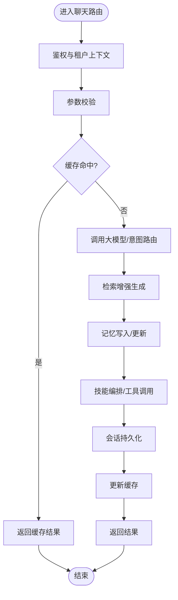

图表来源
- [backend_design/nexus/api/routes/chat.py](file://backend_design/nexus/api/routes/chat.py)
- [backend_design/nexus/middleware/redis_cache.py](file://backend_design/nexus/middleware/redis_cache.py)
- [backend_design/nexus/middleware/session_store.py](file://backend_design/nexus/middleware/session_store.py)
- [backend_design/nexus/main.py](file://backend_design/nexus/main.py)

章节来源
- [backend_design/nexus/main.py](file://backend_design/nexus/main.py)
- [backend_design/nexus/api/routes/chat.py](file://backend_design/nexus/api/routes/chat.py)
- [backend_design/nexus/api/routes/health.py](file://backend_design/nexus/api/routes/health.py)
- [backend_design/nexus/middleware/redis_cache.py](file://backend_design/nexus/middleware/redis_cache.py)
- [backend_design/nexus/middleware/session_store.py](file://backend_design/nexus/middleware/session_store.py)

### 服务发现、负载均衡与服务间通信
- 服务发现
  - 在容器编排环境下，可通过 Docker Compose 的服务名解析或引入轻量服务发现（如 etcd/Consul）实现动态实例发现。
- 负载均衡
  - 网关侧可使用轮询、最少连接或一致性哈希策略；结合健康检查剔除异常节点。
- 服务间通信
  - 主要采用 HTTP/REST；WebSocket 用于实时交互；gRPC 可用于高性能场景（proto 已存在）。

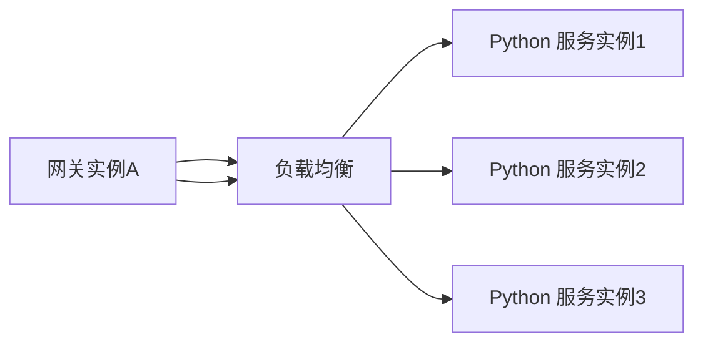

[此图为概念性图示，不直接映射具体源码文件]

### API 网关路由策略、请求转发与响应处理
- 路由策略
  - 基于路径前缀与方法进行匹配，支持静态与动态规则。
- 请求转发
  - 统一鉴权、限流后，通过反向代理转发至上游业务服务，携带必要头信息（如租户 ID、追踪 ID）。
- 响应处理
  - 统一错误码与响应体结构，记录耗时与状态码，便于可观测性与告警。

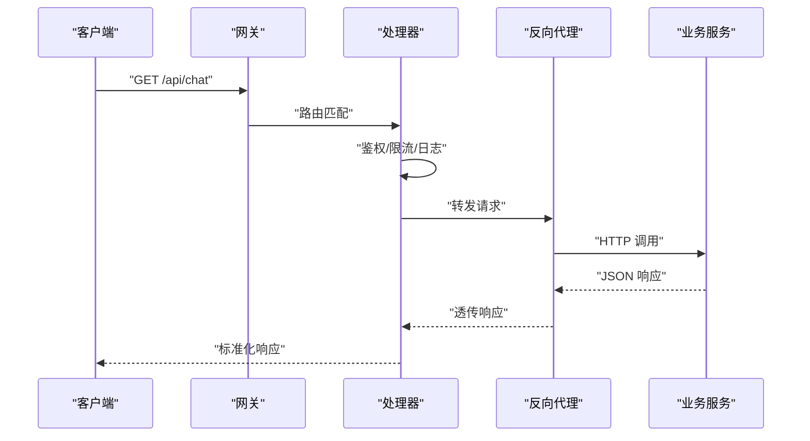

图表来源
- [backend_design/nexus_gate/internal/router/router.go](file://backend_design/nexus_gate/internal/router/router.go)
- [backend_design/nexus_gate/internal/handlers/handlers.go](file://backend_design/nexus_gate/internal/handlers/handlers.go)
- [backend_design/nexus_gate/internal/proxy/proxy.go](file://backend_design/nexus_gate/internal/proxy/proxy.go)
- [backend_design/nexus/api/routes/chat.py](file://backend_design/nexus/api/routes/chat.py)

章节来源
- [backend_design/nexus_gate/internal/router/router.go](file://backend_design/nexus_gate/internal/router/router.go)
- [backend_design/nexus_gate/internal/handlers/handlers.go](file://backend_design/nexus_gate/internal/handlers/handlers.go)
- [backend_design/nexus_gate/internal/proxy/proxy.go](file://backend_design/nexus_gate/internal/proxy/proxy.go)
- [backend_design/nexus/api/routes/chat.py](file://backend_design/nexus/api/routes/chat.py)

### 配置管理、环境变量与动态配置更新
- 配置来源
  - 环境变量优先，配置文件次之，内置默认值兜底。
- 动态更新
  - 支持热更新配置项（如限流阈值、路由规则），无需重启服务。
- 安全与隔离
  - 敏感配置通过密钥管理服务注入，避免明文落盘。

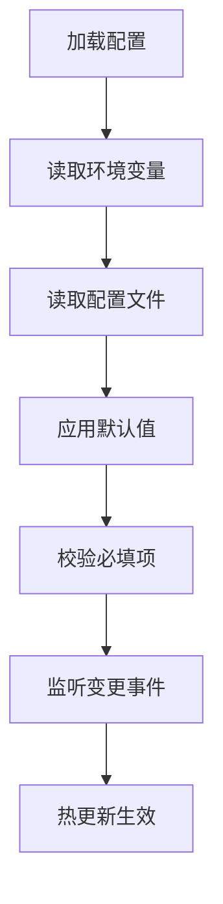

图表来源
- [backend_design/nexus_gate/internal/config/config.go](file://backend_design/nexus_gate/internal/config/config.go)
- [backend_design/nexus/config.py](file://backend_design/nexus/config.py)

章节来源
- [backend_design/nexus_gate/internal/config/config.go](file://backend_design/nexus_gate/internal/config/config.go)
- [backend_design/nexus/config.py](file://backend_design/nexus/config.py)

### 服务边界定义、接口契约与数据一致性策略
- 服务边界
  - 网关：协议适配、鉴权、限流、转发、WebSocket 代理。
  - 业务：领域逻辑、数据持久化、外部系统集成。
- 接口契约
  - REST API 使用 JSON 请求/响应，明确字段类型与约束；WebSocket 消息使用结构化协议；gRPC 使用 proto 定义。
- 数据一致性
  - 最终一致性为主，关键事务采用补偿与幂等设计；缓存与数据库保持一致性策略（先删后写或双写同步）。

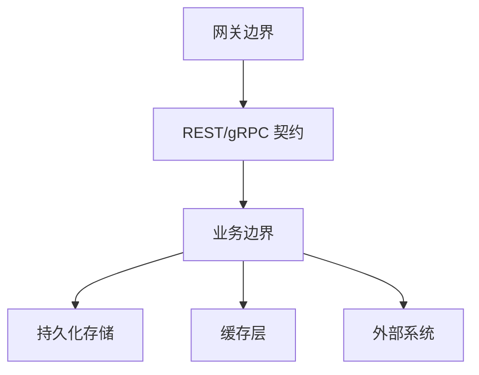

[此图为概念性图示，不直接映射具体源码文件]

### 容错、熔断降级与重试机制
- 熔断器
  - 基于失败率与慢调用比例触发熔断，半开探测恢复。
- 重试
  - 针对幂等请求进行指数退避重试，避免雪崩。
- 降级
  - 在熔断或资源紧张时返回缓存或默认响应，保障用户体验。

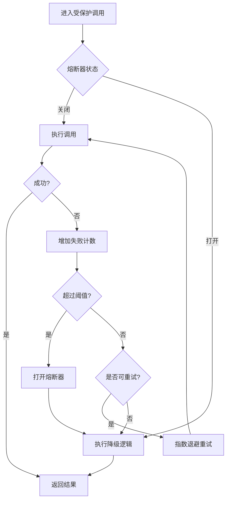

图表来源
- [backend_design/nexus/core/circuit_breaker.py](file://backend_design/nexus/core/circuit_breaker.py)
- [backend_design/nexus_gate/internal/proxy/proxy.go](file://backend_design/nexus_gate/internal/proxy/proxy.go)

章节来源
- [backend_design/nexus/core/circuit_breaker.py](file://backend_design/nexus/core/circuit_breaker.py)
- [backend_design/nexus_gate/internal/proxy/proxy.go](file://backend_design/nexus_gate/internal/proxy/proxy.go)

### 监控、日志收集与链路追踪集成
- 指标
  - 暴露 Prometheus 指标端点，采集 QPS、延迟、错误率、熔断状态等。
- 日志
  - 结构化 JSON 日志，包含请求 ID、租户 ID、耗时、状态码等。
- 链路追踪
  - 集成 Langfuse 或其他 APM，传递追踪 ID，串联网关与业务调用。

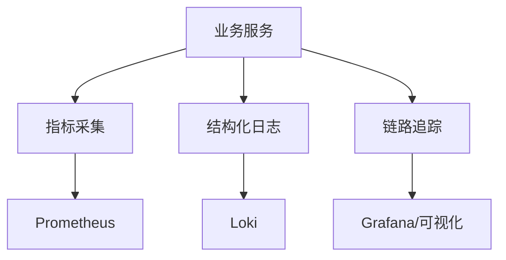

图表来源
- [backend_design/nexus/observability/metrics.py](file://backend_design/nexus/observability/metrics.py)
- [backend_design/nexus/observability/langfuse.py](file://backend_design/nexus/observability/langfuse.py)

章节来源
- [backend_design/nexus/observability/metrics.py](file://backend_design/nexus/observability/metrics.py)
- [backend_design/nexus/observability/langfuse.py](file://backend_design/nexus/observability/langfuse.py)

## 依赖关系分析
- 网关依赖
  - 配置模块、路由器、处理器、反向代理、限流、WebSocket Hub。
- 业务依赖
  - 路由、中间件（会话、缓存）、核心能力（意图、RAG、ASR/TTS、车辆控制、技能编排）、可观测性。

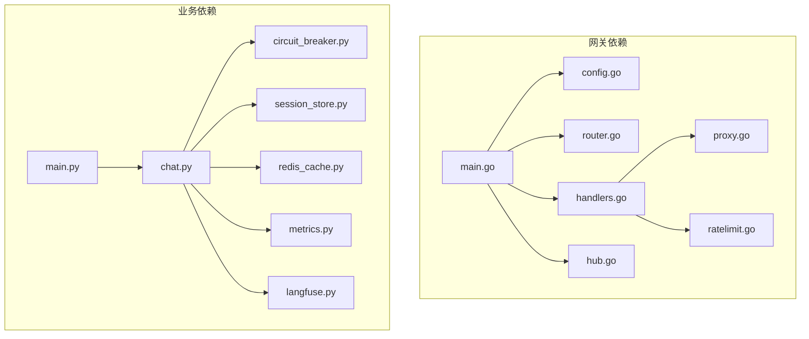

图表来源
- [backend_design/nexus_gate/cmd/main.go](file://backend_design/nexus_gate/cmd/main.go)
- [backend_design/nexus_gate/internal/config/config.go](file://backend_design/nexus_gate/internal/config/config.go)
- [backend_design/nexus_gate/internal/router/router.go](file://backend_design/nexus_gate/internal/router/router.go)
- [backend_design/nexus_gate/internal/handlers/handlers.go](file://backend_design/nexus_gate/internal/handlers/handlers.go)
- [backend_design/nexus_gate/internal/proxy/proxy.go](file://backend_design/nexus_gate/internal/proxy/proxy.go)
- [backend_design/nexus_gate/internal/ratelimit/ratelimit.go](file://backend_design/nexus_gate/internal/ratelimit/ratelimit.go)
- [backend_design/nexus_gate/internal/ws/hub.go](file://backend_design/nexus_gate/internal/ws/hub.go)
- [backend_design/nexus/main.py](file://backend_design/nexus/main.py)
- [backend_design/nexus/api/routes/chat.py](file://backend_design/nexus/api/routes/chat.py)
- [backend_design/nexus/core/circuit_breaker.py](file://backend_design/nexus/core/circuit_breaker.py)
- [backend_design/nexus/middleware/session_store.py](file://backend_design/nexus/middleware/session_store.py)
- [backend_design/nexus/middleware/redis_cache.py](file://backend_design/nexus/middleware/redis_cache.py)
- [backend_design/nexus/observability/metrics.py](file://backend_design/nexus/observability/metrics.py)
- [backend_design/nexus/observability/langfuse.py](file://backend_design/nexus/observability/langfuse.py)

章节来源
- [backend_design/nexus_gate/cmd/main.go](file://backend_design/nexus_gate/cmd/main.go)
- [backend_design/nexus/main.py](file://backend_design/nexus/main.py)

## 性能考量
- 连接复用与池化：网关与业务侧均启用连接池，减少握手开销。
- 超时与背压：合理设置超时与队列长度，避免级联失败。
- 缓存策略：热点数据多级缓存（本地+Redis），注意失效与一致性。
- 限流与削峰：网关层限流，业务层异步化与批处理。
- 水平扩展：无状态服务横向扩展，配合负载均衡与健康检查。

[本节为通用指导，不直接分析具体文件]

## 故障排查指南
- 常见问题定位
  - 鉴权失败：检查网关鉴权中间件与上游 token 校验。
  - 限流触发：查看网关限流统计与阈值配置。
  - 熔断打开：观察熔断器状态与失败率，检查上游健康。
  - 缓存不一致：核对缓存键与失效策略，必要时强制刷新。
  - 链路中断：检查追踪 ID 透传与日志关联。
- 诊断手段
  - 指标看板：QPS、延迟、错误率、熔断状态。
  - 日志聚合：按请求 ID 与租户 ID 过滤。
  - 链路追踪：端到端耗时与瓶颈定位。

章节来源
- [backend_design/nexus_gate/internal/handlers/handlers.go](file://backend_design/nexus_gate/internal/handlers/handlers.go)
- [backend_design/nexus_gate/internal/ratelimit/ratelimit.go](file://backend_design/nexus_gate/internal/ratelimit/ratelimit.go)
- [backend_design/nexus/core/circuit_breaker.py](file://backend_design/nexus/core/circuit_breaker.py)
- [backend_design/nexus/observability/metrics.py](file://backend_design/nexus/observability/metrics.py)
- [backend_design/nexus/observability/langfuse.py](file://backend_design/nexus/observability/langfuse.py)

## 结论
NexusCockpit 通过 Go 网关与 Python 业务服务的清晰职责分离，实现了高内聚、低耦合的微服务架构。网关承担非业务关注点，业务服务专注领域逻辑；配合服务发现、负载均衡、熔断降级与重试机制，提升了系统的可用性与弹性。统一的配置管理与可观测性体系保障了运行时的可控与可观测。建议在生产环境完善服务发现与动态配置中心，持续优化缓存与限流策略，强化链路追踪与告警闭环。

[本节为总结性内容，不直接分析具体文件]

## 附录
- 服务编排与部署
  - 使用 Docker Compose 编排网关与业务服务，统一网络与端口映射。
- 接口契约示例
  - REST API：JSON 请求/响应，明确字段与约束。
  - WebSocket：结构化消息协议，支持心跳与重连。
  - gRPC：使用 proto 定义服务与消息类型。

章节来源
- [docker-compose.yml](file://docker-compose.yml)
- [backend_design/nexus_gate/proto/nexus.proto](file://backend_design/nexus_gate/proto/nexus.proto)