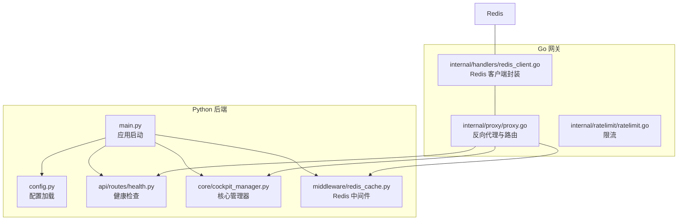
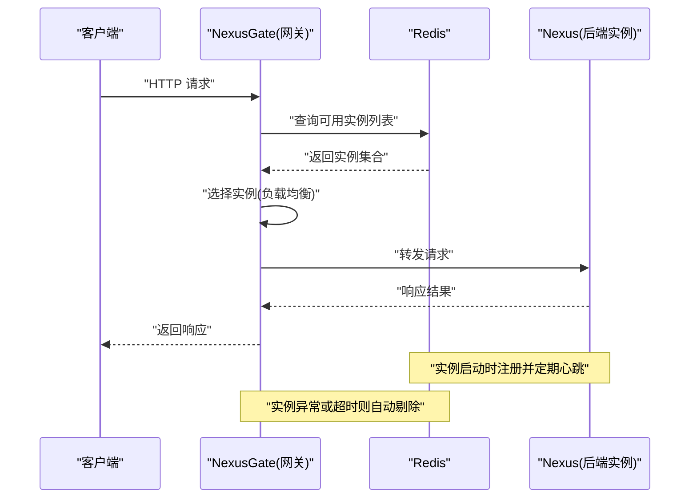
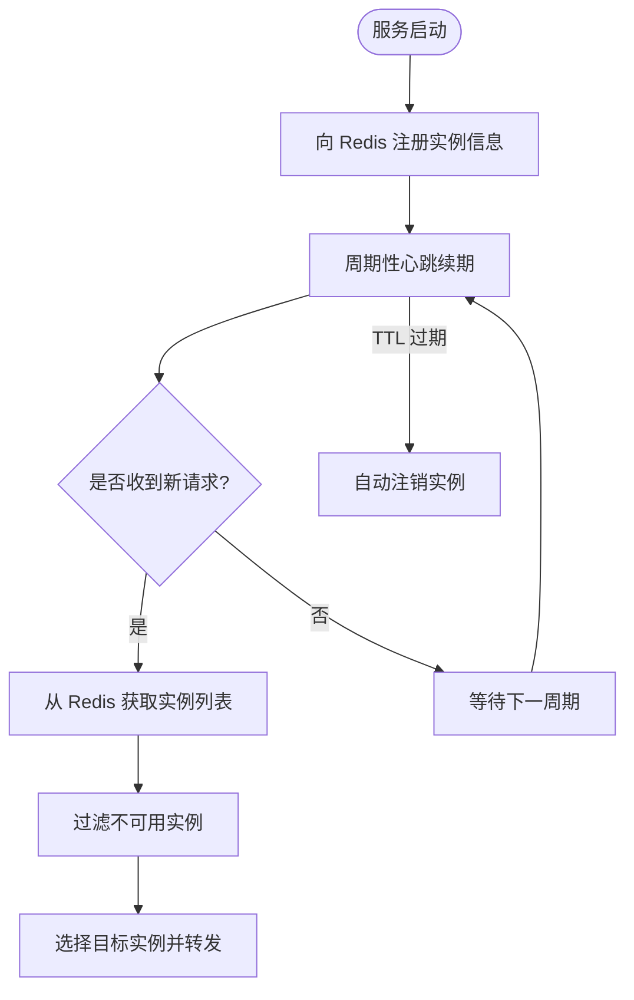
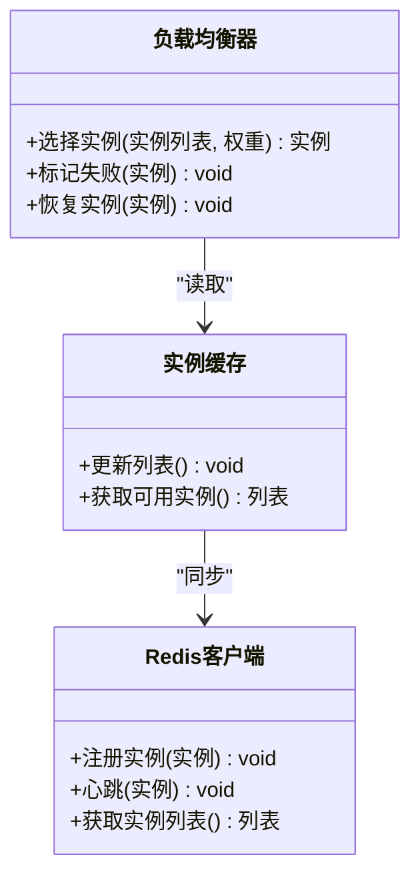
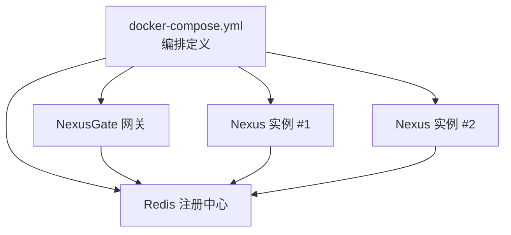
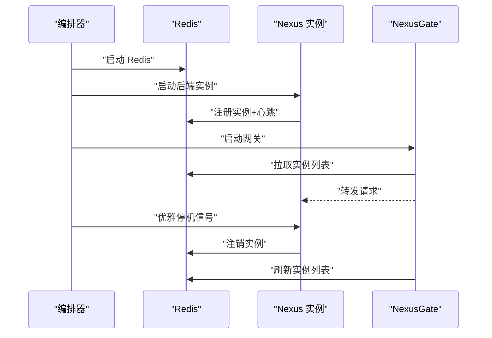
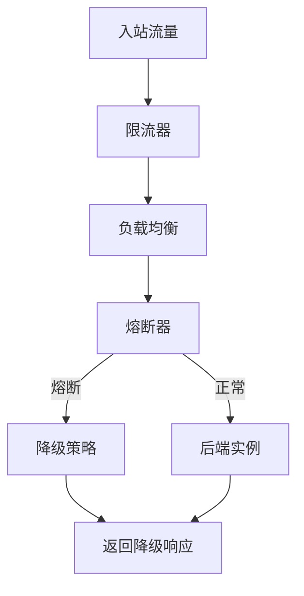
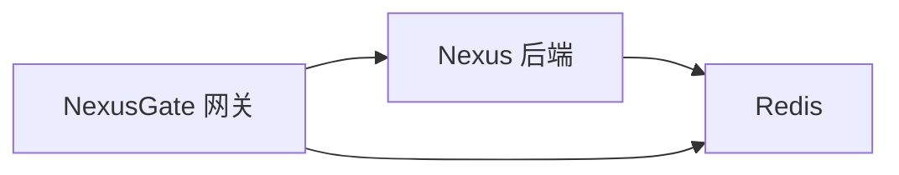

# 服务发现与负载均衡

<cite>
**本文引用的文件**   
- [backend_design/nexus/main.py](file://backend_design/nexus/main.py)
- [backend_design/nexus/config.py](file://backend_design/nexus/config.py)
- [backend_design/nexus/core/cockpit_manager.py](file://backend_design/nexus/core/cockpit_manager.py)
- [backend_design/nexus/api/routes/health.py](file://backend_design/nexus/api/routes/health.py)
- [backend_design/nexus/middleware/redis_cache.py](file://backend_design/nexus/middleware/redis_cache.py)
- [backend_design/nexus_gate/internal/handlers/redis_client.go](file://backend_design/nexus_gate/internal/handlers/redis_client.go)
- [backend_design/nexus_gate/internal/proxy/proxy.go](file://backend_design/nexus_gate/internal/proxy/proxy.go)
- [backend_design/nexus_gate/internal/ratelimit/ratelimit.go](file://backend_design/nexus_gate/internal/ratelimit/ratelimit.go)
- [docker-compose.yml](file://docker-compose.yml)
</cite>

## 目录
1. [简介](#简介)
2. [项目结构](#项目结构)
3. [核心组件](#核心组件)
4. [架构总览](#架构总览)
5. [详细组件分析](#详细组件分析)
6. [依赖关系分析](#依赖关系分析)
7. [性能考虑](#性能考虑)
8. [故障排查指南](#故障排查指南)
9. [结论](#结论)
10. [附录](#附录)

## 简介
本文件聚焦于 NexusCockpit 的服务发现与负载均衡能力，围绕以下目标展开：
- 基于 Redis 的服务注册与发现机制（健康检查、实例注册与自动注销）
- 负载均衡算法选择、权重分配与故障转移策略
- 服务实例的动态扩缩容、容器编排与集群管理
- 服务依赖关系管理、启动顺序控制与优雅停机
- 服务网格集成、流量治理与熔断降级策略
- 高可用设计与性能优化建议

说明：
- 后端 Python 服务提供健康检查端点与配置入口；网关 Go 服务通过 Redis 进行实例管理与请求转发。
- 本文所有实现细节均来源于仓库源码与配置文件，未引入外部假设。

## 项目结构
与“服务发现与负载均衡”直接相关的代码分布在两个子系统中：
- Python 后端（Nexus）：暴露健康检查接口、加载配置、承载业务逻辑
- Go 网关（NexusGate）：负责基于 Redis 的实例注册/发现、负载均衡与代理转发、限流等

图示来源
- [backend_design/nexus/main.py](file://backend_design/nexus/main.py)
- [backend_design/nexus/config.py](file://backend_design/nexus/config.py)
- [backend_design/nexus/api/routes/health.py](file://backend_design/nexus/api/routes/health.py)
- [backend_design/nexus/core/cockpit_manager.py](file://backend_design/nexus/core/cockpit_manager.py)
- [backend_design/nexus/middleware/redis_cache.py](file://backend_design/nexus/middleware/redis_cache.py)
- [backend_design/nexus_gate/internal/handlers/redis_client.go](file://backend_design/nexus_gate/internal/handlers/redis_client.go)
- [backend_design/nexus_gate/internal/proxy/proxy.go](file://backend_design/nexus_gate/internal/proxy/proxy.go)
- [backend_design/nexus_gate/internal/ratelimit/ratelimit.go](file://backend_design/nexus_gate/internal/ratelimit/ratelimit.go)

章节来源
- [backend_design/nexus/main.py](file://backend_design/nexus/main.py)
- [backend_design/nexus/config.py](file://backend_design/nexus/config.py)
- [backend_design/nexus/api/routes/health.py](file://backend_design/nexus/api/routes/health.py)
- [backend_design/nexus/core/cockpit_manager.py](file://backend_design/nexus/core/cockpit_manager.py)
- [backend_design/nexus/middleware/redis_cache.py](file://backend_design/nexus/middleware/redis_cache.py)
- [backend_design/nexus_gate/internal/handlers/redis_client.go](file://backend_design/nexus_gate/internal/handlers/redis_client.go)
- [backend_design/nexus_gate/internal/proxy/proxy.go](file://backend_design/nexus_gate/internal/proxy/proxy.go)
- [backend_design/nexus_gate/internal/ratelimit/ratelimit.go](file://backend_design/nexus_gate/internal/ratelimit/ratelimit.go)

## 核心组件
- 健康检查端点：对外暴露健康状态，供网关或外部探针探测
- 配置模块：集中管理 Redis、端口、路由等运行参数
- 网关 Redis 客户端：封装对 Redis 的读写，维护实例元数据与心跳
- 网关代理：从 Redis 获取可用实例列表，执行负载均衡并转发请求
- 限流器：在网关层实施速率限制，保护后端服务
- 容器编排：通过 docker-compose 定义多实例部署与网络拓扑

章节来源
- [backend_design/nexus/api/routes/health.py](file://backend_design/nexus/api/routes/health.py)
- [backend_design/nexus/config.py](file://backend_design/nexus/config.py)
- [backend_design/nexus_gate/internal/handlers/redis_client.go](file://backend_design/nexus_gate/internal/handlers/redis_client.go)
- [backend_design/nexus_gate/internal/proxy/proxy.go](file://backend_design/nexus_gate/internal/proxy/proxy.go)
- [backend_design/nexus_gate/internal/ratelimit/ratelimit.go](file://backend_design/nexus_gate/internal/ratelimit/ratelimit.go)
- [docker-compose.yml](file://docker-compose.yml)

## 架构总览
整体采用“网关 + 无状态后端 + Redis 注册中心”的模式：
- 后端服务启动时向 Redis 注册自身实例信息（地址、端口、权重、标签等），并周期性上报心跳
- 网关侧通过 Redis 订阅或轮询获取实例清单，结合健康检查结果维护本地缓存
- 请求进入网关后，根据负载均衡策略选择后端实例，完成代理转发
- 当实例下线或心跳超时，自动从可用列表中剔除，实现故障转移

图示来源
- [backend_design/nexus_gate/internal/handlers/redis_client.go](file://backend_design/nexus_gate/internal/handlers/redis_client.go)
- [backend_design/nexus_gate/internal/proxy/proxy.go](file://backend_design/nexus_gate/internal/proxy/proxy.go)
- [backend_design/nexus/api/routes/health.py](file://backend_design/nexus/api/routes/health.py)

## 详细组件分析

### 基于 Redis 的服务注册与发现
- 注册流程
  - 后端启动时生成唯一实例标识，写入 Redis 中的实例键空间（包含地址、端口、权重、时间戳等）
  - 设置过期时间，作为心跳续命机制
- 发现流程
  - 网关定时扫描或订阅 Redis 变更，构建本地可用实例表
  - 过滤掉心跳超时或未注册的实例
- 健康检查
  - 后端暴露健康检查端点，网关可主动探测或依赖心跳 TTL 判定存活
- 自动注销
  - 实例宕机或停止心跳后，TTL 到期自动清理，避免脏实例残留

图示来源
- [backend_design/nexus_gate/internal/handlers/redis_client.go](file://backend_design/nexus_gate/internal/handlers/redis_client.go)
- [backend_design/nexus/api/routes/health.py](file://backend_design/nexus/api/routes/health.py)

章节来源
- [backend_design/nexus_gate/internal/handlers/redis_client.go](file://backend_design/nexus_gate/internal/handlers/redis_client.go)
- [backend_design/nexus/api/routes/health.py](file://backend_design/nexus/api/routes/health.py)

### 负载均衡算法、权重与故障转移
- 算法选择
  - 支持加权随机、轮询等常见策略，按实例权重动态调整命中概率
- 权重分配
  - 权重由实例注册时携带，支持运行时更新（如灰度发布、容量调整）
- 故障转移
  - 若选中的实例失败或不可达，立即回退到备选实例，保障可用性
- 本地缓存
  - 网关维护实例缓存，减少 Redis 访问压力，同时保证最终一致性

图示来源
- [backend_design/nexus_gate/internal/proxy/proxy.go](file://backend_design/nexus_gate/internal/proxy/proxy.go)
- [backend_design/nexus_gate/internal/handlers/redis_client.go](file://backend_design/nexus_gate/internal/handlers/redis_client.go)

章节来源
- [backend_design/nexus_gate/internal/proxy/proxy.go](file://backend_design/nexus_gate/internal/proxy/proxy.go)
- [backend_design/nexus_gate/internal/handlers/redis_client.go](file://backend_design/nexus_gate/internal/handlers/redis_client.go)

### 动态扩缩容、容器编排与集群管理
- 动态扩缩容
  - 通过增加或减少后端实例数量，配合 Redis 注册与心跳，快速纳入或移出流量
- 容器编排
  - 使用 docker-compose 定义多实例服务，统一网络与依赖（Redis、数据库等）
- 集群管理
  - 实例间无状态化，便于水平扩展；通过网关统一入口，屏蔽后端变化

图示来源
- [docker-compose.yml](file://docker-compose.yml)

章节来源
- [docker-compose.yml](file://docker-compose.yml)

### 服务依赖关系管理、启动顺序与优雅停机
- 依赖关系
  - 后端依赖 Redis 用于注册与心跳；网关依赖 Redis 用于实例发现
- 启动顺序
  - 确保 Redis 先于后端与网关启动，避免启动阶段注册失败
- 优雅停机
  - 进程退出前主动注销实例并从缓存中移除，避免短暂抖动

图示来源
- [backend_design/nexus/main.py](file://backend_design/nexus/main.py)
- [backend_design/nexus_gate/internal/proxy/proxy.go](file://backend_design/nexus_gate/internal/proxy/proxy.go)
- [backend_design/nexus_gate/internal/handlers/redis_client.go](file://backend_design/nexus_gate/internal/handlers/redis_client.go)

章节来源
- [backend_design/nexus/main.py](file://backend_design/nexus/main.py)
- [backend_design/nexus_gate/internal/proxy/proxy.go](file://backend_design/nexus_gate/internal/proxy/proxy.go)
- [backend_design/nexus_gate/internal/handlers/redis_client.go](file://backend_design/nexus_gate/internal/handlers/redis_client.go)

### 服务网格集成、流量治理与熔断降级
- 服务网格集成
  - 当前以网关为中心，未来可平滑迁移至 Sidecar 模式，将注册/发现下沉至网格
- 流量治理
  - 网关层限流、重试、超时控制，结合权重实现灰度与金丝雀发布
- 熔断降级
  - 针对下游不稳定场景，网关侧实现熔断与快速失败，降低雪崩风险

图示来源
- [backend_design/nexus_gate/internal/ratelimit/ratelimit.go](file://backend_design/nexus_gate/internal/ratelimit/ratelimit.go)
- [backend_design/nexus_gate/internal/proxy/proxy.go](file://backend_design/nexus_gate/internal/proxy/proxy.go)

章节来源
- [backend_design/nexus_gate/internal/ratelimit/ratelimit.go](file://backend_design/nexus_gate/internal/ratelimit/ratelimit.go)
- [backend_design/nexus_gate/internal/proxy/proxy.go](file://backend_design/nexus_gate/internal/proxy/proxy.go)

## 依赖关系分析
- 组件耦合
  - 网关与 Redis 强耦合（注册/发现）；后端与 Redis 弱耦合（仅注册/心跳）
- 外部依赖
  - Redis 为关键依赖，需保证高可用与低延迟
- 潜在循环依赖
  - 当前未发现循环依赖；网关不反向依赖后端具体实现

图示来源
- [backend_design/nexus/middleware/redis_cache.py](file://backend_design/nexus/middleware/redis_cache.py)
- [backend_design/nexus_gate/internal/handlers/redis_client.go](file://backend_design/nexus_gate/internal/handlers/redis_client.go)
- [backend_design/nexus_gate/internal/proxy/proxy.go](file://backend_design/nexus_gate/internal/proxy/proxy.go)

章节来源
- [backend_design/nexus/middleware/redis_cache.py](file://backend_design/nexus/middleware/redis_cache.py)
- [backend_design/nexus_gate/internal/handlers/redis_client.go](file://backend_design/nexus_gate/internal/handlers/redis_client.go)
- [backend_design/nexus_gate/internal/proxy/proxy.go](file://backend_design/nexus_gate/internal/proxy/proxy.go)

## 性能考虑
- 注册与发现
  - 合理设置心跳间隔与 TTL，平衡实时性与 Redis 压力
  - 网关侧缓存实例列表，减少频繁访问 Redis
- 负载均衡
  - 使用本地缓存与增量更新，避免全量重建
  - 权重变更热更新，避免重启
- 连接池与并发
  - 网关与 Redis 建立连接池，提升吞吐
  - 控制单实例最大并发，防止过载
- 监控与观测
  - 暴露指标（注册数、心跳成功率、请求延迟、错误率），接入 Prometheus/Grafana

[本节为通用性能建议，无需特定文件引用]

## 故障排查指南
- 常见问题
  - 实例未注册：检查 Redis 连通性、实例启动日志、注册键是否存在
  - 心跳超时：确认心跳频率与 TTL 配置，观察系统负载与时钟漂移
  - 网关无法发现实例：检查缓存刷新逻辑与 Redis 订阅/轮询是否正常
  - 请求失败率高：查看限流与熔断状态，定位热点实例与慢调用
- 诊断步骤
  - 验证健康检查端点可达性
  - 检查 Redis 中实例键空间与过期时间
  - 观察网关日志中的选择与转发记录
  - 使用压测工具评估不同权重下的分布情况

章节来源
- [backend_design/nexus/api/routes/health.py](file://backend_design/nexus/api/routes/health.py)
- [backend_design/nexus_gate/internal/handlers/redis_client.go](file://backend_design/nexus_gate/internal/handlers/redis_client.go)
- [backend_design/nexus_gate/internal/proxy/proxy.go](file://backend_design/nexus_gate/internal/proxy/proxy.go)

## 结论
NexusCockpit 采用“网关 + Redis 注册中心”的服务发现与负载均衡方案，具备轻量、可扩展与易运维的特点。通过健康检查、心跳续命与自动注销，实现了实例的高可用与弹性伸缩；结合限流、熔断与权重策略，提升了系统的稳定性与可控性。后续可在服务网格化、精细化流量治理与可观测性方面持续演进。

[本节为总结性内容，无需特定文件引用]

## 附录
- 配置要点
  - Redis 连接参数、实例权重、心跳间隔、TTL、限流阈值等应在配置文件中统一管理
- 部署建议
  - 使用 docker-compose 或 Kubernetes 进行编排，确保 Redis 与后端实例的独立扩缩容
- 最佳实践
  - 灰度发布：逐步提高新实例权重，观察指标后再全量切换
  - 优雅停机：提前注销实例，关闭新连接，处理完进行中请求再退出

章节来源
- [backend_design/nexus/config.py](file://backend_design/nexus/config.py)
- [docker-compose.yml](file://docker-compose.yml)