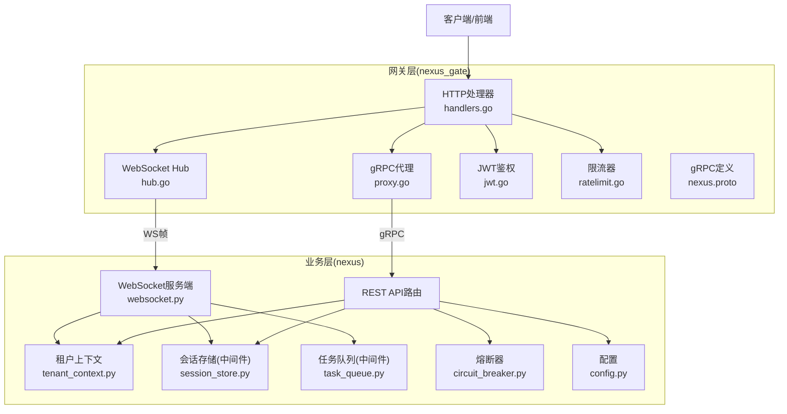
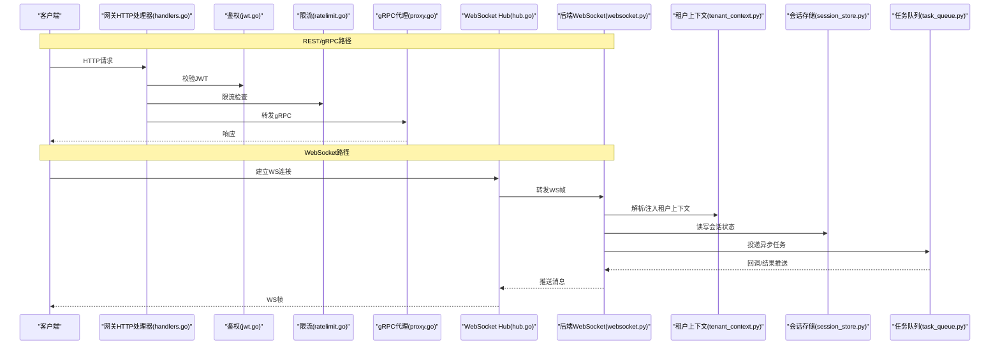
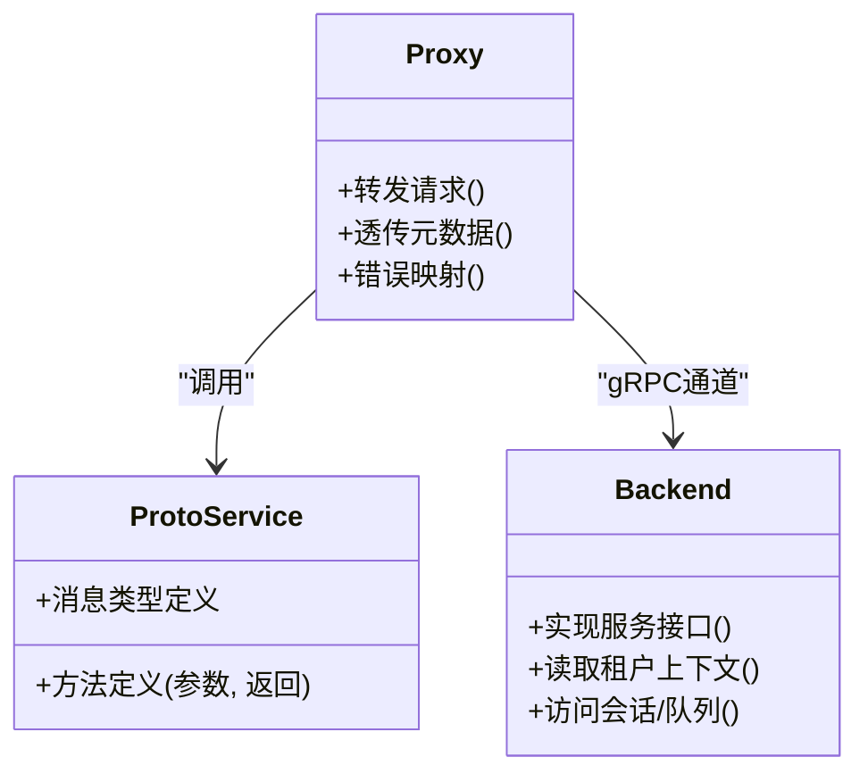
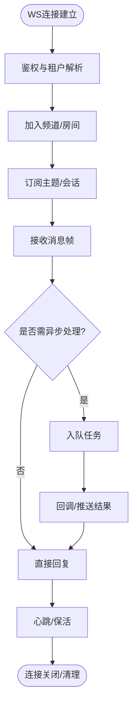
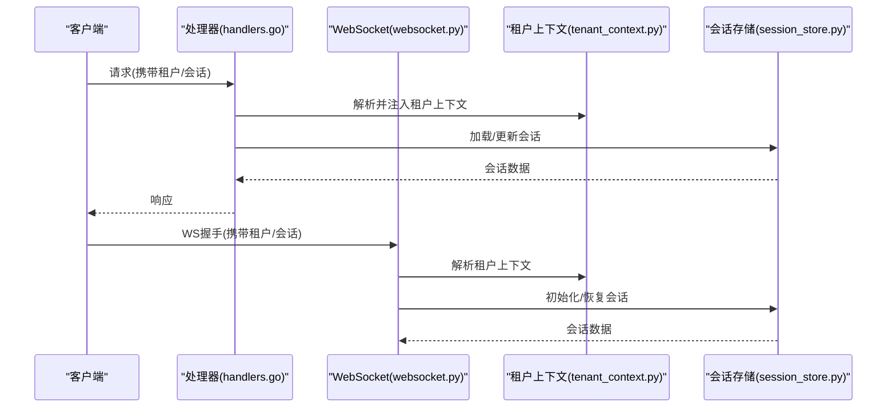
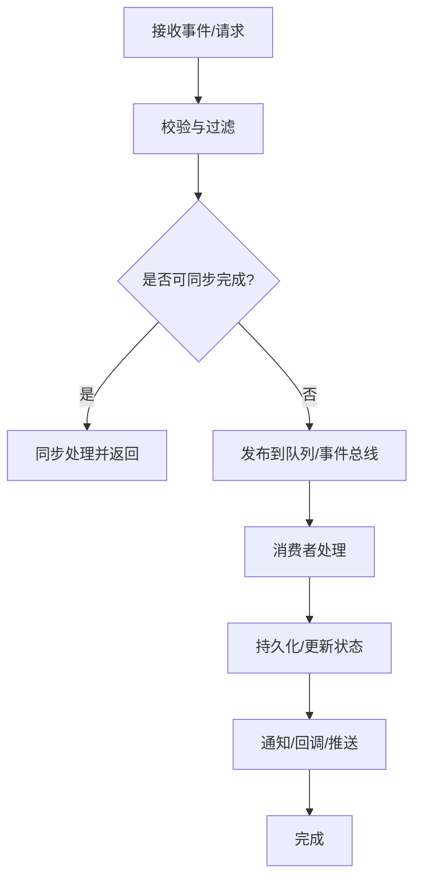
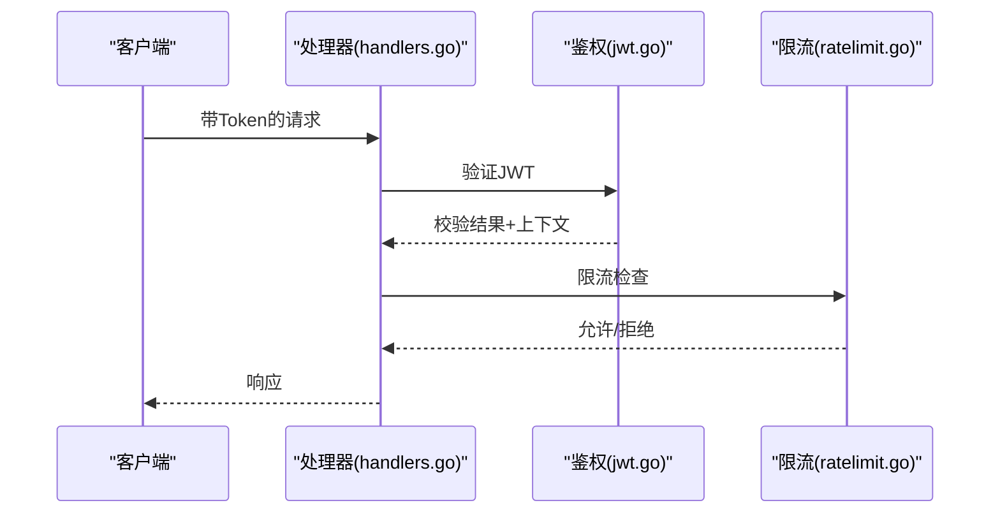
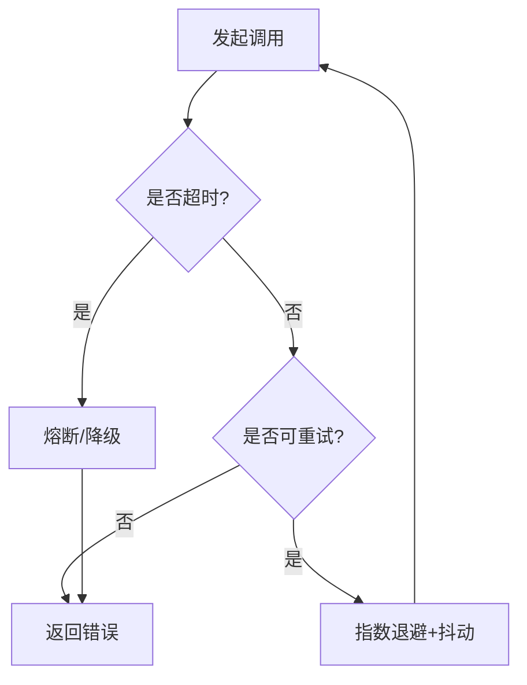
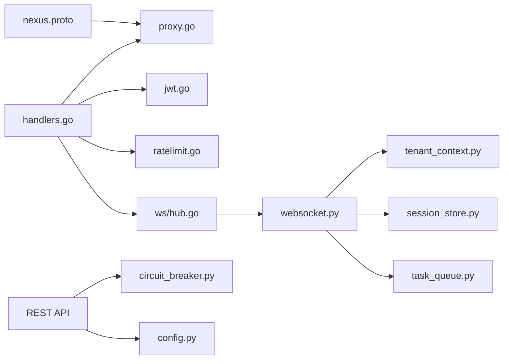

# 服务间通信机制

<cite>
**本文引用的文件**   
- [backend_design/nexus_gate/proto/nexus.proto](file://backend_design/nexus_gate/proto/nexus.proto)
- [backend_design/nexus_gate/internal/proxy/proxy.go](file://backend_design/nexus_gate/internal/proxy/proxy.go)
- [backend_design/nexus_gate/internal/handlers/handlers.go](file://backend_design/nexus_gate/internal/handlers/handlers.go)
- [backend_design/nexus_gate/internal/ws/hub.go](file://backend_design/nexus_gate/internal/ws/hub.go)
- [backend_design/nexus/api/websocket.py](file://backend_design/nexus/api/websocket.py)
- [backend_design/nexus/core/tenant_context.py](file://backend_design/nexus/core/tenant_context.py)
- [backend_design/nexus/middleware/session_store.py](file://backend_design/nexus/middleware/session_store.py)
- [backend_design/nexus/middleware/task_queue.py](file://backend_design/nexus/middleware/task_queue.py)
- [backend_design/nexus/core/circuit_breaker.py](file://backend_design/nexus/core/circuit_breaker.py)
- [backend_design/nexus_gate/internal/auth/jwt.go](file://backend_design/nexus_gate/internal/auth/jwt.go)
- [backend_design/nexus_gate/internal/ratelimit/ratelimit.go](file://backend_design/nexus_gate/internal/ratelimit/ratelimit.go)
- [backend_design/nexus/config.py](file://backend_design/nexus/config.py)
</cite>

## 目录
1. [简介](#简介)
2. [项目结构](#项目结构)
3. [核心组件](#核心组件)
4. [架构总览](#架构总览)
5. [详细组件分析](#详细组件分析)
6. [依赖关系分析](#依赖关系分析)
7. [性能考量](#性能考量)
8. [故障排查指南](#故障排查指南)
9. [结论](#结论)
10. [附录](#附录)

## 简介
本文件面向NexusCockpit的服务间通信机制，覆盖gRPC协议定义与序列化、WebSocket实时通信（连接管理、广播与状态同步）、租户上下文传递与会话状态管理（含分布式会话存储）、异步消息处理与事件驱动架构、以及安全（加密与鉴权）和可靠性（错误处理、超时控制、重试策略）。文档以代码级事实为依据，辅以架构图与时序图帮助理解。

## 项目结构
本项目包含两个关键子系统：
- Go网关nexus_gate：负责外部接入、鉴权、限流、gRPC代理、WebSocket Hub与Redis集成。
- Python后端nexus：提供业务API、WebSocket服务端、租户上下文、会话存储、任务队列、熔断器等能力。

图表来源
- [backend_design/nexus_gate/internal/proxy/proxy.go](file://backend_design/nexus_gate/internal/proxy/proxy.go)
- [backend_design/nexus_gate/internal/ws/hub.go](file://backend_design/nexus_gate/internal/ws/hub.go)
- [backend_design/nexus/api/websocket.py](file://backend_design/nexus/api/websocket.py)
- [backend_design/nexus/core/tenant_context.py](file://backend_design/nexus/core/tenant_context.py)
- [backend_design/nexus/middleware/session_store.py](file://backend_design/nexus/middleware/session_store.py)
- [backend_design/nexus/middleware/task_queue.py](file://backend_design/nexus/middleware/task_queue.py)
- [backend_design/nexus/core/circuit_breaker.py](file://backend_design/nexus/core/circuit_breaker.py)
- [backend_design/nexus/config.py](file://backend_design/nexus/config.py)

章节来源
- [backend_design/nexus_gate/proto/nexus.proto](file://backend_design/nexus_gate/proto/nexus.proto)
- [backend_design/nexus_gate/internal/proxy/proxy.go](file://backend_design/nexus_gate/internal/proxy/proxy.go)
- [backend_design/nexus_gate/internal/ws/hub.go](file://backend_design/nexus_gate/internal/ws/hub.go)
- [backend_design/nexus/api/websocket.py](file://backend_design/nexus/api/websocket.py)
- [backend_design/nexus/core/tenant_context.py](file://backend_design/nexus/core/tenant_context.py)
- [backend_design/nexus/middleware/session_store.py](file://backend_design/nexus/middleware/session_store.py)
- [backend_design/nexus/middleware/task_queue.py](file://backend_design/nexus/middleware/task_queue.py)
- [backend_design/nexus/core/circuit_breaker.py](file://backend_design/nexus/core/circuit_breaker.py)
- [backend_design/nexus/config.py](file://backend_design/nexus/config.py)

## 核心组件
- gRPC协议与序列化
  - 协议定义位于proto文件，采用protobuf进行消息编解码，确保跨语言一致性与高效传输。
  - 网关通过gRPC代理将请求转发至Python后端服务。
- WebSocket实时通信
  - 网关侧Hub负责连接管理与消息分发；后端提供WebSocket端点用于业务级订阅/发布。
  - 支持按租户或会话维度的消息广播与状态同步。
- 租户上下文与会话状态
  - 通过中间件在请求链路中注入租户上下文，并在WebSocket上下文中透传。
  - 会话状态持久化到分布式存储（如Redis），实现多实例共享与会话恢复。
- 异步消息与事件驱动
  - 任务队列中间件将耗时操作入队，消费者异步处理，提升吞吐与稳定性。
- 安全与可靠性
  - JWT鉴权、速率限制、熔断器、超时与重试策略共同保障系统健壮性。

章节来源
- [backend_design/nexus_gate/proto/nexus.proto](file://backend_design/nexus_gate/proto/nexus.proto)
- [backend_design/nexus_gate/internal/proxy/proxy.go](file://backend_design/nexus_gate/internal/proxy/proxy.go)
- [backend_design/nexus_gate/internal/ws/hub.go](file://backend_design/nexus_gate/internal/ws/hub.go)
- [backend_design/nexus/api/websocket.py](file://backend_design/nexus/api/websocket.py)
- [backend_design/nexus/core/tenant_context.py](file://backend_design/nexus/core/tenant_context.py)
- [backend_design/nexus/middleware/session_store.py](file://backend_design/nexus/middleware/session_store.py)
- [backend_design/nexus/middleware/task_queue.py](file://backend_design/nexus/middleware/task_queue.py)
- [backend_design/nexus/core/circuit_breaker.py](file://backend_design/nexus/core/circuit_breaker.py)

## 架构总览
下图展示从客户端到网关再到后端的完整调用链，包括gRPC与WebSocket两条路径，以及鉴权、限流、上下文注入、会话与队列等横切能力。

图表来源
- [backend_design/nexus_gate/internal/handlers/handlers.go](file://backend_design/nexus_gate/internal/handlers/handlers.go)
- [backend_design/nexus_gate/internal/auth/jwt.go](file://backend_design/nexus_gate/internal/auth/jwt.go)
- [backend_design/nexus_gate/internal/ratelimit/ratelimit.go](file://backend_design/nexus_gate/internal/ratelimit/ratelimit.go)
- [backend_design/nexus_gate/internal/proxy/proxy.go](file://backend_design/nexus_gate/internal/proxy/proxy.go)
- [backend_design/nexus_gate/internal/ws/hub.go](file://backend_design/nexus_gate/internal/ws/hub.go)
- [backend_design/nexus/api/websocket.py](file://backend_design/nexus/api/websocket.py)
- [backend_design/nexus/core/tenant_context.py](file://backend_design/nexus/core/tenant_context.py)
- [backend_design/nexus/middleware/session_store.py](file://backend_design/nexus/middleware/session_store.py)
- [backend_design/nexus/middleware/task_queue.py](file://backend_design/nexus/middleware/task_queue.py)

## 详细组件分析

### gRPC协议与序列化
- 协议定义
  - 使用protobuf定义服务接口与消息类型，保证强类型契约与向后兼容。
  - 字段编号与命名约定需遵循团队规范，避免破坏性变更。
- 序列化机制
  - 二进制编码，体积小、解析快；适合高吞吐场景。
  - 网关与后端均基于同一proto生成代码，确保一致性。
- 代理转发
  - 网关接收上游请求，构造gRPC调用并转发至后端服务。
  - 支持元数据透传（如鉴权令牌、追踪ID、租户标识）。

图表来源
- [backend_design/nexus_gate/proto/nexus.proto](file://backend_design/nexus_gate/proto/nexus.proto)
- [backend_design/nexus_gate/internal/proxy/proxy.go](file://backend_design/nexus_gate/internal/proxy/proxy.go)

章节来源
- [backend_design/nexus_gate/proto/nexus.proto](file://backend_design/nexus_gate/proto/nexus.proto)
- [backend_design/nexus_gate/internal/proxy/proxy.go](file://backend_design/nexus_gate/internal/proxy/proxy.go)

### WebSocket实时通信架构
- 连接管理
  - 网关Hub维护连接集合，支持按房间/租户/会话维度注册与注销。
  - 心跳检测与断线重连策略由两端协同实现。
- 消息广播
  - 支持点对点与组播；结合会话/租户键实现精准投递。
- 状态同步
  - 通过事件帧携带状态快照或增量变更，客户端合并状态。
  - 幂等设计避免重复应用导致的状态漂移。

图表来源
- [backend_design/nexus_gate/internal/ws/hub.go](file://backend_design/nexus_gate/internal/ws/hub.go)
- [backend_design/nexus/api/websocket.py](file://backend_design/nexus/api/websocket.py)
- [backend_design/nexus/core/tenant_context.py](file://backend_design/nexus/core/tenant_context.py)
- [backend_design/nexus/middleware/session_store.py](file://backend_design/nexus/middleware/session_store.py)
- [backend_design/nexus/middleware/task_queue.py](file://backend_design/nexus/middleware/task_queue.py)

章节来源
- [backend_design/nexus_gate/internal/ws/hub.go](file://backend_design/nexus_gate/internal/ws/hub.go)
- [backend_design/nexus/api/websocket.py](file://backend_design/nexus/api/websocket.py)
- [backend_design/nexus/core/tenant_context.py](file://backend_design/nexus/core/tenant_context.py)
- [backend_design/nexus/middleware/session_store.py](file://backend_design/nexus/middleware/session_store.py)
- [backend_design/nexus/middleware/task_queue.py](file://backend_design/nexus/middleware/task_queue.py)

### 租户上下文传递与会话状态管理
- 租户上下文
  - 在请求入口解析租户标识，注入到上下文对象，贯穿后续处理链。
  - WebSocket帧头或握手参数携带租户信息，服务端统一解析。
- 会话状态
  - 会话键通常包含用户/设备/租户维度，便于隔离与检索。
  - 会话数据落盘至分布式存储（如Redis），实现水平扩展与故障恢复。
- 一致性
  - 读写分离与过期策略平衡一致性与性能。
  - 写放大场景考虑批量更新与缓存失效策略。

图表来源
- [backend_design/nexus/api/websocket.py](file://backend_design/nexus/api/websocket.py)
- [backend_design/nexus/core/tenant_context.py](file://backend_design/nexus/core/tenant_context.py)
- [backend_design/nexus/middleware/session_store.py](file://backend_design/nexus/middleware/session_store.py)
- [backend_design/nexus_gate/internal/handlers/handlers.go](file://backend_design/nexus_gate/internal/handlers/handlers.go)

章节来源
- [backend_design/nexus/api/websocket.py](file://backend_design/nexus/api/websocket.py)
- [backend_design/nexus/core/tenant_context.py](file://backend_design/nexus/core/tenant_context.py)
- [backend_design/nexus/middleware/session_store.py](file://backend_design/nexus/middleware/session_store.py)
- [backend_design/nexus_gate/internal/handlers/handlers.go](file://backend_design/nexus_gate/internal/handlers/handlers.go)

### 异步消息处理与事件驱动
- 任务队列
  - 将耗时逻辑（如I/O、计算密集型）入队，消费者独立执行。
  - 支持重试、死信队列与监控指标。
- 事件驱动
  - 通过事件总线或消息主题解耦模块，提高可扩展性。
  - 事件幂等与去重策略保障最终一致性。

图表来源
- [backend_design/nexus/middleware/task_queue.py](file://backend_design/nexus/middleware/task_queue.py)
- [backend_design/nexus/api/websocket.py](file://backend_design/nexus/api/websocket.py)

章节来源
- [backend_design/nexus/middleware/task_queue.py](file://backend_design/nexus/middleware/task_queue.py)
- [backend_design/nexus/api/websocket.py](file://backend_design/nexus/api/websocket.py)

### 通信安全、数据加密与身份验证
- 身份验证
  - 网关层对请求进行JWT校验，拒绝非法访问。
  - 令牌中包含租户与角色信息，用于细粒度授权。
- 传输加密
  - 建议启用TLS终止于网关，端到端加密保护敏感数据。
- 访问控制
  - 结合租户上下文与会话状态，实施资源隔离与权限校验。

图表来源
- [backend_design/nexus_gate/internal/handlers/handlers.go](file://backend_design/nexus_gate/internal/handlers/handlers.go)
- [backend_design/nexus_gate/internal/auth/jwt.go](file://backend_design/nexus_gate/internal/auth/jwt.go)
- [backend_design/nexus_gate/internal/ratelimit/ratelimit.go](file://backend_design/nexus_gate/internal/ratelimit/ratelimit.go)

章节来源
- [backend_design/nexus_gate/internal/handlers/handlers.go](file://backend_design/nexus_gate/internal/handlers/handlers.go)
- [backend_design/nexus_gate/internal/auth/jwt.go](file://backend_design/nexus_gate/internal/auth/jwt.go)
- [backend_design/nexus_gate/internal/ratelimit/ratelimit.go](file://backend_design/nexus_gate/internal/ratelimit/ratelimit.go)

### 错误处理、超时控制与重试策略
- 错误处理
  - 统一错误码与错误体，便于客户端诊断与降级。
  - 网关层将下游错误映射为HTTP/gRPC标准错误。
- 超时控制
  - 设置合理的读/写/连接超时，防止雪崩。
  - 长连接（WS）需配合心跳与空闲超时。
- 重试策略
  - 仅对幂等请求启用重试，指数退避与抖动降低风暴风险。
  - 熔断器快速失败，避免级联故障。

图表来源
- [backend_design/nexus/core/circuit_breaker.py](file://backend_design/nexus/core/circuit_breaker.py)
- [backend_design/nexus_gate/internal/proxy/proxy.go](file://backend_design/nexus_gate/internal/proxy/proxy.go)

章节来源
- [backend_design/nexus/core/circuit_breaker.py](file://backend_design/nexus/core/circuit_breaker.py)
- [backend_design/nexus_gate/internal/proxy/proxy.go](file://backend_design/nexus_gate/internal/proxy/proxy.go)

## 依赖关系分析
- 组件耦合
  - 网关与后端通过gRPC与WebSocket松耦合，接口契约清晰。
  - 中间件（租户上下文、会话、队列）横向切入，职责单一。
- 外部依赖
  - Redis用于会话与限流计数；消息队列用于异步任务。
- 潜在循环依赖
  - 通过分层与接口抽象避免循环引用；必要时引入事件总线解耦。

图表来源
- [backend_design/nexus_gate/proto/nexus.proto](file://backend_design/nexus_gate/proto/nexus.proto)
- [backend_design/nexus_gate/internal/proxy/proxy.go](file://backend_design/nexus_gate/internal/proxy/proxy.go)
- [backend_design/nexus_gate/internal/handlers/handlers.go](file://backend_design/nexus_gate/internal/handlers/handlers.go)
- [backend_design/nexus_gate/internal/auth/jwt.go](file://backend_design/nexus_gate/internal/auth/jwt.go)
- [backend_design/nexus_gate/internal/ratelimit/ratelimit.go](file://backend_design/nexus_gate/internal/ratelimit/ratelimit.go)
- [backend_design/nexus_gate/internal/ws/hub.go](file://backend_design/nexus_gate/internal/ws/hub.go)
- [backend_design/nexus/api/websocket.py](file://backend_design/nexus/api/websocket.py)
- [backend_design/nexus/core/tenant_context.py](file://backend_design/nexus/core/tenant_context.py)
- [backend_design/nexus/middleware/session_store.py](file://backend_design/nexus/middleware/session_store.py)
- [backend_design/nexus/middleware/task_queue.py](file://backend_design/nexus/middleware/task_queue.py)
- [backend_design/nexus/core/circuit_breaker.py](file://backend_design/nexus/core/circuit_breaker.py)
- [backend_design/nexus/config.py](file://backend_design/nexus/config.py)

章节来源
- [backend_design/nexus_gate/proto/nexus.proto](file://backend_design/nexus_gate/proto/nexus.proto)
- [backend_design/nexus_gate/internal/proxy/proxy.go](file://backend_design/nexus_gate/internal/proxy/proxy.go)
- [backend_design/nexus_gate/internal/handlers/handlers.go](file://backend_design/nexus_gate/internal/handlers/handlers.go)
- [backend_design/nexus_gate/internal/auth/jwt.go](file://backend_design/nexus_gate/internal/auth/jwt.go)
- [backend_design/nexus_gate/internal/ratelimit/ratelimit.go](file://backend_design/nexus_gate/internal/ratelimit/ratelimit.go)
- [backend_design/nexus_gate/internal/ws/hub.go](file://backend_design/nexus_gate/internal/ws/hub.go)
- [backend_design/nexus/api/websocket.py](file://backend_design/nexus/api/websocket.py)
- [backend_design/nexus/core/tenant_context.py](file://backend_design/nexus/core/tenant_context.py)
- [backend_design/nexus/middleware/session_store.py](file://backend_design/nexus/middleware/session_store.py)
- [backend_design/nexus/middleware/task_queue.py](file://backend_design/nexus/middleware/task_queue.py)
- [backend_design/nexus/core/circuit_breaker.py](file://backend_design/nexus/core/circuit_breaker.py)
- [backend_design/nexus/config.py](file://backend_design/nexus/config.py)

## 性能考量
- 连接复用与池化
  - gRPC连接池减少握手开销；WebSocket长连接复用。
- 批处理与压缩
  - 合理批处理小消息；启用gzip/protobuf压缩权衡CPU与带宽。
- 背压与限流
  - 网关层限流保护后端；消费者侧背压避免内存溢出。
- 缓存与索引
  - 热点会话与配置缓存；数据库/向量库索引优化查询。
- 观测性
  - 埋点与指标上报，定位瓶颈与异常。

[本节为通用指导，不直接分析具体文件]

## 故障排查指南
- 常见问题
  - 鉴权失败：检查JWT签名、过期时间与租户声明。
  - 连接中断：确认心跳间隔、空闲超时与网络防火墙策略。
  - 消息丢失：核对队列持久化、消费者ACK与重试策略。
  - 会话不一致：检查分布式存储可用性、键空间冲突与并发写入。
- 定位手段
  - 查看网关日志与后端Trace ID；抓取WS帧样本。
  - 监控熔断器状态、队列积压与延迟分位。
  - 复现最小用例，逐步隔离问题域。

章节来源
- [backend_design/nexus_gate/internal/auth/jwt.go](file://backend_design/nexus_gate/internal/auth/jwt.go)
- [backend_design/nexus_gate/internal/ws/hub.go](file://backend_design/nexus_gate/internal/ws/hub.go)
- [backend_design/nexus/middleware/task_queue.py](file://backend_design/nexus/middleware/task_queue.py)
- [backend_design/nexus/middleware/session_store.py](file://backend_design/nexus/middleware/session_store.py)
- [backend_design/nexus/core/circuit_breaker.py](file://backend_design/nexus/core/circuit_breaker.py)

## 结论
NexusCockpit通过gRPC与WebSocket构建稳定高效的服务间通信体系：前者满足强类型、高性能的RPC需求，后者支撑低延迟的实时交互。借助租户上下文、分布式会话与任务队列，系统在可扩展性与一致性之间取得平衡。结合鉴权、限流、熔断与重试策略，整体具备生产可用的可靠性与安全性。

[本节为总结性内容，不直接分析具体文件]

## 附录
- 配置要点
  - 连接超时、重试次数与退避策略应在配置中心统一管理。
  - TLS证书、JWT密钥与Redis连接串应通过环境变量或密钥管理服务注入。
- 最佳实践
  - 保持proto向后兼容；为WS事件定义版本字段。
  - 所有对外接口均需鉴权与审计；敏感数据脱敏输出。
  - 对非幂等操作禁用自动重试；幂等键需纳入请求体或头部。

章节来源
- [backend_design/nexus/config.py](file://backend_design/nexus/config.py)